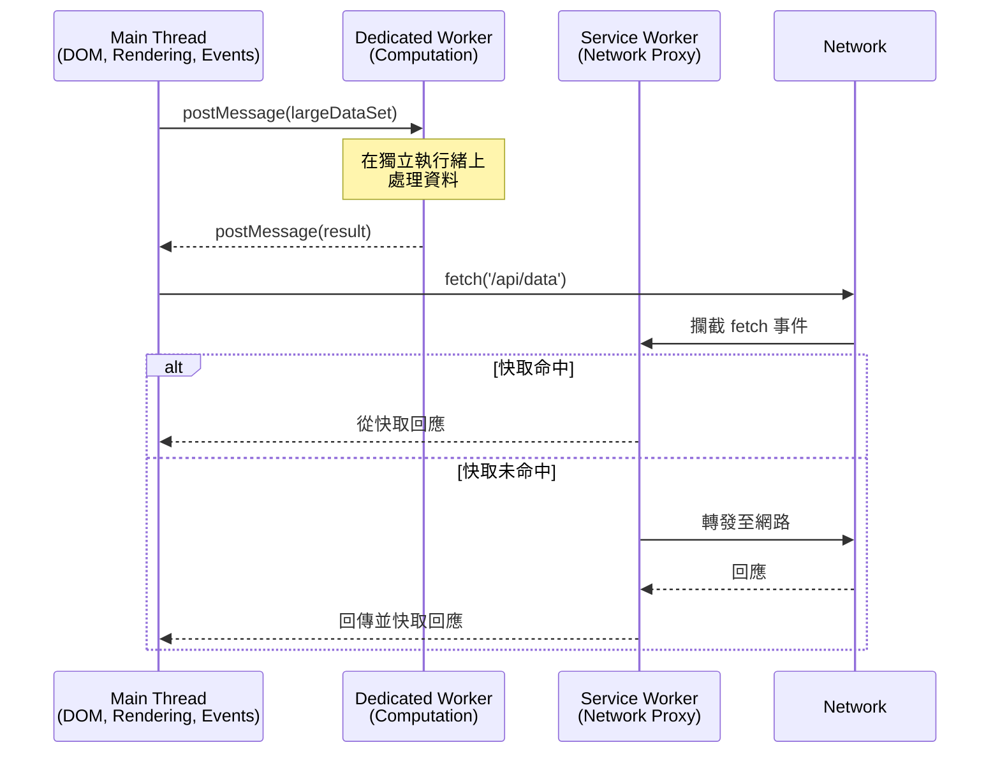

# [FEE-405] Web Workers 與並行處理

:::info
JavaScript 是單執行緒的：主執行緒 (main thread) 在同一個執行迴圈中處理 DOM 渲染、使用者輸入和腳本執行。任何長時間執行的運算都會阻塞繪製和事件處理，產生可見的卡頓 (jank)。Web Worker 提供真正的作業系統層級執行緒，在不存取 DOM 的前提下平行執行 JavaScript，透過訊息傳遞 (message passing) 與主執行緒溝通。Service Worker 擴展此模型，充當網路代理 (network proxy)，實現離線快取和推播通知。Worklet 則提供輕量級、與渲染管線整合的執行緒，用於自訂繪製、音訊處理和動畫。理解何時以及如何將工作移出主執行緒，是建構回應性高、效能優異的 Web 應用程式之關鍵。
:::

## 背景

瀏覽器的主執行緒負責三項交錯進行的任務：執行 JavaScript、計算版面配置 (layout) 與樣式 (style)，以及將像素繪製到螢幕上。這些任務共享一個呼叫堆疊 (call stack)。當一個腳本執行超過 50 毫秒，瀏覽器在這段期間無法重新繪製或回應使用者輸入 -- 這就是「長任務 (long task)」，會降低感知效能。

Web Worker 在 HTML5 時代被引入以解決此限制。Worker 在獨立的作業系統執行緒中運行，擁有自己的全域範疇 (`DedicatedWorkerGlobalScope` 或 `SharedWorkerGlobalScope`)、自己的事件迴圈 (event loop)，且無法存取 `window`、`document` 或任何 DOM API。通訊完全透過結構化複製演算法 (structured clone algorithm，資料的深層複製) 或可轉移物件 (transferable objects，零複製的所有權轉移) 進行。

平台提供四種不同的 Worker 類型原語 (primitive)，各自針對不同的問題設計：

| 類型 | 全域範疇 | 生命週期 | 使用情境 |
|------|---------|---------|---------|
| Dedicated Worker | `DedicatedWorkerGlobalScope` | 綁定建立它的頁面 | 大量運算、資料處理 |
| Shared Worker | `SharedWorkerGlobalScope` | 綁定 origin（跨分頁存活） | 跨分頁共享狀態（同一 origin） |
| Service Worker | `ServiceWorkerGlobalScope` | 事件驅動，獨立於頁面 | 網路代理、離線快取、推播 |
| Worklet | `WorkletGlobalScope` 子類別 | 綁定渲染管線 | CSS Paint、Audio、Animation |

### 結構化複製與可轉移物件

當你呼叫 `postMessage(data)` 時，瀏覽器使用結構化複製演算法序列化 `data`。它支援大多數內建型別（物件、陣列、Map、Set、Date、RegExp、Blob、ArrayBuffer、ImageBitmap），但不支援函式 (function)、DOM 節點 (node) 或 Error 物件（在某些瀏覽器中）。複製大量資料的成本很高 -- 複製一個 100 MB 的 ArrayBuffer 需要可量測的時間。

可轉移物件 (transferable objects) 完全避免了這個成本。當你轉移一個 ArrayBuffer 時，所有權從發送者移動到接收者，時間複雜度為 O(1)。發送者的參照會變成零長度（被中和 / neutered）：

```js
const buffer = new ArrayBuffer(1024 * 1024 * 100); // 100 MB
worker.postMessage(buffer, [buffer]); // 轉移，非複製
console.log(buffer.byteLength); // 0 -- 所有權已轉移
```

可轉移的型別包括 `ArrayBuffer`、`MessagePort`、`ReadableStream`、`WritableStream`、`TransformStream`、`ImageBitmap` 和 `OffscreenCanvas`。

## 設計思維

### 為何需要 Worker：主執行緒瓶頸

瀏覽器的渲染管線 (rendering pipeline) 運作在固定的時間預算上。以 60 fps 來說，每幀約有 16.6 毫秒。在這個預算內，主執行緒必須處理輸入事件、執行 JavaScript（包括框架的協調 / reconciliation）、計算樣式、執行版面配置、繪製和合成 (composite)。任何超過此預算的 JavaScript 都會導致掉幀。

以典型的 React 渲染週期為例：框架對虛擬 DOM 樹進行 diff、計算哪些真實 DOM 節點需要更新，然後套用這些變更。如果應用程式同時還需要解析一個大型 JSON 回應、排序一個有 10,000 列的表格，或執行加密雜湊，所有這些都在爭搶同一個 16.6 毫秒的預算。

Worker 透過提供真正的平行執行來解決此問題。與 `setTimeout` 或 `requestIdleCallback`（僅將工作排程到同一執行緒的稍後時間）不同，Worker 在獨立的執行緒上運行，可以充分利用另一個 CPU 核心。

### 框架與工具的離線主執行緒模式

**Partytown** 將第三方腳本（分析、廣告、標籤管理器）遷移到 Web Worker 中。第三方腳本是主執行緒爭用的主要來源 -- Google Tag Manager、Facebook Pixel 等腳本經常觸發長任務。Partytown 攔截 Worker 內部的 DOM API 呼叫，並代理到主執行緒，讓這些腳本可以在不阻塞使用者互動的情況下執行。它目前仍處於 beta 階段且需要仔細測試，但展示了隔離不受信任或非關鍵程式碼的模式。

**Comlink**（由 Google Chrome Labs 開發，約 1.1 kB）使用 ES6 Proxy 封裝 `postMessage`，提供類似 RPC 的介面。你不需要手動序列化訊息和匹配請求/回應 ID，而是從 Worker 中暴露一個物件，然後從主執行緒呼叫其方法，就像呼叫本地的非同步函式一樣。這大幅減少了 Worker 通訊的樣板程式碼。

**Vite 和 webpack Worker 打包。** 兩者都支援 `new Worker(new URL('./worker.js', import.meta.url))` 語法，讓 Worker 參與模組圖 (module graph)，具備正確的程式碼分割 (code splitting)、tree shaking 和 HMR。Vite 還支援 `?worker` import 後綴以進行內聯 Worker 打包。

**基於 Worker 的 SSR。** Cloudflare Workers 和類似的邊緣執行環境 (edge runtime) 在 V8 隔離區 (isolate) 中執行 JavaScript（概念上類似 Worker），在靠近使用者的位置進行伺服器端渲染。這種模式將「Worker」概念視為超越瀏覽器的架構原語。

**React concurrent 功能。** 雖然沒有直接使用 Web Worker，但 React 的 concurrent mode（`startTransition`、`useDeferredValue`）解決的是相同的根本問題 -- 在昂貴的渲染期間保持主執行緒的回應性 -- 方法是將渲染拆分為可中斷的單元。其心智模型相似：將緊急工作（使用者輸入）與非緊急工作（重新渲染列表）分開。

### Service Worker 作為 PWA 基礎

Service Worker 在所有 Worker 類型中是獨特的，因為它充當可程式化的網路代理，位於瀏覽器和網路之間。每個來自受控頁面的 fetch 請求都會通過 Service Worker 的 `fetch` 事件處理器，在那裡可以從快取中提供服務、修改或轉發到網路。

其生命週期經過精心設計以確保可靠性：

1. **註冊 (Registration)** -- 頁面呼叫 `navigator.serviceWorker.register('/sw.js')`。瀏覽器下載並解析腳本。
2. **安裝 (Install)** -- `install` 事件觸發。這是預快取靜態資源的時機。Worker 已「安裝」但尚未啟用。
3. **等待 (Waiting)** -- 如果舊的 Service Worker 仍在控制頁面，新的會等待。這防止兩個版本同時運行。
4. **啟用 (Activate)** -- 當沒有頁面使用舊 Worker 時，新的會啟用。`activate` 事件是清理舊快取的時機。
5. **Fetch/Push/Sync** -- 啟用的 Worker 攔截網路請求，並處理推播通知和背景同步事件。

此生命週期意味著更新預設是安全的 -- 使用者永遠不會得到一半舊、一半新的資源組合。代價是複雜性：開發者必須管理快取版本，並理解等待狀態。

## 最佳實踐

**將 CPU 密集型工作卸載至 Worker，絕不阻塞主執行緒。** 任何持續超過數毫秒的運算都應該移至 Dedicated Worker 執行。主執行緒必須保持可用以處理渲染和輸入事件；排序大型資料集、解析大型 JSON、執行加密運算或影像處理等任務都是卸載的候選對象。僅在工作確實輕量且可中斷時，才使用 `setTimeout` 或 `requestIdleCallback`。

**只有在真正需要共享記憶體時，才使用 `SharedArrayBuffer` 與 `Atomics`。** 共享記憶體雖能避免複製，但引入了同步複雜度，且需要跨源隔離標頭（`Cross-Origin-Opener-Policy: same-origin` 與 `Cross-Origin-Embedder-Policy: require-corp`）。當可轉移的 `ArrayBuffer` 能達成相同目的時，應避免使用 `SharedArrayBuffer` — 轉移所有權的時間複雜度為 O(1) 且不需要鎖定機制。`SharedArrayBuffer` 應保留給兩個執行緒需要同時讀寫同一塊記憶體的場景，例如 WebAssembly 多執行緒。

**在不再需要 Worker 時終止它。** 每個 Worker 消耗一個作業系統執行緒和相關記憶體。任務完成後必須透過 `worker.terminate()` 終止 Worker，在路由切換時建立 Worker 的單頁應用程式中尤為重要。對於重複性任務，應重複使用單一長壽命的 Worker 實例，而非每次操作都建立並丟棄 Worker。

**使用訊息抽象層（如 Comlink）取代原始的 `postMessage`。** 原始 `postMessage` 需要手動序列化指令、匹配請求與回應 ID，並在兩端處理錯誤。Comlink 等函式庫使用 ES6 Proxy 將其封裝為 RPC 風格的介面，讓你能以非同步函式的方式呼叫 Worker 的方法。除非套件大小或相依限制使引入函式庫不切實際，否則這應是非簡單 Worker 通訊的預設選擇。

## 視覺化



**解讀此圖：** 主執行緒透過 `postMessage` 將大量運算卸載給 Dedicated Worker，保持 UI 的回應性。另外，所有網路請求都通過 Service Worker，它可以立即提供快取的回應，或從網路取得並快取結果。這是兩種獨立的並行模式：運算平行處理 (Worker) 與網路攔截 (Service Worker)。

## 範例

### 1. Dedicated Worker 處理大量運算

**worker.js：**

```js
// worker.js -- 在獨立執行緒中運行
self.addEventListener('message', (event) => {
  const { numbers } = event.data;

  // 模擬昂貴運算：找出範圍內所有質數
  const primes = numbers.filter((n) => {
    if (n < 2) return false;
    for (let i = 2, sqrt = Math.sqrt(n); i <= sqrt; i++) {
      if (n % i === 0) return false;
    }
    return true;
  });

  self.postMessage({ primes });
});
```

**main.js：**

```js
// main.js -- 在主執行緒上運行
const worker = new Worker(new URL('./worker.js', import.meta.url));

// 將資料傳送給 Worker
const numbers = Array.from({ length: 1_000_000 }, (_, i) => i);
worker.postMessage({ numbers });

// 在不阻塞主執行緒的情況下接收結果
worker.addEventListener('message', (event) => {
  console.log(`Found ${event.data.primes.length} primes`);
});

// 完成後清理資源
worker.addEventListener('error', (event) => {
  console.error('Worker error:', event.message);
  worker.terminate();
});
```

### 2. 使用 Comlink 實現符合人體工學的 Worker RPC

**math-worker.js：**

```js
// math-worker.js
import { expose } from 'comlink';

const mathService = {
  fibonacci(n) {
    if (n <= 1) return n;
    let a = 0, b = 1;
    for (let i = 2; i <= n; i++) {
      [a, b] = [b, a + b];
    }
    return b;
  },

  // Comlink 透明地支援非同步方法
  async processCSV(csvText) {
    const rows = csvText.split('\n').map((row) => row.split(','));
    // 在 Worker 執行緒上進行昂貴的彙總
    return rows.reduce((sum, row) => sum + Number(row[1] || 0), 0);
  },
};

expose(mathService);
```

**main.js：**

```js
// main.js
import { wrap } from 'comlink';

const mathWorker = wrap(
  new Worker(new URL('./math-worker.js', import.meta.url))
);

// 像呼叫本地非同步函式一樣呼叫 Worker 方法
const fib50 = await mathWorker.fibonacci(50);
console.log(`Fibonacci(50) = ${fib50}`);

const total = await mathWorker.processCSV(largeCsvString);
console.log(`CSV total: ${total}`);
```

### 3. Service Worker 基本離線快取

**註冊 Service Worker (main.js)：**

```js
if ('serviceWorker' in navigator) {
  navigator.serviceWorker
    .register('/sw.js')
    .then((reg) => console.log('SW registered, scope:', reg.scope))
    .catch((err) => console.error('SW registration failed:', err));
}
```

**sw.js (stale-while-revalidate 策略)：**

```js
const CACHE_NAME = 'app-v1';
const PRECACHE_URLS = [
  '/',
  '/index.html',
  '/styles.css',
  '/app.js',
  '/offline.html',
];

// Install：預快取應用程式殼層
self.addEventListener('install', (event) => {
  event.waitUntil(
    caches.open(CACHE_NAME).then((cache) => cache.addAll(PRECACHE_URLS))
  );
  self.skipWaiting(); // 立即啟用（請謹慎使用）
});

// Activate：清理舊快取
self.addEventListener('activate', (event) => {
  event.waitUntil(
    caches.keys().then((names) =>
      Promise.all(
        names
          .filter((name) => name !== CACHE_NAME)
          .map((name) => caches.delete(name))
      )
    )
  );
  self.clients.claim(); // 接管已開啟的頁面
});

// Fetch：stale-while-revalidate
self.addEventListener('fetch', (event) => {
  event.respondWith(
    caches.open(CACHE_NAME).then(async (cache) => {
      const cached = await cache.match(event.request);

      // 無論如何都發起網路請求（以更新快取）
      const networkPromise = fetch(event.request)
        .then((response) => {
          // 僅快取成功的同源回應
          if (response.ok && response.type === 'basic') {
            cache.put(event.request, response.clone());
          }
          return response;
        })
        .catch(() => {
          // 網路失敗時，對導航請求回傳離線頁面
          if (event.request.mode === 'navigate') {
            return cache.match('/offline.html');
          }
          return undefined;
        });

      // 立即回傳快取，在背景更新
      return cached || networkPromise;
    })
  );
});
```

## 常見錯誤

### 1. Service Worker 快取過期內容而沒有版本策略

若沒有快取版本控制，使用者可能會無限期地收到過時的資源。務必在快取名稱中包含版本識別碼，並在啟用階段清理舊快取：

```js
// 不好：單一未版本化的快取 -- 無法失效
const CACHE = 'my-cache';

// 好：版本化快取並清理
const CACHE = 'my-cache-v3';

self.addEventListener('activate', (event) => {
  event.waitUntil(
    caches.keys().then((names) =>
      Promise.all(
        names
          .filter((name) => name !== CACHE)
          .map((name) => caches.delete(name))
      )
    )
  );
});
```

### 2. 使用 SharedArrayBuffer 卻未設定跨源隔離標頭

`SharedArrayBuffer` 要求頁面處於跨源隔離 (cross-origin isolated) 狀態。在現代瀏覽器中，沒有正確的 HTTP 標頭，建構函式會拋出 `TypeError`。這是在 Spectre 漏洞揭露後強制要求的，以防止透過計時攻擊 (timing attack) 洩漏跨源資料：

```
# 主文件所需的 HTTP 回應標頭
Cross-Origin-Opener-Policy: same-origin
Cross-Origin-Embedder-Policy: require-corp
```

```js
// 使用前先檢查
if (self.crossOriginIsolated) {
  const sab = new SharedArrayBuffer(1024);
  const view = new Int32Array(sab);
  // 使用 Atomics 進行執行緒安全存取
  Atomics.store(view, 0, 42);
  Atomics.notify(view, 0);
} else {
  console.warn('SharedArrayBuffer 不可用：頁面未處於跨源隔離狀態');
}
```

注意：這些標頭可能會破壞未包含 `Cross-Origin-Resource-Policy` 標頭的第三方嵌入（iframe、圖片、腳本）。遷移至跨源隔離需要稽核所有嵌入的資源。

## 相關 FEE

| FEE | 關聯性 |
|-----|--------|
| [FEE-400 瀏覽器 API 與 Web 平台概覽](./400.md) | 上層分類。建立了事件迴圈、任務佇列和執行時模型，Worker 以獨立執行緒擴展這些概念。 |
| [FEE-301 非同步模式與 Promise](../JavaScript%20Core/301.md) | Worker 透過非同步訊息溝通。基於 Promise 的封裝（以及 Comlink 等函式庫）建立在 FEE-301 涵蓋的非同步模式之上。 |
| [FEE-306 記憶體管理與 GC](../JavaScript%20Core/306.md) | 可轉移物件、SharedArrayBuffer 和 Worker 生命週期直接影響記憶體管理策略。 |
| [FEE-1300 效能](../Performance/1300.md) | 將運算移出主執行緒是核心效能最佳化手段。長任務偵測和 Worker 卸載是互補的技術。 |

## 參考資料

- [WHATWG HTML: Web Workers](https://html.spec.whatwg.org/multipage/workers.html) -- Dedicated 和 Shared Worker 的規範標準
- [MDN: Web Workers API](https://developer.mozilla.org/en-US/docs/Web/API/Web_Workers_API) -- API 參考與概念概覽
- [MDN: Using Web Workers](https://developer.mozilla.org/en-US/docs/Web/API/Web_Workers_API/Using_web_workers) -- 建立和與 Worker 通訊的實務指南
- [MDN: Service Worker API](https://developer.mozilla.org/en-US/docs/Web/API/Service_Worker_API) -- Service Worker 的 API 參考
- [web.dev: The Service Worker Lifecycle](https://web.dev/articles/service-worker-lifecycle) -- Install、activate 和 fetch 階段的詳細說明
- [web.dev: Service Workers](https://web.dev/learn/pwa/service-workers) -- PWA 基礎中的 Service Worker
- [MDN: SharedArrayBuffer](https://developer.mozilla.org/en-US/docs/Web/JavaScript/Reference/Global_Objects/SharedArrayBuffer) -- 共享記憶體與 Atomics API 參考
- [web.dev: Making your website cross-origin isolated](https://web.dev/articles/coop-coep) -- SharedArrayBuffer 所需的 COOP/COEP 標頭
- [MDN: Worklet](https://developer.mozilla.org/en-US/docs/Web/API/Worklet) -- CSS Paint、Audio 和 Animation Worklet 概覽
- [Comlink (GitHub)](https://github.com/GoogleChromeLabs/comlink) -- 簡化 Worker 通訊的類 RPC 函式庫
- [Partytown (GitHub)](https://github.com/QwikDev/partytown) -- 將第三方腳本卸載至 Web Worker
