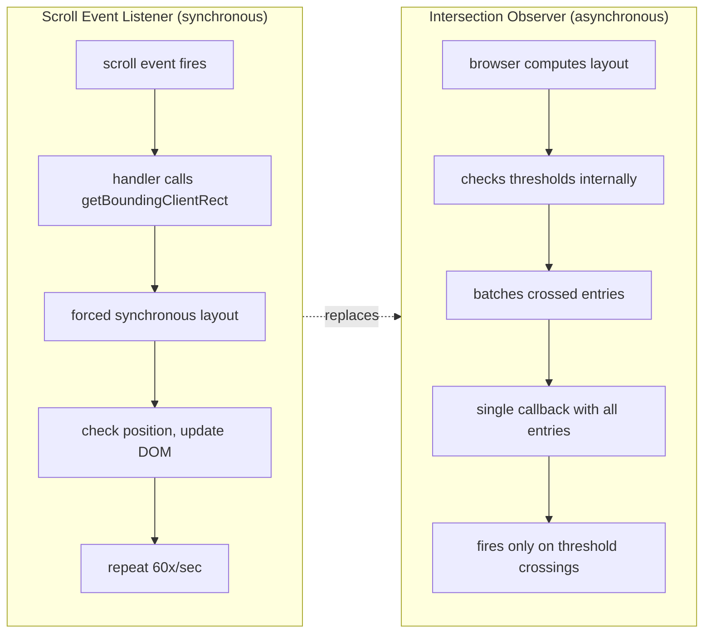

# [FEE-406] Intersection Observer、Resize Observer 與 Mutation Observer

:::info
瀏覽器平台提供三個 Observer API，以宣告式 (declarative)、非同步 (asynchronous) 的回呼取代命令式 (imperative) 的同步事件監聽器，用於監控 DOM 變化。Intersection Observer 偵測元素何時進入或離開可視區域 (viewport)（或可捲動的祖先容器），實現延遲載入 (lazy loading)、無限捲動 (infinite scroll) 和動畫觸發，無需 scroll 監聽器。Resize Observer 獨立於 viewport 報告元素尺寸變化，實現真正的響應式元件和容器感知佈局。Mutation Observer 監控 DOM 樹的變動 -- 子節點新增、屬性變更、文字編輯 -- 安全地監控第三方程式碼和動態內容。三者共享相同的模式：建構觀察器、對目標元素呼叫 `observe()`、在批次回呼中處理變化，完成後呼叫 `disconnect()`。理解這些 API 是建構高效能、無卡頓 Web 應用程式的關鍵。
:::

## 背景

在 Observer API 出現之前，開發者依賴附加在 `scroll`、`resize` 和 DOM Mutation Events 上的事件監聽器來偵測變化。每種方式都有嚴重的效能問題：

**Scroll 監聽器** 在每個捲動事件上同步觸發 -- 單次捲動手勢中可能每秒觸發超過 60 次。每次處理器呼叫通常會呼叫 `getBoundingClientRect()` 或 `offsetTop`，強制瀏覽器執行同步佈局重新計算 (layout thrashing)。一個頁面有 50 張延遲載入的圖片，每張都在每次捲動事件中檢查位置，每秒就會造成數百次強制佈局。

**Resize 監聽器** 在 `window` 上有相同的問題：在拖曳調整大小或方向變更時同步且頻繁觸發。更糟的是，根本沒有方法觀察個別元素的尺寸變化 -- `window.onresize` 只在瀏覽器 viewport 改變時觸發，而非當 flex 容器重新分配空間或側邊欄收合時。

**DOM Mutation Events**（`DOMNodeInserted`、`DOMSubtreeModified`、`DOMAttrModified`）在 DOM Level 3 中被棄用 (deprecated)，因為它們在 DOM 操作中途同步觸發，導致嚴重的效能劣化，並阻止瀏覽器最佳化批次 DOM 變更。它們還會冒泡 (bubble)，表示深層樹中的單一變更可能觸發每個祖先上的處理器。

Observer API 以共同的架構方式解決這些問題：

| 特性 | 事件監聽器 | Observer |
|------|-----------|----------|
| 時序 | 同步，每次發生都觸發 | 非同步，在重繪前批次處理 |
| 頻率 | 每個捲動/調整大小幀（約 60 次/秒） | 僅在閾值交叉或實際變化時 |
| 佈局 | 經常強制同步佈局 | 瀏覽器內部計算交叉/尺寸 |
| 生命週期 | 手動在元素上 add/remove | `observe()` / `unobserve()` / `disconnect()` |
| 範圍 | 全域事件（`window.onscroll`） | 逐元素觀察 |

三個 Observer 都將通知以批次的 entry 物件陣列交付，在單次回呼呼叫中處理，於下一次繪製之前完成。此設計消除了強制佈局、降低回呼頻率，並讓瀏覽器有自由最佳化交付時機。

## 使用情境

你正在開發一個分析功能，記錄使用者捲動了多深以及閱讀了哪些區塊。在 scroll 事件中輪詢 `scrollTop` 每秒觸發數百次，且每次都強制進行佈局重算。`IntersectionObserver` 只在被追蹤的元素進入或離開可視區域時才觸發回呼，開銷遠小於輪詢。Observer API 家族——Intersection、Resize 與 Mutation——為過去需要輪詢或同步量測才能偵測到的變化，提供了事件驅動的通知機制。

## 設計思維

### 從命令式監聽器到宣告式觀察器

演進遵循清晰的模式：**命令式輪詢** 到 **宣告式觀察** 到 **框架抽象**。

**階段 1 -- 命令式監聽器。** 開發者附加 `scroll` 或 `resize` 處理器，手動查詢元素幾何資訊（`getBoundingClientRect()`），與 viewport 邊界比較，並觸發副作用。這需要 throttle/debounce 包裝器、手動追蹤被觀察的元素，以及謹慎的清理工作。程式碼很脆弱 -- 更改捲動容器或新增元素就需要更新監聽器邏輯。

**階段 2 -- 宣告式觀察器。** Observer API 反轉了控制權。不再是每幀詢問「這個元素在哪裡？」，而是告訴瀏覽器「當這個元素跨越這些閾值時通知我。」瀏覽器擁有幾何運算、批次通知，並以非同步方式交付。這消除了 layout thrashing 並大幅簡化程式碼。

**階段 3 -- 框架 Hook。** 函式庫將 Observer 包裝為響應式原語 (reactive primitive)：

- **React**：`react-intersection-observer` 提供 `useInView()`，回傳 `{ ref, inView, entry }`。Hook 自動管理 Observer 生命週期（掛載時建立，卸載時 disconnect）。`usehooks-ts` 提供功能類似的 `useIntersectionObserver`。
- **Vue**：VueUse 提供 `useIntersectionObserver()` 和 `useResizeObserver()` 組合式函式 (composable)，與 Vue 的響應式系統整合，並透過 `onUnmounted` 處理清理。
- **框架圖片元件**：Next.js `Image` 和 Nuxt `NuxtImg` 內部使用 Intersection Observer 實現延遲載入。它們透明地處理佔位符顯示、漸進式載入和 Observer 清理。
- **虛擬捲動**：TanStack Virtual 等函式庫使用 Resize Observer 測量列高，使用 Intersection Observer 判斷哪些列可見，只渲染大型列表中可見的子集。

這個演進 -- 從手動 scroll 監聽器到瀏覽器原生 Observer 再到宣告式 Hook -- 反映了前端更廣泛的演進趨勢：讓平台處理底層關注點，應用程式碼表達意圖。

### 為何 Observer 是非同步且批次處理的

Observer 刻意設計為非同步，有其結構性原因：在佈局或捲動期間同步通知會迫使瀏覽器中斷渲染管線 (rendering pipeline)、交付回呼（可能會變更 DOM），然後從頭重新開始佈局。這正是 Mutation Events 無法使用的原因。

取而代之的是，Observer 回呼被排程為類似微任務 (microtask) 的交付，在佈局計算和下一次繪製之間進行。瀏覽器：

1. 執行佈局並計算元素幾何。
2. 檢查所有已註冊的 Observer 是否符合其閾值。
3. 收集自上次檢查以來所有跨越閾值的元素的 entry。
4. 在單次回呼呼叫中交付所有 entry。
5. 繼續繪製。

這表示監控 100 個元素的 Intersection Observer 每幀最多產生一次回呼呼叫，無論有多少元素發生變化。回呼接收一個 `IntersectionObserverEntry` 物件陣列，每個變化的元素一個。

### 選擇正確的 Observer

| 需求 | Observer | 原因 |
|------|----------|------|
| 元素進入/離開 viewport | Intersection Observer | 基於閾值的可見性偵測 |
| 元素尺寸變化（非 viewport） | Resize Observer | 逐元素尺寸追蹤，獨立於 window resize |
| DOM 結構或屬性變化 | Mutation Observer | 監控 childList、attributes、characterData |
| Window viewport 尺寸變化 | `window.onresize` 或 `visualViewport` | IO/RO 追蹤元素，而非 viewport 本身 |

## 最佳實踐

**元件或小工具卸載時，務必斷開 Observer 連線。** Observer 對其回呼閉包 (closure) 和所有被觀察的元素持有強參照。在單頁應用程式中，若未在路由切換時呼叫 `disconnect()`，Observer、其閉包及所有被捕獲的變數將無限期存活，造成記憶體洩漏。MUST 在 React 的 `useEffect` 清理函式、Vue 的 `onUnmounted`，或等效的解構函式中呼叫 `observer.disconnect()`。

**需要細粒度可見性追蹤時，應為 `IntersectionObserver` 提供閾值陣列。** 預設的 `threshold: 0` 只在元素邊界首次被跨越時觸發，當元素變得更加可見時不會再次觸發。對於進度指示器、廣告曝光衡量，或依賴元素可見比例的動畫序列，SHOULD 指定 `threshold: [0, 0.25, 0.5, 0.75, 1.0]`（或自訂集合）。

**追蹤元素級別的尺寸變化時，應優先使用 `ResizeObserver` 而非 `window.resize`。** `window.onresize` 只在瀏覽器 viewport 改變時觸發，無法偵測 flex 容器重新分配空間、側邊欄切換，或父元素因動態內容而調整大小的情況。只要元件需要響應自身容器尺寸（而非全域 viewport），SHOULD 使用 `ResizeObserver`。

**AVOID 在大型或高頻變動的子樹上，附加未設過濾條件的 `{ subtree: true, attributes: true }` MutationObserver。** 在複雜的應用程式中，以這些選項觀察 `document.body` 可能每幀產生數千個 `MutationRecord` 物件，使回呼不堪負荷，抵消了相較於舊版 Mutation Events 的效能優勢。SHOULD 將觀察範圍縮小至最小必要的根元素，並使用 `attributeFilter` 將屬性觀察限制在程式碼實際需要的特定名稱上。

## 視覺化



**解讀此圖：** 左邊的路徑顯示基於 scroll 的可見性偵測如何運作：每個 scroll 事件觸發一個同步處理器，強制佈局重新計算。右邊的路徑顯示 Intersection Observer 如何達成相同結果：瀏覽器在自身的佈局過程中檢查閾值，並以非同步方式交付批次通知。Observer 路徑消除了強制佈局，並將回呼頻率從每秒約 60 次降低到僅在閾值交叉時觸發。

## 範例

### 1. Intersection Observer -- 延遲載入圖片

```js
// 當圖片進入 viewport 時延遲載入
// 使用 rootMargin 在可見之前 200px 就開始載入
const lazyObserver = new IntersectionObserver(
  (entries) => {
    for (const entry of entries) {
      if (entry.isIntersecting) {
        const img = entry.target;
        img.src = img.dataset.src;
        img.removeAttribute('data-src');
        // 載入後停止觀察 -- 一次性操作
        lazyObserver.unobserve(img);
      }
    }
  },
  {
    rootMargin: '200px 0px', // 在 viewport 前 200px 開始載入
    threshold: 0,            // 任何像素進入時觸發
  }
);

// 觀察所有具有 data-src 屬性的圖片
document.querySelectorAll('img[data-src]').forEach((img) => {
  lazyObserver.observe(img);
});

// 注意：對於簡單情況，原生 loading="lazy" 是首選。
// 當你需要自訂行為時 IO 才有價值：轉場效果、
// 分析追蹤，或預載入相鄰圖片。
```

### 2. Resize Observer -- 響應式元件

```js
// 當容器調整大小時重新繪製的圖表元件。
// 無論容器為何調整大小都能運作 --
// viewport 變化、側邊欄切換，或 flex 重新分配。
class ResponsiveChart {
  constructor(container) {
    this.container = container;
    this.canvas = container.querySelector('canvas');
    this.resizeObserver = new ResizeObserver((entries) => {
      // entries 始終是陣列；我們觀察一個元素
      const entry = entries[0];
      const { inlineSize: width, blockSize: height } =
        entry.contentBoxSize[0];

      // 只在尺寸有顯著變化時重繪
      if (
        Math.abs(width - this.lastWidth) > 1 ||
        Math.abs(height - this.lastHeight) > 1
      ) {
        this.canvas.width = width * devicePixelRatio;
        this.canvas.height = height * devicePixelRatio;
        this.lastWidth = width;
        this.lastHeight = height;
        this.draw();
      }
    });

    this.lastWidth = 0;
    this.lastHeight = 0;
    this.resizeObserver.observe(container);
  }

  draw() {
    const ctx = this.canvas.getContext('2d');
    // ... 圖表繪製邏輯
  }

  destroy() {
    this.resizeObserver.disconnect();
  }
}
```

### 3. Mutation Observer -- 監控第三方 DOM 變更

```js
// 監控第三方腳本注入的 DOM 變更
//（廣告、聊天小工具、分析工具）並強制執行限制
const thirdPartyContainer = document.getElementById('ad-slot');

const mutationObserver = new MutationObserver((mutations) => {
  for (const mutation of mutations) {
    if (mutation.type === 'childList') {
      // 檢查第三方程式碼注入的不想要的元素
      for (const node of mutation.addedNodes) {
        if (node.nodeType === Node.ELEMENT_NODE) {
          // 移除逃離容器的注入 iframe
          if (
            node.tagName === 'IFRAME' &&
            node.style.position === 'fixed'
          ) {
            node.remove();
            console.warn('Blocked breakout iframe from ad slot');
          }
        }
      }
    }

    if (mutation.type === 'attributes') {
      // 防止第三方程式碼修改關鍵屬性
      if (mutation.attributeName === 'style') {
        const el = mutation.target;
        // 強制廣告容器的最大高度
        if (parseInt(el.style.height) > 300) {
          el.style.height = '300px';
        }
      }
    }
  }
});

mutationObserver.observe(thirdPartyContainer, {
  childList: true,
  attributes: true,
  subtree: true,
  attributeFilter: ['style', 'class'],
});

// 當容器從頁面移除時斷開連接
//（例如 SPA 中的路由切換）
function cleanup() {
  mutationObserver.disconnect();
}
```

## 常見錯誤

### 1. 在 Intersection Observer 存在時仍使用 scroll 監聽器

Scroll 監聽器在每幀強制同步佈局。如果你在檢查元素是否可見，請改用 Intersection Observer：

```js
// 錯誤：每秒強制佈局重新計算約 60 次
window.addEventListener('scroll', () => {
  const rect = element.getBoundingClientRect();
  if (rect.top < window.innerHeight && rect.bottom > 0) {
    loadContent();
  }
});

// 正確：非同步、批次處理、無強制佈局
const observer = new IntersectionObserver(([entry]) => {
  if (entry.isIntersecting) {
    loadContent();
    observer.unobserve(entry.target);
  }
});
observer.observe(element);
```

### 2. Intersection Observer threshold=0 遺漏掛載時已在 viewport 中的元素

當使用 `threshold: 0`（預設值）建立 Observer 時，它在元素**跨越**閾值邊界時觸發。觀察開始時已完全在 viewport 內的元素會收到初始 entry -- 但如果延遲觀察（例如在非同步操作之後），可能會遺漏初始交叉。此外，`threshold: 0` 表示回呼在任何單一像素交叉時觸發；當元素變得更可見時不會再次觸發：

```js
// 問題：只在 0% 交叉時收到通知，元素部分或完全可見時不會
const observer = new IntersectionObserver(callback, {
  threshold: 0, // 在邊界交叉時觸發一次
});

// 更好：使用多個閾值追蹤可見性進程
const observer = new IntersectionObserver(callback, {
  threshold: [0, 0.25, 0.5, 0.75, 1.0],
});

// 或者對於一次性偵測，確保觀察在元件掛載期間
// 同步開始，在第一次繪製之前
```

### 3. Resize Observer 在回呼中修改被觀察元素造成迴圈錯誤

如果 Resize Observer 回呼改變了它正在觀察的元素的尺寸，就會觸發另一次觀察，造成無限迴圈。瀏覽器透過交付錯誤事件（`ResizeObserver loop completed with undelivered notifications`）並跳過重新觸發的 entry 來打破迴圈：

```js
// 錯誤：造成 ResizeObserver loop error
const ro = new ResizeObserver((entries) => {
  for (const entry of entries) {
    // 這會改變元素的尺寸，觸發另一個回呼
    entry.target.style.width =
      entry.contentBoxSize[0].inlineSize + 10 + 'px';
  }
});

// 正確：追蹤預期尺寸以打破循環
const expectedSizes = new WeakMap();
const ro = new ResizeObserver((entries) => {
  for (const entry of entries) {
    const currentWidth = entry.contentBoxSize[0].inlineSize;
    if (currentWidth === expectedSizes.get(entry.target)) {
      continue; // 已是預期尺寸，跳過
    }
    const newWidth = currentWidth + 10;
    entry.target.style.width = newWidth + 'px';
    expectedSizes.set(entry.target, newWidth);
  }
});
```

## 相關 FEE

| FEE | 關聯性 |
|-----|--------|
| [FEE-400 瀏覽器 API 與 Web 平台概覽](./400.md) | 上層分類。Observer 建立在 FEE-400 所述的事件迴圈和渲染管線之上。 |
| [FEE-401 DOM 操作與遍歷](./401.md) | Mutation Observer 監控 FEE-401 中技術所做的 DOM 變更。Intersection 和 Resize Observer 查詢由 DOM 管理的元素幾何資訊。 |
| [FEE-301 非同步模式與 Promise](../JavaScript%20Core%20and%20Runtime/301.md) | Observer 回呼是非同步的。框架 Hook 將 Observer 包裝為 FEE-301 涵蓋的 Promise 式或響應式模式。 |
| [FEE-306 記憶體管理與 GC](../JavaScript%20Core%20and%20Runtime/306.md) | 未 disconnect Observer 會造成記憶體洩漏。Observer 生命週期管理直接關聯到 FEE-306 討論的 GC 和閉包保留。 |

## 參考資料

- [W3C Intersection Observer Specification](https://www.w3.org/TR/intersection-observer/) -- 定義閾值、rootMargin 和非同步交付語意的規範標準
- [W3C Resize Observer Specification](https://www.w3.org/TR/resize-observer-1/) -- 定義觀察模型和 box 選項的規範標準
- [WHATWG DOM: MutationObserver](https://dom.spec.whatwg.org/#interface-mutationobserver) -- MutationObserver 介面和 MutationRecord 的規範標準
- [MDN: Intersection Observer API](https://developer.mozilla.org/en-US/docs/Web/API/Intersection_Observer_API) -- 含範例的完整 API 參考
- [MDN: ResizeObserver](https://developer.mozilla.org/en-US/docs/Web/API/ResizeObserver) -- 涵蓋 borderBoxSize、contentBoxSize 和迴圈錯誤的 API 參考
- [MDN: MutationObserver](https://developer.mozilla.org/en-US/docs/Web/API/MutationObserver) -- 包含 observe 選項和 MutationRecord 詳細資訊的 API 參考
- [web.dev: Lazy Loading Images and Video](https://web.dev/articles/lazy-loading-images) -- 使用原生和 IO 方式延遲載入圖片的最佳實踐
- [VueUse: useIntersectionObserver](https://vueuse.org/core/useintersectionobserver/) -- 包裝 Intersection Observer 的 Vue 組合式函式
- [react-intersection-observer (GitHub)](https://github.com/thebuilder/react-intersection-observer) -- 具有 `useInView` 的 React Intersection Observer Hook
