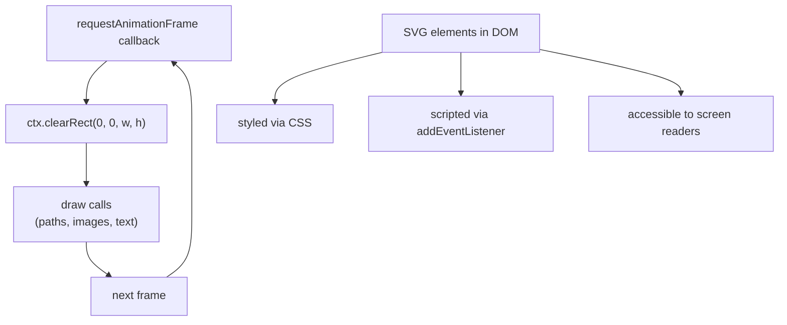

# [FEE-407] Canvas 2D 與 SVG

:::info
瀏覽器提供了兩種根本不同的圖形渲染方式：Canvas 2D API 與可縮放向量圖形（SVG）。Canvas 是一種命令式、以像素為基礎的繪圖表面——你透過 JavaScript 發出繪圖指令，瀏覽器將其合成為點陣圖。SVG 是一種宣告式、整合於 DOM 的向量格式——形狀以 XML 元素呈現，瀏覽器負責渲染、樣式設定，並向輔助技術公開這些元素。兩者並無絕對優劣之分，它們解決的是不同的問題。選擇正確的工具需要理解渲染模型、可及性、效能特性與開發者人體工學之間的取捨。
:::

## 簡介

`<canvas>` 元素透過 context 物件，將原始像素緩衝區完全交由 JavaScript 控制。透過 `canvas.getContext('2d')` 取得 `CanvasRenderingContext2D` 後，你可以使用涵蓋路徑、矩形、弧形、文字、圖片、漸層以及像素層級 `ImageData` 操作的完整 API。瀏覽器渲染你所繪製的內容，在 DOM 中不保留任何記錄，也不提供內建的命中測試或可及性樹狀整合。這種簡潔性既是優點也是限制：Canvas 能在無 DOM 開銷的情況下維持 60 fps 的動畫迴圈，但它無法表達語意、響應 CSS 變更，或在沒有額外手動處理的情況下被螢幕閱讀器查詢。

SVG 存在於 DOM 之中。以 `<circle cx="100" cy="100" r="40" />` 繪製的圓形是一個真實的 DOM 節點，擁有計算後的樣式、邊界框、事件監聽器、ARIA 屬性以及完整的 CSS 繼承。設計師可以用樣式表為其設定樣式。開發者可以用 `querySelector` 操作它。螢幕閱讀器透過可及性樹來朗讀它。瀏覽器在縮放 SVG 時不會失真，因為渲染器在每次重繪時都會以目標 DPI 重新計算路徑——在最終合成之前沒有點陣化步驟。這使得 SVG 非常適合圖示、插圖以及資料視覺化，在這些場景中，忠實度和可及性比輸出量更重要。

理解何時使用哪種技術——以及如何正確使用——是前端工程的核心能力。最常見的錯誤是在 SVG 只需一半程式碼且可及性更佳的情況下，將 Canvas 視為預設的圖形工具。第二常見的錯誤是在高 DPI 螢幕上使用 Canvas 時，未針對 `devicePixelRatio` 進行修正，導致模糊的輸出結果。本文從基礎原則出發介紹兩種技術，包括用於將渲染完全移出主執行緒的 `OffscreenCanvas` API。

## 使用情境

你正在開發一個資料視覺化功能，需要呈現每秒更新數百個資料點的即時圖表。用 DOM 元素渲染這些資料，每次更新都會產生大量佈局計算。帶有 2D 繪圖環境的 `<canvas>` 直接以像素描繪——沒有 DOM 節點、沒有佈局——使其適用於 DOM 開銷難以承受的高頻渲染場景。SVG 適合各個元素需要互動或以 CSS 設定樣式的圖表；Canvas 則適合追求原始像素輸出效能的高吞吐量渲染。

## 設計思維

### 即時模式與保留模式

Canvas 使用**即時模式**渲染模型：你的程式碼就是場景圖。你發出一系列繪圖指令——`beginPath()`、`arc()`、`fill()`、`drawImage()`——瀏覽器按順序執行，將像素寫入後備緩衝區。一幀結束後，瀏覽器將緩衝區合成到螢幕上。下一幀重新開始，清除緩衝區並從頭重繪所有內容。沒有撤銷操作，也沒有「改變圓形顏色」的方式——若要更新某個元素，你必須重繪受影響的區域或整個 canvas。

SVG 使用**保留模式**模型：瀏覽器以活動 DOM 樹的形式擁有場景圖。當你呼叫 `circle.setAttribute('fill', '#ef4444')` 時，瀏覽器將該元素的渲染區域標記為臟，並安排只重繪該區域。你從不直接操作像素。這對於稀疏、互動式的場景在開發上更為簡單——滑鼠懸停狀態、點擊回饋、工具提示位置——但當每個元素都在每一幀都進行動畫時，擴展性較差，因為所有的 DOM 屬性變更、樣式重新計算和繪製失效加在一起，會比單一的 `clearRect` + 重繪週期更快積累成本。

### 選擇正確的工具

這個決定不在於哪種技術「更好」，而在於哪種渲染模型適合使用場景的更新模式：

| 使用場景 | Canvas 2D | SVG |
|---|---|---|
| 即時動畫（60 fps 遊戲迴圈） | 是 | 否 |
| 像素操作（濾鏡、圖片編輯） | 是 | 否 |
| 可縮放圖示與插圖 | 否 | 是 |
| 互動式圖解（節點、邊、懸停） | 均可 | 偏好 SVG |
| 具螢幕閱讀器標籤的可及性圖表 | 否 | 是 |
| 非主執行緒渲染（Web Worker） | 是（OffscreenCanvas） | 否 |

對於互動式圖解，兩種技術都可行。D3.js 等函式庫產生 SVG，免費提供 CSS 過渡效果和 DOM 事件。Pixi.js 等函式庫使用 Canvas（或 WebGL），可擴展至數千個動畫節點。決定因素通常是圖解中同時動畫的元素數量：幾百個以下，SVG 的便利性勝出；幾百個以上且有逐幀移動，Canvas 的吞吐量勝出。

### devicePixelRatio 問題

在現代顯示器上，每個 Canvas 專案都必須處理高 DPI（Retina、HiDPI）螢幕。CSS 像素是一種抽象概念。在具有 2x Retina 顯示器的 MacBook Pro 上，一個 CSS 像素對應 4 個實體像素（2 × 2）。如果你在 CSS 中設定 `canvas.width = 400` 和 `canvas.height = 300`，但 canvas 元素的固有尺寸也設為 `canvas.width = 400`，瀏覽器會將 400 像素的緩衝區拉伸以填充 800 個實體像素的區域，使每條線和文字都模糊。

正確的做法是查詢 `window.devicePixelRatio`（在 Retina 上通常為 2，在高端行動裝置上為 3），將 canvas 固有尺寸設定為「CSS 尺寸 × dpr」，然後呼叫 `ctx.scale(dpr, dpr)`，使所有繪圖座標繼續使用 CSS 像素單位。CSS 的 `width` 和 `height` 將 canvas 保持在其預期的視覺尺寸。每次 canvas 調整大小時都必須重複此步驟——包括視窗調整大小事件——因為使用者可能在具有不同像素密度的顯示器之間拖動視窗。

### OffscreenCanvas 與 Web Workers

主執行緒由 JavaScript 執行、樣式計算、版面配置、繪製和合成共用。每幀超過 16 ms（60 fps）的 Canvas 動畫迴圈將導致掉幀，因為它會延遲所有其他主執行緒的工作。`OffscreenCanvas` 將 canvas 像素緩衝區的控制權轉移給 Web Worker，在那裡渲染在獨立的執行緒上運行。主執行緒可以自由處理使用者輸入並運行應用程式邏輯，而無需與繪製呼叫競爭。

`transferControlToOffscreen()` 返回一個可以透過 `postMessage` 與傳輸列表一起傳送給 worker 的 `OffscreenCanvas` 物件。在 worker 內部，`OffscreenCanvas` 公開與普通 canvas 相同的 `getContext('2d')` API，因此現有的繪圖程式碼只需少量修改。瀏覽器自動將 worker 的輸出合成到螢幕上。由於 worker 在獨立的 OS 執行緒上運行，耗時的繪製操作不會阻塞主執行緒的使用者輸入。當 Canvas 動畫迴圈被測量為主執行緒瓶頸時，團隊 SHOULD 考慮使用 OffscreenCanvas。

## 最佳實踐

**在 canvas 設定時始終修正 `devicePixelRatio`。** 取得 `window.devicePixelRatio ?? 1`，將 canvas 固有寬度和高度乘以此係數，保持 CSS 尺寸不變，並呼叫 `ctx.scale(dpr, dpr)`。附加 `ResizeObserver`（或至少是 `resize` 視窗監聽器），在 canvas 的 CSS 尺寸變化時重新執行此設定。不這樣做會在每台 Retina 和 HiDPI 顯示器上產生模糊的輸出——這涵蓋了現代筆記型電腦、手機和高端顯示器的絕大多數。

**在動畫迴圈的每一幀之前清除 canvas。** 在每個幀回呼的第一個操作中呼叫 `ctx.clearRect(0, 0, width, height)`。在不清除前一幀像素的情況下繼續繪製會導致「殘影」——先前位置的運動軌跡仍然可見，產生塗抹瑕疵。`clearRect` 成本很低：它以透明黑色填充矩形區域，而不觸發任何路徑光柵化工作。

**在元件卸載時取消動畫迴圈。** `requestAnimationFrame` 返回一個數字 ID。將其存儲在清理路徑可存取的變數中。當元件卸載時（React 的 `useEffect` 清理函式、Vue 的 `onUnmounted`，或手動的拆解函式），呼叫 `cancelAnimationFrame(id)`。未取消的迴圈會無限期繼續執行，持有對 canvas context、元件閉包變數和任何相關狀態的參考。這會導致記憶體洩漏並在不可見的渲染上浪費 CPU 週期。

**對需要可及性的靜態和半靜態圖形使用 SVG。** 如果圖表不是每幀都在動畫——一個條形圖、一個圓餅圖、一個偶爾有懸停狀態的節點連結圖——SVG 幾乎總是更好的選擇。每個 `<rect>`、`<path>` 和 `<text>` 元素都可以攜帶 `aria-label`、`role` 和 `tabindex` 屬性。螢幕閱讀器可以枚舉它們。鍵盤使用者可以導航它們。CSS 過渡效果可以在不需要 JavaScript 的情況下對其進行動畫處理。產生等效的可及性 Canvas 圖形需要手動維護命中圖、焦點環和 ARIA 即時區域——而 SVG 免費涵蓋了這一切，無需任何額外程式碼。

**對像素層級操作使用 `ImageData`，而非 CSS 濾鏡。** 當你需要對 canvas 內容的特定區域套用圖片處理效果（灰階、深褐色、閾值、模糊）時，`ctx.getImageData()` 提供一個可在迴圈中操作的 RGBA 值扁平 `Uint8ClampedArray`。處理後，`ctx.putImageData()` 將修改後的像素寫回。此方法是同步的，對於大型圖片會阻塞主執行緒——考慮使用 `OffscreenCanvas` 或透過 `postMessage` 傳輸的 `ImageBitmap` 將像素處理移至 Web Worker。

**保持 SVG viewBox 和座標系統明確。** 始終在 SVG 元素上定義 `viewBox` 屬性：`viewBox="0 0 200 200"` 獨立於渲染尺寸建立內部座標系統。這使 SVG 檔案可移植——設計師可以在 200×200 單位中編寫，SVG 在任何 CSS 尺寸下都能正確渲染。沒有 `viewBox`，SVG 使用固有像素尺寸，這會阻止流暢縮放。

**優先使用 `<use>` 和 `<symbol>` 實現可重複使用的 SVG 形狀。** 在 `<defs>` 區塊中將形狀範本定義為帶有 `id` 屬性的 `<symbol>` 元素。透過 `<use href="#symbol-id" />` 引用它們。這降低了重複元素（列表中的圖示、重複的圖表標記）的 DOM 節點數量，並允許對 symbol 的單一屬性變更傳播到所有實例。

**批次處理 canvas 繪圖呼叫以最小化狀態切換。** 每次變更 `ctx.fillStyle`、`ctx.strokeStyle`、`ctx.font` 或 `ctx.globalAlpha` 都有成本。如果你正在繪製數百個相同顏色的形狀，將所有相同顏色的形狀分組在一起，在批次處理之前發出單一的 `ctx.fillStyle = color`，而非每個形狀都切換一次。同樣地，構建一個聚合許多子路徑的單一 `Path2D` 物件，呼叫一次 `ctx.fill(path)`，而非在緊密迴圈中反覆呼叫 `beginPath()` / `fill()`。當幾何形狀在幀之間不變時，`Path2D` 物件也可以被快取並跨幀重複使用。

**必須（MUST）在選定 Canvas 或 SVG 之前，理解使用場景所需的渲染更新模式。** 保留模式渲染（SVG）適合稀疏更新，即每幀只有少數元素需要變更；即時模式渲染（Canvas）適合全場景重繪，即每幀幾乎所有元素都在移動。在未先確認主要更新模式的情況下就決定渲染技術，會導致難以在元件圖建立後再逆轉的架構選擇。

**避免在關鍵路徑上讀取像素資料。** `getImageData` 和 `toDataURL` 都會強制瀏覽器清空 GPU 管線並將像素資料從 GPU 讀回 CPU，這可能需要數毫秒。在 `requestAnimationFrame` 迴圈中呼叫任一方法都會導致掉幀。將 `getImageData` 保留給由使用者事件觸發的單次操作（匯出、濾鏡套用、複雜路徑上的命中偵測），而非用於逐幀查詢。如果需要測試滑鼠游標是否懸停在繪製的形狀上，在 JavaScript 中維護形狀的平行 CPU 端表示，並用幾何程式碼執行命中測試，而非讀取像素。

## Mermaid 圖



左側迴圈說明了 Canvas 即時模式渲染週期：每一幀從清除開始，然後是所有繪圖呼叫，再將控制權交還給瀏覽器，瀏覽器安排下一幀。右側子圖展示了 SVG 的保留模式架構：元素持續存在於 DOM 中，從 CSS 接收樣式，響應 JavaScript 事件，並自動在可及性樹中呈現——除非你透過 JavaScript 或 CSS 明確對屬性進行動畫處理，否則不需要逐幀重繪迴圈。

兩個子圖刻意保持斷開：Canvas 迴圈與 SVG 部分之間沒有箭頭。這反映了它們在實踐中的關係——Canvas 和 SVG 是同一個 HTML 文件中獨立的渲染系統。你可以將 SVG 元素放在 canvas 元素旁邊，將 Canvas 渲染的紋理與 SVG 疊加層組合（使用絕對定位的圖層），或者隨著需求演進用一個替換另一個，因為它們共享相同的 CSS 版面配置模型和 JavaScript 事件系統，但擁有完全獨立的渲染管線。

## 範例

### 概覽

以下範例從初始 canvas 設定開始，依序涵蓋動畫、像素處理、非主執行緒渲染，以及 SVG 互動。每個程式碼片段都足夠獨立，可以複製到專案中使用，但它們共享設定步驟中相同的 `canvas` 和 `ctx` 變數。初次閱讀時請按順序閱讀。

### HTML：帶有 CSS 尺寸的 canvas 元素

```html
<!-- index.html: canvas with devicePixelRatio correction -->
<canvas id="c"></canvas>
<style>
  #c { width: 400px; height: 300px; }
</style>
```

`<canvas>` 元素在 HTML 中沒有設定固有尺寸——這是有意為之的。CSS 將視覺尺寸固定在 400×300 px。下面的 TypeScript 程式碼動態設定實際像素緩衝區大小，考慮到設備像素比。

### TypeScript：高 DPI Canvas 設定

```ts
// canvas-setup.ts — correct high-DPI scaling
const canvas = document.getElementById('c') as HTMLCanvasElement;
const ctx = canvas.getContext('2d')!;

function resizeCanvas() {
  const dpr = window.devicePixelRatio ?? 1;
  const rect = canvas.getBoundingClientRect();
  // Physical pixels — must match CSS size × dpr
  canvas.width = rect.width * dpr;
  canvas.height = rect.height * dpr;
  // Scale all drawing operations to match CSS size
  ctx.scale(dpr, dpr);
}
resizeCanvas();
window.addEventListener('resize', resizeCanvas);
```

`getBoundingClientRect()` 返回套用樣式表後瀏覽器分配的 canvas CSS 版面配置尺寸。乘以 `devicePixelRatio` 得到該區域佔用的實體像素數量。將 `canvas.width` 和 `canvas.height` 設定為這些值可創建具有正確解析度的緩衝區。值得注意的是，重新賦值 `canvas.width` 或 `canvas.height` 會自動將整個 canvas context 狀態（包括變換矩陣）重設為預設值。這正是每次 resize 後呼叫 `ctx.scale(dpr, dpr)` 既必要又安全的原因：重設保證了乾淨的基準狀態，因此縮放係數不會在多次 resize 事件中累積。隨後的 `ctx.scale(dpr, dpr)` 將所有繪圖座標從 CSS 像素映射回實體像素，因此在 `(100, 75)` 繪圖的程式碼仍然命中視覺上正確的位置。

### TypeScript：使用 `requestAnimationFrame` 的動畫迴圈

```ts
// animation-loop.ts — bouncing circle with requestAnimationFrame
interface Circle {
  x: number;
  y: number;
  vx: number;
  vy: number;
  radius: number;
}

const circle: Circle = { x: 200, y: 150, vx: 3, vy: 2, radius: 20 };
let rafId: number;

function draw(timestamp: number) {
  const { width, height } = canvas.getBoundingClientRect();

  ctx.clearRect(0, 0, width, height);

  // Update position
  circle.x += circle.vx;
  circle.y += circle.vy;

  // Bounce off walls
  if (circle.x + circle.radius > width || circle.x - circle.radius < 0) circle.vx *= -1;
  if (circle.y + circle.radius > height || circle.y - circle.radius < 0) circle.vy *= -1;

  // Draw circle
  ctx.beginPath();
  ctx.arc(circle.x, circle.y, circle.radius, 0, Math.PI * 2);
  ctx.fillStyle = '#3b82f6';
  ctx.fill();

  rafId = requestAnimationFrame(draw);
}

rafId = requestAnimationFrame(draw);

// Cleanup — call this on component unmount
function stopAnimation() {
  cancelAnimationFrame(rafId);
}
```

`requestAnimationFrame` 安排 `draw` 在瀏覽器下一次重繪之前執行，與顯示刷新率同步（通常為 60 fps，在 ProMotion 顯示器上高達 120 fps）。`timestamp` 參數是一個 `DOMHighResTimeStamp`，可用於計算幀率無關運動的增量時間——此範例為了簡單起見使用固定速度。當 canvas 離開螢幕時必須呼叫 `stopAnimation`；否則 `draw` 回呼會繼續運行，即使沒有任何可見內容。

### TypeScript：像素層級的灰階濾鏡

```ts
// pixel-filter.ts — grayscale filter using ImageData
function applyGrayscale(canvas: HTMLCanvasElement, ctx: CanvasRenderingContext2D) {
  const imageData = ctx.getImageData(0, 0, canvas.width, canvas.height);
  const data = imageData.data; // Uint8ClampedArray: [R,G,B,A, R,G,B,A, ...]

  for (let i = 0; i < data.length; i += 4) {
    const avg = (data[i] + data[i + 1] + data[i + 2]) / 3;
    data[i] = avg;     // R
    data[i + 1] = avg; // G
    data[i + 2] = avg; // B
    // data[i + 3] = alpha — unchanged
  }

  ctx.putImageData(imageData, 0, 0);
}
```

`getImageData` 返回一個 `ImageData` 物件，其 `.data` 屬性是一個 `Uint8ClampedArray`——一個限制在 [0, 255] 範圍內的 8 位元無號整數型別陣列。每個像素佔用四個連續元素：R、G、B、A。迴圈每次迭代處理一個像素，計算三個顏色通道的算術平均值，並將其賦值回所有三個通道，從而將像素去飽和為中性灰色。`putImageData` 將修改後的緩衝區寫回 canvas。注意 `getImageData` 讀取的是實體像素（完整的 `canvas.width × canvas.height` 緩衝區），而非 CSS 像素。

此處使用的 `(R + G + B) / 3` 是為求簡潔而採用的簡化平均值。若需感知上準確的灰階效果，應使用亮度加權公式，例如 `0.299*R + 0.587*G + 0.114*B`（ITU-R BT.601），此公式反映了人眼對各顏色通道的不同敏感程度。

### TypeScript：將 Canvas 傳輸至 Web Worker

```ts
// offscreen-canvas.ts — transfer canvas to Web Worker
const offscreen = canvas.transferControlToOffscreen();
const worker = new Worker('./render-worker.ts', { type: 'module' });
worker.postMessage({ canvas: offscreen }, [offscreen]);
```

`transferControlToOffscreen()` 將 canvas 從主執行緒分離。呼叫後，對原始元素呼叫 `canvas.getContext('2d')` 的任何嘗試都會拋出例外——控制權已被轉移。`offscreen` 物件作為可傳輸物件（`postMessage` 的第二個參數）傳送給 worker，這意味著它是移動而非複製的，沒有序列化開銷。

```ts
// render-worker.ts — runs in Web Worker, no main thread impact
self.onmessage = (e: MessageEvent<{ canvas: OffscreenCanvas }>) => {
  const ctx = e.data.canvas.getContext('2d')!;
  // Draw inside worker — identical Canvas 2D API
  ctx.fillStyle = '#ef4444';
  ctx.fillRect(10, 10, 100, 100);
};
```

在 worker 內部，`OffscreenCanvas.getContext('2d')` 返回一個實作完整 Canvas 2D API 的 `OffscreenCanvasRenderingContext2D`。現有的繪圖程式碼可以以最小的修改移至 worker。瀏覽器自動將 worker 的輸出合成到螢幕上。由於 worker 在獨立的 OS 執行緒上運行，長時間的繪製操作不會阻塞主執行緒的使用者輸入。

### SVG：帶有 JavaScript 事件處理的互動元素

```svg
<!-- interactive-svg.svg — SVG with hover and script -->
<svg width="200" height="200" xmlns="http://www.w3.org/2000/svg"
     aria-label="Interactive circle">
  <circle id="dot" cx="100" cy="100" r="40" fill="#3b82f6"
          role="button" tabindex="0" aria-label="Toggle circle color" />
</svg>
```

```ts
// svg-interaction.ts
const dot = document.getElementById('dot') as SVGCircleElement;
dot.addEventListener('mouseenter', () => dot.setAttribute('fill', '#ef4444'));
dot.addEventListener('mouseleave', () => dot.setAttribute('fill', '#3b82f6'));
dot.addEventListener('keydown', (e: KeyboardEvent) => {
  if (e.key === 'Enter' || e.key === ' ') {
    const current = dot.getAttribute('fill');
    dot.setAttribute('fill', current === '#ef4444' ? '#3b82f6' : '#ef4444');
  }
});
```

SVG 元素是標準的 DOM 節點。`getElementById` 找到它，`addEventListener` 附加事件處理器，`setAttribute` 更新其表現屬性——瀏覽器安排只重繪受影響的區域。

請注意這裡使用的可及性模式：`<svg>` 容器上刻意省略了 `role="img"`。在容器上加入 `role="img"` 會將所有子元素從可及性樹中隱藏，導致互動圓形對輔助技術不可見。正確的做法是在 `<circle>` 元素本身加上 `role="button"` 和 `tabindex="0"`，使其成為可聚焦、可操作的互動控制項。鍵盤處理器響應 `Enter` 和 `Space`，符合按鈕的預期行為。此模式能正確地將互動元素公開至可及性樹，同時保持 SVG 容器作為中立的容納元素。

## 常見錯誤

**省略 `devicePixelRatio` 縮放。** 這是最普遍的 Canvas 錯誤。在 2x Retina 顯示器上，未進行 DPR 修正繪製的 canvas 以一半的實體解析度渲染，並被拉伸以填充 CSS 尺寸——每條邊緣都是模糊的。修正方法始終是設定 `canvas.width = cssWidth * dpr`、`canvas.height = cssHeight * dpr` 以及 `ctx.scale(dpr, dpr)`。在新的 canvas 實作中永遠不要省略這一步。

**在每一幀之前不呼叫 `clearRect`。** canvas 緩衝區在幀之間持續存在。不清除的話，每次新的繪製都會疊加在前一幀的像素之上。一個移動的圓形會在 canvas 上留下一道實心的塗抹。始終清除正在重繪的區域——對於全 canvas 動畫使用 `ctx.clearRect(0, 0, width, height)`，對於局部更新使用更緊的矩形。

**對 SVG 更適合的靜態內容使用 Canvas。** 一個在資料載入時更新一次的條形圖、一個永遠不會改變的圖示、一個有五個互動節點的圖解——所有這些都更適合使用 SVG。SVG 不需要手動處理可及性，在任何顯示密度下都能完美縮放，並且可以用 CSS 設定樣式。為靜態或半靜態圖形選擇 Canvas 會增加複雜性（命中測試、可及性、DPR 處理），卻沒有任何吞吐量的好處。

**在元件卸載時忘記呼叫 `cancelAnimationFrame`。** `requestAnimationFrame` 迴圈會無限期運行，除非明確取消。在單頁應用程式中，元件可能被多次掛載和卸載。每次未取消的卸載都會留下一個孤立的繪製迴圈，持有對元件狀態和 canvas context 的閉包參考——阻止垃圾回收。始終將 `requestAnimationFrame` 的啟動與拆解路徑中的 `cancelAnimationFrame` 配對。

**將 CSS transform 與 canvas 座標系統混用。** 透過 CSS 對 canvas 元素套用 `transform: scale(2)` 會縮放視覺輸出，但不會改變 `canvas.width`、`canvas.height` 或內部座標空間。當你嘗試使用 `getBoundingClientRect()` 將滑鼠事件位置映射到 canvas 座標時，這會產生模糊和座標不匹配的問題。正確的做法是不在 canvas 元素上使用 CSS transform，而是透過 canvas 寬度/高度和 `ctx.scale()` 處理所有縮放。如果需要在版面配置中對 canvas 位置進行動畫處理，將其包裝在容器 div 中，並將 transform 套用於包裝元素。

**在每次渲染時建立新的 canvas context。** `getContext('2d')` 並非免費。第一次呼叫時它會配置 GPU 資源。在渲染函式中反覆呼叫它（在 `requestAnimationFrame` 回呼內、在 React 渲染函式內）是一種浪費。在掛載時將 context 儲存在 ref 或模組層級的變數中，並在元件的整個生命週期中重複使用它。

## 瀏覽器支援與相容性

Canvas 2D 具有普遍的瀏覽器支援，自 Internet Explorer 9 以來一直保持穩定。`OffscreenCanvas` API 於 2023 年在 Chrome、Firefox 和 Safari 中達到基準可用性（Safari 16.4）。在此之前，`transferControlToOffscreen()` 僅限 Chrome 使用。針對較舊 Safari 版本的團隊 MUST 在使用 OffscreenCanvas 之前進行功能偵測：

```ts
if ('OffscreenCanvas' in globalThis) {
  const offscreen = canvas.transferControlToOffscreen();
  // ... start worker
} else {
  // Fall back to main-thread rendering
  startMainThreadLoop(canvas);
}
```

SVG 在所有瀏覽器中都有完整的支援。使用外部 `href` 參考的 `<use>` 元素（連結至獨立的 `.svg` 檔案而非內聯 `id`）在跨來源 SVG 精靈圖中需要具備 CORS 感知的伺服器配置。直接嵌入 HTML 文件的內聯 SVG 完全避免了這個限制，是圖示系統的推薦模式。

用於快取和重複使用複雜路徑的 `Path2D` API 在所有現代瀏覽器中都獲得普遍支援。`Path2D` 建構函式接受 SVG 路徑字串（`new Path2D('M 10 10 L 100 100')`），提供了 SVG 路徑標記與 Canvas 繪圖程式碼之間的便利橋接。

## 相關 FEE

- [FEE-405：Web Workers 與並行](./405.md) — OffscreenCanvas 將 canvas context 傳輸至 worker 執行緒
- [FEE-406：Intersection Observer、Resize Observer 與 Mutation Observer](./406.md) — 使用 ResizeObserver 實現響應式 canvas 調整大小
- [FEE-704：Core Web Vitals 與效能指標](../Rendering%20and%20Performance/704.md) — canvas 動畫與 INP

## 參考資料

- MDN Canvas API: https://developer.mozilla.org/en-US/docs/Web/API/Canvas_API
- MDN SVG Tutorial: https://developer.mozilla.org/en-US/docs/Web/SVG/Tutorial
- MDN OffscreenCanvas: https://developer.mozilla.org/en-US/docs/Web/API/OffscreenCanvas
- web.dev Canvas performance: https://web.dev/articles/canvas-performance
- HTML Canvas Deep Dive (joshondesign.com): https://joshondesign.com/p/books/canvasdeepdive/title.html
- MDN ImageData: https://developer.mozilla.org/en-US/docs/Web/API/ImageData
- MDN requestAnimationFrame: https://developer.mozilla.org/en-US/docs/Web/API/Window/requestAnimationFrame
