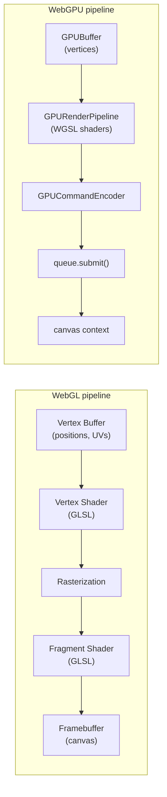

# [FEE-408] WebGL 與 WebGPU

:::info
WebGL 和 WebGPU 將瀏覽器的 GPU 管線暴露給 JavaScript，透過可程式化的著色器實現硬體加速渲染。WebGL（基於 OpenGL ES）獲得廣泛支援；WebGPU（基於 Vulkan/Metal/D3D12）是現代替代方案，具有更佳的效能保證與 GPU 運算支援。對大多數 3D 與視覺應用而言，應優先選擇 Three.js 或 Babylon.js 等函式庫，而非直接使用這些原生 API。
:::

## 背景

瀏覽器的 GPU 管線歷經兩個截然不同的世代。WebGL 於 2011 年問世，標準化為 WebGL 1.0，將 OpenGL ES 2.0 語意暴露給 JavaScript，使網頁應用程式首次能夠存取硬體加速的 2D 和 3D 渲染。WebGL 2 於 2017 年跟進，將基準提升至 OpenGL ES 3.0，新增了多重渲染目標、transform feedback（將頂點著色器的輸出擷取回 buffer，而非直接送往光柵化階段）、uniform buffer object 和 instanced drawing 等功能。WebGL 2 自 2022 年起已在 Chrome、Firefox、Safari 和 Edge 全面支援，使其成為今日 GPU 加速工作的安全跨瀏覽器基準。

WebGPU 是 WebGL 的現代繼承者。它並非包裝 OpenGL ES 層，而是直接以驅動原生圖形的低階顯式 API 為模型：Linux 與 Android 上的 Vulkan、Apple 平台上的 Metal，以及 Windows 上的 Direct3D 12。這使 WebGPU 的 CPU 開銷更低、效能更具可預測性，並對超越渲染範疇的 GPU 運算工作負載提供一流支援。Chrome 與 Edge 已在 Chrome 113（2023 年 5 月）出貨 WebGPU。Safari 隨後在 Safari 26（2025 年 9 月）跟進，於 macOS Tahoe 26、iOS 26、iPadOS 26 和 visionOS 26 中預設啟用；包括 Safari 18 在內的更早版本，從未預設出貨過此功能。Firefox 自 141 版（Windows，2025 年 7 月）起已預設啟用 WebGPU，145 版將此擴展至 macOS Tahoe（Apple Silicon），147 版則進一步涵蓋所有 Apple Silicon 版本的 macOS；Linux 與 Android 版本截至 2026 年中仍在等待中。綜合來看，WebGPU 現已可在三大主流瀏覽器引擎（Blink、Gecko、WebKit）中使用，但尚未達到 Baseline 標準——Web Platform Status 儀表板將其列為「有限可用性」（Limited availability），因為 Firefox 在 Linux 與 Android 上、以及 Safari 26 之前的版本仍缺乏支援。因此仍需保留 WebGL 2 作為備援方案。

如何在這些 API 之間抉擇，或選擇能夠抽象化它們的函式庫，是本文涵蓋的核心決策。原生 WebGL 和 WebGPU 功能強大但寫起來冗長：下方約 70 行的 WebGL 2 三角形範例，在 Three.js 中只需寥寥幾次呼叫就能達成同樣的效果。適合使用原生 API 的時機，是使用案例確實需要細粒度 GPU 管線控制的場合：自訂著色器、GPU 運算核心、嚴格的頂點佈局控制，或整合任何函式庫都不支援的渲染管線。對於絕大多數的 3D 場景渲染、資料視覺化和遊戲開發而言，函式庫抽象層才是正確的起點。

## 視覺對比



WebGL 管線是有狀態且命令式的：每次繪製呼叫從當前綁定的 buffer、程式、VAO 和 framebuffer 讀取。WebGPU 管線是顯式且物件導向的：所有狀態凍結在 `GPURenderPipeline` 中，命令錄製到 `GPUCommandEncoder`，並作為批次提交到設備佇列。這種設計降低了隱式驅動程式狀態，並使多執行緒命令錄製變得可行。

## 範例

以下程式碼片段依序展示了最小的有色三角形：先是 WebGL 2，再來是 WebGPU，接著是一個小型運算範例，最後是選擇最佳可用 context 層級的功能偵測輔助函式。

### WebGL 2 三角形

```ts
// webgl-triangle.ts — minimal colored triangle in WebGL 2
const canvas = document.getElementById('gl-canvas') as HTMLCanvasElement;
const gl = canvas.getContext('webgl2');
if (!gl) throw new Error('WebGL 2 not supported');

// Vertex shader: receives position attribute, outputs clip-space position
const vertexSource = `#version 300 es
in vec2 a_position;
void main() {
  gl_Position = vec4(a_position, 0.0, 1.0);
}`;

// Fragment shader: outputs a constant blue color
const fragmentSource = `#version 300 es
precision mediump float;
out vec4 outColor;
void main() {
  outColor = vec4(0.23, 0.51, 0.97, 1.0);
}`;

function createShader(gl: WebGL2RenderingContext, type: number, source: string): WebGLShader {
  const shader = gl.createShader(type)!;
  gl.shaderSource(shader, source);
  gl.compileShader(shader);
  if (!gl.getShaderParameter(shader, gl.COMPILE_STATUS)) {
    throw new Error(gl.getShaderInfoLog(shader) ?? 'Shader compile error');
  }
  return shader;
}

function createProgram(gl: WebGL2RenderingContext, vs: WebGLShader, fs: WebGLShader): WebGLProgram {
  const program = gl.createProgram()!;
  gl.attachShader(program, vs);
  gl.attachShader(program, fs);
  gl.linkProgram(program);
  if (!gl.getProgramParameter(program, gl.LINK_STATUS)) {
    throw new Error(gl.getProgramInfoLog(program) ?? 'Program link error');
  }
  return program;
}

const vs = createShader(gl, gl.VERTEX_SHADER, vertexSource);
const fs = createShader(gl, gl.FRAGMENT_SHADER, fragmentSource);
const program = createProgram(gl, vs, fs);

// Triangle vertices in clip space (-1 to 1)
const vertices = new Float32Array([
   0.0,  0.5,  // top
  -0.5, -0.5,  // bottom-left
   0.5, -0.5,  // bottom-right
]);

const vao = gl.createVertexArray()!;
gl.bindVertexArray(vao);

const buffer = gl.createBuffer()!;
gl.bindBuffer(gl.ARRAY_BUFFER, buffer);
gl.bufferData(gl.ARRAY_BUFFER, vertices, gl.STATIC_DRAW);

const positionLoc = gl.getAttribLocation(program, 'a_position');
gl.enableVertexAttribArray(positionLoc);
gl.vertexAttribPointer(positionLoc, 2, gl.FLOAT, false, 0, 0);

// Draw
gl.viewport(0, 0, canvas.width, canvas.height);
gl.clearColor(0, 0, 0, 1);
gl.clear(gl.COLOR_BUFFER_BIT);
gl.useProgram(program);
gl.bindVertexArray(vao);
gl.drawArrays(gl.TRIANGLES, 0, 3);
```

頂點著色器接收 `vec2` 位置屬性，透過附加 `z=0` 和 `w=1` 將其傳遞到裁剪空間。片段著色器捨棄位置並輸出硬編碼的 RGBA 藍色。請注意呼叫順序：`gl.bindVertexArray(vao)` 會在 buffer 上傳之前執行。正是這個順序，使後續的 `gl.enableVertexAttribArray` 和 `gl.vertexAttribPointer` 呼叫被記錄到 VAO 中。這些已記錄的屬性狀態正是使用 VAO 的核心目的：在繪製前再次綁定它即可一次性還原所有狀態，因此繪製呼叫只需綁定 VAO 和程式即可。

### WebGPU 三角形

```ts
// webgpu-triangle.ts — equivalent triangle in WebGPU
async function initWebGPU(canvas: HTMLCanvasElement) {
  if (!navigator.gpu) throw new Error('WebGPU not supported');

  const adapter = await navigator.gpu.requestAdapter();
  if (!adapter) throw new Error('No GPU adapter found');
  const device = await adapter.requestDevice();

  const context = canvas.getContext('webgpu')!;
  const format = navigator.gpu.getPreferredCanvasFormat();
  context.configure({ device, format });

  // WGSL shader: vertex positions hardcoded, fragment outputs blue
  const shaderModule = device.createShaderModule({
    code: `
      @vertex
      fn vs_main(@builtin(vertex_index) idx: u32) -> @builtin(position) vec4f {
        var pos = array<vec2f, 3>(
          vec2f( 0.0,  0.5),
          vec2f(-0.5, -0.5),
          vec2f( 0.5, -0.5),
        );
        return vec4f(pos[idx], 0.0, 1.0);
      }

      @fragment
      fn fs_main() -> @location(0) vec4f {
        return vec4f(0.23, 0.51, 0.97, 1.0);
      }
    `,
  });

  const pipeline = device.createRenderPipeline({
    layout: 'auto',
    vertex: { module: shaderModule, entryPoint: 'vs_main' },
    fragment: {
      module: shaderModule,
      entryPoint: 'fs_main',
      targets: [{ format }],
    },
    primitive: { topology: 'triangle-list' },
  });

  const encoder = device.createCommandEncoder();
  const pass = encoder.beginRenderPass({
    colorAttachments: [{
      view: context.getCurrentTexture().createView(),
      clearValue: { r: 0, g: 0, b: 0, a: 1 },
      loadOp: 'clear',
      storeOp: 'store',
    }],
  });
  pass.setPipeline(pipeline);
  pass.draw(3);
  pass.end();
  device.queue.submit([encoder.finish()]);
}
```

注意與 WebGL 的結構差異：WGSL 著色器將頂點位置硬編碼為以內建 `vertex_index` 索引的編譯時陣列。這消除了簡單三角形對頂點 buffer 的需求，儘管生產管線會使用帶有頂點佈局描述符的 `GPUBuffer`。整個渲染通道（清除、管線綁定、繪製）錄製到 `GPUCommandEncoder` 中，並作為單一批次提交，比有狀態的 WebGL 繪製模型更有效率。

### WebGPU 運算：陣列倍增

渲染只是 WebGPU 所提供功能的一半。`GPUComputePipeline` 會在 storage buffer 上執行 WGSL 的 `@compute` 著色器，完全不涉及光柵化器或 framebuffer，這正是 WebGPU 適用於 ML 推論或物理模擬等數值運算工作的原因。以下範例會在 GPU 上將 `Float32Array` 的每個元素倍增，並將結果讀回：

```ts
// webgpu-compute.ts — double every element of a Float32Array on the GPU
async function doubleOnGPU(input: Float32Array): Promise<Float32Array> {
  if (!navigator.gpu) throw new Error('WebGPU not supported');
  const adapter = await navigator.gpu.requestAdapter();
  if (!adapter) throw new Error('No GPU adapter found');
  const device = await adapter.requestDevice();

  const shaderModule = device.createShaderModule({
    code: `
      @group(0) @binding(0) var<storage, read_write> data: array<f32>;

      @compute @workgroup_size(64)
      fn main(@builtin(global_invocation_id) id: vec3u) {
        if (id.x >= arrayLength(&data)) { return; }
        data[id.x] = data[id.x] * 2.0;
      }
    `,
  });

  const pipeline = device.createComputePipeline({
    layout: 'auto',
    compute: { module: shaderModule, entryPoint: 'main' },
  });

  const storageBuffer = device.createBuffer({
    size: input.byteLength,
    usage: GPUBufferUsage.STORAGE | GPUBufferUsage.COPY_SRC | GPUBufferUsage.COPY_DST,
  });
  device.queue.writeBuffer(storageBuffer, 0, input);

  const readbackBuffer = device.createBuffer({
    size: input.byteLength,
    usage: GPUBufferUsage.MAP_READ | GPUBufferUsage.COPY_DST,
  });

  const bindGroup = device.createBindGroup({
    layout: pipeline.getBindGroupLayout(0),
    entries: [{ binding: 0, resource: { buffer: storageBuffer } }],
  });

  const encoder = device.createCommandEncoder();
  const pass = encoder.beginComputePass();
  pass.setPipeline(pipeline);
  pass.setBindGroup(0, bindGroup);
  pass.dispatchWorkgroups(Math.ceil(input.length / 64));
  pass.end();
  encoder.copyBufferToBuffer(storageBuffer, 0, readbackBuffer, 0, input.byteLength);
  device.queue.submit([encoder.finish()]);

  await readbackBuffer.mapAsync(GPUMapMode.READ);
  const result = new Float32Array(readbackBuffer.getMappedRange().slice(0));
  readbackBuffer.unmap();
  return result;
}
```

bind group 將 storage buffer 連接到 `@group(0)` 中的 `@binding(0)`，與 WGSL 著色器宣告的插槽相同。`dispatchWorkgroups()` 會啟動足夠數量的 workgroup，以每個 workgroup 64 個執行緒的規模涵蓋整個輸入；著色器中的 `if (id.x >= arrayLength(&data))` 防護會在陣列長度不是 64 的倍數時捨棄多餘的執行緒。以 `STORAGE` 用途建立的 buffer 無法直接映射供 CPU 讀取，因此結果會先複製到第二個支援 `MAP_READ` 的 buffer，才能透過 `mapAsync()` 讀回。這種「storage buffer 加上映射讀回」的模式，正是 transformers.js、ONNX Runtime Web 和 WebLLM 的 WebGPU 後端用來在瀏覽器中執行模型推論的方式：這些函式庫才是 GPU 運算在 2024 至 2026 年間帶來的具體效益，而非像上面這種手刻的核心程式。

### 功能偵測與優雅降級

```ts
// feature-detect.ts — graceful degradation: WebGPU → WebGL 2 → Canvas 2D
async function getRenderer(canvas: HTMLCanvasElement) {
  if (navigator.gpu) {
    const adapter = await navigator.gpu.requestAdapter();
    if (adapter) return 'webgpu';
  }
  const gl = canvas.getContext('webgl2');
  if (gl) return { tier: 'webgl2', gl };
  return { tier: 'canvas2d' };
}
```

這個輔助函式返回一個包含層級標記和已建立 context 的物件，讓呼叫端無需再次呼叫 `getContext('webgl2')`。`navigator.gpu` 的檢查防止 API 完全缺席的情況，截至 2026 年中，這仍適用於 Safari 26 之前的版本，以及執行於 Linux 或 Android 上的 Firefox。額外的 `requestAdapter()` 呼叫則防止 `navigator.gpu` 存在但沒有相容硬體或驅動程式可用的情況。這可能發生在虛擬化環境中，或當硬體加速被停用時。透過 WebGL 2 退到 Canvas 2D 可確保應用程式始終能渲染出內容，而非拋出錯誤。

## 最佳實踐

**使用前進行功能偵測。** 永遠不要假設 WebGPU 可用。檢查 `navigator.gpu` 並呼叫 `requestAdapter()`：即使屬性存在，adapter 也可能為 null。對於 WebGL 2，呼叫 `getContext('webgl2')` 並在繼續之前檢查 null。始終準備備用路徑。

**優先選擇 WebGL 2 而非 WebGL 1。** `getContext('webgl')` 請求的是 WebGL 1 context，缺少核心中的 VAO、uniform buffer object、transform feedback 和許多 WebGL 2 提供的能力。WebGL 2 自 2022 年起已在所有主流瀏覽器中受到支援。除非需要支援已知的舊版環境（部分嵌入式瀏覽器、較舊的智慧電視平台），否則新專案沒有理由針對 WebGL 1。

**在 WebGL 2 中使用 Vertex Array Object（VAO）。** VAO 是 WebGL 2 核心的一部分（非擴充功能）。它們將所有頂點屬性狀態（buffer 綁定、屬性指標、啟用的陣列）捕獲到單一物件中。在繪製前綁定 VAO 可消除冗餘的屬性設定呼叫，並在具有許多物件的場景中顯著降低每次繪製呼叫的 CPU 開銷。

**明確銷毀 GPU 資源。** 當 `GPUBuffer`、`GPUTexture`、`WebGLProgram` 或 `WebGLBuffer` 不再需要時，立即銷毀或刪除它。WebGPU：`buffer.destroy()`、`texture.destroy()`。WebGL 2：`gl.deleteBuffer(buffer)`、`gl.deleteTexture(texture)`、`gl.deleteProgram(program)`、`gl.deleteShader(shader)`。洩漏的 GPU 句柄在驅動程式中累積，且對 `performance.memory` 或 Chrome 的 JavaScript 堆疊快照不可見。

**幾何上傳一次；只更新有變化的部分。** 每一幀都用 `gl.bufferData()` 或 `device.queue.writeBuffer()` 上傳頂點資料是常見的效能瓶頸。對不可變的幾何使用 `gl.STATIC_DRAW`，對每幀變化的幾何使用 `gl.DYNAMIC_DRAW`。在 WebGPU 中，對靜態 buffer 使用 map-at-creation（`mappedAtCreation: true`）可避免多餘的複製。對於動態資料，使用獨立的暫存 buffer 或映射範圍。

**在熱路徑之外編譯著色器。** WebGL 著色器編譯（`gl.compileShader`）和程式連結（`gl.linkProgram`）是同步操作，在複雜著色器或低速 GPU 上可能使主執行緒停頓數十毫秒。在 WebGL 2 中，應在初始化期間編譯所有著色器，而非在渲染期間進行。WebGPU 的 `device.createShaderModule()` 是非同步的，會返回已編譯的模組。透過 await `compilationInfo()` 檢查錯誤，它會解析為 `GPUCompilationInfo`：`const info = await shaderModule.compilationInfo()`。進行這項檢查能捕捉有問題的著色器，而不是讓它靜默地產生空白畫面。

**使用 `requestAnimationFrame` 作為渲染迴圈。** 永遠不要用 `setTimeout` 或 `setInterval` 驅動渲染迴圈。`requestAnimationFrame` 將渲染回呼與瀏覽器的合成週期同步，尊重顯示器刷新率，並在分頁隱藏時自動暫停，節省 CPU 和 GPU 工作。

**應該（SHOULD）在瀏覽器支援允許的新專案中，優先選擇 WebGPU 而非 WebGL 2。** 使用前務必以 `navigator.gpu` 和 `requestAdapter()` 進行功能偵測；對於尚不支援 WebGPU 的瀏覽器，WebGL 2（透過 `getContext('webgl2')`）仍是相容性最廣的備用方案。

**標準使用案例優先選擇函式庫。** Three.js、Babylon.js、PixiJS（2D）和 TWGL（輕量級 WebGL 輔助工具）都解決了原始 WebGL 和 WebGPU 要求你自行實作的資源管理、著色器編譯、場景圖和攝影機數學問題。Three.js 的 WebGPURenderer 更進一步：它會在 WebGPU 可用時使用 WebGPU 後端，並自動退回 WebGL 2；搭配 TSL（Three.js Shading Language），還能讓你只編寫一次著色器（以 JavaScript 節點圖的形式），並自動編譯為 WebGPU 用的 WGSL 或 WebGL 2 用的 GLSL。對於標準 3D 場景、資料視覺化、粒子系統和大多數遊戲場景，先從函式庫開始，只對函式庫無法表達的特定自訂著色器或運算工作降至原始 API 呼叫，幾乎總是正確的架構。

### GLSL 與 WGSL

著色器語言在 WebGL 和 WebGPU 之間發生了變化。WebGL 使用 GLSL（OpenGL 著色語言），一種類 C 語言，其版本在每個著色器字串的第一行聲明。WebGL 1 使用 GLSL ES 1.00；WebGL 2 使用 GLSL ES 3.00（`#version 300 es` 指令）。GLSL 在執行時由瀏覽器的 OpenGL 驅動程式編譯，可能在不同平台上產生不一致的錯誤訊息和編譯時間。

WebGPU 使用 WGSL（WebGPU 著色語言），一種受 Rust 影響的語言，完全在 WebGPU 規格中規定，而非繼承自外部標準。WGSL 是強型別的，具有明確的位址空間（`storage`、`uniform`、`workgroup`、`private`、`function`），並使用屬性裝飾器（`@vertex`、`@fragment`、`@compute`、`@builtin`、`@location`）取代 GLSL 的特殊變數，如 `gl_Position`。WebGPU 規格要求在 `createShaderModule()` 時根據確定性語法驗證 WGSL，在各瀏覽器間提供一致的錯誤訊息。

兩種語言主要概念的簡要比較：

| 概念 | GLSL ES 3.00（WebGL 2） | WGSL（WebGPU） |
|---|---|---|
| 著色器進入點聲明 | `void main()` | `@vertex fn vs_main(...)` |
| 頂點輸出位置 | `gl_Position = ...` | `return vec4f(...) // @builtin(position)` |
| Varying（插值）值 | `out` / `in` 限定符 | 結構成員上的 `@location(N)` |
| Uniform 資料 | `uniform` 區塊 | `@group(0) @binding(0) var<uniform>` |
| 紋理採樣 | `texture(sampler, uv)` | `textureSample(t, s, uv)` |
| 運算著色器調度 | WebGL 2 中不可用 | `@compute @workgroup_size(N)` |

WGSL 的明確位址空間模型也影響 GPU 運算：用於讀寫存取的 storage buffer、用於唯讀著色器常數的 uniform buffer，以及用於在運算工作群組內共享資料的 workgroup 記憶體，都是必須正確聲明的不同位址空間。這種明確性對初學者來說是冗長的根源，但對工具、靜態分析和可攜性而言是顯著的優勢。

Three.js 的 TSL 為函式庫使用者抽象化了這種差異：著色器只需編寫一次，寫成 JavaScript 節點圖，再依據啟用的渲染器編譯為 WGSL 或 GLSL，因此上表列出的差異主要與在函式庫之外自行編寫原生著色器的開發者相關。

## 設計思維

選擇 GPU API 需要權衡四個因素：能力、可維護性、套件大小和瀏覽器支援。原生 WebGL 2 只有在團隊具備著色器專業知識，且渲染需求足夠特殊，使得通用函式庫需要比從頭撰寫更深層的變通方案時，才是合理的起點。WebGPU 增加了 GPU 運算能力和更低的 CPU 開銷，但代價是更大的概念表面積（管線、bind group、command encoder、佇列）。對於任何類似標準 3D 場景的情況，Three.js 或 Babylon.js 將以更少的錯誤更快地觸及更多使用者。

OffscreenCanvas 的引入改變了這個決策的一個維度：WebGL 2 和 WebGPU 的 context 都可以透過 `canvas.transferControlToOffscreen()` 轉移到 Web Worker，將 GPU 工作完全從主執行緒移除。這對於渲染與 UI 互動競爭的應用程式至關重要。OffscreenCanvas 的 2D context 於 Safari 16.4（2023 年 3 月）出貨；將 WebGL 或 WebGL 2 context 轉移到 worker 的支援則較晚才登陸，於 Safari 17。

即使 WebGPU 的瀏覽器支援現在已廣泛得多，功能偵測仍然是不可或缺的。`navigator.gpu` 在 Safari 26 之前的版本中是 undefined，在執行於 Linux 或 Android 上、WebGPU 支援仍待推出的 Firefox 中也是如此。WebGL 2 的 `getContext('webgl2')` 在非常舊的瀏覽器（Internet Explorer、2016 年前的 Safari）中返回 null。健全的應用程式層必須偵測哪個 context 層級可用，並優雅地降級，理想情況下不載入它無法使用的層級的程式碼。

一個常被忽視的維度是渲染迴圈架構。WebGL 2 應用程式透過 `requestAnimationFrame` 擁有自己的渲染迴圈，每幀依序呼叫有狀態的 WebGL 命令。WebGPU 應用程式則是每幀錄製一個 `GPUCommandEncoder`，建立命令 buffer 並提交。這種模型更自然地擴展到多通道渲染、延遲著色，以及最終的多執行緒命令錄製。在設計渲染複雜度會增長的應用程式時，這個架構差異值得提前納入考量。

以下表格概述常見場景的決策框架：

| 場景 | Canvas 2D | WebGL 2 | WebGPU | 函式庫（Three.js 等） |
|---|---|---|---|---|
| 2D 像素藝術 / 圖像濾鏡 | 是 | 可行 | 可行 | 否 |
| 3D 場景，標準使用案例 | 否 | 可行 | 可行 | 是（建議） |
| 自訂著色器效果，完整管線控制 | 否 | 是 | 是 | 可行 |
| GPU 運算（ML 推論、物理模擬） | 否 | 勉強可（transform feedback） | 是 | 否 |
| 須執行於 Safari < 26 或 Linux/Android 上的 Firefox | 不適用 | 是 | 否 | 視函式庫而定 |
| 最小套件，無函式庫依賴 | 不適用 | 是 | 是 | 否 |

## 常見錯誤

**為標準 3D 場景選擇原始 WebGL。** Three.js 或 Babylon.js 以極少的程式碼實現相同的效果，且沒有顯著的效能代價。除非專案需要任何函式庫都不支援的完全自訂渲染管線、著色器排列系統或 GPU 運算工作負載，否則先從函式庫開始，只對特定需要的部分降至原始 API 呼叫，幾乎總是正確的做法。對 Three.js 原生支援的場景使用原始 WebGL 是維護負擔。

**使用 WebGPU 前未檢查 `navigator.gpu`。** Safari 26 之前的版本，以及執行於 Linux 或 Android 上的 Firefox，都不支援 WebGPU；`navigator.gpu` 屬性在這些環境中是 undefined。不加防護地呼叫 `navigator.gpu.requestAdapter()` 會拋出 TypeError。即使在 Chrome 中，`requestAdapter()` 也可能在不支援 WebGPU 的硬體或驅動程式設定中解析為 null。始終防護屬性存取和 adapter 結果兩者。

**洩漏 GPU 資源。** `GPUBuffer`、`GPUTexture` 以及 WebGL 的 `WebGLProgram` / `WebGLBuffer` 物件在不再需要時必須明確銷毀或刪除。JavaScript 垃圾回收器可以回收 JavaScript 包裝物件，但不釋放底層驅動程式句柄或 GPU 記憶體分配。在動態建立和銷毀幾何的長期執行應用程式或場景中，洩漏的 GPU 資源將持續累積，直到渲染效能降低或 GPU 程序崩潰。始終將 WebGPU 的 `buffer.destroy()` / `texture.destroy()` 和 WebGL 2 的 `gl.deleteBuffer()` / `gl.deleteProgram()` / `gl.deleteTexture()` 作為任何清理路徑的一部分。

**使用 `getContext('webgl')` 而非 `getContext('webgl2')`。** WebGL 1 缺少核心中的 Vertex Array Object、uniform buffer object、transform feedback 和許多紋理格式。WebGL 2 自 2022 年起已在 Chrome、Firefox、Safari 和 Edge 中普遍支援。在現代瀏覽器上請求 `'webgl'` 仍然返回 WebGL 1 context。它不會自動升級。除非需要支援非常舊的環境，否則始終請求 `'webgl2'` 並明確處理 null 備用。

**每幀上傳頂點資料。** 每幀呼叫 `gl.bufferData()` 或 `device.queue.writeBuffer()` 來上傳從不改變的幾何是初學者常見的錯誤。靜態幾何應在初始化期間用 `gl.STATIC_DRAW` 上傳一次。對於每幀變化的幾何（粒子、變形網格），使用 `gl.DYNAMIC_DRAW` 並只用 `gl.bufferSubData()` 或透過 `getMappedRange()` 映射 `GPUBuffer` 範圍來更新變化的部分。

**靜默忽略著色器編譯錯誤。** WebGL 的 `gl.compileShader()` 和 `gl.linkProgram()` 失敗時不會拋出例外。它們會設定必須用 `gl.getShaderParameter(shader, gl.COMPILE_STATUS)` 和 `gl.getProgramParameter(program, gl.LINK_STATUS)` 明確查詢的錯誤狀態。編譯失敗的著色器靜默地產生黑屏或無輸出，沒有主控台錯誤，除非應用程式進行檢查。開發期間始終檢查並記錄 `gl.getShaderInfoLog()` 和 `gl.getProgramInfoLog()`。

## 瀏覽器支援摘要

截至 2026 年中，三種 GPU context 類型的支援矩陣如下：

| Context | Chrome | Firefox | Safari | 備註 |
|---|---|---|---|---|
| `webgl2` | 是（自 Chrome 56） | 是（自 Firefox 51） | 是（自 Safari 15） | 普遍支援，安全的預設值 |
| `webgpu` | 是（自 Chrome 113） | 是（Windows 141+、macOS 145+/147+）；Linux/Android 尚待推出 | 是（自 Safari 26） | 已在所有主流引擎出貨，但尚未達到 Baseline（列為有限可用性）；缺口在於 Linux/Android 上的 Firefox 與 Safari 26 之前的版本 |
| `webgl`（v1） | 是 | 是 | 是 | 新專案請避免使用；改用 WebGL 2 |

建議以 `getContext('webgl2')` 作為今日 GPU 加速工作的基準，並將 `navigator.gpu` 作為漸進增強，用於能從 WebGPU 的運算能力或更低 CPU 開銷中獲益的應用程式。以 Three.js 的 WebGPURenderer 為基礎開發的函式庫使用者，大多能免費獲得這種備援邏輯。

## 延伸閱讀

- [FEE-407：Canvas 2D 與 SVG](./407.md)
- [FEE-405：Web Workers 與並行](./405.md)
- [FEE-700：渲染與效能概覽](../Rendering%20and%20Performance/700.md)

## 參考資料

- MDN Contributors, "WebGL API," MDN Web Docs (2026). https://developer.mozilla.org/en-US/docs/Web/API/WebGL_API
- MDN Contributors, "WebGPU API," MDN Web Docs (2026). https://developer.mozilla.org/en-US/docs/Web/API/WebGPU_API
- MDN Contributors, "WebGL: 2D and 3D graphics for the web," MDN Web Docs (2026). https://developer.mozilla.org/en-US/docs/Web/API/WebGL_API/Tutorial/Getting_started_with_WebGL
- Gregg Tavares, "WebGPU Fundamentals," webgpufundamentals.org (2026). https://webgpufundamentals.org/
- Gregg Tavares, "WebGL2 Fundamentals," webgl2fundamentals.org (2026). https://webgl2fundamentals.org/
- W3C GPU for the Web Community Group, "WebGPU," W3C Working Draft (2026). https://gpuweb.github.io/gpuweb/
- gpuweb, "Implementation Status," GitHub wiki (2026). https://github.com/gpuweb/gpuweb/wiki/Implementation-Status
- web.dev, "WebGPU is now supported in major browsers," web.dev Blog (2025). https://web.dev/blog/webgpu-supported-major-browsers
- Three.js, "WebGPURenderer," Three.js Manual (2026). https://threejs.org/manual/en/webgpurenderer.html
- Three.js, "TSL (Three.js Shading Language)," Three.js Docs (2026). https://threejs.org/docs/pages/TSL.html
