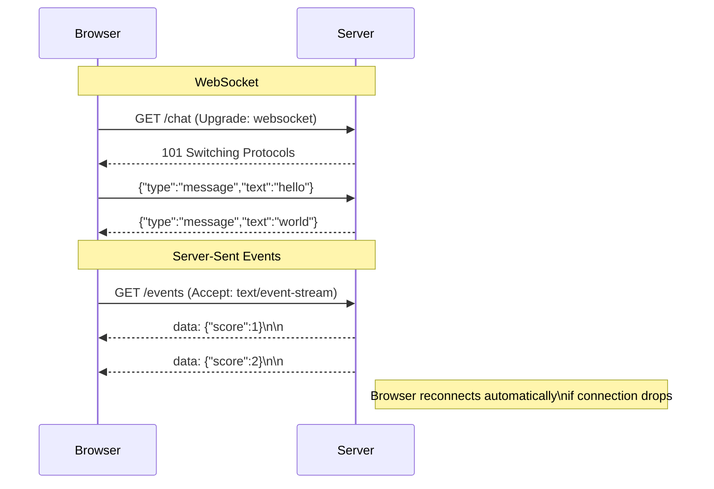

# [FEE-409] WebSockets 與 Server-Sent Events

:::info
WebSockets 與 Server-Sent Events（SSE）是瀏覽器與伺服器之間持久、低延遲通訊的兩種主要機制。WebSockets 提供全雙工訊息傳遞；SSE 則透過標準 HTTP 提供更簡單的單向伺服器推送串流。選擇哪種方案取決於瀏覽器是否也需要向伺服器傳送訊息。
:::

## 簡介

網頁上的即時資料傳遞長期依賴輪詢（polling）——瀏覽器定期向伺服器詢問是否有新資料。這種方式相當浪費：大多數輪詢請求都不會收到新資料，但每次往返仍會消耗連線開銷、伺服器 CPU 與裝置電量。兩個專為此設計的瀏覽器 API 解決了這個問題：WebSocket 提供透過單一 TCP socket 的持久雙向連線，而 Server-Sent Events（SSE）則透過標準 HTTP 連線提供從伺服器到瀏覽器的單向串流。這兩個 API 都已在現代瀏覽器中廣泛支援，並取代了各自適用場景中的輪詢方式。

WebSocket（IETF RFC 6455，2011 年）從一次 HTTP/1.1 升級握手開始——瀏覽器發送 `Upgrade: websocket`，伺服器回應 `101 Switching Protocols`，連線隨即變成原始的分幀二進位串流，任一方均可隨時發送訊息。SSE 不是協定升級；它是一個普通的 HTTP 回應，以 `Content-Type: text/event-stream` 告知瀏覽器保持連線並透過 `EventSource` API 逐步解析內容。

在這兩種技術之間做出選擇，是前端工程師最常見的即時架構決策之一。正確的選擇幾乎完全取決於通訊方向：當瀏覽器也需要頻繁向伺服器發送訊息時（聊天、協作編輯、多人遊戲），必須使用 WebSocket；而對於純粹的伺服器到瀏覽器推送（即時比分板、通知推送、AI/LLM 串流回應），SSE 不僅足夠，而且更為合適。WebTransport 作為建構於 HTTP/3 與 QUIC 之上的低延遲 WebSocket 後繼者正在研議中，但截至 2026 年仍屬實驗性質，本文不作深入介紹。

## 原則

WebSocket 提供全雙工、持久的 TCP 連線，在初始 HTTP 升級握手後，瀏覽器或伺服器均可隨時發送訊息。Server-Sent Events（SSE）透過 `EventSource` API，在標準 HTTP/1.1 或 HTTP/2 連線上提供從伺服器到瀏覽器的單向串流。團隊 **MUST** 為 WebSocket 連線實作指數退避重連邏輯——該協定不保證持久性，網路中斷將關閉 socket。團隊 **SHOULD** 優先選用 SSE 處理唯讀伺服器推送（即時資訊流、通知、AI/LLM 串流回應），因為 SSE 使用標準 HTTP，可穿透所有代理與負載平衡器，且瀏覽器透過 `Last-Event-ID` 自動處理重連。只有當瀏覽器也需要頻繁向伺服器發送訊息時，團隊 **SHOULD** 才考慮使用 WebSocket。

## 設計思維

在 WebSocket 與 SSE 之間選擇的核心問題，是瀏覽器是否需要持續或高頻率地向伺服器傳送資料。若答案為是——使用者輸入訊息的聊天應用、客戶端持續串流輸入事件的多人遊戲、每次按鍵都必須即時傳遞給所有協作者的文件編輯器——WebSocket 是合適的選擇，因為它以最小的分幀開銷為瀏覽器提供了一個傳送通道。若答案為否——即時體育賽況、CI 流水線日誌檢視器、AI 聊天機器人逐字符串流回應——SSE 是更好的選擇，因為它所依託的 HTTP 連線更易於代理、負載平衡和偵錯。

SSE 的運維簡便性常常被低估。SSE 連線對瀏覽器與伺服器之間所有基礎設施而言，看起來就像普通的長時間 HTTP 請求：反向代理（nginx、Caddy）、CDN 邊緣節點和負載平衡器都無需特殊處理。相比之下，WebSocket 連線要求這些層級正確傳遞升級握手，某些企業代理和老舊的負載平衡器會完全去除或拒絕 `Upgrade` 標頭。對於無法完全掌控基礎設施的團隊，這一點 **SHOULD** 納入考量。

一個值得理解的細節是，WebSocket 和 SSE 在協定層面都不提供訊息送達保證機制。若在伺服器發送訊息與客戶端接收之間連線中斷，訊息便會遺失。WebSocket 沒有內建的確認或序號系統。SSE 透過 `Last-Event-ID` 緩解了重連場景下的這一問題：此標頭讓伺服器知道客戶端最後成功接收的事件，從而可以從緩衝區重播遺漏的事件。對於需要真正保證送達的應用，需要在 WebSocket 之上實作應用層確認機制，或使用持久訊息佇列（Kafka、RabbitMQ、Redis Streams）作為事實來源，僅透過 SSE 傳送已確認的事件。

SSE 同樣受益於 HTTP/2 多路複用。在 HTTP/1.1 下，瀏覽器每個 origin 最多開啟六個並行連線，一個 SSE 串流會永久佔用其中一個。在 HTTP/2 下，多個 SSE 串流透過多路複用共用單一 TCP 連線，即使頁面開啟多個並發事件串流也不會耗盡連線池。WebSocket 不論 HTTP 版本為何，每個 socket 都需要獨立的 TCP 連線——不存在 WebSocket 多路複用。

另一個常被忽視的考量是伺服器端的廣播（fan-out）。WebSocket 伺服器必須維護對所有已開啟 socket 的引用才能廣播事件——通常是記憶體中的 set 或 map，有時以 Redis pub/sub 作為跨多個伺服器程序的協調機制。SSE 伺服器出於同樣原因也必須維護一個已開啟回應串流的列表。當連線關閉時，兩種架構都需要謹慎清理。差異在於實作複雜度：WebSocket 伺服器承載協定層狀態（ping/pong 心跳、訊框解析、關閉碼），而 SSE 伺服器不過是一個長時間存活的 HTTP 回應。在 Express、Fastify 或 Hono 等框架中，實作 SSE 廣播往往只需在伺服器端事件迴圈迭代中呼叫 `res.write()`。

SSE 的線格式（wire format）值得明確理解，因為它決定了伺服器端實作方式和重連行為。HTTP 回應的 `Content-Type` 為 `text/event-stream`。每個事件由一或多個欄位行加上一個空行組成。`data:` 欄位承載負載內容；多行 `data:` 在傳遞前會以換行符串接。`event:` 欄位定義事件類型名稱，對應 `EventSource` 上的 `addEventListener` 事件名稱。`id:` 欄位設定 `Last-Event-ID`——瀏覽器會儲存此值，並在下次重連請求中以 `Last-Event-ID` HTTP 請求標頭傳送，讓伺服器可從上次中斷處繼續傳遞。`retry:` 欄位指示瀏覽器在連線斷開後等待多少毫秒再重連。一個最簡的多事件串流如下：

```
data: {"score":1}

id: 42
event: goal
data: {"player":"Messi"}

retry: 3000

```

下表彙整了常見即時場景的決策框架：

| 場景 | WebSocket | SSE（`EventSource`） | Long Polling |
|---|---|---|---|
| 雙向通訊（聊天、多人遊戲、協作編輯） | 是 | 否 | 可行 |
| 僅伺服器推送（即時比分、通知） | 可行 | 是（更簡單） | 可行 |
| AI / LLM 串流回應 | 可行 | 是（標準做法） | 否 |
| HTTP/2 多路複用（多個串流） | 否（每個連線獨立） | 是 | 否 |
| 二進位資料（音訊、視訊、blob） | 是 | 否（僅文字） | 否 |
| 穿透所有代理 / 防火牆 | 有時被封鎖 | 是（標準 HTTP） | 是 |
| 含狀態恢復的自動重連 | 需手動實作 | 內建（`Last-Event-ID`） | 需手動實作 |

## 最佳實踐

**從第一天就實作 WebSocket 指數退避重連。** WebSocket 連線在任何時候都可能中斷——網路中斷、伺服器重啟、負載平衡器閒置逾時、使用者切換網路。正確的處理方式是重連，但立即反覆重連會對伺服器造成衝擊。指數退避——從 1 秒開始，每次失敗後翻倍，上限為 30 秒——可以分散重連時機。在 `open` 事件成功觸發時將延遲重置為初始值，確保短暫的中斷不會永久拖慢後續重連速度。完整實作請參見「範例」章節的 `ReconnectingWebSocket` 類別。

**在呼叫 `send()` 前檢查 `readyState`。** WebSocket 的 `readyState` 屬性有四個值：`0`（CONNECTING）、`1`（OPEN）、`2`（CLOSING）、`3`（CLOSED）。在 `readyState` 不為 `1` 時呼叫 `send()` 會拋出 `InvalidStateError`。務必以 `ws.readyState === WebSocket.OPEN` 作為保護。若應用程式要求零遺失，可將連線開啟前抵達的訊息緩衝起來，在 `open` handler 中一次性發送。

**在 SSE 中使用具名事件建立結構化協定。** 一個 `EventSource` 連線可透過 `event:` 欄位在單一 HTTP 串流上承載多種邏輯事件類型。這比在每個 `data:` 負載中手動編碼類型鑑別子更為清晰，因為 `addEventListener('goal', handler)` 比 `es.onmessage` 加上手動型別切換更具表達力。具名事件也讓 UI 的不同部分能針對各自關心的事件獨立註冊監聽器，無需中央分發器。

**元件卸載時務必關閉 `EventSource`。** `EventSource` 連線會持續開啟，直到呼叫 `es.close()` 為止。若 React 或 Vue 元件在 `useEffect` 或 `onMounted` 中建立了 `EventSource` 卻未清理，即使元件從 DOM 中移除，連線依然存在——靜默地佔用伺服器連線槽。務必在 `useEffect` 的清理函式（或 Vue 的 `onUnmounted`）中呼叫 `es.close()`。

**遵守伺服器的 `retry:` 指令。** 伺服器可以發送 `retry: <毫秒>` 欄位，指示瀏覽器的偏好重連間隔。若你正在建構 SSE 伺服器，請在回應早期（例如 `retry: 3000\n\n`）發出此欄位，避免瀏覽器以實作定義的預設間隔（通常為 3 秒）頻繁請求。

**跨 origin SSE 端點請使用 `withCredentials: true`。** 預設情況下，`EventSource` 發送匿名跨 origin 請求——不包含 Cookie 或 `Authorization` 標頭。若 SSE 端點需要透過 Cookie 或 HTTP 憑證進行身份驗證，請在 `EventSource` 建構函式中傳入 `{ withCredentials: true }`。伺服器必須回應 `Access-Control-Allow-Origin: <特定 origin>`（不可為 `*`）以及 `Access-Control-Allow-Credentials: true`，行為與 `fetch` 的 `credentials: 'include'` 完全一致。

**SSE 優先使用 JSON；高吞吐量 WebSocket 應用可考慮二進位格式。** SSE 只承載文字——`data:` 欄位為 UTF-8 字串。將二進位資料以 base64 編碼後放入 `data:` 欄位雖然可行，但效率低下。對於二進位負載（音訊片段、圖片區塊、原始感測器資料），WebSocket 搭配 `binaryType = 'arraybuffer'` 或 `'blob'` 是正確選擇。對於高頻傳輸大量小型 JSON 訊息的 WebSocket 應用，可考慮 MessagePack 或 Protocol Buffers 以縮小訊息體積並降低解析時間。

**不要在 `error` handler 中呼叫 `es.close()`。** `EventSource` 的 `error` 事件在每次重連嘗試時都會觸發——它並非終止性事件。在 handler 中呼叫 `es.close()` 會永久停止重連，這幾乎從來都不是預期行為。正確的模式是記錄診斷資訊後讓瀏覽器自動重試。只有在應用程式明確結束串流訂閱時（元件卸載、使用者操作、主動中止）才呼叫 `es.close()`。

**使用 `wss://` 保護 WebSocket 連線。** 未加密的 WebSocket（`ws://`）以明文傳輸所有訊框——包括身份驗證 token、初始握手中的 session cookie 以及訊息負載。任何網路中間人都可以讀取或修改流量。務必使用 `wss://`（WebSocket Secure），它在 TLS 上執行 WebSocket 協定，與 `https://` 保護 HTTP 的方式完全相同。大多數生產環境在基礎設施層面強制執行這一點，但這個區別在本地開發中很重要：`ws://localhost` 僅適用於開發工具，任何連接到生產後端的連線都必須使用 `wss://`。請注意，瀏覽器會將 `https://` 頁面上的 `ws://` 連線視為混合內容並加以封鎖。

**在伺服器端驗證 WebSocket 升級請求的 `Origin` 標頭。** 與帶有 Cookie 的 HTTP 請求不同，WebSocket 連線可以從任何 origin 發起——瀏覽器不對 WebSocket 強制執行同源政策。`evil.example.com` 上的惡意頁面可以向 `wss://yourapi.example.com` 開啟 WebSocket 連線，前提是伺服器不加驗證地接受所有升級請求。伺服器 **MUST** 驗證升級請求中的 `Origin` 是否為預期的 origin（採用白名單方式），並在協定升級完成前以 403 回應拒絕來自非預期 origin 的連線。

**為長時間存活的 WebSocket 連線實作伺服器端心跳。** 許多負載平衡器和代理在可設定的逾時時間後（通常為 60–90 秒）會關閉閒置的 TCP 連線。在這段時間內沒有流量的 WebSocket 連線將被靜默關閉。WebSocket 協定提供 `ping` 和 `pong` 控制訊框來解決這個問題：伺服器發送 ping 訊框，瀏覽器自動回應 pong，無需應用程式程式碼介入。在短於基礎設施逾時的間隔（例如每 30 秒）實作伺服器端心跳，以保持連線活躍。不要在應用訊息層級實作心跳——協定內建的 ping/pong 更高效，且不會污染應用訊息串流。

**在伺服器端為 SSE 設定正確的回應標頭並停用緩衝。** 某些伺服器中介層（gzip 壓縮、Laravel 或 Rails 等框架的輸出緩衝）會在傳送前緩衝整個回應體，這破壞了 SSE 所需的逐步傳遞。務必設定回應標頭 `Content-Type: text/event-stream`、`Cache-Control: no-cache`，以及 `X-Accel-Buffering: no`（最後一個向 nginx 發出訊號，停用此回應的代理緩衝）。在 Node.js 中，確保回應串流不經過壓縮中介層，或將壓縮設定為排除 `text/event-stream` 內容類型。

## Mermaid 圖



此圖凸顯了兩者的根本非對稱性：WebSocket 是雙向道路（握手後箭頭雙向流動），SSE 是單向道路，流量只從伺服器流向瀏覽器。SSE 串流依然是標準 HTTP 回應——傳遞 HTML 和 JSON 的同一條連線也可以傳遞事件串流，伺服器端無需管理任何協定狀態機。

WebSocket 握手機制有一個值得了解的細節。初始 HTTP 請求帶有 `Upgrade: websocket`、`Connection: Upgrade`、`Sec-WebSocket-Key: <base64 nonce>` 和 `Sec-WebSocket-Version: 13` 等標頭。伺服器計算密鑰與公知 GUID 串接後的 SHA-1 雜湊值，並以 `Sec-WebSocket-Accept` 返回。這個交換防止了不理解協定的 HTTP 客戶端意外建立 WebSocket 連線——它是協定識別機制，而非安全機制。`101` 回應後，TCP 連線保持開啟，WebSocket 訊框格式接管。訊框分配了 2 到 10 個位元組的標頭，編碼 FIN 位元、操作碼（文字、二進位、ping、pong、close）、遮罩密鑰（客戶端到伺服器訊框必須）和負載長度。瀏覽器到伺服器的訊框必須加遮罩，伺服器到瀏覽器的訊框不得加遮罩，這種非對稱性是防止中間代理快取污染攻擊的刻意安全設計。

從應用程式開發者的角度來看，這些訊框細節完全隱藏在瀏覽器 API 之後。但理解底層結構有助於解釋 Chrome DevTools 網路面板中 WebSocket 檢視器的行為——它顯示各個訊框、操作碼、負載大小和時間戳。DevTools 的 WebSocket 視圖是寶貴的除錯工具：它能揭示心跳 ping/pong 訊框是否正常流動、大型訊息是否造成訊框佇列積壓，以及伺服器是否發送了意外的關閉碼。

## 範例

以下三段程式碼涵蓋了兩個 API 的完整實務面：帶有指數退避的 `ReconnectingWebSocket` 類別、依賴 `Last-Event-ID` 恢復的 SSE 客戶端（含具名事件），以及封裝 `ReconnectingWebSocket` 供元件使用的 React hook。

所有程式碼均以 TypeScript 撰寫。`ReconnectingWebSocket` 類別與框架無關，可在任何具備 `WebSocket` 全域的 JavaScript 環境中使用（瀏覽器、Deno、Node.js 21+）。SSE 客戶端函式回傳清理閉包而非底層 `EventSource` 實例，遵循與 React `useEffect` 清理相同的原則：呼叫者無需了解 `EventSource` 內部細節即可正確關閉連線。`useWebSocket` hook 是 React 專用的，但同樣的模式（掛載時建立、卸載時銷毀、穩定的 callback ref）同樣適用於 Vue 的 `onMounted`/`onUnmounted` 或 Svelte 的 `onMount`/`onDestroy`。`ReconnectingWebSocket` 類別的設計刻意將 WebSocket 與退避邏輯封裝在一起，使其在不同框架間移植時只需替換生命週期呼叫，無需觸及核心連線邏輯。

### WebSocket 含指數退避重連

```ts
// websocket-client.ts — connect, send, receive, exponential backoff reconnect
class ReconnectingWebSocket {
  private ws: WebSocket | null = null;
  private reconnectDelay = 1000; // ms, doubles on each failure
  private readonly maxDelay = 30_000;
  private destroyed = false;

  constructor(
    private readonly url: string,
    private readonly onMessage: (data: string) => void,
  ) {
    this.connect();
  }

  private connect() {
    this.ws = new WebSocket(this.url);

    this.ws.addEventListener('open', () => {
      this.reconnectDelay = 1000; // reset on successful connection
      console.log('WebSocket connected');
    });

    this.ws.addEventListener('message', (event: MessageEvent<string>) => {
      this.onMessage(event.data);
    });

    this.ws.addEventListener('close', () => {
      if (this.destroyed) return;
      console.warn(`WebSocket closed, reconnecting in ${this.reconnectDelay}ms`);
      setTimeout(() => this.connect(), this.reconnectDelay);
      this.reconnectDelay = Math.min(this.reconnectDelay * 2, this.maxDelay);
    });

    this.ws.addEventListener('error', (event) => {
      console.error('WebSocket error', event);
      // 'close' fires after 'error' — reconnect logic is in the close handler
    });
  }

  send(data: string) {
    if (this.ws?.readyState === WebSocket.OPEN) {
      this.ws.send(data);
    }
  }

  destroy() {
    this.destroyed = true;
    this.ws?.close();
  }
}

// Usage
const socket = new ReconnectingWebSocket('wss://api.example.com/ws', (data) => {
  const msg = JSON.parse(data);
  console.log('Received:', msg);
});

socket.send(JSON.stringify({ type: 'subscribe', channel: 'prices' }));

// Cleanup on component unmount
socket.destroy();
```

`destroyed` 旗標確保在呼叫者明確呼叫 `destroy()` 後，`close` handler 不會再排程重連。`error` handler 不自行發起重連，因為 `close` 事件必然在 `error` 之後觸發——若兩者都重連，會同時排程兩個重連嘗試。延遲在 `setTimeout` 呼叫之後才更新，這意味著第一次重連使用的是當前的延遲值，翻倍後的值只在下一次嘗試時生效。

### SSE 客戶端含具名事件與 Last-Event-ID 恢復

```ts
// sse-client.ts — EventSource with named events and Last-Event-ID resume
function connectSSE(url: string, onScore: (score: number) => void): () => void {
  const es = new EventSource(url, { withCredentials: true });

  // Default event (unnamed)
  es.addEventListener('message', (event: MessageEvent) => {
    const data = JSON.parse(event.data);
    console.log('Event ID:', event.lastEventId);
    onScore(data.score);
  });

  // Named event — server sends `event: goal\ndata: {...}\n\n`
  es.addEventListener('goal', (event: MessageEvent) => {
    const goal = JSON.parse(event.data);
    console.log('Goal scored by:', goal.player);
  });

  es.addEventListener('error', () => {
    // Browser automatically reconnects — this fires during reconnection attempts
    console.warn('SSE connection lost, browser will retry...');
  });

  // Return cleanup function
  return () => es.close();
}
```

此函式回傳清理閉包而非 `EventSource` 實例本身，讓呼叫者擁有一個零引數的清理函式，易於接入 React 的 `useEffect` 回傳或 Vue 的 `onUnmounted`。`withCredentials: true` 允許瀏覽器在 SSE 請求中帶入 Cookie，這是 session 驗證端點所必須的。當連線斷開時，瀏覽器會自動在重連請求中以 `Last-Event-ID` 標頭送出最後收到的 `id:` 值，讓伺服器略過客戶端已收到的事件。

### React Hook 封裝 ReconnectingWebSocket

```ts
// react-hook.ts — useWebSocket hook wrapping ReconnectingWebSocket
import { useEffect, useRef, useCallback } from 'react';

export function useWebSocket(
  url: string,
  onMessage: (data: string) => void,
) {
  const socketRef = useRef<ReconnectingWebSocket | null>(null);
  const onMessageRef = useRef(onMessage);
  onMessageRef.current = onMessage; // keep ref stable, always call latest handler

  useEffect(() => {
    socketRef.current = new ReconnectingWebSocket(url, (data) => {
      onMessageRef.current(data);
    });
    return () => socketRef.current?.destroy();
  }, [url]);

  const send = useCallback((data: string) => {
    socketRef.current?.send(data);
  }, []);

  return { send };
}
```

將 `onMessage` 儲存在 `useRef` 中並在每次渲染時更新，是 React 中保持 callback 穩定同時避免閉包過期（stale closure）的標準模式。`useEffect` 的依賴陣列只包含 `url`——如果 URL 未變，WebSocket 不會被銷毀重建。`useEffect` 回傳的清理函式呼叫 `destroy()`，設定 `destroyed` 旗標並關閉 socket，防止重連計時器在元件卸載後繼續觸發。

## 常見錯誤

**在 SSE 足夠的場景使用 WebSocket。** WebSocket 要求伺服器端進行有狀態的連線管理——每個開啟的 socket 都是持久資源。對於純粹的伺服器到瀏覽器推送，SSE 回應只是一個普通的串流 HTTP 回應，許多伺服器框架以簡單的 `for await` 迴圈或可寫串流即可處理。在瀏覽器從不回傳資料的情況下，WebSocket 伺服器基礎設施的額外複雜度並不合理。

**WebSocket 沒有重連邏輯。** WebSocket 協定沒有內建的保活或自動重連機制。網路閃斷、伺服器重啟或負載平衡器的閒置逾時都會靜默關閉 socket。若沒有重連邏輯，應用程式會無限期顯示陳舊資料而沒有任何可見錯誤提示。從第一天就實作指數退避——事後再把 `new WebSocket(url)` 分散在各元件中補上重連邏輯是非常痛苦的。

**未分塊傳送大型二進位資料到 WebSocket。** WebSocket 將訊息視為單一邏輯單元進行分幀。一條大型訊息——數 MB 的圖片 blob、批量資料匯出——在 `onmessage` 觸發前必須在瀏覽器中完整緩衝。這會讓連線在整個大型負載接收完成前無法處理其他訊息。對於大型二進位傳輸，應傳送固定大小的分塊序列並在接收端重組，或使用獨立的 `fetch` 請求處理批量資料，保留 WebSocket 只傳送控制訊息。

**元件卸載時未關閉 `EventSource`。** `EventSource` 連線持續開啟直到呼叫 `es.close()`。在單頁應用中，若元件多次掛載卸載但未清理，將會同時向同一端點開啟多個 SSE 連線，每個都佔用一個伺服器連線槽。在 HTTP/1.1 下瀏覽器通常限制每個 origin 六個並行連線；若累積夠多未關閉的 SSE 連線，頁面將耗盡此上限，後續所有新請求都將被阻塞。

**在 `error` handler 中呼叫 `es.close()`。** `error` 事件在瀏覽器每次重連嘗試時都會觸發——它不是終止性事件。在 handler 中呼叫 `es.close()` 會永久停止重連，幾乎從來都不是預期行為。正確的模式是記錄錯誤後讓瀏覽器重試。只有應用程式明確要結束串流時（元件卸載、使用者操作、主動中止）才應呼叫 `es.close()`。

**忽略 WebSocket 關閉碼。** WebSocket 協定定義了 1000–4999 範圍內的一組關閉碼。`1000` 表示正常關閉；`1001` 表示「正在離開」（頁面導航或伺服器關閉）；`1006` 是異常關閉，在連線未經正常關閉訊框就中斷時由瀏覽器設定。重連時，應用程式 **SHOULD** 在 `close` handler 中檢查 `event.code`，區分預期的關閉和意外的中斷。例如，伺服器在部署時發起的 `1001` 關閉應被視為延遲後重連的訊號，而應用程式定義的 `4001` 「未授權」關閉則不應重試——應用程式應轉向登入頁面。不加區分地對所有關閉碼重連，不僅浪費資源，還可能造成繞過身份驗證的重連迴圈。

**在高並發場景中未為 WebSocket 重連退避加入抖動（jitter）。** 單純的指數退避在大量客戶端同時斷線時（例如伺服器重啟後）可能造成「雷鳴群集」（thundering herd）問題。若 1,000 個客戶端都在完全相同的翻倍間隔時重連，伺服器仍會收到突發的連線洪流。在延遲中加入少量隨機抖動（例如 `delay + Math.random() * 1000`），可將重連嘗試分散到一個時間窗口內，防止突發洪流產生級聯效應。這對處理大量並發連線的 WebSocket 伺服器尤為重要。

**以為 SSE 只能透過 `EventSource` 消費。** `EventSource` API 自動處理 SSE 線格式，但同一串流也可以透過 `fetch` 搭配 `ReadableStream` 消費（參見 FEE-403）。這在 SSE 端點需要 `EventSource` 建構函式不支援的請求標頭時很有用——例如自訂的 `Authorization: Bearer` 標頭（`EventSource` 只支援透過 `withCredentials` 使用 Cookie，不支援任意標頭）。`fetch` 方法需要手動解析 `text/event-stream` 格式，但對請求有完整掌控權。

## 瀏覽器支援

截至 2026 年初，兩個 API 在現代瀏覽器中均已普遍可用。下表涵蓋主要的支援邊界：

| 功能 | Chrome | Firefox | Safari | 備注 |
|---|---|---|---|---|
| WebSocket | 是（Chrome 4 起） | 是（Firefox 4 起） | 是（Safari 5 起） | 全面支援，符合 RFC 6455 |
| `EventSource`（SSE） | 是（Chrome 6 起） | 是（Firefox 6 起） | 是（Safari 5 起） | 全面支援 |
| `EventSource` over HTTP/2 | 是 | 是 | 是 | 需要伺服器支援 HTTP/2 |
| WebSocket over HTTP/2（RFC 8441） | 部分 | 部分 | 否 | 尚未全面支援 |
| WebTransport | 是（Chrome 97+） | 需開啟旗標 | 否 | 實驗性質，僅 HTTP/3 |

WebSocket over HTTP/2（RFC 8441，透過 HTTP/2 `CONNECT` 方法啟動 WebSocket）是一個新的擴充，允許 WebSocket 連線共用 HTTP/2 連線。截至 2026 年，瀏覽器支援尚不完整，不宜在生產環境中依賴。WebTransport on HTTP/3/QUIC 是面向延遲敏感應用的 WebSocket 前瞻性替代方案，但目前僅 Chrome 可用，本文不作深入介紹。

關於基礎設施的一個實用提示：若應用程式部署於 CDN 或邊緣網路之後，請確認邊緣層是否終止 WebSocket 連線或直接轉發。許多 CDN 供應商支援 WebSocket 轉發，但可能需要明確設定或特定方案等級。SSE 沒有這個問題，因為它是普通的 HTTP 回應；只要回應中包含 `Cache-Control: no-cache`，CDN 將不命中快取並將請求轉發至 origin，無需任何特殊設定。

## 相關 FEE

- [FEE-403：Fetch、串流與網路 API](./403.md) — 以 `fetch` 搭配 `ReadableStream` 作為一次性串流回應的替代方案
- [FEE-604：伺服器狀態與資料同步](../State%20Management/604.md) — WebSocket 與 SSE 資料如何融入客戶端狀態管理

## 參考資料

- MDN WebSocket API：https://developer.mozilla.org/en-US/docs/Web/API/WebSocket
- MDN EventSource：https://developer.mozilla.org/en-US/docs/Web/API/EventSource
- HTML Living Standard §9.2（SSE）：https://html.spec.whatwg.org/multipage/server-sent-events.html
- IETF RFC 6455（WebSocket 協定）：https://datatracker.ietf.org/doc/html/rfc6455
- web.dev「Eventing with Server-Sent Events」：https://web.dev/articles/eventsource-basics
- MDN「Writing WebSocket client applications」：https://developer.mozilla.org/en-US/docs/Web/API/WebSockets_API/Writing_WebSocket_client_applications
- IETF RFC 8441（WebSocket over HTTP/2）：https://datatracker.ietf.org/doc/html/rfc8441
- Can I Use — WebSocket：https://caniuse.com/websockets
- Can I Use — EventSource：https://caniuse.com/eventsource
- web.dev「WebTransport explainer」：https://developer.chrome.com/docs/capabilities/web-apis/webtransport
- WHATWG Streams Standard：https://streams.spec.whatwg.org/
- MDN Fetch API（搭配 ReadableStream 的 SSE 替代方案）：https://developer.mozilla.org/en-US/docs/Web/API/Fetch_API
- WebSocket API — W3C / WHATWG Living Standard：https://websockets.spec.whatwg.org/
