# [FEE-410] File API、Clipboard 與拖放

:::info
瀏覽器提供多種讀取、寫入與傳輸使用者檔案的機制：通用的 `<input type="file">` 元素、現代 Promise 型 File 方法、用於持久讀寫 handle 的 File System Access API、用於剪下/複製/貼上的 Clipboard API，以及 HTML 拖放 API。了解哪種 API 適用於各場景——以及哪些瀏覽器支援它——是建立可靠檔案處理體驗的關鍵。
:::

## 簡介

Web 平台自早期便允許使用者透過 `<input type="file">` 選取檔案，但很長一段時間裡，這個元素是唯一合法的入口。瀏覽器解析其產生的 `FileList` 並公開 `File` 物件——一個薄薄的原生檔案參照包裝——但實際讀取位元組需要仰賴以回呼為主的 `FileReader` API。讀取一個文字檔意味著建構 `FileReader` 實例、監聽 `loadend` 事件、檢查 `result` 屬性，並在另一個事件中處理錯誤。相對於任務本身的單純程度，開發體驗顯得相當繁瑣。

2019 年至 2021 年間出現了兩項重大改進。首先，`File` 獲得了以 Promise 為基礎的方法——`.text()`、`.arrayBuffer()` 與 `.stream()`——使其成為 `Blob` 的直接子類別。讀取檔案只需一句 `await file.text()`，無需任何事件監聽器，錯誤傳播也遵循一般的 Promise 語意。其次，File System Access API（`showOpenFilePicker`、`showSaveFilePicker`、`showDirectoryPicker`）賦予瀏覽器對使用者選取的本地端檔案和目錄進行持久性讀寫存取的能力，讓離線優先應用程式、程式碼編輯器和相片管理工具得以在 Web 上實現——而這些能力此前只能在原生應用程式中達成。代價是瀏覽器支援度的不均：截至 2025 年，Safari 在桌面端支援 `showOpenFilePicker`（15.2+），但不穩定支援 `showDirectoryPicker`，iOS 的支援則限於唯讀。

除此之外，Clipboard API 與 HTML 拖放（Drag-and-Drop）API 提供了另外兩條讓檔案進入 Web 應用程式的途徑。`navigator.clipboard` 提供完整的 Promise 介面，用於讀寫文字、圖片及任意資料型態，取代了從未正式標準化、跨瀏覽器行為不一的舊式 `document.execCommand('copy')` 做法。拖放則允許使用者將 OS 檔案管理員中的檔案拖曳至頁面上指定的放置區；這個機制內建於所有現代瀏覽器，只需一個呼叫 `event.preventDefault()` 的 `dragover` 處理器，以及一個讀取 `event.dataTransfer.files` 的 `drop` 處理器。每條路徑各自帶有不同的安全態勢：`<input type="file">` 提供一次性的 `File` 快照，無法寫回；File System Access API 授予持久性的讀寫存取，但需要在作業系統層級取得使用者的明確同意；Clipboard API 與拖放則介於兩者之間——都需要使用者手勢，基本操作均不需要明確的權限對話框。了解這三條路徑以及各自適用的情境，是建構任何本地端檔案處理工作流程的必要基礎。

## 原則

當使用 File System Access API 時，團隊 MUST 實作 `<input type="file">` 退路——Safari 的支援為部分實作（截至 2025 年為唯讀）。團隊 MUST 處理 `showOpenFilePicker` 中的非同步權限提示——此呼叫需要一個暫態的使用者手勢（transient user gesture），若以程式方式呼叫或使用者拒絕，則會拒絕（reject）。團隊 SHOULD 優先使用 `navigator.clipboard.writeText` / `readText`，而非已廢棄的 `document.execCommand('copy')`。

## 設計思維

使用瀏覽器處理檔案時，最關鍵的決策是選擇哪個入口點。`<input type="file">` 是正確的預設選項：它適用於每一款瀏覽器，包括 iOS 上的 Safari，不需要功能偵測，且產生的 `File` 物件與其他任何來源的後續處理管道完全相同。File System Access API 增加了寫回使用者開啟的同一個檔案、開啟整個目錄，以及跨 session 保留 `FileSystemFileHandle` 的能力（透過將其持久化至 IndexedDB——詳見 FEE-404）。缺點是 Safari 在 2025 年的實作尚未完整，iOS 支援受限；任何產品需求若包含 Safari 或行動瀏覽器，MUST 透過優雅降級（graceful fallback）彌補這個缺口。

以 Promise 為基礎的 `File` 方法——`.text()`、`.arrayBuffer()` 和 `.stream()`——在現代程式碼中已全面取代 `FileReader`。`FileReader` 以事件驅動：你需要建構實例、附加 `onloadend` 與 `onerror` 回呼、呼叫 `.readAsText()` 或 `.readAsArrayBuffer()`，然後從事件中讀取結果。要與 `async/await` 程式碼組合，還得將其包裝成 `Promise`。直接方法（`file.text()`、`file.arrayBuffer()`）原生回傳 `Promise<string>` 和 `Promise<ArrayBuffer>`——寫法更短、更易讀，錯誤也透過一般的 rejection 而非容易被遺忘的獨立 `onerror` 處理器來傳遞。兩者皆可在 Chrome 76+、Firefox 69+ 與 Safari 14+ 中使用。

在剪貼簿操作方面，關鍵區別在於 `writeText`/`readText`（僅限文字，支援度廣泛）與 `write`/`read`（任意型別，包括圖片；截至 2025 年，Firefox 尚不支援 `read`）之間的差異。兩者都需要暫態使用者手勢或明確的權限授予。在 Chrome 中，作為使用者手勢回應的 `readText` 呼叫無需提示即可執行；來自計時器或網路回呼的背景讀取則會觸發權限提示或被直接拒絕。舊式的 `document.execCommand('copy')` 同步執行，且只能操作 DOM 中當前選取的內容——無法寫入以程式方式建構的資料，且已正式廢棄。

對於拖放，最常見的錯誤是在 `dragover` 上省略 `event.preventDefault()`。沒有這個呼叫，瀏覽器會自行處理放置動作，導航到該檔案，你的 `drop` 事件處理器中永遠不會觸發 `drop` 事件。`dataTransfer.dropEffect` 屬性也應設為 `'copy'`，以提供正確的游標回饋。放置到放置區的檔案以 `FileList` 形式公開於 `event.dataTransfer.files`，產生與 `<input type="file">` 相同的 `File` 物件，因此同樣的 `.text()` / `.arrayBuffer()` / `.stream()` 下游管道同樣適用。

三條檔案讀取路徑都有一個較不顯眼的特性：產生的 `File` 物件是快照參照，而非即時串流。在大多數作業系統上，若磁碟上的底層檔案在使用者選取後、你的程式碼呼叫 `.text()` 之前發生了變更，你讀取的是呼叫當下的檔案內容——但瀏覽器不會更新 `File` 物件以反映後續的磁碟變更。對於需要在修改後重新讀取檔案的使用情境（例如程式碼編輯器的自動儲存場景），你必須再次呼叫 `handle.getFile()` 以取得最新的 `File` 快照。這也是 File System Access API 的 `FileSystemFileHandle` 抽象如此重要的原因之一：它保留了對檔案身份的參照，即使其內容已改變，而 `<input type="file">` 回傳的 `File` 物件則是一次性快照，沒有任何刷新機制。

安全性是 File System Access API 明確呈現的另一個面向。當一個 Web 應用程式持有 `FileSystemFileHandle` 或 `FileSystemDirectoryHandle` 時，它便具備在授予範圍內讀寫使用者檔案系統的能力——這遠超過傳統 `<input type="file">` 所提供的能力。瀏覽器執行一套權限模型：初始的 `showOpenFilePicker` 呼叫建立讀取權限，而 `createWritable()` 則觸發獨立的寫入權限提示（或在 iOS 上被拒絕）。權限與來源（origin）綁定，當使用者關閉該來源的所有分頁時，權限即被撤銷。應用程式 SHOULD 在嘗試寫入之前呼叫 `handle.queryPermission({ mode: 'readwrite' })`，若權限已被撤銷則重新請求，而非假設前一個 session 取得的寫入權限仍然有效。

記憶體管理在瀏覽器中處理檔案時值得特別關注。三種最常見的記憶體洩漏來源是：(1) 建立 `URL.createObjectURL` 參照後從未呼叫 `URL.revokeObjectURL`；(2) 將大型 `ArrayBuffer` 值作為模組層級狀態長期保留，遠超其實際需用期；(3) 無限期將 `FileSystemFileHandle` 參照儲存在 IndexedDB 而無清理策略。對於短暫操作（例如上傳預覽），請使用 `try/finally` 區塊或 `load` 事件回呼來及時撤銷 object URL。對於儲存在 IndexedDB 中的長期 handle，可考慮在 handle 旁邊儲存建立時間戳，並在應用程式啟動時清除超過設定保留期限的條目。

### 決策表

| 情境 | `<input type="file">` | File System Access API | 舊式 `FileReader` |
|---|---|---|---|
| 一次性檔案讀取（上傳工作流程） | 是 | 可行 | 舊式——改用 `File.text()` |
| 從瀏覽器將檔案存回磁碟 | 否 | 是（`showSaveFilePicker`） | 否 |
| 持久性目錄 handle（程式碼編輯器、相片應用） | 否 | 是（`showDirectoryPicker`） | 否 |
| 完整 Safari 支援 | 是 | 部分（唯讀） | 是 |
| 需要使用者手勢 | 是（點擊） | 是（程式方式呼叫） | 否（已有 File 物件） |
| 在 Web Worker 中運作 | 否 | 部分 | 否 |

## 最佳實踐

**使用 `File.text()` 和 `File.arrayBuffer()` 取代 `FileReader`。** 兩個方法在所有現代瀏覽器（Chrome 76+、Firefox 69+、Safari 14+）中皆可使用，並回傳原生 Promise。新程式碼中沒有任何理由再使用 `FileReader` 實例。這不只是風格問題：省去事件監聽器的附加，錯誤就能透過一般的 `try/catch` 路徑浮現，而非透過容易被遺忘的獨立 `onerror` 處理器。

**使用 File System Access API 時，務必提供 `<input type="file">` 退路。** 以 `'showOpenFilePicker' in window` 進行功能偵測，若 API 不存在則回退到傳統的 file input。這涵蓋了 iOS 上的 Safari、截至 2025 年尚未實作此 API 的 Firefox，以及其他不支援的環境。退路不需要使用者學習不同的工作流程——兩條路徑都產生 `File` 物件，其餘程式碼一視同仁。

**明確處理 `showOpenFilePicker` 的 `AbortError`。** 當使用者開啟檔案選擇器後按下取消，Promise 會以 `name` 為 `'AbortError'` 的 `DOMException` 拒絕。這是預期行為，並非程式錯誤。若讓它傳播至頂層錯誤處理器，將產生雜訊日誌，或在使用者只是改變主意時顯示錯誤訊息。捕捉它、檢查名稱，若為 `AbortError` 則靜默回傳。

**在 `dragover` 上設定 `event.dataTransfer.dropEffect`。** 將 `dropEffect = 'copy'` 設定好，向作業系統發出訊號表示這是複製操作，顯示對應的游標。沒有這個設定，即使放置區完全正常運作，游標通常仍會顯示移動或禁止圖示，造成使用者困惑。

**將剪貼簿讀取限制在使用者手勢的情境中。** `navigator.clipboard.readText()` 與 `navigator.clipboard.read()` 需要在使用者手勢事件處理器中呼叫（或已授予 `clipboard-read` 權限）。在 `setTimeout`、網路回應觸發的 `fetch` 回呼或任何其他非手勢情境中呼叫，會根據瀏覽器的不同而觸發權限提示或悄然失敗。

**在上傳工作流程中同時接受 `<input type="file">` 與拖放。** 使用者對檔案操作有強烈的心智模型：有些人習慣拖曳，有些人習慣點擊。同時提供兩種方式只需極少的額外程式碼——兩者都產生 `FileList` 或 `File` 物件陣列——但能顯著提升感知易用性。

**讀取前驗證檔案類型與大小。** `File` 物件公開 `.type`（MIME 類型字串，可能為空）、`.name`（含副檔名的檔名）與 `.size`（位元組）。在對大型或非預期類型的檔案呼叫 `.text()` 或 `.arrayBuffer()` 之前，先檢查這些屬性。將一個 2 GB 的二進位檔案傳入 `.text()` 會在記憶體中分配一個超大字串；應提前以使用者可見的錯誤訊息快速失敗（fail fast）。

**撤銷以 `URL.createObjectURL` 建立的 object URL。** 每次呼叫 `URL.createObjectURL` 都會持有對底層 `File` 或 `Blob` 資料的參照，直到文件卸載或你呼叫 `URL.revokeObjectURL`。在使用者反覆選取或貼上圖片而頁面不重新載入的單頁應用程式中，每次互動累積的保留記憶體會不斷增加。在消費元素（例如 ``）載入完成後，或在程式下載被觸發後，立即撤銷 URL。

**對大型檔案使用 `File.stream()` 而非將全部內容載入記憶體。** `.text()` 和 `.arrayBuffer()` 會將整個檔案內容載入單一的 JavaScript 值。對於幾 MB 以上的檔案——日誌檔、CSV 匯出、圖片壓縮包——請使用 `.stream()` 取得 `ReadableStream` 並分塊處理資料。這對於上傳管道尤其重要：將 `ReadableStream` 作為 body 傳給 `fetch`，可讓瀏覽器在不將整個檔案緩衝到 JS 堆積記憶體的情況下串流上傳。詳見 FEE-403 中的 `ReadableStream` 使用模式。

## Mermaid 圖

```mermaid
flowchart TD
  subgraph "File input（通用）"
    INP["<input type='file'>"] --> FILE["File 物件"]
  end
  subgraph "File System Access API"
    PICK["showOpenFilePicker()"] --> FH["FileSystemFileHandle"]
    FH --> FILE2["File 物件"]
    FH --> WR["createWritable() → 寫回"]
  end
  subgraph "拖放（Drag-and-Drop）"
    DROP["drop 事件"] --> DT["event.dataTransfer.files"]
    DT --> FILE3["File 物件"]
  end

  FILE --> PROC["File.text() / File.arrayBuffer() / File.stream()"]
  FILE2 --> PROC
  FILE3 --> PROC
  PROC --> APP["應用程式邏輯"]
```



## 範例

### file-input.ts — 使用 `File.text()` 和 `File.arrayBuffer()` 的現代檔案讀取

```ts
// file-input.ts — 使用 File.text() 和 File.arrayBuffer() 的現代檔案讀取
const input = document.createElement('input');
input.type = 'file';
input.accept = '.txt,.json,.csv';
input.multiple = true;

input.addEventListener('change', async () => {
  const files = Array.from(input.files ?? []);

  for (const file of files) {
    console.log(`名稱：${file.name}，大小：${file.size} 位元組，類型：${file.type}`);

    if (file.type.startsWith('text/') || file.name.endsWith('.json')) {
      // 以 Promise 為基礎——無需 FileReader
      const text = await file.text();
      console.log('文字內容：', text.slice(0, 200));
    } else {
      // 二進位內容
      const buffer = await file.arrayBuffer();
      console.log('二進位位元組數：', buffer.byteLength);
    }
  }
});

document.body.appendChild(input);
input.click();
```

### file-system-access.ts — 帶有 `<input>` 退路的持久性 file handle

```ts
// file-system-access.ts — 帶有 <input> 退路的持久性 file handle
async function openFile(): Promise<{ content: string; handle: FileSystemFileHandle | null }> {
  // 功能偵測——File System Access API
  if ('showOpenFilePicker' in window) {
    try {
      const [handle] = await (window as any).showOpenFilePicker({
        types: [{ description: '文字檔案', accept: { 'text/plain': ['.txt', '.md'] } }],
      }) as FileSystemFileHandle[];
      const file = await handle.getFile();
      const content = await file.text();
      return { content, handle };
    } catch (err) {
      if ((err as DOMException).name === 'AbortError') {
        // 使用者取消選擇器——非錯誤情況
        return { content: '', handle: null };
      }
      throw err;
    }
  }

  // 退路：傳統的 <input type="file">
  return new Promise((resolve) => {
    const input = document.createElement('input');
    input.type = 'file';
    input.accept = '.txt,.md';
    input.addEventListener('change', async () => {
      const file = input.files?.[0];
      if (!file) return resolve({ content: '', handle: null });
      const content = await file.text();
      resolve({ content, handle: null });
    });
    input.click();
  });
}

async function saveFile(handle: FileSystemFileHandle, content: string) {
  const writable = await handle.createWritable();
  await writable.write(content);
  await writable.close();
}
```

### clipboard.ts — 用於文字與圖片的 Clipboard API

```ts
// clipboard.ts — 用於文字與圖片的 Clipboard API

// 將文字寫入剪貼簿
async function copyText(text: string) {
  await navigator.clipboard.writeText(text);
}

// 從剪貼簿讀取文字（需要 clipboard-read 權限或使用者手勢）
async function pasteText(): Promise<string> {
  return navigator.clipboard.readText();
}

// 將圖片寫入剪貼簿
async function copyImage(imageBlob: Blob) {
  const item = new ClipboardItem({ [imageBlob.type]: imageBlob });
  await navigator.clipboard.write([item]);
}

// 讀取剪貼簿內容（圖片、HTML 等）
async function readClipboard() {
  const items = await navigator.clipboard.read();
  for (const item of items) {
    if (item.types.includes('image/png')) {
      const blob = await item.getType('image/png');
      const url = URL.createObjectURL(blob);
      console.log('剪貼簿圖片 URL：', url);
      // Revoke the object URL when no longer needed to free memory
      URL.revokeObjectURL(url);
    }
    if (item.types.includes('text/plain')) {
      const blob = await item.getType('text/plain');
      console.log('剪貼簿文字：', await blob.text());
    }
  }
}
```

### drag-drop.ts — 檔案放置區

```ts
// drag-drop.ts — 檔案放置區
const dropZone = document.getElementById('drop-zone')!;

// 必須在 dragover 上呼叫 preventDefault 以允許放置
dropZone.addEventListener('dragover', (event) => {
  event.preventDefault();
  event.dataTransfer!.dropEffect = 'copy';
  dropZone.classList.add('drag-over');
});

dropZone.addEventListener('dragleave', () => {
  dropZone.classList.remove('drag-over');
});

dropZone.addEventListener('drop', async (event) => {
  event.preventDefault();
  dropZone.classList.remove('drag-over');

  const files = Array.from(event.dataTransfer!.files);
  console.log(`已放置 ${files.length} 個檔案`);

  for (const file of files) {
    const content = await file.text();
    console.log(`${file.name}：`, content.slice(0, 100));
  }
});
```

## 常見錯誤

**使用 `FileReader` 而非 `file.text()` / `file.arrayBuffer()`。** `FileReader` 以事件驅動，需要繁瑣的錯誤處理樣板；以 Promise 為基礎的方法更簡潔、更易讀，且可完整組合於 `async/await` 程式碼中。在針對 Chrome 76+、Firefox 69+、Safari 14+ 或更新版本的新程式碼中，沒有理由使用 `FileReader`。

**在 `dragover` 上未呼叫 `event.preventDefault()`。** 這是最常見的拖放 bug。沒有這個呼叫，瀏覽器會攔截放置動作並導航到該檔案，你的 `drop` 事件處理器永遠不會被觸發。務必在 `dragover` 監聽器中呼叫 `event.preventDefault()`。

**假設 `showOpenFilePicker` 到處都能運作。** 桌面端 Safari（15.2+）支援 `showOpenFilePicker`，但不穩定支援 `showDirectoryPicker`。iOS Safari 不支援寫入操作。Firefox 截至 2025 年根本未實作此 API。請進行功能偵測，並為每條呼叫 `showOpenFilePicker` 的程式碼路徑提供 `<input type="file">` 退路。

**未處理 `showOpenFilePicker` 的 `AbortError`。** 當使用者未選取檔案就關閉選擇器，Promise 會以 `name === 'AbortError'` 的 `DOMException` 拒絕。這是預期行為。若讓它傳播至通用錯誤處理器，會產生多餘的日誌，或向只是改變主意的使用者顯示錯誤彈窗。捕捉並檢查錯誤名稱；若為 `AbortError` 則靜默回傳。

**在使用者手勢情境外呼叫 Clipboard API。** `navigator.clipboard.readText()` 與 `navigator.clipboard.read()` 必須在使用者手勢事件處理器中呼叫（或已授予 `clipboard-read` 權限）。在 `setTimeout`、`fetch` 回呼或 `MutationObserver` 回呼中呼叫，將根據瀏覽器的不同而失敗或意外觸發權限提示。

**讀取前未驗證檔案大小。** 將大型二進位檔案（影片、磁碟映像）傳入 `file.text()` 會在記憶體中分配一個巨大的 JavaScript 字串。在讀取內容之前，務必檢查 `file.size` 並拒絕超過應用程式限制的檔案。

**從未呼叫 `URL.revokeObjectURL` 導致 object URL 洩漏。** 每次呼叫 `URL.createObjectURL` 都會保留對底層 `File` 或 `Blob` 資料的參照，直到文件卸載或你呼叫 `URL.revokeObjectURL`。在使用者反覆選取或貼上圖片而頁面不重新載入的單頁應用程式中，保留的記憶體會隨每次互動累積。請在消費元素（例如 ``）載入後，或程式下載被觸發後，立即撤銷 URL。

**將 `dataTransfer.items` 與 `dataTransfer.files` 視為可互換。** `dataTransfer.files` 是一個 `FileList`，只包含 `File` 條目。`dataTransfer.items` 是一個 `DataTransferItemList`，也可能包含字串資料（例如從其他分頁拖曳的文字、從網址列拖曳的 URL）。對於只接受檔案的放置區，`dataTransfer.files` 較為簡單。對於同時接受檔案與文字或 URL 的放置區，請遍歷 `dataTransfer.items` 並在呼叫 `item.getAsFile()` 或 `item.getAsString()` 之前檢查 `item.kind`。

## 瀏覽器支援摘要

| 功能 | Chrome | Firefox | Safari | Safari iOS |
|---|---|---|---|---|
| `<input type="file">` | 全版本 | 全版本 | 全版本 | 全版本 |
| `File.text()` / `.arrayBuffer()` | 76+ | 69+ | 14+ | 14+ |
| `File.stream()` | 76+ | 69+ | 14+ | 14+ |
| `showOpenFilePicker` | 86+ | 不支援 | 15.2+ | 受限 |
| `showSaveFilePicker` | 86+ | 不支援 | 15.2+ | 不支援 |
| `showDirectoryPicker` | 86+ | 不支援 | 部分 | 不支援 |
| `navigator.clipboard.writeText` | 66+ | 63+ | 13.1+ | 13.4+ |
| `navigator.clipboard.readText` | 66+ | 63+ | 13.1+ | 13.4+ |
| `navigator.clipboard.write`（圖片） | 76+ | 87+ | 13.1+ | 13.4+ |
| `navigator.clipboard.read` | 76+ | 不支援 | 13.1+ | 不支援 |
| HTML 拖放（檔案） | 全版本 | 全版本 | 全版本 | 受限 |
| `ClipboardItem` 建構子 | 76+ | 87+ | 13.1+ | 13.4+ |

資料來源：MDN 瀏覽器相容性表格；caniuse.com/native-filesystem-api；Can I use Clipboard API。

規劃時最需要注意的支援缺口：
- Firefox 完全不支援 File System Access API。
- `navigator.clipboard.read`（用於從剪貼簿讀取圖片及任意型別）在 Firefox 中缺失，
  表示在沒有退路的情況下，圖片貼上功能無法使用。
- iOS Safari 在多個版本區間的拖放檔案處理不穩定——請在實際裝置上測試，而非僅靠模擬器。
- `showDirectoryPicker` 即使在桌面端 Safari 上也缺失或行為不一致；
  若無替代 UI（讓使用者逐一選取檔案），請勿仰賴此 API。
- Chrome 是本文中所有 API 唯一具有完整支援的瀏覽器；
  以 Chrome 作為主要開發與測試基準，但務必在 Firefox 與 Safari 上驗證關鍵路徑。
- 在 Chromium 以外的環境支援 `ClipboardItem` 時，務必確認目標瀏覽器版本。

## 相關 FEE

- [FEE-403：Fetch、串流與網路 API](./403.md) — 透過 `fetch` 搭配 `FormData` 上傳 `File` 物件；`File.stream()` 回傳的 `ReadableStream`
- [FEE-404：儲存與狀態持久化](./404.md) — 將 `FileSystemFileHandle` 物件持久化至 IndexedDB，以便跨 session 恢復存取權限

## 參考資料

- MDN File API：https://developer.mozilla.org/en-US/docs/Web/API/File_API
- MDN File System Access API：https://developer.mozilla.org/en-US/docs/Web/API/File_System_API
- web.dev "The File System Access API"：https://web.dev/articles/file-system-access
- MDN Clipboard API：https://developer.mozilla.org/en-US/docs/Web/API/Clipboard_API
- MDN HTML Drag and Drop API：https://developer.mozilla.org/en-US/docs/Web/API/HTML_Drag_and_Drop_API
- MDN File：https://developer.mozilla.org/en-US/docs/Web/API/File
- Can I use File System Access API：https://caniuse.com/native-filesystem-api
