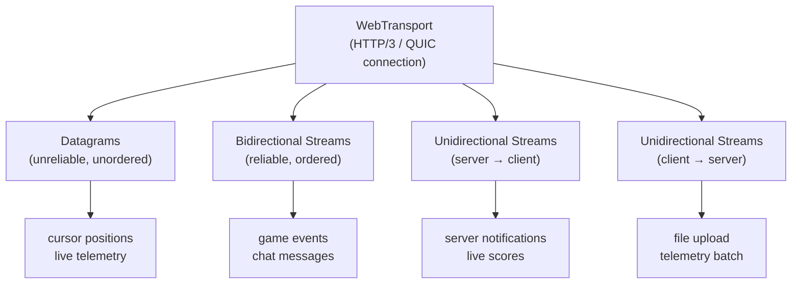

# [FEE-411] WebTransport

:::info
WebTransport 是建立在 HTTP/3 與 QUIC 之上的瀏覽器 API，透過單一低延遲連線提供不可靠的 datagram（類 UDP，無傳遞保證）與可靠的有序串流。它專為 WebSocket 延遲過高的場景設計——即時遊戲、即時遙測與游標同步。截至 2026 年，正式環境使用 WebTransport 時仍需提供 WebSocket 備援方案。
:::

## 簡介

自 2011 年起，WebSocket 一直是瀏覽器上雙向通訊的主流機制。
它建立在 TCP 之上，透過持久連線提供有序、可靠的訊息傳輸。
其廣泛的瀏覽器支援與簡潔的事件驅動 API，使其成為聊天應用、協作編輯器與即時儀表板的預設選擇。
然而，TCP 的核心特性——保證交付與嚴格排序——在規模化或網路不穩定的場景下會帶來明顯成本。
當單一 TCP 封包遺失時，整條連線必須等待該遺失封包重傳，這種現象稱為「隊首阻塞」（head-of-line blocking）。
對於產生高頻更新、且最新值本就會取代先前所有值的應用——游標位置、感測器讀數、遊戲實體座標——一個阻塞新資料傳輸的遺失封包，反而比直接捨棄它更糟糕。

WebTransport 透過建立在 QUIC 之上解決了這個根本限制——QUIC 也是 HTTP/3 的底層傳輸協定。
QUIC 是基於 UDP 的協定，在每個串流層面各自實作可靠性與壅塞控制，意味著某個串流上的封包遺失不會阻礙其他串流的傳輸進度。
WebTransport 提供兩種截然不同的原語：

- **datagram** — 完全不可靠且無序，類似原始 UDP，但透過 HTTP/3 連線進行分幀與多工。
- **串流** — 可靠且有序，類似 WebSocket 訊息，但各串流相互獨立，一個慢速串流不會阻塞另一個。

單一 WebTransport 連線可同時承載數十個獨立串流與持續的 datagram 流，免除了過去為避免隊首阻塞而開啟多個 WebSocket 連線的變通方案。

此 API 的設計貼近平台底層——datagram 與串流均以 `ReadableStream` 與 `WritableStream` 介面公開，這與 Streams API 和 Fetch API 所使用的原語完全相同。
這意味著從 `Response.body` 或 `TransformStream` 管線所學到的模式可直接套用於 WebTransport。
連線生命週期採用 Promise 設計：

- 建構子啟動 QUIC 握手後立即返回。
- `transport.ready` 在連線完全建立、資料可以流動時 resolve。
- `transport.closed` 在連線結束時 resolve 或 reject，並攜帶可選的關閉碼與原因。

截至 2026 年，Chrome 97+ 與 Edge 97+ 已穩定支援，Firefox 僅在旗標後可用，Safari 則為實驗性支援。
這個支援缺口意味著任何正式環境部署都必須搭配 WebSocket 備援方案，並在啟動時進行功能偵測。
WebTransport 連線需要 HTTPS 來源；其安全模型與 CORS 類似，伺服器必須明確選擇加入。

## 設計思維

採用 WebTransport 時，首要設計決策是你的使用場景是否真正能從中受益。QUIC 相對於 TCP 的延遲優勢，僅在規模化或封包遺失率高的網路條件下才會顯現；對於在穩定寬頻網路上運行的聊天應用，改善幅度幾乎微不可察。重大代價在於備援複雜度：你必須實作並維護兩條通訊路徑、保持其訊息格式相容，並在正式環境對兩者進行測試。只有當 WebTransport 的低延遲特性能實質改善使用者體驗時，這項投資才值得。最明確的適用場景包括：即時多人遊戲（20 毫秒的往返時間縮短決定命中或落空）、跨數十個游標共享游標位置（舊資料本就應被捨棄）、以及高頻遙測管線（捨棄一個感測器讀數可接受，但累積背壓不可接受）。

第二個設計決策是為每種訊息類型選擇合適的 WebTransport 原語。datagram 適用於會被下一次更新所取代的值：游標位置、實體轉換、感測器採樣、存在感 ping。串流適用於必須到達且按序處理的訊息：遊戲事件、聊天訊息、身份驗證握手、檔案內容。在同一連線上同時使用 datagram 與串流，既正確又常見——透過 datagram 傳送游標位置，同時透過雙向串流路由聊天與遊戲狀態。QUIC 的多工層會透明地處理兩者的共存。團隊 SHOULD 避免為了最小化延遲而將所有流量強制通過 datagram；任何遺失後需要補償請求的訊息，都應透過串流傳輸。

第三個考量是背壓（backpressure）。`WritableStream` 的 writer 提供 `ready` promise，當底層緩衝區有容量時會 resolve。對於串流寫入，團隊 MUST 遵守此背壓訊號，以避免無限制的記憶體增長。datagram 則相反，它不提供背壓機制——若網路無法跟上，QUIC 層會靜默捨棄，這對即時資料是預期行為，但對應用層訊息則是災難性的。如果你的 datagram writer 開始以破壞應用邏輯的速率捨棄訊息，這是一個信號，說明該資料應改用串流傳輸。

第四個考量是伺服器基礎設施的需求。WebTransport 需要伺服器在 UDP 埠（通常是 443）上透過 QUIC 支援 HTTP/3。許多現有的後端技術堆疊僅支援基於 TCP 的 HTTP/1.1 或 HTTP/2。因此，採用 WebTransport 需要將後端遷移至支援 HTTP/3 的伺服器（Caddy、帶有 ngx_http_v3_module 的 NGINX、Cloudflare Workers，或專用的 WebTransport 伺服器如 webtransport-go），或引入終止 QUIC 並轉發至現有 TCP 後端的 sidecar 或閘道。這個基礎設施問題往往是既有後端架構的團隊採用 WebTransport 的最大障礙，也進一步強調了 WebSocket 備援方案的必要性——在 HTTP/3 層佈建與測試期間，備援方案可繼續使用現有的 TCP 堆疊。

**表一：WebSocket vs SSE vs WebTransport**

| 場景 | WebSocket | SSE | WebTransport |
|---|---|---|---|
| 雙向通訊 | 是 | 否 | 是 |
| 不可靠的 datagram | 否 | 否 | 是 |
| 多個獨立串流 | 否（單一串流） | 否 | 是（並行串流） |
| 建立在 | TCP | HTTP/1.1 或 HTTP/2 | HTTP/3 / QUIC |
| 瀏覽器支援（2026） | 通用 | 通用 | Chrome/Edge；Safari 實驗性 |
| 備援複雜度 | 低 | 低 | 高（需要 WebSocket 備援） |
| 最適合 | 聊天、協作編輯 | 即時 feed、LLM 串流 | 遊戲、即時遙測、低延遲同步 |

**表二：WebTransport 內部——datagram vs 串流**

| 需求 | 使用 |
|---|---|
| 位置更新、游標同步（舊資料可接受） | datagram |
| 聊天訊息、遊戲狀態事件（必須到達） | 雙向串流 |
| 伺服器 → 客戶端事件（單向、可靠） | 單向串流（伺服器 → 客戶端） |
| 帶進度的檔案上傳（單向、可靠） | 單向串流（客戶端 → 伺服器） |

## 最佳實踐

**始終搭配 WebSocket 備援方案。** 單靠功能偵測不夠充分——即使在 Chrome 中，若伺服器配置錯誤或網路路徑不支援 QUIC，WebTransport 連線仍可能失敗。正確的做法是以真實連線嘗試（`await transport.ready`）進行探測，而非能力檢查（`'WebTransport' in window`），並在任何失敗時回退到 WebSocket。請在傳輸抽象層設計兩條路徑，共用相同的訊息模型，使應用層在切換傳輸層時無需變更。

**在任何 I/O 之前先 await `transport.ready`。** `WebTransport` 建構子在啟動 QUIC 握手後立即返回，但連線在 `transport.ready` resolve 之前無法使用。在此 promise resolve 之前對 datagram writer 呼叫 `getWriter()` 或開啟串流，將會拋出 `InvalidStateError`。請集中管理連線建立邏輯，在返回 transport 實例前先 await `ready`，讓呼叫方無法意外使用未連線的 transport。

**及時釋放所有串流鎖定。** 每次呼叫 `getReader()` 與 `getWriter()` 都會對串流施加鎖定。若未呼叫 `reader.releaseLock()` 或 `writer.releaseLock()`（或未關閉 writer），將阻塞任何後續消費者，最終導致連線停頓。請使用 `try/finally` 區塊確保即使在串流中途發生錯誤，鎖定也一定會被釋放。

**監聽 `transport.closed` 以偵測斷線。** `closed` promise 在伺服器意外終止連線時會以包含 `closeCode` 與 `reason` 的錯誤物件 reject。請在連線後立即附加 `.catch()` 處理器，以觸發重連邏輯或顯示使用者可見的錯誤狀態。不要依賴 datagram 讀取迴圈結束來偵測斷線——連線關閉時它們會靜默結束。

**不要讓多個並行發送方共用單一 `WritableStreamDefaultWriter`。** `WritableStream` 只有一個 writer 鎖定。若多個協程各自呼叫 `getWriter()` 而不協調，第二次呼叫將會拋出錯誤。當應用程式的多個部分需要寫入同一串流時，請使用佇列或專用的序列化層。

**根據 QUIC 串流語意調整訊息粒度。** 每次呼叫 `transport.createBidirectionalStream()` 都會開啟一個新的 QUIC 串流。為每條聊天訊息開啟一個串流是浪費的——推薦在單一長效雙向串流上多工邏輯訊息，搭配應用層分幀協定（例如長度前綴或換行分隔的 JSON 封包）。相反地，若兩種訊息類型具有獨立的排序需求（例如遊戲狀態與語音控制命令），使用獨立串流可確保一個慢速處理器不會延遲另一個。

**應該（SHOULD）在使用場景可容忍封包遺失、且最小化往返延遲比保證傳遞更重要時，選擇 WebTransport 而非 WebSocket。** QUIC 相對於 TCP 的延遲優勢，在即時多人遊戲、高頻游標共享與即時遙測等場景中才真正發揮作用——這些場景中，被下一次更新取代的舊資料比因重傳而延遲的新資料更可接受。對於每條訊息都必須送達且排序有意義的應用（聊天、協作編輯、身份驗證），TCP 的頭端阻塞代價是可接受的，WebTransport 的備援複雜度則不值得引入。

**應該（SHOULD）在需要訊息排序與保證傳遞時，使用 WebTransport 可靠串流而非 datagram。** datagram 在設計上是不可靠的——在網路壅塞時，QUIC 層會靜默捨棄它們，且不通知發送方。任何遺失後需要補償請求（重新取得狀態、要求伺服器重傳）的應用層訊息，都應透過雙向或單向串流傳輸，而非 datagram 通道。datagram 應僅用於最新值即已足夠、且接收到的資料之間存在落差對應用邏輯可接受的資料。

**在投入之前驗證伺服器端的 QUIC 與 HTTP/3 支援。** WebTransport 需要伺服器透過 QUIC 支援 HTTP/3。許多現有的負載平衡器、CDN 與雲端平台需要明確設定才能啟用 HTTP/3。即使本地開發時 `transport.ready` 成功，若生產環境的入口基礎設施封鎖或剝除 QUIC 流量，仍會失敗。應將完整路徑——包括任何中間代理——納入 WebTransport 整合測試的範疇。

## Mermaid 圖



## 範例

以下六個程式碼區塊涵蓋完整生命週期：功能偵測與備援、連線建立、datagram 發送與接收、雙向串流使用、讀取伺服器主動發起的單向串流，以及優雅關閉。

```ts
// feature-detect.ts — WebTransport with WebSocket fallback
type TransportTier = 'webtransport' | 'websocket';

async function detectTransport(wtUrl: string, _wsUrl: string): Promise<TransportTier> {
  // _wsUrl is used by the caller to construct the WebSocket fallback connection
  if ('WebTransport' in window) {
    try {
      const transport = new WebTransport(wtUrl);
      await transport.ready; // 若伺服器不可達或不支援則拋出例外
      transport.close();     // 關閉探測連線
      return 'webtransport';
    } catch {
      // 瀏覽器支援 WebTransport 但連線失敗（網路問題、伺服器配置）
    }
  }
  return 'websocket';
}

// 使用方式
const tier = await detectTransport('https://api.example.com/wt', 'wss://api.example.com/ws');
if (tier === 'webtransport') {
  // 使用 WebTransport 路徑
} else {
  // 使用 WebSocket 路徑
}
```

`detectTransport` 使用真實連線進行探測，而非靜態能力檢查，因為能力完整的瀏覽器在不相容的網路上，若路由到無法使用的路徑，會在執行期才失敗。探測用的 transport 在 `ready` resolve 後立即關閉，不佔用伺服器資源。

```ts
// connect.ts — WebTransport 連線與生命週期
async function createTransport(url: string): Promise<WebTransport> {
  const transport = new WebTransport(url);

  // 在傳送任何資料前 MUST await ready
  await transport.ready;
  console.log('WebTransport connected');

  // 監控連線關閉
  transport.closed
    .then(() => console.log('Connection closed gracefully'))
    .catch((err: Error) => console.error('Connection error:', err.message));

  return transport;
}
```

`closed` 處理器在函式返回前就附加好，這樣即使連線在 `ready` 後立即斷線，重連或錯誤回報邏輯也能正常觸發。`.catch()` 分支處理伺服器以非零關閉碼關閉連線或底層 QUIC 連線被突然終止的情況。

```ts
// datagrams.ts — 不可靠的 datagram（游標位置、遙測）
async function sendDatagram(transport: WebTransport, payload: object): Promise<void> {
  const writer = transport.datagrams.writable.getWriter();
  try {
    const data = new TextEncoder().encode(JSON.stringify(payload));
    await writer.write(data);
  } finally {
    writer.releaseLock();
  }
}

async function receiveDatagrams(transport: WebTransport): Promise<void> {
  const reader = transport.datagrams.readable.getReader();
  const decoder = new TextDecoder();

  try {
    while (true) {
      const { value, done } = await reader.read();
      if (done) break;
      // Datagram 可能亂序到達或根本不到達——捨棄過時的資料完全可接受
      const msg = JSON.parse(decoder.decode(value));
      console.log('Datagram:', msg);
    }
  } finally {
    reader.releaseLock();
  }
}
```

datagram readable 迴圈在 `done` 為 `true` 時退出，瀏覽器在 transport 連線關閉時會設定此值。`finally` 區塊確保即使在 JSON 解析過程中拋出例外，reader 鎖定也一定會被釋放。

```ts
// bidirectional-stream.ts — reliable ordered messages (game events, chat)
async function useBidirectionalStream(transport: WebTransport): Promise<void> {
  const stream = await transport.createBidirectionalStream();
  const encoder = new TextEncoder();
  const decoder = new TextDecoder();

  // Write to stream
  const writer = stream.writable.getWriter();
  await writer.write(encoder.encode(JSON.stringify({ type: 'subscribe', room: 'game-1' })));
  // Release the lock so other parts of the code can send messages on this stream
  writer.releaseLock();

  // Read from stream until server closes it
  const reader = stream.readable.getReader();
  try {
    while (true) {
      const { value, done } = await reader.read();
      if (done) break;
      console.log('Stream message:', decoder.decode(value));
    }
  } finally {
    reader.releaseLock();
  }

  // Close the writable side after reading is complete
  // (acquire a fresh writer lock now that reading has finished)
  const w = stream.writable.getWriter();
  await w.close();
}
```

`createBidirectionalStream` 開啟一個新的 QUIC 串流，返回具有 `.readable` 與 `.writable` 兩側的 `WebTransportBidirectionalStream`。傳送初始訂閱訊息後釋放 writer，使程式碼的其他部分可以取得 writer 鎖定來傳送後續訊息。在 `finally` 區塊中明確關閉可寫側，向伺服器傳達此串流不再有新資料。

```ts
// server-streams.ts — 接收伺服器主動發起的單向串流
async function readServerStreams(transport: WebTransport): Promise<void> {
  const decoder = new TextDecoder();
  const streamReader = transport.incomingUnidirectionalStreams.getReader();

  try {
    while (true) {
      const { value: stream, done } = await streamReader.read();
      if (done) break;

      // 獨立（非阻塞）處理每個伺服器串流
      (async () => {
        const reader = stream.getReader();
        try {
          while (true) {
            const { value, done: streamDone } = await reader.read();
            if (streamDone) break;
            console.log('Server stream chunk:', decoder.decode(value));
          }
        } finally {
          reader.releaseLock();
        }
      })().catch((err: Error) => console.error('Stream error:', err));
    }
  } finally {
    streamReader.releaseLock();
  }
}
```

`transport.incomingUnidirectionalStreams` 是一個 `ReadableStream<WebTransportReceiveStream>`，每當伺服器開啟一個串流時就會產生一個條目。每個產生的串流本身也是一個 `ReadableStream<Uint8Array>`。內部 IIFE 並行處理每個串流，不阻塞等待新串流的外層迴圈，確保外層 reader 不會被慢速的內層消費者阻塞。

```ts
// close.ts — 優雅關閉
async function closeTransport(transport: WebTransport): Promise<void> {
  // 可選擇性傳送關閉碼與原因
  transport.close({ closeCode: 0, reason: 'Session ended' });

  // 等待遠端確認關閉
  await transport.closed;
  console.log('Transport closed');
}
```

呼叫 `transport.close()` 啟動優雅的 QUIC 連線關閉，向伺服器傳送 `CONNECTION_CLOSE` 幀。之後 await `transport.closed` 確保應用程式等待伺服器確認後，再釋放連線相關資源或重導向使用者。對於突然終止（例如分頁卸載），瀏覽器會自動處理 QUIC 連線的拆除。

## 常見錯誤

**對必須傳遞的訊息使用 datagram。** datagram 在設計上就是不可靠的——QUIC 在壅塞時會直接捨棄，不重傳，且不通知發送方。任何遺失後需要補償請求的訊息（重新獲取狀態、要求重送），都表明它應使用可靠串流而非 datagram 通道。

**未在傳送前 await `transport.ready`。** `WebTransport` 建構子在開始 QUIC 握手後立即返回。連線在 `transport.ready` resolve 之前無法使用。在此 promise resolve 前呼叫 `getWriter()` 並寫入 datagram 或開啟串流，將拋出 `InvalidStateError`。集中管理連線建立邏輯可消除這類錯誤。

**沒有 WebSocket 備援方案。** 截至 2026 年，WebTransport 在 Firefox 穩定版與 Safari 中不受支援。未提供備援方案直接部署，會靜默破壞相當比例的使用者體驗。備援方案必須在傳輸抽象層實作——而非作為 UI 中可見的模式切換——讓應用層保持傳輸無關性。

**未明確關閉串流。** 若未關閉，`WritableStream` 與 `ReadableStream` 的 handle 會累積。未對雙向串流的可寫側呼叫 `writer.close()`，會讓串流維持半開狀態，伺服器可能無限等待客戶端的 FIN。未呼叫 `reader.releaseLock()` 則阻止串流被任何其他 reader 關閉或消費。請始終使用 `try/finally` 釋放鎖定並關閉 writer。

**將 WebTransport 視為 WebSocket 的即插即用替代方案。** WebSocket API 是事件驅動的（`onmessage`、`send`），在單一全雙工通道上運作，沒有獨立串流或無序傳遞的概念。WebTransport 使用 `ReadableStream` / `WritableStream` 原語，支援多個並行串流，並增加 datagram 作為獨立通道類型。將基於 WebSocket 的系統遷移至 WebTransport，需要重新設計訊息模型——決定現有訊息哪些變成 datagram、哪些變成串流，以及應用程式如何在 QUIC 連線上多工邏輯對話。

## 相關 FEE

- [FEE-409：WebSockets 與 Server-Sent Events](./409.md) — 通用備選方案；WebSocket 是 WebTransport 的必要備援
- [FEE-403：Fetch、串流與網路 API](./403.md) — `ReadableStream` / `WritableStream` 就是 WebTransport 串流所使用的相同介面
- [FEE-708：HTTP/1.1、HTTP/2 與 HTTP/3：協定演進](../Rendering%20and%20Performance/708.md) — HTTP/3 與 QUIC 是 WebTransport 的建立基礎

## 參考資料

- [MDN: WebTransport API](https://developer.mozilla.org/en-US/docs/Web/API/WebTransport_API)
- [W3C WebTransport Specification](https://w3c.github.io/webtransport/)
- [RFC 9297 — WebTransport over HTTP/3](https://datatracker.ietf.org/doc/html/rfc9297)
- [Chrome Developers: WebTransport](https://developer.chrome.com/docs/capabilities/web-apis/webtransport)
- [Chrome Status: WebTransport](https://chromestatus.com/feature/4854144902889472)
- [MDN: WebTransport.datagrams](https://developer.mozilla.org/en-US/docs/Web/API/WebTransport/datagrams)
- [MDN: WebTransport.createBidirectionalStream](https://developer.mozilla.org/en-US/docs/Web/API/WebTransport/createBidirectionalStream)
