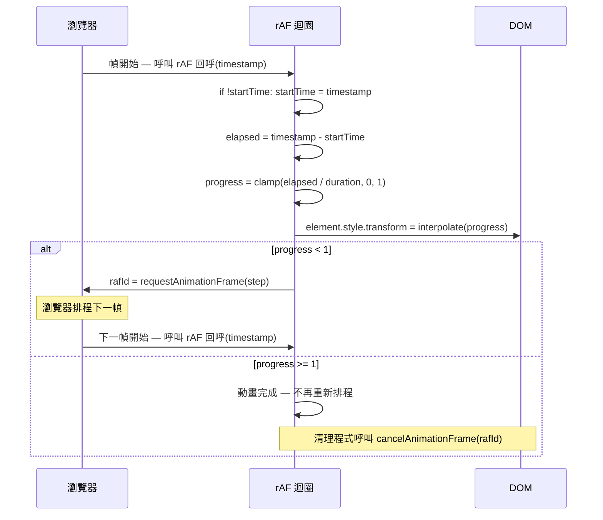

# `requestAnimationFrame` 與動畫計時

:::info
`requestAnimationFrame` 是瀏覽器針對視覺動畫提供的幀同步排程 API。它取代
`setInterval`/`setTimeout` 作為動畫迴圈的排程機制，將 JavaScript 執行與螢幕
更新頻率同步，並在分頁移至背景時自動暫停。回呼接收 `DOMHighResTimeStamp`，
以供以時間為基礎（幀率無關）的進度計算使用。
:::

以 `setInterval` 或 `setTimeout` 驅動的 JavaScript 動畫有一個根本問題：計時
器以固定間隔觸發，完全不考慮瀏覽器何時準備好進行繪製。若渲染管線正忙碌，計
時器仍然觸發，排入一個在下一幀才能顯示的 DOM 變更——造成掉幀與畫面抖動（jank）。
`requestAnimationFrame`（rAF）透過讓瀏覽器在每一幀開始時呼叫你的動畫函式、並
與螢幕更新頻率同步，從根本上解決了這個問題。這種同步不只是便利性的體現；它是
一種機制，將 JavaScript 執行與瀏覽器自身的渲染排程對齊，確保在 rAF 回呼內進
行的每個 DOM 變更都能在緊接著的下一次繪製中呈現。

rAF 並不保證 60fps；它保證的是回呼在下一次繪製之前執行。在 60Hz 螢幕上，這
大約是每 16.7ms 一次；在 120Hz 螢幕上，大約是每 8.3ms 一次；在背景分頁受到
節流的情況下，頻率則更低。rAF 驅動的動畫在分頁被移至背景時會自動暫停，防止
不可見的動畫持續消耗 CPU 資源。這個行為由瀏覽器在平台層級強制執行——你不需
要撰寫任何程式碼來實現它。限制動畫工作的同一幀預算，也限制了其他主執行緒活
動，因此理解 rAF 意味著理解幀預算，以及哪些工作在其中相互競爭時間。

`performance.now()` 提供高解析度時間戳記，可用於獨立於幀率之外衡量動畫進度。
rAF 回呼接收一個 `DOMHighResTimeStamp` 引數，讓動畫能依據經過時間而非幀數來
推進。這使動畫具備幀率無關性：一個應持續一秒的動畫，在 30fps 與 120fps 下都
精確完成於一秒之內。時間戳記引數由瀏覽器自身提供，並反映與 `performance.now()`
相同的時間原點，因此具備次毫秒解析度且單調遞增。仰賴這個特性的團隊，可以完全
以經過時間來表達動畫曲線、彈簧動力學與緩動函式，將動畫模型與設備的渲染節奏
完全解耦。

## 使用情境

你正在實作一個應以每秒 60 幀順暢運行的進度指示器。使用 16ms 的 `setInterval` 會產生抖動，因為計時器回呼無法與瀏覽器的渲染週期同步——某些幀收到兩次更新，某些幀一次也沒有。`requestAnimationFrame` 將回呼排定在每幀、瀏覽器繪製前執行，確保每次動畫更新都恰好被渲染一次，且在分頁隱藏時動畫會自動暫停。

## 設計思維

### rAF 回呼迴圈

標準 rAF 迴圈的起點是以一個具名的 step 函式呼叫 `requestAnimationFrame`。
當瀏覽器準備好繪製下一幀時，它會呼叫該函式並傳入一個 `DOMHighResTimeStamp`
作為第一個引數。在 step 函式內部，動畫計算 `(timestamp - startTime) / duration`
得出進度，將結果夾緊在 [0, 1] 範圍內以防幀延遲時超出邊界，對夾緊後的進度值
套用緩動函式，將緩動後的進度映射至被動畫化的屬性，將結果寫入 DOM，然後——
若進度尚未到達 1——再次呼叫 `requestAnimationFrame(step)` 以排程下一次迭代。

每次 `requestAnimationFrame` 呼叫的回傳值是一個整數控制代碼，在瀏覽器的幀排
程佇列中識別待執行的回呼。該控制代碼 MUST（必須）儲存在清理程式碼可存取的
變數中，因為它是 `cancelAnimationFrame(id)` 的唯一引數。以儲存的控制代碼呼
叫 `cancelAnimationFrame`，可在回呼觸發前將其從佇列移除，乾淨地終止迴圈，不
再執行任何後續動畫邏輯或 DOM 更新。若控制代碼未被儲存——例如呼叫以行內方式
出現而未賦值——就沒有辦法取消待執行的回呼，動畫迴圈將在動畫元素從文件移除
後仍持續執行。

`startTime` 變數通常在第一幀才初始化，而非在迴圈開始前，因為呼叫
`requestAnimationFrame` 啟動迴圈到瀏覽器傳送第一個時間戳記之間存在不確定的
延遲。從第一個時間戳記引數初始化 `startTime`，確保動畫不會因設置延遲而從中
途開始。標準做法是以 `if (!startTime) startTime = timestamp;` 作為 step 函式
的第一行，緊接著進行經過時間的計算。

### requestIdleCallback

`requestIdleCallback` 是專為非視覺背景工作設計的配套 API：分析資料批次傳送、
連結預取、背景運算、Service Worker 快取預填充，以及非緊急狀態序列化。rAF 在
每一幀開始時觸發以更新使用者所見，而 `requestIdleCallback` 則在幀與幀之間的
閒置期觸發——即瀏覽器完成所有待處理渲染工作後的空閒時間。回呼接收一個
`deadline` 物件，透過 `timeRemaining()` 方法回傳瀏覽器在需要重新接管以處理
下一幀或使用者輸入事件之前剩餘的毫秒數。

在閒置回呼內執行的工作 SHOULD（應該）反覆檢查 `deadline.timeRemaining()`，
並在預算耗盡時讓出控制權，而非無論時間壓力如何都執行到完成。常見做法是維護
一個待處理工作項目的佇列，每次 `timeRemaining()` 檢查時處理一個項目，在截止
時間接近時讓出回瀏覽器，並透過另一個 `requestIdleCallback` 呼叫為剩餘項目重
新排程。`timeout` 選項允許指定最長等待時間（毫秒），過後無論瀏覽器是否閒置
都會呼叫回呼——這防止了關鍵但非緊急的工作在持續高活動期間被無限期延後。

`requestIdleCallback` 並非普遍可用——截至 2026 年，Safari 仍未支援——因此正
式環境的程式碼 MUST（必須）搭配一個在 API 不存在時以短暫延遲排程工作的
`setTimeout` 備援方案。備援方案無法完美複製閒置排程語義，但它防止工作在不支
援的瀏覽器上被靜默略過。典型的 shim 檢查 `'requestIdleCallback' in window`，
並據此路由至真實 API 或 `setTimeout(callback, 0)` 備援。

### PerformanceObserver 與繪製計時

`PerformanceObserver` 讓應用程式無需輪詢即可觀察瀏覽器發出的效能條目。以
`entryTypes: ['longtask']` 訂閱，可偵測阻塞主執行緒超過 50 毫秒的任務——這
是使用者輸入開始感覺遲鈍、動畫回呼有錯過幀截止時間風險的臨界值。每個
`PerformanceLongTaskTiming` 條目包含 `duration` 與 `startTime`，可與 rAF 時
間戳記關聯，以識別哪些幀因長任務干擾而被掉幀。

長動畫幀 API（`entryTypes: ['long-animation-frame']`）將此概念延伸至擷取渲染
時間超過 50 毫秒的幀，比單純的長任務提供更具可行性的資料，因為它同時涵蓋了
腳本執行之後的渲染工作。`PerformanceLongAnimationFrameTiming` 條目回報總幀時
長、幀內腳本執行時長、樣式與版面配置工作時長，以及涉及的腳本名稱。這使識別
慢幀是由動畫邏輯、第三方腳本或昂貴的 CSS 重算所造成變得切實可行。

`performance.measure(name, startMark, endMark)` 建立一個橫跨兩個使用者標記的
具名 `PerformanceMeasure` 條目，讓動畫各階段得以精確量測。在 step 函式頂部
放置 `performance.mark('raf:start')`，底部放置 `performance.mark('raf:end')`，
並呼叫 `performance.measure('raf:frame', 'raf:start', 'raf:end')` 來擷取每幀
計時資料。這些測量結果可由訂閱 `entryTypes: ['measure']` 的
`PerformanceObserver` 觀察，使將動畫計時資料串流至分析端點變得簡便，且不會
阻塞動畫迴圈。

### 排程 API 比較

瀏覽器提供三種不同的排程 API，在渲染管線中各司其職。了解何時使用哪一種，可
防止誤用以及隨之而來的效能問題。

| API | 觸發時機 | 主要用途 | 分頁背景化後 |
|---|---|---|---|
| `setInterval` / `setTimeout` | 固定時鐘間隔 | 一般非同步任務 | 持續觸發（部分瀏覽器節流） |
| `requestAnimationFrame` | 每次繪製前 | 視覺動畫 | 自動暫停 |
| `requestIdleCallback` | 瀏覽器閒置時 | 背景/非視覺工作 | 可能被無限期延後 |

只有 `requestAnimationFrame` 與渲染管線有直接關係。計時器 API 是一般非同步工
作的排程工具；它們在許多情況下碰巧也能用於動畫，但在負載下會崩潰。
`requestIdleCallback` 刻意設計為低優先權佇列，在設備忙碌時可被無限期延後，
因此不適合任何必須在使用者感知到延遲前完成的工作。

### CSS 動畫 vs. JavaScript rAF

CSS 動畫與 CSS 轉場在合成器執行緒（compositor thread）上執行——這是一個獨立
於主 JavaScript 執行緒的專用渲染執行緒。由於合成器執行緒的動畫完全繞過
JavaScript 執行與主執行緒版面配置，即使主執行緒被長任務阻塞，它們仍能流暢
運行。可在不觸發版面配置或繪製的情況下合成的屬性——`opacity` 與
`transform`——是典型範例。透過 CSS 關鍵幀或 Web Animations API 對具有合成層
的元素動畫化 `opacity` 與 `transform`，產生的動畫完全不受主執行緒抖動影響。

JavaScript rAF 適用於需要執行期邏輯的動畫：物理模擬、彈簧動力學、讀取指標
速度的手勢驅動動畫、具有相互依賴性的多元素序列動畫，以及任何參數取決於無法
在編譯時以 CSS 關鍵幀表達之狀態的動畫。Web Animations API
（`element.animate(keyframes, options)`）提供中間路徑——它在合成器執行緒上執
行，但接受 JavaScript 物件作為關鍵幀，允許動態生成關鍵幀而無需 rAF 迴圈的
抖動風險。對於可表達為有限關鍵幀集合的動畫，優先選擇 Web Animations API 而
非手動 rAF 迴圈；將 rAF 保留給真正需要無法預先計算之每幀 JavaScript 評估的
動畫。

### 幀預算與效能觀測

在 60Hz 顯示器上，每一幀的預算為 16.7 毫秒；在 120Hz 顯示器上約為 8.3 毫秒。這個預算必須涵蓋 JavaScript 執行、樣式計算、版面配置、繪製，以及合成。rAF 回呼佔用的時間越多，留給其他主執行緒工作的預算就越少。`PerformanceObserver` 訂閱 `entryTypes: ['long-animation-frame']` 可即時偵測超過 50 毫秒的幀，讓工程師能識別哪些動畫邏輯或第三方腳本正在造成掉幀，而不必依賴手動的 DevTools 效能錄製。

追蹤每幀時間的常見模式，是在 rAF 回呼的頂部與底部分別呼叫 `performance.mark('raf:start')` 和 `performance.mark('raf:end')`，然後使用 `performance.measure('raf:frame', 'raf:start', 'raf:end')` 建立具名的 `PerformanceMeasure` 條目。這些條目可由 `PerformanceObserver` 觀察，讓動畫計時資料能以最小的主執行緒開銷串流至分析端點。

## 最佳實踐

**必須（MUST）透過 `requestAnimationFrame` 而非 `setInterval` 或 `setTimeout` 來驅動 JavaScript 視覺動畫。** 計時器驅動的動畫與瀏覽器渲染管線完全脫節：當渲染執行緒忙碌時，計時器回呼會堆積並連續觸發，產生一陣 DOM 變更爆發，接著是數個空白幀，形成使用者可感知的畫面抖動。`requestAnimationFrame` 是任何在迴圈中讀取 DOM 值並寫入 DOM 值以產生視覺動態之 JavaScript 程式碼的正確排程機制。唯一的例外是可以表達為 CSS 轉場或 CSS 關鍵幀動畫的場景（這些動畫可在合成器執行緒上執行），或使用 Web Animations API（其在底層使用與 rAF 相同的幀同步機制）。

**應該（SHOULD）以經過時間的函式（`timestamp - startTime`）而非幀數來表達動畫進度。** 以幀數為基礎的動畫在 120Hz 螢幕上會以 60Hz 螢幕兩倍的速度播放，並在系統負載導致幀率降至 30fps 時減半速度。以時間為基礎的動畫，無論設備更新頻率或當下幀率如何，都能以相同的時鐘時間持續播放，確保跨設備的使用者體驗一致。應從 rAF 時間戳記引數推導所有時間狀態，而非依賴外部時鐘或手動追蹤的計數器。

**必須（MUST）在動畫元素從 DOM 移除或元件卸載時取消 `requestAnimationFrame`
回呼。** 持有已移除元素參考的 rAF 迴圈會阻止該元素被垃圾回收，並持續在每一
幀執行 JavaScript，為不產生任何可見輸出的工作消耗 CPU 資源。將
`requestAnimationFrame` 的回傳值儲存在清理函式可存取的變數中——通常是閉包中
的變數或 React 元件中的 ref——並在元件卸載、元素移除或動畫完成的處理程式中
呼叫 `cancelAnimationFrame(id)`。在 React 中，標準做法是從 `useEffect` 回傳
取消函式：effect 主體啟動迴圈並回傳 `() => cancelAnimationFrame(rafId)`，
React 在元件卸載或 effect 相依性變更時呼叫此函式。在 Web Components 中，
`disconnectedCallback` 生命週期方法是放置取消呼叫的正確位置。未能取消是一種
靜默的記憶體與 CPU 洩漏，只有在反覆掛載與卸載的週期中才會顯現，在開發環境
可能不易察覺，但在具有頻繁導航的正式環境應用中則相當顯著。

**應該（SHOULD）避免在同一個 rAF 回呼中讀取版面配置屬性（`offsetWidth`、
`getBoundingClientRect`、`scrollTop`）後隨即寫入 DOM 屬性。** 在寫入之後讀
取版面配置屬性，會強制觸發同步版面配置重算——即強制回流（forced reflow）或
版面配置碎片化（layout thrash）。瀏覽器必須沖刷待處理的樣式與版面配置工作
才能回傳正確的量測值，中斷渲染管線並消耗原本可用於當前幀的時間。在以 60fps
運行、擁有 16.7ms 預算的動畫中，一次耗時 5ms 的強制回流，在實際動畫工作完
成之前就消耗了整個幀預算的近三分之一。在單一回呼中，所有讀取應集中於頂部，
計算新值後，所有 DOM 寫入集中於末尾。若讀寫關切點分屬程式碼的不同部分，應
透過共享的幀排程器協調，收集所有讀取、批次解析，然後分派寫入——而非讓每個
消費者在同一幀內以任意順序各自讀寫。

**應該（SHOULD）在動畫迴圈中使用 `performance.now()` 測量時間差，而非
`Date.now()`。** `performance.now()` 提供次毫秒解析度，且具單調遞增性，意即
它不會因 NTP 或手動設定所造成的系統時鐘調整而向後跳或向前跳。`Date.now()`
只有毫秒解析度，且受時鐘偏移影響，不適合用於次幀精確度至關重要的動畫時間
測量。傳入 rAF 回呼的時間戳記引數本身已是與 `performance.now()` 特性相同的
`DOMHighResTimeStamp`——相同的時間原點、相同的解析度、相同的單調保證——因此
僅從 rAF 時間戳記引數推導經過時間的動畫迴圈，無需額外呼叫
`performance.now()` 即可獲得高解析度。需要明確使用 `performance.now()` 的情
況，是測量橫跨 rAF 回呼之外的時間差，例如測量動畫總設置時間或首幀延遲。

**應該（SHOULD）在 `requestIdleCallback` 內檢查 `deadline.timeRemaining()`，
並在預算耗盡時讓出控制權。** 閒置回呼在幀與幀之間的空閒時間執行，但該空閒
時間是有限的。不檢查剩餘時間預算而執行長時間同步運算的回呼，若超出閒置視窗
將會阻塞下一幀的渲染工作。維護待處理工作項目的佇列，每次檢查時處理一個項目，
並在 `timeRemaining()` 接近零時透過另一個 `requestIdleCallback` 呼叫重新排程
剩餘項目。對於 `requestIdleCallback` 不可用的環境——截至 2026 年的
Safari——使用 `setTimeout(callback, 0)` 備援以防止靜默失敗，但需接受備援方
案不提供真正的閒置排程語義。

## 視覺呈現



## 範例

```js
function animate(element) {
  const duration = 1000; // 1 秒
  let startTime = null;
  let rafId;

  function step(timestamp) {
    if (!startTime) startTime = timestamp;
    const elapsed = timestamp - startTime;
    const progress = Math.min(elapsed / duration, 1);
    element.style.transform = `translateX(${progress * 300}px)`;

    if (progress < 1) {
      rafId = requestAnimationFrame(step);
    }
  }

  rafId = requestAnimationFrame(step);

  // 回傳清理函式，供元件卸載時使用
  return () => cancelAnimationFrame(rafId);
}
```

## 常見錯誤

**使用 `setInterval` 製作動畫。** `setInterval` 以固定的時鐘間隔觸發，完全不
感知瀏覽器渲染管線。當系統處於高負載時，待執行的間隔回呼會堆積，待主執行緒
可用後連續觸發，產生一陣 DOM 變更，期間沒有任何可見輸出。瀏覽器只以自身的
節奏繪製，因此連續的間隔回呼產生多個 DOM 變更，這些變更會折疊成單一視覺幀，
後接一個或多個沒有 DOM 變更的幀——這是抖動的典型特徵。rAF 是正確的原語，因
為瀏覽器只在即將繪製時才呼叫回呼，確保 JavaScript 執行與渲染幀之間一一對應。

**忘記在元件卸載時取消 rAF。** rAF 迴圈在其動畫元素從文件移除後仍持續執行。
迴圈透過閉包持有對元素的參考，阻止元素及所有可從其觸及的物件被垃圾回收。同
時，step 函式持續在每一幀執行，對脫離文件的元素進行樣式修改，並消耗原本應
供其他工作使用的 CPU 預算。在大多數情況下，唯一可觀察到的症狀是其他動畫的
幀率下降與電池壽命縮短。永遠為每個 `requestAnimationFrame` 呼叫在清理路徑中
配對對應的 `cancelAnimationFrame`，並在反覆掛載/卸載的週期中驗證清理程式正
確執行。

**使用幀數而非經過時間。** 每幀固定推進量的動畫，在 120Hz 螢幕上的播放速度
是 60Hz 螢幕的兩倍，在幀率因系統負載降至 30fps 時速度減半。同一個動畫在高
更新頻率設備上可能在 500ms 內完成，在節流至 30fps 的設備上則需 2000ms。以
`(timestamp - startTime) / duration` 表達進度，可使動畫無論螢幕更新頻率或瞬
時幀率為何，都在相同的時鐘時間內完成，確保跨設備的一致使用者體驗。

**在同一個回呼中讀取 `getBoundingClientRect` 後隨即寫入 `style`。** 在任何
DOM 寫入之後讀取版面配置屬性，都會強制瀏覽器在回傳量測值之前沖刷待處理的版
面配置工作——這種同步回流每次可消耗數毫秒。在本就受限於幀預算的 rAF 回呼中，
強制回流可能耗盡剩餘預算，導致幀錯過截止時間、下一幀延遲開始。應將回呼重構
為先執行所有讀取，再執行所有寫入；如可能，將不依賴動畫狀態的讀取完全提升至
回呼之外。

## 相關 FEE

- [FEE-400 — 瀏覽器 API 與 Web 平台總覽](./400.md)
- [FEE-710 — GPU 加速動畫與 `will-change`](../Rendering%20and%20Performance/710.md)
- [FEE-712 — 關鍵渲染路徑與繪製計時](../Rendering%20and%20Performance/712.md)

## 參考資料

- MDN: requestAnimationFrame —
  https://developer.mozilla.org/en-US/docs/Web/API/Window/requestAnimationFrame
- MDN: requestIdleCallback —
  https://developer.mozilla.org/en-US/docs/Web/API/Window/requestIdleCallback
- web.dev: Rendering performance —
  https://web.dev/articles/rendering-performance
- MDN: performance.now() —
  https://developer.mozilla.org/en-US/docs/Web/API/Performance/now
- MDN: PerformanceObserver —
  https://developer.mozilla.org/en-US/docs/Web/API/PerformanceObserver
- web.dev: Long Animation Frames API —
  https://web.dev/articles/long-animation-frames
- MDN: Web Animations API —
  https://developer.mozilla.org/en-US/docs/Web/API/Web_Animations_API
- MDN: cancelAnimationFrame —
  https://developer.mozilla.org/en-US/docs/Web/API/Window/cancelAnimationFrame
- MDN: DOMHighResTimeStamp —
  https://developer.mozilla.org/en-US/docs/Web/API/DOMHighResTimeStamp
