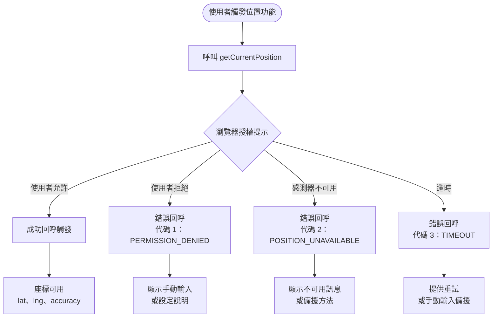

# 地理位置、裝置方向與裝置 API

Geolocation API、Device Orientation API 與 Device Motion API 將硬體感測器暴露
給 Web 應用程式。Geolocation 透過 GPS、Wi-Fi 三角定位或基地台資料提供緯度、
經度、海拔、方向與速度。`DeviceOrientationEvent` 透過加速度計與陀螺儀提供空間
方向資訊。`DeviceMotionEvent` 提供原始加速度與旋轉速率資料。這些 API 共同構成
物理環境與瀏覽器之間的橋樑，讓位置感知服務、擴增實境疊加層、指南針介面與動
作驅動互動得以實現，無需原生應用程式包裝。

所有這些 API 都需要明確的使用者授權。若未出現授權提示，瀏覽器不會允許存取位
置或動作感測器，且在大多數平台上，授權必須在使用者手勢的回應中請求。試圖在
未告知使用者原因的情況下靜默存取位置、或在頁面載入時直接存取的應用程式，將
會被封鎖。iOS Safari 13 及更新版本還額外要求在使用者手勢觸發的程式呼叫中執行
`DeviceOrientationEvent.requestPermission()`，僅設定事件監聽器本身是不夠的。授
權狀態可透過 Permissions API 以 `navigator.permissions.query({ name: 'geolocation' })`
查詢，在嘗試請求之前先確認目前狀態，從而提供更精細的使用者體驗——例如對於
已授權的使用者直接觸發功能，對於已拒絕的使用者顯示設定引導而非再次觸發注定
失敗的提示。

實際挑戰在於處理完整的授權生命週期——請求、取得、處理拒絕、以及適當地再次請
求——同時在感測器不可用時（無 GPS 的桌機瀏覽器、或拒絕授權的使用者）仍提供
有用的體驗。漸進增強是核心原則：功能在沒有感測器的情況下仍可運作；感測器讓
它更好。當授權被拒絕時能退回郵遞區號輸入欄位的位置感知門市查詢，比只呈現空
白狀態的版本更有用。

這三組 API 雖然目的相似，但各自有獨立的授權模型與瀏覽器支援情況。Geolocation
在所有主流瀏覽器中都有一致的支援；`DeviceOrientationEvent` 在桌機上的精確度
較低（通常只有 Wi-Fi 定向，缺乏磁力計）；iOS 的額外授權要求使得動作 API 需要
更多的跨平台測試才能可靠地運作。理解每個 API 的個別限制是在真實環境中部署感
測器功能的前提。在有意義的消費者產品中，這三組 API 經常組合使用：導航應用程
式同時使用 Geolocation 追蹤位置、使用 `DeviceOrientationEvent` 的 `alpha` 值
顯示面對方向；健身追蹤應用程式同時使用 Geolocation 計算路線距離、使用
`DeviceMotionEvent` 計算步數。

## 使用情境

你正在開發一個配送追蹤功能，讓快遞員的位置隨移動即時更新在地圖上。初始實作只在載入時取一次位置。持續追蹤——即時跟隨快遞員的路徑——需要 `watchPosition`，它會在裝置位置變化超過可設定的精度閾值時觸發回呼。Geolocation API、Device Orientation API 及相關裝置 API，透過需要授權的瀏覽器介面將硬體感測器暴露給 Web 應用程式。

## 設計思維

### 單次位置取得 vs. 持續追蹤

`getCurrentPosition` 取得一次位置定位後立即呼叫成功回呼。它適用於在特定時刻
需要位置的功能：尋找附近地點、為表單送出標記座標，或填入運送地址欄位。瀏覽
器查詢可用的位置來源，在設定的逾時時間內等待定位，並傳送結果。成功回呼接收
一個 `GeolocationPosition` 物件，其中包含 `coords`（帶有緯度、經度、海拔、精
確度、方向與速度）以及 `timestamp`（表示定位取得時間的 Unix 時間戳記毫秒值）。
精確度屬性以公尺表示，反映了所使用定位方法的水平不確定性，在 UI 中顯示精確
度圓圈時應加以利用。

`watchPosition` 安裝一個持續的監聽器，每次裝置位置變動超過閾值時就觸發成功回
呼。它回傳一個數字形式的監看 ID，MUST（必須）儲存以供後續清理使用。當不再需
要持續追蹤時——因為使用者離開了追蹤功能、元件已卸載，或工作階段已結束——
`navigator.geolocation.clearWatch(watchId)` 停止監聽器並釋放底層硬體資源。當
功能對使用者不可見時仍保持 `watchPosition` 活躍，會在背景持續輪詢 GPS 硬體，
是消耗行動電池的最快方式之一。規則很簡單：在需要即時位置的功能可見時啟動
`watchPosition`，在其不可見時立即呼叫 `clearWatch`。兩者都可以使用
`Page Visibility API` 的 `visibilitychange` 事件進一步優化：當分頁切換到背景
時暫停 `watchPosition`，返回前景時重新啟動，以減少裝置背景運行時的電量消耗。

### PositionOptions

`getCurrentPosition` 與 `watchPosition` 都接受一個 `PositionOptions` 物件作
為第三個引數。三個屬性——`enableHighAccuracy`、`timeout` 與 `maximumAge`——控
制每次位置請求的精確度、延遲與新鮮度之間的取捨。

`enableHighAccuracy: true` 在可能的情況下請求 GPS 定位，而非依賴 Wi-Fi 三角
定位或基地台資料。GPS 在開闊天空中提供約 3–5 公尺的水平精確度，而基於網路的
定位則為 20–300 公尺。代價是電池消耗與取得延遲：GPS 冷啟動在鎖定衛星時可能
需要 30–60 秒。只在精確度至關重要時使用 `enableHighAccuracy: true`——轉彎導
航、測量、運動追蹤——對於門市查詢和天氣功能，城市級精確度已足夠，保持
`false` 即可。

`timeout` 定義瀏覽器在錯誤回呼以代碼 `TIMEOUT`（3）觸發前，可花費在取得位置
上的最大毫秒數。沒有逾時設定，在沒有網路備援的裝置上進行 GPS 冷啟動，可能讓
使用者盯著載入指示器超過一分鐘。5000–10000 毫秒的值讓 GPS 有合理機會取得定
位，同時限制最差情況下的等待時間。`TIMEOUT` 錯誤處理程式應退回較低精確度的
方法或提示使用者重試。

`maximumAge` 指定快取位置的最大可接受存放時間（毫秒）。如果裝置有不超過
`maximumAge` 時間的位置定位，瀏覽器會立即傳送而無需查詢硬體。設定
`maximumAge: 60000` 表示一分鐘內取得的位置對大多數非導航用途而言已足夠新鮮，
完全避免了新硬體查詢的延遲與電池消耗。大多數應用程式的合理預設值為
`{ enableHighAccuracy: false, timeout: 8000, maximumAge: 60000 }`。

三個選項之間存在系統性的取捨關係：提高精確度（`enableHighAccuracy: true`）通
常需要增加逾時值（`timeout`）才能讓 GPS 有足夠時間冷啟動取得定位；縮短
`maximumAge` 則意味著更頻繁地查詢硬體，適合需要反映最新位置的導航功能，但對
於只需要大略位置（如判斷使用者所在城市）的功能代價過高。在功能規劃時，應明
確決定所需的精確度層級，並根據精確度選擇相應的選項組合，而非在所有情境下都
使用高精確度設定。在使用者體驗方面，當 `enableHighAccuracy: true` 且
`maximumAge: 0` 時，應顯示相應的載入指示器並提供取消選項，因為 GPS 冷啟動的
等待時間對使用者而言可能感覺很長。

### DeviceOrientationEvent 與 DeviceMotionEvent

`DeviceOrientationEvent` 在裝置空間方向改變時持續觸發。它暴露三個歐拉角：
`alpha`（繞 Z 軸旋轉，0–360 度，當 `absolute` 為 true 時等同羅盤方位角）、
`beta`（前後傾斜，-180 到 180 度）與 `gamma`（左右傾斜，-90 到 90 度）。事件
上的 `absolute` 屬性區分裝置相對方向與羅盤絕對方向。`gamma` 值為零表示裝置
平放；接近 90 表示直立持握。用途包括 AR 疊加層對齊、旋轉指向北方的羅盤 UI
元件，以及傾斜捲動或傾斜平移介面。

`DeviceMotionEvent` 回報原始感測器資料而非計算出的方向：`acceleration` 屬性提
供不含重力的 X、Y、Z 加速度；`accelerationIncludingGravity` 包含重力向量；
`rotationRate` 提供以每秒度數表示的 alpha、beta 與 gamma 旋轉速率。這些值適
用於步數計算、搖晃偵測，以及慣性導航——在這些場景中，原始感測器串流比過濾後
的方向角更有價值。兩個事件都受瀏覽器速率限制；典型間隔約為 16ms（大致 60Hz），
但因裝置和瀏覽器而異。

iOS 13 及更新版本要求對 `DeviceOrientationEvent` 與 `DeviceMotionEvent` 進行
明確授權。授權請求透過 `DeviceOrientationEvent.requestPermission()` 發出，回
傳一個解析為 `'granted'` 或 `'denied'` 的 Promise。此呼叫 MUST（必須）在使用
者手勢的回應中發出——不能在頁面載入時以程式方式呼叫。Android 與桌機瀏覽器
無需獨立的授權步驟即可授予動作事件，但 iOS 的要求意味著任何跨平台程式碼
MUST（必須）檢查方法是否存在，並在存在時呼叫它。

實作跨平台動作功能的正確模式是：在功能按鈕的點擊事件中，先以
`typeof DeviceOrientationEvent.requestPermission === 'function'` 進行特性偵測。
若該方法存在（iOS），則呼叫它並等待 Promise 解析，僅在結果為 `'granted'` 時
才新增 `deviceorientation` 事件監聽器，否則顯示說明使用者無法使用該功能的訊
息。若該方法不存在（Android、桌機），直接新增事件監聽器。這個模式確保跨平台
的一致行為，而不依賴使用者代理偵測或平台判斷。動作事件的速率限制因裝置而異，
在實作基於動作的 UI 時應搭配適當的節流（throttling）以避免過於頻繁的狀態更
新造成效能問題。

### HTTPS 要求

所有裝置感測器 API 都需要安全情境。Geolocation API、`DeviceOrientationEvent`
與 `DeviceMotionEvent` 均限制於透過 HTTPS 或從 `localhost` 提供的頁面。無論使
用者授權狀態為何，純 HTTP 頁面完全無法存取這些 API：瀏覽器完全拒絕 API，且
從不顯示授權提示。此限制由瀏覽器層級強制執行，無法在 JavaScript 中繞過。必
須在部署設定中解決——所有使用這些 API 的頁面都必須透過 HTTPS 提供。使用純
HTTP 的測試環境將看到這些 API 靜默不可用，可能掩蓋 bug，直到正式環境部署才
浮現。實作時可使用 `window.isSecureContext` 在執行時期確認是否處於安全情境，
並在非安全情境下提供有意義的錯誤訊息，而非讓 API 呼叫靜默失敗或回傳難以診
斷的 `undefined`。

### 漸進式增強模式

由於位置與動作存取可能遭使用者拒絕、被瀏覽器封鎖，或在無 GPS 硬體的設備（多數桌機）上根本不可用，本文中所有 API 的首要設計模式是漸進式增強。基準體驗必須在沒有感測器資料的情況下完全可運作：門市查詢功能顯示搜尋欄位；導航功能顯示手動地址輸入表單；傾斜型遊戲顯示螢幕按鈕控制。感測器增強層是對基準的改善——更快速、更便利或更身臨其境——而非功能運作的先決條件。

實際上，這意味著呼叫 `getCurrentPosition` 或註冊 `deviceorientation` 監聽器的程式碼路徑，都應先進行功能偵測（`'geolocation' in navigator`、`'DeviceOrientationEvent' in window`），並搭配可啟動備援 UI 的錯誤處理程式。備援必須涵蓋三種不同的失敗狀態：API 在裝置上不存在、授權遭拒，以及感測器暫時無法使用。每種狀態可呈現不同但同樣完整可用的 UI——重要的限制是：任何狀態都不應導致空白畫面或沒有恢復路徑的卡頓載入指示器。

授權狀態的跨 session 持久性是另一個需要納入規劃的面向。當使用者授予地理位置授權時，瀏覽器會記住該來源的決定，後續造訪不再重新提示。當使用者拒絕授權時，許多瀏覽器同樣持久化該拒絕狀態。Permissions API（FEE-415）可在呼叫 `getCurrentPosition` 之前，以 `navigator.permissions.query({ name: 'geolocation' })` 同步查詢目前的授權狀態，讓應用程式在不觸發 `getCurrentPosition` 的情況下，直接路由至備援 UI，避免先短暫顯示載入指示器再在錯誤回呼觸發後切換。在使用者可能透過導航進入地理位置功能的單頁應用程式中，主動查詢授權狀態尤其有用。

### 位置資料的隱私設計

Geolocation 資料屬於高度敏感的個人資料，精確的 GPS 座標可以推斷使用者的住家、
工作場所、宗教信仰、醫療行為等。設計上 SHOULD（應該）遵循最小化原則：只收集
功能所需的精確度，只在功能使用期間持有座標，在不再需要時立即丟棄，不在
`localStorage` 或 `sessionStorage` 中持久化原始座標。若後端需要位置資料，應在
傳輸前對座標進行適當截位（例如保留小數點後兩位而非六位），以降低精確位置被意
外記錄或洩露的風險。位置資料的日誌記錄策略需與資安和法務團隊對齊，確保符合
適用的資料保護法規要求。前端程式碼 MUST NOT（禁止）將原始座標記錄到應用程式
日誌或錯誤追蹤系統（如 Sentry）的上下文資料中，因為這類第三方服務通常不受組
織的資料保護協議約束，且位置資料一旦記錄便難以刪除。

## 最佳實踐

**必須（MUST）只在向使用者說明為何需要位置資料及其用途後，才請求 Geolocation
授權。** 在沒有脈絡的情況下出現的授權提示遭到駁回的比率很高，且在許多瀏覽器
中單次駁回就會永久封鎖該來源的後續提示。在觸發授權提示之前顯示簡短說明——
緊鄰將觸發請求的按鈕旁的行內說明——讓使用者獲得做出知情決定所需的資訊，並
大幅提升接受率。知情同意不只是禮貌；在某些平台上，它是資料保護法規的法律
要求，例如歐盟 GDPR 對收集位置資料的明確同意要求。

**應該（SHOULD）在 `getCurrentPosition` 選項中指定 `timeout` 值以防止無限期
的載入狀態。** 若無逾時設定，瀏覽器可能無限期等待 GPS 硬體——GPS 冷啟動可能
耗時超過 30 秒，在訊號不良時偶爾完全無法取得定位。設定 5–10 秒的逾時，搭配
退回較低精確度方法或呈現手動輸入表單的 `TIMEOUT` 錯誤處理程式，提供有限制且
可預測的使用者體驗。在位置請求對使用者可見的正式環境程式碼中，絕不省略
`timeout` 屬性；在測試中難以觀察到的 GPS 逾時在訊號不良的真實行動裝置上相當
常見。

**必須（MUST）在不再需要持續位置追蹤時，對 `watchPosition` 的回傳值呼叫
`clearWatch`。** `watchPosition` 在明確停止前會持續查詢位置硬體，即使需要即時
位置的功能已不可見，仍持續消耗行動裝置電池。將 `watchPosition` 回傳的監看 ID
儲存在清理程式碼可存取的變數中，並在元件卸載、路由切換或功能停用時呼叫
`navigator.geolocation.clearWatch(watchId)`。在 React 中，標準清理模式是從
`useEffect` 回傳 clearWatch 呼叫。未能清理是靜默的資源洩漏，對裝置電池壽命
有直接且可量測的影響，在反覆掛載與卸載的路由切換場景中尤為顯著。

**必須（MUST）處理所有三種 `PositionError` 代碼：`PERMISSION_DENIED`（1）、`POSITION_UNAVAILABLE`（2）與 `TIMEOUT`（3）。** 每種錯誤代碼代表不同的失敗情境，需要不同的使用者導向回應：代碼 1 需要說明如何在瀏覽器或作業系統設定中啟用位置授權；代碼 2 需要備援輸入方式（例如郵遞區號欄位），因為無論授權狀態如何，裝置都無法取得定位；代碼 3 需要重試選項或較低精確度的備援，因為定位已逾時但後續嘗試可能成功。省略錯誤回呼或使用不依錯誤代碼分支的單一通用處理程式，會讓使用者陷入無限載入狀態而無任何恢復路徑。`err.message` 屬性在各瀏覽器間並未標準化，不得作為顯示給使用者的主要錯誤文字。

**應該（SHOULD）在 iOS 上附加方向事件監聽器前，先檢查
`DeviceOrientationEvent.requestPermission`。** 在 iOS 13 及更新版本上，動作事
件受到明確授權呼叫的限制，該呼叫必須源自使用者手勢。在未先呼叫
`requestPermission` 的情況下附加監聽器，在 iOS 上不會產生任何錯誤也不會有任
何事件，使錯誤在沒有跨裝置測試的情況下完全不可見。正確的做法是包裝監聽器的
註冊：若 `typeof DeviceOrientationEvent.requestPermission === 'function'`，則先
呼叫它並等待結果，再新增事件監聽器。在該方法不存在的平台上，跳過授權呼叫並
直接附加監聽器。

## 視覺呈現



## 範例

```js
function getUserLocation() {
  return new Promise((resolve, reject) => {
    if (!navigator.geolocation) {
      reject(new Error('Geolocation not supported'));
      return;
    }
    navigator.geolocation.getCurrentPosition(
      (pos) => resolve({
        lat: pos.coords.latitude,
        lng: pos.coords.longitude,
      }),
      (err) => {
        const messages = {
          1: 'Permission denied — enable location in browser settings',
          2: 'Position unavailable — no location fix',
          3: 'Timeout — location request took too long',
        };
        reject(new Error(messages[err.code] ?? 'Unknown error'));
      },
      { enableHighAccuracy: false, timeout: 8000, maximumAge: 60000 }
    );
  });
}
```

## 常見錯誤

**在頁面載入時請求地理位置。** 當授權提示在頁面載入時未經使用者互動即觸發，
使用者對於為何請求位置毫無脈絡。駁回率很高，且在許多瀏覽器中單次駁回就會永
久封鎖該來源的提示，使得在使用者手動重置瀏覽器設定授權之前，無法再次請求位
置。正確的模式是在將觸發功能的按鈕旁顯示說明，並只在該按鈕的事件處理程式內
呼叫 `getCurrentPosition`。這確保授權提示在使用者預期某事發生的時機，以清晰
的意圖出現。

**未處理所有三種 `PositionError` 代碼。** 錯誤回呼接收一個 `code` 屬性為 1、
2 或 3 的 `GeolocationPositionError`。代碼 1 表示使用者拒絕了授權；代碼 2 表
示裝置無法確定其位置；代碼 3 表示請求逾時。以單一通用訊息處理錯誤回呼——或
完全省略——的應用程式讓使用者沒有可採取行動的資訊，且 UI 凍結在載入狀態。每
個錯誤代碼都需要截然不同的回應：代碼 1 需要啟用位置設定的說明，代碼 2 需要
備援輸入方式，代碼 3 需要重試選項。`err.message` 屬性在各瀏覽器間並不標準化，
MUST NOT（禁止）用作顯示給使用者的主要錯誤說明。

**在元件卸載後仍保持 `watchPosition` 活躍。** 從未停止的 `watchPosition` 監聽
器會無限期地持續輪詢位置硬體。在使用 GPS 的行動裝置上，這是影響整個裝置的顯
著電池消耗，不僅限於瀏覽器分頁。這也意味著成功回呼可能在已不存在的元件上觸
發，可能造成對已卸載元件的狀態更新，並在 React 嚴格模式下觸發警告。始終為
每個 `watchPosition` 呼叫在對應的清理路徑中配對 `clearWatch` 呼叫，並在開發
中驗證清理在反覆掛載與卸載的週期下正確執行。

**假設純 HTTP 頁面上的地理位置能正常運作。** Geolocation API 與動作感測器事件
限制於安全情境。在 HTTP 環境本機測試的應用程式會發現這些 API 靜默不可用。若
測試環境透過 HTTP 提供，地理位置的 bug 在正式環境部署前不會浮現。確認所有提
供使用這些 API 頁面的環境都設定為 HTTPS。

**未考量 iOS 的動作授權要求。** 在 Android 與桌機瀏覽器上，只需註冊
`deviceorientation` 或 `devicemotion` 事件監聽器即已足夠，但在 iOS 13 及更新
版本上，事件在 `DeviceOrientationEvent.requestPermission()` 被呼叫並解析為
`'granted'` 之前不會觸發。在 Android 上能運作而在 iOS 上靜默失敗的程式碼，通
常就是省略了這個檢查。正確的做法是偵測
`DeviceOrientationEvent.requestPermission` 是否為函式，若是，則在附加事件監聽
器之前從使用者手勢呼叫它。若無此保護，動作功能對所有 iOS Safari 使用者來說都
會靜默失效。

## 相關 FEE

- [FEE-400 — 瀏覽器 API 與 Web 平台總覽](./400.md)
- [FEE-415 — Permissions API](./415.md)
- [FEE-1202 — 身份驗證與 Token 儲存](../Security/1202.md)

## 參考資料

- MDN: Geolocation API — https://developer.mozilla.org/en-US/docs/Web/API/Geolocation_API
- MDN: DeviceOrientationEvent — https://developer.mozilla.org/en-US/docs/Web/API/DeviceOrientationEvent
- MDN: DeviceMotionEvent — https://developer.mozilla.org/en-US/docs/Web/API/DeviceMotionEvent
- W3C Geolocation API — https://w3c.github.io/geolocation/
- MDN: GeolocationCoordinates — https://developer.mozilla.org/en-US/docs/Web/API/GeolocationCoordinates
- MDN: GeolocationPositionError — https://developer.mozilla.org/en-US/docs/Web/API/GeolocationPositionError
- MDN: DeviceOrientationEvent.requestPermission() — https://developer.mozilla.org/en-US/docs/Web/API/DeviceOrientationEvent/requestPermission_static
- MDN: Permissions API — https://developer.mozilla.org/en-US/docs/Web/API/Permissions_API
- web.dev: Geolocation API — https://web.dev/articles/geolocation-best-practices
- MDN: Page Visibility API — https://developer.mozilla.org/en-US/docs/Web/API/Page_Visibility_API
- MDN: window.isSecureContext — https://developer.mozilla.org/en-US/docs/Web/API/isSecureContext
- Can I Use: Geolocation API — https://caniuse.com/geolocation
- Can I Use: DeviceOrientationEvent — https://caniuse.com/deviceorientation
- MDN: Navigator.geolocation — https://developer.mozilla.org/en-US/docs/Web/API/Navigator/geolocation
