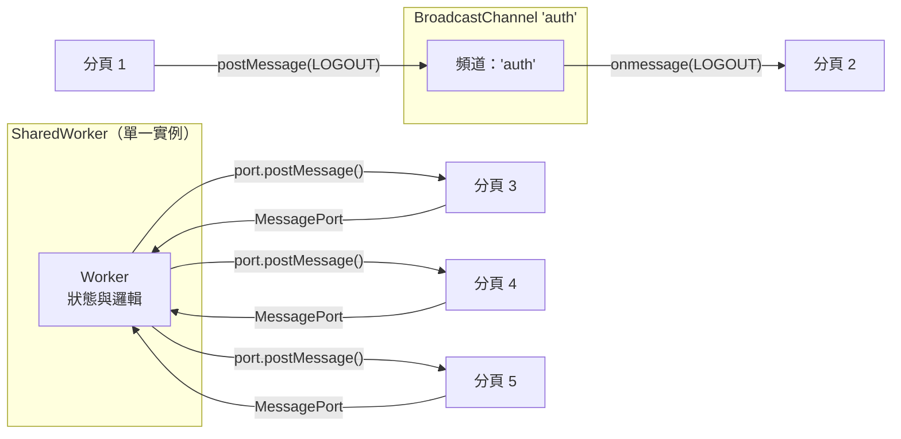

# [FEE-414] Broadcast Channel 與 SharedWorker

:::info
當使用者開啟同一來源的多個分頁時，每個分頁都是獨立的 JavaScript 執行環境：在一個分頁登入不會更新其他分頁的 session 狀態，購物車的變動在一個分頁發生後，其他分頁也看不到。有兩個 API 可用於跨分頁協調狀態。`BroadcastChannel` 是一種傳完即忘的訊息匯流排，用於事件通知，只需兩行程式碼即可建立，不需要 Worker 腳本。`SharedWorker` 是同一來源所有分頁共享的單一 Worker 實例，能夠保存狀態並對每個連線個別回覆，代價是需要獨立的腳本檔案與明確的 port 生命週期管理。本文說明何時該選用哪一種、多數實作容易出錯的 SharedWorker 連線生命週期，以及兩者目前的行動裝置支援現況。
:::

## 背景

`BroadcastChannel` 是一種發布／訂閱機制：任何使用相同頻道名稱的分頁，都能接收到其他分頁發布到該頻道的訊息。它是一種傳完即忘的廣播匯流排：發送方不會收到自己發出的訊息，也沒有請求／回應的模式。它適合用於通知類情境，例如通知所有分頁使用者已登出，讓每個分頁各自跳轉至登入頁面。

`SharedWorker` 是一種 Web Worker，在同一來源的所有分頁之間以單一共享實例的形式持續存在。每個分頁透過 `MessagePort` 連接到同一個 Worker。Worker 可以維護狀態、協調請求，並對每個已連接的分頁個別回覆訊息。它適合用於共享快取、WebSocket 連線池，以及在多分頁之間重複執行代價昂貴時的場景。

兩種 API 都受同一來源限制，且僅在單一瀏覽器設定檔（profile）內有效。它們無法跨不同使用者設定檔開啟的瀏覽器視窗運作，也無法在隱私瀏覽模式與一般模式之間，或跨不同來源之間運作。預先理解這些邊界，可以避免兩種常見的架構錯誤：將跨來源通訊委派給 BroadcastChannel，或在未經驗證的情況下假設行動裝置相容性。

兩者之間常見的選擇情境是 session 管理：在一個分頁登出後，應立即讓同一應用程式的所有其他開啟分頁也一併登出，而這通常沒有伺服器端推送機制可用。`BroadcastChannel` 可以直接解決這個問題：在某個分頁發出的登出事件，會立即傳達給其他所有分頁，讓每個分頁都能清除自身的 session 狀態，不需要伺服器的往返請求。下方的「範例」小節會以程式碼實作這個情境，並接著加入 SharedWorker 的對應寫法，用於需要共享狀態而非單次通知的情況。

## 視覺對比



## 範例

### BroadcastChannel：跨分頁登出

```js
// 生產者——任何分頁在成功登出後執行
const logoutChannel = new BroadcastChannel('auth');
logoutChannel.postMessage({ type: 'LOGOUT', timestamp: Date.now() });
logoutChannel.close(); // 發送後立即關閉

// 消費者——所有其他分頁
const authChannel = new BroadcastChannel('auth');
authChannel.onmessage = (event) => {
  if (event.data.type === 'LOGOUT') {
    // 清除本地 session 狀態並跳轉
    clearSessionState();
    window.location.assign('/login');
  }
};
// 頁面卸載時清理
window.addEventListener('pagehide', () => authChannel.close());
```

### SharedWorker：具備各分頁獨立 port 的連線池

Worker 腳本擁有共享狀態（此處為已連接分頁數），並透過各自的 `MessagePort` 個別回覆每個分頁：

```js
// shared-worker.js -- 僅執行一次，由同一來源的所有分頁共享
const ports = new Set();

self.onconnect = (event) => {
  const port = event.ports[0];
  ports.add(port);

  port.onmessage = (messageEvent) => {
    if (messageEvent.data.type === 'DISCONNECT') {
      ports.delete(port);
      return;
    }
    if (messageEvent.data.type === 'PING') {
      port.postMessage({ type: 'PONG', connectedTabs: ports.size });
    }
  };

  // 若使用 addEventListener 而非直接指派 onmessage 來綁定訊息處理，
  // 則必須呼叫此方法；否則 port 預設為暫停狀態。
  port.start();

  port.postMessage({ type: 'WELCOME', connectedTabs: ports.size });
};
```

```js
// main.js -- 任何想加入此 SharedWorker 的分頁
const worker = new SharedWorker('/shared-worker.js');

worker.port.onmessage = (event) => {
  console.log(`Connected tabs: ${event.data.connectedTabs}`);
};

worker.port.postMessage({ type: 'PING' });

// Worker 沒有內建方式偵測分頁關閉，需明確告知。
window.addEventListener('pagehide', () => {
  worker.port.postMessage({ type: 'DISCONNECT' });
});
```

## 最佳實踐

**應該（SHOULD）在不再需要 `BroadcastChannel` 實例時將其關閉。**
`channel.close()` 會將頻道從廣播群組中移除並釋放其資源。動態建立頻道的元件
或服務，必須在清理時關閉它們，以防止已被銷毀的元件繼續接收訊息並洩漏處理器。
在基於元件的 UI 中，正確的模式是在元件的卸載或銷毀生命週期鉤子中呼叫
`channel.close()`；在 Vue 中使用 `onUnmounted`，在 React 中從 `useEffect`
回傳的清理函式中關閉。在純 JavaScript 中，則應在 `pagehide` 事件監聽器中關閉
頻道。未關閉的頻道在頁面存活期間，會持續在瀏覽器的頻道登錄表中保留一個參照，
且其 `onmessage` 處理器將持續對該頻道名稱上的每次後續廣播觸發，即便建立它的
元件已從 DOM 中移除也不例外。

**應該（SHOULD）使用 `SharedWorker` 對昂貴的共享資源進行去重，例如 WebSocket
連線、持久性輪詢與共享 IndexedDB 存取，而非讓每個分頁各自建立一份資源。**
多個分頁各自對同一伺服器開啟 WebSocket，會使伺服器連線負載隨開啟分頁數成比例
增加。單一 SharedWorker WebSocket 以一個連線服務所有分頁，Worker 將更新扇形
分發給每個分頁的 port。這也簡化了重連邏輯：只有 Worker 需要實作重連；分頁
只需接收訊息即可。同樣的模式適用於輪詢間隔：一個 Worker 代表所有分頁進行
輪詢，分頁訂閱其結果，從而消除冗餘的網路請求，並防止所有分頁在同一間隔上
同時發起請求的驚群問題。

**必須（MUST）在所有 `BroadcastChannel.postMessage` 及 SharedWorker port
訊息中使用可結構化複製的值。** 函式、DOM 節點，以及原型鏈包含方法的類別
實例，均無法跨執行環境傳輸。嘗試發送不可複製的值會同步拋出 `DataCloneError`。
結構化複製演算法支援普通物件、陣列、`Map`、`Set`、`Date`、`RegExp`、
`ArrayBuffer` 等內建類型。可轉移物件（transferable object）如 `ArrayBuffer`
與 `MessagePort` 則是另一項獨立且範圍較窄的能力：訊息傳遞時所有權會從發送方
移轉給接收方，而非複製一份。處理類別實例時，應先將其序列化為普通物件再發送，
並在接收端重建實例。訊息架構設計上，建議採用帶有 `type` 字串識別符和
`payload` 欄位的普通資料信封，以讓訊息處理明確、序列化邊界清晰。

## 設計思維

### 選擇正確的跨分頁機制

在 BroadcastChannel 與 SharedWorker 之間做選擇，可歸結為一個核心問題：跨分頁通訊是否需要共享狀態，還是僅需事件傳遞？BroadcastChannel 是一種訊息匯流排：它將酬載傳遞給所有監聽中的分頁，傳完即忘。BroadcastChannel 除了傳遞訊息之外不保留任何東西，也無法查詢它上一次發送的訊息是什麼。SharedWorker 是一種運算主機：它持有狀態、個別回應每個已連接的分頁，並在個別分頁關閉後仍持續存在，只要至少有一個分頁仍保持連接。

一個實用的判斷測試：若關閉所有分頁後重新開啟一個，應恢復先前的跨分頁狀態，則 SharedWorker（或搭配 BroadcastChannel 通知的 IndexedDB）是必要的。若 session 之間的狀態遺失是可接受的，因為下一次請求時伺服器回應會重新衍生該狀態，則 BroadcastChannel 已足夠。另一個測試：若分頁需要查詢當前狀態而非僅接收更新，SharedWorker 是正確的選擇，因為它能維護並回傳規範值；BroadcastChannel 沒有查詢語義，只有廣播。

如果對複雜度預算有疑慮，請從 BroadcastChannel 開始。它更易於除錯、無需 Worker 腳本，且能滿足現實世界中大多數跨分頁協調的需求。SharedWorker 引入了獨立的腳本生命週期、port 管理，以及跨檢查器上下文除錯等複雜性，大幅增加維護表面積。只在有狀態資源共享的具體理由時才引入 SharedWorker。大多數自認需要 SharedWorker 的應用，實際上只需要 BroadcastChannel 加上以伺服器為後盾的資料來源。

行動裝置支援是這項決策的另一個輸入項，不過它帶來的限制已經比過去小得多，目前 iOS 與 Android 的最新支援數字請見下方「瀏覽器支援與除錯」。針對仍缺乏 SharedWorker 的老舊瀏覽器尾端，常見做法是將共享資源抽象放在介面之後，在支援的環境使用 SharedWorker 實作，在不支援的環境則退回以 BroadcastChannel 協調的分頁獨立實作。無論這個尾端比例有多小，在建構前以 `'SharedWorker' in window` 進行功能偵測都是必要步驟。

### 領導者選舉與現成替代方案

SharedWorker 並非解決上方「最佳實踐」小節所提「哪個分頁擁有共享 WebSocket」問題的唯一工具。Web Locks API 讓每個分頁透過 `navigator.locks.request()` 競爭取得具名鎖：恰好一個分頁會勝出並持有該鎖，直到釋放或分頁關閉為止，佇列則由瀏覽器負責管理。即使在缺乏 SharedWorker 的瀏覽器上，這個方法依然可用，因為 Web Locks 沒有下方所述的行動裝置支援缺口；對於只需要領導者選舉、不需要持久共享運算主機的團隊而言，也不需要額外的 Worker 腳本。完整 API 請見 [FEE-1314](../Progressive%20Web%20Apps%20and%20Offline/web-locks-api.md)。

不想自行組裝「備援方案加領導者選舉」的團隊，可以改用 `broadcast-channel` 這個 npm 套件。它在原生 BroadcastChannel API 之外，為不支援的環境包裝了 `localStorage`／IndexedDB 備援方案，並內建領導者選舉輔助功能，在可用時於內部使用 Web Locks。這相當於本文「常見錯誤」小節描述需要手動組裝的原生 API 加備援方案，再加上領導者選舉功能。

### BroadcastChannel 與 localStorage 事件的比較

`localStorage` 在值發生變更時，會在其他分頁觸發 `storage` 事件。這是
BroadcastChannel 出現之前的舊有方式。`storage` 事件有顯著限制：它只能透過
`event.newValue` 傳遞字串值，需要接收方自行解析和解讀，且發送方本身不會收到
該事件。BroadcastChannel 更為明確：頻道有名稱，且限定於單一用途，並支援
任意可序列化的值，無需字串轉換。關鍵在於，BroadcastChannel 不會將狀態持久化
到磁碟；它是一個暫時性的通訊頻道。若需要持久化狀態並搭配跨分頁通知，正確的
組合是：用 BroadcastChannel 傳遞通知，用 IndexedDB 或 localStorage 儲存持久化值。

另一個重要的差異在於語義。`storage` 事件攜帶變更的鍵名及前後兩個值：它本質上
是一種屬性變更通知。BroadcastChannel 則攜帶發送方選擇的任意酬載，這使其適合
事件驅動設計，即訊息代表一個領域事件（`{ type: 'SESSION_EXPIRED', userId: '...' }`），
而非屬性變更。當多個監聽者需要對同一領域事件做出不同反應，或事件酬載必須攜帶
在 localStorage 鍵值結構中沒有自然存放位置的上下文時，這種區別尤為重要。
命名頻道也起到自然分組的作用：所有與身份驗證相關的跨分頁事件都在 `'auth'`
頻道上傳輸，讓訊息空間井然有序，也更易於除錯。

### SharedWorker 的 port 生命週期

每個分頁透過 SharedWorker 上的 `connect` 事件取得一個 `MessagePort`。Worker
需要註冊 `onconnect` 處理器，在其中接收 port 並為其附加 `onmessage` 處理器。
port 的參照是 Worker 回覆特定分頁的唯一方式。當分頁關閉時，其 port 隨之關閉；
Worker 本身沒有內建的機制可偵測此情況：關閉中的分頁不會觸發明確的斷線事件。
慣用的模式是讓分頁在卸載前發送最後一則 `DISCONNECT` 訊息，但 `pagehide` 在
部分瀏覽器中並不可靠。當所有已連接的 port 均關閉且無其他活動維持 Worker 存活
時，Worker 會自動終止。

在實務上，維護已連接 port 清單以進行扇形廣播的 Worker，必須處理 port 在未發送
`DISCONNECT` 訊息的情況下就已消亡的場景。這種情況的具體表現是：對已消亡的 port
呼叫 `postMessage` 拋出錯誤，或更常見的是，已消亡的 port 靜默接受訊息但沒有任何
可觀察的效果。將對每個 port 的 `postMessage` 呼叫包裹在 try/catch 中，並移除
拋出錯誤的 port，是長期存活並服務大量短暫分頁的 Worker 的防禦性模式。Worker
應將 port 儲存在 `Set` 中，在捕獲錯誤時移除對應 port，並定期發送需要回應的
心跳訊息，以主動偵測並清理失效的 port。

分頁重新整理後，會重新連接到同一個正在執行的 Worker 實例，但使用的是全新的
port 物件；Worker 在重新整理之間持續存在，port 則不會。若 Worker 保留了與
特定 port 相關聯的狀態（例如認證 token 或訂閱清單），這些狀態不會在 port
替換時自動保留下來，因為新 port 與舊 port 是不同的物件，即使兩者來自同一個
分頁。將新 port 上收到的第一則訊息視為握手（handshake），攜帶分頁需要恢復的
上下文，才能讓重新連線可靠運作，而不是靜默遺失狀態。

### Service Worker 作為替代方案

Service Worker 可透過 `clients.matchAll()` 與 `client.postMessage()` 向所有
受控制的客戶端廣播訊息。它在分頁關閉後仍持續存在，且可主動發起通訊，包括
透過推播通知喚醒分頁。與 BroadcastChannel 和 SharedWorker 的區別在於架構層次：
後兩者是分頁與分頁之間，或分頁與背景執行緒之間的溝通。Service Worker 則是
位於瀏覽器與網路之間的攔截器與背景服務。若需求包含離線快取、推播通知或背景
同步，請使用 Service Worker；若需求純粹是活躍 session 中的跨分頁協調，則使用
BroadcastChannel 或 SharedWorker。

Service Worker 具有登錄與啟動生命週期，包含多種狀態（`installing`、`waiting`、
`active`），這些在 BroadcastChannel 或 SharedWorker 中並不存在。新安裝的
Service Worker 不會立即控制現有分頁：它會等待分頁重新載入，或等到呼叫
`skipWaiting` 為止。當目標僅是通知已開啟的分頁關於身份驗證狀態變更時，這種
生命週期的複雜性是不必要的額外負擔。選擇正確工具意味著將機制與問題相匹配：
BroadcastChannel 用於輕量事件傳遞，SharedWorker 用於共享有狀態資源，Service
Worker 用於網路攔截與背景能力。

兩者並非互斥。當 Service Worker 收到推播通知或完成背景同步後，可以透過
BroadcastChannel 將結果廣播給所有已開啟的分頁，取代逐一走訪 `clients.matchAll()`
的做法；當結果需要送達 Service Worker 目前未控制的分頁時，這種方式尤其有用。

### 瀏覽器支援與除錯

SharedWorker 在行動裝置上的支援範圍，其實比一般認知的更廣。WebKit 已在 2022
年 9 月的 Safari 16.0 中推出此功能，因此從第 16 版到最新版的 iOS Safari 均已
支援；Can I Use 顯示目前全球支援度約 93%，剩餘的缺口集中在 iOS 15 及更舊、
未更新的裝置上。影響更大的行動裝置注意事項出在 Android 上：Chrome 曾因擔心
其 Worker 行程可能被作業系統不可預期地終止，而停用 SharedWorker 長達數年，
直到 Chrome 148（beta，2026 年 4 月）才重新啟用，理由是重新評估後認為該生命
週期風險可能小於原先預期；這次重新啟用仍屬進行中的實驗，而非定論，且原先
擔憂的行程遺失事件目前仍偶有觀察到。BroadcastChannel 自 iOS Safari 15.4 版
起即受到支援。需要支援 iOS 15 或 148 版之前 Android Chrome 的應用程式，仍
需要備援方案：以 `'SharedWorker' in window` 進行功能偵測，並針對這個逐漸縮小
的尾端退回使用 BroadcastChannel 搭配 `localStorage`，而非將備援方案當成所有
行動裝置使用者的預設路徑。在 Chrome 中除錯 SharedWorker，可使用
`chrome://inspect/#workers` 面板，其中列出了活躍的 Worker 並允許附加
DevTools。由於 Worker 的生命週期橫跨多個瀏覽器視窗，除錯共享狀態比除錯單一
分頁的執行環境更困難：Worker 可能因為來自已不可見分頁的訊息而處於非預期的
狀態。

Firefox 在其 `about:debugging` 頁面的 `Workers` 區塊中顯示 SharedWorker。
Safari 的 Web Inspector 可從「開發」選單附加至共享 Worker。在所有瀏覽器中，
Worker 內部的日誌需要 DevTools 附加到 Worker 自身的檢查器上下文，而非任何已
連接的分頁：Worker 中的 `console` 語句不會出現在分頁的 DevTools 主控台中。
這是初次除錯時常見的困惑來源：訊息看似已發送，但 Worker 似乎沒有任何反應，
原因在於 Worker 的主控台輸出在明確開啟其檢查器上下文之前是不可見的。

## 常見錯誤

**元件卸載後未關閉 BroadcastChannel。** 在元件內建立但從未關閉的頻道，在
頁面存活期間會持續在瀏覽器的廣播群組中保留為接收者。當該頻道有訊息廣播時，
即使建立它的元件已被銷毀，處理器仍會觸發。在具有響應式狀態的框架中，這可能
導致在已卸載元件上觸發狀態變更，引發警告和潛在的記憶體洩漏。在 Vue 中，
正確模式是在 `onUnmounted` 中關閉；在 React 中，是從 `useEffect` 的回傳清理
函式中關閉。應始終將頻道建立與元件清理路徑中的 `channel.close()` 呼叫配對使用。

**嘗試透過 BroadcastChannel 傳送函式或 DOM 節點。** 序列化訊息酬載的結構化
複製演算法無法處理函式、DOM 節點、原型鏈包含方法的類別實例，或任何其支援範圍
之外的類型。以此類值呼叫 `postMessage` 會同步拋出 `DataCloneError`，在訊息
發送之前就已失敗。該錯誤可被包裹 `postMessage` 的 try/catch 捕獲，但訊息永遠
不會傳遞。解決方法是在傳送前將資料序列化為普通物件。當類別實例同時攜帶資料與
行為時，將資料屬性提取為普通物件字面量進行傳輸，並在接收端重建實例。共用於
發送方與接收方的 TypeScript 介面，是在型別層面強制執行純物件契約的實用做法。
常見的觸發情境包括：將 Vue 的響應式物件（`reactive()`/`ref()` 包裹的物件）
直接傳入 `postMessage`；這些物件可能攜帶 Proxy 包裝器，在部分瀏覽器中無法
被結構化複製。應始終傳送 `toRaw()` 後的純物件，或手動提取所需的資料欄位。

**期望 BroadcastChannel 能跨不同來源運作。** BroadcastChannel 僅限同一來源。
`https://app.example.com` 上名為 `'auth'` 的頻道，與 `https://other.example.com`
或 `https://example.com` 上同名的頻道完全隔離。BroadcastChannel 沒有橋接不同
來源的機制。跨來源通訊需要使用 `postMessage` 並明確指定目標來源，這是一個具有
不同安全特性且需要明確信任邊界的獨立 API。在子網域間運作的應用程式，例如
微前端殼層位於 `shell.example.com`，子應用位於 `app.example.com`，無法使用
BroadcastChannel 進行跨框架通訊。

**未正確處理 SharedWorker 的 `connect` 事件。** 分頁透過 `MessagePort` 發送的
訊息，若在 Worker 尚未在該 port 上註冊訊息處理器之前就已送達，將被靜默丟棄。
Worker 必須在 `connect` 事件回呼內，針對從 `event.ports[0]` 接收的特定 port
註冊其 `onmessage` 處理器。在 Worker 的全域 `self` 作用域上註冊處理器，無法
攔截 port 訊息。遺漏此步驟的後果是：分頁看似連線成功，但其訊息永遠無法到達
Worker，且不會拋出任何錯誤提示問題所在。若使用 `addEventListener` 而非
`onmessage` 附加訊息處理器，Worker 還必須呼叫 `port.start()`：port 預設處於
暫停狀態，只有在呼叫 `start()` 或指派 `onmessage` 後才會傳遞已佇列的訊息。

**假設 SharedWorker 在行動裝置上普遍可用，或普遍不可用。** SharedWorker 自
iOS Safari 16.0 版（2022 年）起即已支援，因此目前多數 iPhone 都能使用；真正
的缺口在於 iOS 15 及更舊版本，以及 148 版之前的 Android Chrome。在建構前以
`'SharedWorker' in window` 進行功能偵測仍然不是可選項：在不支援的瀏覽器中，
該建構函式為 `undefined`，呼叫 `new SharedWorker(...)` 會拋出 `ReferenceError`
並導致呼叫端程式碼崩潰，無論該瀏覽器的流量占比有多小。需要支援剩餘不支援
尾端的應用程式，應以 BroadcastChannel 作為事件通知的備援，並以 `localStorage`
或 IndexedDB 作為共享持久狀態的備援。應將此備援方案視為涵蓋舊版尾端，而非
所有行動裝置使用者的預設路徑；僅針對最新的 iOS 與 Android 版本測試，會掩蓋
真正、範圍較窄的缺口，因此應根據自身分析數據所顯示的特定舊版系統進行驗證。

## 延伸閱讀

- [FEE-400 — 瀏覽器 API 與 Web 平台總覽](./400.md)
- [FEE-405 — Web Workers 與並行處理](./405.md)
- [FEE-313 — 結構化複製與 `structuredClone()`](../JavaScript%20Core%20and%20Runtime/313.md)
- [FEE-1314 — 跨分頁與 Service Worker 對分頁協調的 Web Locks API](../Progressive%20Web%20Apps%20and%20Offline/web-locks-api.md)

## 參考資料

- MDN Contributors, "BroadcastChannel," MDN Web Docs (2025). https://developer.mozilla.org/en-US/docs/Web/API/BroadcastChannel
- MDN Contributors, "SharedWorker," MDN Web Docs (2025). https://developer.mozilla.org/en-US/docs/Web/API/SharedWorker
- Can I Use, "Shared Web Workers," caniuse.com, accessed July 2026. https://caniuse.com/sharedworkers
- Can I Use, "BroadcastChannel," caniuse.com, accessed July 2026. https://caniuse.com/broadcastchannel
- MDN Contributors, "MessagePort," MDN Web Docs (2025). https://developer.mozilla.org/en-US/docs/Web/API/MessagePort
- MDN Contributors, "Structured clone algorithm," MDN Web Docs (2025). https://developer.mozilla.org/en-US/docs/Web/API/Web_Workers_API/Structured_clone_algorithm
- MDN Contributors, "Service Worker API," MDN Web Docs (2025). https://developer.mozilla.org/en-US/docs/Web/API/Service_Worker_API
- MDN Contributors, "Clients: matchAll() method," MDN Web Docs (2025). https://developer.mozilla.org/en-US/docs/Web/API/Clients/matchAll
- web.dev, "Broadcast Channel API," web.dev (2024). https://web.dev/articles/broadcast-channel
- MDN Contributors, "Web Locks API," MDN Web Docs (2025). https://developer.mozilla.org/en-US/docs/Web/API/Web_Locks_API
- MDN Contributors, "Window: pagehide event," MDN Web Docs (2025). https://developer.mozilla.org/en-US/docs/Web/API/Window/pagehide_event
- pubkey, "broadcast-channel," GitHub, accessed July 2026. https://github.com/pubkey/broadcast-channel
- Chrome for Developers, "Chrome 148 beta," Google (2026). https://developer.chrome.com/blog/chrome-148-beta
