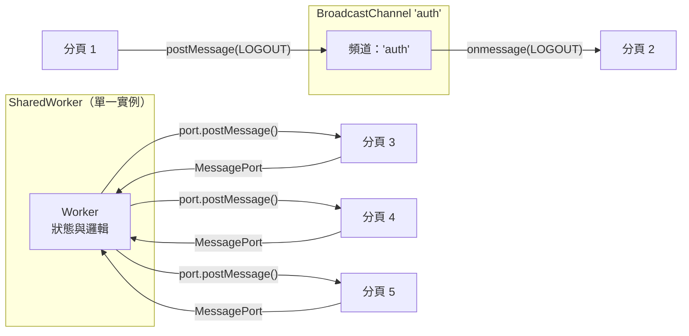

# Broadcast Channel 與 SharedWorker

當使用者同時開啟同一來源（origin）的多個分頁時，這些分頁各自是獨立的
JavaScript 執行環境。在一個分頁完成登入，不會自動更新其他分頁的 session
狀態；購物車的變動對其他分頁也是不可見的。有兩種機制可以跨分頁協調狀態：
`BroadcastChannel` 用於簡單的事件廣播，`SharedWorker` 則用於共享運算與集中式狀態管理。

`BroadcastChannel` 是一種發布／訂閱機制：任何使用相同頻道名稱的分頁，都能
接收到其他分頁發布到該頻道的訊息。它是單向的——發送方不會收到自己發出的訊息，
也沒有請求／回應的模式。它適合用於通知類情境，例如：「使用者已登出——所有分頁
應跳轉至登入頁面。」

`SharedWorker` 是一種 Web Worker，在同一來源的所有分頁之間以單一共享實例的
形式持續存在。每個分頁透過 `MessagePort` 連接到同一個 Worker。Worker 可以
維護狀態、協調請求，並對每個已連接的分頁個別回覆訊息。它適合用於共享快取、
WebSocket 連線池，以及在多分頁之間重複執行代價昂貴時的場景。

兩種 API 都受同一來源限制，且僅在單一瀏覽器設定檔（profile）內有效。它們無法
跨不同使用者設定檔開啟的瀏覽器視窗運作，也無法在隱私瀏覽模式與一般模式之間，
或跨不同來源之間運作。預先理解這些邊界，可以避免錯誤地將跨來源通訊委派給
BroadcastChannel，或在未驗證的情況下假設行動裝置相容性的架構決策。選擇哪種
機制，本質上是在訊息傳遞的簡單性與共享資源的協調能力之間做出取捨，而這個決策
應由應用程式的實際需求——而非對 API 的熟悉程度——來驅動。

## 使用情境

你正在開發一個 session 管理功能：在其中一個分頁登出後，同一應用程式的所有其他開啟分頁也應立即登出。目前沒有任何伺服器端推送機制可以實現這件事。`BroadcastChannel` 能將訊息發送給同一來源下的所有其他瀏覽器情境——在某個分頁發出的登出事件，會被其他所有分頁立即接收，讓每個分頁都能清除自身的 session 狀態，完全不需要伺服器的往返請求。

## 設計思維

### 選擇正確的跨分頁機制

在 BroadcastChannel 與 SharedWorker 之間做選擇，可歸結為一個核心問題：跨分頁通訊是否需要共享狀態，還是僅需事件傳遞？BroadcastChannel 是訊息匯流排——它將酬載傳遞給所有監聽中的分頁，傳完即忘，不儲存任何狀態，也沒有辦法查詢「上一條訊息是什麼」。SharedWorker 是運算主機——它持有狀態、個別回應每個已連接的分頁，並在個別分頁關閉後仍持續存在，只要至少有一個分頁仍保持連接。

一個實用的判斷測試：若關閉所有分頁後重新開啟一個，應恢復先前的跨分頁狀態，則 SharedWorker（或搭配 BroadcastChannel 通知的 IndexedDB）是必要的。若 session 之間的狀態遺失是可接受的——因為下一次請求時會從伺服器重新衍生——則 BroadcastChannel 已足夠。另一個測試：若分頁需要查詢當前狀態而非僅接收更新，SharedWorker 是正確的選擇，因為它能維護並回傳規範值；BroadcastChannel 沒有查詢語義，只有廣播。

如果對複雜度預算有疑慮，請從 BroadcastChannel 開始。它更易於除錯、無需 Worker 腳本，且能滿足現實世界中大多數跨分頁協調的需求。SharedWorker 引入了獨立的腳本生命週期、port 管理，以及跨檢查器上下文除錯等複雜性，大幅增加維護表面積。只在有狀態資源共享的具體理由時才引入 SharedWorker——大多數自認需要 SharedWorker 的應用，實際上只需要 BroadcastChannel 加上以伺服器為後盾的資料來源。

行動裝置相容性是另一個需要納入決策的限制。截至 2024 年，iOS Safari 完全不支援 SharedWorker，這意味著依賴 SharedWorker 的任何功能，對蘋果裝置的行動使用者而言都是靜默不可用的。BroadcastChannel 則在 iOS Safari 15.4 及更新版本中受到支援，可作為通用基準。對於需要同時兼顧行動裝置支援與桌機高效資源共享的團隊，常見模式是在介面背後提供共享資源抽象，桌機瀏覽器使用 SharedWorker 實作，iOS 等不支援 SharedWorker 的行動瀏覽器則使用搭配 BroadcastChannel 協調的分頁獨立實作。在建構 SharedWorker 前以 `'SharedWorker' in window` 進行功能偵測，是不可或缺的步驟。

### BroadcastChannel 與 localStorage 事件的比較

`localStorage` 在值發生變更時，會在其他分頁觸發 `storage` 事件。這是
BroadcastChannel 出現之前的舊有方式。`storage` 事件有顯著限制：它只能透過
`event.newValue` 傳遞字串值，需要接收方自行解析和解讀，且發送方本身不會收到
該事件。BroadcastChannel 更為明確——頻道有名稱，且限定於單一用途——並支援
任意可序列化的值，無需字串轉換。關鍵在於，BroadcastChannel 不會將狀態持久化
到磁碟；它是一個暫時性的通訊頻道。若需要持久化狀態並搭配跨分頁通知，正確的
組合是：用 BroadcastChannel 傳遞通知，用 IndexedDB 或 localStorage 儲存持久化值。

另一個重要的差異在於語義。`storage` 事件攜帶變更的鍵名及前後兩個值——它本質上
是一種屬性變更通知。BroadcastChannel 則攜帶發送方選擇的任意酬載，這使其適合
事件驅動設計，即訊息代表一個領域事件（`{ type: 'SESSION_EXPIRED', userId: '...' }`），
而非屬性變更。當多個監聽者需要對同一領域事件做出不同反應，或事件酬載必須攜帶
在 localStorage 鍵值結構中沒有自然存放位置的上下文時，這種區別尤為重要。
命名頻道也起到自然分組的作用：所有與身份驗證相關的跨分頁事件都在 `'auth'`
頻道上傳輸，讓訊息空間井然有序，也更易於除錯。

從效能角度來看，`localStorage` 的 `storage` 事件是同步寫入觸發非同步通知的
混合模型：寫入 `localStorage` 是同步的，但事件在其他分頁中以非同步方式傳遞。
BroadcastChannel 則是純粹的非同步訊息傳遞，不涉及任何磁碟 I/O。對於高頻率
的跨分頁通訊場景——例如即時協作編輯中的游標位置同步——BroadcastChannel 的
開銷遠低於反覆讀寫 localStorage 的方案。不過，在大多數身份驗證與主題切換等
低頻事件場景中，效能差異並不顯著，選擇依據主要仍是 API 的語義清晰度與可讀性。

### SharedWorker 的 port 生命週期

每個分頁透過 SharedWorker 上的 `connect` 事件取得一個 `MessagePort`。Worker
需要註冊 `onconnect` 處理器，在其中接收 port 並為其附加 `onmessage` 處理器。
port 的參照是 Worker 回覆特定分頁的唯一方式。當分頁關閉時，其 port 隨之關閉；
Worker 本身沒有內建的機制可偵測此情況——關閉中的分頁不會觸發明確的斷線事件。
慣用的模式是讓分頁在卸載前發送最後一則 `DISCONNECT` 訊息，但 `pagehide` 在
部分瀏覽器中並不可靠。當所有已連接的 port 均關閉且無其他活動維持 Worker 存活
時，Worker 會自動終止。

在實務上，維護已連接 port 清單以進行扇形廣播的 Worker，必須處理 port 在未發送
`DISCONNECT` 訊息的情況下就已消亡的場景。這種情況的具體表現是：對已消亡的 port
呼叫 `postMessage` 拋出錯誤，或更常見的是，已消亡的 port 靜默接受訊息但沒有任何
可觀察的效果。將對每個 port 的 `postMessage` 呼叫包裹在 try/catch 中，並移除
拋出錯誤的 port，是長期存活並服務大量短暫分頁的 Worker 的防禦性模式。Worker
應將 port 儲存在 `Set` 中，在捕獲錯誤時移除對應 port，並定期發送需要回應的
心跳訊息，以主動偵測並清理失效的 port。

需要特別注意的是，一個分頁可能在重新整理後重新連接同一個 SharedWorker。由於
Worker 是持久的，它在重新整理之間保持執行狀態，新的 `connect` 事件會在分頁重
新載入後觸發。若 Worker 維護了與特定 port 相關聯的分頁專屬狀態（例如認證 token
或訂閱偏好），它必須以訊息協議重新建立此狀態，因為新的 port 與舊的 port 是不同
的物件，即使它們來自同一個分頁位置。設計 Worker 訊息協議時，應將初始 `CONNECT`
訊息視為能夠攜帶分頁需要恢復之上下文的握手（handshake）。

### Service Worker 作為替代方案

Service Worker 可透過 `clients.matchAll()` 與 `client.postMessage()` 向所有
受控制的客戶端廣播訊息。它在分頁關閉後仍持續存在，且可主動發起通訊，包括
透過推播通知喚醒分頁。與 BroadcastChannel 和 SharedWorker 的區別在於架構層次：
後兩者是分頁與分頁之間，或分頁與背景執行緒之間的溝通。Service Worker 則是
位於瀏覽器與網路之間的攔截器與背景服務。若需求包含離線快取、推播通知或背景
同步，請使用 Service Worker；若需求純粹是活躍 session 中的跨分頁協調，則使用
BroadcastChannel 或 SharedWorker。

Service Worker 具有登錄與啟動生命週期，包含多種狀態（`installing`、`waiting`、
`active`），這些在 BroadcastChannel 或 SharedWorker 中並不存在。新安裝的
Service Worker 不會立即控制現有分頁——它會等待分頁重新載入或呼叫 `skipWaiting`。
當目標僅是通知已開啟的分頁關於身份驗證狀態變更時，這種生命週期的複雜性是不必要
的額外負擔。選擇正確工具意味著將機制與問題相匹配：BroadcastChannel 用於輕量事件
傳遞，SharedWorker 用於共享有狀態資源，Service Worker 用於網路攔截與背景能力。

值得注意的是，BroadcastChannel 與 Service Worker 可以結合使用：Service Worker
可以使用 BroadcastChannel 將推播通知或背景同步的結果廣播給所有已開啟的分頁，
作為 `clients.matchAll()` 的替代方案，尤其在訊息需要跨越 Service Worker
控制邊界時。這種組合讓 Service Worker 負責網路層的工作，BroadcastChannel
負責結果的分發，保持各層次的職責單一且清晰。

### 瀏覽器支援與除錯

截至 2024 年，SharedWorker 在所有主流桌面瀏覽器中均受支援，但在 iOS Safari
上的支援有限——iOS Safari 完全不支援 SharedWorker，因此對於有行動裝置使用者
的應用程式，它不適合作為唯一的跨分頁機制。BroadcastChannel 的支援範圍更廣，
包含 iOS Safari 15.4 及以上版本。針對行動裝置時，優先使用 BroadcastChannel
進行事件通知，並以 `localStorage` 事件作為較舊 iOS 版本的備選方案。在 Chrome
中除錯 SharedWorker，可使用 `chrome://inspect/#workers` 面板，其中列出了
活躍的 Worker 並允許附加 DevTools。由於 Worker 的生命週期橫跨多個瀏覽器視窗，
除錯共享狀態比除錯單一分頁的執行環境更困難——Worker 可能因為來自已不可見分頁
的訊息而處於非預期的狀態。

Firefox 在其 `about:debugging` 頁面的 `Workers` 區塊中顯示 SharedWorker。
Safari 的 Web Inspector 可從「開發」選單附加至共享 Worker。在所有瀏覽器中，
Worker 內部的日誌需要 DevTools 附加到 Worker 自身的檢查器上下文，而非任何已
連接的分頁——Worker 中的 `console` 語句不會出現在分頁的 DevTools 主控台中。
這是初次除錯時常見的困惑來源：訊息看似已發送，但 Worker 似乎沒有任何反應，
原因在於 Worker 的主控台輸出在明確開啟其檢查器上下文之前是不可見的。

BroadcastChannel 的除錯相對直觀——它在各分頁的 DevTools 主控台中可見，且可
透過在發送方與接收方的 `onmessage` 處理器中加入 `console.log` 來追蹤訊息流。
若要驗證頻道是否已正確命名，最快的方法是在兩個分頁中各開啟主控台，並在一個
分頁執行 `new BroadcastChannel('test').postMessage('hello')`，確認另一個分頁
的監聽器有收到訊息。這個手動測試在初次整合時能快速排除命名錯誤的問題。

## 最佳實踐

**應該（SHOULD）在不再需要 `BroadcastChannel` 實例時將其關閉。**
`channel.close()` 會將頻道從廣播群組中移除並釋放其資源。動態建立頻道的元件
或服務，必須在清理時關閉它們，以防止已被銷毀的元件繼續接收訊息並洩漏處理器。
在基於元件的 UI 中，正確的模式是在元件的卸載或銷毀生命週期鉤子中呼叫
`channel.close()`；在 Vue 中使用 `onUnmounted`，在 React 中從 `useEffect`
回傳的清理函式中關閉。在純 JavaScript 中，則應在 `pagehide` 事件監聽器中關閉
頻道。未關閉的頻道在頁面存活期間，會持續在瀏覽器的頻道登錄表中保留一個參照，
且其 `onmessage` 處理器將持續對該頻道名稱上的每次後續廣播觸發，即便建立它的
元件已從 DOM 中移除也不例外。

**應該（SHOULD）使用 `SharedWorker` 對昂貴的共享資源進行去重——WebSocket
連線、持久性輪詢、共享 IndexedDB 存取——而非每個分頁各自建立一份資源。**
多個分頁各自對同一伺服器開啟 WebSocket，會使伺服器連線負載隨開啟分頁數成比例
增加。單一 SharedWorker WebSocket 以一個連線服務所有分頁，Worker 將更新扇形
分發給每個分頁的 port。這也簡化了重連邏輯：只有 Worker 需要實作重連；分頁
只需接收訊息即可。同樣的模式適用於輪詢間隔：一個 Worker 代表所有分頁進行
輪詢，分頁訂閱其結果，從而消除冗餘的網路請求，並防止所有分頁在同一間隔上
同時發起請求的驚群問題。評估 SharedWorker 是否值得引入時，可考量以下原則：
若共享資源的建立成本——連線握手、初始資料載入、認證流程——會因多分頁而成倍
增加，則 SharedWorker 的複雜性代價通常是合理的。

**必須（MUST）在所有 `BroadcastChannel.postMessage` 及 SharedWorker port
訊息中使用可結構化複製的值。** 函式、DOM 節點，以及原型鏈包含方法的類別
實例，均無法跨執行環境傳輸。嘗試發送不可複製的值會同步拋出 `DataCloneError`，
在訊息發送之前就已失敗。該錯誤可被包裹 `postMessage` 的 try/catch 捕獲，但
訊息永遠不會傳遞，這使其成為一種靜默失敗的場景，在開發環境中難以追蹤。僅有
結構化複製演算法支援的類型才是合法的訊息酬載——普通物件、陣列、Map、Set、
Date、ArrayBuffer 及其他可轉移類型。當需要傳輸類別實例時，先將其序列化為
普通物件再發送，並在接收端重建實例。訊息架構設計上，建議採用帶有 `type`
字串識別符和 `payload` 欄位的普通資料信封，以讓訊息處理明確、序列化邊界清晰。
在 TypeScript 專案中，可用共享的介面定義在型別層面強制執行純物件契約。

## 視覺呈現



## 範例

```js
// 生產者——任何分頁在成功登出後執行
const logoutChannel = new BroadcastChannel('auth');
logoutChannel.postMessage({ type: 'LOGOUT', timestamp: Date.now() });
logoutChannel.close(); // 發送後立即關閉

// 消費者——所有其他分頁
const authChannel = new BroadcastChannel('auth');
authChannel.onmessage = (event) => {
  if (event.data.type === 'LOGOUT') {
    // 清除本地 session 狀態並跳轉
    clearSessionState();
    window.location.assign('/login');
  }
};
// 頁面卸載時清理
window.addEventListener('pagehide', () => authChannel.close());
```

## 常見錯誤

**元件卸載後未關閉 BroadcastChannel。** 在元件內建立但從未關閉的頻道，在
頁面存活期間會持續在瀏覽器的廣播群組中保留為接收者。當該頻道有訊息廣播時，
即使建立它的元件已被銷毀，處理器仍會觸發。在具有響應式狀態的框架中，這可能
導致在已卸載元件上觸發狀態變更，引發警告和潛在的記憶體洩漏。在 Vue 中，
正確模式是在 `onUnmounted` 中關閉；在 React 中，是從 `useEffect` 的回傳清理
函式中關閉。應始終將頻道建立與元件清理路徑中的 `channel.close()` 呼叫配對使用。
在具有路由的單頁應用中，元件在路由切換時卸載，若未適當清理，使用者在多次
導航後可能會累積多個仍在活躍的 BroadcastChannel 實例，訂閱同一頻道的處理器
數量隨之線性增長，導致每次廣播觸發多個重複的副作用。

**嘗試透過 BroadcastChannel 傳送函式或 DOM 節點。** 序列化訊息酬載的結構化
複製演算法無法處理函式、DOM 節點、原型鏈包含方法的類別實例，或任何其支援範圍
之外的類型。以此類值呼叫 `postMessage` 會同步拋出 `DataCloneError`，在訊息
發送之前就已失敗。該錯誤可被包裹 `postMessage` 的 try/catch 捕獲，但訊息永遠
不會傳遞。解決方法是在傳送前將資料序列化為普通物件。當類別實例同時攜帶資料與
行為時，將資料屬性提取為普通物件字面量進行傳輸，並在接收端重建實例。常見的
觸發情境包括：將 Vue 的響應式物件（`reactive()`/`ref()` 包裹的物件）直接
傳入 `postMessage`；這些物件可能攜帶 Proxy 包裝器，在部分瀏覽器中無法被
結構化複製。應始終傳送 `toRaw()` 後的純物件，或手動提取所需的資料欄位。

**期望 BroadcastChannel 能跨不同來源運作。** BroadcastChannel 僅限同一來源。
`https://app.example.com` 上名為 `'auth'` 的頻道，與 `https://other.example.com`
或 `https://example.com` 上同名的頻道完全隔離。BroadcastChannel 沒有橋接不同
來源的機制。跨來源通訊需要使用 `postMessage` 並明確指定目標來源，這是一個具有
不同安全特性且需要明確信任邊界的獨立 API。在子網域間運作的應用程式——例如
微前端殼層在 `shell.example.com`，子應用在 `app.example.com`——無法使用
BroadcastChannel 進行跨框架通訊。同樣，在私密瀏覽（無痕）視窗中開啟的分頁，
與一般瀏覽視窗中的分頁也是完全隔離的，即使兩者都是同一來源；跨瀏覽器設定檔
（profile）的分頁也是如此。這些隔離邊界是瀏覽器的安全設計，無法繞過。

**未正確處理 SharedWorker 的 `connect` 事件。** 分頁透過 `MessagePort` 發送的
訊息，若在 Worker 尚未在該 port 上註冊訊息處理器之前就已送達，將被靜默丟棄。
Worker 必須在 `connect` 事件回呼內，針對從 `event.ports[0]` 接收的特定 port
註冊其 `onmessage` 處理器。在 Worker 的全域 `self` 作用域上註冊處理器，無法
攔截 port 訊息。遺漏此步驟的後果是：分頁看似連線成功，但其訊息永遠無法到達
Worker，且不會拋出任何錯誤提示問題所在。若使用 `addEventListener` 而非
`onmessage` 附加訊息處理器，Worker 還必須呼叫 `port.start()`——port 預設處於
暫停狀態，只有在呼叫 `start()` 或指派 `onmessage` 後才會傳遞已佇列的訊息。

**假設 SharedWorker 在行動裝置上可用。** 截至 iOS 17，iOS Safari 並不支援
SharedWorker。在使用前，對 `window.SharedWorker` 進行功能偵測並非可選項——
在 iOS 上它的值為 `undefined`，呼叫 `new SharedWorker(...)` 會拋出
`ReferenceError`，導致呼叫端程式碼崩潰。需要在 iOS 上進行跨分頁狀態共享的
應用程式，必須以 BroadcastChannel 作為事件通知的備選方案，以 localStorage
或 IndexedDB 作為共享持久狀態的備選方案。功能偵測的模式很直觀：在構建 Worker
之前先檢查 `'SharedWorker' in window`，並將備選路徑作為 SharedWorker 不可用
環境的主要路徑實作。此外，Worker 腳本的路徑必須是絕對路徑或相對於文件根目錄
的路徑，否則在某些瀏覽器中可能因路徑解析方式不同而靜默失敗。不要假設僅在
桌面環境測試即可覆蓋應用程式的完整相容性範圍。在建構跨分頁協調功能時，養成
優先查閱 Can I Use 並在真實行動裝置上驗證的習慣，是避免此類相容性問題
（通常直到上線前夕才被發現）的最有效實踐。BroadcastChannel 的廣泛支援使其
成為所有跨分頁通知需求的安全基準線，即便在最終決定使用 SharedWorker 的架構
中，也應準備好以 BroadcastChannel 為基礎的降級實作。

## 相關 FEE

- [FEE-400 — 瀏覽器 API 與 Web 平台總覽](./400.md)
- [FEE-405 — Web Workers 與並行處理](./405.md)
- [FEE-313 — 結構化複製與 `structuredClone()`](../JavaScript%20Language%20and%20Runtime/313.md)

## 參考資料

- MDN: BroadcastChannel — https://developer.mozilla.org/en-US/docs/Web/API/BroadcastChannel
- MDN: SharedWorker — https://developer.mozilla.org/en-US/docs/Web/API/SharedWorker
- Can I Use: SharedWorker — https://caniuse.com/sharedworkers
- MDN: MessagePort — https://developer.mozilla.org/en-US/docs/Web/API/MessagePort
- HTML Living Standard: MessagePort — https://html.spec.whatwg.org/multipage/web-messaging.html#message-ports
- MDN: Structured Clone Algorithm — https://developer.mozilla.org/en-US/docs/Web/API/Web_Workers_API/Structured_clone_algorithm
- Can I Use: BroadcastChannel — https://caniuse.com/broadcastchannel
- MDN: Service Worker API — https://developer.mozilla.org/en-US/docs/Web/API/Service_Worker_API
- MDN: clients.matchAll() — https://developer.mozilla.org/en-US/docs/Web/API/Clients/matchAll
- web.dev: Cross-tab communication — https://web.dev/articles/broadcast-channel
- MDN: StorageEvent — https://developer.mozilla.org/en-US/docs/Web/API/StorageEvent
- MDN: Window: storage event — https://developer.mozilla.org/en-US/docs/Web/API/Window/storage_event
- HTML Living Standard: BroadcastChannel — https://html.spec.whatwg.org/multipage/web-messaging.html#broadcasting-to-other-browsing-contexts
- HTML Living Standard: SharedWorker — https://html.spec.whatwg.org/multipage/workers.html#shared-workers-and-the-sharedworker-interface
- chrome://inspect 工具文件 — https://developer.chrome.com/docs/devtools/javascript/workers
- Firefox about:debugging 文件 — https://firefox-source-docs.mozilla.org/devtools-user/about_colon_debugging/index.html
- MDN: DataCloneError — https://developer.mozilla.org/en-US/docs/Web/API/Web_Workers_API/Structured_clone_algorithm#things_that_dont_work_with_structured_clone
- MDN: Worker: terminate() — https://developer.mozilla.org/en-US/docs/Web/API/Worker/terminate
