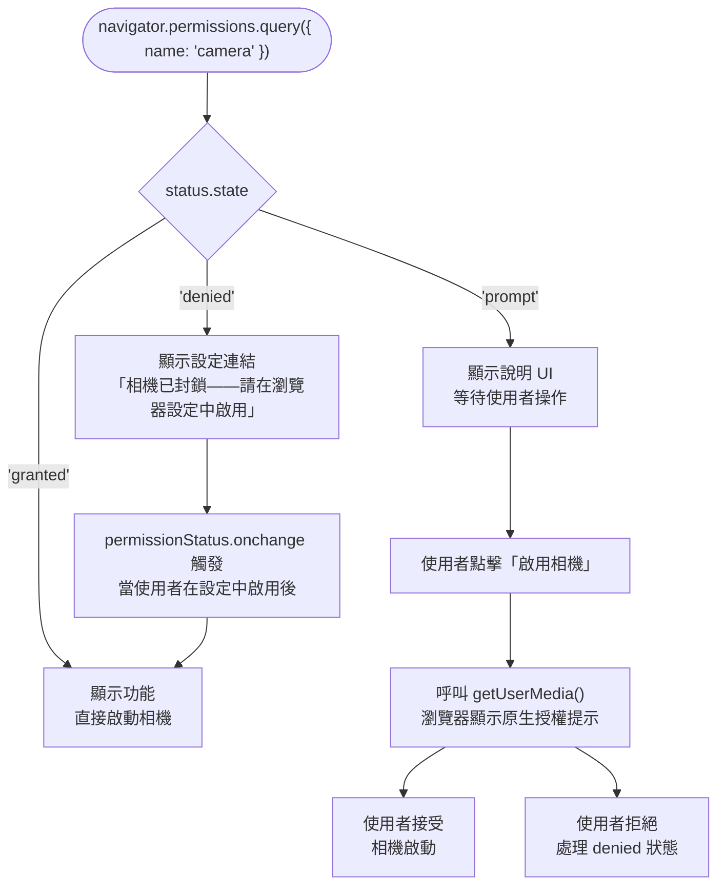

# Permissions API

存取敏感資源的瀏覽器 API（相機、麥克風、地理位置、通知、剪貼簿、MIDI）
各自有獨立的權限閘控機制。在 Permissions API 出現之前，唯一能確認某項權限是否
已被授予的方式，就是直接呼叫該 API，然後觀察是否成功。`navigator.permissions.query()`
提供了一種在呼叫 API 之前就能查詢當前權限狀態的方法，讓 UI 能夠根據使用者的
權限狀態做出適當調整，而不必觸發新的授權提示對話框。這項能力改變了應用程式設計
的方式：在 Permissions API 出現之前，使用者經常在點擊功能按鈕後看到空白畫面，
因為應用程式只有在嘗試調用 API 失敗後才知道權限被拒；現在應用程式可以在頁面
載入時就知道當前的授權狀態，並提前呈現適合的 UI。

Permissions API 將權限建模為三種狀態：`granted`（使用者已允許）、`denied`
（使用者已封鎖，且瀏覽器不會再次提示）和 `prompt`（當 API 被呼叫時，瀏覽器
將顯示提示對話框）。這個三態模型讓應用程式可以針對不同狀態顯示相應的 UI：
`prompt` 狀態顯示應用程式內的說明介面、`denied` 狀態顯示引導至設定頁面的連結
（因為瀏覽器不會再次提示），或在 `granted` 狀態下直接啟用功能。三種狀態中，
`denied` 需要最多的設計關注：它是唯一一種使用者無法透過正常操作流程自行解決、
且在沒有明確 UI 引導的情況下應用程式會陷入毫無出路的狀態的情形。

權限的管控越來越多地透過 Permissions Policy（原稱 Feature Policy）在政策層面
進行，該機制允許頁面限制 iframe 能夠申請的權限，以及哪些來源可以使用特定功能。
孤立地理解 Permissions API 是不完整的，必須同時理解伺服器端傳送的 Permissions
Policy 標頭如何與使用者授予的權限共同作用。Permissions Policy 可以在組織層面
強制實施安全基準（例如禁止所有嵌入式廣告 iframe 存取相機），同時允許第一方
功能根據使用者意願進行授權。這兩個機制的組合為網頁應用提供了精細的權限管控
能力，但也要求開發者在排查 `denied` 狀態時，同時考量使用者設定與政策配置
兩個可能的原因。

## 背景

你正在開發一個利用相機掃描 QR Code 的功能。目前的實作在頁面載入時立即呼叫 `getUserMedia()`，在使用者還不明白為何需要相機之前就觸發了授權提示。Permissions API 讓你能查詢某個權限是已授予、已拒絕還是尚未請求，這樣你就能在觸發瀏覽器提示前顯示說明介面，也能在不再次觸發提示的情況下優雅地處理已拒絕的狀態。

## 設計思維

### 查詢與請求權限的區別

`navigator.permissions.query()` 僅讀取狀態，它不會發出權限請求。請求發生在
底層 API 被呼叫時。查詢告訴你當前狀態；請求發生在使用者觸發功能的使用時機點。
這種分離對 UX 設計至關重要：應用程式可以為每種狀態預先渲染正確的 UI（操作
提示、說明面板或設定連結），而不影響瀏覽器何時或是否顯示授權提示。開發者有時
期望 `query()` 會顯示提示對話框，導致 UI 一直等待一個永遠不會到來的授權決策。
查詢是純粹的讀取操作；可以在頁面載入時、元件掛載生命週期中或任何需要了解當前
狀態的時機安全呼叫，無需擔心觸發非預期的瀏覽器對話框。這種混淆最常出現在開發
者將 `navigator.permissions.query()` 作為最佳化手段加入現有授權流程時，在未充分
理解其唯讀特性的情況下，呼叫了查詢卻沒有正確放置底層 API 的觸發時機，導致
使用者永遠看不到授權對話框。

底層 API 的呼叫才是觸發權限請求的時機。對於 `camera`，該呼叫是 `getUserMedia`；
對於 `notifications`，是 `Notification.requestPermission()`；對於 `geolocation`，
是 `navigator.geolocation.getCurrentPosition()` 或 `watchPosition()`。在權限
狀態為 `prompt` 時呼叫這些 API，會顯示瀏覽器原生的授權對話框。Permissions API
讓應用程式能根據當前狀態決定何時（以及是否）發起該呼叫。設計良好的流程是：
先查詢，在 `prompt` 狀態下向使用者呈現脈絡說明以預先引導請求，並在使用者主動
採取行動後才呼叫底層 API，藉此在明確意圖的時機點顯示授權提示，從而提升授權
接受率。研究顯示，在使用者能清楚理解授權用途時才顯示提示，可以顯著提高接受率；
Permissions API 的查詢能力正是讓開發者得以在正確時機點呈現這些說明的工具。

### 權限變更事件

`permissionStatus.addEventListener('change', handler)` 在使用者於瀏覽器設定中
更改權限、且頁面仍開啟時觸發。應用程式應相應地更新 UI。例如，當使用者在頁面
可見時於設定中授予相機存取權限，應立即啟用相機按鈕。這種事件驅動的方式避免了
輪詢：應用程式只需註冊一次，在變更發生時做出反應，而不必在每次使用者互動時
都重新檢查權限狀態。事件處理器以 `PermissionStatus` 物件作為 `this`，更新後
的狀態可透過 `this.state` 或捕獲的 `status` 變數取得。在元件或功能卸載時
移除監聽器，可防止在單頁應用中於多次路由導航後累積失效的處理器。每次元件
掛載時附加新的監聽器而不移除舊的，會導致每次權限變更都觸發多個相同的回呼，
在具有響應式狀態管理的框架中可能引發副作用的重複執行。

`change` 事件特別重要的一個常見場景是視訊會議：使用者在通話進行中透過瀏覽器
網址列的指示器撤銷相機或麥克風權限，應立即看到回饋（靜音指示器、「相機已封鎖」
橫幅），而不是畫面凍結且毫無說明。`change` 事件讓這種即時反應變得直觀。對於
偵測到 `denied` 狀態並引導使用者至設定頁面的應用程式也同樣重要：使用者按照
指示授予權限後，`change` 事件觸發，應用程式可以自動從設定連結 UI 過渡到啟用
的功能，無需使用者重新載入頁面。值得注意的是，`change` 事件本身不包含前一個
狀態的資訊，只有 `PermissionStatus` 當前的 `state` 值。若應用程式邏輯需要
對特定的狀態轉換（例如從 `granted` 變為 `denied`）做出不同反應，需要在處理器
閉包中保留前一次狀態值，並在事件觸發時比對新舊狀態。

### Permissions Policy（伺服器端）

`Permissions-Policy` HTTP 標頭和 `<iframe>` 的 `allow` 屬性，控制頁面或嵌入框架
允許使用哪些權限，獨立於使用者的授予行為。被 Permissions Policy 封鎖的功能
（例如頁面回應中包含 `Permissions-Policy: camera=()`），無論使用者之前是否在瀏覽器
設定中授予了相機存取權，`navigator.permissions.query({ name: 'camera' })` 都會
返回 `denied`。這意味著 Permissions API 返回的 `denied` 可能源自使用者決定，
也可能源自政策決定，應用程式無法僅從 API 回應中區分兩者。當 `denied` 狀態的
原因是政策層面時，引導使用者去瀏覽器設定更改權限是沒有意義的。無論使用者在
設定中做什麼，政策封鎖都不會因此解除。這種情況下，正確的行動是聯繫網站或基礎
設施管理員更改伺服器配置，而非引導使用者自行嘗試解決。

iframe 面臨額外的一層限制：跨來源 iframe 需要父頁面透過 `allow` 屬性明確授予
權限（例如 `allow="camera; microphone"`），iframe 才能向使用者申請這些權限。
若缺少該屬性，iframe 內的 `query()` 返回 `denied`，且對 `getUserMedia` 的呼叫
會被拒絕。嵌入需要相機或麥克風存取的第三方元件或微前端的開發者，必須與嵌入頁面
協調確保 `allow` 屬性存在。Permissions Policy 錯誤常被誤認為使用者端的 `denied`
狀態，導致顯示「請在設定中啟用相機」之類無益的訊息，而實際解決方案是更改伺服器
配置。排查流程應從檢查 DevTools 主控台的政策違規訊息開始：當功能被政策封鎖時，
瀏覽器通常會輸出明確的警告訊息，明確指出是哪個 `Permissions-Policy` 指令造成
的封鎖，而非讓開發者只看到 `denied` 狀態而無從判斷根本原因。

### 覆蓋範圍與限制

並非所有權限都能在所有瀏覽器中透過 Permissions API 查詢。部分權限名稱（例如
`clipboard-read` 和 `clipboard-write`）在各瀏覽器中的支援程度不一或不一致。
其他如 `background-sync` 和 `periodic-background-sync`，則是 Chromium 特有的。
支援的權限名稱集合沒有統一的標準清單；各瀏覽器自行選擇實作範圍，MDN 的瀏覽器
相容性表格是確認哪些名稱在何處有效的權威參考。在生產程式碼中依賴特定權限名稱
之前，請查閱當前相容性資訊。W3C Permissions 規範持續演進，新的權限名稱隨新 API
的標準化而加入；在設計依賴多個權限的系統時，建立一份已驗證相容性的名稱清單，
並在每次主要瀏覽器版本發布後重新驗證，是長期維護的良好實踐。

正確的防禦性模式是將 `navigator.permissions.query()` 包裹在 try/catch 中：
若瀏覽器不識別該權限名稱，返回的 Promise 會以 `TypeError` 拒絕。這種拒絕應被
捕獲，並視為需要繞過狀態預查、直接呼叫底層 API 的信號。同樣地，完全未實作
`navigator.permissions` 的舊版瀏覽器，需要先進行功能偵測
（`'permissions' in navigator`）再呼叫 `query()`。跳過此防護的應用程式，在缺少該 API 的瀏覽器上將同步拋出
錯誤。在封裝工具函式時，良好的做法是為不支援的情境返回一個合成的 `PermissionStatus`
物件（狀態為 `prompt`），使呼叫端程式碼無需處理 undefined 的情況，並將降級邏輯
集中在工具層而非分散在各個功能模組中。

### 設計完整的授權生命週期

權限是可能在 session 過程中改變的有狀態值。在通話開始時授予相機存取的使用者，可能在通話進行中透過瀏覽器網址列控制項撤銷授權。一開始拒絕通知的使用者，在理解功能價值後可能改變主意，從瀏覽器設定中授予授權。以一次性決策對待權限的應用程式（在啟動時讀取狀態後就不再更新）在 session 中發生狀態轉換時會出現不正確的降級行為。

設計良好的應用程式需要明確處理四個階段：

1. **初始狀態查詢**：在渲染受權限管控的控制項之前，先檢查 `granted`、`prompt` 或 `denied` 狀態，不觸發新的瀏覽器提示。
2. **授權請求**：在狀態為 `prompt` 時，從使用者手勢觸發底層 API（而非 `query()`）；在對話框顯示前呈現說明脈絡以提升接受率。
3. **授權後啟用**：請求成功後，無需頁面重新載入，立即讓 UI 過渡至活躍功能狀態。
4. **Session 中狀態變更**：訂閱 `permissionStatus.onchange` 以偵測 session 中的撤銷或遲到的授予；即時更新 UI，而非讓使用者停留在過期的狀態中。

未能處理其中任何一個階段，都會產生一類破損狀態：遲到授予後 UI 永遠不會啟用、session 中撤銷後畫面凍結、請求遭拒後載入指示器永遠不結束。每個階段只需少量程式碼，但四個都必須具備，功能才能在使用者與瀏覽器授權系統的各種互動情境下正確運作。

## 最佳實踐

**應該（SHOULD）在頁面載入時為頁面核心功能查詢權限狀態，以便在等待使用者操作
之前預先渲染適當的 UI 狀態。** 在載入時查詢相機權限狀態的相片編輯應用程式，
若狀態為 `prompt`，可以立即顯示「授予相機存取」的提示，而不是等到使用者點擊
按鈕後才發現沒有相機畫面。這避免了一類破損狀態：功能區域靜默地無任何反應，
直到使用者嘗試互動才被發現問題。在頁面載入時預查詢適合功能突出的情境（頁面
的主要行動呼籲），而不適合次要或選配功能；後者應在使用者表達使用意圖的時機點
查詢，以避免消耗不必要的瀏覽器資源，或以使用者未主動發起的權限查詢造成困惑。
在伺服器端渲染（SSR）的框架中，`navigator.permissions` 在伺服器環境中不存在；
查詢必須在客戶端掛載後於瀏覽器環境中執行。應將查詢邏輯放在 `onMounted`、
`useEffect` 或其他確保在客戶端執行的生命週期中，並為伺服器渲染階段提供合理的
預設 UI 狀態（通常是與 `prompt` 狀態相對應的 UI），以確保頁面在水合之前就具備
可操作的初始外觀。

**必須（MUST）為 `denied` 權限狀態提供明確的 UI，引導使用者前往瀏覽器設定。**
當權限處於 `denied` 狀態時，瀏覽器不會再次顯示授權提示。最低可接受的 UI 是：
一條說明哪項權限被封鎖的訊息，以及一個指向使用者可更改設定的瀏覽器設定路徑
的連結。靜默吞掉 `denied` 狀態的應用程式（渲染空白面板、無限載入指示器或
什麼都不顯示）剝奪了使用者自行復原的能力。說明應具體明確：「相機存取已被封鎖。
若要啟用，請開啟瀏覽器的網站設定。」不同瀏覽器的權限設定位置各不相同，過於
籠統的說明（「請查看您的設定」）毫無幫助。在可行的情況下，提供針對不同平台的
措辭說明，或能直接開啟瀏覽器設定的連結，儘管瀏覽器對深層設定連結的支援程度
各有差異。對於整個功能在無此權限時完全無法使用的情境，部分團隊會提供簡短的
動畫示意圖，示範如何在設定中找到並切換相關選項。在 `denied` 狀態佔使用者
中相當比例時，這份投入是合理的。

**應該（SHOULD）對使用者可能在 session 期間於瀏覽器設定中變更的權限訂閱
`permissionStatus.onchange`。** 在視訊通話進行中撤銷相機存取的使用者，應立即
看到 UI 回應。`change` 事件讓應用程式能即時反應，而不是只在下次使用者互動時
才偵測狀態變更。當權限從 `denied` 過渡到 `granted`（使用者按照設定說明操作後），
`change` 處理器應重新呼叫功能初始化函式，使應用程式自動過渡到啟用狀態，無需
重新載入頁面。在讀取初始狀態的同一函式中附加監聽器，確保每當持有 `PermissionStatus`
物件時，變更處理器始終就位。在同時管控相機、麥克風與通知等多項受權限管控功能
的應用程式中，每個 `PermissionStatus` 物件都應有各自的 `change` 監聽器，並
限定於其控制的功能範圍，以避免透過共享的處理器將互不相關的功能耦合在一起。

## 視覺呈現



## 範例

```js
async function setupCamera() {
  let status;
  try {
    status = await navigator.permissions.query({ name: 'camera' });
  } catch {
    // Permissions API 不支援，或 'camera' 無法查詢——直接呼叫底層 API
    startCamera();
    return;
  }

  if (status.state === 'granted') {
    startCamera();
  } else if (status.state === 'prompt') {
    showGrantCameraButton();
  } else {
    showDeniedMessage(
      'Camera access is blocked. Enable it in your browser settings.'
    );
  }

  // 當使用者在瀏覽器設定中變更權限時重新執行
  status.addEventListener('change', () => setupCamera());
}
```

## 常見錯誤

**未處理 `denied` 狀態：顯示無限載入指示器。** 當權限處於 `denied` 狀態時，
對底層 API 的呼叫會立即被拒絕或靜默失敗，但不會拋出能清楚說明原因的錯誤。
將所有失敗解讀為暫時性的網路或硬體錯誤並無限重試、或顯示載入指示器的應用程式，
會讓使用者陷入無法解決的狀態。從瀏覽器的角度看，`denied` 狀態是永久的，直到
使用者手動介入才會改變。每個受權限管控的功能，都必須為 `denied` 設有獨立的
處理路徑，清楚傳達發生了什麼以及如何修復，而不是將其視為可復原的錯誤條件。
在監控與數據分析中，`denied` 狀態的發生次數應與其他失敗類型分開追蹤；`denied`
狀態的突增，通常意味著引導流程有問題（在缺乏足夠說明的情況下申請權限），而非
技術性的缺陷。

**呼叫 `navigator.permissions.query()` 並期望它向使用者顯示授權提示：它只讀取
狀態。** 查詢不會觸發瀏覽器對話框。期望查詢 `{ name: 'notifications' }` 會申請
通知權限的開發者，將發現返回狀態為 `prompt`，但不會出現任何對話框。瀏覽器對話
框只在明確呼叫 `Notification.requestPermission()` 時才出現。Permissions API 與
觸發權限請求的 API 是分開的；Permissions API 是狀態讀取工具。
此混淆最常見於開發者將 `query()` 加入現有授權流程作為最佳化時，在未充分理解
其唯讀特性的情況下，查詢正確執行、狀態也正確讀取，但底層 API 的觸發呼叫要麼
缺少、要麼放在錯誤的時機點，導致使用者從未看到授權對話框，且沒有任何錯誤提示
指出問題所在。

**在 `change` 事件觸發後未重新檢查權限狀態。** 部分實作僅在初始化時讀取一次
狀態，之後不再更新。若使用者在應用程式開啟時撤銷某項權限，應用程式會繼續以
權限仍授予的狀態運作，嘗試呼叫將靜默失敗或產生無益錯誤的 API。`change` 事件
的存在正是為了支援即時狀態追蹤。未訂閱該事件，或訂閱後忽略新狀態值，都使事件
失去意義。此錯誤的常見變體是：正確地訂閱了 `change` 事件，但在處理器中使用了
快取的舊狀態值，而非重新讀取 `status.state`。事件觸發了，但應用程式邏輯讀取
的是過期值，最終沒有採取任何行動。務必在 `change` 處理器中讀取 `status.state`，
或重新呼叫完整的初始化函式，以確保狀態的新鮮度。

**假設所有權限名稱在所有瀏覽器中都可查詢：請查閱 MDN 相容性資訊。**
`navigator.permissions.query()` 識別的權限名稱集合因瀏覽器和版本而異。查詢不
支援的名稱，返回的 Promise 會以 `TypeError` 拒絕，而非返回 `denied`。未處理
此拒絕的程式碼將出現未處理的 Promise 拒絕。務必將 `query()` 包裹在 try/catch
中，並將拒絕視為需要回退到直接呼叫 API 的信號。在交付依賴特定權限名稱的程式碼
之前，查閱 MDN 的瀏覽器相容性表格是必要的盡職調查步驟。`clipboard-read` 是常見
的反例：它在 Chromium 系瀏覽器中可查詢，但在近期版本的 Firefox 中不行，這意味著
相同的程式碼在不同瀏覽器上行為各異，try/catch 的備選邏輯是讓剪貼簿功能優雅降級
而非完全中斷的關鍵機制。另一個常見錯誤是在確認 `navigator.permissions` 存在
之前就直接呼叫 `query()`。在不支援 Permissions API 的環境中，這會同步拋出
`TypeError: Cannot read properties of undefined`，導致功能完全無法使用，而非
安全地降級。功能偵測 `'permissions' in navigator` 應作為整個查詢邏輯的第一道
防線，或納入工具函式的統一處理中。

## 相關 FEE

Permissions API 與多個相關主題交叉：地理位置、裝置 API 等受權限管控的 API，
提供了使用 Permissions API 查詢的具體情境；CORS 與安全性文章則涵蓋了更廣泛的
瀏覽器安全模型，其中 Permissions Policy 作為跨來源資源管控的一個層面而存在。
瀏覽器 API 與 Web 平台總覽則提供了 Permissions API 在整個平台功能集中所佔位置
的宏觀視角，對於剛開始了解瀏覽器能力邊界的工程師，建議從總覽開始再深入各個
專題文章。下列 FEE 提供了理解 Permissions API 在完整 Web 平台脈絡中之定位的
必要背景。

- [FEE-400 — 瀏覽器 API 與 Web 平台總覽](./400.md)
- [FEE-413 — 地理位置、裝置方向與裝置 API](./413.md)
- [FEE-1204 — 跨來源資源共享（CORS）與跨網站請求偽造（CSRF）](../Security/1204.md)

## 參考資料

以下資源涵蓋了 Permissions API 的規範定義、瀏覽器實作狀況，以及相關政策機制
的完整說明。W3C 規範是最權威的技術參考，MDN 則提供了更易讀的實用指南與跨瀏覽
器相容性表格。Can I Use 的相容性頁面在評估特定功能的現實部署可行性時尤其有用。

- MDN: Permissions API — https://developer.mozilla.org/en-US/docs/Web/API/Permissions_API
- MDN: navigator.permissions.query() — https://developer.mozilla.org/en-US/docs/Web/API/Permissions/query
- MDN: PermissionStatus — https://developer.mozilla.org/en-US/docs/Web/API/PermissionStatus
- MDN: Permissions Policy — https://developer.mozilla.org/en-US/docs/Web/HTTP/Guides/Permissions_Policy
- W3C Permissions specification — https://www.w3.org/TR/permissions/
- Can I Use: Permissions API — https://caniuse.com/permissions-api
- MDN: Permissions-Policy 標頭 — https://developer.mozilla.org/en-US/docs/Web/HTTP/Reference/Headers/Permissions-Policy
- W3C Permissions Policy 規範 — https://www.w3.org/TR/permissions-policy/
- web.dev: 負責任地請求授權 — https://web.dev/articles/permission-ux
- MDN: Notification.requestPermission() — https://developer.mozilla.org/en-US/docs/Web/API/Notification/requestPermission_static
- MDN: MediaDevices.getUserMedia() — https://developer.mozilla.org/en-US/docs/Web/API/MediaDevices/getUserMedia
- MDN: Clipboard API 安全考量 — https://developer.mozilla.org/en-US/docs/Web/API/Clipboard_API#security_considerations
- MDN: PermissionStatus.onchange — https://developer.mozilla.org/en-US/docs/Web/API/PermissionStatus/change_event
- HTML Living Standard: 授權處理 — https://html.spec.whatwg.org/multipage/infrastructure.html#permission
- Can I Use: clipboard-read permission — https://caniuse.com/mdn-api_permissions_query_permission_clipboard-read
- web.dev: 授權最佳實踐 — https://web.dev/articles/permissions-best-practices
- MDN: feature policy `allow` 屬性 — https://developer.mozilla.org/en-US/docs/Web/HTML/Reference/Elements/iframe#allow
