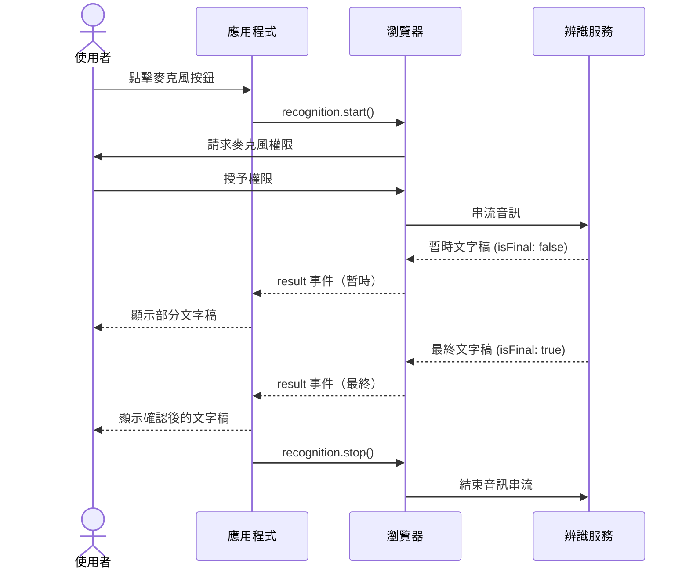

# Web Speech API

Web Speech API 提供兩項能力：語音合成（文字轉語音，透過 `SpeechSynthesis`）與語音辨識
（語音轉文字，透過 `SpeechRecognition`）。語音合成在所有現代瀏覽器中皆可使用；語音辨識
在 Chromium 系瀏覽器中支援較廣，在 Safari 中支援有限，在 Firefox 中則不支援。兩項能力
都無法在所有部署環境中保證可用，因此漸進增強是預設的設計方向。若應用程式只仰賴語音輸入
或語音輸出而不提供替代方案，將對相當比例的使用者造成無聲失敗或毫無幫助的錯誤——從一開始
就設計回退機制並非可選項。

語音合成是較簡單的一半。`speechSynthesis.speak(new SpeechSynthesisUtterance('Hello'))`
使用平台內建的聲音將文字轉換為音訊。`SpeechSynthesisUtterance` 的屬性控制語速、音調、音量
及聲音選擇。聲音的可用性因作業系統和瀏覽器而異；應用程式應列舉可用聲音，並處理所需聲音
不存在的情況。`getVoices()` 在 macOS、Windows、Android 和 iOS 上回傳的系統聲音各不相同——
在一個環境中存在的聲音，未必在另一個環境中可用，硬編碼特定聲音名稱會在其他平台上產生無聲
失敗。語言覆蓋範圍也因平台而異：部分小語種在某些作業系統上沒有對應的系統聲音，應用程式
在依賴特定語言的聲音前，必須透過 `getVoices()` 的回傳結果加以確認，並在目標聲音不存在時
提供可接受的替代聲音或文字顯示回退。

語音辨識支援語音輸入：使用者說話，瀏覽器將音訊傳送至語音辨識服務（通常是伺服器端），結果
以文字稿的形式返回。這帶來了隱私考量——音訊會離開裝置——並需要麥克風權限。使用語音辨識的
應用程式必須向使用者揭露此資料傳輸過程，尤其是在受法規監管的環境中。Chrome 中的語音辨識
實作會將音訊傳送至 Google 的伺服器；這不是在裝置本地進行的處理。在具有資料保護法規的司法
管轄區，或有資料存放地限制要求的企業環境中，使用者需要在授予麥克風權限之前了解音訊的處理
位置。與位置 API 或相機 API 不同，語音辨識的隱私風險在於音訊內容的持續傳輸，而非一次性的
資料存取；對於需要長時間啟用 `continuous` 模式的應用程式（如即時字幕或聽寫工具），應特別
加強使用者對錄音持續進行的視覺提示，以符合透明度要求。

## 設計思維

### SpeechSynthesisUtterance 屬性

`SpeechSynthesisUtterance` 實例承載一次語音輸出請求的所有配置。`text` 屬性設定將被朗讀
的內容。`voice` 屬性接受來自 `speechSynthesis.getVoices()` 的 `SpeechSynthesisVoice` 物件；
將其設為 `null` 則選用瀏覽器的預設聲音。`rate` 屬性接受 0.1 到 10 之間的值，1 為正常語速；
超過 2 的值對大多數聽者而言會難以跟上。`pitch` 屬性範圍為 0 到 2，以 1 為基準。`volume`
屬性範圍為 0 到 1。

utterance 會觸發生命週期事件，讓 UI 能做出反應：`start` 在語音開始時觸發，`end` 在
utterance 結束時觸發，`pause` 和 `resume` 分別在呼叫 `speechSynthesis.pause()` 和
`speechSynthesis.resume()` 時觸發，`boundary` 在字詞和句子邊界處觸發（可用於同步文字
高亮顯示），`error` 在 utterance 無法朗讀時觸發。`speechSynthesis.cancel()` 立即清空
整個 utterance 佇列，包含正在朗讀的 utterance。將多個 utterance 排入佇列的應用程式——例如
依次朗讀清單中的項目——應監聽 `end` 事件以知道何時推進至下一個項目，並監聽 `error` 事件以
知道何時跳過或重試。`boundary` 事件尤其是一個實作不一致的事件；並非所有瀏覽器都會在字詞
邊界處觸發它，因此依賴它進行字詞級高亮的 UI 應在上線前跨瀏覽器測試。

### 聲音載入的非同步行為

`speechSynthesis.getVoices()` 在頁面載入時可能同步回傳空陣列；聲音以非同步方式載入，準備
就緒後會觸發 `speechSynthesis.onvoiceschanged`。正確的模式是在 `onvoiceschanged` 處理器
內部呼叫 `getVoices()`。作為次要優化：若 `getVoices()` 在第一次同步呼叫時回傳非空陣列——
某些在腳本執行前就完成聲音載入的瀏覽器會如此——可以直接使用該陣列，無需等待事件。

在頁面載入時同步呼叫 `getVoices()` 而未處理非同步情況的應用程式，在大多數瀏覽器的第一次
呼叫中會得到空陣列。後果通常是靜默地回退至預設聲音——這並非總是錯誤，但意味著聲音選擇邏輯
被靜默地略過了。若應用程式有特定的聲音需求——特定語言、特定性別或特定品質等級——這些需求
必須在 `onvoiceschanged` 處理器內部套用，而非在頂層腳本中。在單頁應用程式中，`onvoiceschanged`
處理器應全域設定一次，而非在每個元件內部設定，因為事件只觸發一次，在事件觸發後才掛載的元件
將不會收到通知，除非聲音清單在應用程式層級被快取。

### SpeechRecognition 模式

`SpeechRecognition` 透過 `continuous` 屬性控制兩種主要模式。當 `continuous` 為 `false`
（預設值）時，辨識在收到第一個最終結果後自動停止——適用於單一指令或短暫語音輸入。當
`continuous` 為 `true` 時，辨識持續進行直到透過 `recognition.stop()` 明確停止，並隨時間
觸發多個 result 事件——適用於長篇聽寫。

將 `interimResults` 設為 `true` 會使 `result` 事件在使用者仍在說話時以部分文字稿觸發。
這讓應用程式能即時顯示進行中的語音，讓使用者能看到麥克風正在作用且文字正在被擷取的視覺
回饋。暫時結果的 `result.isFinal === false`；只有最終結果才應提交至應用程式狀態，因為
暫時結果在辨識引擎處理更多音訊後可能大幅修改。`lang` 屬性接受 BCP 47 語言標籤（例如
`'en-US'`、`'zh-TW'`、`'fr-FR'`）；未設定時，辨識引擎使用瀏覽器 UI 語言，當應用程式
面向多語系使用者時，這可能與使用者意圖的輸入語言不符。

### 瀏覽器支援與 polyfill 策略

`SpeechRecognition` 在某些 Chromium 系瀏覽器中可能以 `webkitSpeechRecognition` 的前綴形式
存在。正確的功能偵測模式可同時處理兩者：`const SpeechRecognition = window.SpeechRecognition
|| window.webkitSpeechRecognition`。若兩者皆為 `undefined`，則該功能在當前瀏覽器中不可用，
應採用回退 UI 路徑。功能偵測必須在渲染任何依賴辨識的 UI 元素之前進行，而非在使用者與其互動
時才進行，以避免顯示靜默無效的控制項。

對於瀏覽器原生語音辨識不可用、或將音訊傳送至 Google 伺服器的隱私設定無法接受的環境，使用
Web Audio API 擷取原始音訊並搭配 Whisper API（或等效的自架模型）進行轉錄，可提供通用的
替代方案。這種方式需要更多實作工作——透過 `getUserMedia` 擷取音訊串流、編碼以供傳輸、處理
串流或分塊的轉錄回應——但它移除了對 `SpeechRecognition` 瀏覽器支援的依賴，並讓應用程式
完全掌控音訊的處理位置，這對 GDPR 合規或企業部署而言是必要的。

### 無障礙設計的影響

語音輸入對於鍵盤或指標操作困難或不可能的動作障礙使用者而言是重要的無障礙功能。對這些使用者
來說，語音辨識不是便利功能——而是主要的輸入管道。這有兩項設計意涵。第一，語音輸入路徑必須
是完整的輸入方式，而非附加的快捷方式；每個可透過鍵盤執行的操作，都必須可透過語音執行。第二，
當語音辨識不可用時的回退方案本身必須具有無障礙性——具備適當標籤和鍵盤操作能力的文字輸入框，
而非僅僅移除語音選項而不提供替代方案。

透過 `SpeechSynthesis` 的語音輸出，服務於以應用程式提供的音訊補充或取代螢幕閱讀器輸出的
視覺障礙使用者。將語音合成作為通知機制的應用程式——例如大聲朗讀狀態更新或提示——應確保相同
資訊也在 DOM 中供螢幕閱讀器使用，因為偏好使用自己的螢幕閱讀器的使用者不會透過閱讀器的聲音
聽到 `SpeechSynthesis` 的輸出。語音輸出與可見文字（或 aria-live 區域）的重複是正確的模式；
單一依賴 `SpeechSynthesis` 傳達狀態，會讓禁用瀏覽器語音子系統的使用者，或在無法輸出音訊的
情境中的使用者，無法獲得這些資訊。

### 漸進增強設計模式

Web Speech API 的瀏覽器支援情況要求應用程式從漸進增強的角度設計所有語音功能。基準體驗必須在完全沒有語音能力的情況下可正常使用：語音輸入功能的按鈕後面必須有文字輸入欄位作為回退；語音輸出的通知必須同時以可見文字或 ARIA 即時區域呈現，讓不使用 `SpeechSynthesis` 的使用者也能獲取資訊。

實際設計上，這意味著在渲染任何語音相關控制項前，應先透過 `'speechSynthesis' in window` 和 `window.SpeechRecognition || window.webkitSpeechRecognition` 進行功能偵測，並依據偵測結果選擇性地渲染增強層或基準回退。在 React 等使用伺服器端渲染的框架中，這些檢查必須在客戶端水合（hydration）後執行，因為 `window` 在伺服器環境中不存在；建議將偵測結果存入 state，在初次客戶端渲染後更新，確保 SSR 與 CSR 的 UI 一致性。

對於使用語音辨識作為主要輸入管道的使用者（如行動不便者），語音輸入路徑必須是完整的輸入方式，而非鍵盤輸入的附加捷徑；每個可透過鍵盤執行的動作，也應可透過語音執行。這意味著語音功能的回退不只是一個文字輸入欄位，而是一個具有適當標籤、鍵盤可操作性，以及完整錯誤回饋的可及性介面。

## 最佳實踐

**必須（MUST）在請求麥克風權限之前，向使用者揭露語音辨識會將音訊傳送至第三方伺服器進行處理。** Chrome 的 Web Speech API 實作會將音訊傳送至 Google 的伺服器；這不是裝置端的處理流程。揭露必須清楚可見、緊鄰麥克風控制項呈現，且必須在瀏覽器授權提示出現之前——而非埋藏於隱私政策中。受 GDPR、HIPAA 或企業資料落地要求約束、無法讓音訊離開裝置的應用程式，必須評估伺服器端替代方案，例如 Whisper API，由此應用程式完全掌控音訊傳輸路徑與處理位置。

**必須（MUST）在使用前功能偵測 `SpeechSynthesis` 和 `SpeechRecognition`，並提供回退 UI。**
在渲染依賴語音的 UI 之前，檢查 `'speechSynthesis' in window` 以及 `'SpeechRecognition' in window
|| 'webkitSpeechRecognition' in window`。文字輸入始終是語音輸入的正確回退；可見的文字顯示始終
是語音輸出的正確回退。無條件渲染麥克風按鈕，然後在不支援語音的瀏覽器上按下按鈕時靜默失敗的
功能，會創造一個沒有復原路徑的破損體驗。功能偵測是同步且低成本的操作，沒有理由延遲執行。在
使用伺服器端渲染的框架中，檢查必須在客戶端生命週期中執行（不能在 `window` 未定義的伺服器渲染
階段），但應在元件進入使用者可與語音相關控制項互動的狀態之前執行。對於支援語音功能的元件，
建議將偵測結果快取在模組層級或應用程式狀態中，避免在每次渲染時重複執行；即便偵測操作本身成本
低廉，在反應式渲染框架中每次執行都可能觸發不必要的重新渲染。

**應該（SHOULD）在 `speechSynthesis.onvoiceschanged` 事件處理器中列舉可用聲音，而非在頁面
載入時同步執行。** `getVoices()` 在許多瀏覽器中、聲音尚未載入時回傳空陣列。在啟動時從空陣列
選擇聲音，會產生靜默失敗或錯誤的聲音選擇——應用程式以為已套用聲音偏好，但偏好因陣列為空而被
丟棄。`onvoiceschanged` 事件在聲音載入完成後觸發；處理器是填充聲音選擇器 UI、以及套用任何
已儲存使用者聲音偏好的正確位置。在跨 session 持久化聲音偏好的應用程式中，還原邏輯必須在處理器
內部執行：讀取儲存的偏好，在剛載入的陣列中找到對應的聲音，然後套用。在啟動時同步還原，將
找不到聲音，並靜默地回退至預設值。同時要注意 `onvoiceschanged` 在 Safari 中的觸發時機與
Chromium 有所不同；在跨瀏覽器測試中，應分別驗證聲音初始化邏輯在各平台的行為，確保使用者在
所有支援的瀏覽器上都能看到一致的聲音選項。

**必須（MUST）在使用者導航離開、元件卸載，或使用者明確停止錄音時，停止 `SpeechRecognition`。**
`recognition.stop()` 優雅地終止辨識，讓引擎在關閉前最終確認任何待處理的結果。`recognition.abort()`
則立即終止而不最終確認。未停止辨識可能讓瀏覽器分頁或網址列中的麥克風指示器持續顯示，讓使用者
困惑地以為仍在被錄音。應始終響應 `visibilitychange` 事件清理辨識——當 `document.visibilityState
=== 'hidden'` 時停止——並在元件卸載生命週期鉤子中清理。在單頁應用程式中，路由切換不會重新載入
頁面；在某個路由上啟動的辨識 session 若未在路由切換前停止，將繼續在後台錄音，使用者沒有任何
UI 能知道它仍在運行或將其停止。在 React 應用程式中，建議將辨識物件的生命週期與 `useEffect` 的
清理函式綁定；在 Vue 應用程式中，使用 `onUnmounted` 鉤子。確保清理邏輯不僅涵蓋「正常關閉」的
情境，也涵蓋因錯誤、逾時或網路中斷而使辨識進入未知狀態的情境——在這些情況下呼叫 `abort()` 是
安全的，即便辨識當時並未處於活躍狀態。

## 視覺呈現



## 範例

```js
const SpeechRecognition =
  window.SpeechRecognition || window.webkitSpeechRecognition;

if (!SpeechRecognition) {
  console.warn('Speech recognition not supported — falling back to text input');
} else {
  const recognition = new SpeechRecognition();
  recognition.continuous = false;
  recognition.interimResults = true;
  recognition.lang = 'en-US';

  recognition.onresult = (event) => {
    const transcript = Array.from(event.results)
      .map((result) => result[0].transcript)
      .join('');
    document.querySelector('#output').textContent = transcript;
  };

  recognition.onerror = (event) => {
    console.error('Speech recognition error:', event.error);
  };

  document.querySelector('#mic-btn').addEventListener('click', () => {
    recognition.start();
  });

  // 頁面隱藏時停止辨識
  document.addEventListener('visibilitychange', () => {
    if (document.visibilityState === 'hidden') recognition.stop();
  });
}
```

## 常見錯誤

**同步呼叫 `getVoices()` 卻得到空陣列。** 在大多數瀏覽器中，腳本首次執行時聲音尚未可用。
在頂層呼叫 `getVoices()` 並立即使用結果的程式碼，將收到空陣列，並靜默地丟棄所有聲音選擇
邏輯。`onvoiceschanged` 事件是正確的同步點。此錯誤的常見變體是：正確設定了 `onvoiceschanged`，
但也同步呼叫 `getVoices()` 作為捷徑，若同步呼叫回傳非空陣列則跳過處理器——邏輯本身沒錯，
但在聲音同步載入的瀏覽器上，處理器永遠不會被設定，意味著使用者在 session 中途切換系統語言
所觸發的聲音變更將永遠不被偵測到。另一個常見錯誤是在元件掛載時同步初始化聲音選擇器，並在
發現陣列為空時直接顯示「無可用聲音」的訊息，而非等待 `onvoiceschanged`；這會讓使用者看到
功能損壞的假象，即便平台完全支援語音合成。

**未處理 `SpeechRecognitionErrorEvent`——網路錯誤、`aborted`、`no-speech`。** `onerror` 處理器
接收一個事件，其 `error` 屬性是識別錯誤類型的字串。常見值包括：`'network'`（無法連線至辨識
服務）、`'no-speech'`（麥克風在逾時前未擷取到語音）、`'aborted'`（辨識在產生結果前被停止）、
`'not-allowed'`（麥克風權限被拒絕）、`'service-not-allowed'`（瀏覽器不允許在當前情境使用
辨識）。未附加 `onerror` 處理器的應用程式，在網路錯誤時會靜默失敗，讓麥克風按鈕停留在看似
啟用的狀態而沒有任何使用者回饋。每種錯誤類型需要不同的 UX 回應：`'no-speech'` 可重試，
`'not-allowed'` 需要權限說明，`'network'` 需要連線錯誤訊息或建議改用文字輸入回退方案。值得
注意的是，在呼叫 `recognition.abort()` 時通常會觸發 `onerror` 事件，`event.error` 值為
`'aborted'`；清理邏輯在呼叫 `abort()` 後應忽略此錯誤，避免向使用者顯示不必要的錯誤訊息。
在 `onerror` 處理器中，應先判斷錯誤是否為預期中的內部清理錯誤，再決定是否呈現使用者可見
的錯誤 UI。

**元件卸載後仍讓語音辨識繼續運行——麥克風指示器持續顯示。** 在具有元件生命週期管理的框架中，
忘記在清理或卸載鉤子中呼叫 `recognition.stop()` 或 `recognition.abort()` 是常見疏失。瀏覽器
分頁中的麥克風活動指示器仍然可見，使用者看到錄音圖示卻沒有任何 UI 說明是什麼在錄音，或如何
停止它。在某些瀏覽器中，這也會阻止辨識物件及其持有的閉包被垃圾回收，在反覆掛載和卸載語音
輸入元件的應用程式中形成記憶體洩漏。清理鉤子應呼叫 `recognition.abort()`（而非 `stop()`），
以防止虛假的 `result` 事件觸發至已不存在的元件。除了元件卸載的情境外，瀏覽器分頁的背景化
（`document.visibilityState === 'hidden'`）同樣應觸發 `abort()`；使用者切換分頁時，應用程式
不應繼續透過麥克風錄音，即便元件本身並未卸載。這一點在行動裝置上尤為重要，因為行動作業系統
可能因記憶體壓力而限制背景標籤的音訊存取，未主動停止辨識可能導致在這類限制發生時產生
難以除錯的辨識失敗。

**在受 GDPR 監管的應用程式中未揭露音訊傳輸。** Chrome 的預設實作會將音訊傳送至 Google 的
伺服器。在歐盟部署或面向受 GDPR 約束的使用者的應用程式，若呈現麥克風按鈕時未揭露此事實，
便不符合知情同意要求。揭露必須清晰可見、緊鄰麥克風控制項，並在瀏覽器的權限提示出現之前呈現——
而非在之後。在企業部署中，音訊傳輸至雲端的限制可能是組織政策而非僅法規要求；在未確認是否符合
組織資料處理政策的情況下部署瀏覽器原生語音辨識，無論適用何種法規，都會造成合規風險。在醫療、
金融或法律等高度監管產業中，語音辨識擷取到的音訊內容可能包含敏感個資或受保護資訊——在這些
情境中，瀏覽器原生語音辨識幾乎不可能滿足合規要求，應優先考慮自架的端對端加密語音辨識方案，
或完全採用鍵盤輸入作為主要輸入方式，僅以語音作為使用者明確選擇的輔助選項，並伴隨充分的
資料處理說明。

## 相關 FEE

- [FEE-400 — 瀏覽器 API 與 Web 平台總覽](./400.md)
- [FEE-415 — Permissions API（麥克風權限）](./415.md)
- [FEE-1000 — 無障礙設計總覽（語音輸入作為無障礙功能）](../Accessibility/1000.md)

## 相關 FEE 延伸說明

Web Speech API 在實際應用中不會單獨存在。語音辨識的前提是麥克風權限的取得與管理，這是
FEE-415 Permissions API 涵蓋的核心主題；在設計語音辨識功能的授權流程時，應將兩篇文章結合
閱讀。語音輸入作為無障礙輸入管道，與 FEE-1000 無障礙設計總覽的動作障礙輔助技術章節有直接
關聯；確保語音輸入功能符合 WCAG 2.1 AA 級別的操作標準，需要同時理解無障礙設計的整體框架。
瀏覽器 API 與 Web 平台總覽（FEE-400）提供了 Web Speech API 在完整瀏覽器能力圖譜中的定位，
以及與 Web Audio API、MediaStream API 等相鄰能力的關係。對於需要在不支援 `SpeechRecognition`
的環境中提供語音輸入的應用程式，結合 MediaDevices API（`getUserMedia`）與 Web Audio API 進行
音訊擷取和處理，是實現自定義語音輸入管線的基礎——這些 API 的使用細節在 FEE-400 的相關章節
中有進一步介紹。

## 參考資料

以下資源涵蓋了 Web Speech API 的規範定義、瀏覽器實作狀況，以及語音合成與語音辨識的詳細
介面文件。W3C WICG 規範是最權威的技術參考，MDN 提供了實用的開發者指南與跨瀏覽器相容性
表格，Can I Use 則提供了現實部署環境中的支援度快照，在評估是否啟用語音功能時是必查的
起點。`SpeechRecognitionErrorEvent` 的 MDN 頁面在除錯語音辨識問題時特別有價值，因為它列出
了所有已定義的 `error` 字串值及其觸發條件，是實作 `onerror` 處理器時的必要參考。

- MDN: Web Speech API — https://developer.mozilla.org/en-US/docs/Web/API/Web_Speech_API
- MDN: SpeechSynthesis — https://developer.mozilla.org/en-US/docs/Web/API/SpeechSynthesis
- MDN: SpeechRecognition — https://developer.mozilla.org/en-US/docs/Web/API/SpeechRecognition
- MDN: SpeechSynthesisUtterance — https://developer.mozilla.org/en-US/docs/Web/API/SpeechSynthesisUtterance
- MDN: SpeechRecognitionErrorEvent — https://developer.mozilla.org/en-US/docs/Web/API/SpeechRecognitionErrorEvent
- Can I Use: Speech Recognition — https://caniuse.com/speech-recognition
- Can I Use: Speech Synthesis — https://caniuse.com/speech-synthesis
- W3C Web Speech API 規範 — https://wicg.github.io/speech-api/
- OpenAI Whisper API 文件 — https://platform.openai.com/docs/guides/speech-to-text
- MDN: SpeechSynthesisVoice — https://developer.mozilla.org/en-US/docs/Web/API/SpeechSynthesisVoice
- MDN: SpeechRecognitionResult — https://developer.mozilla.org/en-US/docs/Web/API/SpeechRecognitionResult
- MDN: speechSynthesis.getVoices() — https://developer.mozilla.org/en-US/docs/Web/API/SpeechSynthesis/getVoices
- MDN: MediaDevices.getUserMedia() — https://developer.mozilla.org/en-US/docs/Web/API/MediaDevices/getUserMedia
- GDPR 指導方針：知情同意 — https://gdpr-info.eu/art-7-gdpr/
- web.dev: 語音辨識最佳實踐 — https://web.dev/articles/media-mobile
- MDN: Page Visibility API — https://developer.mozilla.org/en-US/docs/Web/API/Page_Visibility_API
- MDN: ARIA 即時區域 — https://developer.mozilla.org/en-US/docs/Web/Accessibility/ARIA/ARIA_Live_Regions
- BCP 47 語言標籤 — https://www.iana.org/assignments/language-subtag-registry/language-subtag-registry
