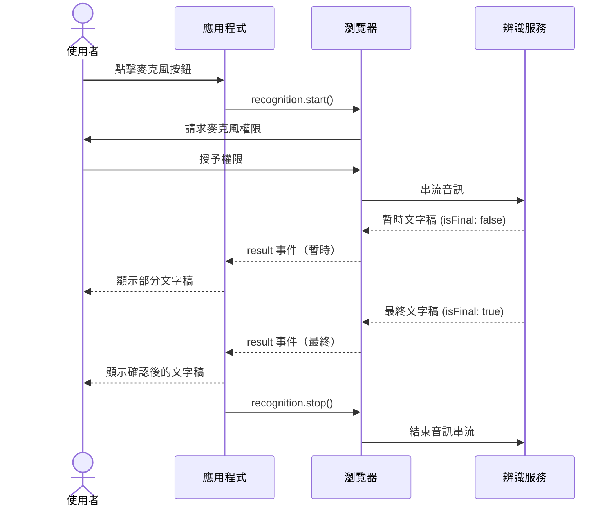

# [FEE-416] Web Speech API

:::info
Web Speech API 讓網頁應用程式能透過瀏覽器內建的語音引擎進行語音合成與語音辨識。`SpeechSynthesis` 將文字轉換為音訊，`SpeechRecognition` 將語音轉換為文字。這兩項能力都不需要應用程式自行建置轉錄或音訊基礎設施。語音合成主要使用作業系統內建的聲音；語音辨識預設使用廠商的雲端服務（Chrome 會將音訊傳送至 Google 的伺服器），自 Chrome 139 起也可選用裝置端模型。各瀏覽器的支援程度不一，因此以下的建議會在支援情況有差異之處，明確指出適用的瀏覽器與模式。
:::

## 背景

網頁上的語音輸入與輸出早於 Web Speech API 就已存在，但在瀏覽器提供原生介面之前，過去的做法通常需要瀏覽器外掛，或是透過第三方聽寫服務進行往返請求。語音合成率先獲得廣泛支援：主要瀏覽器多年前就已導入 `SpeechSynthesis`，儘管聲音清單與事件行為仍因平台而異。語音辨識的支援腳步較慢，且各瀏覽器實作分歧更大；建構子存在與否，並不能可靠地反映辨識功能是否真的可用，這正是本文功能偵測與錯誤處理指引所要填補的落差。本文花在辨識上的篇幅多於合成，原因是辨識的瀏覽器支援狀況、隱私模型與失敗模式，最容易讓初次上線語音輸入功能的團隊感到意外。

## 視覺對比



## 範例

```js
const SpeechRecognition =
  window.SpeechRecognition || window.webkitSpeechRecognition;

if (!SpeechRecognition) {
  console.warn('Speech recognition not supported. Falling back to text input.');
} else {
  const recognition = new SpeechRecognition();
  recognition.continuous = true;
  recognition.interimResults = true;
  recognition.lang = 'en-US';

  let listening = false;

  recognition.onresult = (event) => {
    const transcript = Array.from(event.results)
      .map((result) => result[0].transcript)
      .join('');
    document.querySelector('#output').textContent = transcript;
  };

  recognition.onerror = (event) => {
    console.error('Speech recognition error:', event.error);
  };

  // continuous = true 並不保證連續不中斷的 session：Chrome 會因靜音逾時、
  // 網路問題而結束辨識，在部分版本與平台上，即使 continuous 為 true，
  // 也會在達到最長 session 時間後結束。僅在使用者尚未明確停止時才重新
  // 啟動，避免主動呼叫 stop() 或 abort() 觸發無限重啟迴圈。
  recognition.onend = () => {
    if (listening) recognition.start();
  };

  document.querySelector('#mic-btn').addEventListener('click', () => {
    listening = true;
    recognition.start();
  });

  document.querySelector('#stop-btn').addEventListener('click', () => {
    listening = false;
    recognition.stop();
  });

  // 頁面隱藏時停止辨識。
  document.addEventListener('visibilitychange', () => {
    if (document.visibilityState === 'hidden') {
      listening = false;
      recognition.stop();
    }
  });
}
```

## 最佳實踐

**必須（MUST）在請求麥克風權限之前，向使用者揭露語音辨識可能會將音訊傳送至第三方伺服器。** Chrome 的預設辨識模式會將音訊傳送至 Google 的伺服器。自 Chrome 139（2025 年 8 月）起，Chrome 也支援裝置端辨識：呼叫 `SpeechRecognition.available()` 可檢查目標語言的裝置端模型是否已安裝，若尚未安裝可呼叫 `install()` 下載，並在 `start()` 之前將 `recognition.processLocally` 設為 `true`，要求採用本地處理。受 GDPR、HIPAA 或企業資料落地要求約束的應用程式，應以功能旗標的方式偵測 `processLocally` 支援情況並優先採用。在該功能不可用的環境中，揭露義務依然存在，且唯有自架的轉錄服務才能讓音訊不離開外部伺服器；委外的第三方 API 並非替代方案，因為它本身在相同法規下仍屬於資料處理者。揭露內容應緊鄰麥克風控制項呈現，並在瀏覽器自身的權限提示出現之前顯示。僅提供隱私政策連結並不足以滿足這項要求。

**必須（MUST）在使用前對 `SpeechSynthesis` 與 `SpeechRecognition` 都進行功能偵測，並提供回退 UI。** 在渲染依賴語音的 UI 之前，檢查 `'speechSynthesis' in window` 以及 `'SpeechRecognition' in window || 'webkitSpeechRecognition' in window`。僅偵測建構子是否存在並不足夠：Edge 與 Brave 都會暴露 `webkitSpeechRecognition`，但辨識在這兩者上永遠不會成功。Edge 的失敗可能會以錯誤事件呈現（`'network'`、`'service-not-allowed'` 或 `'language-not-supported'`），也可能完全沒有任何事件觸發，因此偵測不能只依賴建構子是否存在：應將 `onerror` 回退與逾時機制搭配使用，在既未收到結果也未收到錯誤事件時，回退至文字輸入。無條件渲染麥克風按鈕、卻在不支援的瀏覽器上按下按鈕時靜默失敗的功能，會製造出沒有復原路徑的破損體驗。文字輸入始終是語音輸入的正確回退，可見的文字顯示則始終是語音輸出的正確回退。功能偵測是同步且低成本的操作，沒有理由延後執行。在使用伺服器端渲染的框架中，檢查必須在客戶端生命週期中執行，因為 `window` 在伺服器渲染階段是未定義的，且必須在元件進入使用者可與語音相關控制項互動的狀態之前完成。

**應該（SHOULD）在 `speechSynthesis.onvoiceschanged` 處理器中列舉可用聲音，而非在頁面載入時同步執行。** 在瀏覽器完成聲音清單載入之前，`getVoices()` 可能回傳空陣列。完整的處理模式，包含還原已儲存偏好設定的情境，請見下方「聲音載入的非同步行為」。

**必須（MUST）在使用者導航離開、元件卸載，或使用者明確停止錄音時停止 `SpeechRecognition`。** `recognition.stop()` 會優雅地終止辨識，讓引擎在關閉前完成任何待處理結果的最終確認；`recognition.abort()` 則會立即終止而不進行最終確認。未停止辨識會讓麥克風真的持續錄音，瀏覽器分頁或網址列的指示器是使用者唯一能察覺錄音仍在進行的線索。應在 `visibilitychange` 事件中清理辨識，於 `document.visibilityState === 'hidden'` 時停止，並在元件卸載的生命週期鉤子中一併清理。在單頁應用程式中，路由切換不會重新載入頁面，因此在某個路由上啟動、卻未在路由切換前停止的辨識 session，會在背景繼續錄音，而使用者沒有任何 UI 能得知它仍在運作或如何停止它。

## 設計思維

### SpeechSynthesisUtterance 屬性

`SpeechSynthesisUtterance` 實例承載一次語音輸出請求的所有配置。`text` 屬性設定將被朗讀的內容。`voice` 屬性接受來自 `speechSynthesis.getVoices()` 的 `SpeechSynthesisVoice` 物件；將其設為 `null` 則選用瀏覽器的預設聲音。`rate` 屬性接受 0.1 到 10 之間的值，1 為正常語速，超過 2 的值對大多數聽者而言會難以跟上。`pitch` 屬性範圍為 0 到 2，以 1 為基準。`volume` 屬性範圍為 0 到 1。

utterance 會觸發生命週期事件，讓 UI 能做出反應：`start` 在語音開始時觸發，`end` 在 utterance 結束時觸發，`pause` 和 `resume` 分別在呼叫 `speechSynthesis.pause()` 和 `speechSynthesis.resume()` 時觸發，`boundary` 在字詞和句子邊界處觸發（可用於同步文字高亮顯示），`error` 在 utterance 無法朗讀時觸發。`speechSynthesis.cancel()` 立即清空整個 utterance 佇列，包含正在朗讀的 utterance。將多個 utterance 排入佇列的應用程式（例如依次朗讀清單中的項目）應監聽 `end` 事件以知道何時推進至下一個項目，並監聽 `error` 事件以知道何時跳過或重試。`boundary` 事件很有用，但實作並不一致：並非所有瀏覽器都會在字詞邊界處觸發它，因此依賴它進行字詞級高亮的 UI 需要在上線前跨瀏覽器測試。

### 聲音載入的非同步行為

`speechSynthesis.getVoices()` 在頁面載入時可能同步回傳空陣列。聲音會以非同步方式載入，載入完成後觸發 `speechSynthesis.onvoiceschanged`。正確的做法是在 `onvoiceschanged` 處理器內部呼叫 `getVoices()`。作為次要優化，部分瀏覽器會在腳本執行前就完成聲音載入，因此 `getVoices()` 在第一次同步呼叫時就可能回傳非空陣列；發生這種情況時，可以直接使用該陣列，不必等待事件觸發。

在頁面載入時同步呼叫 `getVoices()` 而未處理非同步情況的應用程式，在大多數瀏覽器上第一次呼叫都會得到空陣列。結果是靜默地回退至預設聲音，意味著聲音選擇邏輯在沒有拋出任何錯誤的情況下被略過。若應用程式需要特定聲音，例如特定的語言變體，該需求就必須在 `onvoiceschanged` 處理器內部套用，而非放在頂層腳本中。在單頁應用程式中，應全域設定一次 `onvoiceschanged` 處理器，並在應用程式層級快取聲音清單，因為在初次聲音載入完成後才掛載的元件，會錯過已經觸發過的事件，而這個事件在聲音清單於 session 中途變動時還可能再次觸發。還原已持久化的聲音偏好時也適用同樣的限制：應在 `onvoiceschanged` 處理器內部讀取儲存的偏好，並與剛載入完成的陣列進行比對，而不是在陣列填入之前就進行比對，否則比對會針對空清單執行，並靜默地回退至預設聲音。

### SpeechRecognition 模式

`SpeechRecognition` 透過 `continuous` 屬性控制兩種主要模式。當 `continuous` 為 `false`（預設值）時，辨識會在收到第一個最終結果後自動停止，適合單一指令或短暫的聽寫片段。當 `continuous` 為 `true` 時，辨識會持續進行，直到透過 `recognition.stop()` 明確停止為止，並會隨時間觸發多個 `result` 事件，適合長篇聽寫。

`continuous = true` 並不保證 session 不會中斷。Chrome 會因靜音逾時（觸發 `'no-speech'` 錯誤）、網路不穩定而結束辨識，在部分版本與平台上，即使設定了 `continuous`，也會在達到最長 session 時間後結束；Android 上的實作行為又有所不同。只依賴 `continuous` 的聽寫介面，會在第一次停頓後就停止轉錄，且不會提示任何原因。解法是在 `onend` 處理器中重新啟動辨識，並以旗標判斷使用者是否仍打算持續聆聽：

```js
let listening = false;

recognition.onend = () => {
  if (listening) recognition.start();
};
```

這個旗標很重要，因為 `onend` 在主動呼叫 `stop()` 或 `abort()` 之後同樣會觸發。若沒有這個判斷，呼叫 `abort()` 取消辨識會立即觸發新的 `start()`，導致 session 實際上永遠不會結束。

將 `interimResults` 設為 `true`，會讓 `result` 事件在使用者仍在說話時，以部分文字稿的形式觸發。這能讓使用者獲得視覺回饋，得知麥克風正在作用、話語正被擷取。暫時結果的 `result.isFinal` 為 `false`；只有最終結果才應提交至應用程式狀態，因為暫時結果在辨識引擎處理更多音訊後，可能會被大幅修改。`lang` 屬性接受 BCP 47 語言標籤，例如 `'en-US'`、`'zh-TW'` 或 `'fr-FR'`。若未設定，預設會採用文件的 HTML lang 屬性，若該屬性也不存在，則回退至瀏覽器的 UI 語言；當應用程式面向多語系使用者時，這兩者都可能與使用者實際想要的輸入語言不符。

### 瀏覽器支援與 polyfill 策略

Chrome 與 Safari 都只以 `webkitSpeechRecognition` 這個帶前綴的名稱暴露辨識建構子；目前沒有任何正式發行的瀏覽器暴露不帶前綴的建構子，因此帶前綴的查詢涵蓋了 Chrome 與 Safari，而不帶前綴的查詢則是為 Firefox 的旗標實作預留的相容性。功能偵測模式可同時處理這兩種形式：`const SpeechRecognition = window.SpeechRecognition || window.webkitSpeechRecognition`。不帶前綴的 `SpeechRecognition` 名稱，正是 Firefox 在 `media.webspeech.recognition.enable` 與 `media.webspeech.recognition.force_enable` 偏好設定背後所暴露的名稱；這個旗標實作本身也是把音訊轉送至雲端服務，且截至 2026 年年中，Firefox 預設並未上線辨識功能。Mozilla 已針對裝置端辨識的相關提案記錄了正面的標準立場（mozilla/standards-positions#1157），但尚未承諾會建置或上線這項功能。若 `window.SpeechRecognition` 與 `window.webkitSpeechRecognition` 皆為 `undefined`，代表該功能在目前瀏覽器中不可用，應採用回退 UI 路徑。功能偵測應在渲染任何依賴辨識的 UI 元素之前執行，而不是只在使用者與其互動的當下才執行，確保應用程式不會顯示靜默無效的控制項。

建構子存在，不代表辨識就能真的產生結果。Edge 繼承了 Chromium 的 `SpeechRecognition` 實作，但在目前的版本中，辨識在 Edge 上並不會運作。Brave 同樣會暴露這個建構子，但它注重隱私的版本停用了建構子所依賴、以 Google 金鑰驗證的雲端服務，因此 `start()` 在執行期會失敗。Brave 的失敗會以 `onerror` 上的 `'network'` 或 `'service-not-allowed'` 錯誤呈現，而不是建構子缺失。Edge 的失敗可能以同樣的方式呈現，也可能完全沒有觸發任何錯誤事件，這正是為什麼「最佳實踐」中提到的錯誤處理，除了功能偵測與 `onerror` 之外，還需要搭配逾時回退機制。

Chrome 的預設辨識模式會將音訊傳送至 Google 的伺服器進行處理。自 Chrome 139（2025 年 8 月）起，這組 API 也支援裝置端辨識：`SpeechRecognition.available({ processLocally: true, langs: [...] })` 會回報所要求的語言是否已備妥裝置端模型，`SpeechRecognition.install({ processLocally: true, langs: [...] })` 則會在尚未備妥時下載模型，而在 `start()` 之前將 `recognition.processLocally` 設為 `true`，即要求採用本地處理（若模型尚未安裝，呼叫會以 `'language-not-supported'` 錯誤失敗）。這彌補了 Chrome 使用者原本的隱私落差，但僅限於這個瀏覽器，且僅在語言套件已安裝的前提下才成立。若應用程式在任何地方都必須讓音訊完全不離開裝置，仍需要為 `processLocally` 不可用的瀏覽器準備回退方案。

這個回退方案是伺服器端管線：使用 Web Audio API 與 `getUserMedia` 擷取音訊，再透過委外或自架的語音轉文字服務進行轉錄。兩者的差異在合規上很重要。像 OpenAI Whisper API 這類委外 API，會把音訊傳送到該服務商的伺服器，因此和 Google 的辨識服務一樣，需要相同的揭露義務與資料處理協議要求。唯有自架的模型，例如自行部署的 Whisper，或瀏覽器自身的裝置端模式，才能讓音訊處理完全掌握在應用程式手中。這個做法所需的實作工作也比原生 API 更多：除了 `getUserMedia` 擷取本身之外，還要將音訊串流編碼以供傳輸，並處理串流或分塊的轉錄回應。

### 無障礙設計的影響

對於覺得鍵盤或指標操作困難甚至無法使用的動作障礙使用者而言，語音辨識往往是唯一可行的輸入管道，因此每個鍵盤可觸及的操作都需要有對應的語音路徑。若語音功能只涵蓋部分表單欄位，這些使用者就無法完成其餘的部分。當語音辨識不可用時的回退方案，同樣需要是完全無障礙的文字輸入欄位，具備適當的標籤與完整的鍵盤操作能力，因為當辨識載入失敗或發生錯誤時，這正是同一群使用者所仰賴的方案。

透過 `SpeechSynthesis` 產生的語音輸出，服務的是以應用程式提供的音訊來補充或取代螢幕閱讀器輸出的視覺障礙使用者。將語音合成作為通知機制、以語音朗讀狀態更新或提示的應用程式，也應該把相同的資訊放進 DOM 供螢幕閱讀器使用，因為使用自己螢幕閱讀器的使用者，並不會透過該閱讀器的聲音聽到 `SpeechSynthesis` 的輸出。將語音輸出以可見文字或 aria-live 區域重複呈現才是正確做法；單獨依賴 `SpeechSynthesis` 傳達資訊，會讓停用瀏覽器語音子系統，或處於無法輸出音訊情境中的使用者，無法取得這些資訊。

## 常見錯誤

**同步呼叫 `getVoices()` 卻得到空陣列。** 在大多數瀏覽器中，腳本剛執行的當下聲音還無法取得，因此在頂層呼叫 `getVoices()` 並立即使用結果的程式碼，會收到空陣列，並靜默地捨棄所有聲音選擇邏輯。這個錯誤有個常見的變體：正確設定了 `onvoiceschanged`，卻也把同步呼叫 `getVoices()` 當作捷徑，並在同步呼叫回傳非空陣列時，就有條件地跳過設定處理器。在聲音同步載入的瀏覽器上，處理器永遠不會被掛上，於是之後觸發的聲音變更，例如使用者在 session 中途切換系統語言，就永遠不會被偵測到。

**較長的 `SpeechSynthesisUtterance` 播放，在 Chrome 上約 15 秒後靜默中斷。** Chrome 有個存在已久的臭蟲：使用遠端（網路）聲音朗讀的 utterance，若沒有機制讓合成引擎保持運作，大約 15 秒後就會在句子中途停止；本機平台聲音則不受影響。可檢查所選聲音的 `localService` 屬性，只要為 `false` 就套用因應措施。常見做法是設置一個保持運作機制：在 utterance 朗讀期間，每隔約 10 到 14 秒，立即依序呼叫 `speechSynthesis.pause()` 與 `speechSynthesis.resume()`。若應用程式在朗讀長文字（例如朗讀整篇文章）時略過這個處理，就會在播放到一半時中斷，且不會觸發任何錯誤事件。

**因 utterance 物件被垃圾回收而遺失 `end` 事件。** 建立 `SpeechSynthesisUtterance` 卻沒有保留任何存活的參照時，瀏覽器可能會在語音播放完成前就將其回收，導致 `end` 與 `error` 事件不再觸發。應保留 utterance 的參照（存放在變數、陣列或元件 state 中），並持續到它可能仍在朗讀為止，而不是只維持到呼叫 `speak()` 的那一刻。

**在使用者尚未進行任何互動前就呼叫 `speak()`。** 瀏覽器對語音合成套用了類似自動播放限制的使用者互動要求：在使用者與頁面互動之前呼叫 `speak()`，可能會被封鎖或靜默忽略。應從點擊或其他使用者手勢的處理器中觸發第一次 `speak()` 呼叫，而不是放在頁面載入或路由切換的 effect 中。

**未處理 `SpeechRecognitionErrorEvent`：網路錯誤、`aborted`、`no-speech`。** `onerror` 處理器接收到的事件，其 `error` 屬性是一個識別錯誤類型的字串。常見的值包括 `'network'`（無法連線至辨識服務）、`'no-speech'`（麥克風在逾時前未擷取到任何語音）、`'aborted'`（辨識在產生結果前就被停止）、`'not-allowed'`（麥克風權限被拒絕），以及 `'service-not-allowed'`（瀏覽器不允許在目前的情境中使用辨識）。未附加 `onerror` 處理器的應用程式，會在網路錯誤發生時靜默失敗，讓麥克風按鈕停留在看似作用中的狀態，卻沒有任何使用者回饋。每種錯誤類型都需要不同的 UX 回應：`'no-speech'` 可以重試，`'not-allowed'` 需要權限說明，`'network'` 則需要連線錯誤訊息，或建議改用文字輸入回退方案。

**元件卸載後仍讓語音辨識繼續運行，導致麥克風指示器持續顯示。** 在具備元件生命週期管理的框架中，忘記在清理或卸載鉤子中呼叫 `recognition.stop()` 或 `recognition.abort()`，是常見的疏漏。瀏覽器分頁中的麥克風活動指示器仍會持續顯示，使用者看到錄音圖示，卻沒有任何 UI 說明是什麼在錄音，或該如何停止它。在部分瀏覽器中，這也會阻止辨識物件及其持有的閉包被垃圾回收，在反覆掛載與卸載語音輸入元件的應用程式中形成記憶體洩漏。清理鉤子應呼叫 `recognition.abort()`，而非 `stop()`，以避免虛假的 `result` 事件觸發到已經不存在的元件上。

**在受 GDPR 規範的應用程式中未揭露音訊傳輸。** 除非應用程式主動選用 `processLocally`，否則 Chrome 的預設實作會將音訊傳送至 Google 的伺服器。在部署於歐盟或服務受 GDPR 規範使用者的應用程式中，若呈現麥克風按鈕卻未揭露這一點，就不符合知情同意的要求。揭露內容必須清晰可讀、緊鄰麥克風控制項，且必須在瀏覽器自身的權限提示出現之前顯示，而非之後。在企業部署中，音訊上雲的限制可能是組織政策，而非法規上的硬性要求；在未確認組織資料處理政策的情況下部署瀏覽器原生語音辨識，無論適用哪一種法規，都會造成合規風險。

## 延伸閱讀

- [瀏覽器 API 與 Web 平台總覽](/zh-tw/Browser%20APIs%20and%20Web%20Platform/400)
- [Permissions API](/zh-tw/Browser%20APIs%20and%20Web%20Platform/415)
- [無障礙設計總覽](/zh-tw/Accessibility/1000)

## 參考資料

- MDN Contributors, "Web Speech API," MDN Web Docs (2026). https://developer.mozilla.org/en-US/docs/Web/API/Web_Speech_API
- MDN Contributors, "SpeechSynthesis," MDN Web Docs (2026). https://developer.mozilla.org/en-US/docs/Web/API/SpeechSynthesis
- MDN Contributors, "SpeechRecognition," MDN Web Docs (2026). https://developer.mozilla.org/en-US/docs/Web/API/SpeechRecognition
- MDN Contributors, "SpeechRecognition: processLocally property," MDN Web Docs (2026). https://developer.mozilla.org/en-US/docs/Web/API/SpeechRecognition/processLocally
- MDN Contributors, "SpeechSynthesisUtterance," MDN Web Docs (2026). https://developer.mozilla.org/en-US/docs/Web/API/SpeechSynthesisUtterance
- MDN Contributors, "SpeechRecognitionErrorEvent," MDN Web Docs (2026). https://developer.mozilla.org/en-US/docs/Web/API/SpeechRecognitionErrorEvent
- Can I Use, "SpeechRecognition API," caniuse.com (accessed 2026). https://caniuse.com/mdn-api_speechrecognition
- Can I Use, "Speech Synthesis API," caniuse.com (accessed 2026). https://caniuse.com/speech-synthesis
- Audio Community Group, "Web Speech API" (Draft Community Group Report), webaudio.github.io (2026). https://webaudio.github.io/web-speech-api/
- Chromium Issue Tracker, "Speech Synthesis stops abruptly after about 15 seconds," issues.chromium.org (2026). https://issues.chromium.org/issues/41294170
