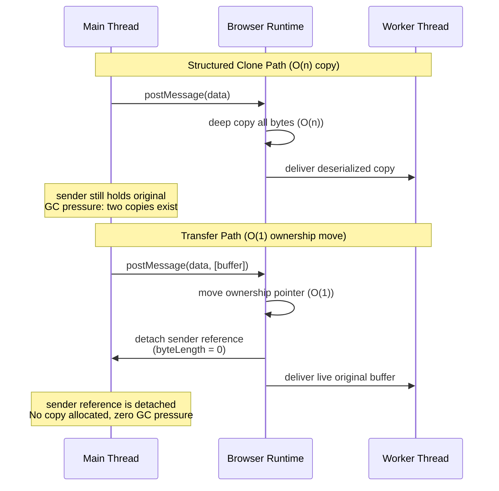

# [FEE-417] Transferable Objects

:::info
瀏覽器跨 `postMessage` 邊界傳遞資料的預設機制是結構化複製演算法：對有效負載執行完整深層複製，需要分配新記憶體並複製每個位元組，對雙方都造成 GC 壓力。Transferable Objects 是零複製的替代方案。不同於複製，底層記憶體緩衝區的所有權會以原子方式從發送方移轉至接收方，時間複雜度為 O(1)，與資料大小無關。移轉後，發送方的參考會被*分離（detached）*：其 `byteLength` 變為 0，任何讀取嘗試都會拋出 `TypeError`。任何時刻只有一個執行緒擁有該資料。理解何時應移轉而非複製，對於建構會搬移大型二進位資料（例如視訊畫格或解碼後音訊）的高吞吐量 Worker 管線而言至關重要。
:::

## 背景

每次呼叫 `postMessage` 都必須序列化有效負載，使其能安全地跨越執行緒邊界，無論是在主執行緒與專用 Worker 之間、兩個框架之間，還是 `MessageChannel` 的兩端。預設情況下，瀏覽器使用**結構化複製演算法**：一種遞迴深層複製，遍歷物件圖，為每個值分配新記憶體，並在接收端建構獨立的副本。對於純量資料和小型物件，此成本可忽略不計。對於大型二進位有效負載（儲存解碼後視訊像素的 100 MB `ArrayBuffer`、50 MB 的 `AudioData` 緩衝區，甚至是在 30 fps 下僅 4 MB 的影像 `Uint8ClampedArray`），複製開銷會成為瓶頸：記憶體分配、逐位元組複製，以及現在已孤立的發送方副本所產生的後續 GC 壓力，全都加總在一起。

**移轉機制**消除了這項成本。當某個物件被列入作為 `postMessage` 第二個引數傳入的移轉陣列時：

```js
postMessage(data, [transferList]);
```

瀏覽器會以 O(1) 的時間將物件底層記憶體的所有權從發送方移至接收方，無需分配，也無需複製。發送方的控制代碼會立即被**分離**：讀取 `byteLength` 回傳 `0`，透過指向同一緩衝區的視圖進行讀取或寫入會拋出 `TypeError`。接收方獲得的是活躍的原始緩衝區，而非副本。

分離強制執行單一所有權：在任何時間點，恰好只有一個執行環境持有對該記憶體的有效參考，因此移轉不需要鎖或同步機制。（較舊的資料有時稱此狀態為「廢除（neutered）」；WHATWG 規範已於 2016 年將此術語更名為「分離（detached）」。）這與 `SharedArrayBuffer` 不同：後者讓發送方和接收方共享相同的記憶體，必須使用 `Atomics` 操作協調存取。

移轉列表語法接受一個可移轉物件陣列：

```js
// Single buffer
worker.postMessage({ pixels: buffer }, [buffer]);

// Multiple transferables in one message
// frame is a VideoFrame, port is a MessagePort; both are transferable
worker.postMessage({ frame, port }, [frame, port]);
```

若某個物件可移轉但**未**列入移轉陣列，瀏覽器會對該物件退回至結構化複製。移轉列表必須明確指定：沒有自動偵測機制。

有一個重要的細節：移轉列表必須包含*物件本身*，而非其視圖。若你持有一個名為 `pixels` 的 `Uint8ClampedArray`，其 `.buffer` 是底層的 `ArrayBuffer`，你必須在移轉陣列中列出 `pixels.buffer`（或持有該 `ArrayBuffer` 的變數），而非 `pixels` 本身。`TypedArray` 視圖可序列化但不可移轉：在移轉陣列中列出 `pixels` 會拋出 `DataCloneError` 的 `DOMException`，而不會移轉底層緩衝區。瀏覽器會完全拒絕該訊息，而不是悄悄退回至結構化複製，因此這個錯誤會立即以擲出例外的形式浮現。

移轉適用於任何存在 `postMessage` 的地方，不僅限於 `Worker`。以下是接受移轉列表的完整 `postMessage` 邊界清單：專用 Worker（`Worker.postMessage`）、共享 Worker（`SharedWorker.port.postMessage`）、Service Worker（`client.postMessage` 和 `ServiceWorkerRegistration.active.postMessage`）、`MessageChannel` 端口（`MessagePort.postMessage`）、跨框架訊息傳遞（`window.postMessage`）、WebRTC 資料通道（`RTCDataChannel.send` 不接受移轉列表，但通道本身如下文所述是可移轉的），以及 WebTransport 串流。`BroadcastChannel` 是值得注意的例外：它使用結構化複製，且完全不接受移轉列表，因為廣播本質上是一對多的，無法將獨佔所有權移轉給單一接收者。

結構化複製演算法也作為獨立函式公開，即 `structuredClone(value, { transfer })`，自 Node 17 及所有現代瀏覽器起可用。這種形式可用於在單一執行緒內深層複製複雜物件，同時也接受移轉列表。當移轉列表提供給 `structuredClone` 時，被列出的物件會被移轉進複製體並在原始物件中分離，而物件圖的其餘部分則進行深層複製。這在實務上很少需要，但當你想複製一個大型物件，同時將昂貴的二進位部分從原始物件移轉出去而非複製時，它會很有用。

一個以瀏覽器為基礎的視訊調色工具可說明這一點的重要性。該工具使用 WebCodecs API 從 `<video>` 元素擷取畫格，主執行緒以 30 至 60 fps 的速度接收每個 `VideoFrame`。調色（對數百萬個像素進行逐像素 HSL 轉換）必須在主執行緒之外執行，才能避免掉格，因此主執行緒會將每個 `VideoFrame` 移轉至一個專用 Worker，Worker 處理像素後將 `ImageBitmap` 結果移轉回主執行緒，以合成至 `OffscreenCanvas`。

若不使用移轉，每次來回都需要每畫格複製兩次大量像素資料：一次發送至 Worker，一次接收結果。這會佔滿記憶體頻寬，並觸發表現為掉格的 GC 暫停。使用移轉後，每次跨越均為 O(1)：Worker 取得 `VideoFrame` 的完整所有權，對其進行處理，並回傳結果的所有權，過程中不分配任何額外的像素資料位元組。在 30 fps 且畫格尺寸為 1080p（每畫格約 8 MB）的情況下，避免來回兩端的雙重複製，可節省約 480 MB/s 的記憶體頻寬。

對於小型有效負載，移轉的重要性較低。Surma 針對 `postMessage` 開銷所做的效能測試（見參考資料）發現，結構化複製的有效負載在約 10 KiB 以內都能維持在單一畫格 16 毫秒的動畫預算內（在 100 KiB 以內則能維持在 100 毫秒的互動預算內），而移轉 `ArrayBuffer` 的速度快，且與其大小無關。一個 JSON 可序列化的設定物件（幾十個屬性，無二進位資料）遠低於這個門檻，因此複製開銷相較於發布訊息本身的延遲可忽略不計。是否選擇移轉的決策由資料大小和管線吞吐量驅動：持續處理畫格或音訊區塊的 Worker，能從消除每次跨越的分配開銷中受益；僅在啟動時接收一次設定的 Worker 則不然，此時結構化複製才是正確的預設選擇。

## 視覺對比



**圖表解讀：** 上半部序列顯示結構化複製：瀏覽器分配新記憶體，複製每個位元組，發送方保留其原始物件，記憶體中會存在兩個副本，直到 GC 回收現已不可達的發送方副本為止。下半部序列顯示移轉：瀏覽器以 O(1) 的時間移動所有權指標，立即分離發送方的參考，並將原始緩衝區傳遞給 Worker。不發生任何分配，不複製任何位元組，GC 壓力就此消除。

## 範例

### 1. ArrayBuffer 移轉：主執行緒外的影像處理

```js
// Main thread: create pixel buffer, do some processing, then transfer to worker
const worker = new Worker('image-processor.js');

// Create a 4 MB image buffer (1024x1024, 4 bytes per pixel)
const width = 1024;
const height = 1024;
const buffer = new ArrayBuffer(width * height * 4);
const pixels = new Uint8ClampedArray(buffer);

// Fill with image data (e.g., from canvas.getContext('2d').getImageData())
for (let i = 0; i < pixels.length; i += 4) {
  pixels[i]     = 128; // R
  pixels[i + 1] = 200; // G
  pixels[i + 2] = 255; // B
  pixels[i + 3] = 255; // A
}

// Transfer the buffer: do NOT list 'pixels' (the view), list 'buffer' (the ArrayBuffer)
worker.postMessage({ width, height, buffer }, [buffer]);

// Confirm detachment: sender can no longer access the data
console.log(buffer.byteLength); // 0 (detached)
// console.log(pixels[0]);      // Would throw TypeError in strict mode

// Worker receives result and transfers back
// Assumes: const ctx = canvas.getContext('2d');
worker.addEventListener('message', (event) => {
  const { resultBuffer } = event.data;
  const resultPixels = new Uint8ClampedArray(resultBuffer);
  // resultPixels is the processed image from the worker
  const imageData = new ImageData(resultPixels, width, height);
  ctx.putImageData(imageData, 0, 0);
});
```

```js
// image-processor.js (worker)
self.addEventListener('message', (event) => {
  const { width, height, buffer } = event.data;
  const pixels = new Uint8ClampedArray(buffer);

  // Apply grayscale transformation in-place
  for (let i = 0; i < pixels.length; i += 4) {
    const luma = Math.round(
      0.299 * pixels[i] + 0.587 * pixels[i + 1] + 0.114 * pixels[i + 2]
    );
    pixels[i]     = luma; // R
    pixels[i + 1] = luma; // G
    pixels[i + 2] = luma; // B
    // Alpha unchanged
  }

  // Transfer the (now modified) buffer back to the main thread
  self.postMessage({ resultBuffer: buffer }, [buffer]);
});
```

### 2. RTCDataChannel 移轉與功能偵測

```js
// RTCDataChannel is transferred like any other transferable: by listing it
// directly in the postMessage transfer array. There is no dedicated
// transfer() method. Chrome 130+ and Safari support this; Firefox does
// not, as of 2026, and throws a DataCloneError DOMException synchronously
// (before the message is sent), so a try/catch is a safe capability check.

const worker = new Worker('rtc-worker.js');
const peerConnection = new RTCPeerConnection(config);
const dataChannel = peerConnection.createDataChannel('game-data');

dataChannel.addEventListener('open', () => {
  try {
    // Chrome 130+ and Safari: transfer the channel to the worker by
    // listing it directly in the transfer array. The main thread no
    // longer intermediates; the worker sends and receives directly
    // on this channel.
    worker.postMessage({ channel: dataChannel }, [dataChannel]);
  } catch (err) {
    // Fallback for Firefox (throws DataCloneError): relay via MessagePort.
    // Create a MessageChannel; give one port to the worker.
    // The main thread proxies dataChannel messages to/from the port.
    const { port1, port2 } = new MessageChannel();
    worker.postMessage({ relayPort: port2 }, [port2]);

    dataChannel.addEventListener('message', (e) => port1.postMessage(e.data));
    port1.addEventListener('message', (e) => dataChannel.send(e.data));
    port1.start();

    // Note: this relay adds one hop and keeps the main thread in the hot path.
    // Acceptable for low-frequency control messages; avoid for high-throughput streams.
  }
});
```

**為何退回方案很重要：** 在退回路徑中，`port1` 留在主執行緒並透過 `port2` 將 `dataChannel` 訊息代理給 Worker。當使用 `addEventListener` 而非 `onmessage` 屬性時，必須呼叫 `port1.start()`；若不呼叫，訊息會排隊但永遠不會分派。此中繼讓主執行緒留在訊息路徑上，這對低頻率控制訊號（遊戲狀態更新、訊號訊息）可以接受，但對以視訊幀率進行的大量資料傳輸則不適合。在這些情況下，優先選擇透過 `MessageChannel` 中繼的 `ReadableStream`/`WritableStream` 移轉。

## 最佳實踐

**必須**將移轉列表作為 `postMessage` 的第二個引數包含在內。省略第二個引數會導致整個有效負載的結構化複製，無論物件是否可移轉。瀏覽器不會自動偵測可移轉物件：`worker.postMessage({ buffer })` 執行複製；`worker.postMessage({ buffer }, [buffer])` 執行移轉。這是基於移轉的 Worker 程式碼中最常見的單一錯誤。

**必須不**在發送後讀取或寫入已移轉的物件。一旦發送方使用移轉列表發布訊息，物件便立即同步分離，發生在任何微任務執行之前。現代瀏覽器對任何存取都會拋出 `TypeError`；舊版瀏覽器會靜默回傳過時或歸零的資料。在 `postMessage` 呼叫後，將已移轉的參考視為 `null`，且不再參考它。若需要保留緩衝區中的資料，請在移轉前讀取。

**應該**移轉 `VideoFrame` 和 `AudioData` 而非複製它們。這些 WebCodecs 類型持有硬體分配記憶體的參考，且被明確設計用於基於移轉的管線。複製 `VideoFrame` 會在每次跨越時分配一份可能達數 MB 像素資料的完整副本。請始終移轉，並在接收方完成使用後始終呼叫 `VideoFrame` 的 `.close()` 以及時釋放底層記憶體。

**應該**在依賴 `RTCDataChannel` 移轉支援之前進行功能偵測。沒有 `RTCDataChannel.prototype.transfer` 方法可供探測；支援與否取決於瀏覽器是否接受將通道直接列入 `postMessage` 的移轉陣列。請將移轉嘗試包在 `try/catch` 中：不支援的瀏覽器會在訊息發送前同步拋出 `DataCloneError` 的 `DOMException`，因此捕捉這個例外是偵測退回路徑的可靠方式。若不支援（截至 2026 年的 Firefox），請提供基於 `MessagePort` 的中繼退回方案。硬編碼移轉路徑會在不支援的瀏覽器中拋出例外。

**應避免**在可移轉的 `ArrayBuffer` 能夠達成目標時使用 `SharedArrayBuffer`。SharedArrayBuffer 需要 COOP/COEP 標頭，這在所有部署環境中可能無法實現；它引入了同步複雜性（Atomics、鎖設計、競態條件風險），並在某些瀏覽器設定中被停用。對於主要模式（從主執行緒向 Worker 發送大型二進位資料並接收結果），移轉更簡單、更安全，無需標頭，且已足夠。將 SharedArrayBuffer 保留用於真正的並發共享記憶體使用案例，例如 WebAssembly 多執行緒。

**應該**在需要對複雜物件進行深層複製，同時移轉特定二進位欄位的所有權時，使用 `structuredClone(value, { transfer })`。例如，若一個記錄包含元資料（字串、數字）和一個大型像素緩衝區，`structuredClone(record, { transfer: [record.buffer] })` 會深層複製元資料，同時移轉緩衝區並分離原始物件：一次操作取代兩次。

**應該**使用 `MessageChannel` 建立直接的 Worker 間通信，而非透過主執行緒路由所有訊息。當兩個 Worker 需要交換資料時，天真的做法是讓每個 Worker 向主執行緒發送訊息，讓主執行緒中繼給另一個 Worker。這將主執行緒置於每次交換的熱路徑上。正確的模式是：在主執行緒上建立 `MessageChannel`，將 `port1` 移轉給 Worker A，將 `port2` 移轉給 Worker B，然後退出；兩個 Worker 現在可以直接通信，並在彼此之間移轉 `ArrayBuffer` 物件，完全不涉及主執行緒。主執行緒的唯一角色是初始交握。

**必須**在接收方完成使用時，對 `VideoFrame` 和 `AudioData` 物件呼叫 `.close()`。這些 WebCodecs 類型分配了硬體支援的記憶體（GPU 緩衝區、DMA 映射區域），在 JavaScript 參考被垃圾回收時不會自動釋放。未能呼叫 `.close()` 將耗盡瀏覽器的媒體記憶體預算，並在 GC 執行前很久就導致解碼器停滯或管線故障。接收方 Worker 必須在 `finally` 區塊中呼叫 `.close()`，以確保即使處理拋出例外也能保證釋放。這與 `ArrayBuffer` 移轉不同，後者的記憶體最終會由 GC 回收。`VideoFrame` 記憶體位於 JS 堆疊之外，GC 對其並不知情。

**應該**考慮使用 Comlink 以更符合人體工學的方式進行移轉。Comlink 將 `postMessage` 包裝成一個基於代理的 RPC 層，並提供 `Comlink.transfer(value, [transferables])` 作為選用移轉的標準方式，無需手動組裝本文中展示的移轉列表陣列。對於已將 Worker 視為一般非同步物件的程式碼庫，Comlink 能自動完成常見情境的接線工作；當你需要完全掌控訊息結構，或情境超出 Comlink 的 RPC 模型時，才需要手動使用 `postMessage` 並明確指定移轉列表。

## 設計思維

### 三種方案的抉擇：複製 vs. 移轉 vs. SharedArrayBuffer

選擇正確的資料共享策略是任何基於 Worker 的管線的首要設計決策。三種選項在三個維度上有所不同：複製成本、所有權模型和同步需求。

| 策略 | 移轉成本 | 發送方保留副本？ | 需要同步？ | 使用時機 |
|------|---------|----------------|-----------|---------|
| 結構化複製 | O(n)，完整深層複製 | 是 | 否 | 小型資料；包含不可移轉類型的物件圖；發送後發送方需要自己的副本 |
| 移轉 | O(1)，所有權移動 | 否（已分離） | 否 | 大型二進位資料；發送後發送方已完成對物件的使用 |
| SharedArrayBuffer | O(1)，完全無複製 | 共享（相同記憶體） | 是（Atomics） | 兩個執行緒需要並發讀寫同一記憶體區域 |

**結構化複製**是預設方式，無需明確選擇。當有效負載較小（例如 JSON 可序列化的設定物件）、資料包含不可移轉的參考（DOM 節點既不能移轉也不能複製），或發送方在發送後確實需要自己的獨立副本時（例如保留最後一個已處理畫格的本地副本以供比較），結構化複製是適當的選擇。

**移轉**是大型二進位資料且發送方已完成使用時的正確選擇：發送方會永久放棄該物件。任何在發送後很快就會被 GC 回收的物件，都適合改用移轉，藉此消除發送方不可達副本所產生的 GC 壓力。

**SharedArrayBuffer** 保留用於需要真正並發共享記憶體的使用案例：多個 Worker 協作於同一記憶體映像的 WebAssembly 多執行緒，或生產者執行緒寫入而消費者執行緒同時讀取的環形緩衝區。SharedArrayBuffer 引入了真實的同步複雜性：不當使用 `Atomics` 可能導致競態條件。它還有基礎設施前提條件：頁面必須以 `Cross-Origin-Opener-Policy: same-origin` 和 `Cross-Origin-Embedder-Policy: require-corp` 回應標頭提供服務。這些標頭隔離瀏覽上下文，是 2018 年後瀏覽器作為 Spectre 緩解措施強制要求的。缺少任一標頭會導致 `SharedArrayBuffer` 在執行時為 `undefined`。可移轉的 `ArrayBuffer` 沒有此要求：它在任何情境中都能運作，是大型資料 Worker 模式的預設選擇。只有在移轉確實無法解決問題時，才考慮 SharedArrayBuffer。

### SharedArrayBuffer 的 COOP/COEP 要求

為完整起見：`SharedArrayBuffer` 要求頁面以兩個 HTTP 回應標頭提供服務：

```
Cross-Origin-Opener-Policy: same-origin
Cross-Origin-Embedder-Policy: require-corp
```

這些標頭啟用跨來源隔離，這是 `SharedArrayBuffer` 和高解析度計時器（具有次毫秒精度的 `performance.now()`）的前提條件。若缺少這些標頭，`SharedArrayBuffer` 在執行時為 `undefined`，且任何 polyfill 都無法替代。託管於 CDN 的應用程式、嵌入的 iframe，以及載入沒有 CORP 標頭的跨來源資源的頁面，需要額外協調才能啟用這些標頭。可移轉的 `ArrayBuffer` 沒有此要求，在不真正需要共享並發存取的情況下應優先選用。

你可以在執行時使用 `self`（在 Worker 中）和 `window`（在主執行緒上）的唯讀 `crossOriginIsolated` 屬性偵測跨來源隔離。值為 `true` 表示 COOP 和 COEP 標頭均已正確設定，且 `SharedArrayBuffer` 可用。在啟動時檢查此屬性，讓你能在 `SharedArrayBuffer` 路徑和基於移轉的退回方案之間分支，而無需發布兩個獨立的建置：

```js
if (self.crossOriginIsolated) {
  // SharedArrayBuffer is available: use shared-memory path
} else {
  // Fall back to ArrayBuffer transfer
}
```

## 可移轉類型參考

隨著較新 API 的出現，可移轉類型集合已顯著增長。以下參考依 API 系列分組，以便快速查閱。

**核心記憶體**

- **`ArrayBuffer`**：標準可移轉類型，也是所有型別陣列操作的基礎。每個 `TypedArray`（例如 `Uint8ClampedArray`、`Float32Array`）和 `DataView` 都有一個 `.buffer` 屬性，它是一個 `ArrayBuffer` 且可乾淨移轉。移轉底層 `ArrayBuffer` 會使發送方所有附加在其上的 `TypedArray` 視圖失效。這是支援最廣泛的可移轉類型，應作為原始二進位資料的首選。透過 `new ArrayBuffer(n, { maxByteLength })` 建立的可調整大小 `ArrayBuffer` 也是可移轉的，且在移轉後保留其可調整大小性：接收端可在建構時設定的範圍內調整其大小。可調整大小的 `ArrayBuffer` 在 Chrome 111+、Firefox 128+ 和 Safari 16.4+ 中均受支援。
- **`ArrayBuffer.prototype.transfer()`**：一個 ES2024（Baseline 2024）實例方法，會分離緩衝區並回傳一個內容相同的新 `ArrayBuffer`，完全在單一執行緒內完成，不涉及 `postMessage`。若來源緩衝區可調整大小，`transfer()` 會保留其可調整大小性；`transferToFixedLength()` 則不論來源為何，都會產生固定長度的緩衝區。適合用於將緩衝區交給同一執行緒中程式碼的另一部分，同時撤銷呼叫方自身對它的存取權。

**訊息傳遞**

- **`MessagePort`**：`MessageChannel` 的一端。將 `MessagePort` 移轉給 Worker，可在接收方和持有另一端口的任何人之間建立直接雙向通道，無需透過主執行緒中繼訊息。這是建立 Worker 間通信的標準模式：主執行緒建立 `MessageChannel`，將一個端口移轉給每個 Worker，然後退出中繼角色。

**串流（Web Streams API）**

- **`ReadableStream`**：串流資料的來源。將 `ReadableStream` 移轉至 Worker，允許在不先緩衝整個有效負載的情況下，在主執行緒外消費串流。已鎖定至讀取器的可讀串流無法移轉；請先呼叫 `reader.releaseLock()` 解鎖，或完成消費後再移轉。呼叫 `.cancel()` 會銷毀串流而非解鎖，因此僅在確定要放棄串流時才使用它。相同的約束適用於已鎖定至寫入器的 `WritableStream`（解鎖使用 `writer.releaseLock()`）。
- **`WritableStream`**：串流資料的接收端。移轉 `WritableStream` 允許 Worker 直接寫入目的地（例如網路接收端、檔案、`OffscreenCanvas`），無需主執行緒中介每個區塊。
- **`TransformStream`**：結合可讀與可寫的組合，在傳輸中轉換資料。移轉 `TransformStream` 會原子性地移動輸入和輸出兩端，使 Worker 能在管線鏈中擁有整個處理階段。

**媒體與渲染**

- **`ImageBitmap`**：已解碼、GPU 就緒的影像，可在不重新解碼的情況下繪製至 Canvas。將 `ImageBitmap` 移轉至 Worker（或從 Worker 移回）可避免重新解碼，並在搭配 `OffscreenCanvas` 使用時支援主執行緒外的合成。`ImageBitmap` 物件可透過 `createImageBitmap()` 從 ``、`<canvas>`、`Blob`、`ImageData` 或 `VideoFrame` 建立。
- **`OffscreenCanvas`**：將完整的 Canvas 渲染責任移轉至 Worker。一旦移轉，主執行緒便無法再對其繪製；Worker 驅動所有渲染。這使得 GPU 加速渲染完全在主執行緒外進行。完整的 OffscreenCanvas 說明請參見 FEE-407。

**WebCodecs**

WebCodecs API 引入了專為 AV 管線設計的高吞吐量原始類型。以下四種類型中，只有 `VideoFrame` 和 `AudioData` 可移轉，且這兩者**必須始終移轉**而非複製：API 在架構上正是圍繞此期望設計的，複製這些物件將破壞管線設計。`EncodedVideoChunk` 和 `EncodedAudioChunk` 可序列化但不可移轉，在 `postMessage` 移轉陣列中列出其中任一個都會拋出 `DataCloneError` 的 DOMException。

- **`VideoFrame`**：單一解碼視訊畫格，以特定色彩空間和格式包裝像素資料。`VideoFrame` 持有 GPU 或 CPU 記憶體的參考，因此複製它既昂貴又浪費。請始終移轉。`VideoFrame` 物件在接收方完成使用後必須明確關閉（`.close()`），否則會發生記憶體洩漏。
- **`AudioData`**：一段解碼的音訊樣本，類比於音訊版的 `VideoFrame`。請始終移轉。
- **`EncodedVideoChunk`**：一段編碼（壓縮）視訊資料，通常來自編碼器或網路封包。不可移轉，僅可序列化：它會透過結構化複製跨越 Worker 邊界，由於其編碼位元組負載是不可變的，此複製成本很低。若要在不複製的情況下移動其背後的 `ArrayBuffer`，可在建構時透過建構函式的 `transfer` 選項傳入（例如 `new EncodedVideoChunk({ ..., data, transfer: [data] })`）。
- **`EncodedAudioChunk`**：一段編碼音訊資料，考量事項與 `EncodedVideoChunk` 相同。

**WebRTC**

- **`RTCDataChannel`**：將已建立的 WebRTC 資料通道移轉至 Worker，讓 Worker 能直接發送和接收資料，無需主執行緒中介。與其他可移轉類型相同，`RTCDataChannel` 是直接列入 `postMessage` 移轉陣列來移轉：`worker.postMessage({ channel: dataChannel }, [dataChannel])`。它沒有專用的 `transfer()` 實例方法。**瀏覽器支援**：Chrome 130+ 和 Safari 支援此功能；截至 2026 年，Firefox 尚不支援。請將移轉嘗試包在 `try/catch` 中進行功能偵測：不支援的瀏覽器會在訊息發送前同步拋出 `DataCloneError` 的 `DOMException`。在可用的情況下，好處相當顯著：主執行緒不再需要留在即時資料交換的熱路徑上。若不支援，退回方案是透過 `MessagePort` 中繼訊息，這會增加一個跳躍點，但在各處均可運作。

**WebTransport**

- **`WebTransportReceiveStream`**：WebTransport 串流的可讀側，代表來自網路的傳入資料。移轉至 Worker 允許在主執行緒外進行網路讀取。
- **`WebTransportSendStream`**：WebTransport 串流的可寫側，代表發往網路的傳出資料。移轉至 Worker 允許在主執行緒外進行網路寫入。兩者合在一起，使 Worker 能夠擁有 WebTransport 串流的兩端，讓所有 I/O 遠離主執行緒。

## 延伸閱讀

| FEE | 關係 |
|-----|------|
| [FEE-405 Web Workers & Concurrency](./405.md) | Transferable Objects 的主要消費者。FEE-417 從 FEE-405 中提取並深化了移轉子節，後者涵蓋更廣泛的 Worker 生命週期和並發模型。 |
| [FEE-407 Canvas 2D & SVG](./407.md) | `OffscreenCanvas` 透過此處描述的機制移轉；FEE-407 涵蓋 Canvas 進入 Worker 後的渲染 API 介面。 |
| [FEE-411 WebTransport](./411.md) | `WebTransportReceiveStream` 和 `WebTransportSendStream` 可移轉；FEE-411 涵蓋 WebTransport 連接和串流模型。 |
| [FEE-306 Memory Management & GC](../JavaScript%20Core%20and%20Runtime/306.md) | 分離和零複製移轉透過消除雙重分配直接減少 GC 壓力。FEE-306 提供解釋為何這重要的記憶體模型。 |
| [FEE-403 Fetch, Streams & Network](./403.md) | `ReadableStream`、`WritableStream` 和 `TransformStream` 可移轉；FEE-403 涵蓋 Web Streams API 及其可組合性模型。 |

## 參考資料

- [MDN: Transferable objects](https://developer.mozilla.org/en-US/docs/Web/API/Web_Workers_API/Transferable_objects)。所有可移轉類型的完整清單，包含瀏覽器相容性說明。
- [MDN: Worker.postMessage()](https://developer.mozilla.org/en-US/docs/Web/API/Worker/postMessage)。移轉列表參數和結構化複製退回行為的 API 參考。
- [MDN: RTCDataChannel](https://developer.mozilla.org/en-US/docs/Web/API/RTCDataChannel)。API 參考；記錄 `RTCDataChannel` 作為透過 `postMessage` 移轉陣列移動的可移轉物件。
- [WHATWG HTML: Structured clone algorithm](https://html.spec.whatwg.org/multipage/structured-data.html#structured-cloning)。定義什麼可以複製、什麼可以移轉，以及分離語意的規範性規格。
- [W3C WebCodecs specification](https://www.w3.org/TR/webcodecs/)。`VideoFrame`、`AudioData`、`EncodedVideoChunk`、`EncodedAudioChunk` 及其移轉行為的規範性規格。
- [web.dev: Worker postMessage performance](https://web.dev/articles/off-main-thread)。在實際應用程式中使用可移轉物件的主執行緒外模式實用指南。
- [Surma, "Is postMessage slow?"](https://surma.dev/things/is-postmessage-slow/)。針對不同有效負載大小測量 `postMessage` 開銷的效能測試；為背景一節中引用的約 10 KiB 結構化複製門檻，以及移轉成本與大小無關這項結論的來源。
- [MDN: MessageChannel](https://developer.mozilla.org/en-US/docs/Web/API/MessageChannel)。`MessageChannel` 和 `MessagePort` 的 API 參考，包含 `start()` 要求和 Worker 間通信模式。
- [Comlink (GitHub)](https://github.com/GoogleChromeLabs/comlink)。包裝 `postMessage` 的 RPC 風格函式庫；其 `Comlink.transfer()` 輔助函式是應用程式碼中選用移轉的常見入口。
- [MDN: VideoFrame](https://developer.mozilla.org/en-US/docs/Web/API/VideoFrame)。API 參考，包含 `.close()` 生命週期要求和記憶體管理說明。
- [MDN: MessagePort: start() method](https://developer.mozilla.org/en-US/docs/Web/API/MessagePort/start)。記錄為何在使用 `addEventListener` 時需要 `start()`，以及 `onmessage` setter 的隱式啟動行為。
- [WHATWG HTML: Transferring objects](https://html.spec.whatwg.org/multipage/structured-data.html#transferable-objects)。移轉列表如何處理，以及分離如何在規格層面強制執行的規範性演算法。
- [Chrome Status: Transferable RTCDataChannel to dedicated workers](https://chromestatus.com/feature/6612726584180736)。`RTCDataChannel` 移轉功能的瀏覽器意圖和發布狀態；用於追蹤跨瀏覽器採用情況。
- [W3C WebCodecs explainer: memory management](https://github.com/w3c/webcodecs/blob/main/explainer.md)。為何 `VideoFrame` 和 `AudioData` 需要明確呼叫 `.close()` 而非依賴 GC 的設計原理。
- [MDN: structuredClone()](https://developer.mozilla.org/en-US/docs/Web/API/Window/structuredClone)。記錄獨立結構化複製函式，包含其用於混合複製與移轉操作的 `transfer` 選項。
- [MDN: crossOriginIsolated](https://developer.mozilla.org/en-US/docs/Web/API/Window/crossOriginIsolated)。記錄 `crossOriginIsolated` 屬性，以及如何在執行時使用它偵測 COOP/COEP 標頭是否生效。
- [MDN: ArrayBuffer, resizable buffers](https://developer.mozilla.org/en-US/docs/Web/JavaScript/Reference/Global_Objects/ArrayBuffer#resizable_arraybuffers)。記錄透過 `new ArrayBuffer(n, { maxByteLength })` 建立的可調整大小 `ArrayBuffer` 變體，以及其在移轉後的行為。
- [MDN: ArrayBuffer.prototype.transfer()](https://developer.mozilla.org/en-US/docs/Web/JavaScript/Reference/Global_Objects/ArrayBuffer/transfer)。ES2024 執行緒內分離並移動方法的 API 參考，包含 `transferToFixedLength()`。
