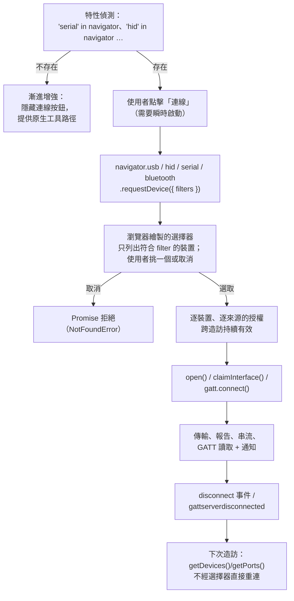

# [FEE-422] WebUSB、WebHID、Web Serial 與 Web Bluetooth — 硬體裝置 API

:::info
四套兄弟 API 讓網頁與實體硬體對話：WebUSB 做原始 USB 傳輸、WebHID 對付說 HID 報告協定的輸入類裝置、Web Serial 服務一切看起來像序列埠的東西（Arduino、3D 印表機、ESP32 開發板）、Web Bluetooth 則透過 GATT 連接 BLE 周邊。它們共享同一套安全模型——安全情境、使用者手勢、由瀏覽器繪製且一次只授權一個裝置的選擇器——也共享同一個政治現實：四者皆由 Chromium 主導，Mozilla 與 Apple 發表了負面立場，理由是指紋追蹤風險、以及「本頁面可能重新編程你的裝置」根本無法在權限提示裡向一般使用者解釋清楚，因此沒有一個是 Baseline。這使它們在定義上就是漸進增強 API：對韌體燒錄器、鍵盤設定器、面向 Chrome 使用者的實驗室工具而言絕佳；作為大眾市場功能的唯一路徑則是錯的。值得一提的是，這道牆在 2026 年出現第一道裂縫——Firefox Nightly 加入了 Web Serial 支援。
:::

## 背景

這些 API 填補的缺口，過去由原生「配套應用程式」填補：鍵盤的重映射工具、印表機的韌體更新器、IDE 的開發板燒錄器——每一個都是一次下載、一個安裝程式、一個驅動程式。Chromium 在 Chrome 56 出貨 Web Bluetooth、Chrome 61 出貨 WebUSB（皆為 2017 年），再於 Chrome 89（2021 年）同時出貨 WebHID 與 Web Serial，其上長出了一整個生態系：瀏覽器裡的 Arduino/MicroPython 工作流、VIA/Vial 鍵盤設定器、Android 刷機工具、POS 與實驗設備儀表板。Mozilla 的標準立場把 WebUSB 與 WebHID 歸類為 harmful，Apple 也以指紋追蹤與安全為由多次拒絕整個家族，所以 MDN 把四者全標為「Limited availability — not Baseline」。2026 年 Web Serial 出現在 Firefox Nightly 是多年來的第一次鬆動，但規劃時仍應假設這是 Chromium 專屬功能。本文涵蓋共享的權限模型、每套 API 的程式碼形狀，以及安全邊界——封鎖清單與受保護類別——實際劃在哪裡。

## 視覺對比



## 範例

**Web Serial** 是四者中最友善的，因為它交給你的是標準串流。從微控制器讀取以換行分隔的 JSON 遙測，就是一個 `TextDecoderStream` 加一個迴圈：

```js
connectButton.addEventListener("click", async () => {
  const port = await navigator.serial.requestPort({
    filters: [{ usbVendorId: 0x2341 }], // 選擇器裡只出現 Arduino 廠商的裝置
  });
  await port.open({ baudRate: 115200 });

  const decoder = new TextDecoderStream();
  port.readable.pipeTo(decoder.writable);
  const reader = decoder.readable
    .pipeThrough(new TransformStream(new LineBreakTransformer()))
    .getReader();

  while (true) {
    const { value, done } = await reader.read();
    if (done) break;
    render(JSON.parse(value));
  }
});

// 寫入是鏡像：
const writer = port.writable.getWriter();
await writer.write(new TextEncoder().encode("LED ON\n"));
writer.releaseLock();
```

**WebHID** 的貨幣是*報告（report）*——裝置透過報告描述符自述的固定格式二進位封包。自訂鍵盤的設定器監聽輸入報告、送出功能/輸出報告：

```js
const [device] = await navigator.hid.requestDevice({
  filters: [{ vendorId: 0x1234, usagePage: 0xff60 }], // 廠商自訂 usage page
});
await device.open();

device.addEventListener("inputreport", ({ device, reportId, data }) => {
  // data 是報告酬載的 DataView（報告 ID 已剝除）
  updateUi(reportId, new Uint8Array(data.buffer));
});

await device.sendReport(0x00, new Uint8Array([SET_KEYMAP, layer, key, code]));
```

**Web Bluetooth** 直接對映 BLE 的 GATT 階層——裝置、服務、特徵——它的選擇器同時兼任掃描器。訂閱心率帶：

```js
const device = await navigator.bluetooth.requestDevice({
  filters: [{ services: ["heart_rate"] }],
  optionalServices: ["battery_service"], // 沒宣告的服務之後永遠拿不到
});
device.addEventListener("gattserverdisconnected", scheduleReconnect);

const server = await device.gatt.connect();
const service = await server.getPrimaryService("heart_rate");
const hrm = await service.getCharacteristic("heart_rate_measurement");

await hrm.startNotifications();
hrm.addEventListener("characteristicvaluechanged", ({ target }) => {
  const flags = target.value.getUint8(0);
  const bpm = flags & 0x1 ? target.value.getUint16(1, true) : target.value.getUint8(1);
  chart.push(bpm);
});
```

**WebUSB** 位於最底層：在 `open()`、`selectConfiguration()`、`claimInterface()` 之後，你透過 `transferIn`/`transferOut`（bulk/interrupt 端點）與 `controlTransfer` 說裝置自己的協定——實質上是用 JavaScript 寫驅動程式。形狀仍是同一套「選擇器然後開啟」的流程；酬載邏輯則完全依裝置而定。

在這四者上，跨造訪的重連都跳過選擇器：`getDevices()`/`getPorts()` 回傳先前已授權的裝置，`connect`/`disconnect` 事件在纜線插拔時讓 UI 保持誠實。

## 最佳實踐

- **必須（MUST）**把四者全部當作漸進增強：特性偵測（`"hid" in navigator`）、能力不存在時隱藏入口，並保留一條有文件的原生工具後備路徑。這些 API 沒有一個是 Baseline，而 Firefox/Safari 的立場意味著短期內不會改變。
- **必須（MUST）**在點擊處理器中呼叫 `requestDevice()`/`requestPort()`——瞬時啟動是硬性要求——並把使用者取消選擇器（`NotFoundError`）設計為正常結果，不是例外路徑。
- **必須（MUST）**傳入能寫多窄就多窄的 filter（`vendorId`/`productId`、HID 的 `usagePage`、BLE 的 `services`）：選擇器只列出符合的裝置，這既是更好的 UX，也減少意外暴露。空 filter 清單把整台機器的裝置全列出來，是一種設計異味。
- **必須（MUST）**在請求當下就於 `filters` 或 `optionalServices` 宣告未來會碰的每一個 BLE 服務——當時漏掉的服務對這次授權永遠不可見。
- **應該（SHOULD）**在載入時用 `getDevices()`/`getPorts()` 重新取得已授權裝置，並訂閱 `connect`/`disconnect`（或 `gattserverdisconnected`），而不是每次造訪都逼使用者重過一次選擇器。
- **應該（SHOULD）**釋放你持有的東西——`port.close()` 前先 `reader.releaseLock()`、用完 `device.close()`、拆卸時 `gatt.disconnect()`——因為被占用的介面或被鎖定的串流會擋住其他所有頁面，常常連 OS 一起擋。
- **應該（SHOULD）**把傳輸迴圈包進真正的錯誤處理：硬體會在傳輸中途被拔掉，而失敗會以協定進行到一半時被拒絕的 promise 現身，不是以整齊的事件。
- **應該（SHOULD）**記住 Windows 的 USB 現實：WebUSB 只能 claim 綁定 WinUSB 驅動的介面；裝了廠商驅動的裝置列舉得出來、claim 不進去。
- **可以（MAY）**把韌體更新流程做在 WebUSB/Web Serial 上（這是它們的殺手級應用——不用安裝、永遠是最新版的燒錄器），也**可以（MAY）**在 Gamepad API 的通用映射不夠用時搭配 WebHID。

## 設計思維

**選擇器就是安全模型。**不同於攝影機/定位權限（「此來源可以使用該能力」），裝置家族授予的是*此來源可以使用這一個裝置*。瀏覽器繪製選單、頁面永遠看不到使用者沒選的裝置、filter 還限制選單列出什麼。這個設計刻意犧牲了探索能力——頁面無法列舉硬體來指紋化一台機器——代價是每個裝置多一次點擊，以及不可能做出「自動連上插著的裝置」的 UX。

**引擎為何分裂。**Chromium 的立場：有了逐裝置同意、封鎖清單與受保護類別，剩餘風險值得用來換掉驅動安裝程式。Mozilla 的立場（對 WebUSB/WebHID 正式定為「harmful」）：頁面把裝置重新編程成攻擊平台的風險——經典示範是把開發板變成會自己打指令的 USB 鍵盤——無法用任何非專家能評估的提示傳達，而 USB 層的識別碼是指紋表面。Apple 附議。雙方都在對同一組事實做正確推理，只是權重不同；工程規劃只需要把「這個分裂是穩定的」計入成本（2026 年 Firefox Nightly 的 Web Serial 實驗不改變此判斷）。

**封鎖清單編碼了威脅模型。**WebUSB 拒絕 claim *受保護介面類別*——HID、大量儲存、智慧卡、音訊/視訊、無線控制器——所以頁面無法透過 USB 鍵盤的介面側錄按鍵、也讀不到隨身碟；WebHID 把系統鍵盤與滑鼠從列舉中剝除；WebHID 與 Web Bluetooth 都把 FIDO/安全金鑰流量列入封鎖清單，讓頁面無法網釣驗證器。讀出這個模式：這些 API 交給你*你的*小裝置，並把每一個「一旦淪陷就打破他人信任邊界」的裝置類別挖掉。

## 深入探討

**HID 報告與 usage page。**HID 裝置透過報告描述符自我描述：*input* 報告從裝置流向主機（`inputreport` 事件）、*output* 報告從主機流向裝置（`sendReport()`）、*feature* 報告雙向搬運設定（`sendFeatureReport()`/`receiveFeatureReport()`）。裝置以 usage page 與 usage 定址——廠商自訂的 `0xFF00`-`0xFFFF` 區段正是設定器協定（例如 QMK 的 Raw HID）居住的地方，這也是 WebHID 的 filter 除了廠商/產品 ID 還接受 `usagePage`/`usage` 的原因。`HIDDevice.collections` 暴露解析後的描述符，讓通用工具能適應未知的報告版面。

**baudRate 之外的序列埠選項。**`port.open()` 接受 `dataBits`（7/8）、`stopBits`（1/2）、`parity`（`"none"`/`"even"`/`"odd"`）、`flowControl`（`"none"`/`"hardware"`）與 `bufferSize`。`readable` 串流在致命錯誤時結束（`done: true`）、在可復原錯誤後產生新的串流物件——所以標準讀取迴圈是*兩層*巢狀：外層 `while (port.readable)`、內層 `reader.read()`、`finally` 裡 `releaseLock()`。

**USB 傳輸類型。**端點有四種——control（設定/組態，經 `controlTransfer`）、bulk（大量可靠傳輸）、interrupt（小而時效敏感的封包）、isochronous（頻寬保證的串流，`isochronousTransferIn/Out`）——而 `claimInterface()` 取得介面端點的獨占所有權，這也是 OS 驅動與網頁永遠無法共享同一裝置的原因。

**BLE 的邊界。**Web Bluetooth 只說 BLE/GATT——沒有 Classic Bluetooth 設定檔（A2DP 音訊、SPP 序列），所以藍牙喇叭在設計上就不在範圍內。特徵酬載很小（受 ATT MTU 限制），`writeValueWithResponse`/`writeValueWithoutResponse` 把可靠性/延遲的取捨明白攤開，標準 16 位元 UUID（`"heart_rate"`）是 Bluetooth SIG 指配號碼的速記，自訂硬體則用完整 128 位元 UUID。行動裝置的電源管理會積極斷線；正式程式碼把 `gattserverdisconnected` 加上指數退避重連當作快樂路徑的一部分。

## API 與支援對照

| | WebUSB | WebHID | Web Serial | Web Bluetooth |
|---|---|---|---|---|
| 抽象層 | 原始 USB 端點 | HID 報告 | 位元組串流 | GATT 服務 |
| 進入點 | `navigator.usb` | `navigator.hid` | `navigator.serial` | `navigator.bluetooth` |
| 典型裝置 | 可燒錄開發板、自訂裝置 | 鍵盤設定器、巨集鍵盤、類遊戲手把 | Arduino/ESP32、3D 印表機、POS 硬體 | 心率帶、感測信標、智慧鎖 |
| 資料基元 | `transferIn/Out`、`controlTransfer` | `sendReport` / `inputreport` | `ReadableStream`/`WritableStream` | `readValue`/`writeValue`/通知 |
| Worker 可用 | 是（dedicated） | 是（dedicated） | 是（dedicated） | 否 |
| Chromium 桌面 | 是（61+） | 是（89+） | 是（89+） | 是（56+） |
| Chromium Android | 是 | 否 | 否 | 是 |
| Firefox | 否——立場：harmful | 否——立場：harmful | Nightly 實驗（2026） | 否 |
| Safari | 否 | 否 | 否 | 否 |
| Baseline | 否 | 否 | 否 | 否 |

幾個值得在設計當下重新查證、而非硬背的支援事實：Android 那一列（HID 與 Serial 僅限桌面）、WebUSB 在 Windows 的 WinUSB 驅動要求，以及仍在演變的 Firefox Serial 實驗。

## 延伸閱讀

- [Geolocation, Device Orientation & Device APIs](/zh-tw/Browser APIs and Web Platform/413)
- [Permissions API](/zh-tw/Browser APIs and Web Platform/415)
- [Fetch, Streams & Network APIs](/zh-tw/Browser APIs and Web Platform/403)
- [Web Workers & Concurrency](/zh-tw/Browser APIs and Web Platform/405)

## 參考資料

- MDN contributors, "WebUSB API," MDN Web Docs (2026). https://developer.mozilla.org/en-US/docs/Web/API/WebUSB_API
- MDN contributors, "WebHID API," MDN Web Docs (2026). https://developer.mozilla.org/en-US/docs/Web/API/WebHID_API
- MDN contributors, "Web Serial API," MDN Web Docs (2026). https://developer.mozilla.org/en-US/docs/Web/API/Web_Serial_API
- MDN contributors, "Web Bluetooth API," MDN Web Docs (2026). https://developer.mozilla.org/en-US/docs/Web/API/Web_Bluetooth_API
- Mozilla, "Mozilla Standards Positions," mozilla.github.io (maintained). https://mozilla.github.io/standards-positions/
- Mozilla contributors, "WebHID (Human Interface Device) API — Issue #459," mozilla/standards-positions, GitHub (2019). https://github.com/mozilla/standards-positions/issues/459
- Chris Coyier, "Apple declined to implement 16 Web APIs in Safari due to privacy concerns," CSS-Tricks (2020). https://css-tricks.com/apple-declined-to-implement-16-web-apis-in-safari-due-to-privacy-concerns/
- Thomas Claburn, "Firefox Nightly adds Web Serial after years of saying no," The Register (2026). https://www.theregister.com/software/2026/04/14/firefox-nightly-adds-web-serial-after-years-of-saying-no/5225521

## 變更紀錄

- **2026-04** — Web Serial 以實驗形式出現在 Firefox Nightly——這個家族多年來第一次非 Chromium 的動靜。
- **2021** — WebHID 與 Web Serial 隨 Chrome 89 出貨。
- **2017** — Web Bluetooth 隨 Chrome 56 出貨；WebUSB 隨 Chrome 61 出貨。
