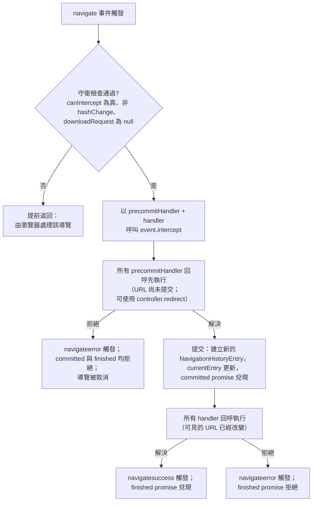

# [FEE-418] Navigation API — 攔截與管理 SPA 導覽

:::info
Navigation API 是 History API 與 `window.location` 的繼任者，專為單頁應用程式（SPA）的需求而設計，並在 2026 年 1 月隨著 Safari 與 Firefox 的支援落地，達到 Baseline Newly Available。SPA 不再需要逐一攔截連結點擊、呼叫 `preventDefault()`、再手動推入狀態，而是註冊單一 `navigation.addEventListener("navigate")` 監聽器，就能看見每一次同源導覽——連結點擊、上一頁/下一頁的歷史遍歷、表單提交與程式化呼叫一視同仁。呼叫 `event.intercept()` 會把導覽轉換為同文件轉場，自動更新 URL 與歷史堆疊，並內建無障礙的焦點管理。這套 API 也透過 `currentEntry`、`entries()` 與 `traverseTo()` 暴露可檢視的歷史視圖，取代 History API 那份不透明、被 iframe 污染的聯合工作階段歷史，改為每個 frame 各自持有、由應用程式實際建立的同源清單。
:::

## 背景

在 Navigation API 之前，SPA 路由意味著監聽連結點擊、呼叫 `preventDefault()`、手動調用 `History.pushState()`，再從 URL 重建視圖——而這套儀式只涵蓋使用者發起的連結點擊，並非導覽可能開始的每一種方式。History API 讓問題雪上加霜：它的 `popstate` 事件在程式化呼叫 `pushState` 或 `replaceState` 時不會觸發，無法偵測所有的導覽觸發類型，也無法讀取或編輯非當前的歷史條目。它還暴露聯合工作階段歷史，包含由 iframe 導覽建立的條目，這對只關心自己 frame 的 SPA 來說相當痛苦。Navigation API 於 Chrome 102 推出（較早的 `transitionWhile()` 設計在 Chrome 105 被 `intercept()` 取代），從 WICG 孵化畢業並納入 WHATWG HTML Standard，並在 2026 年初於所有主要瀏覽器達到 Baseline Newly Available——不過部分功能的支援程度可能仍有差異。

## 視覺對比



## 範例

一個最小化的 SPA 路由器只需一個監聽器。三項守衛檢查放在最前面：跨源目的地與跨文件遍歷時 `canIntercept` 為 false，`hashChange` 標記無需路由處理的頁內片段跳轉，而非 null 的 `downloadRequest` 表示使用者點擊了下載連結。

```js
navigation.addEventListener("navigate", (event) => {
  if (!event.canIntercept) return;             // 跨源或跨文件遍歷
  if (event.hashChange) return;                 // 片段導覽，無需變更視圖
  if (event.downloadRequest !== null) return;   // 下載連結，交給瀏覽器處理

  const url = new URL(event.destination.url);

  // POST 表單提交會透過 event.formData 進入同一個監聽器。
  if (event.formData) {
    event.intercept({
      async handler() {
        const response = await fetch("/api/subscribe", {
          method: "POST",
          body: event.formData,
          signal: event.signal, // 使用者停止或導覽至他處時即中止
        });
        renderSubscribeResult(await response.json());
      },
    });
    return;
  }

  event.intercept({
    async handler() {
      // 在 currentEntry 更新後執行：可見的 URL 已顯示 url。
      const response = await fetch(`/api/content${url.pathname}`, {
        signal: event.signal,
      });
      renderView(await response.json());
    },
    focusReset: "after-transition", // 預設：聚焦 [autofocus] 元素，否則 <body>
    scroll: "after-transition",     // 預設：捲動至片段或還原位置
  });
});
```

`event.signal` 是一個 `AbortSignal`，在導覽被取消時進入中止狀態——使用者按下停止鍵或發起另一次導覽——因此把它傳給 `fetch()`，就能在導覽被搶佔時取消進行中的請求。

對於必須在網址列改變*之前*做出決定的路由守衛，`precommitHandler` 會在 `currentEntry` 更新前執行，並接收一個 `NavigationPrecommitController`，其 `redirect()` 方法可以把導覽完全轉向別處：

```js
navigation.addEventListener("navigate", (event) => {
  if (!event.canIntercept || event.hashChange || event.downloadRequest !== null) return;

  const url = new URL(event.destination.url);
  if (!url.pathname.startsWith("/account/")) return;

  // 在 event.cancelable 為 false 時傳入 precommitHandler 會擲出 SecurityError。
  if (!event.cancelable) return;

  event.intercept({
    async precommitHandler(controller) {
      const session = await fetch("/api/session", { signal: event.signal });
      if (!(await session.json()).authenticated) {
        controller.redirect("/signin/", { state: "signin-redirect", history: "push" });
      }
    },
    async handler() {
      renderAccountPage();
    },
  });
});
```

程式化導覽與歷史狀態補齊了路由器的最後一塊。每個導覽方法都回傳一對 promise，而逐條目的狀態取代了 `history.state`：

```js
// committed 在可見的 URL 改變且條目建立時兌現；
// finished 在每個 intercept() handler 的 promise 都兌現時兌現。
const { committed, finished } = navigation.navigate("/articles", {
  state: { section: "featured" },
});
await committed;
await finished;

// 不導覽即更新狀態——例如記住展開的 <details> 元素。
// 會觸發 currententrychange 事件。
navigation.updateCurrentEntry({
  state: { ...navigation.currentEntry.getState(), detailsOpen: true },
});

// entries() 是此 frame 同源歷史的快照；
// 每個條目的 key 可餵給 traverseTo()。
const firstEntry = navigation.entries()[0];
await navigation.traverseTo(firstEntry.key).finished;
```

有一項注意事項左右了應用程式的啟動流程：規範不會在頁面首次載入時觸發 `navigate` 事件，因此客戶端渲染的應用需要一條獨立的初始化路徑，直接渲染初始路由。

## 最佳實踐

- **MUST** 在呼叫 `intercept()` 之前以三項檢查守衛每個監聽器——`canIntercept` 為 false、`hashChange` 為 true、或 `downloadRequest` 非 null 時跳過。在 `canIntercept` 為 false 時呼叫 `intercept()` 會擲出 `SecurityError` DOMException。
- **MUST** 在傳入 `precommitHandler` 之前確認 `event.cancelable`；在不可取消的事件上這麼做會擲出 `SecurityError` DOMException。
- **MUST** 把 `event.signal` 傳給 handler 內發出的每個 `fetch()`，讓被搶佔的導覽能取消其進行中的請求，而不是與下一個視圖競速。
- **MUST** 為首次頁面載入提供獨立的初始化路徑，因為它不會觸發任何 `navigate` 事件。
- **SHOULD** 在 `precommitHandler` 而非 `handler` 中執行重新導向（登入牆、URL 正規化）——pre-commit 階段在 URL 提交前執行，且其 controller 支援 `redirect()`，而 `handler` 執行時可見的 URL 已經改變。
- **SHOULD** 透過 `event.formData` 在同一個 `navigate` 監聽器中處理 POST 表單提交，而非另闢一條平行的 submit 監聽器程式碼路徑。
- **SHOULD** 對不經導覽即變化的 UI 狀態（例如展開的 `<details>` 元素）使用 `navigation.updateCurrentEntry({ state })`，並以 `getState()` 讀回；該呼叫會觸發 `currententrychange`。
- **SHOULD** 在返回歷史中已知位置時，搭配 `traverseTo()` 使用條目的 `key`（在替換後仍保持穩定），而非其 `id`（每個條目狀態都會重新產生）。
- **MAY** 設定 `focusReset: "manual"` 或 `scroll: "manual"` 以接管瀏覽器預設的焦點與捲動行為，也 **MAY** 在 handler 內呼叫 `event.scroll()` 提早觸發瀏覽器驅動的捲動——例如主要內容渲染完成就先捲動，再繼續載入次要內容。
- **MAY** 透過 `info` 選項在發起呼叫與監聽器之間傳遞暫時性資料，於監聽器內以 `event.info` 取得。

## 設計思維

兩階段 handler 的設計是在 URL 樂觀性與守衛正確性之間權衡。post-commit 的 `handler` 讓使用者立即看到更新後的網址列——即使內容仍在載入，導覽*感覺*是即時的——但當它執行時，目的地已經以 `currentEntry` 的身分提交，因此它並不是決定導覽是否應該發生的正確位置。`precommitHandler` 反轉了這項權衡：它可以在任何東西變得可見之前修改、取消或重新導向，代價是把提交延後到其 promise 解決為止。若它拒絕，`navigateerror` 觸發，`committed` 與 `finished` 兩個 promise 均拒絕，導覽被乾淨地取消。

這套 API 的限制本身就是一種設計立場：網站不應該有能力困住使用者。當使用者按下瀏覽器的上一頁或下一頁按鈕時，你無法透過 `preventDefault()` 取消導覽；跨文件遍歷基於效能考量不可取消；歷史清單也無法被程式化修改或重排。History API 把聯合工作階段歷史整份交給應用程式——包括它們從未建立的 iframe 條目——Navigation API 則刻意把視圖限縮在當前瀏覽情境中建立、且與當前頁面同源的歷史條目，只在單一 frame 內運作。權力較小，卻是 SPA 真正能推理的模型。

## 深入探討

每個導覽方法——`navigate()`、`reload()`、`back()`、`forward()`、`traverseTo(key)`——都回傳 `{ committed, finished }`。`committed` 在可見的 URL 改變且新的 `NavigationHistoryEntry` 建立時兌現；`finished` 在所有 `intercept()` handler 回傳的 promise 都兌現時兌現，等價於 `navigatesuccess` 的觸發。`Navigation` 物件總共觸發四種事件：`navigate`、`navigatesuccess`、`navigateerror` 與 `currententrychange`。當多個 `intercept()` 呼叫註冊在同一事件上時，所有 `precommitHandler` 回呼先執行，接著才是所有 `handler` 回呼——pre-commit 階段兌現後導覽即提交（建立新條目、`committed` 兌現），然後 post-commit 階段才執行。`NavigationPrecommitController` 還暴露 `addHandler()`，可在 pre-commit 階段內註冊額外的 post-commit handler。

`NavigateEvent` 承載完整的決策面：`canIntercept`、`destination`（一個 `NavigationDestination`）、`downloadRequest`、`formData`、`hashChange`、`hasUAVisualTransition`、`info`、`navigationType`（`"push"`、`"reload"`、`"replace"` 或 `"traverse"`）、`signal`、`sourceElement`（發起導覽的元素，例如被點擊的連結）與 `userInitiated`。除了 `SecurityError` 之外，若當前文件尚未進入活躍狀態或導覽已被取消，`intercept()` 會擲出 `InvalidStateError` DOMException；方法本身回傳 `undefined`。若事件是透過 `dispatchEvent()` 合成派發而非由使用者代理派發，也會擲出 `SecurityError`。

在歷史這一側，每個 `NavigationHistoryEntry` 區分 `id`——由使用者代理為該特定條目狀態產生的 UUID——與 `key`，一個在替換後仍保持穩定的 UUID，此外還暴露 `index`、`sameDocument`、`url`、`getState()`（所儲存狀態的副本，初始為 `undefined`），以及條目從歷史中移除時觸發的 `dispose` 事件。`Navigation` 介面本身則暴露 `currentEntry`、`transition`（導覽進行中時為 `NavigationTransition`，否則為 null）、`activation`（描述最近一次跨文件導覽的 `NavigationActivation`）、`canGoBack` 與 `canGoForward`。這套 API 也與 `document.startViewTransition()` 整合，支援帶動畫的視圖轉場。

## 守衛條件與已知限制

幾乎所有會更新 `navigation.currentEntry` 的導覽都會觸發 `navigate` 事件——包括透過 `location.href` 的程式化導覽、表單提交與上一頁/下一頁遍歷——但仍有一組特定情況落在這套 API 的能力範圍之外。發布路由器時應假定以下邊界：

| 情況 | 行為 |
|---|---|
| 首次頁面載入 | 不觸發 `navigate` 事件；應用需要獨立的初始化路徑 |
| 從瀏覽器 UI 發起的跨文件導覽（網址列、書籤、重新整理按鈕） | 不觸發 `navigate` 事件 |
| 由跨源視窗發起的導覽，或透過 `document.open()` | 不觸發 `navigate` 事件 |
| 目的地在 scheme、username、password、host 或 port 上不同 | `canIntercept` 為 false |
| 跨文件的上一頁/下一頁遍歷 | `canIntercept` 為 false；基於效能考量不可取消 |
| 使用者按下瀏覽器的上一頁/下一頁 | 無法透過 `preventDefault()` 取消——網站不得困住使用者 |
| 來自內嵌 iframe 或跨源頁面的歷史條目 | 不會暴露；此 API 只看見當前瀏覽情境中建立的同源條目，一次一個 frame |
| 重排或編輯歷史清單 | 不可能；此 API 無法程式化修改歷史清單 |
| 對 hash 變更或下載呼叫 `intercept()` | 以 `hashChange` 與 `downloadRequest` 守衛——這些導覽通常應直接放行 |

每個 `window` 物件都有自己的 `navigation` 實例（此 API 透過 `Window.navigation` 屬性存取），因此 iframe 的路由器與頂層 frame 的路由器永遠觀察不到彼此的導覽。另請注意，Baseline Newly Available 狀態附帶 MDN 的但書：這套 API 的部分功能在各實作間的支援程度可能有所差異。

## 延伸閱讀

- [Events & Event Delegation](/zh-tw/Browser APIs and Web Platform/402)
- [Fetch, Streams & Network APIs](/zh-tw/Browser APIs and Web Platform/403)
- [URL State & Routing](/zh-tw/State Management/606)
- [View Transitions — Level 1](/zh-tw/Web Platform Proposals/CSS Experimental/11103)

## 參考資料

- MDN contributors, "Navigation API," MDN Web Docs (2026). https://developer.mozilla.org/en-US/docs/Web/API/Navigation_API
- web.dev team, "The Navigation API is now Baseline Newly available," web.dev (2026). https://web.dev/blog/baseline-navigation-api
- MDN contributors, "NavigateEvent: intercept() method," MDN Web Docs (2026). https://developer.mozilla.org/en-US/docs/Web/API/NavigateEvent/intercept
- MDN contributors, "NavigateEvent," MDN Web Docs (2026). https://developer.mozilla.org/en-US/docs/Web/API/NavigateEvent
- MDN contributors, "Navigation," MDN Web Docs (2026). https://developer.mozilla.org/en-US/docs/Web/API/Navigation
- WICG, "Navigation API (explainer)," GitHub / WICG (2023). https://github.com/WICG/navigation-api
- Jake Archibald, "Modern client-side routing: the Navigation API," Chrome for Developers (2022). https://developer.chrome.com/docs/web-platform/navigation-api

## 變更紀錄

- **2026-01** — Baseline Newly Available：Safari 與 Firefox 的支援落地，與 Chrome 一同涵蓋所有主要瀏覽器。
- **規範遷移** — 此 API 從 WICG 孵化畢業，現於 WHATWG HTML Standard 中發展。
- **Chrome 105** — `navigateEvent.transitionWhile(promise)` 被 `navigateEvent.intercept({ handler })` 取代（相對於最初出貨設計的破壞性變更）。
- **Chrome 102** — Navigation API 首次推出。
