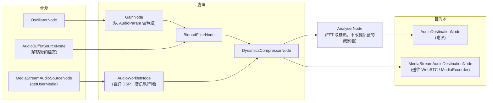

# [FEE-420] Web Audio API — 瀏覽器的音訊圖

:::info
播放一個音檔是 `<audio>` 的工作。Web Audio API 則是一套模組化的合成與處理引擎：音源、效果、分析器與輸出目的地都是 `AudioNode`，在 `AudioContext` 裡接成一張音訊路由圖（audio routing graph），所有處理都在專用的即時音訊執行緒上以取樣精度執行。這套 API 自 2021 年 4 月起在所有引擎可用（2023 年底起為 Baseline Widely Available），是瀏覽器遊戲、DAW（digital audio workstation，數位音訊工作站）、帶音量表與噪音閘門的會議產品、以及資料聲音化的基礎。正式環境裡咬人的是三件事：讓 context 以暫停狀態啟動的自動播放政策、雙時鐘的排程問題，以及如何在不超出約 2.7 ms 預算的前提下於 `AudioWorklet` 裡寫自訂 DSP（digital signal processing，數位訊號處理）。
:::

## 背景

Web Audio API 誕生於 Flash 之死與 `<audio>` 的力不從心：元素能播放、暫停、跳轉，卻無法以取樣精度混合二十個重疊音效、讓低通濾波器跟著躲到牆後的遊戲角色走、或從零合成一個音色。這份規範（主要由 Google 設計、2011 年在 Chrome 推出、2021 年 6 月以 1.0 版成為 W3C Recommendation，1.1 修訂進行中）選擇了向模組化合成器與 CoreAudio 這類音訊框架借來的圖模型，而不是回呼模型。原生節點（`GainNode`、`BiquadFilterNode`、`ConvolverNode`、`DynamicsCompressorNode`、`PannerNode` 等）以最佳化的 C++ 在音訊渲染執行緒上執行。已棄用的主執行緒逃生口 `ScriptProcessorNode` 被 `AudioWorklet` 取代，後者讓開發者的 JavaScript（或 WebAssembly）跑在同一條即時執行緒上。

## 視覺對比



## 範例

一切從 context 開始，而因為自動播放政策，context 只有在使用者手勢之後才可靠可用：

```js
const ctx = new AudioContext({ latencyHint: "interactive" });

playButton.addEventListener("click", async () => {
  // 沒有先前的使用者互動，context 會以暫停狀態啟動（或被暫停）。
  if (ctx.state === "suspended") await ctx.resume();
  startEngine();
});
```

一顆合成音符展示了讓這套 API 具有音樂性的兩個核心概念：節點是便宜、用完即丟的一次性物件；`AudioParam` 是被排程的，不是被賦值的。直接跳動 `gain.value` 會產生可聽見的爆音；斜坡（ramp）才是避免它的方法：

```js
function playNote(freq, at = ctx.currentTime) {
  const osc = new OscillatorNode(ctx, { type: "sawtooth", frequency: freq });
  const amp = new GainNode(ctx, { gain: 0 });

  // 類 ADSR（attack-decay-sustain-release）包絡，
  // 以取樣精度排程在音訊時鐘上。
  amp.gain.setValueAtTime(0, at);
  amp.gain.linearRampToValueAtTime(0.8, at + 0.02);           // attack
  amp.gain.setTargetAtTime(0.0001, at + 0.25, 0.08);          // release（指數衰減）

  osc.connect(amp).connect(ctx.destination);
  osc.start(at);
  osc.stop(at + 1);
  osc.onended = () => { osc.disconnect(); amp.disconnect(); }; // 讓 GC 回收
}
```

播放解碼後的素材是同一套形狀：抓取、解碼一次，然後每次播放另建一個新的 `AudioBufferSourceNode`（來源節點只能 start 一次）：

```js
const buffer = await ctx.decodeAudioData(
  await (await fetch("/sfx/hit.wav")).arrayBuffer(),
);
function playHit() {
  const src = new AudioBufferSourceNode(ctx, { buffer });
  src.connect(ctx.destination);
  src.start();
}
```

自訂 DSP 住在 `AudioWorkletProcessor` 裡，一個跑在音訊渲染執行緒上的類別，以渲染量子（render quantum）為單位收到音訊（目前每次呼叫 128 frames；請讀陣列長度，不要寫死）：

```js
// noise-gate-processor.js —— 載入 AudioWorkletGlobalScope
class NoiseGateProcessor extends AudioWorkletProcessor {
  static get parameterDescriptors() {
    return [{ name: "threshold", defaultValue: 0.01, automationRate: "k-rate" }];
  }
  process(inputs, outputs, parameters) {
    const input = inputs[0], output = outputs[0];
    const threshold = parameters.threshold[0];
    for (let ch = 0; ch < input.length; ch++) {
      const inCh = input[ch], outCh = output[ch];
      for (let i = 0; i < inCh.length; i++) {
        outCh[i] = Math.abs(inCh[i]) < threshold ? 0 : inCh[i];
      }
    }
    return true; // 讓 processor 保持存活
  }
}
registerProcessor("noise-gate", NoiseGateProcessor);
```

```js
// 主執行緒：模組載入一次，之後像任何節點一樣實例化。
await ctx.audioWorklet.addModule("noise-gate-processor.js");
const mic = ctx.createMediaStreamSource(
  await navigator.mediaDevices.getUserMedia({ audio: true }),
);
const gate = new AudioWorkletNode(ctx, "noise-gate");
mic.connect(gate).connect(ctx.destination);
gate.parameters.get("threshold").setValueAtTime(0.02, ctx.currentTime);
```

最後這段請戴耳機執行：把現場麥克風直接接到喇叭會產生回授嘯叫。

## 最佳實踐

- **必須（MUST）**從使用者手勢中建立或 `resume()` `AudioContext`，並處理 `"suspended"` 狀態；自動播放政策採用黏性啟動（sticky activation）。在有支援的環境（截至 2026 年僅 Firefox），`navigator.getAutoplayPolicy("audiocontext")` 能事先回報 `"allowed"` 或 `"disallowed"`。
- **必須（MUST）**用 `AudioWorklet` 寫自訂 DSP。`ScriptProcessorNode` 已棄用、跑在主執行緒上，會把每一次卡頓都變成聽得見的破音。
- **必須（MUST）**讓 `process()` 完全不配置記憶體：不建立物件、不建立閉包、不逐量子 `postMessage`。音訊執行緒上的一次垃圾回收暫停就是一次斷音；在 48 kHz 下，128 frames 的預算大約是 2.7 ms。
- **必須（MUST）**把音樂時間排程在音訊時鐘上（`ctx.currentTime` 加上 `AudioParam` 自動化與 `start(when)`），絕不能只靠 `setTimeout`/`Date.now()`；主執行緒時鐘在負載下會抖動數十毫秒。
- **應該（SHOULD）**每頁使用單一 `AudioContext`，閒置時 `suspend()`；context 持有 OS 音訊資源，部分瀏覽器（尤其 iOS Safari）也限制能同時存在的數量。
- **應該（SHOULD）**對每一次使用者聽得到的參數變化使用斜坡（`linearRampToValueAtTime`、`setTargetAtTime`）而不是直接賦值 `param.value`；瞬間跳變會產生爆音與拉鍊噪音（連續小幅跳變造成的階梯狀失真）。
- **應該（SHOULD）**用 `OfflineAudioContext` 執行非即時工作（混音輸出、匯出、波形預計算），它會以快於即時的速度把同一張圖渲染進 `AudioBuffer`。
- **應該（SHOULD）**讓視覺化從 `AnalyserNode` 取資料（每個動畫影格呼叫 `getByteFrequencyData` / `getFloatTimeDomainData`），而不是透過 worklet 去撈取樣。
- **可以（MAY）**為非互動媒體傳入 `latencyHint: "playback"`，讓瀏覽器更積極緩衝以省電；也**可以（MAY）**在建構時要求特定 `sampleRate`。
- **可以（MAY）**透過 `MediaStreamAudioDestinationNode` 把圖橋接到平台其他部分；產出的 `MediaStream` 可以接進 `RTCPeerConnection` 或 `MediaRecorder`。

## 設計思維

**是圖，不是回呼。**Web Audio API 大可只提供一個「給我一個 buffer 回呼」的掛勾；多數作業系統的音訊 API 就是這樣，`ScriptProcessorNode` 也試過。圖模型的代價是學習曲線與部分彈性，但它換來的是瀏覽器有權把整條原生節點管線移出主執行緒、加以融合與最佳化，即使頁面卡頓也讓音訊不破音。這個設計的賭注：多數應用能用現成節點組合出來，其餘的則在引擎的條件下（固定量子、即時約束）拿到 `AudioWorklet`，而不是在主執行緒的條件下。

**兩個時鐘，一道接縫。**`ctx.currentTime` 沿著音訊硬體時鐘前進；`performance.now()` 與 `setTimeout` 活在主執行緒上。API 的答案是 Chris Wilson 的 lookahead 模式：一個不精確的主執行緒計時器每約 25 ms 醒來一次，把接下來約 100 ms 窗口內必須發生的所有事件，排程到精確的音訊時鐘上。主執行緒保有控制權（速度變化、使用者輸入），音訊執行緒以取樣精度執行；主執行緒被卡住時只會延遲*新的*排程，不會破壞已排入佇列的部分。

**參數即訊號。**`AudioParam` 是一條時間軸，不只是一個數字，甚至可以由另一個節點的輸出驅動：把 LFO（low-frequency oscillator，低頻振盪器）接進 `gain.gain` 就得到顫音。這個單一決策（參數是音訊速率的輸入）讓這套 API 成為合成器而不只是混音器，代價則是 `value` 屬性成了整套 API 最容易誤用的陷阱。

## 深入探討

**渲染迴圈。**音訊執行緒每個渲染量子拉動整張圖一次：1.0 規範是 128 frames（1.1 草案讓量子可設定）。在 48 kHz 下，每個 worklet 節點約每 2.67 ms 收到一次 `process()` 呼叫。量子之內，原生節點依拓撲順序處理；循環只有經過 `DelayNode` 才合法。`AudioParam` 自動化區分 `a-rate` 參數（逐取樣求值；參數陣列每 frame 一個值）與 `k-rate`（每量子一個值）。worklet 作者在 `parameterDescriptors` 宣告速率，且必須同時處理兩種陣列形狀，因為沒有排程變化的 a-rate 陣列會以長度 1 送達。

**Worklet 生命週期與訊息。**`process()` 回傳 `true` 會把 processor 釘在存活狀態；回傳 `false` 則允許引擎在它不再產生或接收音訊後回收。（Chrome 目前尚未正確遵循回傳值語意，MDN 建議一律回傳 `true` 以確保跨瀏覽器行為一致。）每一對 `AudioWorkletNode`/`AudioWorkletProcessor` 共享一個 `MessagePort`：控制訊息可以，音訊資料不行。在 Worker 與音訊執行緒之間串流取樣的既定模式是 `SharedArrayBuffer` 環形緩衝區搭配 `Atomics` 協調，這也是把既有 C/C++ DSP 編譯成 WebAssembly 後在 worklet 裡執行的橋樑。

**解碼與記憶體。**`decodeAudioData()` 會把壓縮音訊展開成 32 位元浮點 PCM：一首 3 分鐘、48 kHz 的立體聲 MP3 會變成約 69 MB 的 `AudioBuffer`（48,000 取樣 × 2 聲道 × 4 位元組 × 180 秒）。解碼一次並在多個來源節點間共享 buffer，長篇素材改用 `MediaElementAudioSourceNode` 串流，並把 `AudioBuffer` 視為任何取樣型應用的主要記憶體成本。

**狀態機。**context 有 `"suspended"`、`"running"`、`"closed"` 三種狀態；涵蓋電話等 OS 層搶占的 `"interrupted"` 狀態存在於編輯者草案，但尚未進入已發布的規範。每次轉換都會觸發 `statechange`。`suspend()` 會釋放音訊硬體但不拆圖：對只有偶爾出聲的應用而言，這是正確的閒置行為。

## 排程速查

`AudioParam` 的自動化方法就是雙時鐘模式的詞彙；全部接受 context 時鐘上以秒為單位的絕對時間。

| 方法 | 行為 | 典型用途 |
|---|---|---|
| `setValueAtTime(v, t)` | 在 `t` 瞬間跳到定值 | 固定斜坡的起點 |
| `linearRampToValueAtTime(v, t)` | 從前一事件線性滑動到 `t` | Attack 包絡、交叉淡入淡出 |
| `exponentialRampToValueAtTime(v, t)` | 指數滑動（值必須非零且同號） | 聽感平滑的音量/音高 |
| `setTargetAtTime(v, t, timeConstant)` | 自 `t` 起漸近逼近目標值 | Release、平滑化即時控制以避免爆音 |
| `setValueCurveAtTime(curve, t, dur)` | 跟隨任意 `Float32Array` 曲線 | 自訂淡出、閃避（ducking）形狀 |
| `cancelScheduledValues(t)` | 丟棄 `t` 之後（含）的自動化 | 速度變更時重新排程 |
| `cancelAndHoldAtTime(t)` | 取消但凍結在進行中的值（Firefox 不支援） | 中斷斜坡而不產生跳變 |

驅動它們的 lookahead 排程器：

```js
const LOOKAHEAD_MS = 25;     // 主執行緒多久醒來一次
const HORIZON_S = 0.1;       // 在音訊時鐘上往前排多遠
const tempo = 120;
let nextNoteTime = 0;

function startScheduler() {
  nextNoteTime = ctx.currentTime; // 絕不要在運轉中的時鐘上從 t=0 排起
  scheduler();
}

function scheduler() {
  while (nextNoteTime < ctx.currentTime + HORIZON_S) {
    playNote(440, nextNoteTime);          // 以取樣精度排程
    nextNoteTime += 60 / tempo / 4;       // 十六分音符
  }
  setTimeout(scheduler, LOOKAHEAD_MS);    // 這裡的抖動無害
}
```

把 `HORIZON_S` 縮向零會提升對速度與輸入變化的反應，但在主執行緒卡住時有斷音風險；放大則讓播放牢不可破卻控制遲鈍。25 ms/100 ms 是經典起點，而這也正是 Tone.js 以其 `Transport` 打包好的同一套模式，不想自己維護排程器時可以直接採用。

## 延伸閱讀

- [WebRTC — 點對點媒體與資料通道](/zh-tw/Browser APIs and Web Platform/webrtc)
- [Web Workers & Concurrency](/zh-tw/Browser APIs and Web Platform/405)
- [WebGL & WebGPU](/zh-tw/Browser APIs and Web Platform/408)
- [requestAnimationFrame & Animation Timing](/zh-tw/Browser APIs and Web Platform/412)
- [Web Speech API](/zh-tw/Browser APIs and Web Platform/416)

## 參考資料

- MDN contributors, "Web Audio API," MDN Web Docs (2026). https://developer.mozilla.org/en-US/docs/Web/API/Web_Audio_API
- MDN contributors, "Background audio processing using AudioWorklet," MDN Web Docs (2026). https://developer.mozilla.org/en-US/docs/Web/API/Web_Audio_API/Using_AudioWorklet
- MDN contributors, "Web Audio API best practices," MDN Web Docs (2026). https://developer.mozilla.org/en-US/docs/Web/API/Web_Audio_API/Best_practices
- MDN contributors, "Autoplay guide for media and Web Audio APIs," MDN Web Docs (2026). https://developer.mozilla.org/en-US/docs/Web/Media/Guides/Autoplay
- W3C, "Web Audio API 1.1," W3C Working Draft (2026). https://www.w3.org/TR/webaudio-1.1/
- W3C, "Web Audio API," W3C Recommendation (2021). https://www.w3.org/TR/webaudio-1.0/
- Chris Wilson, "A tale of two clocks," web.dev (2013, maintained). https://web.dev/articles/audio-scheduling
- Hongchan Choi, "Audio Worklet design patterns," Chrome for Developers (2018). https://developer.chrome.com/blog/audio-worklet-design-pattern/
