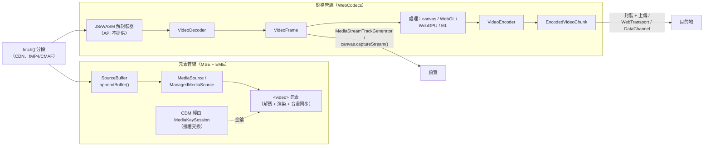

# [FEE-421] WebCodecs、MSE 與 EME — 瀏覽器媒體管線

:::info
在「設好 `video.src` 然後祈禱」與「自己造一個播放器」之間，有三套 API 劃分了整個空間：Media Source Extensions（MSE）讓 JavaScript 逐段餵資料給 `<video>` 元素——這是網路上每一個 DASH/HLS 自適應位元率播放器背後的機制；Encrypted Media Extensions（EME）在同一個元素上加入授權交換，讓它能透過 Content Decryption Module 播放 DRM 保護內容；WebCodecs 則潛到兩者之下，逐影格暴露瀏覽器的硬體編解碼器，服務編輯器、轉檔器與低延遲串流。MSE 與 EME 已是多年的 Baseline。WebCodecs 於 2021 年在 Chrome 出貨，之後陸續落地 Firefox 與 Safari，但尚未達到 Baseline，編解碼器覆蓋度仍因瀏覽器而異——而在 iPhone 上，傳統 MSE 從未出貨，由 Safari 主導的 `ManagedMediaSource` 是唯一入口。選對層、認得這些邊緣，就是這個領域大部分的工作。
:::

## 背景

`<video>` 元素讓播放變得宣告式，卻也是鐵板一塊：一個 URL、瀏覽器控制的緩衝、無法中途切換畫質、無法保護內容。Flash 與 Silverlight 填補這個缺口，直到 MSE（2016 年 W3C Recommendation）把自適應串流搬進 JavaScript、EME（2017 年 W3C Recommendation，2019 年起 Baseline）標準化了 DRM 交握——這些決策直接源自 Netflix、YouTube 與 2010 年代中期的外掛淘汰潮。仍然封閉的是編解碼器本身：想碰解碼後的像素，就得把影片畫到 canvas 上再付出代價；想編碼，就得載一份 WebAssembly 版 FFmpeg，用 CPU 燒掉裝置媒體晶片本可免費完成的工作。WebCodecs（2021 年，W3C Working Draft）以一層刻意薄的抽象打開了最後這個盒子。三者合起來構成一條接縫分明的管線；本文描繪這些接縫、每一層的程式碼，以及相容性斷崖——最顯眼的是 iPhone 的 `ManagedMediaSource` 要求。

## 視覺對比



## 範例

**MSE** 把一條自行構築的時間軸交給 `<video>` 元素。最先絆倒初次實作者的兩條規則：append 是非同步的、必須靠 `updateend` 序列化；容器必須是 fragmented MP4（或 WebM）——`moov` atom 在檔尾的漸進式 MP4 播不出來：

```js
const video = document.querySelector("video");
const MediaSourceCtor = self.ManagedMediaSource ?? self.MediaSource; // iPhone：只有 MMS
const ms = new MediaSourceCtor();
video.src = URL.createObjectURL(ms);

ms.addEventListener("sourceopen", async () => {
  const mime = 'video/mp4; codecs="avc1.64001f, mp4a.40.2"';
  if (!MediaSourceCtor.isTypeSupported(mime)) throw new Error("unsupported");
  const sb = ms.addSourceBuffer(mime);

  const queue = [];
  const pump = () => {
    if (!sb.updating && queue.length) sb.appendBuffer(queue.shift());
  };
  sb.addEventListener("updateend", pump);

  for (const url of ["/seg/init.mp4", "/seg/1.m4s", "/seg/2.m4s"]) {
    queue.push(await (await fetch(url)).arrayBuffer());
    pump(); // 序列化：在 updating 期間 appendBuffer 會拋出 InvalidStateError
  }
});
```

**EME** 把金鑰掛上同一個元素。流程在每個 keysystem 上都是對稱的——只有 keysystem 字串與授權伺服器不同：

```js
const access = await navigator.requestMediaKeySystemAccess("com.widevine.alpha", [{
  initDataTypes: ["cenc"],
  videoCapabilities: [{ contentType: 'video/mp4; codecs="avc1.64001f"',
                        robustness: "SW_SECURE_CRYPTO" }],
}]);
const mediaKeys = await access.createMediaKeys();
await video.setMediaKeys(mediaKeys);

video.addEventListener("encrypted", async ({ initDataType, initData }) => {
  const session = mediaKeys.createSession();
  session.addEventListener("message", async ({ message }) => {
    const license = await fetch("/license", { method: "POST", body: message });
    await session.update(await license.arrayBuffer()); // CDM 安裝金鑰
  });
  await session.generateRequest(initDataType, initData);
});
```

**WebCodecs** 完全跳過元素。解碼器就是一條帶兩個回呼的佇列；餵它解封裝後的 `EncodedVideoChunk`，再把它吐出的 `VideoFrame` 畫出來——而且每一個影格都要 close，因為影格包的是 GPU/解碼器記憶體，垃圾回收救不了你：

```js
const decoder = new VideoDecoder({
  output: (frame) => {
    ctx.drawImage(frame, 0, 0, canvas.width, canvas.height);
    frame.close(); // 不是可選項：影格池耗盡時解碼器會停擺
  },
  error: (e) => console.error(e),
});

const config = { codec: "avc1.64001f", codedWidth: 1920, codedHeight: 1080 };
const { supported } = await VideoDecoder.isConfigSupported(config);
if (!supported) throw new Error("pick another codec");
decoder.configure(config);

for (const sample of demuxedSamples) {        // 解封裝是你的工作（例如 mp4box.js）
  decoder.decode(new EncodedVideoChunk({
    type: sample.isKeyframe ? "key" : "delta",
    timestamp: sample.timestampMicros,
    data: sample.bytes,
  }));
}
await decoder.flush(); // 最後一次性排空——不是逐影格
```

編碼是它的鏡像：`VideoFrame` 進（來自 canvas、相機軌道或解碼器輸出）、`EncodedVideoChunk` 出，以 `encodeQueueSize` 作為背壓訊號。

## 最佳實踐

- **必須（MUST）**在消費完的當下對每個 `VideoFrame`/`AudioData` 呼叫 `frame.close()`。這些物件持有 JS heap 之外的硬體記憶體；洩漏它們會在 GC 察覺任何異狀之前就讓解碼器停擺。
- **必須（MUST）**使用完整指定的編解碼器字串（`"avc1.64001f"`、`"vp09.00.40.08"`、`"av01.0.04M.08"`），並在 configure 前檢查 `isConfigSupported()`/`isTypeSupported()`——支援度真的因瀏覽器、OS 與硬體而異。
- **必須（MUST）**把 `appendBuffer()` 序列化在 `updateend` 之後；`sb.updating` 為 true 時 append 會拋出 `InvalidStateError`。
- **必須（MUST）**餵給 MSE fragmented 容器（fMP4/CMAF 或 WebM），init segment 先行；漸進式 MP4 要在打包階段重新分段。
- **必須（MUST）**用 `ManagedMediaSource`（以一般 `MediaSource` 為後備）觸及 iPhone：傳統 MSE 在 iPhone Safari 從未可用，iOS 17.1 出貨的 MMS 是那裡唯一的入口。
- **應該（SHOULD）**把媒體管線放進 Worker：WebCodecs 在 dedicated worker 完整可用，MSE-in-Workers（把 `MediaSource.handle` 傳給元素的 `srcObject`）能讓 append 遠離繁忙的主執行緒。
- **應該（SHOULD）**在 `appendBuffer()` 拋出 `QuotaExceededError` 時用 `sourceBuffer.remove()` 移除已播放範圍——緩衝配額在裝置之間差異極大；使用 `ManagedMediaSource` 時還要監聽 `bufferedchange` 逐出事件。
- **應該（SHOULD）**以 `encodeQueueSize`/`decodeQueueSize`（與 `dequeue` 事件）觀測背壓，而不是把整個檔案一次塞進編解碼器。
- **應該（SHOULD）**只請求業務實際需要的最低 EME robustness 等級；更高等級（硬體保護路徑）會縮小裝置覆蓋，還可能觸發額外的權限 UX。
- **可以（MAY）**用同一家族的 `ImageDecoder` 逐格讀取動態 AVIF/GIF/WebP，取代 `` 的各種花招。

## 設計思維

**三層，一個取捨：控制權對上元素免費贈送的一切。**`<video>` 元素給你緩衝、解碼、音畫同步、旋轉中繼資料、子母畫面、遠端播放與電源管理。MSE 保留所有這些，只交出*傳輸*這道接縫——你決定位元組，元素仍負責播放。WebCodecs 交出編解碼器接縫，其他什麼都沒有：不解封裝、不封裝、不做音畫同步、不渲染——規範的範圍刻意是「codecs, not containers」，這正是每個真實 WebCodecs 應用都要搭配 JS/WASM 解封裝器與手工呈現時鐘的原因。選擇 WebCodecs 意味著重新實作元素；回報是元素永遠不會給你的影格層級存取。

**EME 的形狀既是架構，也是政治協議。**瀏覽器只標準化*交握*——`requestMediaKeySystemAccess`、不透明的 `message` 二進位塊、`update()`——實際解密住在瀏覽器沙箱化的專有 CDM（Widevine、PlayReady、FairPlay）裡。這是同一份播放器程式碼換一個字串和授權 URL 就能跨 keysystem 運作的原因，也是除錯到 CDM 邊界就停止的原因：API 的不透明正是讓 DRM 得以進入開放網路平台的特性，一個至今仍有爭議的妥協。

**ManagedMediaSource 反轉了 MSE 的記憶體契約。**傳統 MSE 說緩衝區歸應用程式所有；UA 可以拒絕 append（`QuotaExceededError`）但絕不悄悄丟棄。MMS 說緩衝區歸 UA 所有、隨時可以逐出——以受限裝置上對電池友善的串流為交換，應用程式必須把自己的緩衝當作需要重新驗證的快取（`bufferedchange`）。Apple 讓 MMS 成為 iPhone 史上第一個 MSE 家族 API，是在賭行動裝置只付得起第二種契約。

## 深入探討

**WebCodecs 的處理模型**是每個編解碼器實例一條控制訊息佇列。`configure()`、`encode()`/`decode()`、`flush()` 附加訊息；`reset()` 同步清空佇列（丟棄進行中的工作），`close()` 則是終局版。輸出用回呼而非 promise 傳遞，因為 60 fps 下逐影格一個 promise 是可量測的開銷；熱路徑上唯一的 promise `flush()`，設計上是每條串流或每次 seek await 一次，而不是每影格一次（頻繁 flush 會強迫關鍵影格、劣化品質）。解碼器必須先吃到關鍵影格——seek 之後，這意味著在解封裝器裡找到前一個 sync sample、往前解碼、丟棄目標時間戳之前的影格。`VideoFrame` 帶著微秒單位的 `timestamp`/`duration` 與 `VideoColorSpace`；編碼後的 chunk 通常比它來源的影格小 10-100 倍，這也是洩漏影格代價的合理心智模型。

**API 之間的接縫是一級公民。**`VideoFrame` 接受 `CanvasImageSource`，自己也是 `CanvasImageSource`，所以 canvas、`ImageBitmap` 與 WebGL/WebGPU 貼圖雙向流動。相機軌道經 `MediaStreamTrackProcessor`（一條 `VideoFrame` 的 `ReadableStream`）接上 WebCodecs，影格再經 `MediaStreamTrackGenerator`/`VideoTrackGenerator` 變回軌道——這條 Chromium 主導的「breakout box」路徑在各引擎間仍不平整。編碼後的 chunk 可以走 WebTransport datagram 或 WebRTC 資料通道做自訂低延遲串流，填補 MSE（秒級延遲、容易）與完整 WebRTC（次秒級、意見很多）之間的利基。

**EME 的工作階段機制**不只有快樂路徑：`MediaKeySession.keyStatuses` 把金鑰 ID 映射到狀態（`"usable"`、`"expired"`、`"output-restricted"`——最後一個是 HDCP 失敗浮現的方式，通常表現為外接螢幕上的黑畫面），播放因缺鑰而停住時元素會觸發 `waitingforkey`，工作階段類型分為 `"temporary"` 與 `"persistent-license"`（在 CDM 與商店都允許時支援離線播放）。Robustness 字串因 keysystem 而異（Widevine 的 `SW_SECURE_CRYPTO` … `HW_SECURE_ALL`）；伺服器普遍把 1080p 以上鎖在硬體等級之後，這就是同一條串流在不同裝置上封頂解析度不同的原因。

## 管線選型對照

| 需求 | 選用 | 為什麼不是其他 |
|---|---|---|
| 播放單一檔案、預設控制列 | `<video src>` | 其他一切都是沒有回報的額外程式碼 |
| 自適應位元率 VOD/直播（DASH/HLS） | MSE（經 hls.js/dash.js/Shaka） | WebCodecs 得重新實作元素；`src` 無法切換版本 |
| 同上，還要觸及 iPhone | 原生 HLS（`src=*.m3u8`）或 `ManagedMediaSource` | 傳統 MSE 在 iPhone 上不存在 |
| 受保護內容 | MSE 之上疊 EME | 沒有其他被認可的解密路徑 |
| 影片編輯器、轉檔器、逐影格處理 | WebCodecs（+ WASM 解封裝/封裝器、Worker） | 元素不暴露影格；純 wasm 編解碼浪費硬體晶片 |
| 次秒級直播、大量觀眾 | WebCodecs over WebTransport | MSE 緩衝太多；WebRTC 拓撲未必適合扇出 |
| 視訊會議 | WebRTC（見 FEE-419） | 其他方案都缺 NAT 穿透與壅塞控制 |
| 通話中的相機特效 | `MediaStreamTrackProcessor` + WebCodecs/canvas | 元素管線永遠不暴露軌道的影格 |

記住一組數字：MSE 與 EME 是 Baseline、無處不在（帶著 iPhone 的但書）；WebCodecs 是 Chromium 94+、Firefox 130+、Safari 26+——能力完備但**尚未 Baseline**，而且逐編解碼器的支援仍有差異，所以要按編解碼器做特性偵測，不是按 API。

## 延伸閱讀

- [WebRTC — 點對點媒體與資料通道](/zh-tw/Browser APIs and Web Platform/webrtc)
- [WebTransport](/zh-tw/Browser APIs and Web Platform/411)
- [Web Audio API — 瀏覽器的音訊圖](/zh-tw/Browser APIs and Web Platform/web-audio-api)
- [Web Workers & Concurrency](/zh-tw/Browser APIs and Web Platform/405)
- [Transferable Objects](/zh-tw/Browser APIs and Web Platform/417)

## 參考資料

- MDN contributors, "WebCodecs API," MDN Web Docs (2026). https://developer.mozilla.org/en-US/docs/Web/API/WebCodecs_API
- MDN contributors, "Media Source Extensions API," MDN Web Docs (2026). https://developer.mozilla.org/en-US/docs/Web/API/Media_Source_Extensions_API
- MDN contributors, "Encrypted Media Extensions API," MDN Web Docs (2026). https://developer.mozilla.org/en-US/docs/Web/API/Encrypted_Media_Extensions_API
- W3C, "WebCodecs," W3C Working Draft (2026). https://www.w3.org/TR/webcodecs/
- Eugene Zemtsov, Dale Curtis, "Video processing with WebCodecs," Chrome for Developers (2020, updated). https://developer.chrome.com/docs/web-platform/best-practices/webcodecs
- caniuse.com, "ManagedMediaSource API," Can I use (2026). https://caniuse.com/mdn-api_managedmediasource

## 變更紀錄

- **2025-2026** — WebCodecs 抵達三大引擎（Firefox 130 於 2024 年；Safari 26 補完支援）但仍未達 Baseline；編解碼器覆蓋度仍有差異。
- **2023-11** — `ManagedMediaSource` 隨 iOS 17.1 出貨：iPhone Safari 上第一個 MSE 家族 API。
- **2021** — WebCodecs 在 Chrome 94 出貨。
- **2017 / 2016** — EME 與 MSE 發布為 W3C Recommendation；EME 自 2019 年起 Baseline。
