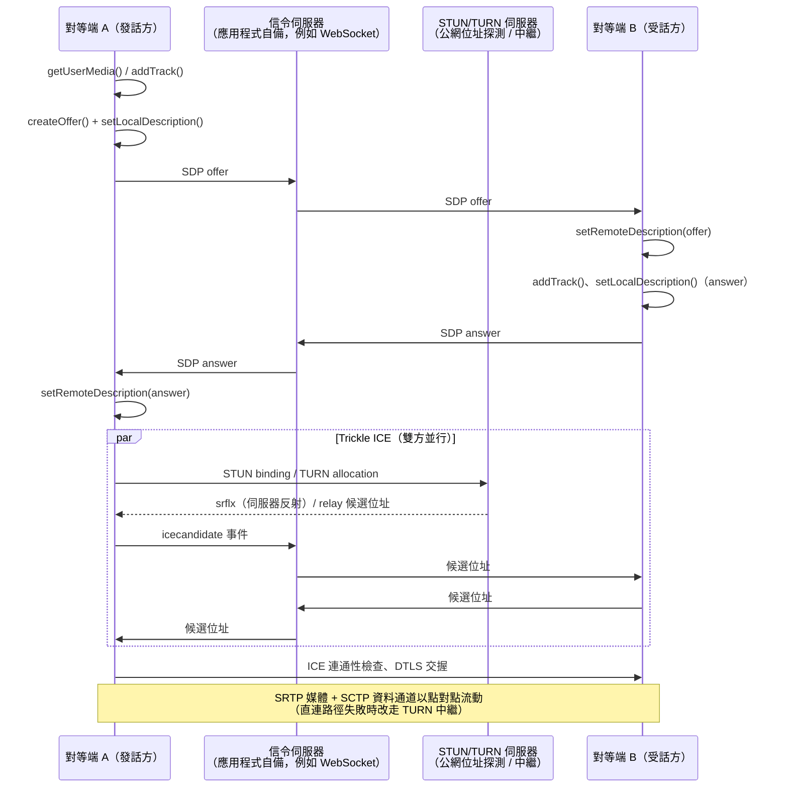

# [FEE-419] WebRTC — 點對點媒體與資料通道

:::info
WebRTC（Web Real-Time Communication）讓瀏覽器彼此直接交換音訊、視訊與任意資料：不需要外掛，在最理想的情況下媒體路徑上甚至沒有伺服器。API 介面不多（`RTCPeerConnection`、`RTCDataChannel`、`getUserMedia`、`getDisplayMedia`），但底層機制並不簡單。每一條連線都要透過應用程式自備的信令通道交換 SDP（Session Description Protocol）描述完成 offer/answer 協商、由 ICE（Interactive Connectivity Establishment）在 STUN 與 TURN 伺服器協助下打穿 NAT，並以 DTLS 與 SRTP（TLS 與安全 RTP 的資料報變體）端對端加密。WebRTC 1.0 自 2021 年 1 月起就是 W3C Recommendation，標準化的 Encoded Transform API 在 2025 年達到跨瀏覽器 Baseline，加密堆疊也已在 Firefox（2024 年中）與 Chrome（2025 年初）預設使用 DTLS 1.3。平台已經成熟；今日真正困難的是協商正確性與部署拓撲，而不是瀏覽器支援度。
:::

## 背景

在 WebRTC 之前，瀏覽器裡的即時媒體意味著 Flash 或專有外掛，「點對點」則意味著桌面應用程式。這個專案始於 2011 年 Google 開源編解碼器與回音消除程式碼，由 W3C（JavaScript API）與 IETF（線路協定）共同標準化，並於 2021 年 1 月 26 日達到 W3C Recommendation。早在正式定案之前，實際採用就已普及：視訊會議、直播上傳（ingest）、雲端遊戲與檔案傳輸工具全都建立在 1.0 之前的 WebRTC 上。瀏覽器可用性從來不是難點。WebRTC 刻意只標準化兩個對等端「互相知道彼此之後」的部分；信令傳輸、工作階段管理與多方拓撲都是應用程式的問題。本文涵蓋連線機制、能在真實世界競態條件下存活的協商模式、作為媒體來源的螢幕擷取，以及每個正式部署都要面對的拓撲決策。相關傳輸協定見 [WebSockets & Server-Sent Events](/zh-tw/Browser APIs and Web Platform/409) 與 [WebTransport](/zh-tw/Browser APIs and Web Platform/411)。

## 視覺對比



## 範例

建議的協商程式碼是 WebRTC 規範與 MDN 的**完美協商（perfect negotiation）**模式：兩個對等端執行完全相同的邏輯，由應用程式指派的布林 `polite` 旗標（例如「後加入的一方是 polite」）以固定規則決定 *glare*（雙方同時送出 offer 的碰撞）的勝負。polite 端會回滾自己的 offer 並接受對方的；impolite 端則忽略碰撞、直接獲勝。兩個配角先說明：`signaler` 是你的應用程式的信令包裝（例如一個薄薄的 WebSocket 用戶端），WebRTC 完全看不到它；它承載的 SDP 描述則是你原封不動轉送的文字資料，由一端瀏覽器產生、另一端瀏覽器解析。

```js
const pc = new RTCPeerConnection({
  iceServers: [
    { urls: "stun:stun.example.net" },
    { urls: "turn:turn.example.net", username: "u", credential: "c" },
  ],
});

let makingOffer = false;
let ignoreOffer = false;
let isSettingRemoteAnswerPending = false;

pc.onnegotiationneeded = async () => {
  try {
    makingOffer = true;
    // 不帶參數的 setLocalDescription() 會依當前 signalingState
    // 建立正確的描述——在這裡永遠是 offer。
    await pc.setLocalDescription();
    signaler.send({ description: pc.localDescription });
  } finally {
    makingOffer = false;
  }
};

pc.onicecandidate = ({ candidate }) => signaler.send({ candidate });

signaler.onmessage = async ({ description, candidate }) => {
  if (description) {
    const readyForOffer =
      !makingOffer &&
      (pc.signalingState === "stable" || isSettingRemoteAnswerPending);
    const offerCollision = description.type === "offer" && !readyForOffer;

    ignoreOffer = !polite && offerCollision;
    if (ignoreOffer) return; // impolite 端在 glare 中獲勝

    isSettingRemoteAnswerPending = description.type === "answer";
    // 對碰撞中的 polite 端而言，這一步會先隱含地回滾
    // 自己待決的 offer，再套用遠端的描述。
    await pc.setRemoteDescription(description);
    isSettingRemoteAnswerPending = false;

    if (description.type === "offer") {
      await pc.setLocalDescription(); // 建立 answer
      signaler.send({ description: pc.localDescription });
    }
  } else if (candidate) {
    try {
      await pc.addIceCandidate(candidate);
    } catch (err) {
      if (!ignoreOffer) throw err; // 被忽略的 offer 產生的候選位址錯誤是預期行為
    }
  }
};
```

被回滾的 offer 並不是白做工：polite 端當時想協商的內容（比如剛加入的軌道）會在信令回到 stable 後再次觸發 `negotiationneeded`，在下一輪順利完成。掛上媒體並回應遠端媒體，在兩端是對稱的：

```js
const stream = await navigator.mediaDevices.getUserMedia({
  video: true,
  audio: true,
});
for (const track of stream.getTracks()) {
  pc.addTrack(track, stream); // 觸發上面的 negotiationneeded 處理器
}

pc.ontrack = ({ track, streams }) => {
  // 軌道以靜音狀態開始；等媒體真的流動再接上元素。
  track.onunmute = () => {
    if (remoteVideo.srcObject) return; // 已經接上了
    remoteVideo.srcObject = streams[0];
  };
};
```

資料通道走同一條連線，底層是 SCTP（一種訊息導向的傳輸協定，隧道在 DTLS 工作階段之中），和其他流量一樣加密。可靠性可以逐通道調整；遊戲的位置更新可以容忍遺失，檔案傳輸不行：

```js
// 可靠、有序（類 TCP）——預設值。
const fileChannel = pc.createDataChannel("file-transfer");

// 無序、最多重傳一次後丟棄（類 UDP）。
const gameChannel = pc.createDataChannel("positions", {
  ordered: false,
  maxRetransmits: 1,
});

// 背壓：絕不要盲目把大檔案塞進緩衝區。
fileChannel.bufferedAmountLowThreshold = 256 * 1024;
fileChannel.onbufferedamountlow = () => sendNextChunk();
```

連線健康狀態可觀察也可復原。`connectionState` 進入 `"failed"` 時應執行 ICE 重啟，在不拆除工作階段的前提下重新協商候選位址：

```js
pc.onconnectionstatechange = () => {
  if (pc.connectionState === "failed") {
    pc.restartIce(); // 以新的 ICE 憑證觸發 negotiationneeded
  }
};
```

## 最佳實踐

- **必須（MUST）**在正式環境部署 TURN 伺服器。對稱式 NAT 與企業防火牆讓相當比例的真實使用者無法建立直連或 STUN 衍生路徑；沒有 `relay` 備援，那些通話就是單純失敗。
- **必須（MUST）**實作完美協商模式（polite/impolite 角色、`makingOffer`、`ignoreOffer`），而不是自製的發話方/受話方邏輯。一旦雙方都能在執行期加入軌道或通道，glare 就不再是邊角案例。
- **必須（MUST）**在通話結束時對每一條擷取軌道呼叫 `track.stop()`。關閉 peer connection 並不會釋放攝影機、麥克風或螢幕；錄製指示燈會一直亮著，而使用者會注意到。
- **必須（MUST）**透過 HTTPS 提供服務：`getUserMedia`、`getDisplayMedia` 與整個擷取相關 API 只存在於安全情境（secure context）。
- **應該（SHOULD）**使用 trickle ICE（在 `icecandidate` 觸發時即時送出候選位址），而不是等待 `iceGatheringState === "complete"`：連通性檢查在蒐集完成前就開始，這正是 RFC 8838 把此做法標準化的理由。
- **應該（SHOULD）**監看 `connectionState` 並在 `"failed"` 時呼叫 `restartIce()`；網路會變（Wi-Fi 切換到行動網路），工作階段被期待能存活下來。
- **應該（SHOULD）**透過 `bufferedAmount` 與 `bufferedamountlow` 尊重資料通道的背壓，並保持單一訊息夠小：在沒有協商 `max-message-size` 時，RFC 8841 規定預設值為 64 KB，而大型訊息會對共用同一條 SCTP 關聯的所有通道造成佇列前端阻塞（head-of-line blocking）。
- **應該（SHOULD）**用 `getStats()`（封包遺失、抖動、往返時間、選中的候選位址配對）監控通話品質，而不是等使用者抱怨。
- **可以（MAY）**使用 `RTCRtpScriptTransform`（Encoded Transforms，2025 年起為 Baseline）在 worker 中處理編碼後的影格：這是跨 SFU（Selective Forwarding Unit，見設計思維）實作端對端加密的標準掛載點。
- **可以（MAY）**在通道集合固定時，雙方以 `negotiated: true` 加上相同的 `id` 建立資料通道，跳過頻內的通道宣告。

## 設計思維

**刻意不定義信令。**標準定義了對等端說什麼（SDP），但不定義訊息怎麼傳。這是實際成本，因為每個團隊都得重建一層信令，通常架在 WebSockets 上。換來的是部署自由：信令可以搭在既有的 session 伺服器、訊息佇列、甚至 QR code 上，而「誰可以打給誰」的信任決策也留在它本來就該在的應用程式層。

**拓撲是規模化的決策。**點對點 *mesh* 不需要任何媒體基礎設施，但每個參與者都要上傳給其他所有參與者，上行頻寬與編碼成本隨人數線性成長；實務上 mesh 大約只能撐到個位數的對等端。*SFU*（Selective Forwarding Unit）終結每個對等端的單一上行流，再選擇性地把封包轉送給其他人：伺服器頻寬可以擴展、用戶端不必重新編碼，simulcast（發送端把同一路視訊編成多種解析度）還讓 SFU 能為每個接收端挑選品質。這是群組通話的預設架構。*MCU*（Multipoint Control Unit）把所有流解碼混合成每個用戶端一條流：對用戶端最省、對舊系統互通最友善，但伺服器成本最高，也犧牲了逐接收端的版面彈性。注意 SFU 或 MCU 本身「不過是」另一個 WebRTC 對等端；瀏覽器 API 完全不變，拓撲完全存在於基礎設施中。

**可靠性是逐通道的旋鈕。**藉由讓每條資料通道各自設定 `ordered`、`maxRetransmits` 與 `maxPacketLifeTime`，WebRTC 允許同一條連線同時承載類 TCP 的檔案傳輸與類 UDP 的遙測。代價是開發者必須真的做出選擇：預設值是完全可靠，這會在高遺失率的鏈路上悄悄把「即時」通道變成延遲放大器。

## 深入探討

**ICE 候選位址類型。**每個對等端會蒐集 `host` 候選位址（本機介面位址）、`srflx` 伺服器反射候選位址（STUN 伺服器觀察到的公網位址）與 `relay` 候選位址（TURN 伺服器上配置、會代為轉送流量的位址）。`prflx` 對等端反射候選位址則是在連通性檢查過程中被發現的，通常出現在對稱式 NAT 之後。ICE 將本地與遠端候選位址配對、依優先序檢查，由其中一方（*controlling* agent）提名承載工作階段的配對；`getStats()` 能看出最後是哪一對勝出。候選位址結束的訊號是 `candidate` 為空字串或 null 的 `icecandidate` 事件；請像其他候選位址一樣轉發它，讓遠端得以完成檢查。

**加密堆疊。**媒體以 SRTP 流動、資料走 SCTP，兩者都透過對等端之間直接執行的 DTLS 交握換鑰；WebRTC 沒有不加密的模式。憑證指紋放在 SDP 裡傳遞，所以被竄改的信令通道是主要的中間人風險：用 TLS 保護信令並在該層驗證使用者身分，是安全模型的一部分，不是可選項。Firefox 自 Firefox 127（2024 年 6 月）起、Chrome 自 2025 年初起預設使用 DTLS 1.3；其他引擎請查閱當期的發行說明。

**Encoded Transforms。**`RTCRtpScriptTransform` 在編碼器與封包器之間（接收端則是鏡像位置）插入一條跑在 Worker 裡的 `TransformStream`，操作 `RTCEncodedVideoFrame`/`RTCEncodedAudioFrame`。因為 transform 看到的是編碼後的影格，它能實現 SFU 讀不懂的端對端加密，同時 SFU 仍能路由封包；它轉送的影格只是不透明的酬載。Safari 於 2022 年、Firefox 於 2023 年推出標準化 API，隨著 Chrome 對齊規範，這項功能於 2025 年 10 月達到 Baseline。

**重新協商與 ICE 重啟。**加入軌道、改變方向性或呼叫 `restartIce()` 都會觸發 `negotiationneeded`，在既有連線上重跑同一套 offer/answer 機制。`setLocalDescription({ type: "rollback" })` 會回到上一個穩定狀態；這正是完美協商倚賴的基元。ICE 重啟會發出新憑證並重新蒐集候選位址，在新配對接手之前既有媒體不中斷，這就是網路切換得以存活的原因。

## 螢幕擷取與顯示表面

螢幕分享是同一條管線換一個來源：`navigator.mediaDevices.getDisplayMedia()` 解析為一個 `MediaStream`，其視訊軌道承載一個*顯示表面（display surface）*：`"monitor"`、`"window"` 或 `"browser"` 分頁，由使用者在瀏覽器繪製的選擇器中挑選。這套 API 刻意比 `getUserMedia` 更嚴格。它要求瞬時啟動（transient activation，一次點擊）、網站不能預選表面、權限逐次授予而非持久保存，而且 `min`/`exact` 約束會拋出 `TypeError`，網站無法對它沒見過的表面強制解析度。

```js
const screen = await navigator.mediaDevices.getDisplayMedia({
  video: { displaySurface: "window" }, // 是提示，不是保證
  audio: { suppressLocalAudioPlayback: true },
  selfBrowserSurface: "exclude",  // 把本分頁從選擇器隱藏（避免鏡中鏡）
  surfaceSwitching: "include",    // 允許使用者在擷取中途切換表面
  monitorTypeSurfaces: "include",
  systemAudio: "exclude",
});
const [screenTrack] = screen.getVideoTracks();

// 分享進既有通話：replaceTrack 可避免重新協商。
const sender = pc.getSenders().find((s) => s.track?.kind === "video");
await sender.replaceTrack(screenTrack);

// 瀏覽器自己的「停止分享」UI 會結束軌道——要監聽它。
screenTrack.onended = () => sender.replaceTrack(cameraTrack);
```

範例中這些塑形選擇器的選項（`selfBrowserSurface`、`surfaceSwitching`、`monitorTypeSurfaces`、`systemAudio` 與相關的 `preferCurrentTab`）是 Chromium 專屬的提示；其他瀏覽器會忽略不認識的字典成員，所以在所有環境傳入都是安全的。

當分頁分享自己（`preferCurrentTab: true`）時，有兩個較新的配套 API 可以縮小擷取範圍：**Region Capture**（`CropTarget.fromElement()` 加上 `track.cropTo()`）把擷取到的視訊裁切到單一元素的渲染框，**Element Capture**（`RestrictionTarget.fromElement()` 加上 `track.restrictTo()`）更進一步，把遮擋在上面的內容完全排除。透過選項傳入的 **CaptureController** 還能轉發滾輪事件、縮放被擷取的分頁（Captured Surface Control）。這些擴充由 Chromium 主導、尚非 Baseline；請當作漸進增強使用，並注意音訊擷取支援度依瀏覽器與表面類型而異。每一個被擷取的表面都是使用者在分享當下無法完全評估的隱私暴露；整螢幕分享時跳出的通知，每位觀看者都看得到。你的 UI 文案應優先引導 `"window"`/`"browser"` 分享流程，而不是預設整個螢幕。

## 延伸閱讀

- [WebSockets & Server-Sent Events](/zh-tw/Browser APIs and Web Platform/409)
- [WebTransport](/zh-tw/Browser APIs and Web Platform/411)
- [Web Workers & Concurrency](/zh-tw/Browser APIs and Web Platform/405)
- [Transferable Objects](/zh-tw/Browser APIs and Web Platform/417)
- [Fetch, Streams & Network APIs](/zh-tw/Browser APIs and Web Platform/403)

## 參考資料

- MDN contributors, "WebRTC API," MDN Web Docs (2026). https://developer.mozilla.org/en-US/docs/Web/API/WebRTC_API
- MDN contributors, "Establishing a connection: The WebRTC perfect negotiation pattern," MDN Web Docs (2026). https://developer.mozilla.org/en-US/docs/Web/API/WebRTC_API/Perfect_negotiation
- MDN contributors, "WebRTC connectivity," MDN Web Docs (2026). https://developer.mozilla.org/en-US/docs/Web/API/WebRTC_API/Connectivity
- MDN contributors, "Using WebRTC data channels," MDN Web Docs (2026). https://developer.mozilla.org/en-US/docs/Web/API/WebRTC_API/Using_data_channels
- MDN contributors, "MediaDevices: getDisplayMedia() method," MDN Web Docs (2026). https://developer.mozilla.org/en-US/docs/Web/API/MediaDevices/getDisplayMedia
- MDN contributors, "Screen Capture API," MDN Web Docs (2026). https://developer.mozilla.org/en-US/docs/Web/API/Screen_Capture_API
- W3C, "WebRTC: Real-Time Communication in Browsers," W3C Recommendation (2021, maintained). https://www.w3.org/TR/webrtc/
- W3C, "WebRTC Encoded Transform," W3C Working Draft (2026). https://www.w3.org/TR/webrtc-encoded-transform/
- webstatus.dev, "WebRTC encoded transform," Web Platform Status (2026). https://webstatus.dev/features/webrtc-encoded-transform
- IETF, "RFC 8841: Session Description Protocol (SDP) Offer/Answer Procedures for Stream Control Transmission Protocol (SCTP) over Datagram Transport Layer Security (DTLS) Transport," IETF (2021). https://www.rfc-editor.org/rfc/rfc8841
- IETF, "RFC 8838: Trickle ICE," IETF (2021). https://www.rfc-editor.org/rfc/rfc8838
- Sean DuBois et al., "WebRTC for the Curious," webrtcforthecurious.com (maintained). https://webrtcforthecurious.com/
- Mozilla, "Bug 1884140: Enable DTLS 1.3 (Firefox 127)," Bugzilla (2024). https://bugzilla.mozilla.org/show_bug.cgi?id=1884140
- Chromium, "Issue 382915276: Launch DTLS 1.3," Chromium Issue Tracker (2025). https://issues.chromium.org/issues/382915276

## 變更紀錄

- **2025** — Chrome 141 推出標準化的 Encoded Transform，讓 `RTCRtpScriptTransform` 於 10 月達到跨瀏覽器 Baseline；Chrome 於年初預設啟用 DTLS 1.3。
- **2024-06** — Firefox 127 預設啟用 DTLS 1.3。
- **2023** — Firefox 推出標準化的 Encoded Transform API（Safari 已於 2022 年推出），取代 Chromium 早期非標準的 `createEncodedStreams()` 設計。
- **2021-01** — WebRTC 1.0 發布為 W3C Recommendation。
