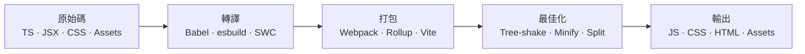
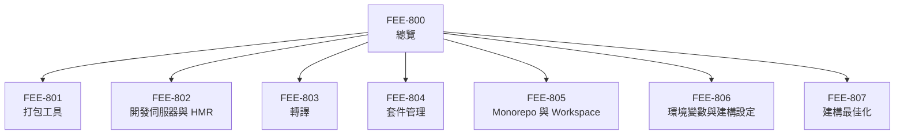

# 構建工具與模組系統總覽

:::info
本分類涵蓋完整的建構流程（build pipeline）——從人類可讀的原始碼（TypeScript、JSX、npm 匯入）到瀏覽器實際執行的最佳化靜態資源。
:::

## 背景

瀏覽器理解的語言範圍有限：HTML、CSS 以及現代環境中的 JavaScript（ES2015+），並透過 HTTP 載入檔案。瀏覽器無法直接理解 TypeScript、JSX 語法、裸模組指定符（bare module specifier）如 `import React from 'react'`，也無法處理 `node_modules` 內的套件依賴圖。每個現代前端專案都必須在原始碼抵達使用者瀏覽器之前，先跨越這道鴻溝。

構建工具的存在正是為了填補這個落差。構建工具接收原始碼樹——多種語言、數百個模組、各式各樣的資源——並產出瀏覽器可直接載入的少量靜態檔案。在這個過程中，它執行三項主要工作：轉譯（transpilation，將 TypeScript 或 JSX 轉換為純 JS）、打包（bundling，解析並內聯模組依賴）、以及最佳化（optimization，搖樹去除死碼、壓縮輸出、分割 chunk 以利並行載入）。最終產出的資源更精簡、傳輸更快速，並相容於目標瀏覽器環境。

本分類 FEE-800 至 FEE-807 逐層檢視這條流程的每個環節：打包工具的運作原理與差異（801）、開發伺服器如何透過 Hot Module Replacement 加速內部開發迴圈（802）、Babel 與 esbuild 等轉譯器如何將原始碼轉換為目標 JS（803）、套件管理工具如何解析與鎖定依賴（804）、Monorepo 如何跨套件協調建構（805）、環境變數與建構時期配置如何安全注入（806），以及如何最佳化最終 bundle 以供正式環境使用（807）。

## 設計思維

JavaScript 並非為大型應用程式而設計。1995 年 Brendan Eich 在十天內寫出第一版時，腳本只是嵌入網頁的短片段。當時沒有模組系統、沒有建構步驟的概念，也沒有預期「前端專案」會包含數十萬行程式碼。這門語言在近二十年間有機地成長，直到 ES2015 才引入原生模組語法，而瀏覽器又花了數年才完整實作。

你今天看到的工具鏈複雜度是歷史的偶然，每個工具都是為了解決當下真實的痛點而誕生的。**Grunt**（2012）透過單一大型設定物件自動化重複性任務——合併檔案、執行 linter、編譯 Sass。它能用，但龐大的 Grunt 設定檔很快成為維護負擔。**Gulp**（2013）以程式碼取代設定來改善體驗：任務是可組合的 Node.js stream，更易於理解與除錯。這兩者都是任務執行器（task runner）而非打包工具；它們協調外部程式，但並不深入理解 JavaScript 的模組依賴圖。

**Webpack**（2014）改變了模型。Webpack 不是對檔案執行任務，而是追蹤應用程式完整的模組依賴圖，並將所有東西打包成一個或多個輸出檔。它理解 `require()` 以及後來的 `import`，可透過 loader 處理 CSS、圖片和字型。到 2016–2018 年，它已成為 React、Angular 和 Vue 應用程式的預設基礎設施，內建於 create-react-app、Angular CLI 和 Vue CLI。Webpack 確實解決了打包問題，但代價不小：複雜的設定、隨專案成長而變慢的冷啟動時間，以及與 bundle 大小成正比的 HMR 延遲。在大型程式碼庫上，開發伺服器啟動 20 秒變成了常態。

**Vite**（2020）打破了這個框架，它利用了 Webpack 誕生後十年間的關鍵變化：瀏覽器原生支援 ES modules。在開發環境中，Vite 完全不打包你的應用程式。它用 esbuild（以 Go 撰寫，速度比 JS 工具快幾個數量級）對第三方依賴做一次性的預打包，然後將你的原始碼以原生 ES module 的形式按需提供。瀏覽器請求一個模組，Vite 就轉換並回傳那一個檔案。熱更新是精準的：只有變更的模組需要重新轉換。結果是無論專案規模多大，伺服器啟動幾乎是即時的，HMR 也不會隨程式碼庫成長而變慢。正式環境方面，Vite 仍使用 Rollup 來產出最佳化、經過 tree-shaking 的 bundle——因為在 HTTP/1.1 環境中，數千個小模組請求造成的網路瀑布問題依然是真實存在的。

未來的走向指向開發與正式環境之間的落差持續縮小。HTTP/2 和 HTTP/3 讓細粒度模組載入在更大規模下更具可行性；Import Maps 讓瀏覽器無需打包工具就能解析裸模組指定符；Deno 和 Bun 帶來了自帶快速 runtime 與打包工具的新選項。正式環境打包是否仍有必要，目前對大多數應用程式而言答案依然是「是的」——但工具鏈格局持續快速演進，深入理解每個流程層次，才能在它演變時做出有依據的選擇。

## 視覺化

### 建構流程

### 分類地圖

## 相關 FEE

- [FEE-307 — ES Modules 規格](/zh-tw/JavaScript%20Language%20and%20Runtime/307) — Vite 開發伺服器所建立的語言層級模組系統
- [FEE-705 — Code Splitting](/zh-tw/Performance%20and%20Optimization/705) — 將 bundle 切分為按需載入的 chunk
- [FEE-801 — 打包工具](/zh-tw/Build%20Tooling%20and%20Module%20Systems/801) — 深入解析 Webpack、Rollup、esbuild 與 Vite 正式模式
- [FEE-802 — 開發伺服器與 HMR](/zh-tw/Build%20Tooling%20and%20Module%20Systems/802) — 開發回饋迴圈的運作原理
- [FEE-803 — 轉譯](/zh-tw/Build%20Tooling%20and%20Module%20Systems/803) — Babel、SWC、esbuild：將現代語法轉換至目標環境
- [FEE-804 — 套件管理](/zh-tw/Build%20Tooling%20and%20Module%20Systems/804) — npm、pnpm、Yarn：依賴解析與 lockfile
- [FEE-805 — Monorepo 與 Workspace](/zh-tw/Build%20Tooling%20and%20Module%20Systems/805) — 跨套件協調建構
- [FEE-806 — 環境變數與建構設定](/zh-tw/Build%20Tooling%20and%20Module%20Systems/806) — 在建構時期安全注入配置
- [FEE-807 — 建構最佳化](/zh-tw/Build%20Tooling%20and%20Module%20Systems/807) — Tree-shaking、壓縮、chunk 切分與資源雜湊
