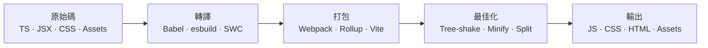
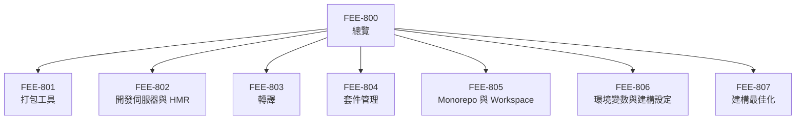

# 構建工具與模組系統總覽

:::info
本分類涵蓋完整的建構流程（build pipeline）——
從人類可讀的原始碼（TypeScript、JSX、npm 匯入）到瀏覽器實際執行的最佳化靜態資源。
:::

## 背景

瀏覽器理解的語言範圍有限：HTML、CSS 以及現代環境中的 JavaScript（ES2015+），並透過 HTTP 載入檔案。
瀏覽器無法直接理解 TypeScript、JSX 語法、裸模組指定符（bare module specifier）如 `import React from 'react'`，
也無法處理 `node_modules` 內的套件依賴圖。
每個現代前端專案都必須在原始碼抵達使用者瀏覽器之前，先跨越這道鴻溝。

具體而言，這些限制是硬性的技術邊界，而非設計選擇。
若你直接將 TypeScript 檔案送往瀏覽器，JavaScript 引擎會立即拋出解析錯誤——它不認識型別標注語法。
若你寫了 JSX 卻未經轉換就送出，角括號語法在 JavaScript 中是非法的，執行會立刻中止。
若你寫了 `import React from 'react'`，瀏覽器無法解析這個裸模組指定符——
它只接受完整的 URL 或相對路徑，完全沒有走訪 `node_modules` 的演算法。
這些限制源自 HTML 與 JavaScript 規格的底層設計，無法繞過。

構建工具的存在正是為了填補這個落差。
構建工具接收原始碼樹——多種語言、數百個模組、各式各樣的資源——
並產出瀏覽器可直接載入的少量靜態檔案。
在這個過程中，它執行三項主要工作：
轉譯（transpilation，將 TypeScript 或 JSX 轉換為純 JS）、
打包（bundling，解析並內聯模組依賴）、
以及最佳化（optimization，搖樹去除死碼、壓縮輸出、分割 chunk 以利並行載入）。
最終產出的資源更精簡、傳輸更快速，並相容於目標瀏覽器環境。

本分類 FEE-800 至 FEE-807 逐層檢視這條流程的每個環節：

- **FEE-801 — 打包工具：** 打包工具的演算法核心——依賴圖遍歷、chunk 切分、tree-shaking——
  以及 Webpack、Rollup、esbuild 與 Vite 正式模式各自的取捨策略。
- **FEE-802 — 開發伺服器與 HMR：** 開發伺服器如何按需提供模組以加速內部迴圈，
  以及 Hot Module Replacement 如何在不完整重新整理頁面的情況下精準更新瀏覽器中的執行狀態。
- **FEE-803 — 轉譯：** Babel、SWC 與 esbuild 如何將 TypeScript、JSX 與現代語法
  轉換為目標環境可執行的 JavaScript，以及各工具為達到速度目標所做的取捨。
- **FEE-804 — 套件管理：** npm、pnpm、Yarn 如何解析依賴圖、
  為何 lockfile 對可重現建構至關重要，
  以及 pnpm 的內容定址存儲與 npm 扁平化 `node_modules` 的差異。
- **FEE-805 — Monorepo 與 Workspace：** Turborepo、Nx 與原生 workspace 協議
  如何讓你在包含多個套件的儲存庫中協調建構、共享程式碼，
  並快取輸出以避免每次都重建整個世界。
- **FEE-806 — 環境變數與建構設定：** 環境變數如何在建構時期（而非執行時期）注入、
  為何機密絕不能嵌入用戶端 bundle，
  以及 Vite 與 webpack DefinePlugin 如何處理這個區分。
- **FEE-807 — 建構最佳化：** 具體技術——tree-shaking、壓縮、chunk 切分、內容雜湊、圖片最佳化——
  決定正式 bundle 是 50 KB 還是 2 MB，以及回訪使用者是否能命中快取。

## 設計思維

JavaScript 並非為大型應用程式而設計。
1995 年 Brendan Eich 在十天內寫出第一版時，腳本只是嵌入網頁的短片段。
當時沒有模組系統、沒有建構步驟的概念，
也沒有預期「前端專案」會包含數十萬行程式碼。
這門語言在近二十年間有機地成長，直到 ES2015 才引入原生模組語法，
而瀏覽器又花了數年才完整實作。

你今天看到的工具鏈複雜度是歷史的偶然。
每個工具都是為了解決當下真實的痛點而誕生的，
理解這段演進順序，才能解釋為何現今的格局長成這個樣子。

**Grunt/Gulp 時代（2012–2014）** 解決的是重複手動作業的問題。
在任務執行器出現之前，開發者要手動串接 JavaScript 檔案、從命令列跑壓縮工具、
手動編譯 Sass、再把資源複製到 `dist` 資料夾。
Grunt 把這些步驟自動化，以一個大型設定物件表達具名任務。
Gulp 以程式碼取代設定來改善體驗：任務是可組合的 Node.js stream，
將一個轉換接管到下一個，使複雜流程更易讀懂。
這兩個工具都帶來了巨大的生產力提升，但共享同一個根本限制：
它們操作的是檔案與外部程序，而不是 JavaScript 模組圖本身。
它們可以按固定順序串接檔案，但無法理解 `import foo from './foo'` 代表 B 依賴 A，
也無法自動排除未使用的匯出。
它們是強大的腳本層，而非語義建構系統。

**Webpack 時代（2014–2019）** 從根本上改變了模型。
Webpack 不是對檔案執行任務，而是從入口點出發追蹤應用程式完整的模組依賴圖，
並將所有東西打包成一個或多個輸出檔。
它理解 `require()` 以及後來的 `import`。
關鍵在於，它可透過 loader 處理 CSS、圖片和字型——
任何檔案類型都可以被當作模組，只要有對應的 loader 知道如何轉換它。
到 2016–2018 年，它已成為 React、Angular 和 Vue 應用程式的預設基礎設施，
內建於 create-react-app、Angular CLI 和 Vue CLI。
Webpack 確實解決了打包問題，也引入了至今仍是基礎的概念——程式碼切分、懶載入、模組圖。
但代價是真實的：設定日趨複雜（完整的 webpack 設定可達數百行）、
冷啟動時間隨專案成長而惡化（因為它必須在開發伺服器啟動前打包所有東西），
HMR 延遲與 bundle 大小成正比（更新一個模組往往需要重建大型 chunk）。
在大型程式碼庫上，開發伺服器啟動 20 秒變成了常態。

**Vite 時代（2020 至今）** 打破了這個框架，
它利用了 Webpack 誕生後十年間的關鍵變化：現代瀏覽器原生支援 ES modules。
核心洞見是：在開發環境中，如果可以直接提供模組，根本不需要打包工具。
Vite 用 esbuild（以 Go 撰寫，基準測試顯示比同等 JavaScript 工具快 10–100 倍）
對第三方依賴做一次性的預打包，然後將你的原始碼以原生 ES module 的形式按需提供。
當瀏覽器解析一個模組並遇到 import 時，它向 Vite 發送請求；
Vite 轉換那一個檔案並回傳。
結果是無論專案規模多大，伺服器啟動幾乎是即時的
（Vite 的啟動時間取決於 esbuild 的依賴預打包，而非你的原始碼樹），
HMR 也不會隨程式碼庫成長而變慢，因為只有變更的模組需要重新轉換。
正式環境方面，Vite 仍委由 Rollup 產出最佳化、經過 tree-shaking 的 bundle——
因為即使有 HTTP/2，在真實網路上發送數千個個別模組請求仍有開銷，
而打包後的資源對大多數應用程式而言能有效避免這個問題。

**未來的走向** 指向開發與正式環境之間的落差持續縮小。
HTTP/2 和 HTTP/3 的多工技術讓細粒度模組載入在更大規模下更具可行性。
Import Maps 現已獲所有現代瀏覽器支援，
讓瀏覽器無需打包工具就能解析裸模組指定符，只需將 import map 指向 CDN URL 即可。
Deno 和 Bun 帶來了原生支援 TypeScript 的執行環境與內建打包工具，
消除了採用它們的專案對整類工具的需求。
正式環境打包是否仍有必要目前仍是開放問題——
對服務全球用戶、透過一般網路傳輸的大多數應用程式而言，今天的答案仍是「是的」——
但方向已經清晰：建構步驟會變得更小、更快，某些情境下甚至是可選的。

## 視覺化

### 建構流程

以下圖示說明原始碼如何流經建構流程的各個階段。
每個階段都是一種獨立的轉換：轉譯改變語言（TypeScript 轉為 JS）、
打包解析依賴圖、最佳化縮減體積並改善快取行為，
最終輸出的是實際部署的內容。

### 分類地圖

以下圖示呈現本分類七篇子文章與總覽的關係。
每個節點代表對流程某一層的深度探討；
FEE-800 提供的定向說明讓其他文章更易於導覽。

## 相關 FEE

- [FEE-307 — ES Modules 規格](/zh-tw/JavaScript%20Language%20and%20Runtime/307) —
  Vite 開發伺服器所建立的語言層級模組系統
- [FEE-705 — Code Splitting](/zh-tw/Performance%20and%20Optimization/705) —
  將 bundle 切分為按需載入的 chunk
- [FEE-801 — 打包工具](/zh-tw/Build%20Tooling%20and%20Module%20Systems/801) —
  深入解析 Webpack、Rollup、esbuild 與 Vite 正式模式
- [FEE-802 — 開發伺服器與 HMR](/zh-tw/Build%20Tooling%20and%20Module%20Systems/802) —
  開發回饋迴圈的運作原理
- [FEE-803 — 轉譯](/zh-tw/Build%20Tooling%20and%20Module%20Systems/803) —
  Babel、SWC、esbuild：將現代語法轉換至目標環境
- [FEE-804 — 套件管理](/zh-tw/Build%20Tooling%20and%20Module%20Systems/804) —
  npm、pnpm、Yarn：依賴解析與 lockfile
- [FEE-805 — Monorepo 與 Workspace](/zh-tw/Build%20Tooling%20and%20Module%20Systems/805) —
  跨套件協調建構
- [FEE-806 — 環境變數與建構設定](/zh-tw/Build%20Tooling%20and%20Module%20Systems/806) —
  在建構時期安全注入配置
- [FEE-807 — 建構最佳化](/zh-tw/Build%20Tooling%20and%20Module%20Systems/807) —
  Tree-shaking、壓縮、chunk 切分與資源雜湊
