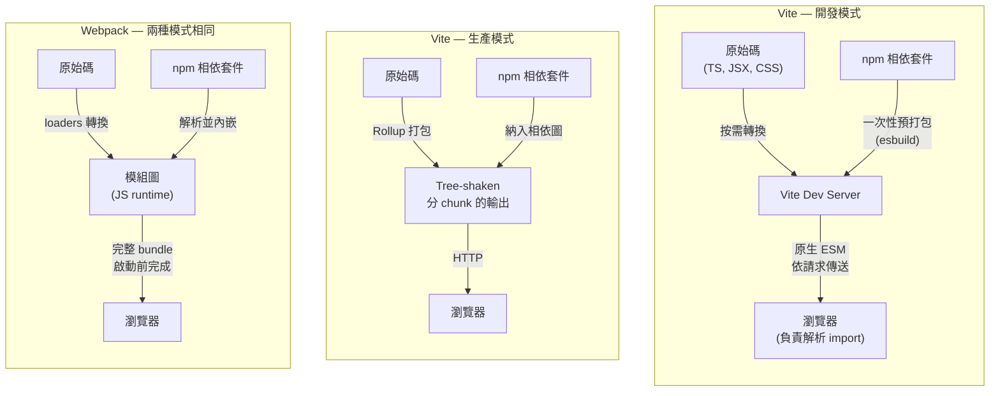

# 打包工具：Webpack、Vite、Rollup 與 esbuild

## 背景

打包工具（bundler）是一支程式，它接收你的原始碼（分散在許多目錄、透過 import 陳述式互相引用、並以裸識別符（bare specifier）引用 npm 套件），然後產出一組精簡且最佳化的檔案，讓瀏覽器能高效載入。
核心演算法是圖遍歷（graph traversal）：從進入點（entry point）出發，追蹤每一個 `import` 與 `require`，建構完整的模組相依圖，再決定如何將這些模組分組成輸出檔案（稱為 chunk）。
過程中，打包工具會進行 tree shaking（移除從未被引入的 export）、code splitting（將不常用的程式碼拆分成按需載入的 chunk），並在寫入磁碟前壓縮結果。

打包工具之所以不可或缺，是因為瀏覽器與 Node.js 模組生態系各自獨立演進。
瀏覽器透過 HTTP 載入檔案，且多年來沒有原生模組系統。
npm 生態系建立在 CommonJS（`require`/`module.exports`）之上，這是一種同步的行程內格式，瀏覽器無法直接執行。
ES modules 在 ES2015 出現後，仍花了數年才在所有瀏覽器落地，而且即便如此，沒有建置步驟或 import map 的輔助，瀏覽器依然無法解析 `import React from 'react'` 這樣的裸識別符。
打包工具填補了這個缺口：它們將裸識別符轉換成路徑、編譯 TypeScript 與 JSX、內嵌 CSS 或輸出獨立的樣式表，最終產出一個完整一致的產出物（artifact）。

如今有多個工具在爭奪這個角色，而採用情況是並存且局部的，並非由某個工具全面取代前者。
Webpack 於 2012 年首次發布，至今仍擁有最大的部署基數：現行大多數生產環境的應用程式都建立在它之上，其外掛與 loader 生態系也依然是所有打包工具中最廣泛的。
Rollup 產出最乾淨的輸出，是發布函式庫到 npm 的標準選擇。
esbuild 以 Go 撰寫，較少被單獨用作應用程式打包工具，更常被嵌入其他工具中作為轉換引擎。
Vite 將這些工具組合成一個框架優先的 dev server；自 Vite 8 起，其預設打包工具是 Rolldown，一個 Rust 引擎，統一了 Vite 過去在 esbuild 與 Rollup 之間拆分的開發與生產路徑。
Rspack 是 Webpack 引擎的 Rust 重寫版本，目標是與 Webpack 的設定 API 相容並可直接替換。
Turbopack 以 Rust 從零打造，是 Next.js 16 中開發與建置的預設打包工具。
Bun 則在其 runtime 中內建了自己的原生打包工具（`bun build`）。
以下的「設計思維」章節會將每個工具對應到它所為之設計的特定取捨，而「選擇指南」表格則將這些取捨轉化為每個專案的實際決策。

## 視覺化

### 打包工具架構比較

下圖對比了三種主要的開發與生產策略的差異。
Vite 開發模式完全不向瀏覽器傳送任何 bundle；Vite 生產模式（在 Vite 7 及之前使用的 esbuild 加 Rollup 架構下）委由 Rollup 處理；Webpack 在兩種模式下都進行完整打包。
Vite 8 的 Rolldown 引擎將此處呈現的兩條 Vite 路徑統一為單一打包工具；這項改變的細節請見下方「設計思維」章節。



## 範例

### 1. 帶外掛的 Vite 設定

```ts
// vite.config.ts
import { defineConfig } from 'vite'
import react from '@vitejs/plugin-react'

export default defineConfig({
  plugins: [react()],
  build: {
    // 生產建置的 Rollup 選項在這裡設定
    rollupOptions: {
      output: {
        manualChunks: {
          vendor: ['react', 'react-dom'],
        },
      },
    },
  },
})
```

Vite 的外掛 API 是 Rollup 外掛 API 的超集。
能在 Vite 生產建置中運作的外掛（Vite 7 及之前為 Rollup，Vite 8 起為 Rolldown）通常也能在開發模式中運作，開發專用的行為則可使用 Vite 特有的鉤子（`configureServer`、`handleHotUpdate`）。

### 2. 帶 loaders 和 plugins 的 Webpack 設定

```js
// webpack.config.js
import path from 'path'
import HtmlWebpackPlugin from 'html-webpack-plugin'
import MiniCssExtractPlugin from 'mini-css-extract-plugin'

export default {
  entry: './src/index.tsx',
  output: {
    path: path.resolve(import.meta.dirname, 'dist'),
    filename: '[name].[contenthash].js',
    clean: true,
  },
  module: {
    rules: [
      // Loaders 將非 JS 檔案轉換為模組
      { test: /\.tsx?$/, use: 'ts-loader', exclude: /node_modules/ },
      { test: /\.css$/, use: [MiniCssExtractPlugin.loader, 'css-loader'] },
      { test: /\.(png|svg|jpg)$/, type: 'asset/resource' },
    ],
  },
  plugins: [
    // Plugins 將管線能力擴展到單一檔案轉換之外
    new HtmlWebpackPlugin({ template: './public/index.html' }),
    new MiniCssExtractPlugin({ filename: '[name].[contenthash].css' }),
  ],
  resolve: { extensions: ['.tsx', '.ts', '.js'] },
}
```

**Module Federation。**
Module Federation 在 Webpack 5 中引入，讓分別部署的應用程式能在執行期（runtime）共享程式碼。
宿主的 shell 應用可以透過 URL 載入另一個團隊獨立部署的元件 bundle，兩個團隊之間不需要共用建置步驟。
這與 code splitting 不同：code splitting 是將單一應用的 bundle 拆成按需載入的 chunk。Module Federation 則跨越應用程式邊界，作用於各自獨立的部署單元之間。
這是 Webpack 原生的微前端（micro-frontend）解法：每個團隊各自發布自己的 remote entry 檔案，
消費端透過 URL 在執行期動態載入它。
這種做法的取捨在於執行期耦合：若 remote 在未協調的情況下變更了其暴露的 API，
消費端不會在建置時發現，而是在執行期載入時才發生錯誤。

### 3. 用於函式庫的 Rollup 設定（ESM + CJS 雙格式輸出）

```js
// rollup.config.js
import { defineConfig } from 'rollup'
import typescript from '@rollup/plugin-typescript'
import resolve from '@rollup/plugin-node-resolve'

export default defineConfig({
  input: 'src/index.ts',
  external: ['react', 'react-dom'], // peer deps — 不要將它們打進 bundle
  plugins: [resolve(), typescript()],
  output: [
    {
      file: 'dist/index.esm.js',
      format: 'esm',
      sourcemap: true,
    },
    {
      file: 'dist/index.cjs.js',
      format: 'cjs',
      sourcemap: true,
    },
  ],
})
```

將 peer dependencies 標記為 `external` 可以將它們排除在 bundle 之外。
消費端從自己的 node_modules 提供這些套件，避免了重複的 React 實例，
並讓消費端的打包工具能對你的函式庫進行 tree shaking。

### 4. esbuild CLI — 快速的一次性打包

```bash
# 打包進入點、壓縮、目標 ES2020、輸出至 dist/
esbuild src/index.ts \
  --bundle \
  --minify \
  --target=es2020 \
  --outfile=dist/bundle.js \
  --platform=browser

# 僅供參考：這類建置通常在數十毫秒內完成，
# 相較之下，同等規模的 Webpack 建置則需要個位數秒。實際數字因專案而異。
```

esbuild 最適合用在腳本、CI 前置檢查，或嵌入其他工具內部。
單獨將其用於應用程式建置，意味著放棄非標準資產類型的 loader、較小的外掛生態系，以及開箱即用的 HMR dev server。

## 最佳實踐

**除非有特定限制，新的應用程式專案應選擇 Vite。**
Webpack 對於需要 Module Federation、依賴沒有 Vite 等效方案的 loader，或是有大量現有 Webpack 設定而遷移成本過高的專案，依然是合適的選擇。Next.js 應用程式是另一個獨立的例外：Next.js 16 預設使用 Turbopack 而非 Vite，團隊 SHOULD 維持該預設，不應自行覆寫。對於其他所有新的全新應用程式，團隊 SHOULD 預設選擇 Vite，其原生 ESM 開發伺服器（Vite 7 及之前由 esbuild 進行相依套件預打包，Vite 8 起改由 Rolldown）在啟動速度和 HMR 上提供了顯著的提升，且在生產環境沒有明顯的取捨。

**發布套件到 npm 時，應使用 Rollup（或基於 Rollup 的工具，如 `tsup`）。**
MUST NOT 將 Webpack bundle 發布到 npm。Rollup 的輸出以下游打包工具能靜態分析以進行 tree shaking 的形式保留了模組邊界資訊。Webpack 的 runtime 包裝（`__webpack_require__`）隱藏了這些資訊，導致消費端無法消除未使用的 export。

**在每一個 Rollup 函式庫設定中，必須將所有 peer dependencies 標記為 `external`。**
將 React 等 peer dependency 打進元件函式庫，會讓消費端載入兩個獨立的 React 實例，從而破壞 hooks 和 context。`rollup.config.js` 中的 `external` 陣列必須包含 `package.json` 的 `peerDependencies` 下所有列出的套件。

**應將 Vite 開發模式和 Vite 生產模式視為需要明確相容性測試的不同環境，在 Vite 7 及更早版本上尤其如此。**
在 Vite 7 之前，Vite 開發時使用原生 ESM，生產時使用 Rollup；某些邊際情況（具有特定模式的動態引入、CJS 互操作行為，或外掛轉換）在兩種模式下可能行為不同。Vite 8 的 Rolldown 引擎透過讓開發與生產走同一個打包工具來縮小這個落差，但在專案的外掛通過 Rolldown 驗證之前，團隊仍 SHOULD 在發布任何功能之前執行 `vite build && vite preview`，而不只是 `vite dev`。

**當 tree shaking 重要時，應優先選用有 ESM 輸出的套件。**
Tree shaking 需要靜態的 ESM `import`/`export` 陳述式。只提供 CommonJS `main` 進入點的套件，無論使用哪個打包工具都無法被 tree shaken。在將相依套件加入對 bundle 大小敏感的專案之前，應檢查其 `package.json` 的 `exports` 欄位是否有 ESM 格式的進入點。

**直接使用 esbuild 建置應用程式時，不要預期它有 Webpack 等級的外掛支援。**
esbuild 的外掛 API 是刻意精簡的。如果專案需要 CSS modules、圖片最佳化或框架特定的轉換，應將 esbuild 嵌入 Vite 使用，而非以獨立的 esbuild 建置取代 Vite。

**在將 Rspack 視為 Webpack 的零設定替換之前，應先驗證其相容性。**
Rspack 與 Webpack API 高度相容，但並非 100% 相同。SHOULD 在切換前執行專案的測試套件，並檢查 loader/plugin 版本相容性。

## 設計思維

**Webpack 為何曾主導市場。**
Webpack 最初於 2012 年發布，1.0 版則在 2014 年推出，一登場就帶著一個決定性的洞察：將每個資產（asset）都視為一個模組。
不只是 JavaScript：CSS、圖片、字型、JSON，只要有對應的 loader，都能進入相依圖。
這個統一模型解決了一個真實問題。在 Webpack 之前，團隊需要為 JS、CSS 和資產建立各自獨立的處理流程，透過 Grunt 或 Gulp 任務執行器來協調，而這些工具對檔案間的相依關係一無所知。
Webpack 以單一、一致的圖取代了這片拼湊之地。
它引入了 code splitting 與延遲載入，為 React 和 Vue 生態系提供了標準的建置平台，並累積了前端工具界最大的外掛與 loader 生態系。
到了 2016 年，`create-react-app`、Angular CLI 和 Vue CLI 都在底層預設使用 Webpack。這三者如今都已不再以它為預設：Create React App 已於 2025 年 2 月正式棄用，Angular 的預設建置工具現已改為以 esbuild/Vite 為基礎，Vue CLI 則進入維護模式，由建立在 Vite 之上的 `create-vue` 取代。

代價在大型專案中逐漸浮現。
Webpack 在 dev server 能提供任何服務之前，必須先完成整個應用程式的打包，因此冷啟動時間會隨專案規模成長；在大型應用上，冷啟動可能長達數十秒。
HMR 的運作方式是讓整個模組子樹失效並重新求值，因此在龐大的相依圖中更新一個深層元件，即便只改了一個檔案，也可能需要數秒，因為從變更點到進入點之間的一切都必須重新打包。
這兩個限制都不是設計缺陷，而是全量預先打包模型的必然結果。
然而，當這種數十秒的冷啟動與數秒級的 HMR 延遲在團隊中一天內反覆發生時，累積下來就是實實在在的工程時間損失。

**Vite 為何打破了這個模式。**
採用情況是疊加而非全面取代：多數現有的 Webpack 應用程式至今仍在使用 Webpack。
真正改變的，是隨著 Vite 由其創作者 Evan You 於 2020 年發布，新專案的預設選擇轉向了它，並且對其後每一個打包工具都形成了必須回應其 dev server 啟動時間的競爭壓力。
Vite 的關鍵洞察是：在所有目標瀏覽器都已原生支援 ES modules 的世界裡，dev server 根本不需要進行任何打包。
開發期間，瀏覽器自己就是模組解析器。
你給它一個模組，它解析 import，並對每個相依項各自發出 HTTP 請求。
Vite 攔截這些請求，即時轉換所請求的檔案（編譯 TypeScript、處理 JSX、解析 CSS modules），然後回傳結果，完全不進行打包。
Dev server 在 Vite 準備好攔截請求後立即啟動，因此啟動時間幾乎是常數，不受專案中原始檔案數量影響。

唯一的例外是 npm 相依套件。
第三方套件常以 CommonJS 形式發布，內部可能有數百個模組，或從數百個子路徑重新 export。
以數千個獨立 ESM 檔案的形式提供它們，會讓瀏覽器陷入瀑布式請求的泥沼。
從 Vite 2 到 Vite 7，Vite 會使用 esbuild（一個比 JavaScript 工具快上許多的 Go 語言打包工具）對 npm 相依套件進行一次性的預打包，快取結果，並以每個套件一個 ESM 檔案的形式提供；這個步驟在毫秒內完成，僅在相依套件變更時失效。
在那個世代，Vite 於生產環境會切換到 Rollup：原生 ESM 透過真實網路傳輸，即便有 HTTP/2 多路復用，仍存在開銷（數百次往返會累積起來，且瀏覽器對連線數有限制），因此 Rollup 會產出精簡、經過 tree-shake、分好 chunk 的 bundle，適合生產環境的傳輸需求。
這種開發／生產環境的拆分是刻意的取捨，介於「最適合開發體驗的工具」和「最適合交付的工具」之間，但這也代表開發與生產環境跑在兩個不同的打包工具上，各自有各自的邊際案例。

Vite 8 在 2025 年 12 月釋出 beta 版，並於 2026 年 3 月正式進入穩定版，補上了這個落差。
它的預設打包工具是 Rolldown，一個由 Vite 與 VoidZero 團隊打造的 Rust 打包工具，目的正是統一開發與生產路徑：相依套件預打包、轉換與生產 bundle 全都透過同一個引擎執行，不需要額外開啟選項。
VoidZero 表示 Rolldown 的速度是 Rollup 的 10 到 30 倍，大致與 esbuild 相當；Linear 等早期採用者回報將建置時間從 46 秒縮短到 6 秒。
上文描述的 esbuild 加 Rollup 拆分架構，在 Vite 7 及更早版本上仍然適用，而 Rolldown 的外掛介面刻意維持與 Rollup 相容，讓多數既有外掛得以繼續運作，但新的 Vite 專案已不再帶有本節所描述的開發／生產不對稱問題。

**Rollup 為何是函式庫打包工具的首選。**
Rollup 是第一個將 tree shaking 列為一等功能的打包工具，時至今日，它對函式庫作者而言仍能產出最乾淨的輸出。
當某個消費端的打包工具處理一個已發布的 npm 套件時，該打包工具需要對套件的 export 進行 tree shaking。
Rollup 的輸出非常直接：所寫的程式碼，移除了無用 export、解析了 import，包裝在指定的模組格式（ESM、CJS、UMD、IIFE）中。
Webpack 的輸出則相反，它將所有東西包裹在 Webpack 自己的模組執行環境（runtime）中（也就是一個自訂的 `__webpack_require__` 系統），這對應用程式而言是正確且高效的，但對試圖分析 export 的下游打包工具而言卻是不透明的。
以 npm 套件形式發布的 Webpack bundle，無法被消費端的打包工具進行 tree shaking，因為模組邊界資訊被藏在 Webpack 的 runtime 裡。
Rollup 輸出保留了這些資訊，使其成為發布到 npm 的標準選擇。

**esbuild 為何改變了所有人的預期。**
esbuild 以 Go 撰寫，而非 JavaScript。
Go 程式編譯為原生機器碼，執行時沒有虛擬機器的啟動開銷。
Go 的 goroutine 讓平行化（parallelism）成本極低：esbuild 能以非常低的協調成本平行解析、連結和壓縮多個檔案。
根據 esbuild 自己的基準測試，結果是：打包 10 份 three.js 函式庫的副本只需要 0.39 秒，同樣的任務 Webpack 5 需要約 41 秒，慢了超過 100 倍。
這不是特例；在各種規模的真實專案中，這個差距始終存在。

取捨是刻意為之的。
esbuild 的速度部分來自於少做一些事。
它不執行 TypeScript 型別檢查（它剝除型別標注後繼續前進，由 `tsc` 單獨回報型別錯誤）。
它的外掛 API 雖然可用，但遠比 Webpack 的外掛生態小且彈性低。
它沒有適用於 Webpack 生態所涵蓋所有資產類型的 loader。
基於這些原因，esbuild 很少被單獨用來建置完整應用程式。
它更常以高速轉換與打包引擎的形式，嵌入其他工具鏈中，處理 CPU 密集的工作，由宿主工具提供設定和外掛的人機介面。
Vite 在第 2 版到第 7 版都以這種方式使用它，同時涵蓋相依套件預打包與 TypeScript/JSX 轉換。
Vite 8 將 esbuild 的打包與相依套件預打包功能併入了 Rolldown，並將 TypeScript/JSX 轉換的角色交給了 Oxc，一個由打造 Rolldown 的同一團隊所開發的姊妹 Rust 工具鏈，但嵌入而非徹底取代的根本原因並沒有改變：esbuild（現在則是 Oxc）最佳化的目標是原始轉換速度，而非外掛涵蓋面。

**可組合性（composability）模式。**
現代建置工具越來越傾向於將熟悉的設定介面搭配更快的底層引擎，只是實際搭配方式因工具而異。
Rspack 在 Rust 核心之上保留了與 Webpack 相容的 JavaScript API，讓團隊能延續既有的設定、loader 和心智模型，同時把緩慢的 JavaScript 核心換掉。
Vite 8 走了一條相關但不同的路：它沒有像 Vite 7 及之前那樣組合 esbuild 與 Rollup 兩個獨立引擎，而是用單一的 Rolldown 引擎取代了兩者，在統一內部架構為單一 Rust 打包工具的同時，保留了外掛生態系與 dev server 的使用體驗。
Turbopack 則朝另一個方向走得更遠：它不是包裝或取代既有的打包工具，而是專為 Next.js 的路由與快取模型，以 Rust 從零打造，用泛用可移植性換取深度的框架整合。這也是為什麼它不適合直接套用在非 Next.js 專案上的原因。
Bun 的打包工具在 runtime 層採取了類似的從零打造策略，作為 Bun 執行檔的一部分發布，而非與另一個獨立的 JavaScript 工具鏈組合。

對已投入 Webpack 的團隊而言，Rspack 依然是最直接的選項：它保留了既有的設定 API、loader 與外掛生態系，以及既有的心智模型，同時以明顯更快的 Rust 實作取代緩慢的 JavaScript 核心。
這讓團隊能獲得大部分 Rust 時代的速度優勢，而無需重寫建置設定。

## 選擇指南

每個專案都落在本文所描述的取捨光譜上的某個位置：dev server 速度、對下游消費者而言的輸出乾淨程度、外掛與 loader 的涵蓋廣度，以及團隊願意重寫多少既有設定。下表是一個起點，不能取代在實際程式碼庫上的實測。

| 工具 | 最適合 | 應避免的情況 | 開發速度 | 輸出乾淨程度 |
| --- | --- | --- | --- | --- |
| Webpack | 大型既有程式碼庫；Module Federation；其他工具沒有對應方案的 loader | 從零開始、沒有舊有限制的新專案 | 最慢：必須先完成整個打包才能開始提供服務 | 輸出包裹在 `__webpack_require__` 中；不適合發布到 npm |
| Vite（Rolldown） | 新的應用程式專案 | Next.js 應用程式（改用 Turbopack）或 Module Federation（在 Webpack/Rspack 上最成熟；Vite 僅能透過 @module-federation/vite 外掛支援） | 快：開發啟動近乎即時；自 Vite 8 起統一了開發／生產引擎 | 良好：Rolldown 產出經過 tree-shake、分好 chunk 的輸出 |
| Rollup | 發布函式庫到 npm | 建置有大量資產處理管線（圖片、CSS 等）的應用程式 | 中等 | 最佳：為下游 tree shaking 保留模組邊界 |
| esbuild | 嵌入式轉換／打包引擎、腳本、CI 前置檢查 | 需要龐大外掛生態系的完整應用程式建置 | 作為獨立工具時最快 | 良好，但精簡的外掛介面限制了複雜輸出的調整能力 |
| Rspack | 想在不重寫設定的前提下獲得 Rust 等級速度的大型 Webpack 程式碼庫 | 沒有既有 Webpack 投入的專案（改用 Vite） | 快：Webpack 相容 API 之下是 Rust 核心 | 與 Webpack 相同的模型（包裝過的 runtime） |
| Turbopack | Next.js 應用程式，涵蓋開發與建置 | 任何非 Next.js 專案（並非泛用打包工具） | 快：Next.js 表示生產建置快 2 到 5 倍，Fast Refresh 最高快 10 倍 | 針對框架最佳化；並非為獨立函式庫輸出而設計 |
| Bun 的打包工具（`bun build`） | 想要單一原生工具鏈的 Bun 專案 | 依賴 Webpack 或 Vite 外掛生態系的專案 | 快 | 適合直接、單一格式的 bundle |

如果專案是 Next.js 應用程式，Next.js 16 已經預設使用 Turbopack，沒有太大理由覆寫這個預設值。如果是其他尚未綁定特定框架打包工具的專案，截至 2026 年，Vite（透過 Rolldown）是預設的起點，Webpack 或 Rspack 則保留給上表所列的限制情境使用。

## 延伸閱讀

- [FEE-800 — 建置工具總覽](/zh-tw/Build%20Tooling%20and%20Module%20Systems/800) —
  歷史背景與完整的分類地圖
- [FEE-307 — ES Modules](/zh-tw/JavaScript%20Core%20and%20Runtime/307) —
  Vite 開發模式所建立的語言層級模組系統
- [FEE-705 — Code Splitting](/zh-tw/Rendering%20and%20Performance/705) —
  打包工具如何將相依圖拆分成按需載入的 chunk
- [FEE-802 — Dev Server 與 HMR](/zh-tw/Build%20Tooling%20and%20Module%20Systems/802) —
  Vite 的 dev server 與 Hot Module Replacement 的深度解析
- [FEE-807 — 建置最佳化](/zh-tw/Build%20Tooling%20and%20Module%20Systems/807) —
  Tree shaking、壓縮、chunk 分割與內容 hash

## 參考資料

- Vite Team, "Why Vite," Vite Documentation. https://vite.dev/guide/why.html
- Vite Team, "Vite 8 Beta: The Rolldown-Powered Vite," Vite Blog (2025). https://vite.dev/blog/announcing-vite8-beta
- Vite Team, "Vite 8.0 Is Out!," Vite Blog (2026). https://vite.dev/blog/announcing-vite8
- VoidZero, "Announcing Rolldown 1.0," VoidZero Blog (2026). https://voidzero.dev/posts/announcing-rolldown-1-0
- esbuild, "Why Is esbuild Fast?," esbuild FAQ. https://esbuild.github.io/faq/
- esbuild, "Getting Started & Benchmarks," esbuild Documentation. https://esbuild.github.io/
- Rollup Team, "Introduction," Rollup Documentation. https://rollupjs.org/introduction/
- Webpack Team, "Concepts," Webpack Documentation. https://webpack.js.org/concepts/
- Webpack Team, "Module Federation," Webpack Documentation. https://webpack.js.org/concepts/module-federation/
- Rspack Team, "Introduction," Rspack Documentation. https://rspack.dev/guide/introduction
- Next.js Team, "Next.js 16," Next.js Blog (2025). https://nextjs.org/blog/next-16
