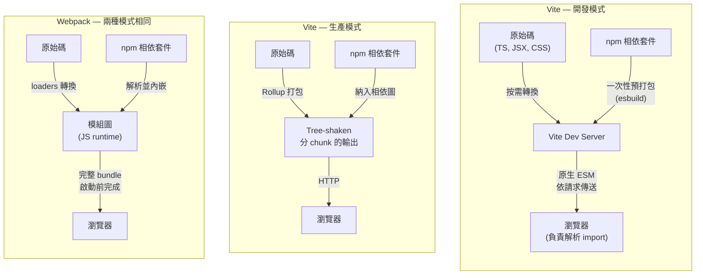

# 打包工具：Webpack、Vite、Rollup 與 esbuild

## 背景

打包工具（bundler）是一支程式，它接收你的原始碼——分散在許多目錄、透過 import 陳述式互相引用、並以裸識別符（bare specifier）引用 npm 套件——然後產出一組精簡且最佳化的檔案，讓瀏覽器能高效載入。
核心演算法是圖遍歷（graph traversal）：從進入點（entry point）出發，追蹤每一個 `import` 與 `require`，建構完整的模組相依圖，再決定如何將這些模組分組成輸出檔案（稱為 chunk）。
過程中，打包工具會進行 tree shaking（移除從未被引入的 export）、code splitting（將不常用的程式碼拆分成按需載入的 chunk），並在寫入磁碟前壓縮結果。

打包工具之所以不可或缺，是因為瀏覽器與 Node.js 模組生態系各自獨立演進。
瀏覽器透過 HTTP 載入檔案，且多年來沒有原生模組系統。
npm 生態系建立在 CommonJS（`require`/`module.exports`）之上，這是一種同步的行程內格式，瀏覽器無法直接執行。
ES modules 在 ES2015 出現後，仍花了數年才在所有瀏覽器落地，而且即便如此，沒有建置步驟或 import map 的輔助，瀏覽器依然無法解析 `import React from 'react'` 這樣的裸識別符。
打包工具填補了這個缺口：它們將裸識別符轉換成路徑、編譯 TypeScript 與 JSX、內嵌 CSS 或輸出獨立的樣式表，最終產出一個完整一致的產出物（artifact）。

今日，四個工具主導了這個生態：Webpack（最早且生態最大的打包工具）、Rollup（以乾淨輸出著稱的函式庫打包工具）、esbuild（以 Go 撰寫的速度異類），以及 Vite（組合前述工具的框架優先工具）。
第五個工具 Rspack 正在崛起，它是以 Rust 重寫、與 Webpack API 相容的替代品。
理解每個工具各自最佳化的目標——以及背後的原因——就能讓工具選擇變得直觀。

## 設計思維

**Webpack 為何曾主導市場。**
Webpack 在 2014 年帶著一個決定性的洞察登場：將每個資產（asset）都視為一個模組。
不只是 JavaScript，CSS、圖片、字型、JSON——只要有對應的 loader，任何檔案都能進入相依圖。
這個統一模型解決了一個真實問題：在 Webpack 之前，你需要為 JS、CSS 和資產建立各自獨立的處理流程，透過 Grunt 或 Gulp 任務執行器來協調，而這些工具對檔案間的相依關係一無所知。
Webpack 以單一、一致的圖取代了這片拼湊之地。
它引入了 code splitting 與延遲載入，為 React 和 Vue 生態系提供了標準的建置平台，並累積了前端工具界最大的外掛（plugin）與 loader 生態系。
到了 2016 年，`create-react-app`、Angular CLI 和 Vue CLI 都在底層預設使用 Webpack。

代價在大型專案中逐漸浮現。
Webpack 在 dev server 能提供任何服務之前，必須先完成整個應用程式的打包。
在大型應用上，冷啟動（cold start）輕易就達到 30 到 60 秒。
HMR（Hot Module Replacement）的運作方式是讓整個模組子樹失效並重新求值，因此在龐大的相依圖中更新一個深層元件，即便只改了一個檔案，也可能需要 2 到 5 秒。
這兩個限制都不是設計缺陷，而是全量預先打包模型的必然結果。
但它們對大型團隊造成了持續的、每日的開發體驗損耗。

**Vite 為何打破了這個模式。**
Vite 的關鍵洞察（來自 Evan You 於 2020 年的發布）是：在所有目標瀏覽器都已原生支援 ES modules 的世界裡，dev server 根本不需要進行任何打包。
開發期間，瀏覽器自己就是模組解析器。
你給它一個模組，它解析 import，並對每個相依項各自發出 HTTP 請求。
Vite 攔截這些請求，即時轉換所請求的檔案（編譯 TypeScript、處理 JSX、解析 CSS modules），然後回傳結果——完全不進行打包。
Dev server 在 Vite 準備好攔截請求後立即啟動，這意味著啟動時間幾乎是常數，不受專案中原始檔案數量影響。

唯一的例外是 npm 相依套件。
第三方套件常以 CommonJS 形式發布，內部可能有數百個模組，或從數百個子路徑重新 export。
以數千個獨立 ESM 檔案的形式提供它們，會讓瀏覽器陷入瀑布式請求的泥沼。
Vite 改用 esbuild——那個以 Go 撰寫、比 JavaScript 工具快 10 到 100 倍的打包工具——對 npm 相依套件進行一次性的預打包（pre-bundling），快取結果，並以每個套件一個 ESM 檔案的形式提供。
這個預打包步驟在毫秒內完成，僅在相依套件變更時失效。

生產環境下，Vite 切換到 Rollup。
原生 ESM 透過真實網路傳輸，即便有 HTTP/2 多路復用，仍存在開銷：數百次往返會累積起來，且瀏覽器對連線數有限制。
Rollup 產出精簡、經過 tree-shake 和良好分 chunk 的 bundle，適合生產環境的傳輸需求。
開發與生產環境的不對稱是刻意的取捨：追求最佳開發體驗的工具（原生 ESM、不打包）和追求最佳生產交付的工具（最佳化的連續 bundle）本來就不同。

**Rollup 為何是函式庫打包工具的首選。**
Rollup 是第一個將 tree shaking 列為一等功能的打包工具，時至今日，它對函式庫作者而言仍能產出最乾淨的輸出。
當你發布一個 npm 套件，而消費端的打包工具在處理它時，那個打包工具需要對你套件的 export 進行 tree shaking。
Rollup 的輸出非常直接：你所寫的程式碼，移除了無用 export、解析了 import，包裝在你所指定的模組格式（ESM、CJS、UMD、IIFE）中。
Webpack 的輸出則相反——它將所有東西包裹在 Webpack 自己的模組執行環境（runtime）中，也就是一個自訂的 `__webpack_require__` 系統。
這對應用程式而言是正確且高效的，但對試圖分析你 export 的下游打包工具而言卻是不透明的。
如果你將 Webpack bundle 作為 npm 套件發布，消費端的打包工具無法對其進行 tree shaking，因為模組邊界資訊被藏在 Webpack 的 runtime 裡。
Rollup 輸出保留了這些資訊，使其成為發布到 npm 的標準選擇。

**esbuild 為何改變了所有人的預期。**
esbuild 以 Go 撰寫，而非 JavaScript。
Go 程式編譯為原生機器碼，執行時沒有虛擬機器的啟動開銷。
Go 的 goroutine 讓平行化（parallelism）成本極低——esbuild 能以非常低的協調成本平行解析、連結和壓縮多個檔案。
結果：在 esbuild 的基準測試中，打包 10 份 three.js 函式庫的副本只需要 0.39 秒；同樣的任務 Webpack 5 需要約 41 秒——慢了超過 100 倍。
這不是特例；在各種規模的真實專案中，這個差距始終存在。

取捨是刻意為之的。
esbuild 的速度部分來自於少做一些事。
它不執行 TypeScript 型別檢查（它剝除型別標注後繼續前進，由 `tsc` 單獨回報型別錯誤）。
它的外掛 API 雖然可用，但遠比 Webpack 的外掛生態小且彈性低。
它沒有適用於 Webpack 生態所涵蓋所有資產類型的 loader。
基於這些原因，esbuild 很少被單獨用來建置完整應用程式。
它更常以高速轉換引擎的形式被嵌入 Vite（用於相依套件預打包和 TypeScript/JSX 轉換）與其他工具鏈中，在那裡處理 CPU 密集的工作，由宿主工具提供設定和外掛的人機介面。

**可組合性（composability）模式。**
現代建置工具越來越傾向於組合專門的引擎：
Vite = esbuild（轉換、相依預打包）+ Rollup（生產 bundle）。
Rspack = Webpack 相容的 JavaScript API + Rust 核心進行實際編譯。
這種可組合性讓每一層都能針對自身優勢最佳化。
使用者同時獲得 Rollup 的外掛生態、Vite 的 dev server 體驗，以及 esbuild 的速度，而無需在它們之間做選擇。
同樣的模式也說明了為何 Rspack 對大型 Webpack 專案的團隊極具吸引力：它保留了你既有的設定 API、loader/plugin 生態系和心智模型，同時以明顯更快的 Rust 實作取代緩慢的 JavaScript 核心。
你能獲得 Vite 時代大部分的速度優勢，而無需重寫建置設定。

## 最佳實踐

**除非有特定限制，新的應用程式專案應選擇 Vite。**
Webpack 對於需要 Module Federation、依賴沒有 Vite 等效方案的 loader，或是有大量現有 Webpack 設定而遷移成本過高的專案，依然是合適的選擇。對於其他所有新的全新應用程式，Vite 的原生 ESM 開發伺服器在啟動速度和 HMR 上提供了顯著的提升，且在生產環境沒有明顯的取捨。

**發布套件到 npm 時，應使用 Rollup（或基於 Rollup 的工具，如 `tsup`）。**
Rollup 的輸出以下游打包工具能靜態分析以進行 tree shaking 的形式保留了模組邊界資訊。Webpack 的 runtime 包裝（`__webpack_require__`）隱藏了這些資訊，導致消費端無法消除未使用的 export。發布的 Webpack bundle 會迫使每個下游消費端都帶著他們無法移除的無用程式碼。

**在每一個 Rollup 函式庫設定中，必須將所有 peer dependencies 標記為 `external`。**
將 React 等 peer dependency 打進元件函式庫，會讓消費端載入兩個獨立的 React 實例，從而破壞 hooks 和 context。`rollup.config.js` 中的 `external` 陣列必須包含 `package.json` 的 `peerDependencies` 下所有列出的套件。

**應將 Vite 開發模式和 Vite 生產模式視為需要明確相容性測試的不同環境。**
Vite 在開發時使用原生 ESM，在生產時使用 Rollup。某些邊際情況——具有特定模式的動態引入、CJS 互操作行為，或外掛轉換——在兩種模式下可能行為不同。在發布任何功能之前，應執行 `vite build && vite preview` 進行測試，而不是只依賴 `vite dev`。

**當 tree shaking 重要時，應優先選用有 ESM 輸出的套件。**
Tree shaking 需要靜態的 ESM `import`/`export` 陳述式。只提供 CommonJS `main` 進入點的套件，無論使用哪個打包工具都無法被 tree shaken。在將相依套件加入對 bundle 大小敏感的專案之前，應檢查其 `package.json` 的 `exports` 欄位是否有 ESM 格式的進入點。

## 視覺化

### 打包工具架構比較

下圖對比了三種主要的開發與生產策略的差異。
Vite 開發模式完全不向瀏覽器傳送任何 bundle；Vite 生產模式委由 Rollup 處理；Webpack 在兩種模式下都進行完整打包。



## 範例

### 1. 帶外掛的 Vite 設定

```ts
// vite.config.ts
import { defineConfig } from 'vite'
import react from '@vitejs/plugin-react'

export default defineConfig({
  plugins: [react()],
  build: {
    // 生產建置的 Rollup 選項在這裡設定
    rollupOptions: {
      output: {
        manualChunks: {
          vendor: ['react', 'react-dom'],
        },
      },
    },
  },
})
```

<!-- 說明：`manualChunks` 讓你手動指定哪些模組應合併成同一個 chunk，常見用途是將 react 和 react-dom 這類不常變動的第三方套件獨立出來，利用瀏覽器快取減少使用者重複下載的流量。 -->

Vite 的外掛 API 是 Rollup 外掛 API 的超集。
在 Vite 生產 Rollup 建置中有效的外掛，通常也能在開發模式中運作；
開發專用的行為則可使用 Vite 特有的鉤子（`configureServer`、`handleHotUpdate`）。

### 2. 帶 loaders 和 plugins 的 Webpack 設定

```js
// webpack.config.js
import path from 'path'
import HtmlWebpackPlugin from 'html-webpack-plugin'
import MiniCssExtractPlugin from 'mini-css-extract-plugin'

export default {
  entry: './src/index.tsx',
  output: {
    path: path.resolve(import.meta.dirname, 'dist'),
    filename: '[name].[contenthash].js',
    clean: true,
  },
  module: {
    rules: [
      // Loaders 將非 JS 檔案轉換為模組
      { test: /\.tsx?$/, use: 'ts-loader', exclude: /node_modules/ },
      { test: /\.css$/, use: [MiniCssExtractPlugin.loader, 'css-loader'] },
      { test: /\.(png|svg|jpg)$/, type: 'asset/resource' },
    ],
  },
  plugins: [
    // Plugins 將管線能力擴展到單一檔案轉換之外
    new HtmlWebpackPlugin({ template: './public/index.html' }),
    new MiniCssExtractPlugin({ filename: '[name].[contenthash].css' }),
  ],
  resolve: { extensions: ['.tsx', '.ts', '.js'] },
}
```

<!-- 說明：`rules` 陣列中的每條規則透過 `test` 正規表達式比對副檔名，再交由對應的 loader 處理。loader 的執行順序是由右至左，因此 `css-loader` 先解析 CSS 的 `@import`，再由 `MiniCssExtractPlugin.loader` 將結果提取為獨立的 CSS 檔案。`plugins` 則作用於整個打包流程，而非單一檔案的轉換。 -->

**Module Federation。**
Module Federation 在 Webpack 5 中引入，讓分別部署的應用程式能在執行期（runtime）共享程式碼。
宿主的 shell 應用可以透過 URL 載入另一個團隊獨立部署的元件 bundle，兩個團隊之間不需要共用建置步驟。
這與 code splitting 不同——code splitting 是將單一應用的 bundle 拆成按需載入的 chunk；
Module Federation 則跨越應用程式邊界，作用於各自獨立的部署單元之間。
這是 Webpack 原生的微前端（micro-frontend）解法：每個團隊各自發布自己的 remote entry 檔案，
消費端透過 URL 在執行期動態載入它。
這種做法的取捨在於執行期耦合：若 remote 在未協調的情況下變更了其暴露的 API，
消費端不會在建置時發現，而是在執行期載入時才發生錯誤。

### 3. 用於函式庫的 Rollup 設定（ESM + CJS 雙格式輸出）

<!-- 說明：此設定同時輸出 ESM 與 CJS 兩種格式，確保函式庫能同時在現代打包工具（讀 ESM）和舊版 Node.js 工具鏈（讀 CJS）中正常使用。`external` 欄位告訴 Rollup 哪些套件不應被打進 bundle，避免消費端載入重複的套件實例。 -->

```js
// rollup.config.js
import { defineConfig } from 'rollup'
import typescript from '@rollup/plugin-typescript'
import resolve from '@rollup/plugin-node-resolve'

export default defineConfig({
  input: 'src/index.ts',
  external: ['react', 'react-dom'], // peer deps — 不要將它們打進 bundle
  plugins: [resolve(), typescript()],
  output: [
    {
      file: 'dist/index.esm.js',
      format: 'esm',
      sourcemap: true,
    },
    {
      file: 'dist/index.cjs.js',
      format: 'cjs',
      sourcemap: true,
    },
  ],
})
```

將 peer dependencies 標記為 `external` 可以將它們排除在 bundle 之外。
消費端從自己的 node_modules 提供這些套件，避免了重複的 React 實例，
並讓消費端的打包工具能對你的函式庫進行 tree shaking。

### 4. esbuild CLI — 快速的一次性打包

```bash
# 打包進入點、壓縮、目標 ES2020、輸出至 dist/
esbuild src/index.ts \
  --bundle \
  --minify \
  --target=es2020 \
  --outfile=dist/bundle.js \
  --platform=browser

# 中型專案的建置時間：約 50ms，相較於 Webpack 的 ~8s
```

<!-- 說明：`--bundle` 旗標讓 esbuild 追蹤所有 import 並將它們合併成單一輸出檔；`--target=es2020` 則指定語法降級目標，esbuild 會自動將不支援的語法轉換為目標版本可理解的寫法，但不會進行型別檢查。若需要型別安全，仍須搭配 `tsc --noEmit` 單獨執行。 -->

esbuild 最適合用在腳本、CI 前置檢查，或嵌入其他工具內部。
單獨將其用於應用程式建置，意味著放棄非標準資產類型的 loader、較小的外掛生態系，以及開箱即用的 HMR dev server。

## 常見錯誤

- **在 Vite 可用的情況下，仍為新的全新應用選用 Webpack。**
  Webpack 對擁有複雜現有設定、有 module federation 需求或特定 loader 相依的團隊依然有效。
  但對於沒有這些限制的新應用，Vite 在沒有明顯取捨的情況下，提供了顯著更好的開發體驗。

- **將 Webpack bundle 發布到 npm。**
  Webpack 的 runtime 包裝阻止了下游打包工具對你 export 進行 tree shaking。
  這是因為模組邊界資訊被藏在 `__webpack_require__` 執行環境內，外部工具無法靜態分析。
  發布套件時，請一律使用 Rollup（或基於 Rollup 的工具如 `tsup`），以保留清晰的 ESM 模組邊界。

- **直接使用 esbuild 建置應用程式，卻期待 Webpack 等級的外掛支援。**
  esbuild 的外掛 API 是刻意精簡的。如果你需要 CSS modules、圖片最佳化或框架特定的轉換，
  請將 esbuild 嵌入 Vite 使用，而非以 esbuild 取代 Vite。

- **預期 Vite 開發與生產環境行為完全一致。**
  由於 Vite 開發使用原生 ESM，生產使用 Rollup，邊際案例可能只在生產環境出現。
  請務必在發布前測試生產建置（`vite build && vite preview`），不要只依賴 dev server。

- **在 Rollup 函式庫設定中忘記將 peer dependencies 標記為 `external`。**
  如果 React 被打進你的元件函式庫，消費端可能載入兩份 React，
  導致 hooks 因實例不符而拋出錯誤。
  正確做法是在 `external` 陣列中列出所有 peer deps，讓消費端從自己的 node_modules 提供它們，避免版本衝突。

- **將 Rspack 視為完全零設定變更的直接替換。**
  Rspack 與 Webpack API 高度相容，但並非 100% 相同。
  部分較舊的 loader 或 plugin 可能依賴 Webpack 內部 API，在 Rspack 中會有不同行為或直接失效。
  在切換之前，請執行你的測試套件並確認 loader/plugin 版本相容性，再逐步推向生產環境。

- **誤以為 tree shaking 對 CommonJS 模組自動有效。**
  Tree shaking 需要靜態的 ESM import。如果某個相依套件只提供 CJS，
  打包工具無法靜態分析其 export，會將整個模組包含進來。
  優先選用提供 `"exports"` 欄位並附有 ESM 輸出的套件。

## 相關 FEE

- [FEE-800 — 建置工具總覽](/zh-tw/Build%20Tooling%20and%20Module%20Systems/800) —
  歷史背景與完整的分類地圖
- [FEE-307 — ES Modules](/zh-tw/JavaScript%20Core%20and%20Runtime/307) —
  Vite 開發模式所建立的語言層級模組系統
- [FEE-705 — Code Splitting](/zh-tw/Rendering%20and%20Performance/705) —
  打包工具如何將相依圖拆分成按需載入的 chunk
- [FEE-802 — Dev Server 與 HMR](/zh-tw/Build%20Tooling%20and%20Module%20Systems/802) —
  Vite 的 dev server 與 Hot Module Replacement 的深度解析
- [FEE-807 — 建置最佳化](/zh-tw/Build%20Tooling%20and%20Module%20Systems/807) —
  Tree shaking、壓縮、chunk 分割與內容 hash

## 參考資料

- Vite — Why Vite: <https://vite.dev/guide/why.html>
- esbuild — Getting Started & Benchmarks: <https://esbuild.github.io/>
- Rollup — Introduction: <https://rollupjs.org/introduction/>
- Webpack — Core Concepts: <https://webpack.js.org/concepts/>
- Webpack — Module Federation: <https://webpack.js.org/concepts/module-federation/>
- Rspack — Introduction: <https://rspack.dev/guide/introduction>
