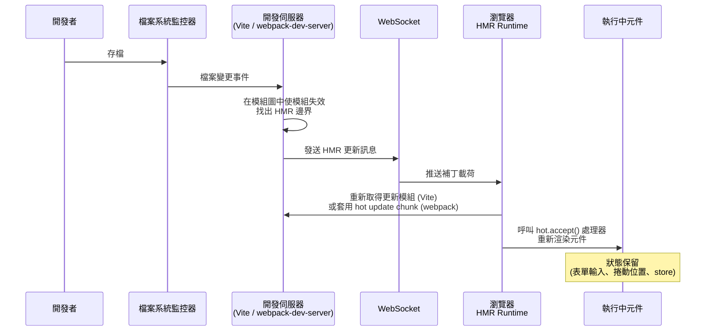

# 開發伺服器、HMR 與開發體驗

## 背景

從寫下程式碼到在瀏覽器看到結果，這段時間差稱為回饋迴圈（feedback loop）。在 2010 年代的大半時光，這個迴圈意味著存檔、等待完整重建，再手動重新整理瀏覽器：在大型應用上可能耗費 10 到 60 秒。每一次打斷都會削弱專注力。Gloria Mark 在 2008 年的一項實驗室研究中，讓大學生在模擬處理電子郵件的任務中反覆受到打斷，結果發現：受打斷的工作雖然完成速度並未變慢（在某些條件下甚至更快），但受試者回報了明顯更高的壓力、挫折感與心力負擔。該實驗測量的是實驗室情境中約 90 分鐘內、由主管重複定期打斷所造成的影響，而非建置工具的等待時間，因此無法為本文的情境提供具體的恢復時間數字。不過，這種壓力與挫折效應很可能會隨緩慢的重建而加劇：10 到 60 秒的等待，足夠讓人開啟另一個分頁，而回頭接續的往往已不是原本中斷的那項工作。

原生 ESM（Native-ESM）開發伺服器後來把這個等待壓縮到毫秒等級，在大量新專案中已是常態，但採用程度仍不完整。許多成熟的既有程式庫，尤其是仰賴 webpack 專屬 loader 鏈的大型 monorepo，至今仍在執行以 webpack 為基礎的開發伺服器，這也是本文同時涵蓋兩種架構的原因。

原生 ESM 開發伺服器不需要完整的正式環境打包步驟即可提供原始碼：它會解析模組識別符，讓 `import React from 'react'` 這類裸引入能直接在瀏覽器中運作，並在瀏覽器無法直接處理時重寫引入路徑。以打包為基礎的開發伺服器則相反，會在提供任何服務之前先編譯出一份開發用 bundle，省略的只是正式環境的最佳化步驟（壓縮、tree-shaking），而不是打包這個步驟本身。兩種架構都會代理 API 請求以避免 CORS 問題，也都會注入 HMR runtime 以免頁面重新整理即可推送更新。在原生 ESM 開發伺服器上，由於每次只需重新傳送變更的模組，從存檔到瀏覽器看到更新可能不到 100 毫秒；以打包為基礎的伺服器則需要重建相依圖中更大的一部分，其 HMR 延遲會隨應用程式規模增長，詳見〈設計思維〉一節。

Source map 與開發環境的 HTTPS 常被視為可有可無的調校項目，但兩者其實都是正確性問題，不只是便利性問題。沒有 source map，TypeScript 或 JSX 編譯後程式碼中的錯誤，只會顯示轉譯輸出中晦澀難懂的行號。沒有 HTTPS，某些瀏覽器 API 會靜默地不可用，或與正式環境行為不同：地理位置、Service Worker、Web Crypto API 都需要安全內容（secure context）。一個與正式環境限制不符的開發環境，會埋下部署後才浮現的潛在錯誤。

## 設計思維

**為何開發伺服器速度會改變工程行為。**
500 毫秒與 30 秒的回饋迴圈，實際差別在於工程師願意冒險嘗試什麼。當延遲只有 500 毫秒，調整版面數值、嘗試不同的 API 形狀、或在執行中的應用檢查邊界情況幾乎沒有成本，工程師自然會這麼做。當延遲來到 30 秒，每一次這樣的檢查都要付出一次情境切換的代價，於是工程師會把好幾項變更累積起來，一次測試。一旦批次中的某處出錯，問題可能出在這批變更中的任何一個，離造成問題的那次變更就更遠，也需要更久才能定位。

**為何不同開發伺服器架構的 HMR 速度有落差。**
本文討論的所有工具都實作了 HMR，也就是在不需要完整重新整理頁面的情況下，把檔案變更推送到瀏覽器的機制，但各自透過不同的架構達到這個目標：webpack 採預先打包，Vite 提供原生 ESM，Turbopack（Next.js 以 Rust 打造的開發用打包器）與 Rspack（相容 webpack API、以 Rust 打造的打包器）則各自用自己的方式避免不必要的重工。

在 webpack 中，所有原始檔案會在開發伺服器開始提供任何服務之前，先被預先打包成一個或多個 chunk 檔案。當某個檔案發生變更，webpack 需要重新執行該檔案的所有 loader（Babel、CSS 處理器、TypeScript 編譯器），重新評估相依圖中哪些模組受到影響，產生一份「hot update chunk」（包含更新後模組程式碼的補丁檔案），再透過 WebSocket 推送出去。loader 管線在每次 HMR 更新時都會重新執行，在相依項眾多的大型相依圖中，失效的連鎖反應可能層層擴散。在大型 React 或 Vue 應用中，webpack 的 HMR 更新可能需要數秒；確切數字取決於相依圖大小與 loader 設定，webpack 本身並未公布相關的基準測試數字，因此本文（包括其他段落）提到的任何具體數字，都應視為說明性質，而非經過控制的效能比較。

在 Vite 中，原始碼從不會被預先打包：瀏覽器透過 HTTP，以個別 ESM 模組的方式取得每一個檔案，Vite 則依請求即時轉換檔案。第三方相依套件是例外。Vite 會將 `node_modules` 中的套件預先打包成單一 ESM 檔案再提供服務，自 Vite 8（2026 年 3 月）起使用 Rolldown，較早版本則使用 esbuild。這麼做有兩個作用：一是把 CommonJS 或 UMD 格式的套件轉換成 ESM，讓瀏覽器能夠載入；二是把內部模組數量龐大的套件（`lodash-es` 就有超過 600 個）收斂成單一檔案，避免一次 import 觸發數百個 HTTP 請求。這個預先打包步驟只在冷啟動時執行一次，這也是為什麼第一次啟動 Vite 開發伺服器時，會在單檔 HMR 速度生效前先經歷一段短暫停頓：這段停頓來自相依套件分析。

當某個檔案發生變更，Vite 的檔案監控器會在伺服器端模組圖中識別出變更的模組，判定 HMR 邊界（最近一個已註冊 `import.meta.hot.accept()` 處理器的模組），並向瀏覽器發送一則最小的 WebSocket 訊息，通知它重新取得那一個檔案。變更的檔案不會觸發任何 loader 管線重新執行；Vite 是依請求轉換檔案，瀏覽器則已經快取了其餘所有內容。HMR 更新時間與應用程式總大小脫鉤：在有 500 個模組的應用上更新單一元件，速度與只有 50 個模組的應用相同。Vite 的文件指出，使用 Oxc transformer 時，HMR 更新可以在 50 毫秒內反映到瀏覽器上。

Turbopack 採取類似的策略：透過增量、函式層級的快取，檔案變更只會重新執行真正依賴該檔案的編譯工作，因此 Fast Refresh（Next.js 的 HMR 機制）的速度取決於變更的規模，而非整個應用的規模。`next dev --turbo` 在 Next.js 15 進入穩定版，並在 Next.js 16 成為預設的開發用打包器。Rspack 以 Rust 實作 webpack 的設定 API，鎖定希望沿用 webpack 相容設定、同時想獲得更快 HMR 的團隊；Rspack 2.1（2026 年 6 月）宣稱 HMR 效能比 2.0 提升約 5%。

**為何 source map 對除錯至關重要。**
當你撰寫 TypeScript 或 JSX，瀏覽器實際執行的程式碼與你所寫的截然不同。欄位編號被壓縮，變數名稱被混淆，多個檔案被串聯在一起。當例外觸發，呼叫堆疊指向 `main.bundle.js` 第 1 行第 8432 欄。Source map 是一種檔案（或內嵌的 data URL），將產生的位置對應回原始檔案的行與欄。DevTools 會透明地使用它們：你看到的是 TypeScript，而非編譯後的輸出。中斷點、監看運算式與呼叫堆疊都會對應到你的原始碼。

Source map 類型的選擇，是建置速度與對應精度之間刻意的取捨。
`eval` 最快（每個模組以 `eval()` 包裹並附上 `//# sourceURL` 標注），但行號對應到的是轉譯輸出，而非原始碼。
`eval-cheap-module-source-map` 加入了 loader 層級的 source map，精度為行級：這是開發環境的良好平衡，重建速度維持快速，行號也維持準確。
`eval-source-map` 提供含欄位映射的完整原始碼精度，但初始建置較慢。

**為何正式環境的完整 source map 是安全疑慮。**
正式環境中的完整 `source-map` 會生成一個 `.map` 檔案，並在打包輸出中以 `//# sourceMappingURL=` 注解連結它。
任何打開瀏覽器 DevTools 的使用者都能看到你的原始碼：TypeScript、JSX、商業邏輯、內部 API 結構、程式碼中使用的環境變數名稱。
對於閉源商業應用，這是一次非預期的資訊揭露。

`hidden-source-map` 會產生相同的完整精度 `.map` 檔案，但省略打包輸出中的參照注解。載入你網站的終端使用者，不會得到任何指向 map 檔案的線索。你可以使用 Sentry 的 `--sourcemap` CLI 旗標，把 map 檔案上傳到錯誤追蹤工具，讓錯誤報告中的呼叫堆疊能以你的原始碼符號化。這些 map 檔案不會出現在公開的打包輸出中，因此無法從瀏覽器存取。

**為何某些瀏覽器 API 即使在開發環境也需要 HTTPS。**
瀏覽器的安全內容（secure context）模型限制某些強大的 API，只能在透過 HTTPS（或 `localhost`）提供服務的 origin 中使用。
地理位置、Web Crypto API、Service Worker 註冊、Payment Request API，以及透過 `getUserMedia` 存取攝影機／麥克風，都需要安全內容。
如果你的開發伺服器在非 localhost 的主機名稱上以純 HTTP 執行（常見於在實體裝置、虛擬機或類似 `dev.myapp.local` 的暫存主機名稱上測試），這些 API 會靜默地不可用。
症狀是程式碼在正式環境可以運作，卻在開發環境失敗，這正好顛覆了預期的除錯流程。
在開發環境使用本機信任的憑證執行 HTTPS，可以消除這個差異。

## 最佳實踐

**開發環境應使用 source map；對大多數專案而言，推薦使用 `eval-cheap-module-source-map` 類型。**
此設定能提供準確指向你原始 TypeScript 或 JSX 原始碼的行號，同時在每次 HMR 更新時維持快速的重建速度。`eval` 與 `eval-cheap-module-source-map` 之間的效能差距很小，但除錯體驗的差距很大。不能為了「加速建置」而在開發環境停用 source map：重建成本微不足道，卻會犧牲大量除錯時間。

**生產環境絕對不能在 bundle 中保留 `//# sourceMappingURL` 參照，以免暴露完整 source map。**
在 Webpack 中使用 `hidden-source-map`（`devtool: 'hidden-source-map'`），或在 Vite 的建置設定中使用 `sourcemap: 'hidden'`。將產生的 `.map` 檔案上傳到 Sentry 等錯誤追蹤工具，讓你的團隊能取得符號化的堆疊追蹤。終端使用者無法透過 DevTools 讀取你的原始碼，因為 bundle 從未參照過 map 檔案。

**當專案使用任何需要安全內容的瀏覽器 API 時，應在開發環境啟用 HTTPS。**
地理位置、Service Worker、Web Crypto、透過 `getUserMedia` 存取攝影機/麥克風，以及 Payment Request API，都需要安全內容。使用 `mkcert` 生成本機信任的憑證。在開發環境執行 HTTPS，可以消除一整類「程式碼在生產環境運作，但在開發時因缺少安全內容而靜默失敗」的錯誤。

**應透過開發伺服器代理 API 請求，而非僅為了開發需求在後端設定 CORS。**
Vite（`server.proxy`）和 webpack-dev-server（`devServer.proxy`）都能將 `/api/*` 請求轉發到在不同連接埠上執行的後端。這樣可以避免為了開發環境限制而修改後端的 CORS 標頭，同時更貼近生產環境的路由行為。

**應為被多個元件引入的共享工具模組，加入明確的 `import.meta.hot.accept()` 處理器。**
框架外掛會自動處理元件檔案的 HMR 邊界。諸如 API 客戶端、功能旗標儲存、設定物件等共享模組，並沒有框架管理的邊界。若缺少明確的處理器，這些模組的任何變更都會沿相依鏈向上蔓延，最終退回為完整頁面重新整理，導致所有記憶體中的應用程式狀態遺失。

## 視覺化

從存檔到瀏覽器重新渲染的 HMR 更新流程：



## 範例

### 1. 含 HMR 與 source map 設定的 Vite 開發伺服器配置

```javascript
// vite.config.js
import { defineConfig } from 'vite'
import react from '@vitejs/plugin-react'

export default defineConfig({
  plugins: [react()],

  server: {
    port: 3000,
    // 代理 API 請求，避免開發時的 CORS 問題
    proxy: {
      '/api': {
        target: 'http://localhost:8080',
        changeOrigin: true,
      },
    },
    // HTTPS 搭配 mkcert 生成的憑證（見下方 mkcert 設置）
    // https: {
    //   key: fs.readFileSync('./.cert/key.pem'),
    //   cert: fs.readFileSync('./.cert/cert.pem'),
    // },
    hmr: {
      // 在瀏覽器中顯示覆蓋式錯誤訊息
      overlay: true,
    },
  },

  build: {
    // 正式環境的完整 source map：使用 hidden-source-map 以避免暴露原始碼
    sourcemap: 'hidden',
  },

  // 開發環境 source map：Vite 預設會透過其轉換管線，為 JS/TS/JSX 直接產生標準 source map，
  // 不像 webpack 需要透過 eval-devtool 包裝。
  // CSS 的 source map 則另外透過 css.devSourcemap 設定覆寫。
})
```

### 2. 自訂模組的手動 import.meta.hot.accept()

框架外掛（vite-plugin-react、@vitejs/plugin-vue）會自動為元件接上 `import.meta.hot`。
對於你希望自訂 HMR 行為的純工具模組，可以手動登錄處理器：

```javascript
// src/config/featureFlags.js

export let flags = await fetchFeatureFlags()

export function isEnabled(name) {
  return flags[name] ?? false
}

// 接受此模組本身的更新。
// 當這個檔案發生變更時，Vite 會由上到下重新執行整個模組，所以 newModule.flags
// 已經是剛重新取得的最新旗標值。我們只需要把這個參照複製過去，
// 讓讀取這個檔案本地 flags 綁定的 isEnabled() 能看到更新。
if (import.meta.hot) {
  import.meta.hot.accept((newModule) => {
    if (newModule) {
      flags = newModule.flags
    }
  })

  // dispose 處理器：在模組被替換前清理副作用
  import.meta.hot.dispose(() => {
    // 例如：清除計時器、關閉 socket
  })
}
```

`flags` 必須被 export，這段程式碼才能正常運作。如果沒有 export，`newModule.flags` 會是 `undefined`，accept 回呼會把這個模組的 `flags` 綁定設為 `undefined`，下一次呼叫 `isEnabled()` 就會拋出 `TypeError: Cannot read properties of undefined`，而不是靜默失敗。若想改為降級成 `false` 而非拋出例外，可以把 `isEnabled` 改成 `return flags?.[name] ?? false`。

`if (import.meta.hot)` 的防衛檢查確保這段程式碼在正式建置中會被 tree-shaken 掉，
因為正式環境的 `import.meta.hot` 為 `undefined`。

### 3. 含 source map 與 HTTPS 的 webpack-dev-server 配置

```javascript
// webpack.config.js
const path = require('path')

module.exports = (env, argv) => {
  const isDev = argv.mode !== 'production'

  return {
    entry: './src/index.js',
    output: {
      path: path.resolve(__dirname, 'dist'),
      filename: '[name].[contenthash].js',
    },

    // Source map 策略：
    // 開發：eval-cheap-module-source-map — 快速重建，行號準確
    // 正式：hidden-source-map — 完整精度 map 檔案，不在打包輸出中加入連結
    devtool: isDev ? 'eval-cheap-module-source-map' : 'hidden-source-map',

    devServer: {
      port: 3000,
      hot: true,               // 啟用 HMR
      open: true,              // 啟動時開啟瀏覽器
      historyApiFallback: true, // SPA 路由

      // 代理 API 請求
      proxy: {
        '/api': {
          target: 'http://localhost:8080',
          changeOrigin: true,
        },
      },

      // HTTPS 搭配 mkcert 憑證
      // server: {
      //   type: 'https',
      //   options: {
      //     key: './.cert/key.pem',
      //     cert: './.cert/cert.pem',
      //   },
      // },
    },
  }
}
```

### 4. 使用 mkcert 設置開發環境 HTTPS

`mkcert` 建立由本機信任的憑證授權機構簽署的憑證，並將該 CA 安裝到系統與瀏覽器的信任儲存中。
不會出現瀏覽器安全警告，不需要信任自簽憑證的例外。

```bash
# 安裝 mkcert（macOS 使用 Homebrew）
brew install mkcert

# 將本機 CA 安裝到系統與瀏覽器信任儲存
mkcert -install

# 為 localhost 及本機主機名稱生成憑證
mkdir -p .cert
mkcert -key-file .cert/key.pem -cert-file .cert/cert.pem localhost 127.0.0.1 ::1

# 憑證與金鑰檔案現在位於 .cert/
# 將 .cert/ 加入 .gitignore — 切勿提交私鑰
echo ".cert/" >> .gitignore
```

生成憑證後，取消上方 Vite 或 webpack 配置範例中 `https` / `server` 區塊的注解。

## 常見錯誤

- **在正式環境使用 `source-map` 而未隱藏參照。** 打包輸出會包含 `//# sourceMappingURL=main.js.map`，任何擁有 DevTools 的人都能讀取你的原始碼。應在 webpack 中使用 `hidden-source-map`，或在 Vite 建置設定中使用 `sourcemap: 'hidden'`，再將 `.map` 檔案另外上傳到你的錯誤追蹤工具。

- **忽略 HMR 邊界。** 若相依鏈中沒有任何模組登錄 `import.meta.hot.accept()` 處理器（或等效機制），HMR 會向上蔓延到應用程式根部，退回為完整頁面重新整理。框架外掛會為元件檔案處理這件事，但被多個元件共用的工具模組發生變更時，除非加入明確的處理器，否則通常會觸發完整重新整理。

- **假設 `localhost` 與 `127.0.0.1` 在安全內容方面行為相同。** 大多數瀏覽器將 `localhost` 視為安全內容；`127.0.0.1` 則不保證如此。在非 `localhost` 的裝置或主機名稱上測試時，無論如何都需要 HTTPS 才能使用安全內容 API。

- **將生成的憑證檔案提交到版本控制。** `.cert/key.pem` 中的私鑰絕不能提交。每位開發者應在本機執行 `mkcert`，或讓團隊共用一個在首次使用時生成憑證的設置腳本。

- **在大型應用中執行以 webpack 為基礎的開發伺服器，卻未對 HMR 進行效能分析。** 若個別 HMR 更新緩慢，根本原因通常是某個被深度共用的模組，每次變更都使相依圖的一大部分失效。可以把共享工具程式隔離在穩定的介面之後；若考慮整個遷移出 webpack，Rspack 保留現有的 webpack 設定格式、同時以 Rust 實作打包器本身，Next.js 專案則可以改用 Turbopack，該工具自 Next.js 16 起已是預設的開發用打包器。

## 相關 FEE

- [FEE-800: Build Tooling Overview](./800.md) — 工具層存在的背景脈絡
- [FEE-801: 打包工具：Webpack、Vite、Rollup 與 esbuild](./801.md) — 本文所描述開發伺服器行為的底層打包器架構
- [FEE-807: Build Optimization](./807.md) — 正式環境 source map 策略、chunk 拆分與資產最佳化

## 參考資料

- Gloria Mark, Daniel Gudith, and Ujwal Klocke, "The Cost of Interrupted Work: More Speed and Stress," Proceedings of the ACM CHI Conference on Human Factors in Computing Systems (2008). https://ics.uci.edu/~gmark/chi08-mark.pdf
- Vite Team, "Why Vite," Vite Documentation. https://vite.dev/guide/why
- Vite Team, "Features: Hot Module Replacement," Vite Documentation. https://vite.dev/guide/features#hot-module-replacement
- Vite Team, "HMR API," Vite Documentation. https://vite.dev/guide/api-hmr
- Vite Team, "Dependency Pre-Bundling," Vite Documentation. https://vite.dev/guide/dep-pre-bundling
- Vite Team, "Vite 8.0 is out!," Vite Blog (2026). https://vite.dev/blog/announcing-vite8
- webpack Contributors, "Devtool (source map types)," webpack Documentation. https://webpack.js.org/configuration/devtool/
- webpack Contributors, "Hot Module Replacement," webpack Guides. https://webpack.js.org/guides/hot-module-replacement/
- Next.js Team, "Turbopack Dev is Now Stable," Next.js Blog (2024). https://nextjs.org/blog/turbopack-for-development-stable
- Next.js Team, "Next.js 16," Next.js Blog (2025). https://nextjs.org/blog/next-16
- Rspack Team, "Announcing Rspack 2.0," Rspack Blog (2026). https://rspack.rs/blog/announcing-2-0
- Rspack Team, "Announcing Rspack 2.1," Rspack Blog (2026). https://rspack.rs/blog/announcing-2-1
- Filippo Valsorda, "mkcert: A simple zero-config tool to make locally trusted development certificates," GitHub. https://github.com/FiloSottile/mkcert
