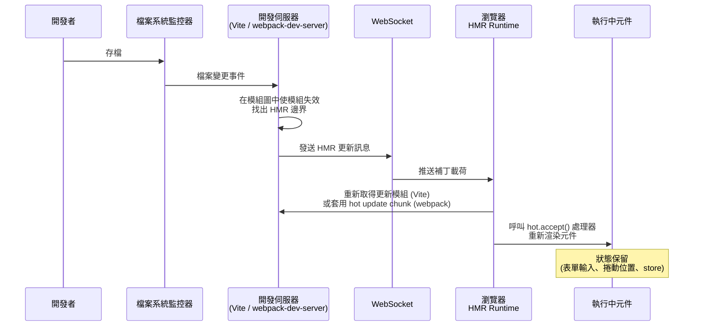

# 開發伺服器、HMR 與開發體驗

## 背景

從寫下程式碼到在瀏覽器看到結果，這段時間差稱為回饋迴圈（feedback loop）。
在 2010 年代的大半時光，這個迴圈意味著存檔、等待完整重建，再手動重新整理瀏覽器——在大型應用上可能耗費 10 到 60 秒。
每一次打斷都是專注力的損耗。
開發者生產力的研究一再指出，一次情境切換——由緩慢的建置、失敗的測試或工具逾時所觸發——需要大約 20 分鐘才能完全恢復專注。
30 秒的重建並不只是浪費 30 秒；它會訓練工程師在等待時開始多工，讓注意力在一整天內不斷被切割。

現代開發伺服器將這個回饋迴圈壓縮到毫秒等級。
它們不需要完整打包即可提供原始碼，解析模組識別符讓瀏覽器能處理裸引入（如 `import React from 'react'`），代理 API 請求以避免 CORS 問題，注入 HMR runtime 以免頁面重新整理即可推送更新，並在瀏覽器無法直接處理時重寫引入路徑。
在設定良好的專案中，從存檔到瀏覽器看到更新不超過 100 毫秒。

Source map 與開發環境的 HTTPS 常被視為可有可無的調校項目，但兩者其實都是正確性問題，不只是便利性問題。
沒有 source map，TypeScript 或 JSX 編譯後的錯誤只會顯示晦澀的行號，對應到你從未直接看過的轉譯輸出。
沒有 HTTPS，某些瀏覽器 API——地理位置、Service Worker、Web Crypto API——會靜默地不可用，或與正式環境行為不同。
一個與正式環境約束不符的開發環境，是部署後才浮現的潛在錯誤的溫床。

## 原則

- 開發環境 SHOULD 使用 source map（建議類型：`eval-source-map` 或 `eval-cheap-module-source-map`）
- 正式環境 SHOULD NOT 暴露完整 source map（使用 `hidden-source-map` 或等效設定；上傳至錯誤追蹤工具，不應讓終端使用者存取）

## 設計思維

**為何開發伺服器速度會產生複利效應。**
快速的回饋迴圈不只是舒適性的改善——它改變了能夠建造什麼。
當一次變更 500 毫秒就能看到效果，工程師會自由地實驗：調整版面、嘗試不同的 API 形狀、在執行中的應用驗證邊界情況。
當一次變更需要 30 秒，工程師會批量修改、等待時切換情境、並對眼前所見是否反映剛才所寫失去信心。
每次回饋迴圈縮短 1 秒，在一個 sprint 數千次的存檔中都會累積。
擁有快速工具鏈的團隊能推出更多實驗、在更接近錯誤引入點的地方發現 bug，並對開發設置有更高的滿意度。

**為何 Vite HMR 比 Webpack HMR 更快。**
兩個工具都實作了 HMR——在不完整重新整理頁面的情況下，將檔案變更推送到瀏覽器的機制——但兩者透過不同的架構達到這個目標。

在 Webpack 中，所有原始檔案在 dev server 開始提供任何服務之前，都會被預先打包成一個或多個 chunk 檔案。
當一個檔案發生變更，Webpack 必須：對該檔案重新執行所有 loader（Babel、CSS 處理器、TypeScript 編譯器）、重新評估圖中哪些模組受到影響、生成一個包含更新模組程式碼的「hot update chunk」補丁檔案，並透過 WebSocket 推送。
Loader 管線在每次 HMR 更新時都會執行，在一個具有眾多相依項的大型圖中，失效的連鎖反應可能向上層蔓延。
在大型 React 或 Vue 應用中，Webpack HMR 更新通常需要 2 到 5 秒。

在 Vite 中，檔案從不預先打包；瀏覽器透過 HTTP 以個別 ESM 模組的方式取得每個原始碼檔案。
當一個檔案發生變更，Vite 的檔案監控器在伺服器端模組圖中識別出變更的模組，確定 HMR 邊界（最近一個已登錄 `import.meta.hot.accept()` 處理器的模組），並向瀏覽器發送一條最小的 WebSocket 訊息，告知它重新取得那一個檔案。
在變更的檔案上不會重新執行任何 loader 管線；Vite 是依請求轉換檔案，而瀏覽器已快取了其餘所有內容。
HMR 更新時間與應用程式總大小脫鉤：在 500 個模組的應用上更新單一元件，速度與 50 個模組的應用相同。
Vite 的文件指出，使用 Oxc transformer 的 HMR 更新可在 50 毫秒以內反映到瀏覽器。

**為何 source map 對除錯至關重要。**
當你撰寫 TypeScript 或 JSX，瀏覽器實際執行的程式碼與你所寫的截然不同。
欄位編號被壓縮，變數名稱被混淆，多個檔案被串聯在一起。
當例外觸發時，呼叫堆疊指向 `main.bundle.js` 第 1 行第 8432 欄。
Source map 是一種檔案（或內嵌的 data URL），將生成位置映射回原始檔案的行與欄。
DevTools 透明地使用它們：你看到的是 TypeScript，而非編譯輸出。
中斷點、監看表達式和呼叫堆疊都對應你的原始碼。

Source map 類型的選擇是建置速度與對應精度之間刻意的取捨。
`eval` 最快（每個模組以 `eval()` 包裹並附上 `//# sourceURL` 標注），但行號對應到的是轉譯輸出，而非原始碼。
`eval-cheap-module-source-map` 加入了 loader 層級的 source map，精度為行級——開發用途的良好平衡：重建速度快，行號準確。
`eval-source-map` 提供含欄位映射的完整原始碼精度，但初始建置較慢。

**為何正式環境的完整 source map 是安全疑慮。**
正式環境中的完整 `source-map` 會生成一個 `.map` 檔案，並在打包輸出中以 `//# sourceMappingURL=` 注解連結它。
任何打開瀏覽器 DevTools 的使用者都能看到你的原始碼：TypeScript、JSX、商業邏輯、內部 API 結構、程式碼中使用的環境變數名稱。
對於閉源商業應用，這是一次非預期的資訊揭露。

`hidden-source-map` 生成相同的完整精度 `.map` 檔案，但在打包輸出中省略了參照注解。
載入你網站的終端使用者無法得到指向 map 檔案的線索。
你可以使用 Sentry 的 `--sourcemap` CLI 旗標將 map 檔案上傳到錯誤追蹤工具，讓錯誤報告中的呼叫堆疊能以你的原始碼符號化——而原始碼本身不會被任何有瀏覽器的人存取。

**為何某些瀏覽器 API 即使在開發環境也需要 HTTPS。**
瀏覽器的安全內容（secure context）模型限制某些強大的 API 只能在透過 HTTPS（或 `localhost`）提供服務的 origin 中使用。
地理位置、Web Crypto API、Service Worker 註冊、Payment Request API，以及透過 `getUserMedia` 存取攝影機／麥克風，都需要安全內容。
如果你的 dev server 在非 localhost 的主機名稱上以純 HTTP 執行（常見於在實體裝置、虛擬機或類似 `dev.myapp.local` 的暫存主機名稱上測試），這些 API 會靜默地不可用。
症狀是程式碼在正式環境運作，卻在開發時失敗——這顛覆了預期的除錯流程。
在開發環境使用本機信任的憑證執行 HTTPS 可消除這個差異。

## 視覺化

從存檔到瀏覽器重新渲染的 HMR 更新流程：



## 範例

### 1. 含 HMR 與 source map 設定的 Vite 開發伺服器配置

```javascript
// vite.config.js
import { defineConfig } from 'vite'
import react from '@vitejs/plugin-react'

export default defineConfig({
  plugins: [react()],

  server: {
    port: 3000,
    // 代理 API 請求，避免開發時的 CORS 問題
    proxy: {
      '/api': {
        target: 'http://localhost:8080',
        changeOrigin: true,
      },
    },
    // HTTPS 搭配 mkcert 生成的憑證（見下方 mkcert 設置）
    // https: {
    //   key: fs.readFileSync('./.cert/key.pem'),
    //   cert: fs.readFileSync('./.cert/cert.pem'),
    // },
    hmr: {
      // 在瀏覽器中顯示覆蓋式錯誤訊息
      overlay: true,
    },
  },

  build: {
    // 正式環境 source map：hidden 不在打包輸出中加入參照，避免暴露原始碼
    sourcemap: 'hidden',
  },
})
```

### 2. 自訂模組的手動 import.meta.hot.accept()

框架外掛（vite-plugin-react、@vitejs/plugin-vue）會自動為元件接上 `import.meta.hot`。
對於你希望自訂 HMR 行為的純工具模組，可以手動登錄處理器：

```javascript
// src/config/featureFlags.js

let flags = await fetchFeatureFlags()

export function isEnabled(name) {
  return flags[name] ?? false
}

// 接受此模組本身的更新。
// 當此檔案發生變更，Vite 會以新模組呼叫此回呼。
if (import.meta.hot) {
  import.meta.hot.accept((newModule) => {
    if (newModule) {
      // 重新初始化狀態
      flags = newModule.flags
    }
  })

  // dispose 處理器：在模組被替換前清理副作用
  import.meta.hot.dispose(() => {
    // 例如：清除計時器、關閉 socket
  })
}
```

`if (import.meta.hot)` 的防衛檢查確保這段程式碼在正式建置中會被 tree-shaken 掉，
因為正式環境的 `import.meta.hot` 為 `undefined`。

### 3. 含 source map 與 HTTPS 的 webpack-dev-server 配置

```javascript
// webpack.config.js
const path = require('path')

module.exports = (env, argv) => {
  const isDev = argv.mode !== 'production'

  return {
    entry: './src/index.js',
    output: {
      path: path.resolve(__dirname, 'dist'),
      filename: '[name].[contenthash].js',
    },

    // Source map 策略：
    // 開發：eval-cheap-module-source-map — 快速重建，行號準確
    // 正式：hidden-source-map — 完整精度 map 檔案，不在打包輸出中加入連結
    devtool: isDev ? 'eval-cheap-module-source-map' : 'hidden-source-map',

    devServer: {
      port: 3000,
      hot: true,               // 啟用 HMR
      open: true,              // 啟動時開啟瀏覽器
      historyApiFallback: true, // SPA 路由

      // 代理 API 請求
      proxy: {
        '/api': {
          target: 'http://localhost:8080',
          changeOrigin: true,
        },
      },

      // HTTPS 搭配 mkcert 憑證
      // server: {
      //   type: 'https',
      //   options: {
      //     key: './.cert/key.pem',
      //     cert: './.cert/cert.pem',
      //   },
      // },
    },
  }
}
```

### 4. 使用 mkcert 設置開發環境 HTTPS

`mkcert` 建立由本機信任的憑證授權機構簽署的憑證，並將該 CA 安裝到系統與瀏覽器的信任儲存中。
不會出現瀏覽器安全警告，不需要信任自簽憑證的例外。

```bash
# 安裝 mkcert（macOS 使用 Homebrew）
brew install mkcert

# 將本機 CA 安裝到系統與瀏覽器信任儲存
mkcert -install

# 為 localhost 及本機主機名稱生成憑證
mkdir -p .cert
mkcert -key-file .cert/key.pem -cert-file .cert/cert.pem localhost 127.0.0.1 ::1

# 憑證與金鑰檔案現在位於 .cert/
# 將 .cert/ 加入 .gitignore — 切勿提交私鑰
echo ".cert/" >> .gitignore
```

生成憑證後，取消上方 Vite 或 webpack 配置範例中 `https` / `server` 區塊的注解。

## 常見錯誤

- **在正式環境使用 `source-map` 而未隱藏參照。** 打包輸出會包含 `//# sourceMappingURL=main.js.map`，任何有 DevTools 的人都能讀取你的原始碼。正式環境應使用 webpack 的 `hidden-source-map` 或 Vite 建置設定中的 `sourcemap: 'hidden'`，再將 `.map` 檔案單獨上傳到錯誤追蹤工具。

- **忽略 HMR 邊界。** 若相依鏈中沒有任何模組登錄了 `import.meta.hot.accept()` 處理器（或等效機制），HMR 會向上層蔓延到應用程式根部，退回為完整頁面重新整理。框架外掛會為元件檔案處理這件事，但多個元件共享的工具模組發生變更時，除非加入明確的處理器，否則通常會觸發完整重載。

- **假設 `localhost` 與 `127.0.0.1` 在安全內容方面行為相同。** 大多數瀏覽器將 `localhost` 視為安全內容；`127.0.0.1` 則不保證如此。在非 `localhost` 的裝置或主機名稱上測試時，無論如何都需要 HTTPS 才能使用安全內容 API。

- **將生成的憑證檔案提交到版本控制。** `.cert/key.pem` 中的私鑰絕不能提交。每位開發者應在本機執行 `mkcert`，或讓團隊共用一個在首次使用時生成憑證的設置腳本。

- **為加速建置而在開發環境停用 source map。** `eval` 與 `eval-cheap-module-source-map` 之間的效能差異很小，但除錯體驗的差距卻很大。沒有 source map，TypeScript 型別錯誤、JSX 問題和 CSS module 問題都會以指向生成程式碼的晦澀參照呈現。

- **在大型應用中使用 Webpack 開發伺服器卻未分析 HMR 效能。** 若個別 HMR 更新緩慢，根本原因通常是一個被深度共享的模組，每次變更都使圖的大部分失效。將共享工具程式隔離在穩定的介面後面，或考慮遷移到以 Rust 實作 Webpack API 的 Rspack 配置，可顯著降低 HMR 延遲。

## 相關 FEE

- [FEE-800: Build Tooling Overview](./800.md) — 工具層存在的背景脈絡
- [FEE-801: 打包工具：Webpack、Vite、Rollup 與 esbuild](./801.md) — 本文所描述開發伺服器行為的底層打包器架構
- [FEE-807: Build Optimization](./807.md) — 正式環境 source map 策略、chunk 拆分與資產最佳化

## 參考資料

- [Vite — Features: Hot Module Replacement](https://vite.dev/guide/features#hot-module-replacement)
- [Vite — HMR API](https://vite.dev/guide/api-hmr)
- [Webpack — Devtool（source map 類型）](https://webpack.js.org/configuration/devtool/)
- [Webpack — Hot Module Replacement guide](https://webpack.js.org/guides/hot-module-replacement/)
- [mkcert — 本機信任的開發憑證](https://github.com/FiloSottile/mkcert)
