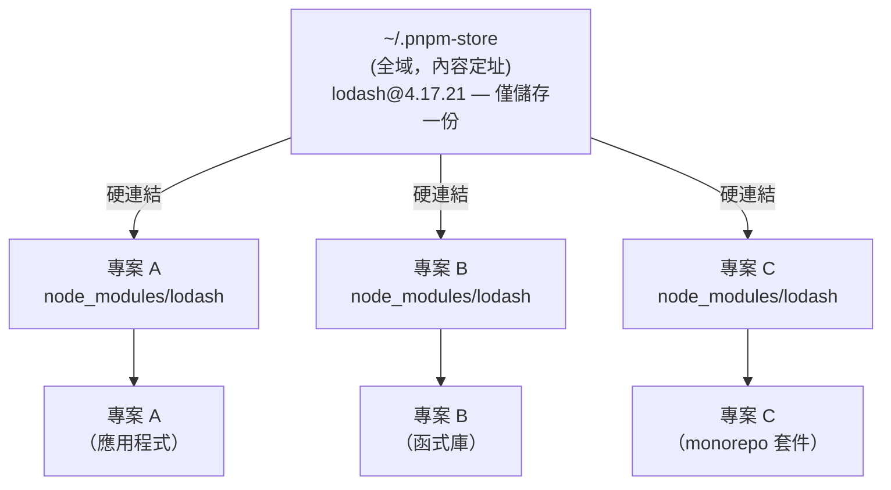

# [FEE-804] 套件管理：npm、pnpm 與 Yarn

:::info
npm、pnpm 與 Yarn 都讀取同一份 `package.json`，也都會產生可運作的 `node_modules`，但三者用
不同的磁碟佈局達成這件事，而這個差異正是團隊在實務上遇到的多數 bug 與取捨的根源。npm 扁平化、
hoisting 的佈局讓幽靈依賴（phantom dependency）成為可能：程式碼可以 import 一個從未宣告的
套件，因為 npm 已悄悄把它搬到頂層。pnpm 的 symlink 儲存區則從架構上就杜絕了這個缺口。Yarn 的
Plug'n'Play 模式完全移除 `node_modules`，以部分工具相容性換取安裝速度。本文將說明每種佈局在
磁碟上實際做了什麼、幽靈依賴與 lockfile 風險從何而來，以及截至 2026 年 Bun 與 Deno 內建的
套件管理工具在這個版圖中處於什麼位置。
:::

## 背景

在套件管理工具出現之前，要在網頁專案中加入第三方函式庫，必須下載 zip 檔、手動複製檔案，
並自行追蹤版本相容性。npm 於 2010 年隨 Node.js 一同發布，將這個流程自動化：在
`package.json` 中宣告依賴，執行 `npm install`，由 registry 負責其餘工作。這個單一抽象
解鎖了 JavaScript 生態系的爆炸性成長。npm 如今已擁有數百萬個套件，且依其官方說法仍是
全世界最大的軟體 registry。

然而，原始模型存在結構性缺陷，只有在規模擴大後才會顯現。早期的 npm（1、2 版）會把每個
依賴自己的 `node_modules` 巢狀嵌套在其上層目錄中，導致同一個套件可能在一個專案裡被重複
安裝許多次。npm 3（2015 年）以最大程度扁平化的 hoisting 佈局取代了這種做法，同時達成了
去除重複、以及緩解 Windows 260 個字元路徑長度限制對深層嵌套目錄造成的問題這兩件事。

扁平化帶來了一類新的細微錯誤：程式碼可能悄悄地 import 從未宣告為依賴的套件。Registry 的
下載也出現重複：若機器上十個專案都依賴 `lodash@4.17.21`，npm 就會下載並儲存十份各自獨立
的副本。`node_modules` 目錄本身有時包含數十萬個檔案，成為開發者磁碟使用量最大的來源之一。

pnpm（2016 年提交第一個 commit，2017 年推出首個穩定版本）與 Yarn（2016 年，2020 年推出
重寫版本 Yarn Berry）都是與 npm 並存的替代方案，並未取代 npm。npm 隨 Node.js 內建，是
大多數工程師最先接觸到的預設選擇；pnpm 與 Yarn 則是在此基礎上額外安裝的選項。兩者從不同
角度處理同樣的兩個問題：磁碟上重複的套件儲存，以及程式碼悄悄依賴從未宣告的套件。

截至 2026 年，npm、pnpm 與 Yarn 並非僅有的選項。Bun 內建自己的安裝工具（`bun install`），
使用文字格式的 `bun.lock` lockfile（在 Bun 1.2 之前，預設使用的是二進位格式的
`bun.lockb`）；根據 Bun 官方文件的說法，安裝速度最高可比 `npm install` 快上 25 倍，且
`bun install` 在第一次執行時會自動遷移既有的 `package-lock.json`、`yarn.lock` 或
`pnpm-lock.yaml`。這個 lockfile 格式無法被 npm、pnpm 或 Yarn 讀取，而且除非套件被明確
列在 `trustedDependencies` 中，Bun 不會執行諸如 `postinstall` 這類生命週期腳本。Deno 2
加入了類似的內建套件管理工具（`deno add`、`deno install`），會寫入一個 `node_modules`
目錄以及自己的 `deno.lock`，若已存在 `package-lock.json`，則會以此為基礎產生。對於已經
全面採用該執行環境的專案，這兩者都是合理的選擇。留在 Node.js 生態系的團隊，仍然能從 pnpm
與 Yarn 取得最完整的 monorepo 工具支援（Turborepo、Nx、Changesets）以及最長的正式環境
實績。

本文接下來將說明每種佈局如何產生或避免幽靈依賴，以及為何 lockfile 是讓建置可重現的關鍵
所在。

## 視覺化

### pnpm 內容定址儲存



磁碟上只有一份套件版本。三個專案透過硬連結參照它。將某個專案的 `lodash` 升級到新版本，
只會將差異的檔案加入儲存區。未變更的檔案則與舊版本共用。

### npm 與 pnpm 的 node_modules 佈局比較

```
npm（扁平化，hoisting）：          pnpm（隔離，使用 symlink）：
node_modules/                      node_modules/
  lodash/          ← 提升至頂層      .pnpm/
  react/           ← 提升至頂層        lodash@4.17.21/
  A/                                       node_modules/
    （無自有 lodash）                react@18.3.1/
  B/                                       node_modules/
    （無自有 react）               lodash  → .pnpm/lodash@4.17.21（symlink）
                                   react   → .pnpm/react@18.3.1（symlink）
```

在 npm 的佈局中，你的程式碼可以在未宣告的情況下 import `lodash`。在 pnpm 的佈局中，
只有 `package.json` 中列出的套件才會以 symlink 形式出現在頂層；過渡依賴對你的程式碼
是不可見的。

## 範例

### 1. npm workspaces：`package.json`

```json
{
  "name": "my-app",
  "private": true,
  "workspaces": [
    "packages/*"
  ],
  "scripts": {
    "build": "npm run build --workspace=packages/ui --workspace=packages/app",
    "test": "npm test --workspaces --if-present"
  }
}
```

在單一 workspace 中執行腳本：

```bash
# -w 是 --workspace 的縮寫
npm run build -w packages/ui
```

跨所有 workspace 執行：

```bash
npm run test --workspaces --if-present
```

### 2. pnpm workspace 設定

`pnpm-workspace.yaml`（放在 repository 根目錄）：

```yaml
packages:
  - 'packages/*'
  - 'apps/*'
  # 明確排除不是真實套件的測試 fixture
  - '!**/test/**'
```

`.npmrc`（pnpm 專案建議設定）：

```ini
# pnpm 的 node_modules 預設就是嚴格的：你自己的程式碼只能 import
# package.json 中宣告過的套件。這個行為來自 symlink 的 .pnpm
# 虛擬儲存區（見下方「設計思維」），與這裡的任何設定無關。

# 當 peer dependency 需求未被滿足時，讓安裝直接失敗，而不只是警告。
# 預設為 false。
strict-peer-dependencies=true

# 只有在依賴使用 `workspace:` 協定時（例如 package.json 中的
# "workspace:*"），才會把本地套件連結進另一個 workspace 套件的
# node_modules，而不是單靠名稱比對。自 pnpm v9 起為預設值；
# 這裡明確設定是為了清晰表達意圖。
link-workspace-packages=false
```

`workspace:` 協定會告訴 pnpm 將某個依賴解析為本地的 workspace 套件，而非從 registry
下載，例如應用程式 `package.json` 中的 `"ui": "workspace:*"`。像 `workspace:^` 與
`workspace:~` 這類範圍前綴，會在套件發布時自動改寫為真正的 semver 範圍，因此 monorepo
之外的使用者仍然會拿到一般的版本範圍。

在特定 workspace 中安裝套件：

```bash
# 只將 lodash 加入 'ui' 套件
pnpm add lodash --filter ui

# 將開發依賴加入所有 workspace
pnpm add -D vitest --filter '*'
```

### 3. `npm ci` 與 `npm install` 的比較

```bash
# npm install
# - 根據 package.json 的 semver 範圍解析版本
# - 建立或「更新」package-lock.json
# - 在開發時使用，當你想新增或升級套件時
npm install

# npm ci（乾淨安裝）
# - 完全讀取 package-lock.json；絕不更新它
# - 若 package.json 與 package-lock.json 不同步就會失敗
# - 安裝前刪除 node_modules（全新的環境）
# - 在 CI 中比 npm install 更快，因為省略了解析步驟
# - 在 CI 流程、Docker 建置和發布腳本中「使用這個指令」
npm ci
```

pnpm 在 CI 中的等效指令：

```bash
# pnpm install 搭配凍結的 lockfile——與 npm ci 語意相同
pnpm install --frozen-lockfile
```

### 4. Yarn Berry：啟用 PnP

`.yarnrc.yml`（Yarn Berry 設定檔）：

```yaml
# "pnp" 是 Yarn Berry 的預設值。明確設定是為了清晰表達意圖。
nodeLinker: pnp

# .yarn/cache zip 檔案的壓縮等級。
# 0 = 不壓縮；CI 速度更快，git diff 更易閱讀。
compressionLevel: 0

# 使用的 Yarn 版本（由 Corepack 管理）。
yarnPath: .yarn/releases/yarn-4.5.1.cjs
```

若工具相容性有疑慮，退回使用傳統 `node_modules`：

```yaml
# 退回 node_modules 佈局——與所有工具相容
nodeLinker: node-modules
```

為 PnP 設定編輯器支援（VSCode 範例）：

```bash
# 產生 VSCode 所需的 TypeScript SDK shim，用於 PnP import 解析
yarn dlx @yarnpkg/sdks vscode
```

### 5. 安全性：在 CI 中執行 npm audit

```bash
# 掃描當前專案的已知漏洞。
# 若發現任何漏洞即以非零值退出（使 CI 任務失敗）。
npm audit --audit-level=moderate

# 透過升級至不破壞相容性的修補版本來自動修復漏洞。
# 提交前請審閱 diff——升級可能引入行為變更。
npm audit fix

# 需要 semver major 升級（破壞性變更）的漏洞，請手動審閱後再套用：
npm audit fix --force   # 謹慎使用

# pnpm 等效指令：
pnpm audit --audit-level=moderate
```

以 provenance attestation 發布 npm 套件（需要 npm 9.5+ 與 GitHub Actions）：

```yaml
# .github/workflows/publish.yml
jobs:
  publish:
    runs-on: ubuntu-latest
    permissions:
      id-token: write   # OIDC-based provenance 所需
      contents: read
    steps:
      - uses: actions/checkout@v4
      - uses: actions/setup-node@v4
        with:
          node-version: '20'
          registry-url: 'https://registry.npmjs.org'
      - run: npm ci
      - run: npm publish --provenance --access public
        env:
          NODE_AUTH_TOKEN: ${{ secrets.NPM_TOKEN }}
```

Provenance 將發布的套件連結到其原始碼 repository 和建置它的特定 CI 執行記錄，使外界
可以驗證 npmjs.com 上的套件確實來自它所宣稱的原始碼。

## 最佳實踐

**必須將 lockfile（`package-lock.json`、`pnpm-lock.yaml` 或 `yarn.lock`）提交至版本控制。**
沒有提交 lockfile，每台機器和每次 CI 執行的 `npm install` 都會解析出新的版本。相隔一週執行安裝的兩位開發者，可能得到不同的過渡依賴版本，產生不同的行為。請提交 lockfile：它是可重現建置的事實來源。

**所有 CI 流程中，應使用 `npm ci`（而非 `npm install`）。**
`npm ci` 完全讀取 lockfile，若 `package.json` 與 lockfile 不同步就會明確報錯，且絕不更新 lockfile。`npm install` 會執行版本解析，並可能悄悄地更新 lockfile，導致 CI 實際安裝的相依套件與已提交的版本不符。pnpm 的等效指令是 `pnpm install --frozen-lockfile`。

**沒有既有工具約束的新專案，應使用 pnpm。**
pnpm 的內容定址全域儲存區可避免重複下載，並在多個專案之間顯著減少磁碟使用量。其嚴格的 symlink 式 `node_modules` 佈局能防止幽靈依賴：未在 `package.json` 中宣告的套件無法被存取，使依賴宣告在設計上就是準確的。Bun 的安裝工具速度更快，若團隊已經在使用 Bun，值得採用；但它的 `bun.lock` 格式無法被 npm、pnpm 或 Yarn 讀取，而且 pnpm 與 Yarn 在 monorepo 工具方面有更長的實績，因此在其他情況下 pnpm 仍是較安全的預設選擇。

**應將 `npm audit`（或 `pnpm audit`）設為必要的 CI 步驟。**
在本機執行 audit 很容易被遺忘。設為必要的 CI 步驟，代表新發布的漏洞通報無論是否有人記得手動執行，都會在下次 CI 執行時被捕捉。以 `--audit-level=moderate` 作為基準；根據你的團隊風險容忍度進行調整。

**同一個 repository 中絕對不能混用套件管理工具。**
在有 `pnpm-lock.yaml` 的 repo 中使用 `npm install` 會建立第二個相互衝突的 lockfile。兩個 lockfile 解析出不同的版本，使安裝結果取決於每個開發者或 CI 任務使用哪個工具，因而是不確定的。請在 `package.json` 中宣告預期使用的套件管理工具（`packageManager` 欄位），並啟用 Corepack（`corepack enable`），讓這個欄位在呼叫 pnpm 或 Yarn 時強制鎖定正確的版本。Corepack 預設不會安裝 npm 的 shim，因此無法阻止任何人執行 `npm install`；請加上 `preinstall` 防護，例如執行 `npx only-allow pnpm`，才能直接封鎖錯誤的套件管理工具。

## 設計思維

**為何 npm 的扁平化 hoisting 是一個引入幽靈依賴的務實妥協。**
Node.js 解析 `require('lodash')` 的方式是沿目錄樹向上查找，在每一層尋找
`node_modules/lodash`。深層嵌套結構中，套件 A 的 `lodash` 位於
`node_modules/A/node_modules/lodash`，套件 B 的 `lodash` 則位於
`node_modules/B/node_modules/lodash`，這樣的結構在 require 解析上是正確的。但它也很
浪費：同一個套件的重複副本會在整個樹狀結構中不斷堆積，而在 Windows 上，Win32 API 將
完整路徑長度上限訂為 260 個字元（MAX_PATH），最深層的嵌套鏈甚至可能直接超出這個限制。
npm 3 以 hoisting 同時解決了這兩個問題：只要版本範圍相容，就把套件從深層嵌套提升到頂層
`node_modules`。頂層的套件可以從專案中的任何地方存取。

Hoisting 的副作用就是幽靈依賴問題。如果你的專案依賴套件 A，而套件 A 依賴 `lodash`，那麼
在 hoisting 之後，`lodash` 就位於 `node_modules/lodash`。那就是頂層，可以從你自己的
程式碼直接存取。你可以寫 `import _ from 'lodash'` 而且它能運作。但 `lodash` 不在你的
`package.json` 中。你依賴的其實是一個過渡依賴（transitive dependency）：一個屬於 A、
而不屬於你的套件。當 A 升版並移除 `lodash`，或當 A 鎖定的 `lodash` 版本與你的用法衝突，
你的程式就會因為與你所做的任何變更都無關的原因而中斷。在擁有數百個過渡依賴的大型應用
程式中，扁平化 hoisting 幾乎必然導致某些幽靈依賴被使用。團隊通常要等到一次不相關的升級
造成意外的 import 失敗時，才會發現這件事。

**為何 pnpm 的內容定址儲存兼顧了效率與嚴格性。**
pnpm 將每個套件版本統一儲存在一個全域的內容定址儲存區（通常為 `~/.pnpm-store`）。安裝
專案時，pnpm 會從你的 `node_modules` 建立指向全域儲存區的硬連結（hard link），而非
複製檔案。結果是：若你有十個專案都使用 `lodash@4.17.21`，磁碟上就只有一份該套件的
副本。十個專案全都以硬連結共用同樣的位元組。在擁有許多專案的機器上，套件儲存量可以
減少達一個數量級。

嚴格性來自於目錄佈局。pnpm 不會把套件提升到頂層 `node_modules`。它改用一個 `.pnpm`
虛擬儲存目錄，其中每個套件的 `node_modules` 只包含該套件明確宣告的依賴。你自己專案的
`node_modules` 也只包含 `package.json` 中列出的套件。若你嘗試 import 一個未宣告的
套件，Node 的模組解析沿樹向上查找後會一無所獲，import 因此直接失敗，而不是悄悄成功、
直到未來某次升級才讓它中斷。這才是正確的行為。pnpm 讓宣告的頂層套件可以直接存取，同時
將過渡依賴隔離開來，藉此在不破壞那些假設扁平結構的套件的前提下實現了這一點。

**為何 Yarn PnP 在架構上很聰明但受生態系相容性制約。**
Yarn Berry 的 Plug'n'Play 模式從一個不同的問題出發：如果 `node_modules` 根本不存在
會怎樣？PnP 將套件以 zip 檔案的形式儲存在 `.yarn/cache` 中，並產生一個 `.pnp.cjs`
檔案，這是一個將套件名稱和版本對應到 zip 檔案位置的查找表。Node 的 `require()` 在啟動
時會被 patch，改為查閱這個表，而不是遍歷檔案系統。

好處是真實的。快取命中時安裝幾乎是即時的，因為不需要將檔案解壓縮到 `node_modules`。
`.yarn/cache` 目錄可以提交至版本控制（零安裝，zero-installs），使 CI 中的
`yarn install` 成為無操作。Repository 本身就已經包含了所有套件。

代價是生態系相容性。JavaScript 生態系中的每個工具（建置工具、測試執行器、編輯器、原生
模組編譯器）都是基於套件以展開的目錄形式存在於 `node_modules` 中這個假設所撰寫的。PnP
的 zip 儲存打破了這個假設。IDE 需要特殊的 SDK 設定。原生模組（`.node` 檔案）無法從 zip
內部載入。某些建置工具從未獲得 PnP 支援。結果是採用 Yarn PnP 需要評估技術棧中每個工具的
相容性。對於工具棧穩定且支援良好的團隊，PnP 運作良好。對於有多樣化工具或原生模組的
團隊，相容性工作的成本可能超過安裝速度帶來的好處。

**為何 lockfile 在 CI 中是不可妥協的。**
`npm install` 根據 `package.json` 中的 semver 範圍解析每個套件的「最佳」版本。若
`package.json` 指定 `"lodash": "^4.17.0"`，npm 在開發者的機器上週一可能解析出
`4.17.20`，若隔天有新的 patch 版本發布，CI 在週二可能解析出 `4.17.21`。若 `4.17.21`
引入了一個 bug，CI 就會失敗，而開發者的機器仍然通過。更糟的是，這個差異是不可見的。
兩個環境都宣稱在執行相同的宣告依賴。Lockfile 鎖定依賴樹中每個套件的精確解析版本和
校驗值。`npm ci` 讀取 lockfile 並完全按照其指定安裝，不重新進行任何解析。要獲得可重現的
建置，唯一的方法是提交 lockfile，並在 CI 中使用僅讀取 lockfile 的安裝指令。

## 常見錯誤

**在 CI 中使用 `npm install` 而非 `npm ci`。**
`npm install` 會執行版本解析，並可能更新 lockfile。在 CI 中，這意味著提交到 repository
的 lockfile 可能與實際安裝的版本不符。所有自動化流程中請使用 `npm ci` 或
`pnpm install --frozen-lockfile`。若 lockfile 與 `package.json` 不同步，`npm ci` 會
明確報錯失敗，這是正確的行為。

**在同一個 repository 中混用套件管理工具。**
在有 `pnpm-lock.yaml` 的 repo 中執行 `npm install` 會建立第二個相互衝突的 lockfile。
兩個 lockfile 會解析出不同的版本，最終的安裝結果取決於每個開發者或 CI 任務使用哪個工具，
因而是不確定性的（non-deterministic）。每個 repository 選定一個套件管理工具並強制執行。
大多數套件管理工具都遵守 `package.json` 中的 `packageManager` 欄位：

```json
{
  "packageManager": "pnpm@11.17.0"
}
```

Corepack（`corepack enable`）會讀取這個欄位，並在呼叫 pnpm 時鎖定精確的 pnpm 版本，若
請求的版本不同就拒絕執行。但它不涵蓋 npm：除非明確要求，否則 Corepack 不會安裝 npm 的
shim，因此單純執行 `npm install` 仍然會照常運作，並寫入相互衝突的
`package-lock.json`。要徹底封鎖錯誤的套件管理工具，可以加上一個 `preinstall` 腳本，
執行像 `npx only-allow pnpm` 這樣的強制工具，若安裝不是透過指定的工具呼叫，就會以錯誤
結束。

**依賴幽靈依賴。**
若你的程式碼 import 了一個不在 `package.json` 中的套件，那就是幽靈依賴：之所以可以
存取，只是因為 npm 把它從某個過渡依賴中 hoist 上來了。這在升級移除該 hoisting 之前都能
運作。遷移到 pnpm 時，這些 import 會立即失敗，因為 pnpm 的嚴格佈局讓幽靈依賴無法存取。
修復方式是明確將該套件加入你的 `package.json`。pnpm 在這裡揭露的每一個安裝失敗，都
對應著一個 npm 的 hoisting 過去悄悄掩蓋掉的缺漏依賴宣告。

**將 `--legacy-peer-deps` 作為永久解決方案。**
當 npm 回報 `ERESOLVE` peer 依賴衝突時，很容易把 `--legacy-peer-deps` 加上去來讓它
閉嘴。這個旗標完全停用了 npm 的 peer 依賴解析，允許不相容的套件一起安裝。安裝現在會
成功，但底層的不相容問題依然存在。套件可能正常運作，也可能在實際呼叫到衝突的 peer 時
以難以察覺的方式失敗，而安裝的輸出結果不會告訴你會是哪一種。正確的修復是明確解決版本
衝突：升級要求較新 peer 的套件，或找到能同時滿足兩個範圍的中間版本。`--legacy-peer-deps`
只應作為臨時變通措施，在你向上游回報問題或等待套件更新期間使用。

**將 `npm audit fix --force` 視為安全操作。**
`npm audit fix` 在 semver 範圍內升級套件，這通常是安全的。`--force` 則跨越主版本邊界
升級，在這裡預期會有破壞性變更。未經審閱就執行 `--force` 可能悄悄地將一個使用某 API 的
套件升級到介面已改變的新版本，造成執行期失敗，而這些失敗是 `npm audit` 本身無法捕捉的。
執行 `--force` 後請務必審閱 diff，並在提交前跑完測試套件。

## 延伸閱讀

- [構建工具與模組系統總覽](/zh-tw/Build%20Tooling%20and%20Module%20Systems/800)：套件管理所服務的更大建置流程。
- [Monorepo 與工作區](/zh-tw/Build%20Tooling%20and%20Module%20Systems/monorepos-and-workspaces)：`workspace:` 協定、Turborepo 和 Nx 如何建立在本文介紹的 workspace 功能之上。
- [打包工具：Webpack、Vite、Rollup 與 esbuild](/zh-tw/Build%20Tooling%20and%20Module%20Systems/bundlers-webpack-vite-rollup-esbuild)：打包工具在打包步驟中如何遍歷 `node_modules`。

## 參考資料

- [pnpm 動機說明](https://pnpm.io/motivation)
- [pnpm Symlinked node_modules 結構](https://pnpm.io/symlinked-node-modules-structure)
- [pnpm Workspaces（`workspace:` 協定）](https://pnpm.io/workspaces)
- [pnpm 設定參考](https://pnpm.io/settings)
- [pnpm v9.0.0 版本說明（link-workspace-packages 預設值變更）](https://github.com/orgs/pnpm/discussions/7932)
- [Yarn Plug'n'Play](https://yarnpkg.com/features/pnp)
- [Yarn 安裝模式（linker）](https://yarnpkg.com/features/linkers)
- [npm ci 文件](https://docs.npmjs.com/cli/v10/commands/npm-ci)
- [npm audit 文件](https://docs.npmjs.com/cli/v10/commands/npm-audit)
- [產生 provenance 聲明 — npm 文件](https://docs.npmjs.com/generating-provenance-statements/)
- [介紹 npm 套件 provenance — GitHub Blog](https://github.blog/security/supply-chain-security/introducing-npm-package-provenance/)
- [幽靈依賴 — Rush](https://rushjs.io/pages/advanced/phantom_deps/)
- [npm workspaces](https://docs.npmjs.com/cli/v10/using-npm/workspaces)
- [關於 npm — npm 文件](https://docs.npmjs.com/about-npm)
- [最長路徑限制 — Win32 應用程式，Microsoft Learn](https://learn.microsoft.com/en-us/windows/win32/fileio/maximum-file-path-limitation)
- [Corepack — Node.js](https://github.com/nodejs/corepack#readme)
- [only-allow — npm](https://www.npmjs.com/package/only-allow)
- [Bun install — Bun 文件](https://bun.com/docs/cli/install)
- [Bun Lockfile — Bun 文件](https://bun.com/docs/pm/lockfile)
- [介紹你的新 JavaScript 套件管理工具：Deno](https://deno.com/blog/your-new-js-package-manager)
- [從 npm 遷移 — Deno 文件](https://docs.deno.com/runtime/migrate/switch_package_manager/)
