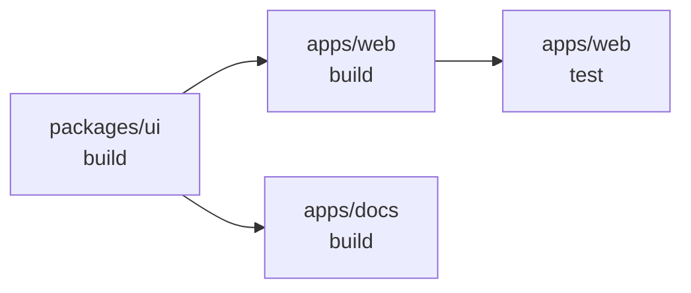

# [FEE-805] Monorepo 與工作區

:::info
將每個套件拆分成獨立 git repository 的團隊，一旦變更需要跨越套件邊界就會撞牆：一個邏輯上
單純的修正會變成好幾個 PR、好幾次發布，以及一段協調空窗期。本文說明 monorepo 模型如何
消除這些額外成本，以及 Turborepo 和 Nx 如何在 pnpm、Yarn、npm 與 Bun 提供的原始工作區
工具之上，加入具備快取、可平行執行的任務圖。內容涵蓋具體設定，包含 `pnpm-workspace.yaml`、
`turbo.json` 與 `workspace:*` 協定，以 Turborepo 作為主要範例，並在結尾說明 monorepo
不適用的情境，以及 Module Federation 這個替代方案。
:::

## 背景

前端工程發展初期，每個專案都存放在各自獨立的 git repository 中。這種模型稱為 polyrepo，
給予團隊充分的自治：獨立的部署週期、分離的 CI 流程，以及互不干擾的套件管理 lockfile。當
各套件獨立演進、變更很少跨越邊界時，這個模型運作良好。

然而在規模擴大之後，polyrepo 模型開始崩潰。一個由五個應用程式共用的 UI 設計系統是獨立
的 npm 套件。若要提交一個同時涉及設計系統和兩個消費端應用的修正，團隊必須橫跨三個
repository 開三個 PR、協調三次審查、將新版設計系統發布到 npm、更新每個消費端的依賴、
並等待傳遞窗口。實際的程式碼變更，往往只有五行甚至更少，卻被埋在一個跨多天、跨多團隊的
協調問題裡。Git submodule 是傳統的逃生出口，但眾所周知地脆弱：submodule 狀態不會自動同步，
巢狀 submodule 造成深層的手動更新樹，CI 設定也在每個消費端重複出現。

Monorepo 模型將所有相關套件（應用程式、函式庫、共用設定）放進單一 git repository。一個
跨三個套件的變更只需一次 commit、一個 PR、一次 CI 執行。內部套件透過 symlink 直接互相
參照，不需要發布到 registry。工具、CI 設定和 lint 規則在根目錄共用。

這並非新概念。Google、Meta 和 Microsoft 數十年來都以百萬檔案規模運作 monorepo。在
JavaScript 生態系中，Babel、Jest、React、Vue 等專案也早早採用了 monorepo。大多數團隊
面臨的挑戰是工具：`npm install` 不理解多套件工作區，在每個套件目錄手動執行 `npm run build`
根本無法擴展。Lerna（2015 年）和 Rush（2017 年）是最早被廣泛使用的 JavaScript monorepo
任務協調器，負責處理逐套件的腳本執行與多套件發布；套件管理工具後來才加入原生的
workspace 支援（npm 7 於 2020 年，pnpm 和 Yarn 更早）。Turborepo 和 Nx 是目前的主流
協調器，加入了傳統 Lerna 所缺乏的內容雜湊快取與依賴感知任務圖（Rush 早已具備基於雜湊的
增量與平行建置，但在 JavaScript 生態系中一直較為小眾）；Lerna 本身現在則將任務執行委派
給 Nx，而非與之競爭。

本文以 Turborepo 作為主要範例，因為它精簡的設定介面能讓任務圖與快取的運作直接可見，並在
全文中以比較的方式討論 Nx、pnpm/Yarn/npm 工作區與 Bun 工作區。

## 視覺化

### Turborepo 任務 DAG

下圖顯示了一個小型 monorepo，其中包含跨兩個應用程式和一個共用函式庫的三個任務，並以有向
無環圖（DAG）建模。箭頭從依賴指向被依賴：一個任務需等待箭頭指向它的所有任務完成。



設定 `dependsOn: ["^build"]` 後，`turbo run build test` 的執行順序如下：

1. 先建置 `packages/ui`（沒有上游依賴）。
2. `packages/ui:build` 完成後，平行建置 `apps/web` 和 `apps/docs`。
3. `apps/web:build` 完成後，執行 `apps/web:test`。

若 `packages/ui` 的原始碼檔案自上次執行以來未有變更，步驟 1 就是快取命中。Turborepo 會
從快取還原 `dist/` 並跳過重新執行建置腳本。

## 範例

### 1. `pnpm-workspace.yaml`

放在 repository 根目錄。宣告哪些目錄包含工作區套件。

```yaml
packages:
  - 'apps/*'       # Next.js 應用程式、Remix 應用程式等
  - 'packages/*'   # 共用函式庫和設定

  # 明確排除不是真實套件的目錄。
  - '!**/test/**'
  - '!**/fixtures/**'
```

### 2. `turbo.json`：任務設定

Turborepo 讀取 repository 根目錄的這個檔案。`tasks` 中的每個 key 是一個任務名稱，
對應到各套件 `package.json` 的 `scripts` 項目。

```json
{
  "$schema": "https://turborepo.dev/schema.json",
  "tasks": {
    "build": {
      "dependsOn": ["^build"],
      "outputs": ["dist/**", ".next/**", "!.next/cache/**"]
    },
    "test": {
      "dependsOn": ["build"],
      "outputs": []
    },
    "lint": {
      "outputs": []
    },
    "dev": {
      "cache": false,
      "persistent": true
    }
  }
}
```

關鍵屬性說明：

- `dependsOn: ["^build"]`：`^` 前綴表示「先執行所有上游依賴的 `build`」。依賴某函式庫
  的應用程式，會先建置該函式庫再建置自身。
- `dependsOn: ["build"]`（無 `^`）：同一套件的 `build` 必須在 `test` 開始之前完成。
  用於同套件內的任務排序。
- `outputs`：Turborepo 快取的檔案 glob。快取命中時，這些檔案從快取還原，不重新執行腳本。
  空陣列表示不快取任何檔案輸出（但日誌仍會被快取）。
- `cache: false`：完全停用快取。用於開發伺服器和其他不應快取的長時間運行任務。
- `persistent: true`：標記無限期運行的任務（開發伺服器）。Turborepo 最後啟動這些任務
  並保持它們運行。

### 3. 根目錄 `package.json` 含工作區腳本與 turbo

```json
{
  "name": "my-monorepo",
  "private": true,
  "scripts": {
    "build": "turbo run build",
    "test": "turbo run test",
    "lint": "turbo run lint",
    "dev": "turbo run dev",
    "build:web": "turbo run build --filter=./apps/web"
  },
  "devDependencies": {
    "turbo": "^2.0.0"
  },
  "packageManager": "pnpm@9.15.0"
}
```

執行過濾後的建置（只建置 `apps/web` 及其依賴）：

```bash
turbo run build --filter=./apps/web
```

`--filter` 旗標接受套件名稱、glob 路徑或以 git 為基礎的表達式：

```bash
# 所有自 main 分出來後有變更的套件
turbo run build --filter=...[origin/main]

# 特定套件及所有依賴它的套件
turbo run build --filter=...packages/ui...
```

### 4. 內部套件：`packages/ui/package.json`

```json
{
  "name": "@myrepo/ui",
  "version": "0.0.1",
  "private": true,
  "main": "./dist/index.js",
  "types": "./dist/index.d.ts",
  "exports": {
    ".": {
      "import": "./dist/index.js",
      "types": "./dist/index.d.ts"
    }
  },
  "scripts": {
    "build": "tsc --project tsconfig.build.json",
    "dev": "tsc --watch"
  },
  "devDependencies": {
    "typescript": "^5.4.0"
  }
}
```

消費端應用程式使用 `workspace:*` 協定參照它：

```json
{
  "name": "@myrepo/web",
  "dependencies": {
    "@myrepo/ui": "workspace:*"
  }
}
```

`workspace:*` 告訴 pnpm 將 `@myrepo/ui` 解析到本地工作區套件，並在 `node_modules` 中
建立 symlink。`*` 在套件發布時（例如 `pnpm publish`）會被替換為實際版本號。在開發期間，
從 `@myrepo/ui` 的 import 透過 symlink 直接解析到 `dist/` 目錄（若使用 TypeScript `paths`
設定則解析到原始碼）。

Yarn 和 Bun 支援相同的 `workspace:*` 協定。npm workspaces 則改用 `"*"` 作為版本值，但
symlink 行為是相同的。Turborepo 可跨 pnpm、npm、Yarn 與 Bun 工作區運作。

### 5. 不使用任務執行器的 pnpm 遞迴執行

對於小型 monorepo，任務執行器可能是殺雞用牛刀。pnpm 內建的遞迴指令已經足夠：

```bash
# 依依賴順序建置所有套件（pnpm 從工作區依賴推斷順序）
pnpm -r run build

# 只在有定義該腳本的套件中執行
pnpm -r run test --if-present

# 在特定套件中執行
pnpm run build --filter @myrepo/ui
```

當 CI 時間開始讓人痛苦時再升級到 Turborepo。`turbo.json` 可以疊加在現有的 pnpm 工作區
之上，不需要重新結構化任何東西。

### 6. Nx：專案圖與 affected 執行

Nx 不需要為每個腳本在 `nx.json` 中宣告任務；它會從 `package.json` 依賴和原始碼 import
推斷出專案圖。

```bash
# 只對自 main 以來有變更的套件執行 build 和 test
nx affected -t build test

# 在瀏覽器中視覺化專案圖
nx graph

# 產生一個新的函式庫套件
nx generate @nx/js:library packages/utils

# 執行單一套件的任務
nx run @myrepo/ui:build
```

`nx affected` 將當前分支與基礎分支（預設為 `main`）比較，識別哪些檔案有變更，透過
專案圖追蹤哪些套件擁有這些檔案，然後只對受影響的套件及其依賴端執行任務。在一個有五十個
套件的 monorepo 中，若只有一個工具函式改變，`nx affected` 可能只對三個套件執行任務而非
五十個，這是顯著的 CI 時間縮減，而且不需要手動設定過濾器。

## 最佳實踐

**應在 `turbo.json` 的每個任務中明確宣告 `outputs`，包含任務所有寫入的目錄。**
若省略 `outputs`，Turborepo 會將任務標記為已快取，但在快取命中時不會還原任何檔案。一個預期 `dist/` 存在的下游任務將會失敗。建置腳本寫入的每一個目錄（`"dist/**"`、`".next/**"`、`"build/**"`）都必須出現在 `outputs` 中，這樣 Turborepo 才能在快取命中時還原它們。

**必須在根目錄 `package.json` 和所有僅供內部使用的套件上標記 `"private": true`。**
Monorepo 根目錄是工作區清單，而非可發布的套件。沒有 `"private": true`，在根目錄執行 `pnpm publish` 會意外地發布這個清單。所有工作區根目錄和僅供內部使用的套件都必須標記為 private，以防止意外發布到 registry。

**應從 repository 根目錄管理工作區依賴，而非在個別套件目錄內部管理。**
在套件子目錄中執行 `npm install` 或 `pnpm install`，會在該目錄建立獨立的 `node_modules` 和 lockfile，這會破壞工作區的 symlink，並形成相互衝突的孤立依賴解析。請務必從根目錄使用 `pnpm add <package> --filter <workspace>` 來為特定工作區安裝依賴。

**應先從 `pnpm -r run build` 開始，等 CI 時間成為具體問題後再引入 Turborepo。**
對於有五個或更少套件的 monorepo，pnpm 的遞迴指令已經足夠。當循序建置或重建未變更的套件明顯拖慢 CI 時，Turborepo 的任務 DAG、快取和平行執行才真正值得引入。透過在現有工作區中加入 `turbo.json` 來增量採用 Turborepo，不需要任何重新結構化。

**應在 `turbo.json` 中，將有不確定性輸出或進行網路呼叫的任務標記為 `"cache": false`。**
Turborepo 的快取基於內容雜湊：相同的輸入永遠產生相同的快取命中。若某個任務抓取即時資料、寫入時間戳記或產生隨機輸出，快取將還原過期的結果。開發伺服器任務（`dev`）也應標記為 `"cache": false` 和 `"persistent": true`，以便 Turborepo 最後啟動它們並保持運行。

## 設計思維

**為何 monorepo 在大型團隊中勝出：跨切面變更問題。**
在 polyrepo 中，共用程式碼要嘛需要發布到 npm（回饋週期緩慢：發布、等待傳遞、更新消費端
`package.json`、安裝、測試），要嘛使用 git submodule（脆弱、手動、容易出錯）。一個涉及
共用工具函式和三個消費端的重構，需要橫跨四個 repository 進行協調變更，包含四個 PR 和
四個 CI 流程，而且沒有辦法讓這個變更具備原子性。若重構採分階段進行（先出貨函式庫，再更新
消費端），就必須明確管理某些消費端使用新 API、某些仍使用舊 API 的中間狀態。在 monorepo
中，同樣的重構只是一次 commit、一個 PR、一次 CI 執行。

**為何 `pnpm -r run build` 在規模擴大後不夠用。**
pnpm 的遞迴執行（`pnpm -r run build`）會遍歷所有工作區套件並執行它們的 `build` 腳本。
對於只有五個套件的小型 monorepo，這完全夠用。對於有五十個套件的 monorepo，它有兩個問題。
第一，預設是循序執行：即使套件之間沒有依賴關係，也是一次建置一個。一個本可在四分鐘平行
完成的 CI 執行，需要花二十分鐘。第二，沒有快取：每次 CI 執行都從頭重新建置所有套件，
即使上次執行以來原始碼根本沒有改變的套件也不例外。Turborepo 和 Nx 透過將任務建模為依賴
圖（DAG）、平行執行無依賴的任務、以及對輸入進行雜湊以跳過輸出已在快取中的任務，同時
解決了這兩個問題。

**為何 Turborepo 和 Nx 在設計哲學上分歧。**
Turborepo 刻意保持精簡。它在你現有的套件管理工具和現有的 `package.json` 腳本之上，加入
任務 DAG 和快取層，全部收斂在一個設定檔（`turbo.json`）中。專案結構、鷹架搭建與邊界規則
則留給你自行決定。這使得增量採用變得容易：你可以在一個下午之內將 Turborepo 加入現有的
pnpm 工作區。

Nx 則意見鮮明且功能完備。它透過原始碼分析建立詳細的專案圖，追蹤套件之間的每一個檔案
依賴，提供程式碼產生器（`nx generate`），透過 ESLint 插件強制模組邊界規則，並提供具有
細粒度任務結果重播功能的分散式任務執行（Nx Cloud）。額外的功能需要更多設定和更陡的學習
曲線。當大型組織需要治理時，Nx 是更好的選擇：在團隊負責的套件之間強制邊界、透過中央管理
的產生器確保一致的鷹架搭建、以及細粒度地了解哪些任務在哪些 CI agent 上執行、以及原因。

**Polyrepo 與 monorepo 的取捨。**
Monorepo 需要前期的工具投資：工作區設定、任務執行器、一致的依賴策略。非常大的 repository
（數百萬個檔案、數百個套件）可能使 git 操作承壓：`git status`、`git log` 和 IDE 索引
都會變慢。在那種規模下運作的公司會使用針對此問題打造的客製化工具：Meta 使用 Mercurial
衍生工具（Sapling）搭配 EdenFS 虛擬檔案系統，Google 則使用 Piper 搭配基於 FUSE 的虛擬
檔案系統，這些都是大多數團隊永遠用不到的工具。對大多數團隊來說，在最多幾百個套件的規模
內，配備 Turborepo 或 Nx 的 pnpm 工作區完全能應對這個規模。反對 monorepo 更有力的論點是
團隊自治：所有團隊共用同一個 CI 流程、同一個根目錄工具設定，以及同一個發布關卡。一個
套件中不穩定的測試會阻塞整個 CI 執行。透過 `CODEOWNERS` 建立明確的所有權，以及使用任務
過濾（`turbo run build --filter=./apps/web`）可以緩解這個問題，但協調成本是真實存在的。

**內部套件：原始碼直接消費 vs 編譯後消費。**
內部套件（共用設計系統、工具函式庫、共用型別套件）可以用兩種方式消費。較簡單的做法：
在根目錄的 `tsconfig.json` 中設定 TypeScript `paths`，將套件名稱對應到其原始碼目錄。
消費端套件直接從原始碼 import；內部套件不需要建置步驟。這對只有 TypeScript 而沒有獨立
編譯步驟的套件非常適合。更明確的做法：內部套件有自己的 `build` 腳本，會產生 `dist/`
目錄，消費端套件參照 `dist/`。這種方式模擬了套件對外發布時的使用方式，讓 Turborepo 可以
快取建置結果，使消費端應用程式只有在函式庫的原始碼改變時才需要重新建置。

## 常見錯誤

**在將被發布的公開套件中使用 `workspace:*`。**
`workspace:*` 是開發時期的協定。pnpm 和 Yarn 在 `pnpm publish` 時會將它替換為實際版本號。
若你不小心在沒有透過工作區工具鏈發布的情況下提交了含有 `workspace:*` 的公開（非 private）
套件的 `package.json`，發布的 tarball 將包含字面上的 `workspace:*`，而這在 npm registry
上是無法解析的。請務必透過 `pnpm publish` 或 Changesets 發布工作區套件，不要手動打包。

**將 Nx 視為 Turborepo 的直接替換。**
Turborepo 是一個帶快取的任務執行器。Nx 是一個擁有自己的專案圖、產生器和 lint 規則的
完整 monorepo 平台。從 Turborepo 遷移到 Nx 不是重新命名設定檔；它需要學習 Nx 的專案
偵測、executor 系統和邊界強制執行。在承諾採用某個工具之前，請評估哪個工具適合你的團隊。
較簡單的團隊應預設選擇 Turborepo；需要強制所有權和企業級治理的團隊應評估 Nx。

**忽略 Module Federation 作為替代方案。**
Module Federation（Webpack 5 / Rspack）是一個程式碼共用的替代方案：獨立部署的應用程式
在執行時透過遠端 URL 載入彼此的模組，而非在建置時 import。這完全避免了共用建置：每個
應用程式都獨立建置和部署。代價是執行時耦合：若遠端應用程式關閉或推出了破壞性 API 變更，
消費端應用程式會在執行時崩潰，而非在建置時失敗。當團隊需要完全獨立的部署週期並願意
管理執行時版本相容性時，Module Federation 是合適的工具。當目標是原子性的跨切面變更時，
它並非正確的工具；那個問題需要 monorepo 來解決。

## 延伸閱讀

- **FEE-800：建置工具與模組系統總覽。** monorepo 工具所屬的更大建置流程。
- **FEE-804：套件管理（npm、pnpm 與 Yarn）。** 支撐工作區設定的 workspace 協定、lockfile
  與 `--frozen-lockfile`。
- **FEE-807：建置最佳化。** Turborepo 遠端快取（Vercel、S3、GitHub Actions cache）與
  CI 中的快取 key 策略。

## 參考資料

- [Turborepo：設定任務](https://turborepo.dev/docs/crafting-your-repository/configuring-tasks)
- [Turborepo：快取](https://turborepo.dev/docs/crafting-your-repository/caching)
- [Turborepo：遠端快取](https://turborepo.dev/docs/core-concepts/remote-caching)
- [Turborepo：turbo.json 參考](https://turborepo.dev/docs/reference/configuration)
- [Nx：心智模型](https://nx.dev/docs/concepts/mental-model)
- [Nx：只執行受 PR 影響的任務](https://nx.dev/docs/features/ci-features/affected)
- [Nx：分散式任務執行](https://nx.dev/docs/features/ci-features/distribute-task-execution)
- [pnpm：工作區](https://pnpm.io/workspaces)
- [pnpm：pnpm-workspace.yaml](https://pnpm.io/pnpm-workspace_yaml)
- [Nx：什麼是 Monorepo？](https://nx.dev/docs/kb/what-is-a-monorepo)
- Rachel Potvin 與 Josh Levenberg,「Why Google Stores Billions of Lines of Code in a Single Repository」, Communications of the ACM, 第 59 卷 (2016). https://cacm.acm.org/research/why-google-stores-billions-of-lines-of-code-in-a-single-repository/
- Steve Kinney,「Turborepo versus Nx, Bazel, Lerna, and Friends」, Enterprise UI. https://stevekinney.com/courses/enterprise-ui/turborepo-versus-nx
- 「Monorepo in 2026: Turborepo vs Nx vs Bazel for Modern Development Teams」, daily.dev (2026). https://daily.dev/blog/monorepo-turborepo-vs-nx-vs-bazel-modern-development-teams/
