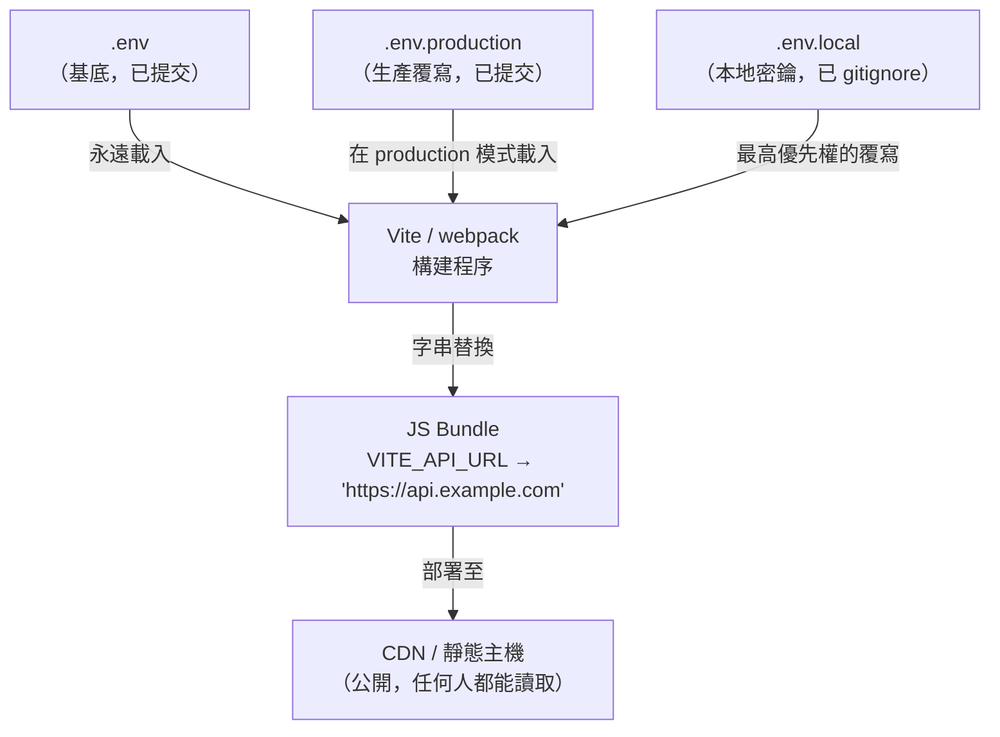
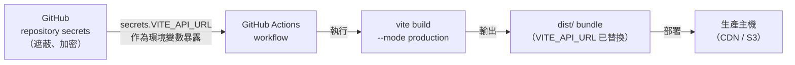

# 環境變數與構建配置

## 背景

在後端開發中，`process.env` 是一個即時存在的物件。當你的 Node.js 伺服器啟動時，作業系統
會將環境變數載入到程序中，每次呼叫 `process.env.DATABASE_URL` 都會在執行時期讀取當下的值。
你可以修改環境變數、重啟伺服器，完全不需要動到程式碼。

前端程式碼在瀏覽器中執行。瀏覽器沒有作業系統環境，沒有 `process` 物件，也無法在執行時期
查詢伺服器端的 runtime。那麼，環境變數在前端究竟是如何運作的？

答案是**構建時期的字串替換（build-time string substitution）**。當你在 Vite 專案中撰寫
`import.meta.env.VITE_API_URL` 時，打包工具（bundler）會在程式碼抵達瀏覽器之前，將該表達式
替換為字面值字串——例如 `"https://api.example.com"`。輸出的 bundle 中完全沒有環境變數的參照；
它只包含硬編碼的字串。這有一個關鍵含意：**JS bundle 是公開的產物（public artifact）**。
任何人只要打開 DevTools、閱讀你的 bundle，就能看到所有被替換進去的值。

這個區別——構建時期替換 vs. 執行時期環境——是本文一切討論的基礎。

## 最佳實踐

**絕對不能將密鑰（API 金鑰、auth token、資料庫密碼、簽章金鑰）放入任何前端環境變數。**
前端環境變數在構建時期就被替換進 JS bundle。Bundle 是公開的產物——任何人只要使用瀏覽器 DevTools 就能讀取所有被替換的值。沒有任何執行時期機制能隱藏已內嵌到客戶端 JavaScript 中的值。密鑰應放在伺服器端環境變數或 CI secrets 中，永遠不要轉發到客戶端 bundle。

**必須使用框架指定的前綴，作為每個暴露給客戶端 bundle 的變數的明確宣告。**
Vite 只暴露帶有 `VITE_` 前綴的變數；其他變數可在 `vite.config.ts` 和伺服器端程式碼中使用，但會從客戶端 bundle 中被剝除。Next.js 使用 `NEXT_PUBLIC_*`，機制相同。這個前綴是必要的關卡，在每次將變數設為公開時強制進行有意識的決策。同時也應在 `.d.ts` 檔案中擴增 `ImportMetaEnv`，讓變數名稱的拼寫錯誤能產生 TypeScript 編譯錯誤。

**應將包含非敏感預設值的 `.env` 和 `.env.production` 提交版控；絕對不能提交 `.env.local`。**
`.env.local` 依慣例被 gitignore，專門存放開發者本機的密鑰和覆寫值，絕不能進入版本控制。一個含有真實 API 金鑰的 `.env.local` 被意外提交，是前端專案中最常見的認證資訊洩漏之一。Vite 的腳手架（`pnpm create vite`）會自動將 `.env.local` 和 `.env.*.local` 加入 `.gitignore`；手動建立的專案必須明確加入這些條目。

**在 CI 構建時期，應使用 GitHub Actions 的 `secrets`（而非 `vars`）注入每個敏感值。**
Repository `vars` 在 repository 設定 UI 中可見，且在 workflow 日誌摘要中以明文顯示。Repository `secrets` 則是加密儲存的，在所有日誌輸出中會被遮蔽，且設定後無法查看。API 金鑰、token，以及任何不應讓具有 repository 讀取權限的人看到的值，都應使用 `secrets`。`vars` 僅保留給真正無敏感性的設定值，例如部署區域名稱。

**當值需要在不重新構建的情況下因部署而異時，應使用執行時期設定模式，而非構建時期環境變數。**
構建時期替換會在構建時凍結值。變更一個值需要觸發新的構建和重新部署。對於功能旗標、A/B 測試設定，或與程式碼變更無關而獨立變更的每個租戶設定，應優先考慮在啟動時從 API 取得設定、透過伺服器的 `window.__APP_CONFIG__` 注入，或使用 Vercel Edge Config 等 edge config 服務。

## 設計思維

**`VITE_*` 前綴的存在意義：防止意外洩露**

如果沒有命名規則作為防護，開發者可能會寫出 `import.meta.env.DB_PASSWORD`，而打包工具會
毫不猶豫地將資料庫密碼替換進公開的 JS bundle。Vite 的解決方案是明確的選擇機制（explicit
opt-in）：只有帶有 `VITE_` 前綴的變數才會被打包進客戶端程式碼。`.env` 檔案中其他所有
變數可在 `vite.config.ts` 和伺服器端程式碼（Vite SSR、API routes）中存取，但在客戶端
bundle 輸出之前就會被剝除。你必須刻意地輸入 `VITE_` 前綴才能暴露一個變數——這是一道強迫
你做出決策的關卡。

Next.js 的 `NEXT_PUBLIC_` 基於同樣的理由、採用同樣的機制：在構建時期，Webpack 的
DefinePlugin 會將 `process.env.NEXT_PUBLIC_ANALYTICS_ID` 替換為字面值字串。沒有前綴的
變數可在 `getServerSideProps`、API routes 和 Server Components 中取得，但永遠不會被包含
進客戶端 bundle。

**為何前端環境變數在構建時期就被凍結**

在典型的部署流程中，Vite 應用程式會產出一個 `dist/` 目錄，其中是靜態檔案：HTML、CSS 和 JS。
這些檔案被上傳到 CDN 或物件儲存。沒有正在執行的伺服器可以查詢，沒有程序可以檢查。JS 是靜態
的。這就是為什麼「修改環境變數後重啟」是後端概念，不適用於前端。要改變前端環境變數的值，
你必須觸發一次新的構建並重新部署。

**多環境挑戰：staging vs. production**

大多數應用程式至少需要三種設定：本地開發（dev server 指向本地 API）、staging（CI 構建指向
staging API）、production（CI 構建指向生產 API）。`.env` 的檔案串聯（cascade）解決了本地
與共用環境的分離。CI 解決了 staging 與 production 的差異：相同的變數名稱（`VITE_API_URL`）
在不同的 CI 環境中持有不同的值，從 repository secrets 或環境範圍的 secrets 中注入。

**為何 TypeScript 設定檔勝出**

早期的構建工具使用純 JS 或 JSON 設定檔（`.babelrc`、`webpack.config.js`）。這些檔案無法
被型別檢查。插件選項名稱的拼寫錯誤是靜默失敗，只在執行時期才會被發現。Vite 預設使用
`vite.config.ts`——一個由相同工具鏈處理的 TypeScript 檔案——讓插件選項有完整的 IDE 自動補全
和編譯時期型別檢查。設定檔也會接收當前的 `mode` 作為參數，讓設定可以程式化：依據構建是為
staging 還是 production，使用不同的 `define` 值、不同的插件組合，或不同的 `build.target`。

## 視覺化

### .env 串聯 → 構建時期替換 → 公開 bundle



優先順序（由高至低）：`.env.development.local` > `.env.local` > `.env.development` > `.env`
（適用於 development 模式）。將 `development` 替換為 `production` 或任何自訂模式名稱即可
套用相同規則。

### CI secrets 注入流程



注意：GitHub Actions 的 `secrets` 值在所有日誌輸出中都會以 `***` 遮蔽。Repository 的
`vars` 則在日誌和 UI 中以明文顯示。對於任何不希望有日誌存取權的人能看到的值，請使用
`secrets`。

## 範例

### 1. `.env` 檔案結構

基底檔案和本地覆寫檔案，分別對應「已提交」和「已 gitignore」：

```bash
# .env  — 已提交，只放安全的預設值
VITE_APP_NAME="My App"
VITE_API_URL="http://localhost:3000"

# .env.production  — 已提交，生產環境預設值
VITE_API_URL="https://api.example.com"
VITE_ANALYTICS_KEY="GA-PLACEHOLDER"

# .env.local  — 絕對不要提交（.gitignore 必須包含此檔）
# 本地開發者覆寫值，以及任何不想放進 git 的值。
VITE_API_URL="http://localhost:4000"   # 個人開發覆寫
STRIPE_SECRET_KEY="sk_test_..."       # 無 VITE_ 前綴：僅限伺服器端使用
```

`.gitignore` 範例（Vite 腳手架會自動加入）：

```
.env.local
.env.*.local
```

### 2. 在 Vite 應用中存取環境變數

```typescript
// src/config.ts
export const config = {
  apiUrl: import.meta.env.VITE_API_URL,
  appName: import.meta.env.VITE_APP_NAME,
  analyticsKey: import.meta.env.VITE_ANALYTICS_KEY,
  isProd: import.meta.env.PROD,       // boolean，MODE === 'production' 時為 true
  isDev: import.meta.env.DEV,         // boolean，MODE === 'development' 時為 true
  mode: import.meta.env.MODE,         // 字串：'development' | 'production' | 'staging' | ...
} as const;
```

為自訂變數加入 TypeScript 型別定義以啟用 IntelliSense：

```typescript
// src/vite-env.d.ts  (或 env.d.ts)
/// <reference types="vite/client" />

interface ImportMetaEnv {
  readonly VITE_API_URL: string;
  readonly VITE_APP_NAME: string;
  readonly VITE_ANALYTICS_KEY: string;
}

interface ImportMeta {
  readonly env: ImportMetaEnv;
}
```

以自訂模式執行構建：

```bash
# Development 模式（vite dev 的預設值）
vite

# Production 模式（vite build 的預設值）
vite build

# 自訂 'staging' 模式：載入 .env.staging 和 .env.staging.local
vite build --mode staging
```

### 3. 具有模式感知的 `vite.config.ts`

```typescript
import { defineConfig, loadEnv } from 'vite';
import vue from '@vitejs/plugin-vue';
import type { ConfigEnv } from 'vite';

export default defineConfig(({ mode }: ConfigEnv) => {
  // 為當前模式載入 env 檔案。
  // process.cwd() = 專案根目錄。第三個引數 '' 表示載入所有變數，
  // 而不只是 VITE_* 變數——在設定檔內部使用非常方便。
  const env = loadEnv(mode, process.cwd(), '');

  return {
    plugins: [vue()],

    define: {
      // 自訂全域常數替換（與 import.meta.env 不同）。
      // 這些值在構建時期被內嵌，類似 webpack 的 DefinePlugin。
      __APP_VERSION__: JSON.stringify(process.env.npm_package_version),
      __BUILD_DATE__: JSON.stringify(new Date().toISOString()),
    },

    build: {
      // 生產環境針對現代瀏覽器；staging 支援更廣的範圍。
      target: mode === 'production' ? 'es2022' : 'es2019',
      sourcemap: mode !== 'production',
    },

    server: {
      proxy: {
        '/api': {
          target: env.VITE_API_URL,
          changeOrigin: true,
        },
      },
    },
  };
});
```

重點說明：

- `loadEnv(mode, root, prefix)` — 為指定模式載入 `.env` 檔案並回傳純物件。空字串前綴（`''`）
  載入所有變數，包含沒有 `VITE_` 的變數。這是安全的，因為 `loadEnv` 只在 Node.js 構建程序
  中執行，永遠不會在瀏覽器中執行。
- `define` — 執行全域字串替換，類似 webpack 的 DefinePlugin。值必須是可序列化的；字串要用
  `JSON.stringify` 包裝以避免語法錯誤。
- 設定函式直接接收 `mode`，讓條件邏輯不需要從 `import.meta.env` 導入（它是瀏覽器 API，
  在設定檔中無法使用）。

### 4. GitHub Actions workflow：從 secrets 注入環境變數

```yaml
# .github/workflows/deploy.yml
name: Build and Deploy

on:
  push:
    branches: [main]

jobs:
  build:
    runs-on: ubuntu-latest
    environment: production   # 限定使用 production 環境的 secrets

    steps:
      - uses: actions/checkout@v4

      - uses: pnpm/action-setup@v4
        with:
          version: 9

      - uses: actions/setup-node@v4
        with:
          node-version: '22'
          cache: 'pnpm'

      - run: pnpm install --frozen-lockfile

      - name: Build for production
        run: pnpm vite build --mode production
        env:
          # 從 GitHub repository secrets 取得（在所有日誌中遮蔽）。
          # 左側的變數名稱是構建程序所見的名稱。
          VITE_API_URL: ${{ secrets.PROD_API_URL }}
          VITE_ANALYTICS_KEY: ${{ secrets.PROD_ANALYTICS_KEY }}
          # 無前綴的變數——可在 vite.config.ts 中使用，但不會進入 bundle。
          SENTRY_AUTH_TOKEN: ${{ secrets.SENTRY_AUTH_TOKEN }}

      - name: Deploy dist to S3
        run: aws s3 sync dist/ s3://my-bucket --delete
        env:
          AWS_ACCESS_KEY_ID: ${{ secrets.AWS_ACCESS_KEY_ID }}
          AWS_SECRET_ACCESS_KEY: ${{ secrets.AWS_SECRET_ACCESS_KEY }}
```

`environment: production` 欄位將此 job 限定到 GitHub 中的 `production` 環境，該環境可以擁有
獨立於 repository 層級的 secrets。這讓同一個 workflow 檔案只需修改一行，就能透過注入不同的
`VITE_API_URL` 密鑰值，部署到 staging 或 production。

### 5. 執行時期環境變數（進階）：真正動態的設定

當你需要在不重新構建的情況下，為不同部署提供不同的值（功能旗標、A/B 測試設定、每個租戶
的設定），構建時期替換就不是正確的工具了。以下是三種模式：

**模式 A：在應用程式啟動時從 API 端點取得設定**

```typescript
// src/bootstrap.ts — 在渲染應用程式之前呼叫
export async function loadConfig(): Promise<void> {
  const res = await fetch('/api/config');
  const data = await res.json();
  Object.assign(window.__APP_CONFIG__, data);
}
```

**模式 B：從伺服器注入至全域物件**

伺服器（Node.js、Nginx，或 CDN edge function）在每次請求時改寫 HTML：

```html
<!-- index.html -->
<script>
  window.__APP_CONFIG__ = {
    featureFlags: { newDashboard: false },
    apiUrl: "https://api.example.com"
  };
</script>
```

**模式 C：使用 Edge Config 服務**

Vercel Edge Config 和 Cloudflare KV 允許以毫秒以下的延遲從 CDN 邊緣節點讀取鍵值對，
且可在不重新部署的情況下更新值：

```typescript
import { get } from '@vercel/edge-config';

export const config = {
  apiUrl: await get('apiUrl'),
  featureNewDashboard: await get('featureNewDashboard'),
};
```

模式 C 在運維上最靈活，但會與特定平台耦合。模式 A 移植性最佳。模式 B 適用於 HTML 生成
本來就按請求進行的伺服器渲染應用程式。

## 常見錯誤

**將密鑰放入 `VITE_*` 變數。**
一個常見的錯誤是將 `VITE_API_KEY` 和 `API_KEY` 視為相同。任何 `VITE_*` 變數都會被字面地
嵌入 JS bundle。使用者可以打開瀏覽器 DevTools 的 Network 分頁，找到 JS 檔案，然後搜尋那個
值。密鑰請使用無前綴的變數——它們可在 `vite.config.ts` 和伺服器端程式碼中取得，但會從
客戶端 bundle 中被剝除。

**忘記將 `.env.local` 加入 `.gitignore`。**
Vite 的腳手架（`pnpm create vite`）會自動將 `.env.local` 和 `.env.*.local` 加入
`.gitignore`。若你手動建立專案，必須自己加入這些條目。一個被意外提交的 `.env.local`，
裡面帶著開發者個人的 API 金鑰，是常見的認證資訊洩漏來源。

**在 GitHub Actions 中為敏感值使用 `vars` 而非 `secrets`。**
GitHub repository 的 `vars` 在 repository 設定 UI 中是可見的，且在 workflow 日誌摘要中
以明文顯示。任何對 repository 有讀取權限的人都能看到它們。對於任何應受限制存取的值，請
使用 `secrets`：API 金鑰、token、密碼。只對真正無敏感性的設定值使用 `vars`（例如部署區域
名稱）。

**期望修改環境變數後不需重新構建就能生效。**
更新 `.env.production` 中的值或 GitHub Actions secret 之後，必須進行新的構建和部署，
變更才會生效。舊的 bundle 仍然包含舊的硬編碼值。這個問題常令從後端工作轉來的開發者感到
困惑——後端只需修改環境變數並重啟程序即可生效。

**在 `vite.config.ts` 中存取 `import.meta.env`。**
`import.meta.env` 是 Vite 注入到已打包客戶端程式碼中的瀏覽器 API。它在設定檔本身（在
Node.js 中執行）中並不存在。在 `vite.config.ts` 中讀取 `.env` 檔案請使用
`loadEnv(mode, cwd)`，或從 `process.env` 讀取 shell 或 CI 環境中設定的變數。

**沒有為 TypeScript 擴增 `ImportMetaEnv`。**
若沒有型別擴增，`import.meta.env.VITE_API_URL` 的型別是 `any`。這意味著變數名稱的拼寫
錯誤（例如 `VITE_API_UR` 而非 `VITE_API_URL`）不會產生任何編譯時期錯誤。請在 `src/` 目錄
的 `.d.ts` 檔案中加入 `ImportMetaEnv` 介面，並將每個自訂變數宣告為 `readonly string`。

**對包含動態值的場景使用 `define`。**
`define` 在縮小（minification）之前執行文字替換。如果值包含特殊字元，或者你試圖從執行
時期來源讀取它，將會得到構建錯誤或安全問題。`define` 僅應用於構建時期已知的值（版本號、
構建日期、靜態功能旗標）。

## 相關 FEE

- **FEE-800** — 構建工具與模組系統總覽：環境變數所處的更大構建流程，包含打包工具如何處理
  原始碼。
- **FEE-801** — 打包工具（Webpack 與 Vite）：DefinePlugin 和 Vite 的 `define`——在構建時期
  實際執行字串替換的機制。
- **FEE-807** — 構建優化：依環境不同的構建設定（sourcemaps、tree-shaking、目標瀏覽器），
  作為環境變數配置的補充。

## 參考資料

- [Vite: Env Variables and Modes](https://vite.dev/guide/env-and-mode)
- [Next.js: Environment Variables](https://nextjs.org/docs/pages/guides/environment-variables)
- [Next.js: Configuring env (App Router)](https://nextjs.org/docs/14/app/building-your-application/configuring/environment-variables)
- [GitHub Docs: Using secrets in GitHub Actions](https://docs.github.com/actions/security-guides/using-secrets-in-github-actions)
- [GitHub Resources: Securing CI/CD Pipelines with Secrets & Variables](https://resources.github.com/learn/pathways/automation/advanced/securing-ci-cd-pipelines-with-secrets-and-variables/)
- [Vercel Edge Config](https://vercel.com/docs/edge-config)
