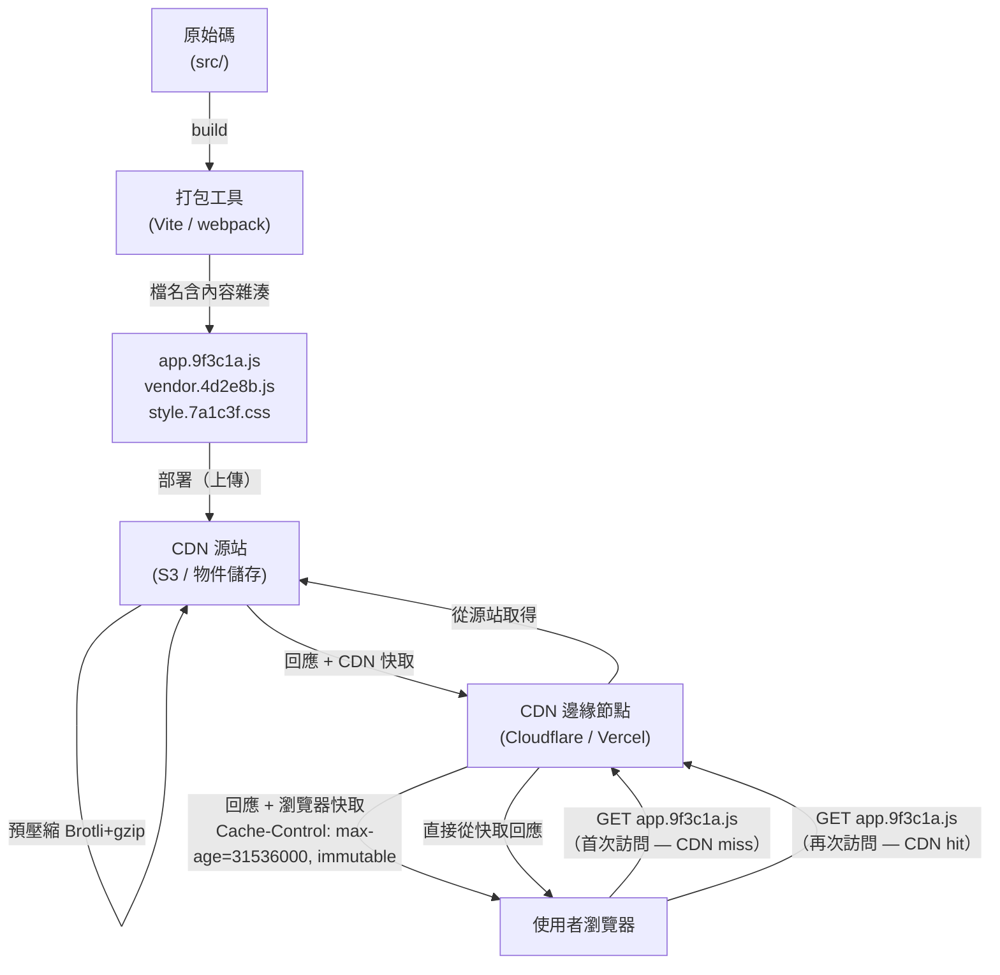

# [FEE-807] 構建最佳化：最小化、快取與產出分析

:::info
未經最佳化的生產環境 bundle，可能送出遠超必要量的 JavaScript；若沒有內容雜湊，每次部署都會迫使使用者重新下載其實沒有變動過的程式碼。四項構建期技術能填補這個落差：最小化縮小程式碼本身，內容雜湊讓瀏覽器能永久快取資產，Tree shaking 移除未使用的匯出，Bundle 分析則揭露輸出中實際包含了什麼。本文也涵蓋構建快取、傳輸壓縮（Brotli 與 zstd）以及關鍵 CSS 提取。文中並更正了兩個在 bundle 最佳化建議中廣泛流傳的數字：moment.js 含所有語系時的實際大小，以及 Brotli 相對於 gzip 的實際壓縮增益。
:::

## 背景

現代前端構建管線（build pipeline）做的不只是把原始碼打包在一起。它還會縮小檔案、以特定方式命名輸出讓瀏覽器能永久快取，並提供工具讓你檢查輸出內容裡究竟裝了什麼。如果沒有這些層次，生產環境的應用程式可能會送出遠超必要量的 JavaScript，而且每次部署都會迫使使用者重新下載其實沒有變動過的檔案。只應存在於伺服器端的程式碼，也可能在不知不覺間滲入客戶端 bundle。

本文涵蓋生產構建最佳化的四大支柱：最小化（縮小資產體積）、Tree shaking（在模組層面移除死碼）、內容雜湊以達成長期快取（讓已快取的資產能無限期有效），以及 Bundle 分析（了解你送出了什麼以及原因）。此外也涵蓋構建快取（避免在 CI 中重複工作）、傳輸壓縮（現代 CDN 上除了 gzip，還有 Brotli 以及日漸普及的 zstd）以及關鍵 CSS 提取（消除阻塞渲染的樣式表）。Rollup 的 Scope hoisting 是一項相關技術，會將模組合併到單一作用域，而非個別包在函式閉包中；範例 3 會將它與 tree shaking 一併說明。

## 視覺對比

### 內容雜湊 + CDN 快取生命週期



**新部署時：** 打包工具會產出 `app.7b4f2d.js`（新的雜湊值）。CDN 從未見過這個 URL，因此是快取未命中，會轉而從源站取得。舊雜湊 URL（`app.9f3c1a.js`）在任何使用者的瀏覽器快取中依然有效，因此正在瀏覽過程中的使用者能順利過渡到新版本。

## 範例

### 1. `vite.config.ts`：最小化、chunk 分割與內容雜湊

Vite 預設的 JS 最小化工具是 Oxc（`build.minify: 'oxc'`），一款內建於 Vite、以 Rust 實作的最小化工具；官方文件指出它比 Terser 快上約 30 至 90 倍，壓縮率僅略差 0.5% 至 2%。CSS 最小化預設使用同樣以 Rust 實作的 Lightning CSS（`build.cssMinify: 'lightningcss'`）。較舊的 Vite 版本（7 及更早）JS 與 CSS 最小化皆預設使用 esbuild；JS 最小化的 `'esbuild'` 選項目前仍可使用，但已標記為棄用（deprecated），而 `cssMinify: 'esbuild'` 仍是受支援的替代選項。當那最後 0.5% 至 2% 的壓縮率值得換來慢上許多的構建速度時，Terser 仍可作為選用項目。

```typescript
import { defineConfig } from 'vite'
import vue from '@vitejs/plugin-vue'

export default defineConfig({
  plugins: [vue()],

  build: {
    // 預設：'oxc'（內建於 Vite，Rust 實作）。'esbuild' 仍可使用，但已棄用。
    // 只有在多出的 0.5%–2% 壓縮率值得換來慢上一個數量級的構建速度時，
    // 才切換到 'terser'。
    minify: 'terser',
    terserOptions: {
      compress: {
        drop_console: true,    // 會連同 console.log 一起移除 error/warn 等所有 console.* 呼叫
        drop_debugger: true,   // 移除 debugger 陳述式
        passes: 2,             // 兩輪處理以獲得更小的輸出
      },
      mangle: {
        toplevel: true,        // 縮短頂層函式/變數名稱
      },
    },

    // CSS 最小化：預設為 Lightning CSS（Rust 實作，速度非常快）。
    // cssnano 是許多 Webpack 設置中沿用已久、以 PostCSS 為基礎的
    // CSS 最小化工具，在該生態圈中依然常見。
    cssMinify: 'lightningcss',

    // 內容雜湊是 Vite 的預設輸出格式。
    // [hash] 衍生自檔案內容，只有在內容改變時才會變化。
    rollupOptions: {
      output: {
        // JS chunks：檔名包含內容雜湊
        chunkFileNames: 'assets/[name]-[hash].js',
        entryFileNames: 'assets/[name]-[hash].js',
        // 靜態資產（圖片、字體）：檔名包含內容雜湊
        assetFileNames: 'assets/[name]-[hash][extname]',

        // Vendor chunk 分割：將第三方套件與應用程式程式碼分開。
        // 目標：小型相依套件更新不會讓 vendor chunk 的快取失效。
        manualChunks(id) {
          if (id.includes('node_modules')) {
            // 將所有 node_modules 分組到單一 'vendor' chunk。
            // 在大型應用程式中採用前，請先參閱下方的注意事項。
            return 'vendor'
          }
        },
      },
    },

    // 生產環境不輸出 sourcemap（或用 'hidden' 搭配 Sentry）。
    sourcemap: false,
  },
})
```

`drop_console` 會連同 `console.log` 一起移除 `console.error` 與 `console.warn`。如果生產環境的錯誤回報或支援流程仰賴 console 輸出，應改用 `pure_funcs: ['console.log', 'console.debug']`，讓警告與錯誤訊息得以保留。

**Vendor chunk 的注意事項：** 如上所示，把每個 `node_modules` 套件都分到同一個 `vendor` chunk 是常見的起手式，但並非毫無風險。Vite 已棄用自家的 `splitVendorChunkPlugin`（vitejs/vite#16274），原因是累積了不少邊界案例（vitejs/vite#16268）——特別是該插件有時會誤把並非由入口靜態引入的模組拉進 vendor chunk。用 `manualChunks` 建立的萬用 `vendor` chunk 也有類似風險：它可能以破壞預期初始化順序的方式分組模組，導致 `Cannot access X before initialization` 這類錯誤，這是 Vite 議題追蹤器與討論串中廣泛回報的失敗模式。這也意味著只要任何一個相依套件更新，整個 vendor chunk 就會拿到新的雜湊值，削弱了它原本應提供的快取效益。應優先採用 Rollup 的預設分塊方式；如果確實要手動分割，應依套件群組分割（`react-vendor`、`ui-vendor`），而非單一的萬用 `vendor` chunk。分割背後完整的快取考量請見〈最佳實踐〉。

### 2. 使用 rollup-plugin-visualizer 進行 Bundle 分析

對於 Webpack 型專案，`webpack-bundle-analyzer` 可提供相同的功能，會啟動互動式的樹圖視覺化。Next.js 使用者可以使用 `@next/bundle-analyzer`，它是 webpack-bundle-analyzer 搭配 Next.js 特定配置的包裝器。

```bash
pnpm add -D rollup-plugin-visualizer
```

```typescript
// vite.config.ts
import { defineConfig } from 'vite'
import { visualizer } from 'rollup-plugin-visualizer'

export default defineConfig({
  plugins: [
    // 設在 ANALYZE 環境變數之後，使其不在每次生產構建時都執行。
    // 放在 plugins 陣列的最後。
    process.env.ANALYZE === 'true' &&
      visualizer({
        filename: 'dist/stats.html', // 報告輸出路徑
        open: true,                  // 構建後自動在瀏覽器開啟
        gzipSize: true,              // 顯示 gzip 壓縮後的大小
        brotliSize: true,            // 顯示 brotli 壓縮後的大小
        template: 'treemap',         // 'treemap' | 'sunburst' | 'flamegraph' | 'network'
      }),
  ].filter(Boolean),
})
```

以獨立的 npm script 執行分析，使其不進入一般構建流程：

```bash
# package.json: "analyze": "ANALYZE=true vite build"
pnpm run analyze
```

報告中需要留意的重點：

- **出乎意料的大型相依套件。** 佔 bundle 超過 20% 的套件值得審視：它支援 tree shaking 嗎？是否有更輕量的替代方案？
- **重複的套件。** 同一個套件的兩個不同版本（例如 `lodash` 和 `lodash-es`，或 monorepo 中的兩個 React 版本）會分別顯示為獨立的區塊。
- **非預期的引入。** 不應進入客戶端 bundle 的伺服器端程式碼、測試工具，或語系資料（moment.js 的問題，詳見〈設計思維〉）。
- **未被搖掉的引入。** 預期應被 tree shaking 的套件卻完整出現，通常是因為使用了純 CJS 套件（見下方 tree shaking 小節）。

### 3. Tree shaking 與 Scope hoisting（打包工具視角）

Tree shaking 是透過 ESM 靜態分析進行的死碼消除。打包工具會在構建時、程式碼執行前讀取 `import` 和 `export` 語句，並移除從未被引入的匯出。這只對 **ESM**（`import`/`export`）有效，CommonJS（`require`）則無法被 tree shaken。

**為何 CJS 無法被 tree shaken：**

```javascript
// CommonJS — 動態的，在執行時期求值
const utils = require('./utils')  // 打包工具無法知道哪些 export 被使用
utils[someVariable]()             // 計算屬性存取使靜態分析失效

// ESM — 靜態的，在構建時期分析
import { formatDate } from './utils'  // 打包工具確切知道哪個 export 被使用
```

`package.json` 中的 `sideEffects` 欄位告訴打包工具，套件的模組不含副作用，因此未使用的
匯出可以安全地移除：

```json
{
  "name": "my-library",
  "sideEffects": false
}
```

或列出確實有副作用的特定檔案（例如 CSS 引入）：

```json
{
  "sideEffects": ["*.css", "src/polyfills.js"]
}
```

**Scope hoisting**（Rollup 的核心創新）：Rollup 不像 webpack 那樣將每個模組包裝在函式閉包
中進行隔離，而是在可能的情況下將所有模組合併到單一作用域。這消除了每個模組的函式包裝
開銷，縮小了輸出體積，並給 JavaScript 引擎提供更大的作用域進行最佳化。

### 4. 雜湊資產的 Cache-Control 標頭

搭配內容雜湊檔名的伺服器或 CDN 設定：

```nginx
# Nginx：含內容雜湊的資產——永久快取
location ~* \.(js|css|png|jpg|svg|woff2)$ {
    # 假設任何檔名中含有 8 字元十六進位雜湊的檔案都是內容定址的。
    # Vite 輸出：assets/index-9f3c1a2b.js
    expires 1y;
    add_header Cache-Control "public, max-age=31536000, immutable";
}

# HTML 入口點——永不快取（包含指向當前雜湊資產的引用）
location ~* \.html$ {
    add_header Cache-Control "no-cache";
}
```

Firefox（於 HTTPS 下）與 Safari 會遵守 `immutable` 指令，在新鮮期內略過條件式請求（`If-None-Match`），即使是在明確重新整理的情況下也一樣。Chrome 本身並未實作 `immutable`，但透過自己的重新整理再驗證（reload-revalidation）啟發式策略達到類似的效果。無論如何，這只有在檔名採用內容雜湊時才安全，如此 URL 才不會在同一個名稱下提供不同內容；背後的保證原理請見〈設計思維〉。

### 5. 使用 vite-plugin-compression2 進行 Brotli 預壓縮

```bash
pnpm add -D vite-plugin-compression2
```

```typescript
// vite.config.ts
import { defineConfig } from 'vite'
import { compression } from 'vite-plugin-compression2'

export default defineConfig({
  plugins: [
    compression({
      algorithms: ['brotliCompress', 'gzip'], // Brotli 為主，gzip 為後備
      threshold: 1024,              // 只壓縮大於 1 KB 的檔案
      deleteOriginalAssets: false,  // 保留未壓縮的原始檔案作為後備
    }),
  ],
})
```

原本的 `vite-plugin-compression` 套件自 2022 年 1 月起就沒有再發布過新版；`vite-plugin-compression2` 是目前積極維護的後繼套件，API 相似。

構建完成後，`dist/` 目錄會包含每個資產的三種變體：

```
dist/assets/index-9f3c1a2b.js       # 原始檔案（後備）
dist/assets/index-9f3c1a2b.js.br    # Brotli 預壓縮
dist/assets/index-9f3c1a2b.js.gz    # gzip 預壓縮
```

伺服器（Nginx、Caddy 或自管的 CDN）會根據請求的 `Accept-Encoding` 標頭選擇適當的變體並直接提供，沒有執行時期的壓縮成本。

**注意：** 部署到 Vercel、Netlify 或 Cloudflare Pages 時，應完全跳過這個插件；原因請見〈最佳實踐〉中的 Brotli 預壓縮規則。

### 6. 使用 Turborepo 和 GitHub Actions 進行構建快取

**Turborepo 遠端快取：** 以所有輸入（原始碼、環境變數、相依套件）的內容雜湊為鍵儲存構建產出。如果輸入未變更，快取的產出會在幾秒內還原，而非從頭重建，並且可在 CI runners 和團隊成員之間共享。

```json
// turbo.json
{
  "tasks": {
    "build": {
      "dependsOn": ["^build"],
      "outputs": ["dist/**"],
      "cache": true
    }
  }
}
```

Turborepo 2.0（2024 年 6 月）將頂層的 `pipeline` 鍵改名為 `tasks`。較舊的設定檔和教學文章仍然顯示 `pipeline`，這在目前的 Turborepo 安裝上會直接報錯；若要升級舊專案，可執行 `npx @turbo/codemod migrate`。

**GitHub Actions 快取 node_modules：**

```yaml
- uses: pnpm/action-setup@v4
  with:
    version: 9

- uses: actions/setup-node@v4
  with:
    node-version: '22'
    cache: 'pnpm'      # setup-node 內建的 pnpm 快取；需要先執行上方的 pnpm/action-setup

# 或手動快取以獲得更多控制：
- uses: actions/cache@v4
  with:
    path: |
      node_modules
      ~/.pnpm-store
    key: ${{ runner.os }}-pnpm-${{ hashFiles('pnpm-lock.yaml') }}
    restore-keys: |
      ${{ runner.os }}-pnpm-
```

**Vite 預打包快取**（`node_modules/.vite`）：Vite 會在首次執行 `vite dev` 時，快取將 CJS 相依套件預打包為 ESM 的結果，後續的開發伺服器啟動會跳過這個步驟。它只影響本機開發伺服器的啟動速度，與生產構建或 CI 無關。

### 7. 關鍵 CSS 提取（進階）

關鍵 CSS 是渲染「折疊以上（above-the-fold）」內容所需的 CSS 規則子集。將其內聯到 `<head>` 中，可消除阻塞渲染的樣式表請求，改善 Largest Contentful Paint（LCP，最大內容繪製），也就是衡量頁面中最大可視元素完成渲染所需時間的核心 Web 指標。

有兩個不同的工具家族在做這件事，運作方式並不相同。`critical`（Addy Osmani 開發的套件，被 `rollup-plugin-critical` 等 Vite/Rollup 插件包裝）會針對實際 URL 執行無頭瀏覽器（透過 Penthouse 呼叫 Puppeteer），判斷哪些 CSS 規則套用在渲染出來的折疊以上視窗。`beasties` 是 Google 現已封存的 `critters` 的維護中 fork，也是 Angular CLI 的 `@angular/build` 自 Angular 19 起預設使用的工具；它改為執行靜態的 HTML/CSS 分析，完全不需要無頭瀏覽器：速度較快，但依據的是構建完成的 HTML，而非即時渲染結果。

以下針對採用無頭瀏覽器做法的 Vite 專案：

```bash
pnpm add -D rollup-plugin-critical
```

```typescript
// vite.config.ts
import { defineConfig } from 'vite'
import critical from 'rollup-plugin-critical'

export default defineConfig({
  plugins: [
    critical({
      criticalUrl: 'https://example.com/',
      criticalBase: './dist/',
      criticalPages: [
        { uri: '', template: 'index' },
      ],
      criticalConfig: {
        inline: true,
        width: 1300,
        height: 900,
      },
    }),
  ],
})
```

插件會在構建完成後，針對 `criticalUrl` 執行無頭瀏覽器，識別出符合 `criticalConfig.width`/`height` 視窗中可見元素的 CSS 規則，將這些規則內聯到 `<head>` 中，並非同步載入完整樣式表：

```html
<!-- 插件執行後 index.html 的輸出 -->
<head>
  <style>/* 內聯關鍵 CSS — 無需網路請求 */
    body { margin: 0; font-family: sans-serif; }
    .hero { display: flex; ... }
  </style>
  <link rel="preload" href="style.7a1c3f.css" as="style" onload="this.rel='stylesheet'">
  <noscript><link rel="stylesheet" href="style.7a1c3f.css"></noscript>
</head>
```

**取捨：** 無頭瀏覽器做法會增加實質的構建複雜度，並帶來 Puppeteer 相依。`beasties` 犧牲一些準確度，換取完全不需要這個相依套件。兩者對於 LCP 直接影響業務指標（例如轉換率或 SEO）的公開登陸頁面最有價值。對於登入後的驗證應用視圖，相較於增加的構建複雜度，改善幅度通常有限。

## 最佳實踐

**應對所有靜態資產使用內容雜湊，並在 CDN 上搭配設定 `Cache-Control: max-age=31536000, immutable`。**
Vite 預設就會套用內容雜湊（輸出檔名中的 `[hash]`）；不應覆寫輸出檔名格式來移除 `[hash]`。HTML 入口檔案必須使用 `Cache-Control: no-cache`，因為它們引用了雜湊資產，必須始終保持最新。這為何能讓永久快取安全無虞，請見〈設計思維〉。

**應在合併任何新增相依套件或改變引入模式的 PR 之前，在本機執行 bundle 視覺化工具，並搭配 CI 中的自動化大小預算作為後盾。**
未經審查就新增的相依套件，可能悄悄讓客戶端 bundle 增加數十 KB。`rollup-plugin-visualizer`（Vite 用）或 `webpack-bundle-analyzer`（Webpack 用）等工具能讓這種增加變得可見；應將視覺化工具本身設在環境變數的條件守衛後（`ANALYZE=true`），使其不在每次生產構建時都執行（見範例 2）。若想要一道禁得起死線壓力的檢查，可加入 `size-limit` 或 `bundlewatch`，在 gzip 後的 bundle 超過設定門檻時直接讓 PR 失敗；為何單靠人工習慣還不夠，請見〈設計思維〉。

**應將 vendor chunk 從應用程式碼中分離，以最大化快取壽命，但應避免使用單一的萬用 vendor chunk。**
沒有 chunk 分割，每次應用程式碼變更都會產生整個 bundle 的新雜湊值，使得使用者已下載的 React 或 Vue 等 vendor 快取失效。應依套件群組分割（`react-vendor`、`ui-vendor`），而非把整個 `node_modules` 分到單一 `vendor` chunk；這個區別背後的注意事項見範例 1。

**應優先選用 ESM 套件，並在新增相依後驗證 tree shaking 是否正常運作。**
Tree shaking 需要靜態的 ESM `import`/`export` 陳述式。若一個套件在其 `package.json` 中只提供 `main`（CommonJS）進入點，無論你引入多少，整個套件都會被包含進 bundle。新增任何日期、工具或圖示套件後，應檢查 bundle 視覺化工具，確認輸出中只出現了已使用的部分。

**只有在部署到自己的伺服器或自管基礎設施時，才應使用 Brotli 預壓縮；使用託管 CDN 時應跳過此步驟。**
Vercel、Netlify 和 Cloudflare Pages 會在 CDN 層自動壓縮資產。額外執行壓縮插件只會產生 CDN 忽略的 `.br` 和 `.gz` 檔案，增加構建時間和輸出產物，卻毫無好處。在這些平台上，壓縮應在基礎設施層發生，而非在構建中；Brotli 相對 gzip 實際能帶來多少增益，請見〈設計思維〉。

## 設計思維

**為何內容雜湊是 CDN 快取的基石**

沒有內容雜湊，你會面臨真實的取捨。短 TTL（例如 5 分鐘）會讓每個使用者每 5 分鐘就重新下載所有資產，即使程式碼根本沒有變動。長 TTL（例如 1 年）則可能讓使用者在部署後一年內持續拿到過時的資產，因為原本指向舊程式碼的 URL，現在需要在不變動的情況下指向新程式碼。

內容雜湊避開了這個取捨。`app.9f3c1a.js` 在定義上就是不可變的：如果內容改變，雜湊就改變，URL 也隨之改變。瀏覽器和 CDN 都會視之為全新的資源，因此可以放心地將 TTL 設為一年。已快取舊版本的使用者，會持續使用那個仍然有效的舊 URL，直到導航並取得新的雜湊值；新訪客則會立即拿到最新的 bundle。沒有任何 CDN 會在一個曾經代表其他內容的雜湊下提供過時內容。

這種指紋化檔名的做法，也避開了查詢字串版本控制（`style.css?v=2`）的陷阱。部分 CDN 配置和 HTTP 代理在計算快取鍵時會剝除或忽略查詢字串，因此檔名雜湊是更可靠的訊號：任何快取層只要看到不同的檔名，就會視之為不同的檔案。

**Bundle 分析能抓出潛藏的臃腫，但前提是它要自動執行**

經典的例子是 `moment.js`。`import moment from 'moment'` 會引入完整的語系集合：gzip 後約 75 KB（momentjs.com 列出 `moment-with-locales.min.js` 為 74.6k gzipped；bundlephobia 對該 npm 套件的估計約為 77 KB），相較於不含語系的核心程式庫，gzip 後只有約 18 KB（momentjs.com 列出 moment.min.js 為 18.4k gzipped）。一個為了格式化單一日期而引入 moment 的開發者，很容易沒注意到自己剛讓所送出的日期處理程式碼變成四倍大。moment.js 團隊自己也這麼說：該專案自 2020 年起就處於維護模式，不會修正自身在 tree shaking 或 bundle 大小上的限制，官方文件也建議新專案改用 Day.js、date-fns 或 Luxon。同樣「整包引入」的模式也出現在 lodash（引入完整套件會讓每個方法都變成獨立的函式參照）以及未使用樹搖友善路徑引入的圖示庫上。

Bundle 視覺化工具能立刻讓這種臃腫現形，這也是為何它應該列入任何新增相依套件的 PR 審查清單。但人工步驟正是在死線壓力下最容易被跳過的步驟。更持久的解法是在 CI 中設置自動化的大小預算：`size-limit` 或 `bundlewatch` 之類的工具，會在 gzip 後的輸出超過設定門檻時直接讓 PR 失敗，因此無論審查者是否記得檢查，這道關卡都會執行。視覺化工具則成為預算檢查觸發之後，用來查看究竟是什麼變大了的診斷工具。

**Brotli、zstd，以及為何 gzip 不再是唯一選項**

在最高壓縮等級下，Brotli 對典型文字內容（HTML、CSS、JS）的壓縮率比 gzip 好上約 15–25%（Calvano, 2024）。歷史上的反對意見是 Brotli 在這些等級下速度很慢，事實也的確如此：等級 11 比 gzip 慢上許多——Calvano 在 2024 年的測量顯示，即使是 zstd 的最高壓縮等級，也比 Brotli 11 快上約 4 倍。但這個反對意見只適用於即時壓縮。現代 CDN 會在上傳時就預先壓縮資產一次，之後每次請求都提供這個預先壓縮好的檔案，解壓縮速度與 gzip 相當。透過 `Accept-Encoding` 標頭進行的內容協商，讓 CDN 能持續對任何未宣告支援 Brotli 的客戶端提供 gzip，因此同時啟用兩者沒有任何壞處。

Vercel 和 Netlify 預設啟用 Brotli。並非所有 CDN 都採用相同做法：Cloudflare 會自動壓縮，但依方案選擇預設演算法（Free 方案用 Zstandard，Pro/Business 方案用 Brotli，Enterprise 方案用 gzip，且都取決於 `Accept-Encoding`）；Amazon CloudFront 需要明確設定快取政策才會用 Brotli 壓縮；而在 Brotli 無法使用的地方，gzip 仍是通用的協商後備選項。瀏覽器只會在 HTTPS 下宣告支援 `Accept-Encoding: br`。這項限制的存在，是因為假設一律使用 gzip 的純 HTTP 中介代理伺服器，過去曾因無法辨識的編碼方式而讓回應內容毀損，而不是為了防範壓縮 oracle 攻擊；後者是 TLS 特有的問題，與 Brotli 為何限定 HTTPS 無關。

zstd（Zstandard）是第三個選項，Chrome 自 123 版（2024 年 3 月）起、以及 Cloudflare，都在 `Accept-Encoding` 中支援它。在相近設定下，對於相似大小的內容，它的壓縮速度比 Brotli 快，因此更適合用在動態的逐請求回應上，因為這種情境下壓縮是在每次請求時發生，而非只在構建時發生一次。對於靜態的預先壓縮資產，Brotli 在最高等級下仍是較佳選擇，因為壓縮成本只需支付一次，慢一點也無妨。

**把成本從執行時期移到構建時期**

最小化、關鍵 CSS 提取和 Brotli 預壓縮都只在構建期間發生一次。構建機器只需支付這筆成本一次；此後每個載入頁面的使用者，在每一次造訪中都能得到一個更小、渲染更快的頁面作為回報。

## 深入探討

**Compression Dictionary Transport：內容雜湊之後的下一步**

內容雜湊檔名解決了快取問題，但即使只是一行程式碼的變動，新的部署仍然會讓已變動的 chunk 被完整重新下載一次，因為雜湊、進而 URL，都是全新的。Compression Dictionary Transport（Brotli 用 `Content-Encoding: dcb`，zstd 用 `dcz`）在 Chrome 130（2024 年 10 月）中推出，填補了這個落差。Cloudflare 以 passthrough 的方式在公開 beta 中支援它：轉發字典相關標頭與 `dcb`/`dcz` 編碼，由來源伺服器產生差量壓縮後的回應。伺服器透過 `Use-As-Dictionary` 回應標頭，把先前構建產出的雜湊 bundle 註冊為共享字典，下一次部署的回應就會相對於這個字典以差量方式壓縮，而不是從頭壓縮。已快取舊 bundle 的回訪使用者，只需下載版本之間真正變動的部分，而非完整的新檔案，即使檔名與雜湊都與先前完全不同。

## 常見錯誤

**錯誤地快取雜湊資產。**
兩個錯誤經常一起出現。第一，使用查詢字串版本控制（`style.css?v=2`）而非檔名雜湊：部分 CDN 配置和代理在快取鍵中會剝除或正規化查詢字串，可能導致快取污染或過時回應，而指紋化檔名（`style.7a1c3f.css`）對每個快取層來說都是毫無歧義的（詳見〈設計思維〉）。第二，對 HTML 檔案本身設定 `Cache-Control: max-age=31536000`：HTML 是引用雜湊資產的入口點，快取一年意味著使用者在下次部署後的一年內，會持續請求可能已不存在於 CDN 上的舊資產 URL。HTML 應使用 `Cache-Control: no-cache` 或短 TTL；只有檔名中包含內容雜湊的資產才應使用長期快取。

**將 Bundle 視覺化工具保留在每次生產構建中。**
visualizer 插件會為構建時間帶來可測量的額外開銷，並在每次執行時於 `dist/` 中寫入 `stats.html` 檔案。應如範例 2 所示，將它設在環境變數之後，使其只在明確要求時執行。

**假設所有 npm 套件都支援 tree shaking。**
Tree shaking 需要 ESM。許多較舊的套件，包括 moment.js，只提供 CJS 的 `main` 進入點，因此即使只引入一個函式，也會把整個套件一併拉進來，無論實際用到多少；語系數量龐大的套件（如 moment.js）讓這個代價格外明顯（實際大小數字見〈設計思維〉）。部分雙格式套件也可能依打包工具設定而解析到其 CJS 版本，同樣會讓 tree shaking 失效。應查看套件的 `package.json`，尋找指向 ESM 構建的 `module` 或 `exports` 欄位。如果只有 `main`，該套件就是純 CJS，無法被 tree shaken。

**長期運行的應用程式沒有分割 vendor chunks。**
沒有 `manualChunks`，每次部署都會讓使用者重新下載整個 bundle，包括他們已快取的 React 或 Vue 等穩定 vendor 程式碼。如何分割又不踩到單一萬用 vendor chunk 的陷阱，請見範例 1。

## 延伸閱讀

- [FEE-800 構建工具與模組系統總覽](/zh-tw/Build%20Tooling%20and%20Module%20Systems/800)：這些最佳化所屬的構建管線。
- [FEE-705 程式碼分割、懶載入與 Tree Shaking](/zh-tw/Rendering%20and%20Performance/705)：從應用程式視角看的 tree shaking（動態引入、基於路由的分割）；FEE-807 涵蓋打包工具層面的機制。
- [FEE-704 核心 Web 指標與效能指標](/zh-tw/Rendering%20and%20Performance/704)：LCP 直接受到回訪使用者的資產快取、首次繪製時的關鍵 CSS 提取，以及解析與執行時間的 bundle 大小影響。

## 參考資料

- Vite Team, "Build Options," Vite Documentation (2026). https://vite.dev/config/build-options
- btd, "rollup-plugin-visualizer," GitHub (2024). https://github.com/btd/rollup-plugin-visualizer
- MDN Contributors, "Cache-Control," MDN Web Docs (2025). https://developer.mozilla.org/en-US/docs/Web/HTTP/Reference/Headers/Cache-Control
- MDN Contributors, "HTTP Caching," MDN Web Docs (2025). https://developer.mozilla.org/en-US/docs/Web/HTTP/Guides/Caching
- Paul Calvano, "Choosing Between gzip, Brotli and zStandard Compression," paulcalvano.com (2024). https://paulcalvano.com/2024-03-19-choosing-between-gzip-brotli-and-zstandard-compression/
- DebugBear, "Brotli vs GZIP: Improve Page Speed With HTTP Compression," DebugBear Blog (2023). https://www.debugbear.com/blog/http-compression-gzip-brotli
- Rollup Team, "Tree-shaking," Rollup Documentation (2025). https://rollupjs.org/introduction/#tree-shaking
- Vercel, "Caching," Turborepo Documentation (2025). https://turborepo.dev/docs/crafting-your-repository/caching
- Moment.js Team, "Project Status," momentjs.com (2025). https://momentjs.com/docs/#/-project-status/
- Andrey Sitnik and contributors, "size-limit," GitHub (2025). https://github.com/ai/size-limit
- Jeremy Wagner, "Supercharge Compression Efficiency With Shared Dictionaries," Chrome for Developers (2024). https://developer.chrome.com/blog/shared-dictionary-compression
