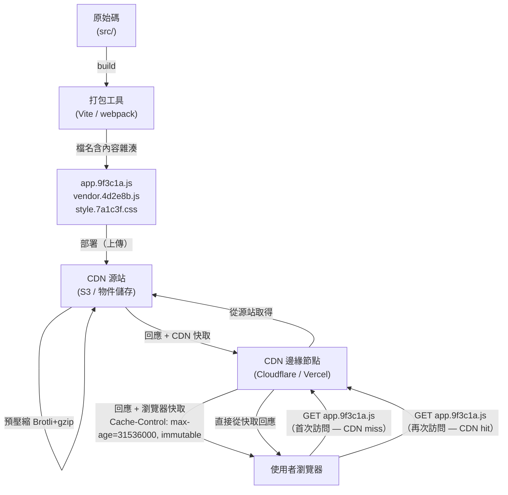

# 構建最佳化：壓縮、快取與產出分析

## 背景

現代前端構建管線（build pipeline）做的不只是把原始碼打包在一起——它還會縮小檔案、以特定方式
命名輸出讓瀏覽器能永久快取，並提供工具讓你檢查 bundle 裡究竟裝了什麼。如果沒有這些層次，
生產環境的應用程式可能會送出 2 MB 的 JavaScript 而非 200 KB、在每次部署後強迫使用者重新
下載所有資產，甚至悄悄地把只應存在於伺服器端的程式碼帶進客戶端 bundle。

本文涵蓋生產構建最佳化的四大支柱：**壓縮（minification）**（盡可能縮小資產體積）、
**Tree shaking 與 Scope hoisting**（在模組層面移除死碼）、**內容雜湊以達成長期快取**
（讓已快取的資產永久有效）、以及 **Bundle 分析**（了解你送出了什麼以及原因）。此外也
涵蓋**構建快取**（避免在 CI 中重複工作）、**Brotli 壓縮**（在現代 CDN 上優於 gzip 的替代
方案）以及**關鍵 CSS 提取（critical CSS extraction）**（消除阻塞渲染的樣式表）。

## 原則

**應該（SHOULD）** 對所有靜態資產使用內容雜湊（content hashing）。搭配內容雜湊，可設定
`Cache-Control: max-age=31536000, immutable`——瀏覽器與 CDN 將資產快取一年，而新部署會
自動產生新的 URL，自動更新快取，無需任何人工介入。

**應該（SHOULD）** 在合併大型相依套件新增之前先分析 bundle 大小。未經分析就新增的相依套件
可能讓 bundle 悄悄增加 50 KB 以上。在合併引入重大新相依的 PR 之前，請先在本機執行視覺化
分析工具。

## 設計思維

**為何內容雜湊是 CDN 快取的基石**

沒有內容雜湊，你面臨一個無解的取捨。設定短 TTL（例如 5 分鐘），每個使用者每 5 分鐘就要
重新下載所有資產——大多數時候是徒勞的，因為程式碼根本沒變。設定長 TTL（例如 1 年），使用者
在部署後一年內都會收到過時的資產——新程式碼，卻是舊快取。

內容雜湊完全解決了這個取捨。`app.9f3c1a.js` 在定義上就是不可變的（immutable）：如果內容
改變，雜湊就改變，URL 也隨之改變。瀏覽器（和 CDN）會視之為全新的資源。因此你可以放心地
設定一年的 TTL。舊 URL 對於已快取舊版本的使用者依然有效——他們在導航過程中能優雅地過渡
到新雜湊值。新使用者在首次訪問時就能拿到最新的 bundle。CDN 永遠不會提供過時的內容。

內容雜湊的檔名方式也能避免查詢字串版本控制（`style.css?v=2`）的陷阱。部分 CDN 配置和 HTTP
代理在快取鍵中會剝除或忽略查詢字串。檔名雜湊完全繞過這個問題——任何快取層看到不同的檔名，
就會視之為不同的檔案。

**為何 Bundle 分析應該是習慣，而非一次性的檢查**

經典的例子是 `moment.js`。以 `import moment from 'moment'` 引入時，它會帶入所有地區語系
資料（locale data）——未壓縮前高達 2.4 MB。一個開發者為了格式化單一日期而引入 moment，
可能完全不知道自己剛讓 bundle 大小翻了一倍。同樣的模式也適用於 lodash（如果你引入完整
套件，每個方法都會成為獨立函式）、帶有 locale 的 date-fns，以及任何未使用樹搖友善的路徑
引入方式的圖示庫。

視覺化工具能在 30 秒內讓這個隱形問題變得顯而易見。它應該成為新增相依套件的 PR 代碼審查
清單的一部分。

**為何 Brotli 在現代 CDN 上取代了 gzip 成為預設值**

Brotli 在典型文字內容（HTML、CSS、JS）上比 gzip 提供 15–26% 更好的壓縮率。歷史上的
反對意見是 Brotli 壓縮比 gzip 慢——在最高壓縮等級（11）下，可能慢上 10–100 倍。但這個
反對意見只適用於即時壓縮（on-the-fly compression）。現代 CDN 在上傳時就預先壓縮資產，
只支付一次壓縮成本。使用者以 gzip 解壓縮的速度（Brotli 解壓縮速度與之相當）接收預先壓縮
的檔案。透過 `Accept-Encoding` 標頭進行的內容協商（content negotiation）讓 CDN 能自動為
舊版客戶端提供 gzip——啟用 Brotli 同時保留 gzip 完全沒有額外成本。

到 2024 年，所有現代瀏覽器都支援 Brotli，Cloudflare、Vercel 和 Netlify 都預設啟用它。
Brotli 需要 HTTPS（瀏覽器供應商要求此點以防止壓縮 oracle 攻擊），而每個現代生產環境網站
本來就使用 HTTPS。

**構建時期與執行時期的取捨：付出一次，在每次請求中節省**

所有能從執行時期移至構建時期的最佳化，其成本都能分攤到所有使用者和所有請求上。壓縮、
關鍵 CSS 提取和 Brotli 預壓縮，都只在一次 30–60 秒的構建中支付成本。執行時期的節省——
更小的檔案、更少的阻塞請求、更低的解壓縮成本——在每次頁面載入時由每個使用者回收。這筆
帳的結論是：把更多工作移到構建時期是壓倒性地有利的。

## 視覺化

### 內容雜湊 + CDN 快取生命週期



**新部署時：** 打包工具產出 `app.7b4f2d.js`（新雜湊值）。CDN 從未見過這個 URL——快取未命中
——從源站取得。舊雜湊 URL（`app.9f3c1a.js`）在任何使用者的瀏覽器快取中仍然有效，使得
版本過渡得以優雅進行。

## 範例

### 1. `vite.config.ts`：壓縮、chunk 分割與內容雜湊

Vite 預設使用 esbuild 壓縮 JS，使用 Lightning CSS 壓縮 CSS。切換到 Terser 可以獲得更積極的
JS 壓縮（代價是構建速度較慢）。

```typescript
import { defineConfig } from 'vite'
import vue from '@vitejs/plugin-vue'

export default defineConfig({
  plugins: [vue()],

  build: {
    // 預設：'esbuild'（最快）。切換到 'terser' 可獲得更小的輸出。
    // 從 Vite 6 起，也可以使用 'oxc'（最快，略不如 terser 積極）。
    minify: 'terser',
    terserOptions: {
      compress: {
        drop_console: true,    // 移除所有 console.* 呼叫
        drop_debugger: true,   // 移除 debugger 語句
        passes: 2,             // 兩次壓縮通關以獲得更小的輸出
      },
      mangle: {
        toplevel: true,        // 縮短頂層函式/變數名稱
      },
    },

    // CSS 壓縮：預設為 Lightning CSS（Rust 實作，非常快）。
    // 只在需要改用 esbuild 處理 CSS 時才覆寫。
    cssMinify: 'lightningcss',

    // 內容雜湊是 Vite 的預設輸出格式。
    // [hash] 來自檔案內容——只有在內容改變時才會變化。
    rollupOptions: {
      output: {
        // JS chunks：檔名包含內容雜湊
        chunkFileNames: 'assets/[name]-[hash].js',
        entryFileNames: 'assets/[name]-[hash].js',
        // 靜態資產（圖片、字體）：檔名包含內容雜湊
        assetFileNames: 'assets/[name]-[hash][extname]',

        // Vendor chunk 分割：將第三方套件與應用程式程式碼分開。
        // 目標：更新小型相依套件不會讓 vendor chunk 的快取失效。
        manualChunks(id) {
          if (id.includes('node_modules')) {
            // 將所有 node_modules 分組到單一 'vendor' chunk。
            // 對大型應用程式：可進一步分割（例如 'react-vendor'、'ui-vendor'）。
            return 'vendor'
          }
        },
      },
    },

    // 生產環境不輸出 sourcemap（或用 'hidden' 搭配 Sentry）。
    sourcemap: false,
  },
})
```

**Vendor chunk 的原因：** 沒有分割的情況下，更改一行應用程式程式碼就會重新構建整個 bundle，
讓所有使用者的快取失效——包括他們已快取的 vendor 程式碼。分割獨立的 vendor chunk 後，
vendor 雜湊在純應用程式變更時保持穩定，回訪使用者只需下載小型的應用程式 chunk。

### 2. 使用 rollup-plugin-visualizer 進行 Bundle 分析

```bash
pnpm add -D rollup-plugin-visualizer
```

```typescript
// vite.config.ts
import { defineConfig } from 'vite'
import { visualizer } from 'rollup-plugin-visualizer'

export default defineConfig({
  plugins: [
    // 將 visualizer 放在 plugins 陣列的最後。
    visualizer({
      filename: 'dist/stats.html',   // 報告輸出路徑
      open: true,                     // 構建後自動在瀏覽器開啟
      gzipSize: true,                 // 顯示 gzip 壓縮後的大小
      brotliSize: true,               // 顯示 brotli 壓縮後的大小
      template: 'treemap',            // 'treemap' | 'sunburst' | 'flamegraph' | 'network'
    }),
  ],
})
```

執行分析：

```bash
# 標準生產構建——自動開啟 stats.html
vite build

# 或作為獨立的 npm script（避免加入常規構建流程）：
# "analyze": "ANALYZE=true vite build"
```

報告中需要留意的重點：

- **出乎意料的大型相依套件** — 佔 bundle 超過 20% 的套件值得審視。它支援 tree shaking 嗎？
  是否有更輕量的替代方案？
- **重複的套件** — 同一個套件的兩個不同版本（例如 `lodash` 和 `lodash-es`，或 monorepo
  中的兩個 React 版本）會分別顯示為獨立的區塊。
- **非預期的引入** — 不應進入客戶端 bundle 的伺服器端程式碼、測試工具，或語系資料（moment.js
  問題）。
- **未被搖掉的引入** — 預期應被 tree shaking 的套件卻完整出現。通常是因為使用了純 CJS 套件
  （見下方 tree shaking 小節）。

### 3. Tree shaking 與 Scope hoisting（打包工具視角）

Tree shaking 是透過 ESM 靜態分析進行的死碼消除。打包工具在構建時（程式碼執行前）讀取
`import` 和 `export` 語句，並移除從未被引入的匯出。這只對 **ESM**（`import`/`export`）有效
——CommonJS（`require`）無法被 tree shaken。

**為何 CJS 無法被 tree shaken：**

```javascript
// CommonJS — 動態的，在執行時期求值
const utils = require('./utils')  // 打包工具無法知道哪些 export 被使用
utils[someVariable]()             // 計算屬性存取使靜態分析失效

// ESM — 靜態的，在構建時期分析
import { formatDate } from './utils'  // 打包工具確切知道哪個 export 被使用
```

`package.json` 中的 `sideEffects` 欄位告訴打包工具，套件的模組不含副作用，因此未使用的
匯出可以安全地移除：

```json
{
  "name": "my-library",
  "sideEffects": false
}
```

或列出確實有副作用的特定檔案（例如 CSS 引入）：

```json
{
  "sideEffects": ["*.css", "src/polyfills.js"]
}
```

**Scope hoisting**（Rollup 的核心創新）：Rollup 不像 webpack 那樣將每個模組包裝在函式閉包
中進行隔離，而是在可能的情況下將所有模組合併到單一作用域。這消除了每個模組的函式包裝
開銷，縮小了輸出體積，並給 JavaScript 引擎提供更大的作用域進行最佳化。

### 4. 雜湊資產的 Cache-Control 標頭

搭配內容雜湊檔名的伺服器或 CDN 設定：

```nginx
# Nginx：含內容雜湊的資產——永久快取
location ~* \.(js|css|png|jpg|svg|woff2)$ {
    # 假設任何檔名中含有 8 字元十六進位雜湊的檔案都是內容定址的。
    # Vite 輸出：assets/index-9f3c1a2b.js
    expires 1y;
    add_header Cache-Control "public, max-age=31536000, immutable";
}

# HTML 入口點——永不快取（包含指向當前雜湊資產的引用）
location ~* \.html$ {
    add_header Cache-Control "no-cache";
}
```

`immutable` 指令告訴瀏覽器在新鮮期內不要發送條件式請求（`If-None-Match`）——即使是在明確
重新整理的情況下。這避免了軟導航時對伺服器的額外往返。它只在檔名使用內容雜湊時才安全
（這樣 URL 就永遠不會提供不同的內容）。

### 5. 使用 vite-plugin-compression 進行 Brotli 預壓縮

```bash
pnpm add -D vite-plugin-compression
```

```typescript
// vite.config.ts
import { defineConfig } from 'vite'
import viteCompression from 'vite-plugin-compression'

export default defineConfig({
  plugins: [
    // Brotli 預壓縮（主要方案，最佳壓縮比）
    viteCompression({
      algorithm: 'brotliCompress',
      ext: '.br',
      threshold: 1024,        // 只壓縮大於 1 KB 的檔案
      deleteOriginFile: false, // 保留原始檔案作為後備
    }),
    // gzip 後備方案，供舊版客戶端使用
    viteCompression({
      algorithm: 'gzip',
      ext: '.gz',
      threshold: 1024,
    }),
  ],
})
```

構建完成後，`dist/` 目錄會包含每個資產的三種變體：

```
dist/assets/index-9f3c1a2b.js       # 原始檔案（後備）
dist/assets/index-9f3c1a2b.js.br    # Brotli 預壓縮
dist/assets/index-9f3c1a2b.js.gz    # gzip 預壓縮
```

伺服器（Nginx、Caddy 或 CDN）根據請求的 `Accept-Encoding` 標頭選擇適當的變體，並直接提供
預壓縮的檔案——沒有執行時期的 CPU 壓縮成本。

**注意：** 如果部署到 Vercel、Netlify 或 Cloudflare Pages，這些 CDN 在部署時會自動進行
預壓縮。在這種情況下，你不需要 `vite-plugin-compression`。

### 6. 使用 Turborepo 和 GitHub Actions 進行構建快取

**Turborepo 遠端快取：** 以所有輸入（原始碼、環境變數、相依套件）的內容雜湊為鍵儲存構建
產出。如果輸入未變更，快取的產出會在幾秒內還原，而非從頭重建。可在 CI runners 和團隊成員
之間共享。

```json
// turbo.json
{
  "pipeline": {
    "build": {
      "dependsOn": ["^build"],
      "outputs": ["dist/**"],
      "cache": true
    }
  }
}
```

**GitHub Actions 快取 node_modules：**

```yaml
- uses: actions/setup-node@v4
  with:
    node-version: '22'
    cache: 'pnpm'      # setup-node 內建的 pnpm 快取

# 或手動快取以獲得更多控制：
- uses: actions/cache@v4
  with:
    path: |
      node_modules
      ~/.pnpm-store
    key: ${{ runner.os }}-pnpm-${{ hashFiles('pnpm-lock.yaml') }}
    restore-keys: |
      ${{ runner.os }}-pnpm-
```

**Vite 預打包快取**（`node_modules/.vite`）：Vite 會在首次 `vite dev` 執行時，快取將 CJS
相依套件預打包為 ESM 的結果。後續啟動會跳過此步驟。在 Docker 層快取中提交此快取目錄可
加速容器構建。

### 7. 關鍵 CSS 提取（進階）

關鍵 CSS 是渲染「折疊以上（above-the-fold）」內容所需的 CSS 規則子集。將其內聯到 `<head>`
中，可消除阻塞渲染的樣式表請求，改善 LCP。

```bash
pnpm add -D vite-plugin-critical
```

```typescript
// vite.config.ts
import { defineConfig } from 'vite'
import critical from 'vite-plugin-critical'

export default defineConfig({
  plugins: [
    critical({
      // 用於模擬「折疊以上」視窗的寬高
      criticalWidth: 1300,
      criticalHeight: 900,
    }),
  ],
})
```

插件在構建完成後運行無頭瀏覽器，識別與可見元素匹配的 CSS 規則，將這些規則內聯到
`<head>` 中，並非同步載入完整樣式表：

```html
<!-- 插件執行後 index.html 的輸出 -->
<head>
  <style>/* 內聯關鍵 CSS — 無需網路請求 */
    body { margin: 0; font-family: sans-serif; }
    .hero { display: flex; ... }
  </style>
  <link rel="preload" href="style.7a1c3f.css" as="style" onload="this.rel='stylesheet'">
  <noscript><link rel="stylesheet" href="style.7a1c3f.css"></noscript>
</head>
```

**取捨：** 關鍵 CSS 提取會增加大量構建複雜度和無頭瀏覽器相依。對於 LCP 直接影響業務指標
（轉換率、SEO）的公開登陸頁面，它最具價值。對於登入後的驗證應用視圖，相較於增加的構建
複雜度，改善幅度有限。

## 常見錯誤

**使用查詢字串版本控制而非檔名雜湊。**
`style.css?v=2` 與內容雜湊並不等同。部分 CDN 配置和代理在快取鍵中會剝除或正規化查詢字串，
導致快取污染或過時回應。含雜湊的檔名（`style.7a1c3f.css`）對每個快取層來說都是毫無歧義的
不同資源。Vite 預設就使用檔名雜湊——不要覆寫輸出檔名格式來移除 `[hash]`。

**對 HTML 檔案設定長期快取。**
HTML 檔案是引用雜湊資產的入口點。如果 HTML 被快取一年，使用者會在下次部署後的一年內持續
請求舊的資產 URL（這些 URL 可能已不存在於 CDN 上）。HTML 應使用 `Cache-Control: no-cache`
或短 TTL。只有檔名中包含內容雜湊的資產才應使用長期快取。

**將 Bundle 視覺化工具保留在每次生產構建中。**
visualizer 插件會增加構建時間，並在 `dist/` 中產生 `stats.html` 檔案。加入條件守衛，使其
只在明確請求時執行：
```typescript
plugins: [
  process.env.ANALYZE === 'true' && visualizer({ open: true }),
].filter(Boolean)
```

**未進行 tree shaking 就引入 moment.js（或任何含大量語系的套件）。**
`import moment from 'moment'` 會載入超過 70 個語系檔案——未壓縮前約 2.4 MB。moment.js 使用
CJS，不支援 tree shaking。改用 `date-fns`（ESM，支援 tree shaking）或 `Day.js` 插件系統。
新增日期/工具套件後，務必執行 bundle 視覺化工具。

**假設所有 npm 套件都支援 tree shaking。**
Tree shaking 需要 ESM。許多舊版或雙格式套件預設以 CJS 作為 Node.js 入口點。查看套件的
`package.json`，尋找指向 ESM 構建的 `module` 或 `exports` 欄位。如果只有 `main`，該套件
就是純 CJS，無法被 tree shaken。

**長期運行的應用程式沒有分割 vendor chunks。**
沒有 `manualChunks`，每次部署都會讓使用者重新下載整個 bundle——包括穩定的 vendor 程式碼
（如 React 和 Vue）。將 vendor 程式碼分割到獨立的 chunk，意味著一個 UI 的小修正只需使用者
下載小型的應用程式 chunk，而不是他們已快取的 200 KB React + Vue + router bundle。

**在 CDN 托管的網站上不必要地啟用 Brotli 預壓縮。**
如果你部署到 Vercel、Netlify 或 Cloudflare Pages，這些平台會在 CDN 層自動壓縮。額外執行
`vite-plugin-compression` 只會產生 CDN 忽略的 `.br` 和 `.gz` 檔案。只有在部署到自己的
伺服器或搭配 Nginx/Caddy 的 S3 bucket 時，才使用此插件。

## 相關 FEE

- **FEE-800** — 構建工具與模組系統總覽：這些最佳化所在的構建管線。
- **FEE-705** — 程式碼分割與懶載入：從應用程式視角看的 tree shaking（動態引入、基於路由的
  分割）。FEE-807 涵蓋打包工具層面的機制。
- **FEE-704** — 核心 Web 指標（Core Web Vitals）：LCP 直接受到資產快取（回訪使用者）、
  關鍵 CSS 提取（首次繪製）和 bundle 大小（解析與執行時間）的影響。

## 參考資料

- [Vite: Build Options](https://vite.dev/config/build-options)
- [rollup-plugin-visualizer — GitHub](https://github.com/btd/rollup-plugin-visualizer)
- [MDN: Cache-Control](https://developer.mozilla.org/en-US/docs/Web/HTTP/Reference/Headers/Cache-Control)
- [MDN: HTTP Caching](https://developer.mozilla.org/en-US/docs/Web/HTTP/Guides/Caching)
- [Choosing Between gzip, Brotli and zStandard Compression — Paul Calvano](https://paulcalvano.com/2024-03-19-choosing-between-gzip-brotli-and-zstandard-compression/)
- [Brotli vs GZIP: Improve Page Speed With HTTP Compression — DebugBear](https://www.debugbear.com/blog/http-compression-gzip-brotli)
- [Rollup: Tree-shaking](https://rollupjs.org/introduction/#tree-shaking)
- [Turborepo: Caching](https://turbo.build/repo/docs/core-concepts/caching)
