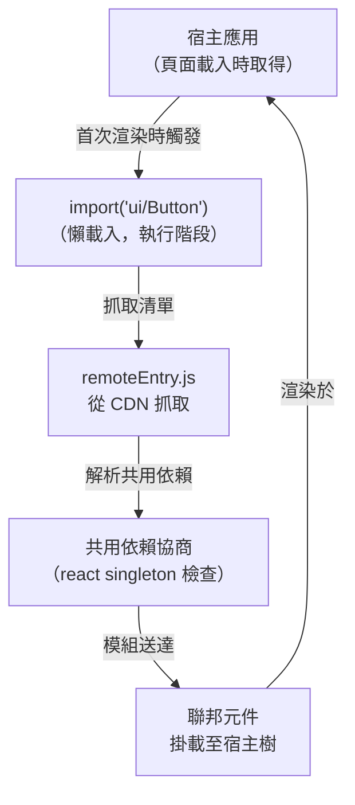

# Module Federation

Module Federation 是 Webpack 5 的一項功能，允許 JavaScript bundle 在執行階段（runtime）
對外公開模組，並從其他獨立部署的 bundle 消費模組。宿主應用（host application）可以從遠端
URL 載入一個聯邦模組（federated module）——一個元件、一個工具函式、甚至整個功能——而無需在
建置階段（build time）將其打包進來。遠端 bundle 在模組首次被 `import` 時才會懶載入，實現
了對獨立部署應用的執行階段組合（runtime composition）。

這是微前端架構（micro-frontend architecture）其中一種技術實現的基礎：各團隊可以獨立部署
自己的功能，宿主應用透過聯邦機制將它們整合為統一的使用者介面，而團隊之間不需要有同步的
建置期依賴。當 A 團隊部署了他們聯邦模組的新版本，B 團隊的宿主應用在下次頁面載入時就會
取得新版本——不需要重新建置，也不需要重新部署宿主。

與傳統的 npm 套件依賴或 monorepo 的套件引用不同，Module Federation 的依賴在執行階段才
解析。這讓聯邦模組能「熱部署」——遠端的新版本在使用者下次載入頁面時即生效，完全不需要
任何宿主應用參與。這個特性對於需要在不同功能域之間共享 UI 元件、同時又保持各域獨立發布
節奏的大型前端系統而言，既是主要優勢，也是主要風險所在：宿主必須時刻準備好應對任何它所
消費的聯邦模組在任意時刻發生的版本變化。

Module Federation 的核心挑戰在於共用依賴（shared dependency）的管理。如果宿主和遠端各自
打包了一份 React，使用者就需要下載兩份 React。Module Federation 的共用依賴功能讓宿主和
遠端在執行階段協商要使用哪些共用函式庫——如果多個來源都提供了相容版本，最終只會載入一份。
版本相容性協商，以及對 React 等函式庫的單例（singleton）強制，需要仔細的配置。除了共用依賴
之外，Module Federation 的操作複雜度也會隨著參與遠端的數量增加而上升。每個遠端都是可獨立
部署的單元，意味著每個遠端隨時都可能引入破壞性變更，宿主應用必須在任何聯邦模組失敗時，仍能
在不降級整個頁面的前提下繼續運作。從組織架構的角度來看，Module Federation 最適合的使用情境
是：多個具有穩定 API 邊界且在語義版本控制上有紀律的獨立產品團隊；API 治理與版本管理的成熟
度，往往比建置工具的技術選型更能決定聯邦方案是否能為組織帶來實際效益。

## 原則

工程師應該（SHOULD）在 Module Federation 的共用配置中，以語義化版本範圍（semantic version
range）配置共用依賴，以防止核心函式庫被重複載入。React、React DOM 以及其他框架套件必須在
瀏覽器中只被載入一次；載入兩份副本會產生執行階段錯誤。設定
`shared: { react: { singleton: true, requiredVersion: '^18' }, 'react-dom': { singleton: true, requiredVersion: '^18' } }`
能確保 React 只有一份副本被載入，即使跨越宿主和多個遠端也是如此，前提是所有參與方都使用
相容的版本。`shared` 配置應維護在共用套件或工作區配置中，讓聯邦的所有參與方保持同步——
參與方之間的共用依賴配置分歧，是最常見的聯邦執行階段錯誤來源，且往往在部署後才會浮現。
在 monorepo 環境中，可以將共用的 `shared` 配置物件提取為一個被各個 webpack.config.js
引用的共享常數，確保版本範圍的一致性，並讓未來的升級只需在一個地方修改。

工程師必須（MUST）在宿主應用中，為每個聯邦模組的消費點實作 error boundary。網路失敗、
版本不相容，或宿主與遠端之間的部署時間差，都可能導致聯邦 `import()` 呼叫被 reject。若沒有
error boundary，整個應用程式會在聯邦模組載入失敗時崩潰。Error boundary 將故障隔離在聯邦
模組所在的子樹，顯示降級 UI，讓應用程式的其他部分得以繼續運作。Error boundary 應將失敗
情況回報給應用程式的錯誤追蹤系統，並附上足夠的上下文資訊以識別是哪個遠端失敗，讓值班工程師
能區分 CDN 中斷、版本不匹配與遠端側執行階段錯誤——三種需要不同回應方式和不同團隊處理的
故障模式。在大型聯邦系統中，建議為每種故障類型定義明確的 SLO（服務層級目標）與升級路徑，
並在 Error boundary 的錯誤回報中包含足夠的 metadata 以自動路由至正確的值班人員。

## 設計思維

### 公開模組與消費模組

遠端透過 `exposes` 配置鍵聲明它對外開放哪些內部模組。一個典型的遠端設定如下：
`exposes: { './Button': './src/components/Button' }`，將公開的別名映射到相對於專案根目錄
的檔案路徑。宿主則透過 `remotes` 鍵聲明它認識哪些遠端：
`remotes: { ui: 'ui@https://cdn.example.com/ui/remoteEntry.js' }`。這個字串同時編碼了
模組聯邦名稱（`ui`）和遠端清單檔案（`remoteEntry.js`）的 URL。在宿主應用程式碼中，import
寫作 `import('ui/Button')`——`ui` 對應遠端別名，`Button` 對應公開路徑別名。建置期不做任何
解析；執行階段時，Webpack 會抓取清單、解析模組圖，並將元件送入宿主的模組登錄（registry）。

遠端的公開範圍（exposed surface）即是它的公開 API。`exposes` 中列出的每個路徑，都成為
宿主應用所依賴的介面。重新命名或移除一個已公開的路徑，會在執行階段使消費端宿主靜默失敗——
import 解析結果為 `undefined` 或拋出錯誤，而不是產生建置期的錯誤訊息。團隊應以對待任何
公開 API 的相同嚴謹度來維護 `exposes` 映射：移除路徑前先廢棄（deprecate），重大破壞性
變更需要版本化，並透過共用的變更日誌或契約登錄（contract registry）溝通異動。未公開的
內部模組可以自由重構，不影響外部；已公開的模組則對每個消費它的宿主承擔著完整的向後相容
責任。

### 共用依賴與版本協商

當宿主與遠端都在 `shared` 配置中聲明同一個套件時，Webpack 會在執行階段透過比較語義化版本
範圍來協商使用哪個版本。如果兩方都聲明了 `react: { requiredVersion: '^18' }` 且兩個 bundle
都包含 React 18.2.0，則只會載入一份——哪個先初始化，哪個就提供共用實例，另一個則讓步。
`singleton` 選項強化了這個保證：設定 `singleton: true` 後，Webpack 會始終使用單一實例，
若版本不相容則記錄警告，而不是載入兩份副本。`strictVersion` 選項更進一步，當協商出的版本
不滿足 `requiredVersion` 時會拋出執行階段錯誤。`eager` 選項則讓共用依賴打包進初始 chunk
而非懶載入——適用於依賴需要立即可用的場景，代價是初始 bundle 體積增大。

共用依賴協商發生在模組容器（module container）層，早於任何聯邦程式碼的執行。每個參與方
發布一份包含可用共用套件及其版本的清單。聯邦執行期比較所有清單，並選出滿足所有聲明範圍的
最高版本。若沒有單一版本能滿足所有約束，每個不滿足的參與方就會退回自行打包該依賴——對於
可選或版本敏感的套件，這可能是正確行為，但對 React 等單例而言則是災難性的。排查共用依賴
協商失敗需要檢視所有參與方的 `remoteEntry.js` 檔案並比較它們的 `shared` 聲明。當版本協商
退回自行打包時，Webpack 聯邦執行期會在主控台輸出警告，這是在整合測試新聯邦配置時最先需要
檢查的訊號。

值得注意的是，`shared` 配置的錯誤在本地開發環境中往往不會顯現，因為所有參與方通常運行在
同一個 webpack 開發伺服器下，共用依賴在建置階段就已解析完畢。這些錯誤只有在各參與方被
部署到各自的 CDN origin 並透過真實的 `remoteEntry.js` 抓取和協商時，才會在執行階段顯現。
因此，針對聯邦配置的 CI 流水線應包含在模擬生產拓撲的環境下執行的整合測試，而不能僅依賴
本地開發驗證。一個有效的驗證策略是在 CI 中使用 `webpack-bundle-analyzer` 或聯邦執行期的
偵錯模式，明確確認所有預期的共用依賴都被正確標記為 `shared` 而非各自打包，並在每次新增
遠端或升級共用依賴版本後重複執行這項驗證。

### 部署拓撲

宿主和遠端作為獨立的靜態產物分別部署。宿主的 `remotes` 配置包含指向各遠端
`remoteEntry.js` 清單的 URL。常見的有兩種 URL 策略。浮動 URL——如
`https://cdn.example.com/remotes/ui/remoteEntry.js`，永遠解析至最新版本——讓更新自動生效：
下次頁面載入就能取得該路徑所指向的任何產物。這對快速迭代很方便，但回滾（rollback）困難。
版本化 URL——如 `https://cdn.example.com/remotes/ui/1.4.2/remoteEntry.js`——讓每次部署都有
不可變的產物地址。宿主可以固定到特定版本，獨立於遠端團隊的發佈節奏來變更固定版本，當新版
遠端引入回歸問題時，宿主能自主執行回滾。

第三種拓撲模式是動態遠端註冊（dynamic remote registration）：宿主在啟動時抓取一份配置
清單，該清單將遠端名稱映射至其當前 URL。這讓基礎設施層得以控制宿主載入每個遠端的哪個版本，
在不需要重新部署宿主的情況下，實現功能旗標（feature flag）驅動的路由或金絲雀部署（canary
deployment）。代價是在聯邦執行期初始化之前需要一個阻塞性的網路請求。啟動清單必須以極短
的 TTL 提供服務，或設為不可快取，使更新能快速傳播；以長 CDN TTL 提供啟動清單會使動態
註冊失去意義。對於運作多個微前端團隊的組織而言，這種方式通常是操作彈性最高的選擇，將版本
協調集中在配置服務中，而非分散在各個宿主的建置產物裡。

### Module Federation 2.0（rspack 與 Vite）

Webpack 5 引入了 Module Federation，而 `@module-federation/enhanced` 套件和
`@module-federation/vite` 外掛將相容的聯邦機制帶到了非 Webpack 工具鏈，包括 rspack 和
Vite。核心概念——`exposes`、`remotes`、`shared`——得以延續，但外掛 API 與 Webpack 內建的
`ModuleFederationPlugin` 有所不同。`@module-federation/enhanced` 還引入了原始實作中
沒有的額外能力，例如型別化遠端清單（typed remote manifest）和預取（pre-fetching）支援。
在 Webpack 以外評估聯邦方案的團隊，應仔細在原型中驗證共用依賴協商行為，因為版本範圍解析
方式的細微差異，可能在執行階段產生與等效 Webpack 配置不同的行為。

`@module-federation/enhanced` 的型別清單功能，能從 `exposes` 配置自動為每個遠端的公開
API 生成 TypeScript 型別定義。宿主應用可以 import 這些型別定義，並在消費聯邦模組時獲得
IDE 自動補全與型別錯誤提示。這填補了 Webpack 5 原始實作中最明顯的開發者體驗缺口——在原始
實作中，`import('ui/Button')` 回傳 `any`，所有消費端錯誤都在執行階段才被發現，而非建置期。
採用型別化遠端的團隊應將生成的型別套件作為 CI 產物，與遠端 bundle 一同發布，讓宿主能
import 到始終與部署中遠端版本相符的型別定義。

### 在單元測試與整合測試中處理聯邦模組

在宿主應用的單元測試中，聯邦模組的動態 `import()` 呼叫通常需要被 mock 掉，原因有二：
其一，測試環境（如 Jest）通常不執行 Webpack，因此 Module Federation 執行期的模組解析
機制不存在；其二，遠端 URL 在測試環境中無法存取。常見的 mock 方式是在測試的
`moduleNameMapper` 或 `jest.mock()` 中，用本地的 stub 元件替換 `import('ui/Button')`，
使單元測試能驗證宿主的消費邏輯，而不依賴真實的遠端載入。

整合測試的層次則不同。若要驗證共用依賴協商、Error boundary 的錯誤捕捉，以及版本化
URL 的路由行為，就需要在一個能夠真正執行 Module Federation 執行期的環境中進行測試——
通常是在 staging 環境中使用 Playwright 或 Cypress 進行端對端測試。端對端測試應涵蓋
模擬遠端 CDN 失敗的情境（透過攔截網路請求），以確認 Error boundary 確實能防止整個宿主
崩潰，並在降級 UI 中顯示正確的訊息。

## 最佳實踐

**必須（MUST）在所有參與的遠端和宿主的共用配置中，將框架套件（`react`、`react-dom` 以及
其他框架執行期函式庫）標記為 `singleton: true`。** React 要求在整個應用程式中只存在一個
實例。同一頁面中出現多份 React 副本會產生「invalid hook call」錯誤，且難以追蹤——因為錯誤
訊息指向呼叫點，而非重複實例的來源。在 Module Federation 層強制 `singleton: true`，能從
結構上防止這類錯誤，不受各團隊部署版本的影響。聯邦中的每個宿主和遠端都必須包含這項配置
——只要有一個參與方遺漏 `singleton: true`，就足以在某些版本協商結果下產生重複實例。同樣
的原則也適用於任何依賴模組級單例的函式庫：`react-router`、Redux store、MobX 根節點，以及
類似的狀態承載函式庫，在同一頁面被載入多次時都面臨相同的風險。在有多個遠端參與的聯邦系統
中，建議將 `singleton: true` 的套件清單維護在共享文件中，並將檢驗所有 `remoteEntry.js` 的
shared 配置是否一致，納入 CI 的前置驗證步驟，讓配置分歧在到達生產環境之前就被發現。

**應該（SHOULD）以內容雜湊或明確版本號為遠端入口 URL 命名，而非使用
`/latest/remoteEntry.js` 這樣的浮動路徑。** 浮動 URL 讓回滾變得不可能：當 A 團隊為他們
的遠端部署了破壞性變更，宿主的 error boundary 捕捉到失敗後，回滾需要 A 團隊重新部署——在
同一 URL 下已無法取得先前的產物。版本化 URL 讓宿主能固定到已知正常的遠端產物，同時 A 團隊
在穩定其模組的期間繼續工作。操作上需要額外的協調步驟才能升級到新的遠端版本，但這個成本
遠低於非受控的破壞性變更在下次頁面載入時傳播給所有使用者的風險。宿主的 CI 管線應包含一個
明確的步驟來更新固定的遠端版本，為每次宿主部署消費了哪個遠端版本留下可見且可審計的記錄。
實務上，可以將遠端 URL 集中管理在一份版本清單設定檔中（例如 `federation.versions.json`），
由 CI 在每次遠端發布時更新該檔案並提交 pull request，讓宿主團隊能透過正式的代碼審查流程
審核和批准遠端版本的升級，而非讓升級無聲地在下次部署時自動生效。

**必須（MUST）在宿主端，為每個聯邦模組 import 套上 React error boundary（或框架等效的
韌性容器）。** 因網路失敗、版本不匹配或遠端伺服器錯誤而載入失敗的聯邦模組，會導致 `import()`
呼叫被 reject。若沒有 error boundary，這個 rejection 會向上傳播，導致整個應用程式樹崩潰。
Error boundary 捕捉 rejection、渲染降級 UI，讓使用者得以繼續使用應用程式的其他部分。每個
聯邦模組都應有其專屬的 error boundary，而非共用單一的頂層邊界，如此一來一個遠端的失敗才
不會降級宿主應用中其他不相關的部分。Error boundary 還應記錄失敗資訊至應用程式的錯誤追蹤
系統，並附上充分的上下文（例如遠端名稱、嘗試載入的模組路徑、是否為網路錯誤或版本衝突），
讓值班人員能辨別需要的修復方向，以及應由哪個團隊處理。

**應該（SHOULD）為聯邦配置建立整合測試環境，模擬生產部署的遠端拓撲。** 本地開發通常讓所有
參與方在同一個 origin 下執行，這會掩蓋僅當遠端位於不同 CDN 網域時才出現的問題：CORS
配置錯誤、CSP 指令遺漏、CDN 快取標頭與版本協商的交互作用。整合測試環境應使用真實的分域
部署，並定期執行注入故障的測試——例如讓遠端 CDN 回傳 503——以驗證 error boundary 確實能
防止整個宿主應用崩潰。這類測試捕捉的失敗模式，在任何本地開發配置中都是不可見的。

## 視覺呈現



上圖呈現的是成功路徑。在失敗路徑上，抓取 `remoteEntry.js` 失敗，或協商步驟因版本不相容
而被 reject。在任一情況下，`React.lazy()` 的 Promise 都會 reject，由外層的 `ErrorBoundary`
捕捉並渲染降級畫面。邊界以外的宿主應用樹繼續正常渲染。這正是 error boundary 不可或缺的
原因——它是讓失敗路徑從使用者角度可恢復的機制。

圖中的「共用依賴協商」步驟在實務上是非同步的，且在頁面的模組容器初始化階段就已完成，
並非在每次個別 `import()` 呼叫時重複執行。一旦協商結果確定，後續對同一共用套件的 import
都直接使用已協商好的實例，不再重新協商。這意味著協商失敗（例如版本不相容）通常在頁面
初始化的早期就會觸發，而非在使用者與特定聯邦元件互動時。

## 範例

```js
// webpack.config.js（遠端團隊——公開 Button 元件）
new ModuleFederationPlugin({
  name: 'ui',
  filename: 'remoteEntry.js',
  exposes: { './Button': './src/components/Button' },
  shared: { react: { singleton: true, requiredVersion: '^18' } },
});

// webpack.config.js（宿主——從遠端消費）
new ModuleFederationPlugin({
  remotes: { ui: 'ui@https://cdn.example.com/ui/remoteEntry.js' },
  shared: { react: { singleton: true, requiredVersion: '^18' } },
});

// 宿主應用程式碼——以 error boundary 和 React.lazy 包覆
const Button = React.lazy(() => import('ui/Button'));

function App() {
  return (
    <ErrorBoundary fallback={<span>Button 暫時無法使用</span>}>
      <React.Suspense fallback={<span>載入中...</span>}>
        <Button />
      </React.Suspense>
    </ErrorBoundary>
  );
}
```

## 常見錯誤

- 在任一參與方的 shared 配置中遺漏 `react` 和 `react-dom` 的 `singleton: true`——只要有一個
  參與方遺漏，就足以產生重複的 React 實例，導致難以追蹤的「invalid hook call」錯誤。這類
  問題在本地開發中通常不會出現，只有在各方被部署到獨立 CDN origin 後才會浮現，因此在
  staging 環境中執行的整合測試是唯一可靠的驗證手段。
- 使用浮動遠端入口 URL（例如 `/latest/remoteEntry.js`）卻沒有回滾策略——遠端團隊部署的
  破壞性變更會立即傳播給所有使用者，且無法在同一 URL 下取回先前的產物。
- 忘記為聯邦 import 套上 error boundary——因網路失敗或版本不匹配而被 reject 的 `import()`
  若未在元件子樹層級被攔截，會導致整個應用程式崩潰。
- 在各參與方之間不一致地使用 `eager: true` 於共用依賴——若宿主積極打包共用依賴而遠端未這樣
  做，初始化順序可能導致遠端收到與預期不同的實例。`eager` 的正確用法是在聯邦系統的所有參與
  方之間保持一致，並限制於真正需要立即可用的場景。
- 沒有在能反映生產聯邦拓撲的預備環境（staging environment）中測試版本協商行為——本地開發
  通常讓所有參與方在同一 origin 下執行，掩蓋了只有在遠端位於不同 CDN 網域時才會出現的
  URL 解析問題。
- 從遠端公開內部實作細節（例如內部工具函式、原始 API 客戶端）而非定義穩定的公開 API 介面
  ——作為聯邦端點公開的內部模組會成為隱性的公開契約，使重構變得困難，且當內部結構改變時
  會在不知情的情況下破壞宿主應用。
- 假設相同主版本號的 React 就一定能共用同一實例——固定使用 `react@18.0.0` 的遠端，若與
  使用 `react@18.3.1` 的宿主搭配，可能在未設定 `strictVersion` 的情況下靜默觸發 singleton
  版本不匹配警告，進而在生產環境產生難以診斷的行為。建議為所有參與方設定 `strictVersion: true`
  以將版本衝突轉為明確的執行階段錯誤，而非靜默警告，使問題在整合測試中更容易被發現。
- 在從第三方 CDN 網域載入遠端入口檔案時，未考慮內容安全政策（Content Security Policy，
  CSP）的影響——抓取 `remoteEntry.js` 的動態 `import()` 受 CSP 的 `script-src` 和
  `connect-src` 指令約束，CSP 違規在聯邦執行期中往往以靜默失敗呈現，而非輸出可操作的
  錯誤訊息。在設計聯邦部署架構時，應將 CSP 政策的更新納入遠端上線前的驗收標準，並在
  staging 環境中以啟用 CSP 的瀏覽器執行端對端測試，以確認所有遠端 origin 都已被正確
  列入允許清單。

## 相關 FEE

- FEE-800 — 構建工具與模組系統總覽
- FEE-508 — 微前端架構
- FEE-307 — ES 模組與模組系統
- FEE-506 — Error Boundary 與韌性模式
- FEE-804 — 程式碼拆分與懶載入
- FEE-1400 — 可觀測性與錯誤追蹤

## 參考資料

- Webpack Module Federation docs — https://webpack.js.org/concepts/module-federation/
- Module Federation examples — https://github.com/module-federation/module-federation-examples
- @module-federation/vite — https://github.com/module-federation/vite
- @module-federation/enhanced — https://github.com/module-federation/core
- Zack Jackson: Practical Module Federation (book) — https://module-federation.github.io/
- Martin Fowler: Micro Frontends — https://martinfowler.com/articles/micro-frontends.html
- rspack: Module Federation — https://rspack.dev/guide/features/module-federation
- web.dev: Module Federation and Micro-Frontends — https://web.dev/articles/module-federation
- webpack-bundle-analyzer — https://github.com/webpack-contrib/webpack-bundle-analyzer
- MDN: Content Security Policy — https://developer.mozilla.org/en-US/docs/Web/HTTP/CSP
- Zack Jackson: Practical Module Federation (book) — https://module-federation.github.io/practical-guide
