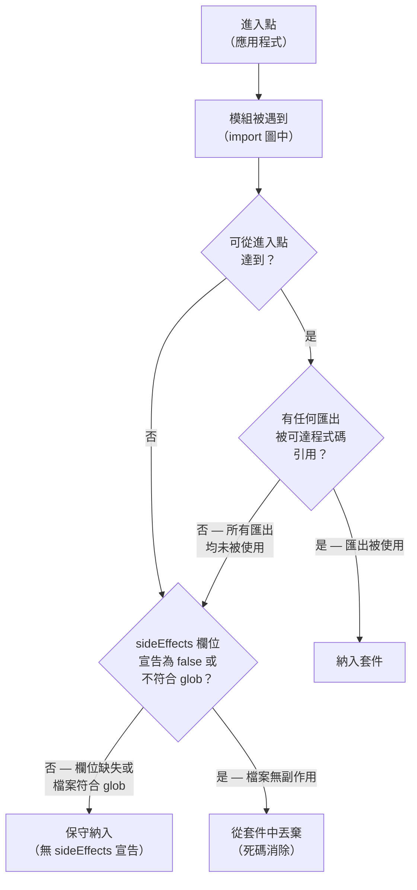

# Tree-Shaking 模式與副作用標記

Tree-shaking 是打包工具消除無用程式碼的過程——將應用程式中從未被引用的模組與匯出從最終
產出的套件中移除。這個詞源自一個形象的比喻：搖動相依性樹，讓枯葉落下，只有從應用程式
進入點實際可達的程式碼才會留下。Rollup、esbuild、Webpack 等打包工具透過靜態分析
ES 模組的 import 與 export 綁定來實現 tree-shaking。由於 ES 模組語法
（`import` / `export`）是在解析階段而非執行期解析的，打包工具能夠在不執行任何程式碼的情況
下，建立一張完整且精確的圖，標示哪些匯出被引用、哪些沒有。

ES 模組語法的靜態特性正是 tree-shaking 得以成立的根本原因。打包工具讀到
`import { formatDate } from './utils'` 時，可以確定地知道：只有 `formatDate` 被請求自
該模組。若 `./utils` 還匯出了 `formatCurrency`，而 `formatCurrency` 在整張圖中從未被引用，
打包工具就能安全地將其從套件中排除。這個分析是遞移性的，跨越整張 import 圖：一個僅被用來
轉傳某個本身未被使用的匯出的模組，也是消除的候選對象。實務上，節省的體積可能相當可觀
——一個擁有五十個匯出函式的工具庫，若應用程式只用到其中三個，只要函式庫和應用程式都以
正確方式撰寫，它對最終套件體積的貢獻幾乎可以降到零。

複雜之處在於副作用（side effects）。一個具有副作用的模組，即使其匯出沒有任何地方引用，
也不能被安全地消除——因為副作用在模組被求值的瞬間就會執行，無論有沒有人引用它的匯出。
常見的副作用包括：註冊全域事件監聽器、修補原型鏈、引入注入全域樣式的 CSS 檔案、
呼叫 `customElements.define()`，以及寫入全域的 registry。Polyfill 模組從設計上就是純副作用
的——它的工作是修改全域環境，而非匯出任何供消費者顯式引用的內容。打包工具無法僅憑靜態分析
判斷哪些模組有副作用、哪些沒有，因此在缺乏額外資訊的情況下，只能保守地假設每個模組都可能
有副作用，全數納入。這個保守預設實際上完全抵銷了函式庫套件的 tree-shaking 效果。

`package.json` 中的 `sideEffects` 欄位正是為了解決這個矛盾而引入的。它讓函式庫作者能夠
向打包工具傳遞以下資訊：套件中哪些檔案沒有副作用，可以在未被引用時丟棄；哪些檔案有副作用，
無論有無 import 都必須納入。設為 `false` 時，整個套件被宣告為無副作用；設為 glob 模式陣列
時，只有符合的檔案被視為有副作用，其餘所有檔案都可以做死碼消除。若沒有這個宣告，Webpack
及其他打包工具會回退到保守預設，將所有遞移可達的檔案納入，即使其匯出完全未被使用。因此，
撰寫可 tree-shake 的函式庫，既需要正確的 ES 模組語法，也需要正確的 `sideEffects` 元資料。

## 設計思維

### 為何需要靜態 ESM 語法

Tree-shaking 是靜態分析操作，而靜態分析只能作用於在解析時就已固定的語法。ES 模組的
`import` 與 `export` 宣告正是如此：它們出現在模組的頂層，其引用路徑是字串字面量，在任何
程式碼執行之前就完成解析。打包工具讀取這些宣告、建立一張有向圖（每條邊代表一個 import
關係），再從進入點遍歷圖，識別哪些匯出是可達的。任何從進入點的遞移閉包中找不到入邊的匯出
節點，都被標記為不可達，並從產出中丟棄。

CommonJS 模組違反了以上每一項要求。`require()` 可以出現在函式體內、條件判斷中、迴圈裡，
其引數可以是計算出的字串：`require(process.env.NODE_ENV === 'production' ? 'lodash.min' :
'lodash')`。模組的匯出表面由對 `module.exports` 的賦值定義，可以在執行期的任意時刻發生。
這些都無法靜態分析。打包工具確實對 CommonJS 套用了一些啟發式規則——Rollup 的
`@rollup/plugin-commonjs` 與 Webpack 的內建 CJS 支援嘗試透過模式比對識別具名匯出——但結果
片段且不可靠。CommonJS 模組應被視為一個不可分割的原子單元，要麼完整納入，要麼完整排除；
在 CJS 模組內部做細粒度的 tree-shaking 是不可靠的。

動態 `import()`——運算式形式，`import('./module')`——介於兩者之間。動態 import 是懶載入的，
打包工具會為其進行 code splitting，但若引用路徑是計算出的運算式（`` import(`./${name}`) ``），
打包工具無法確定載入的是哪個模組，必須納入所有候選者。若引用路徑是靜態字串字面量
（`import('./heavy-feature')`），打包工具可以解析它並對動態載入模組的匯出套用 tree-shaking，
不過由於整個動態 import 被視為單一 chunk 進入點，整個模組檔案仍會被納入。實務建議：對應
被 tree-shaken 的程式碼使用頂層靜態 `import` 綁定，對應被 code split 但不在分割點內做
tree-shaking 的程式碼則使用動態 `import()`。

ESM 與打包工具設定之間的交互影響也值得理解。一個套件可能同時提供 CommonJS 和 ESM 版本的
構建。`package.json` 中的 `exports` 欄位允許作者針對不同環境暴露不同的進入點，透過
`"import"` 與 `"require"` 條件將打包工具導向 ESM 版本、將 Node.js CJS 消費者導向 CJS 版本。
若 `exports` 欄位缺失或設定有誤，打包工具可能意外解析到 CJS 版本，失去對該套件的所有
tree-shaking 能力——即使磁碟上存在 ESM 版本。這是一種特別隱蔽的失效模式，因為應用程式
仍然可以正常運作，只是包含了多餘的程式碼，而且除非明確分析套件，否則這些多餘程式碼
完全不可見。

### `sideEffects` 欄位

`package.json` 中的 `"sideEffects"` 欄位是函式庫作者與消費它的打包工具之間的主要契約。
其語義直接明確：`false` 表示「我保證此套件中的任何檔案都沒有副作用；只要某個檔案的匯出
未被引用，你就可以丟棄它。」陣列形式表示「這些特定的檔案有副作用，只要它們是遞移可達的，
就必須被納入；其他所有檔案都可以安全地丟棄。」

對一個確實有副作用檔案的套件設定 `"sideEffects": false` 是一個正確性缺陷，而非僅僅是設定
失誤。若消費者從套件中引入了一個 polyfill 檔案——`import 'my-lib/polyfills'`——而該套件宣告
了 `"sideEffects": false`，打包工具可能判斷：由於 `polyfills.js` 的匯出沒有任何具名引用，
整個模組可以丟棄。結果是 polyfill 從未執行，全域環境未被修補，應用程式在依賴該 polyfill
的環境中靜默地出錯。這種失效是靜默且環境相關的，使其成為最難診斷的 tree-shaking 缺陷
類別之一。

陣列形式讓作者有精細的控制能力。一個元件函式庫可能在其 JavaScript 旁邊附帶注入全域樣式
的 CSS 模組。正確的宣告應為 `"sideEffects": ["*.css", "*.scss"]`，將所有樣式表檔案標記為
有副作用，同時允許所有 JavaScript 檔案被 tree-shaken。有些函式庫還包含特定的 `polyfills.js`
進入點：`"sideEffects": ["./src/polyfills.js", "*.css"]`。當消費者只從函式庫引入 `Button` 時，
`polyfills.js` 和所有未被引用的 JavaScript 模組都不會被納入——但符合 glob 模式且遞移可達
的 CSS 檔案則會被保留。

應用程式層級的 `package.json` 也可以使用 `"sideEffects"` 來協助打包工具消除應用程式自身的
無用程式碼。若一個內部工具模組沒有副作用，在套件層級宣告此事，就能讓打包工具像對外部
函式庫一樣，丟棄未使用的內部匯出。在 monorepo 設定中，共用的工具套件若宣告了
`"sideEffects": false`，每個消費它的應用程式就只會納入自己使用的部分，不多不少。

### 純函式標記（`/*#__PURE__*/`）

對匯出可達性的靜態分析處理的是模組和具名匯出綁定的層面。但在模組內部，還有更細粒度的
死碼消除：個別函式呼叫與運算式。打包工具無法僅憑靜態分析判斷一個函式呼叫是否有副作用。
`createRegistry()` 可能會註冊一個全域的 singleton、修補原型鏈，或者什麼可觀察的事都不做
——打包工具若不執行它就無法得知。保守預設是假設所有函式呼叫都有副作用，只要所在的模組
被納入，呼叫就會被保留。

`/*#__PURE__*/` 標記是針對這個限制的逃生艙口。將這個注釋緊接著放在函式呼叫或運算式之前，
告訴打包工具該呼叫是純淨的——它沒有副作用，若其回傳值未被引用，可以安全地整個丟棄。
打包工具隨後會對該呼叫的回傳值套用與具名匯出相同的可達性邏輯：若結果未被使用，
整個呼叫就被移除。最常見的使用情境是類別實例化與裝飾器套用。TypeScript 編譯含裝飾器的類別，
或 Babel 輸出類別輔助函式呼叫時，輸出的程式碼中會包含頂層函式呼叫，例如 `_decorate(...)`
或 `_classCallCheck(...)`。Babel 和 TypeScript 編譯器都會自動為這些輸出的呼叫插入
`/*#__PURE__*/`，使打包工具能夠在未被引入時完整丟棄加了裝飾器的類別。

這個標記是程式碼作者（或編譯器）對打包工具的承諾。若標記有誤（被標記的呼叫確實有副作用），
打包工具會靜默地丟棄它，副作用不會執行。這與 `"sideEffects": false` 的正確性風險屬於同一
類別。在手寫的程式碼中，只有在作者能驗證被標記的呼叫真正沒有任何可觀察的副作用時，才應
使用此標記。在編譯器輸出的程式碼中，工具鏈負責正確地放置這個標記——這也是為什麼升級
Babel 或 TypeScript 可能在沒有任何原始碼變更的情況下改變套件輸出：編譯器作者持續精煉其對
哪些輸出模式可以安全標記為純淨的判斷。

### 桶狀檔案（`index.ts`）與 tree-shaking

桶狀檔案（barrel file）是一種唯一目的是從其他模組轉傳匯出的模組：
`export { Button } from './Button'; export { Input } from './Input'; ...`。桶狀檔案在元件
函式庫和工具套件中被廣泛使用，因為它們提供了一個單一的引入點：`import { Button, Input }
from 'my-lib'`，而非 `import { Button } from 'my-lib/Button'; import { Input } from
'my-lib/Input'`。

桶狀檔案的 tree-shaking 風險是微妙的。當消費者引入 `import { Button } from 'my-lib'` 時，
打包工具會求值桶狀模組，這意味著它求值桶狀模組中的每一條轉傳匯出語句。若桶狀模組轉傳自的
任何一個模組存在副作用——CSS 引入、全域註冊、頂層 `console.log`——打包工具就必須納入那個
模組以保留副作用，即使消費者從未引入它的任何匯出。一個轉傳自二十個模組的桶狀檔案，其中
一個模組有一個偶然的副作用，就會迫使所有二十個模組進入每個消費者的套件，無論他們請求了
哪些匯出。

解決方案取決於情境。在函式庫程式碼中，最安全的做法是確保桶狀檔案轉傳的每個檔案都沒有
副作用，讓打包工具能夠自信地只納入被引用的匯出。對於函式庫套件來說，這是可以實現的，
因為作者控制所有原始碼。在應用程式程式碼中，桶狀檔案通常因便利性而自然生長，其副作用
狀態較難審計。大型應用程式有時受益於完全禁止內部模組使用桶狀引入，改用直接引入路徑，
並設定 ESLint 規則來強制執行。ESLint 規則 `no-restricted-imports` 可以設定為禁止從已知
桶狀檔案引入，並建議使用直接路徑。

當桶狀檔案是必要的，`"sideEffects"` 欄位有所幫助。若套件宣告了 `"sideEffects": false`，
打包工具就知道：即使桶狀模組被求值，它轉傳的模組也沒有副作用，未被引用的模組可以被丟棄。
這正是函式庫套件使用 `"sideEffects": false` 的預期效果——它讓 `import { Button } from
'my-lib'` 只納入 `Button` 的實作，不納入函式庫匯出的其他元件，即使使用了桶狀檔案作為
進入點。

### 分析哪些程式碼存活了下來

撰寫正確的可 tree-shake 程式碼是必要的，但還不夠。開發者還需要驗證打包工具確實消除了
預期的無用程式碼，以及函式庫相依性的升級或模組圖的變更沒有導致套件組成退化。套件分析
工具在此發揮作用。

Rollup 的 `rollup-plugin-visualizer` 為套件的模組組成生成樹狀圖（treemap）視覺化，顯示
哪些模組為每個輸出 chunk 貢獻了多少位元組。一個本應被 tree-shaken 但卻作為大塊出現在
樹狀圖中的工具模組，是模組圖中某處阻止消除的直接訊號。這個視覺化對識別大型遞移相依性
特別有效——一個在原始碼中看起來很小的模組，可能帶入一個龐大的相依性圖，而這些都存活進了
套件。

Webpack 的 `webpack-bundle-analyzer` 為 Webpack 構建提供相同的樹狀圖視覺化，支援 stats
JSON 輸出和 Webpack CLI 的內建 `--analyze` 旗標。對於 esbuild，`--analyze` 旗標與
`--metafile` 選項產生一個 JSON 檔案，可以饋入 `esbuild-visualizer` 等工具或以自訂腳本分析。
Vite 透過 `rollup-plugin-visualizer` 暴露套件視覺化功能，因為 Vite 的生產構建是由 Rollup
驅動的。

在團隊情境中有效使用這些工具，意味著在 CI 中執行套件分析並與基線進行比較。一個構建套件、
提取特定模組或總套件大小、並在大小超過閾值時讓構建失敗的 CI 任務，為 tree-shaking 效果
提供了自動化的迴歸偵測。`bundlesize`、`size-limit` 以及 Lighthouse 的套件分析整合等工具
可以將這些閾值編碼為提交到原始碼管理的設定。目標是讓套件大小的迴歸以拉取請求失敗的形式
浮現，而非部署後的驚喜。

## 最佳實踐

**必須（MUST）**對所有函式庫模組使用具名匯出，而非 `export default { foo, bar }`。預設匯出
一個普通物件對 tree-shaker 是不透明的：打包工具看到的是一個值為物件的單一綁定（預設匯出），
而對該物件的屬性存取無法靜態解析。當消費者寫 `import lib from 'my-lib'` 然後呼叫
`lib.formatDate()` 時，打包工具無法確定 `lib` 的哪些屬性被使用——必須納入整個物件和它所
引用的一切。具名匯出，例如 `export function formatDate() {}` 與 `export function
formatCurrency() {}`，是可個別可達的綁定。打包工具只納入出現在 import 綁定左側的那些。
使用具名匯出的紀律是對 tree-shaking 效果影響最大的單一撰寫選擇，應在函式庫套件中透過
ESLint 的 `import/no-default-export` 規則強制執行。

**禁止（MUST NOT）**在預計可被 tree-shake 的套件中使用 CommonJS（`module.exports`、
`require`）。CommonJS 模組對 tree-shaker 而言是黑盒子。打包工具無法在不執行 CommonJS 模組
的情況下確定其匯出表面，因為匯出是由執行期對 `module.exports` 與 `exports` 的賦值定義的。
即使是嘗試從 CommonJS 模式合成具名匯出的打包工具外掛——例如 Rollup 的
`@rollup/plugin-commonjs`——對於比簡單的 `module.exports = { foo, bar }` 賦值更複雜的任何情況
也會產生不完整的結果。只提供 CommonJS 構建的套件迫使每個消費者納入整個套件，無論他們使用
多少匯出。當需要同時支援 Node.js 和打包工具時，使用 `package.json` 中的 `exports` 欄位，
在 `"require"` 條件下提供 CommonJS 構建，在 `"import"` 條件下提供 ESM 構建，讓打包工具始終
解析到可 tree-shake 的 ESM 構建，Node.js CJS 消費者則獲得相容的 CJS 構建。

**必須（MUST）**在每個預計被打包工具消費的套件的 `package.json` 中宣告 `"sideEffects"`。
省略此欄位會導致打包工具保守地處理套件，即使匯出未被引用，也會納入所有可達的模組。對於
擁有許多函式的工具函式庫，這可能意味著即使只引入了一個函式，整個函式庫都落入了每個消費者
的套件中。完全無副作用的套件，正確的值為 `false`；包含有副作用檔案（如 CSS 引入或 polyfill）
的套件，應設為 glob 模式陣列。在宣告 `false` 之前審計套件是否真的沒有副作用是重要的——
設定有誤會靜默地丟棄真實的副作用，而故障可能只出現在依賴這些副作用的特定環境中。

**應該（SHOULD）**對頂層的 IIFE 類別運算式及無法靜態證明無副作用的函式呼叫加上
`/*#__PURE__*/` 標記。當一個模組包含頂層運算式，例如 `const registry =
createGlobalRegistry()`，打包工具保守地納入該呼叫及其結果，即使 `registry` 從未被匯出或
引用。將其標記為 `const registry = /*#__PURE__*/ createGlobalRegistry()` 告訴打包工具：若
`registry` 不可達，這個呼叫可以被丟棄。這個標記對類別工廠模式和大量使用裝飾器的程式碼最有
價值。TypeScript 和 Babel 會自動為類別宣告和裝飾器輔助函式發射這個標記；手動標記則適用於
作者能保證沒有副作用的手寫工廠呼叫。

**禁止（MUST NOT）**對寫入全域變數、發出網路請求或改變共享狀態的呼叫加上 `/*#__PURE__*/`
標記。打包工具會完全靜默地丟棄該呼叫，副作用不會執行——只在依賴該副作用的環境中才會出現
難以定位的故障。

**應該（SHOULD）**在 CI 中透過每次變更函式庫匯出表面後對套件大小與提交的基線進行比較，
驗證 tree-shaking 的有效性。新增一個匯出、更改轉傳匯出鏈，或修改桶狀檔案轉傳的模組，都可能
擴大消費者套件中存活的程式碼集合。沒有自動化大小追蹤，這些迴歸在消費者發現套件變大之前
是不可見的。在 CI 中強制執行大小預算——使用 `size-limit`、`bundlesize`，或讀取打包工具元
檔案的自訂腳本——將這些迴歸以拉取請求失敗的形式浮現，可以在合併前解決。預算應涵蓋函式庫
自身發布的套件，以及一個代表性的消費者固定裝置，該裝置只引入函式庫匯出的一個小子集，
驗證未使用的匯出確實不出現在消費者的輸出中。

## 視覺呈現



## 範例

```js
// 工具函式庫的 package.json
// {
//   "name": "date-utils",
//   "type": "module",
//   "exports": { ".": { "import": "./dist/index.js", "require": "./dist/index.cjs" } },
//   "sideEffects": ["*.css", "./src/polyfills.js"]
// }

// src/index.js — 具名匯出，不使用物件預設匯出
export function formatDate(date, locale = 'en-US') {
  return new Intl.DateTimeFormat(locale).format(date);
}

export function formatCurrency(amount, currency = 'USD', locale = 'en-US') {
  return new Intl.NumberFormat(locale, {
    style: 'currency',
    currency,
  }).format(amount);
}

export function formatRelativeTime(date, base = new Date()) {
  const diffMs = date - base;
  const diffSec = Math.round(diffMs / 1000);
  const rtf = new Intl.RelativeTimeFormat('en', { numeric: 'auto' });
  return rtf.format(diffSec, 'second');
}

// 消費者 — 只引入 formatDate
// import { formatDate } from 'date-utils';
// 結果：formatCurrency 與 formatRelativeTime 被排除在套件之外。
// sideEffects 中的 *.css glob 確保 CSS 引入存活；
// ./src/polyfills.js 若可達則被保留，即使其匯出無顯式引用。
```

## 常見錯誤

- 從重新匯出了具有副作用模組（CSS 引入、全域註冊）的桶狀 `index.ts` 中匯出所有內容——打包
  工具必須納入那些有副作用的模組，無論消費者請求了哪些具名匯出，帶入了看似無關的程式碼。
- 在套件確實引入 CSS 檔案、註冊自訂元素或修補全域原型的情況下宣告 `"sideEffects": false`
  ——打包工具靜默地丟棄這些副作用，應用程式只在依賴這些副作用的環境中故障，根本原因難以
  定位。
- 使用 `export default { a, b, c }`（物件預設匯出），認為打包工具會 tree-shake 個別屬性
  ——打包工具將整個預設匯出物件視為一個單元，只要預設匯出在任何地方被引入，就全數納入。
- 在提供 CJS 和 ESM 雙版本構建時省略 `package.json` 中的 `"exports"` 欄位——沒有明確的條件
  路由，打包工具可能解析到 CJS 版本，使整個套件失去 tree-shaking 能力，即使 ESM 版本
  完好地存在於套件目錄中。
- 使用深路徑引入（例如 `import { foo } from 'lib/utils/foo'`）作為桶狀膨脹的繞行方案，卻
  未意識到這繞過了套件的 `exports` 欄位，可能在函式庫主版本升級時因內部檔案結構改變而中斷。
- 對確實寫入全域、發出網路請求或改變共享狀態的函式呼叫加上 `/*#__PURE__*/` 標記——此標記
  是對打包工具的保證，不是建議，錯誤的標記會靜默地丟棄必須執行的程式碼。

## 相關 FEE

- FEE-800 — Build Tooling and Module Systems 總覽
- FEE-801 — ES Modules 與 CommonJS 互通性
- FEE-804 — Code Splitting 與 Lazy Loading
- FEE-806 — Bundle Size 預算與效能迴歸防護
- FEE-808 — Module Federation

## 參考資料

- Rollup 文件：Tree-shaking — https://rollupjs.org/introduction/#tree-shaking
- Webpack 文件：Tree shaking — https://webpack.js.org/guides/tree-shaking/
- esbuild 文件：Tree shaking — https://esbuild.github.io/api/#tree-shaking
- npm：package.json `sideEffects` 欄位（Webpack 文件）— https://webpack.js.org/guides/tree-shaking/#mark-the-file-as-side-effect-free
- Parcel：Scope hoisting 與 tree shaking — https://parceljs.org/features/scope-hoisting/
- size-limit：效能預算工具 — https://github.com/ai/size-limit
- rollup-plugin-visualizer — https://github.com/btd/rollup-plugin-visualizer
- web.dev：以 tree shaking 縮減 JavaScript 負載 — https://web.dev/articles/reduce-javascript-payloads-with-tree-shaking
