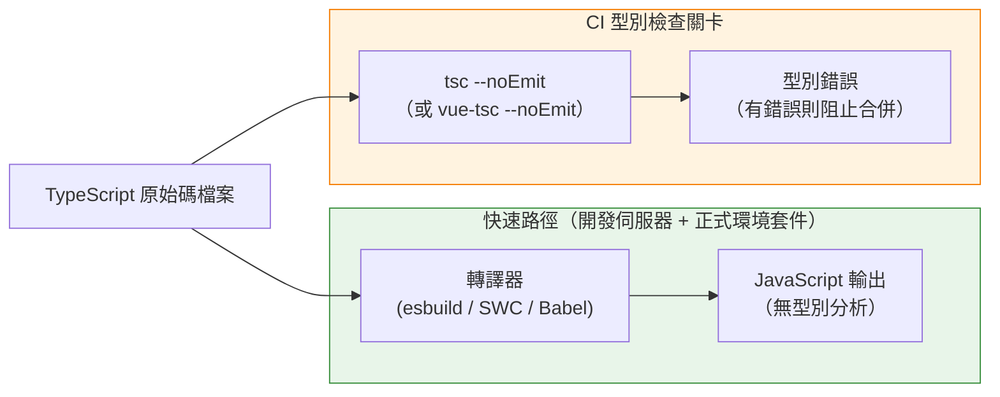

# [FEE-810] TypeScript 在建置流程中的整合

:::info
esbuild、SWC、Vite 等現代打包工具會抹除 TypeScript 的型別標註而不檢查它們，因此一個充滿型別錯誤的檔案仍可能順利轉譯並上線，不會發出任何警告。本文將這條快速、忽略型別的轉譯路徑，與真正驗證型別的獨立 `tsc --noEmit`（或 `vue-tsc --noEmit`）關卡區分開來，並說明維持兩條路徑正確運作所需的 tsconfig、CI 快取與單一儲存庫設定。文章也涵蓋讓逐檔案抹除得以安全進行的關鍵旗標，`isolatedModules`／`verbatimModuleSyntax` 與 `erasableSyntaxOnly`，以及 TypeScript 7.0 的原生編譯器與 Node.js 內建的型別剝除，如何改變這種分工背後的效能考量。
:::

## 背景

TypeScript 在建置流程中扮演的角色，與它作為型別檢查器的角色不同。esbuild、Vite、SWC，以及搭配 `@babel/plugin-transform-typescript` 的 Babel 等現代打包工具，透過在轉譯過程中抹除型別標註來處理 TypeScript。這比呼叫 TypeScript 編譯器（`tsc`）進行完整編譯快上許多，因為這些工具完全跳過型別解析，將型別標註視為需要清除的語法，而非需要驗證的語意。產出的 JavaScript 在每個檔案上只需數毫秒即可完成。僅轉譯的工具同樣不產生任何型別錯誤：一個包含數十個型別違規的檔案通過 esbuild 或 SWC 時，不會發出任何警告，產出的 JavaScript 會像型別都正確一樣執行。

這個區別帶來一個具體的架構後果：建置流程應該設計為兩個獨立的階段，而非一個統一的步驟。第一階段是轉譯：快速、忽略型別地將 TypeScript 原始碼轉換為 JavaScript，在開發期間於每次儲存檔案時執行，並作為正式環境的打包步驟。第二階段是型別檢查：獨立呼叫 `tsc --noEmit` 或 `vue-tsc --noEmit`，驗證整個程式的型別正確性而不產出任何檔案。轉譯留在熱重載路徑中；型別檢查則作為 CI 關卡執行。

將兩個階段混為一談，意味著以帶有輸出的 `tsc` 作為建置步驟。`tsc` 本身是以 JavaScript 實作的檢查器，每個檔案的處理速度明顯慢於 esbuild、SWC 這類原生程式碼的轉譯器，使輸出步驟成為流程的瓶頸。確切的倍數取決於專案規模與硬體，而且隨著 TypeScript 7.0 原生編譯器的推出又再次改變（見設計思維）。比速度更持久的問題在於架構本身：`tsc` 不是打包工具，不執行 tree-shaking、code splitting 或 chunk 雜湊，因此無論型別檢查速度多快，僅透過 `tsc` 建置都會放棄這些能力。

理解這個分離為何安全，需要理解 TypeScript 型別究竟是什麼。型別「標註」，也就是 `: string`、`<T>`、`interface` 等語法，是可抹除的：它們為開發者和型別檢查器而存在，瀏覽器或 Node.js 執行的 JavaScript 中不留任何痕跡。在不分析的情況下抹除標註，從執行期的角度來看是安全的，因為執行期的行為只取決於 JavaScript 程式碼的邏輯，與型別是否曾被檢查無關。不過，少數 TypeScript 語法並非純粹的標註：enum、持有執行期數值的 namespace、參數屬性（parameter properties），以及搭配 `emitDecoratorMetadata` 的裝飾器，都會產生真正的 JavaScript，轉譯器必須特別處理它們，或拒絕編譯，而不能只是單純刪除語法。型別系統剩下的價值，也就是在執行期之前捕捉錯誤，是型別檢查器的工作，而且沒有任何機制會自動執行這項工作。將它排入流程，是一個獨立、明確的步驟。

為現代建置流程配置 TypeScript 專案，因此需要明確兩件事：轉譯器需要了解的專案結構，以及 `tsc` 執行精確型別檢查所需的資訊。`tsconfig.json` 服務於這兩個角色，但對於大型專案，常見的做法是維護一個基礎配置，由型別檢查器和打包工具共同繼承，並搭配一個獨立的 `tsconfig.build.json`，只覆蓋型別檢查路徑特有的選項，例如設定 `noEmit: true` 以避免型別檢查器嘗試寫入檔案。這個分離讓配置保持明確，並防止型別檢查路徑意外繼承函式庫建置才需要的輸出選項，反之亦然。

## 視覺對比



## 範例

```jsonc
// tsconfig.json — 由型別檢查器與 IDE 共享的基礎配置
{
  "compilerOptions": {
    "target": "ESNext",
    "module": "ESNext",
    "moduleResolution": "bundler",
    "strict": true,
    "verbatimModuleSyntax": true,
    "incremental": true,
    "tsBuildInfoFile": ".tsbuildinfo",
    "declaration": true,
    "declarationMap": true,
    "declarationDir": "dist/types",
    "paths": {
      "@/*": ["./src/*"]
    },
    "skipLibCheck": true
  },
  "include": ["src"]
}

// tsconfig.build.json — 繼承基礎配置；僅用於 CI 型別檢查路徑
// {
//   "extends": "./tsconfig.json",
//   "compilerOptions": {
//     "noEmit": true,
//     "declaration": false,
//     "declarationMap": false
//   }
// }

// vite.config.ts — 打包工具別名必須與 tsconfig paths 一致
// import { defineConfig } from 'vite';
// import { resolve } from 'path';
// export default defineConfig({
//   resolve: {
//     alias: { '@': resolve(__dirname, 'src') }
//   }
// });

// CI 流程（虛擬 YAML，兩個獨立的工作）：
//
// type-check:
//   steps:
//     - restore_cache: .tsbuildinfo
//     - run: tsc -p tsconfig.build.json
//     - save_cache: .tsbuildinfo
//
// build:
//   steps:
//     - run: vite build   # 僅轉譯，不進行型別檢查
```

`verbatimModuleSyntax: true` 與 `skipLibCheck: true` 都符合 `create-vite` 目前 React 與 Vue 範本的預設值。兩者都是刻意的選擇，用來填補下方設計思維一節所描述的缺口。

## 最佳實踐

**必須（MUST）** 將 `tsc --noEmit`（Vue 專案使用 `vue-tsc --noEmit`）作為獨立於建置步驟的
必要 CI 檢查執行。用於建置開發伺服器和正式環境套件的轉譯器不分析型別。在沒有對應型別檢查
通過的情況下編譯並部署的建置，不提供任何型別安全保證。型別檢查必須是必要的狀態檢查，
意即檢查失敗時 CI 會阻擋合併，而不是開發者可以忽略的諮詢性警告。將其作為可以與測試並行
執行的獨立 CI 工作，能在保持正確性關卡的同時降低整體流程時間。

**必須（MUST）** 在所有專案的 `tsconfig.json` 中配置 `"strict": true`。這個單一旗標會開啟
一整組檢查，包括 `strictNullChecks`、`noImplicitAny`、`strictFunctionTypes`、
`strictBindCallApply`、`strictPropertyInitialization`、`noImplicitThis`、`alwaysStrict` 和
`useUnknownInCatchVariables`。這些旗標中的每一個都防止一類特定的執行期錯誤。省略
`"strict": true` 並依賴 TypeScript 寬鬆預設值的專案，獲得的型別安全保證弱得多：型別系統
會接受在生產程式碼中習慣性產生 null 解引用和隱式 `any` 傳播的模式。

**應該（SHOULD）** 啟用 `"incremental": true` 並在 CI 執行之間快取 `.tsbuildinfo` 檔案。
增量模式使 `tsc` 在每次型別檢查後寫入建置狀態檔案，並在後續執行中重複使用，只重新檢查
已變更或受遞移影響的檔案。加速的幅度取決於一次 Pull Request 的變更觸及依賴圖的比例，但
對於只觸及一小部分程式碼庫的典型變更，縮減幅度相當可觀。`.tsbuildinfo` 構件的快取金鑰
應包含 TypeScript 版本和 `tsconfig.json` 的內容雜湊，以便在任何一者變更時捨棄過時的快取。

**應該（SHOULD）** 讓 `tsconfig.json` 的 `paths` 別名與打包工具的別名配置保持同步。
TypeScript 的 `paths` 欄位僅由型別檢查器和 IDE 使用；打包工具獨立解析 import。在 `paths`
中宣告但在打包工具別名配置中缺失的別名，型別檢查會通過，但在建置時產生模組找不到的錯誤。
維護一個由 TypeScript 配置與 Vite 或 Webpack 配置共同參照的共享別名定義，可以消除這類
不同步的問題，讓別名映射成為單一真實來源，而非兩份獨立維護的副本。

**禁止（MUST NOT）** 在沒有緊接其上的解釋性注釋的情況下使用 `// @ts-ignore` 或
`// @ts-expect-error` 壓制注釋，解釋性注釋必須描述壓制安全的具體原因。壓制注釋會讓型別
檢查器對下一行保持沉默，卻不修正底層的型別問題。當壓制注釋未附解釋就被加入時，原因就此
消失，未來的讀者無法判斷這個壓制是否仍然合適，或型別系統是否已經更新為能正確處理這種
情況。不帶上下文持續累積的壓制注釋，會讓型別系統從正確性工具淪為噪音來源。壓制上方的
解釋性注釋必須說明具體原因：例如某個第三方函式庫的型別定義有誤，或是正在繞過的特定
TypeScript 編譯器限制。說明原因，可以讓這個壓制在底層原因解決後被重新檢視。

## 設計思維

### 為什麼單一檔案抹除型別需要 `verbatimModuleSyntax`（或 `isolatedModules`）

背景一節主張，在不分析的情況下抹除型別是安全的，這個主張仰賴一個特定的 TypeScript 設定。
像 esbuild 或 SWC 這樣的逐檔案轉譯器，或是底層使用的 `ts.transpileModule`，一次只處理一個
檔案，看不到程式其餘的部分。在這個限制下，多數 TypeScript 語法都能乾淨地被抹除，但少數
語法構造無法如此。`declare const enum` 是最明顯的例子：參照一個 const enum 成員，通常會在
編譯期被替換為其字面值，而這需要編譯器已經在程式的其他地方解析過該 enum 的宣告。逐檔案
的轉譯器沒有這種可見性，因此無法內聯該值；若放任不管，它會產出一個在執行期並不存在的
物件參照。同樣的盲點，也出現在跨檔案分辨 type-only import 與一般值 import 這件事上。

TypeScript 的 `isolatedModules` 旗標，會讓 `tsc` 本身拒絕逐檔案轉譯器無法正確處理的語法
構造，使錯誤在型別檢查階段就浮現，而不是稍後才以無聲誤編譯的形式出現。自 TypeScript 5.0
起，`verbatimModuleSyntax` 取代了它：它啟用 `isolatedModules` 強制執行的一切，並進一步
要求 import 與 export 明確表明自己是否為 type-only（`import type { Foo } from './foo'`），
消除了逐檔案轉譯器原本必須自行猜測的剩餘模糊性。`create-vite` 目前的範本正是基於這個原因
將 `verbatimModuleSyntax` 設為 `true`。一個使用 esbuild、SWC 或 Babel 轉譯、卻兩個旗標都
未設定的專案，等於是在賭轉譯器不會遇到它無法正確處理的那一小撮語法構造；而這並不是 `tsc`
會代為強制保證的事。

### 僅轉譯與型別檢查建置的差異

在本地工作時，兩階段流程的實際體驗容易被誤讀。開發伺服器運行中，變更立即出現在瀏覽器，
終端機對型別錯誤保持沉默。終端機沒有輸出，不代表程式碼的型別是正確的：轉譯器只是產出了
JavaScript，並未執行任何型別分析，因此也就沒有東西可以回報。開發者可以在每個被修改的行上
引入型別違規，開發伺服器仍會持續成功重載，不在建置輸出中呈現任何內容。

CI 流程的存在正是為了填補這個缺口。在 CI 中以必要檢查的形式執行 `tsc --noEmit`，意味著每個
Pull Request 在合併前都會被驗證型別正確性，無論開發者是否在本地執行過型別檢查器。這對流程
設計的實際影響是：`tsc` 完全不在熱重載路徑中。它要麼作為與測試套件並行的獨立工作執行，
要麼作為建置步驟之後的串行檢查，但絕不作為快速轉譯的前置條件。部分團隊在開發環境中以背景
程序的方式執行 `tsc --noEmit --watch`，即時呈現型別錯誤而不阻塞開發伺服器，但這屬於開發者
體驗的改善，而非流程的必要條件。

需要設計防範的失效模式是：建置通過並部署，程式碼中卻包含使用者會在執行期遇到的型別錯誤。
這種情況發生在 CI 中完全缺少型別檢查，或是將其配置為非必要檢查時。如果型別檢查只是諮詢
性質，一個引入型別錯誤的 Pull Request 仍然可以合併並部署。該錯誤接著會在對應的程式碼路徑
第一次於正式環境執行時，以執行期失敗的形式浮現。

### Node.js 內建的型別剝除

Node.js 現在會自行執行一種僅轉譯的步驟版本，完全不需要打包工具。型別剝除從 Node 22.18.0
與 Node 23.6.0 起成為 `.ts` 檔案的預設行為，並在目前的 LTS 版本 Node 24 中預設開啟。Node
是用空白字元取代 TypeScript 語法，而非直接刪除它，因此堆疊追蹤中的行號能與原始碼保持一致；
它同樣不執行任何型別分析，一個帶有型別錯誤的 `.ts` 檔案依然能執行。促使 `isolatedModules`
與 `verbatimModuleSyntax` 存在的那組限制，出於相同的根本原因也適用在這裡。Enum、持有執行期
數值的 namespace，以及參數屬性，都需要產生新的 JavaScript，而非單純刪除語法，因此 Node
會以 `ERR_UNSUPPORTED_TYPESCRIPT_SYNTAX` 拒絕這些語法構造，除非程序主動加上
`--experimental-transform-types`。裝飾器（decorators）則是另一種情況：它目前仍是 TC39
Stage 3 提案，因此 Node 在任何旗標下都不會轉換它，也不提供 polyfill，使用裝飾器的 `.ts`
檔案無論是否加上 `--experimental-transform-types`，都會以剖析錯誤失敗。TypeScript 5.8
新增了對應的編譯器選項 `erasableSyntaxOnly`，讓 `tsc` 提前拒絕 enum、帶有執行期程式碼的
namespace、參數屬性等不可抹除的語法構造，使打算在 Node 原生剝除下執行的專案，能在型別
檢查階段就捕捉到不相容之處，而非等到執行期才發現。直接在 Node 下執行 `.ts` 檔案，其正確性
仍然依賴獨立的 `tsc --noEmit` 檢查，因為 Node 本身不執行任何型別分析。

### TypeScript 7.0 與原生編譯器

將轉譯與型別檢查分離的速度論證，一直建立在 `tsc` 相對於原生程式碼轉譯器較慢這個前提上。
這個前提在 2026 年 7 月 8 日出現了變化：TypeScript 7.0 正式發布，採用以 Go 語言重寫的
編譯器，微軟稱這項工程為 Project Corsa，先前曾以 `tsgo` 二進位檔案的形式提供預覽版。微軟
表示，相較於先前以 JavaScript 實作的編譯器，完整建置的速度提升約 8 到 12 倍；VS Code
程式碼庫自身的型別檢查時間，從 125.7 秒降至 10.6 秒，Slack 也回報其 CI 型別檢查時間從
7.5 分鐘降至 1.25 分鐘。`npm install -D typescript` 現在預設會安裝 7.0 版。

這並不會消除背景一節所描述的兩階段流程的必要性：`tsc` 依然不是打包工具，CI 依然能從並行
執行型別檢查（而非串行地放在建置流程內）中受益。但曾經讓 `tsc --noEmit` 顯得太慢、不適合
每次儲存都執行的落差，如今已經大幅縮小；任何針對 `tsc` 與僅轉譯打包工具所引用的具體倍數，
都應該針對 TypeScript 7.0 重新測試，而非直接沿用舊數字。截至本文撰寫時有一項但書：
TypeScript 7.0 發布時尚未提供穩定的程式化編譯器 API，因此直接嵌入編譯器的工具，包括
`typescript-eslint` 以及 Vue、Svelte、Astro 的樣板檢查器，在該 API 推出前（預計於
TypeScript 7.1）仍運行在 TypeScript 6.0 上。

### 單一儲存庫中的 `tsconfig.json` 專案參照

大型單一儲存庫（monorepo）在型別檢查上面臨規模問題。針對整個程式碼庫執行 `tsc`，需要
TypeScript 載入並型別檢查每個套件中的每個原始碼檔案，即使只有一個套件發生了變更。對於
擁有數百個套件和數萬個原始碼檔案的程式碼庫，這會產生運行數分鐘的型別檢查步驟。檢查是
精確的，但延遲使其失去作為快速 CI 關卡的意義。

TypeScript 的專案參照（project references）透過分解型別圖來解決這個問題。單一儲存庫中的
每個套件都有自己的 `tsconfig.json`，並設定 `"composite": true`。`composite` 旗標要求套件
的輸出宣告檔案（`.d.ts`）被產出並放置在已知位置，使得依賴此套件的其他套件能夠從預先建置
的宣告中消費型別，而不必重新型別檢查其原始碼。根目錄的 `tsconfig.json` 或
`tsconfig.references.json` 在 `references` 陣列中列出所有套件。在根目錄呼叫 `tsc --build`
時，它會檢查每個套件的 `.tsbuildinfo` 檔案，根據哪些原始碼檔案發生了變更，判斷哪些套件
需要重新檢查，並跳過原始碼和依賴項均未變更的套件。

結果是一個與變更範圍而非程式碼庫規模成正比的型別檢查步驟。觸及單一套件的 Pull Request，
只重新檢查該套件以及任何遞移依賴它的套件；未變更的套件會被跳過。採用這種模式有真實的
配置成本：每個套件都需要自己的 `tsconfig.json`，根配置中的 `references` 陣列也必須與
實際的套件依賴圖保持同步。實際的效益因套件結構和硬體而異；一份針對 22 個套件的單一儲存庫
案例研究記錄到，採用專案參照後冷啟動建置時間從約 11 分鐘降至 3 分鐘。Nx 的專案參照指南
更深入地說明了設定方式與後續的維護成本（見參考資料）。

### `paths` 別名與打包工具的對齊

TypeScript 在 `tsconfig.json` 中的 `paths` 欄位允許型別檢查器解析 import 別名。常見的
模式是將 `@/components` 映射到 `./src/components`，使整個程式碼庫中的 import 能使用
簡短的別名，而非隨目錄深度變化的相對路徑。當 TypeScript 看到
`import { Button } from '@/components'` 時，它會查閱 `paths` 映射將別名解析到真實位置，
正確地型別檢查 import，並提供 IDE 自動補全，就像寫了完整路徑一樣。

打包工具對 `paths` 一無所知。TypeScript 的路徑解析在建置時不會傳達給 Vite、Webpack 或
esbuild。一個在 `tsconfig.json` 中配置了 `paths` 但未在打包工具中加入等效別名配置的專案，
型別檢查會成功通過：TypeScript 解析了別名並找到模組。但在執行期仍會失敗，因為打包工具
無法解析相同的 import。Vite 透過 `vite.config.ts` 中的 `resolve.alias` 公開此配置；
Webpack 透過 `webpack.config.js` 中的 `resolve.alias` 公開；esbuild 透過 `alias` 選項
公開。TypeScript 配置和打包工具配置兩者都必須保持同步，將相同的別名映射到相同的真實路徑。

同步的要求是細微錯誤反覆出現的根源。開發者在 `tsconfig.json` 中新增一個別名，型別檢查器
接受它，因為 IDE 使用 TypeScript 的解析，一切在本地看起來都是正確的。錯誤只在建置時，或在
沒有先執行型別檢查就運行打包工具的環境中才會浮現：打包工具產生模組找不到的錯誤。最安全的
緩解措施，是為別名配置建立單一真實來源：在 Vite 配置中定義一個共享物件，同時傳遞給
TypeScript 路徑生成工具，讓兩個配置以機制性方式保持同步，而非依賴手動規範。

### 函式庫建置的宣告檔案

當建置流程的輸出是函式庫而非應用程式時，流程必須在編譯後的 JavaScript 旁邊產出 `.d.ts`
宣告檔案。宣告檔案向消費者描述函式庫匯出的型別，而無需消費者自行編譯函式庫的 TypeScript
原始碼。安裝函式庫並從中 import 的消費者，依賴 `.d.ts` 檔案獲得 IDE 自動補全、行內文件
和型別推斷。沒有宣告檔案，函式庫的匯出從消費者的角度看型別都是 `any`，型別檢查器也無法
驗證消費者是否正確使用函式庫。

兩個 `tsconfig.json` 旗標控制宣告檔案的產出。`"declaration": true` 旗標告訴 `tsc` 為每個
JavaScript 輸出檔案產出一個對應的 `.d.ts` 檔案。`"declarationMap": true` 旗標產出額外的
`.d.ts.map` 檔案，將每個宣告映射回原始的 TypeScript 原始碼，讓 IDE 的「前往定義」功能
能跳到原始碼而非產生的宣告。這兩個旗標都應在函式庫建置使用的 `tsconfig.json` 中啟用。
它們與型別檢查路徑使用的 `"noEmit": true` 旗標是不同的：函式庫建置必須產出檔案，所以
`"noEmit"` 在函式庫建置配置中必須缺席或設為 `false`。

`"declarationDir"` 選項指定 `tsc` 寫入宣告檔案的位置，應設定為與打包工具輸出相同的目錄，
使發布的套件在預期位置同時包含 JavaScript 檔案和對應的宣告檔案。許多函式庫建置流程使用
Rollup 或 Vite 的函式庫模式來產出 JavaScript，並使用獨立的 `tsc` 呼叫來產出宣告檔案，
因為打包工具通常不產出 TypeScript 宣告。產生宣告的流程步驟可以與打包工具步驟並行執行，
因為兩者都不依賴對方的輸出。

### 增量型別檢查與 `.tsbuildinfo`

即使沒有專案參照，TypeScript 也提供了一個機制來加速後續執行的型別檢查：`"incremental": true`
編譯器選項。啟用增量模式時，`tsc` 在每次成功的型別檢查後寫入一個 `.tsbuildinfo` 檔案。
此檔案包含型別檢查狀態的序列化表示：哪些檔案被處理、它們的修改時間、推導出了哪些型別資訊，
以及產生了哪些診斷。在下一次執行時，`tsc` 讀取 `.tsbuildinfo` 檔案，與檔案系統的當前狀態
比對，識別哪些檔案發生了變更或受到變更檔案的遞移影響，然後只重新檢查那些檔案。未變更且其
遞移依賴項也未變更的檔案完全跳過。

對於大多數 Pull Request 只觸及全部原始碼一小部分的程式碼庫，CI 中的效益相當顯著：冷啟動
需要數分鐘的型別檢查，一旦上次執行留下的 `.tsbuildinfo` 檔案被還原為快取構件，耗時就能
大幅縮短，因為只有變更過的檔案及其遞移依賴會被重新檢查。這要求 CI 流程在執行之間快取
`.tsbuildinfo` 檔案，將其作為 CI 構件儲存，快取金鑰反映 `tsconfig.json` 的內容和
TypeScript 及其依賴項的已安裝版本。當 `tsconfig.json` 變更或 TypeScript 升級時，快取金鑰
改變，舊的 `.tsbuildinfo` 檔案被捨棄，完整的型別檢查執行以重建狀態。

`.tsbuildinfo` 檔案應加入 `.gitignore` 以避免出現在版本控制中，但必須在 CI 執行之間保留
才能發揮效能效益。若 CI 環境在每次執行時都建立全新的工作區且不還原快取，增量選項就不會
帶來任何效益：每次執行都是冷啟動。大多數 CI 平台對於在同一分支的執行之間快取建置構件提供
一流的支援，而 `.tsbuildinfo` 檔案是容易快取的構件，因為它的路徑是確定性的，格式在
TypeScript 修補版本之間也保持穩定。

## 常見錯誤

- 以帶有輸出的 `tsc` 作為主要建置步驟，同時依賴它進行型別檢查與 JavaScript 輸出。`tsc`
  自身編譯器的每檔案處理速度明顯慢於原生程式碼轉譯器，而且不像打包工具那樣執行
  tree-shaking、code splitting 或輸出 chunk 雜湊，因此無論型別檢查速度變得多快，這種做法
  都會放棄流程所需的能力。
- 在 CI 中完全省略 `tsc --noEmit`，依賴編輯器警告。型別錯誤在開發者開啟受影響的檔案之前
  不會被捕捉，因此一個團隊成員提交的違規可能直到在正式環境中以執行期失敗的形式出現才被
  注意到。
- 認定 `"skipLibCheck": true` 永遠是錯誤的選擇，因而在整個專案中強制設為 `false`。第三方
  `.d.ts` 檔案經常帶有專案無法修正的型別錯誤，這正是 `create-vite` 自身範本預設
  `skipLibCheck: true` 的原因。真正、範圍較小的取捨在於：設為 `true` 同時也會跳過檢查
  專案自己產出的宣告檔案；需要這層保障的函式庫作者，應該透過獨立的步驟驗證自己的 `.d.ts`
  輸出，而不是為整個專案關閉 `skipLibCheck`。
- 使用 `// @ts-ignore` 來壓制依賴版本升級所引入的型別錯誤，而不是更新型別定義。該錯誤是
  依賴 API 已經變更的信號，壓制它只是把隨之而來的執行期問題延後到正式環境才爆發。
- 在 `tsconfig.json` 中配置 TypeScript `paths` 別名，卻未在打包工具配置中加入等效的別名。
  程式碼型別檢查會成功，但在打包工具無法解析該 import 時，會在建置時或執行期失敗。
- 在單一儲存庫的專案參照設定中，忘記在被其他套件參照的套件裡設定 `"composite": true`。
  `tsc --build` 會拒絕型別檢查這些參照方，直到每個被參照的套件都正確完成 composite 設定
  為止。
- 將 `.tsbuildinfo` 檔案提交至版本控制，而不是作為 CI 構件快取。該檔案包含絕對路徑，在
  不同開發者的機器之間沒有意義，因此它應該加入 `.gitignore`，只在 CI 層快取。

## 延伸閱讀

- [構建工具與模組系統總覽](/zh-tw/Build%20Tooling%20and%20Module%20Systems/800)
- [打包工具：Webpack、Vite、Rollup 與 esbuild](/zh-tw/Build%20Tooling%20and%20Module%20Systems/801)
- [開發伺服器、HMR 與開發體驗](/zh-tw/Build%20Tooling%20and%20Module%20Systems/802)
- [轉譯：Babel、TypeScript 編譯器與 SWC](/zh-tw/Build%20Tooling%20and%20Module%20Systems/803)
- [Tree-Shaking 模式與副作用標記](/zh-tw/Build%20Tooling%20and%20Module%20Systems/809)

## 參考資料

- TypeScript Team, "TSConfig Reference," TypeScript Documentation (2026). https://www.typescriptlang.org/tsconfig
- TypeScript Team, "Project References," TypeScript Handbook (2026). https://www.typescriptlang.org/docs/handbook/project-references.html
- TypeScript Team, "isolatedModules," TSConfig Reference (2026). https://www.typescriptlang.org/tsconfig/isolatedModules.html
- TypeScript Team, "verbatimModuleSyntax," TSConfig Reference (2026). https://www.typescriptlang.org/tsconfig/verbatimModuleSyntax.html
- TypeScript Team, "erasableSyntaxOnly," TSConfig Reference (2026). https://www.typescriptlang.org/tsconfig/erasableSyntaxOnly.html
- TypeScript Team, "strict," TSConfig Reference (2026). https://www.typescriptlang.org/tsconfig#strict
- esbuild, "TypeScript," esbuild Documentation (2026). https://esbuild.github.io/content-types/#typescript
- Vite Team, "TypeScript," Vite Guide (2026). https://vite.dev/guide/features#typescript
- SWC, "TypeScript Support," SWC Documentation (2026). https://swc.rs/docs/configuration/compilation#jscparser
- Vue Language Tools Contributors, "vue-tsc," GitHub (2026). https://github.com/vuejs/language-tools/tree/master/packages/tsc
- Babel, "@babel/plugin-transform-typescript," Babel Documentation (2026). https://babeljs.io/docs/babel-plugin-transform-typescript
- Matt Pocock, "Understanding Isolated Modules in TypeScript," Total TypeScript (2026). https://www.totaltypescript.com/workshops/typescript-pro-essentials/configuring-typescript/understanding-isolated-modules-in-typescript
- Daniel Rosenwasser, "Announcing TypeScript 7.0," TypeScript Team Blog (2026). https://devblogs.microsoft.com/typescript/announcing-typescript-7-0/
- Visual Studio Magazine, "TypeScript 7.0 RC Moves Microsoft's Go Rewrite Into the Mainline Compiler," Visual Studio Magazine (2026). https://visualstudiomagazine.com/articles/2026/06/22/typescript-7-0-rc-moves-microsofts-go-rewrite-into-the-mainline-compiler.aspx
- Node.js Project, "Type Stripping," Node.js API Documentation (2026). https://nodejs.org/api/typescript.html
- vitejs/vite, "Provide explanation of `skipLibCheck: true` default in tsconfig.json of starter templates," GitHub Issue #7867 (2022). https://github.com/vitejs/vite/issues/7867
- Gabriel Anhaia, "TypeScript Project References: 11-Minute Builds Down to 3," DEV Community (2026). https://dev.to/gabrielanhaia/typescript-project-references-11-minute-builds-down-to-3-2kif
- Nx, "Everything You Need to Know About TypeScript Project References," Nx Blog (2026). https://nx.dev/blog/typescript-project-references
