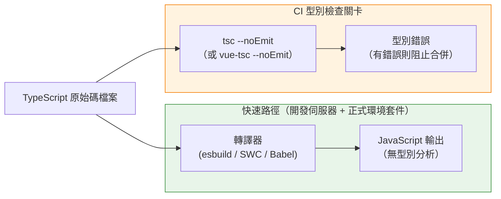

# TypeScript 在建置流程中的整合

TypeScript 在建置流程中扮演的角色，與它作為型別檢查器的角色有本質上的差異。現代打包工具
——esbuild、Vite、SWC，以及搭配 `@babel/plugin-transform-typescript` 的 Babel——
透過在轉譯過程中抹除型別標註來處理 TypeScript。這個過程比使用 TypeScript 編譯器（`tsc`）
進行完整編譯快上數個數量級，因為這些工具完全跳過型別解析，將型別標註視為需要清除的語法，
而非需要驗證的語意。產出的 JavaScript 在每個檔案上只需數毫秒即可完成。這個取捨是絕對的：
僅轉譯的工具不產生任何型別錯誤。一個包含數十個型別違規的檔案通過 esbuild 或 SWC 時，不會
發出任何警告，而產出的 JavaScript 會像型別都正確一樣執行。

這個區別帶來一個具體的架構後果：建置流程必須設計為兩個獨立的階段，而非一個統一的步驟。
第一階段是轉譯——快速、忽略型別地將 TypeScript 原始碼轉換為 JavaScript，在開發期間
於每次儲存檔案時執行，並作為正式環境的打包步驟。第二階段是型別檢查——獨立呼叫
`tsc --noEmit` 或 `vue-tsc --noEmit`，驗證整個程式的型別正確性而不產出任何檔案。
這兩個階段獨立運作：轉譯留在熱重載路徑中；型別檢查作為 CI 關卡執行。將兩者混為一談
——使用帶有輸出的 `tsc` 作為建置步驟——會產生一個慢上 5 至 10 倍的流程，卻又沒有增加
任何打包工具的最佳化能力，因為 `tsc` 本身並不是打包工具，不執行 tree-shaking、
code splitting 或死碼消除。

理解這個分離存在的原因，需要理解 TypeScript 型別究竟是什麼。型別標註在執行期會被抹除
——它們純粹為開發者和型別檢查器而存在。瀏覽器或 Node.js 執行的 JavaScript 中不留任何
型別的痕跡。由於型別純粹是編輯時的存在，在不分析的情況下抹除它們，從執行期的角度來看
是語意安全的。執行期的結果是否正確，完全取決於 JavaScript 程式碼的邏輯。型別系統的價值
在於在執行期之前、在開發期間捕捉錯誤——這是型別檢查器的工作，而且必須明確地排程，因為
轉譯器已經選擇退出這項工作。

為現代建置流程配置 TypeScript 專案，因此需要明確兩件事：轉譯器需要了解的專案結構，以及
`tsc` 執行精確型別檢查所需的資訊。`tsconfig.json` 服務於兩者——但對於大型專案，常見的做法
是維護一個基礎配置，由型別檢查器和打包工具共同繼承，並搭配一個獨立的 `tsconfig.build.json`，
只覆蓋型別檢查路徑特有的選項，例如設定 `noEmit: true` 以避免型別檢查器嘗試寫入檔案。
這個分離讓配置保持明確，並防止型別檢查路徑意外繼承函式庫建置才需要的輸出選項，反之亦然。

## 原則

工程師**必須（MUST）**在建置流程中將轉譯與型別檢查分離。esbuild、SWC 及
Babel 的 `@babel/plugin-transform-typescript` 等轉譯器只抹除型別標註，不進行驗證。
`tsc --noEmit` 指令——Vue 專案則使用 `vue-tsc --noEmit`——在不產出任何輸出檔案的情況下
執行型別檢查。兩個階段獨立運作：轉譯在開發伺服器的每次儲存和正式環境打包時執行；
型別檢查作為必要的 CI 關卡執行。通過建置但未執行對應型別檢查的流程，並不意味著型別正確
——它只意味著轉譯器未遭遇 JavaScript 語法錯誤。

工程師**應該（SHOULD）**在所有專案的 `tsconfig.json` 中以 `"strict": true` 作為基準配置。
`strict` 旗標是一個複合旗標，它同時啟用 `strictNullChecks`、`noImplicitAny`、
`strictFunctionTypes`、`strictBindCallApply`、`strictPropertyInitialization`、
`noImplicitThis` 和 `useUnknownInCatchVariables`。這些旗標中的每一個都能防止一類特定的
執行期錯誤。若需要放寬任何個別的嚴格旗標——例如單獨設定 `"strictNullChecks": false`
——需要有書面化的團隊決策，因為這樣做會重新引入 `strict: true` 原本在防範的整個錯誤類別。
停用一個嚴格旗標的代價，不是單一一個被壓制的錯誤，而是該類別中所有未來的錯誤。

## 設計思維

### 僅轉譯與型別檢查建置的差異

在本地工作時，兩階段流程的實際體驗容易被誤讀。開發伺服器運行中，變更立即出現在瀏覽器，
終端機對型別錯誤保持沉默。這種沉默不代表正確——而是轉譯器在做它被設計來做的事：以最快的
速度產出 JavaScript，不進行任何型別分析。開發者可以在每個被修改的行上引入型別違規，
開發伺服器將繼續成功重載，不在建置輸出中呈現任何內容。

CI 流程的存在正是為了填補這個缺口。在 CI 中以必要檢查的形式執行 `tsc --noEmit`，意味著每個
Pull Request 在合併前都會被驗證型別正確性，無論開發者是否在本地執行過型別檢查器。這對流程
設計的實際影響是：`tsc` 完全不在熱重載路徑中。它要麼作為與測試套件並行的獨立工作執行，
要麼作為建置步驟之後的串行檢查，但絕不作為快速轉譯的前置條件。部分團隊在開發環境中以背景
程序的方式執行 `tsc --noEmit --watch` 來即時呈現型別錯誤而不阻塞開發伺服器，但這是開發者
體驗的改善，而非流程的必要條件。

需要設計防範的失效模式是：建置通過並部署，而程式碼中包含用戶在執行期才會遇到的型別錯誤。
這種失效模式出現在 CI 中完全缺少型別檢查，或將其配置為非必要檢查時。它特別難以察覺，因為
錯誤在生產環境中觸發包含型別違規的程式碼路徑之前都是隱形的。TypeScript 的價值與其執行的
完整性成正比：在流程層面為可選的型別系統，提供的保證並不強於偶爾在某些情況下拋出錯誤的
執行期。

### 單一儲存庫中的 `tsconfig.json` 專案參照

大型單一儲存庫（monorepo）在型別檢查上面臨規模問題。針對整個程式碼庫執行 `tsc`，需要
TypeScript 載入並型別檢查每個套件中的每個原始碼檔案，即使只有一個套件發生了變更。對於
擁有數百個套件和數萬個原始碼檔案的程式碼庫，這會產生運行數分鐘的型別檢查步驟。檢查是
精確的，但延遲使其失去作為快速 CI 關卡的意義。

TypeScript 的專案參照（project references）透過分解型別圖來解決這個問題。單一儲存庫中的
每個套件都有自己的 `tsconfig.json`，並設定 `"composite": true`。`composite` 旗標要求套件
的輸出宣告檔案（`.d.ts`）被產出並放置在已知位置，使得依賴此套件的其他套件能夠從預先建置
的宣告中消費型別，而不必重新型別檢查其原始碼。根目錄的 `tsconfig.json` 或
`tsconfig.references.json` 在 `references` 陣列中列出所有套件。在根目錄呼叫 `tsc --build`
時，它會檢查每個套件的 `.tsbuildinfo` 檔案，根據哪些原始碼檔案發生了變更，判斷哪些套件
需要重新檢查，並跳過原始碼和依賴項均未變更的套件。

結果是一個與變更範圍而非程式碼庫規模成正比的型別檢查步驟。觸及單一套件的 Pull Request，
只重新檢查該套件以及任何遞移依賴它的套件；未變更的套件被跳過。對於採用此模式的團隊而言，
配置的成本是真實存在的——每個套件都需要 `tsconfig.json`，根配置中的 `references` 陣列也
必須與實際的套件依賴圖保持同步——但 CI 型別檢查時間的縮減相當顯著。擁有非常大型單一儲存庫
的團隊，在正確配置專案參照後，往往能看到型別檢查時間縮短一個數量級。

### `paths` 別名與打包工具的對齊

TypeScript 在 `tsconfig.json` 中的 `paths` 欄位允許型別檢查器解析 import 別名。常見的
模式是將 `@/components` 映射到 `./src/components`，使整個程式碼庫中的 import 能使用
簡短的別名，而非隨目錄深度變化的相對路徑。當 TypeScript 看到
`import { Button } from '@/components'` 時，它會查閱 `paths` 映射將別名解析到真實位置，
正確地型別檢查 import，並提供 IDE 自動補全，就像寫了完整路徑一樣。

打包工具對 `paths` 一無所知。TypeScript 的路徑解析在建置時不會傳達給 Vite、Webpack 或
esbuild。一個在 `tsconfig.json` 中配置了 `paths` 但未在打包工具中加入等效別名配置的專案，
型別檢查會成功通過——TypeScript 解析了別名並找到模組——但在執行期會失敗，因為打包工具
無法解析相同的 import。Vite 透過 `vite.config.ts` 中的 `resolve.alias` 公開此配置；
Webpack 透過 `webpack.config.js` 中的 `resolve.alias` 公開；esbuild 透過 `alias` 選項
公開。TypeScript 配置和打包工具配置兩者都必須保持同步，將相同的別名映射到相同的真實路徑。

同步的要求是細微錯誤反覆出現的根源。開發者在 `tsconfig.json` 中新增一個別名，型別檢查器
接受它，因為 IDE 使用 TypeScript 的解析，一切在本地看起來都是正確的。錯誤只在建置時，或在
沒有先執行型別檢查就運行打包工具的環境中才會浮現——打包工具產生模組找不到的錯誤。最安全的
緩解措施是為別名配置使用單一的真實來源——例如在 Vite 配置中定義一個共享物件，並傳遞給
TypeScript 路徑生成工具——讓兩個配置以機制性方式保持同步，而非依賴手動規範。

### 函式庫建置的宣告檔案

當建置流程的輸出是函式庫而非應用程式時，流程必須在編譯後的 JavaScript 旁邊產出 `.d.ts`
宣告檔案。宣告檔案向消費者描述函式庫匯出的型別，而無需消費者自行編譯函式庫的 TypeScript
原始碼。安裝函式庫並從中 import 的消費者，依賴 `.d.ts` 檔案獲得 IDE 自動補全、行內文件
和型別推斷。沒有宣告檔案，函式庫的匯出從消費者的角度看型別都是 `any`，型別檢查器也無法
驗證消費者是否正確使用函式庫。

兩個 `tsconfig.json` 旗標控制宣告檔案的產出。`"declaration": true` 旗標告訴 `tsc` 為每個
JavaScript 輸出檔案產出一個對應的 `.d.ts` 檔案。`"declarationMap": true` 旗標產出額外的
`.d.ts.map` 檔案，將每個宣告映射回原始的 TypeScript 原始碼，讓 IDE 的「前往定義」功能
能跳到原始碼而非產生的宣告。這兩個旗標都應在函式庫建置使用的 `tsconfig.json` 中啟用。
它們與型別檢查路徑使用的 `"noEmit": true` 旗標是不同的——函式庫建置必須產出檔案，所以
`"noEmit"` 在函式庫建置配置中必須缺席或設為 `false`。

`"declarationDir"` 選項指定 `tsc` 寫入宣告檔案的位置，應設定為與打包工具輸出相同的目錄，
使發布的套件在預期位置同時包含 JavaScript 檔案和對應的宣告檔案。許多函式庫建置流程使用
Rollup 或 Vite 的函式庫模式來產出 JavaScript，並使用獨立的 `tsc` 呼叫來產出宣告檔案，
因為打包工具通常不產出 TypeScript 宣告。產生宣告的流程步驟可以與打包工具步驟並行執行，
因為兩者都不依賴對方的輸出。

### 增量型別檢查與 `.tsbuildinfo`

即使沒有專案參照，TypeScript 也提供了一個機制來加速後續執行的型別檢查：`"incremental": true`
編譯器選項。啟用增量模式時，`tsc` 在每次成功的型別檢查後寫入一個 `.tsbuildinfo` 檔案。
此檔案包含型別檢查狀態的序列化表示：哪些檔案被處理、它們的修改時間、推導出了哪些型別資訊，
以及產生了哪些診斷。在下一次執行時，`tsc` 讀取 `.tsbuildinfo` 檔案，與檔案系統的當前狀態
比對，識別哪些檔案發生了變更或受到變更檔案的遞移影響，然後只重新檢查那些檔案。未變更且其
遞移依賴項也未變更的檔案完全跳過。

對於大多數 Pull Request 只觸及全部原始碼一小部分的程式碼庫，CI 中的效益是顯著的。冷啟動
需要數分鐘的型別檢查，在上次 CI 執行的 `.tsbuildinfo` 檔案作為快取可用時，可能在三十秒內
完成。這要求 CI 流程在執行之間快取 `.tsbuildinfo` 檔案——將其作為 CI 構件儲存，快取金鑰
反映 `tsconfig.json` 的內容和 TypeScript 及其依賴項的已安裝版本。當 `tsconfig.json` 變更
或 TypeScript 升級時，快取金鑰改變，舊的 `.tsbuildinfo` 檔案被捨棄，完整的型別檢查執行以
重建狀態。

`.tsbuildinfo` 檔案應加入 `.gitignore` 以避免出現在版本控制中，但必須在 CI 執行之間保留
以獲得效能收益。若 CI 環境在每次執行時建立全新的工作區且不還原快取，增量選項不提供任何
收益——每次執行都是冷啟動。大多數 CI 平台對在同一分支執行之間快取建置構件提供一流的支援，
而 `.tsbuildinfo` 檔案是易於快取的直接構件，因為其路徑是確定性的，格式在 TypeScript
修補版本之間是穩定的。

## 最佳實踐

**必須（MUST）**將 `tsc --noEmit`（Vue 專案使用 `vue-tsc --noEmit`）作為獨立於建置步驟的
必要 CI 檢查執行。用於建置開發伺服器和正式環境套件的轉譯器不分析型別。在沒有對應型別檢查
通過的情況下通過並部署的建置，不提供任何型別安全保證。型別檢查必須是必要的狀態檢查
——一個在失敗時阻止合併的檢查——而非諮詢性警告。將其作為可以與測試並行執行的獨立 CI 工作，
在保持正確性關卡的同時降低整體流程時間。

**必須（MUST）**在所有專案的 `tsconfig.json` 中配置 `"strict": true`。這個單一旗標同時
啟用 `strictNullChecks`、`noImplicitAny`、`strictFunctionTypes`、`strictBindCallApply`、
`strictPropertyInitialization`、`noImplicitThis` 和 `useUnknownInCatchVariables`。這些旗標
中的每一個都防止一類特定的執行期錯誤。省略 `"strict": true` 並依賴 TypeScript 寬鬆預設的
專案，獲得的型別安全保證弱得多——型別系統會接受在生產程式碼中習慣性產生 null 解引用和隱式
`any` 傳播的模式。

**應該（SHOULD）**啟用 `"incremental": true` 並在 CI 執行之間快取 `.tsbuildinfo` 檔案。
增量模式使 `tsc` 在每次型別檢查後寫入建置狀態檔案，並在後續執行中重複使用，只重新檢查
已變更或受遞移影響的檔案。當快取已填充時，對於觸及少部分程式碼庫的典型 Pull Request，
這可以將多分鐘的型別檢查縮短至一分鐘以內。`.tsbuildinfo` 構件的快取金鑰應包含 TypeScript
版本和 `tsconfig.json` 的內容雜湊，以便在任何一者變更時捨棄過時的快取。

**應該（SHOULD）**讓 `tsconfig.json` 的 `paths` 別名與打包工具的別名配置保持同步。
TypeScript 的 `paths` 欄位僅由型別檢查器和 IDE 使用；打包工具獨立解析 import。在 `paths`
中宣告但在打包工具別名配置中缺失的別名，型別檢查會通過，但在建置時產生模組找不到的錯誤。
維護一個共享的別名定義——同時被 TypeScript 配置和 Vite 或 Webpack 配置參照——消除了這類
不同步的可能性，讓別名映射成為單一真實來源，而非兩份獨立維護的副本。

**禁止（MUST NOT）**在沒有緊接其上的解釋性注釋的情況下使用 `// @ts-ignore` 或
`// @ts-expect-error` 壓制注釋，解釋性注釋必須描述壓制安全的具體原因。壓制注釋在不修正
底層型別問題的情況下讓型別檢查器對下一行保持沉默。當壓制注釋在沒有解釋的情況下被加入時，
原因就消失了，未來的讀者無法判斷這個壓制是否仍然合適，或者型別系統是否已更新為能正確處理
這種情況。不帶上下文積累的壓制注釋，將型別系統從正確性工具降格為噪音來源。壓制上方的
解釋性注釋必須說明具體原因——例如某個有不正確型別定義的第三方函式庫，或正在繞過的
TypeScript 編譯器限制——以便在底層原因解決時能重新審視這個壓制。

## 視覺呈現



## 範例

```jsonc
// tsconfig.json — 由型別檢查器與 IDE 共享的基礎配置
{
  "compilerOptions": {
    "target": "ESNext",
    "module": "ESNext",
    "moduleResolution": "bundler",
    "strict": true,
    "incremental": true,
    "tsBuildInfoFile": ".tsbuildinfo",
    "declaration": true,
    "declarationMap": true,
    "declarationDir": "dist/types",
    "paths": {
      "@/*": ["./src/*"]
    },
    "skipLibCheck": false
  },
  "include": ["src"]
}

// tsconfig.build.json — 繼承基礎配置；僅用於 CI 型別檢查路徑
// {
//   "extends": "./tsconfig.json",
//   "compilerOptions": {
//     "noEmit": true,
//     "declaration": false,
//     "declarationMap": false
//   }
// }

// vite.config.ts — 打包工具別名必須與 tsconfig paths 一致
// import { defineConfig } from 'vite';
// import { resolve } from 'path';
// export default defineConfig({
//   resolve: {
//     alias: { '@': resolve(__dirname, 'src') }
//   }
// });

// CI 流程（虛擬 YAML，兩個獨立的工作）：
//
// type-check:
//   steps:
//     - restore_cache: .tsbuildinfo
//     - run: tsc -p tsconfig.build.json
//     - save_cache: .tsbuildinfo
//
// build:
//   steps:
//     - run: vite build   # 僅轉譯，不進行型別檢查
```

## 常見錯誤

- 以帶有輸出的 `tsc` 作為主要建置步驟，同時依賴它進行型別檢查和 JavaScript 輸出——這比
  僅轉譯的打包工具慢 5 至 10 倍，並且放棄了需要打包工具控制模組圖才能實現的所有打包工具
  最佳化（tree-shaking、code splitting、chunk 雜湊）。
- 在 CI 中完全省略 `tsc --noEmit`，依賴編輯器警告——型別錯誤在開發者開啟受影響的檔案之前
  都不會被捕捉，因此一個團隊成員提交的違規可能直到在生產環境作為執行期失敗出現才被注意到。
- 全域設定 `"skipLibCheck": true` 來壓制來自第三方依賴的 `.d.ts` 錯誤——這也壓制了專案
  自身宣告檔案中的錯誤，遮蔽了由專案自身函式庫建置引入的真實型別回歸。
- 使用 `// @ts-ignore` 來壓制依賴版本升級引入的型別錯誤，而非更新型別定義——該錯誤是
  依賴 API 已變更的信號，壓制它只是將不可避免的執行期問題推遲到生產環境。
- 在 `tsconfig.json` 中配置 TypeScript `paths` 別名，卻未在打包工具配置中加入等效別名
  ——程式碼型別檢查成功，但在打包工具無法解析 import 時於建置或執行期失敗。
- 在單一儲存庫專案參照設定中，忘記在被其他套件參照的套件中設定 `"composite": true`
  ——`tsc --build` 會拒絕型別檢查參照套件，直到所有被參照的套件都正確配置 composite。
- 將 `.tsbuildinfo` 檔案提交至版本控制，而非在 CI 構件中快取——該檔案包含絕對路徑，在
  不同開發者機器之間沒有意義；它應加入 `.gitignore`，僅在 CI 層快取。

## 相關 FEE

- FEE-800 — 建置工具與模組系統概覽
- FEE-801 — ES 模組與 CommonJS 互通性
- FEE-802 — Vite 架構與配置
- FEE-803 — Webpack 配置與最佳化
- FEE-809 — Tree-Shaking 模式與副作用標記

## 參考資料

- TypeScript Handbook：tsconfig 參考 — https://www.typescriptlang.org/tsconfig
- TypeScript：專案參照 — https://www.typescriptlang.org/docs/handbook/project-references.html
- esbuild：TypeScript — https://esbuild.github.io/content-types/#typescript
- Vite：TypeScript — https://vitejs.dev/guide/features#typescript
- SWC：TypeScript 支援 — https://swc.rs/docs/configuration/compilation#jscparser
- vue-tsc — https://github.com/vuejs/language-tools/tree/master/packages/tsc
- TypeScript：`strict` 模式 — https://www.typescriptlang.org/tsconfig#strict
- Babel：`@babel/plugin-transform-typescript` — https://babeljs.io/docs/babel-plugin-transform-typescript
