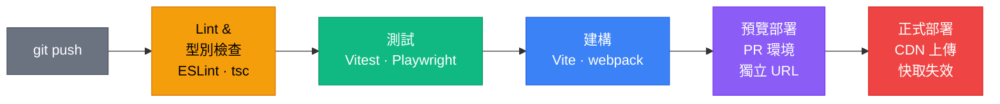
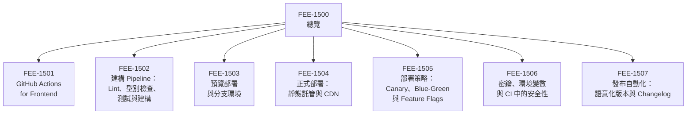

# CI/CD 與部署總覽

:::info
本分類涵蓋從 `git push` 到使用者瀏覽器的完整路徑——自動化品質關卡、可重現的建構產物、預覽環境、基於 CDN 的正式部署，以及在規模化下保持 pipeline 安全的發布工程實踐。
:::

## 情境

每當開發者推送程式碼，隨之而來的是同一個問題：這次的變更可以安全出貨嗎？在 CI/CD 出現之前，這個答案往往要等上好幾天——等到一個專屬的「發布日」，一場需要人工協調、由 build engineer 主持的事件，依照部署清單逐項操作。一旦出了問題，往往是在部署後數小時或數天才在正式環境裡被使用者發現。

Continuous Integration 與 Continuous Delivery 改變了這個答案：從「等到發布日才知道」，變成「幾分鐘內就知道，而且在合併之前就知道」。

**CI/CD 對前端意味著什麼。** 這個術語起源於伺服器端軟體，在那裡「部署」意味著在伺服器上重啟一個程序。前端部署在結構上截然不同：你的輸出是一組靜態檔案——HTML、JavaScript、CSS 與資源——這些檔案被放置到 CDN 或物件儲存上。沒有伺服器程序需要重啟。部署機制是 CDN 快取失效（cache invalidation）搭配內容定址的檔名（Content hash：在檔名中嵌入雜湊值，確保使用者永遠載入與其正在使用的應用程式版本對應的檔案）。理解這個區別至關重要：前端 CI/CD pipeline 產出的不是一個正在執行的伺服器，而是一個會被全球分發的靜態產物。

**三個階段：CI、CD、CD。** 這些術語常被合稱為「CI/CD」，但它們描述的是不同的實踐：

- **Continuous Integration（CI）** 意味著每個分支的每次 commit 都會自動建構並測試。目的是立即偵測整合失敗——型別錯誤、測試失敗、lint 錯誤、bundle 體積超標——趁著變更還小、作者還有完整脈絡的時候。CI 把關 pull request：在所有檢查通過之前，分支不能合併。

- **Continuous Delivery（持續交付）** 意味著主分支始終處於可部署的狀態。每次 CI 在主分支通過，pipeline 就產出一個可用於正式環境的產物。實際的部署由人工決策觸發——點一個按鈕或依照排程發布。這是最常見的模型，適合想要自動化但不想從正式環境完全移除人工把關的團隊。

- **Continuous Deployment（持續部署）** 則完全移除人工把關。每個在主分支通過 CI 的 commit 都會自動部署到正式環境。這需要對測試套件與部署 pipeline 有高度信心，但它消除了「程式碼就緒」與「使用者拿到程式碼」之間的延遲。

多數前端團隊從 Continuous Integration 與 Continuous Delivery 開始。在大規模運作高信心 pipeline 的部分團隊，會對其 Web 應用採用 Continuous Deployment。

**CI 執行的解剖。** 典型的前端 CI job 按順序執行四個關卡。第一，靜態分析：ESLint 檢查風格與正確性規則，TypeScript 編譯器以 `--noEmit` 旗標執行，捕捉型別錯誤而不產生輸出。這兩個檢查很快——通常不超過三十秒——並且能捕捉最常見的錯誤類別：型別錯誤、未使用的變數、缺少的匯入以及違反的程式碼規範。第二，測試套件執行：Vitest 跑單元測試、React Testing Library 跑元件測試，以及可選的 Playwright 執行端對端測試。第三，正式建構執行，使用最終部署到正式環境時相同的工具——Vite、webpack 或其他打包工具。這確認了建構本身不會失敗（只在建構期間編譯器才會發現的 TypeScript 錯誤、缺少的環境變數、損壞的資源路徑）。第四，可選的建構後檢查執行：bundle 體積斷言、Lighthouse 審核、無障礙檢查。Pipeline 在所有四個關卡上回報通過或失敗，PR 在全部通過之前被封鎖。

**CI/CD 為何重要。** CI/CD 直接解決的四個問題：

*在正式環境前捕捉錯誤。* 重構引入的型別錯誤、相依套件升級後開始失敗的測試、超出體積預算的 bundle——這些都會在幾分鐘內被 CI 捕獲，而不是在部署後數小時被使用者發現。在 CI 中找到並修復一個 bug 的成本，是在部署後修復的一小部分：沒有回滾、沒有事故、沒有使用者影響。

*可重現的建構。* 「在我的機器上可以跑」是一類 CI 能消除的失敗。CI 環境由程式碼定義（workflow 檔案、Dockerfile、固定版本的 Node.js 與 pnpm），在一致的硬體上執行，對相同的輸入每次都產生相同的輸出。如果本機建構通過但 CI 失敗，差異立即可見且可採取行動。

*團隊速度。* 沒有 CI，程式碼審查很大程度上依賴審查者手動確認沒有明顯問題。有了 CI，PR 已經帶著綠色狀態：型別正確、測試通過、lint 乾淨。審查者聚焦在設計、意圖與正確性，而非機械式的驗證。這讓審查更快、更一致，尤其在並非每個審查者都熟悉每個子系統的團隊中。

*「在我機器上可以跑」這類失敗。* 開發者工作的環境有微妙的差異——不同的作業系統版本、不同的全域 Node.js 安裝、不同的 `node_modules` 快取樹。CI 提供了一個乾淨、受控的環境，這些本地差異都不適用。如果 CI 通過但你的本機建構失敗，問題在你的本地環境。如果 CI 失敗但你的本機建構通過，存在一個相依或設定差異，這會影響其他開發者和正式環境——而 CI 在它出貨之前就捕獲了它。

### 本分類涵蓋的內容

FEE-1501 至 FEE-1507 的七篇子文章涵蓋從 workflow 撰寫到發布自動化的完整 pipeline：

- **FEE-1501 — GitHub Actions for Frontend：** workflow 模型——觸發器、jobs、steps、runners——以及讓 GitHub Actions 成為多數前端團隊預設 CI 平台的具體模式：快取 `node_modules` 與建構產物、跨環境測試的矩陣建構（matrix build），以及用於 DRY pipeline 定義的可重用 workflow。

- **FEE-1502 — 建構 Pipeline：Lint、型別檢查、測試與建構：** 每個前端 CI job 應按順序執行的四個品質關卡——ESLint、TypeScript 型別檢查、測試套件與正式建構——以及平行化策略與如何解讀每個層次的 CI 失敗。

- **FEE-1503 — 預覽部署與分支環境：** Vercel、Netlify、Cloudflare Pages 等平台如何自動將每個 pull request 部署到獨立的 URL，讓審查者在合併之前就能看到變更的即時呈現。臨時環境的運作機制，以及它們如何改變審查流程。

- **FEE-1504 — 正式部署：靜態託管與 CDN：** 靜態前端產物如何被全球分發——物件儲存後端、CDN 邊緣快取、Cache-Control header，以及為何內容定址的檔名（雜湊檔名）讓積極的快取控制變得安全。比較託管平台（Vercel、Netlify）與自架配置（S3 + CloudFront、Cloudflare R2）。

- **FEE-1505 — 部署策略：Canary、Blue-Green 與 Feature Flags：** 在全量上線前向部分使用者出貨的技術——Canary 部署（將一定比例的流量路由到新版本）、Blue-Green 環境（同時運行兩個版本並原子性切換流量），以及 Feature Flags（出貨預設關閉的程式碼，與部署獨立切換）。

- **FEE-1506 — 密鑰、環境變數與 CI 中的安全性：** 如何在 CI 環境中管理 API 金鑰、token 與設定，而不洩漏到建構產物或日誌中。GitHub Actions 加密密鑰、環境作用域變數，以及可以安全嵌入用戶端 bundle 與不可嵌入的變數之間的區別。

- **FEE-1507 — 發布自動化：語意化版本與 Changelog：** Conventional Commits、semantic-release 與 Changesets 如何自動化版本號遞增、changelog 生成與 npm 發布流程，讓發布一個函式庫成為 CI job 而非手動流程。

## 設計思維

### 為何前端 CI/CD 在結構上與後端不同

後端 CI/CD pipeline 產出一個伺服器產物——Docker image、JAR 檔、執行檔——部署意味著將該產物放置到伺服器上並重啟程序。部署單元是一個有狀態、有連線、有生命週期的執行中服務。

前端 CI/CD 產出靜態檔案。Vite 建構完成後，輸出是一個包含 HTML、雜湊 JavaScript chunk、CSS 與資源的 `dist/` 目錄。部署意味著將該目錄上傳至物件儲存或 CDN 邊緣。沒有程序需要重啟，沒有連線需要排空，沒有健康檢查端點需要輪詢。

這讓前端部署既更簡單又更特殊。更簡單是因為沒有伺服器要管理。更特殊是因為「部署」並非原子性的——世界各地的 CDN 邊緣以不同速度傳播新檔案，而已經載入應用程式的使用者可能在其會話期間持續執行舊版本的 JavaScript。優雅地管理這個問題——透過內容定址的檔名、正確的快取 header 與應用程式層級的版本偵測——是前端特有的，後端沒有對應的等效問題。

CDN 快取失效問題是前端部署的核心運維挑戰。如果你提供沒有雜湊值的 `main.js` 並設定長時間的 `Cache-Control` header，昨天載入應用程式的使用者即使在你部署新版本後，仍會從 CDN 快取收到舊的 `main.js`。內容雜湊解決了這個問題：`main.a3f8d2.js` 與 `main.9c1e45.js` 是不同的 URL，CDN 不存在舊版本可以提供。代價是每次部署都產出一組新的檔名，HTML 進入點必須引用這些檔名——而這正是 Vite 等建構工具自動處理的事情。

### 平台選擇：託管 vs. 自架

前端 CI/CD 在兩大類基礎設施上運行。

**託管平台**如 GitHub Actions、Vercel 與 Netlify，為你處理基礎設施。你撰寫 workflow 檔案；平台配置 runner、執行你的 job 並呈現結果。託管平台自動處理快取、runner 維護與擴展。對多數團隊而言，這是正確的起點——運維負擔接近於零，從零到可運作的 pipeline 只需數小時而非數天。

**自架 runner**（GitHub Actions self-hosted、GitLab Runner 部署在自有硬體、Jenkins）讓你控制執行環境——自訂硬體、存取內部網路資源、效能測試所需的特定 GPU 配置。代價是運維負擔：你要維護機器、管理 runner 註冊，並處理自動擴展。當你的建構有託管 runner 無法滿足的需求，或需要在特定網路區域的 runner 以在 CI 期間存取私有服務時，自架基礎設施才有意義。

對前端而言，擁有慷慨免費方案的託管平台（GitHub Actions、Vercel 預覽部署、Netlify）涵蓋了絕大多數使用情境。選擇自架的決定通常是由組織政策或合規要求驅動，而非技術限制。

### 為何 CI/CD 的設定成本比預期更快回收

設定 GitHub Actions workflow、配置快取、串接預覽部署平台，以及撰寫初始的 workflow YAML，在專案初期、團隊較小的時候感覺像是額外負擔。常見的理由是「等專案更穩定了再加 CI」。

這個理由的問題在於，CI 的價值恰恰在專案年輕、快速推進時最高。第一次有壞掉的建構在合併前被捕捉到——善意的重構引入的型別錯誤、相依套件改變 API 後失敗的測試、因為新增相依套件未做 tree-shaking 而體積翻倍的 bundle——設定成本就已經回收了。那一次捕捉到的回歸，避免了一次正式環境事故、一次回滾，以及隨之而來的除錯過程。

更具體地說：一個中型前端專案的現代 CI pipeline，使用 GitHub Actions 加上託管部署平台，可以在幾個小時內設定完成。持續的維護成本很低——workflow 檔案一旦穩定後鮮少需要變動。回報是永久的：每個未來的 PR 都獲得自動化的品質訊號，每個審查者都能看到變更的即時預覽，「這次可以安全出貨嗎？」這個問題在按下合併鈕之前就得到了回答。

從手動「發布日」轉向自動化持續交付，也以更微妙的方式改變了團隊文化。當部署稀少且成本高昂時，團隊會批次打包變更以降低部署風險。批次打包讓個別變更更難推理——如果五個功能與三個 bug 修復一起在同一個版本中上線，而某些東西壞了，調查必須涵蓋所有八個變更。當部署頻繁且自動化時，每個變更都是小的且可獨立歸因的。找到回歸的原因意味著查看一個 commit 而非八個，回滾意味著撤銷一個變更而非三天的工作。

### 從發布日到持續交付的轉變

「發布日」模型——排程事件、清單、專屬的發布工程師——並非設計選擇。它是一個因應之道，應對的是部署風險高、操作繁瑣、難以逆轉的世界。每次部署都帶有協調成本（同步多個團隊在同一時間出貨）、操作風險（手動步驟可能被遺漏），以及恢復風險（回滾需要以相反的順序重新執行整個手動流程）。

CI/CD 讓部署變得足夠便宜，每次合併都可以部署。當部署便宜時，每次變更的風險降低：更小的變更更容易驗證、更容易回滾、出了問題也更容易歸因。當回滾是重新執行 pipeline 的一次點擊而非緊急作戰室，團隊更願意頻繁部署。這個良性循環——自動化降低風險，風險降低帶來頻率提升，頻率提升降低批次大小，批次大小降低進一步降低風險——正是為何完全採用 CI/CD 的組織通常比尚未採用的組織部署頻率高出數個量級，同時正式環境事故卻更少。

對前端團隊而言，預覽部署是這個轉變最具體的體現。每個 PR 自動獲得自己的即時 URL——無需任何手動步驟——意味著 QA、設計審查與利害關係人確認在程式碼到達主分支之前就已發生。等到 PR 合併時，它已經在真實環境中被多人審查過。合併不是驗證的開始，而是驗證的結束。

## 視覺

### 前端 CI/CD Pipeline

以下圖示呈現典型前端 CI/CD pipeline 的六個階段。每個階段都是一個獨立的關卡：若任何階段失敗，pipeline 會停止並回報失敗，阻止有問題的程式碼繼續往正式環境推進。

### 分類地圖

以下圖示呈現本分類七篇子文章與 pipeline 各階段的關係。FEE-1501 與 FEE-1502 涵蓋 pipeline 的 CI 半段；FEE-1503 至 FEE-1507 涵蓋部署半段與周邊的運維考量。

## 相關 FEE

- [FEE-1501: GitHub Actions for Frontend](1501.md) — Workflow 撰寫、快取與可重用 pipeline 模式
- [FEE-1502: 建構 Pipeline：Lint、型別檢查、測試與建構](1502.md) — 依序執行的四個品質關卡：ESLint、tsc、測試、建構
- [FEE-1503: 預覽部署與分支環境](1503.md) — Vercel、Netlify、Cloudflare Pages 上的自動 PR 環境
- [FEE-1504: 正式部署：靜態託管與 CDN](1504.md) — 靜態產物分發、快取 header 與託管 vs. 自架平台
- [FEE-1505: 部署策略：Canary、Blue-Green 與 Feature Flags](1505.md) — 正式環境安全性的漸進式推出技術
- [FEE-1506: 密鑰、環境變數與 CI 中的安全性](1506.md) — 在 CI pipeline 中安全管理 API 金鑰與 token
- [FEE-1507: 發布自動化：語意化版本與 Changelog](1507.md) — Conventional Commits、semantic-release 與 Changesets
- [FEE-800: 建構工具總覽](../Build%20Tooling%20and%20Module%20Systems/800.md) — CI 執行的建構 pipeline：轉譯、打包與最佳化
- [FEE-1100: 測試策略總覽](../Testing%20Strategies/1100.md) — CI 把關的測試套件：單元測試、元件測試與 E2E 測試
