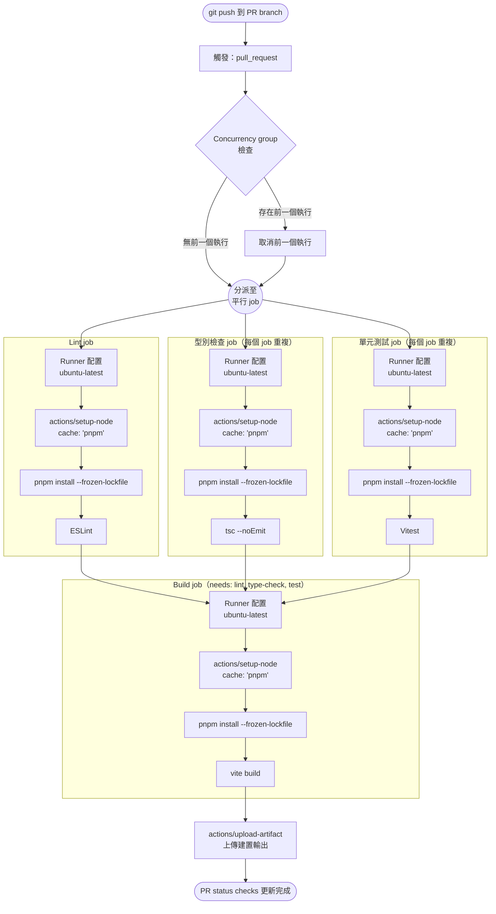

# [FEE-1501] GitHub Actions 前端應用

:::info
GitHub Actions 是 GitHub 內建的 CI/CD 平台：workflow 是提交到 `.github/workflows/` 的 YAML 檔案，由 repository 事件觸發，並在 GitHub 託管或自架的 runner 上執行。對於已經託管在 GitHub 上的 repository，它省去了第三方 CI 供應商所需的獨立 CI 帳號與 webhook 串接。本文涵蓋 workflow 的結構、GitHub 與 pnpm 實際建議的快取策略、並行控制、matrix build，以及在多個 job 間共用設定步驟的 composite action 模式。
:::

## 背景

GitHub Actions 是任何託管在 GitHub 上的 repository 內建的 CI/CD 平台。以 repository 內設定檔驅動 CI 的作法比它早了將近十年出現：Travis CI 的 `.travis.yml` 在 2011 年就已推出，CircleCI 的 `circle.yml` 採用相同概念，兩者都早於 2019 年才推出的 GitHub Actions。GitLab CI 本身於 2012 年推出，但其 job 一開始是透過網頁表單設定，直到 2015 年 6 月的 GitLab CI 7.12 才引入存放於 repository 中的 `.gitlab-ci.yml` 檔案；同年 9 月發布的 GitLab 8.0 接著把 CI 整合進核心應用程式。Jenkins、GitLab CI 與 CircleCI 至今仍在執行大量的前端建置工作。Actions 沒有取代這些平台；它成為已經在 GitHub 上的 repository 的預設選擇，其他地方的團隊則繼續在原有的平台上執行 CI。

對於已經在 GitHub 上的 repository，Actions 帶來的改變是整合深度的提升。YAML 存放在 repository 中的概念，如前段所述，在 Actions 出現之前就已經存在。Pull request check、部署狀態，以及產生它們的 workflow，全都由同一組 GitHub API 與同一個憑證驅動。在 Actions 出現之前，使用 Travis CI 或 CircleCI 的團隊需要設定一個從 GitHub 到 CI 供應商的 webhook，以及一個從供應商回傳狀態到 GitHub 的獨立 token；每多一項服務，例如部署或通知整合，就多一組憑證。因為 Actions 在 GitHub 內部執行，這些串接收斂成 repository 中 `.github/workflows/` 下的單一 workflow 檔案，如同其他檔案一樣接受 review 並可回滾。

**GitHub Actions 成為 GitHub 上前端 repository 預設選擇的原因：**

- **YAML 原生的 workflow 定義**，存放在 repository 中，接受 pull request review 並可用 `git revert` 回滾。
- **龐大的 marketplace 生態系。** `actions/checkout`、`actions/setup-node`、`actions/cache`，以及來自各家託管與部署供應商的第三方 action，都由各自作者發佈與維護，因此組合一條 pipeline 意味著引用既有的 action，而不需要從頭撰寫安裝與部署腳本。
- **公開 repository 免費使用運算資源。** GitHub 託管的標準 Linux 與 Windows runner，為公開 repository 免費提供 4 vCPU 與 16 GB RAM。私有 repository 在標準 runner 上則是 2 vCPU 與 8 GB，超出附贈額度後按分鐘計費。
- **深度整合 GitHub。** 由 pull request 觸發的 workflow 可以透過 GitHub API 發布 status checks、新增 labels、留言，以及建立 deployment，不需要設定任何外部服務。

Workflow 檔案的結構固定：

| 概念 | 角色 |
|---|---|
| `on:` | 宣告觸發條件：`push`、`pull_request`、`workflow_dispatch`、排程，以及其他事件 |
| `jobs:` | 一個或多個 job；每個 job 在自己的 runner 上執行，預設彼此平行執行 |
| `needs:` | 讓一個 job 等待另一個 job 完成後才開始 |
| `steps:` | job 內的有序清單；每個 step 執行一個 marketplace action（`uses:`）或一段 shell 指令（`run:`） |
| `runs-on:` | job 執行所在的 runner 映像檔，例如 `ubuntu-latest` |

本文的範例都建立在這個結構之上。

---

## 視覺對比

以下圖表展示由 pull request push 觸發的單次 CI 執行生命週期，採用本文建議的快取做法（見最佳實踐）：



---

## 範例

### 1. 完整的前端 CI workflow（建議的快取做法）

`actions/setup-node` 內建一個 `cache` 選項，用於快取套件管理器的全域 store。這正是 GitHub 針對這個問題所建議的做法。每個 job 各自執行 `pnpm install --frozen-lockfile`：store 保持暖機時安裝速度快，因為套件從本地快取連結，省去下載的時間；每個 job 也都能得到正確結果，因為跨 job 共用的只有 store，各 job 再依此各自建置出自己的 `node_modules`。

```yaml
# .github/workflows/ci.yml

name: CI

on:
  push:
    branches: [main]
  pull_request:
    branches: [main]
  workflow_dispatch:

concurrency:
  group: ci-${{ github.ref }}
  cancel-in-progress: ${{ github.ref != 'refs/heads/main' }}

jobs:
  lint:
    name: Lint
    runs-on: ubuntu-latest
    steps:
      - uses: actions/checkout@v4
      - uses: pnpm/action-setup@v4
        with:
          version: 9
      - uses: actions/setup-node@v4
        with:
          node-version: 20
          cache: 'pnpm'
      - run: pnpm install --frozen-lockfile
      - run: pnpm lint

  type-check:
    name: 型別檢查
    runs-on: ubuntu-latest
    steps:
      - uses: actions/checkout@v4
      - uses: pnpm/action-setup@v4
        with:
          version: 9
      - uses: actions/setup-node@v4
        with:
          node-version: 20
          cache: 'pnpm'
      - run: pnpm install --frozen-lockfile
      - run: pnpm type-check

  test:
    name: 單元測試
    runs-on: ubuntu-latest
    steps:
      - uses: actions/checkout@v4
      - uses: pnpm/action-setup@v4
        with:
          version: 9
      - uses: actions/setup-node@v4
        with:
          node-version: 20
          cache: 'pnpm'
      - run: pnpm install --frozen-lockfile
      - run: pnpm test --run

  build:
    name: 建置
    runs-on: ubuntu-latest
    needs: [lint, type-check, test]
    steps:
      - uses: actions/checkout@v4
      - uses: pnpm/action-setup@v4
        with:
          version: 9
      - uses: actions/setup-node@v4
        with:
          node-version: 20
          cache: 'pnpm'
      - run: pnpm install --frozen-lockfile
      - run: pnpm build
      - name: 上傳建置 artifact
        uses: actions/upload-artifact@v4
        with:
          name: dist-${{ github.sha }}
          path: dist/
          retention-days: 7
```

### 2. 進階變體：直接快取 `node_modules`

`actions/cache` 也可以直接快取 `node_modules` 本身，以 lockfile hash 作為 key。命中時會完全跳過安裝步驟，還原速度比 store 快取更快。`actions/cache` 本身的指引不建議把快取 `node_modules` 當作預設做法（其 npm 範例指出這樣做「可能在不同 Node 版本之間失效，且無法搭配 npm ci 使用」）；同樣的機制風險也適用於 pnpm，因為它非扁平、以 symlink 組成的 `node_modules` 結構，在還原到版本不同的 Node.js runtime 或不同作業系統時並不可靠。只有在確認 store 快取不夠用之後，才使用這個模式，並且務必把 Node 版本固定進 cache key 中。

```yaml
- name: 快取 node_modules
  uses: actions/cache@v4
  id: nm-cache
  with:
    path: node_modules
    # Primary key：需要完全匹配才算 cache hit。
    # hashFiles 對所有匹配檔案計算 hash。
    # 只要 pnpm-lock.yaml 有任何變更，hash 就會改變，
    # cache 會自動失效。
    key: node-modules-${{ runner.os }}-node20-${{ hashFiles('**/pnpm-lock.yaml') }}
    # Restore keys：允許部分匹配作為後備。
    # 部分匹配意味著 node_modules 有內容但可能過期；
    # pnpm install --frozen-lockfile 會偵測並修復差異。
    restore-keys: |
      node-modules-${{ runner.os }}-node20-
      node-modules-${{ runner.os }}-

- name: 安裝（修復部分 restore-key 匹配）
  # cache-hit 只有在完全匹配 key 時才為 'true'。
  # 在 restore-key 部分匹配時，此步驟仍會執行以同步模組。
  if: steps.nm-cache.outputs.cache-hit != 'true'
  run: pnpm install --frozen-lockfile
```

**Key 組合規則：**

| 元件 | 用途 |
|---|---|
| `runner.os` | 避免 Linux 快取被還原到 macOS matrix job 上 |
| `node20` | 避免 Node 20 快取被還原到 Node 18 job 上 |
| `hashFiles('**/pnpm-lock.yaml')` | 任何匹配的 lockfile 變更時使快取失效 |

GitHub Actions 快取預設每個 repository 有 10 GB 的容量上限（repository 或 organization 管理員可調高），且會清除 7 天未被使用的項目。若一個 matrix 為每個作業系統與 Node 版本各自產生一份 `node_modules` 快取項目，消耗配額的速度會比單一 store 快取項目更快，導致較舊的項目被清除，下一次執行又得回退到完整安裝。

### 3. Concurrency group 設定

```yaml
# 取消被取代的 PR 執行；main branch 的執行永遠不取消。
concurrency:
  group: ci-${{ github.ref }}
  cancel-in-progress: ${{ github.ref != 'refs/heads/main' }}
```

對於只在 PR 上執行的 workflow，以 PR 編號分組是更易讀的替代方案：

```yaml
concurrency:
  group: pr-${{ github.event.pull_request.number }}
  cancel-in-progress: true
```

在 `pull_request` 事件中，`github.ref` 本身就會解析成該 PR 的 merge ref（`refs/pull/<n>/merge`），每個 PR 各自唯一，所以以 `github.ref` 分組同樣能避免兩個 PR 互相取消彼此的執行。PR 編號的寫法主要在可讀性上更有優勢，在混合了 `pull_request` 與其他觸發類型的 workflow 中差異會更明顯，因為此時 `github.ref` 會解析成分支的 ref，而非該 PR 專屬的 ref。

### 4. 多 Node 版本的 Matrix build

對於發佈到 npm 且需要跨支援 Node 版本保持相容性的函式庫，使用 matrix build。應用程式 repository 則跳過這個設定。

```yaml
jobs:
  test:
    name: 測試 (Node ${{ matrix.node-version }})
    runs-on: ubuntu-latest
    strategy:
      matrix:
        node-version: [18, 20, 22]
      # 不要因為一個版本失敗就取消所有 matrix job。
      # 這樣可以看清楚哪些版本出了問題。
      fail-fast: false
    steps:
      - uses: actions/checkout@v4
      - uses: pnpm/action-setup@v4
        with:
          version: 9
      - uses: actions/setup-node@v4
        with:
          node-version: ${{ matrix.node-version }}
      - name: 快取 node_modules
        uses: actions/cache@v4
        with:
          path: node_modules
          # 在 key 中加入 node-version 以避免跨版本的 cache 污染
          key: node-modules-${{ runner.os }}-node${{ matrix.node-version }}-${{ hashFiles('**/pnpm-lock.yaml') }}
      - run: pnpm install --frozen-lockfile
      - run: pnpm test --run
```

這個範例使用直接 `node_modules` 快取，用以展示 matrix 變數如何併入 key 中。`actions/setup-node` 的 `cache: 'pnpm'` 選項搭配 <code v-pre>node-version: ${{ matrix.node-version }}</code>，可以直接替換使用，完全不需要自訂 key。

3 個版本的 matrix 建立 3 個獨立的 runner，每個都消耗完整的 runner 時間。平行執行縮短了掛鐘時間，但不會減少總運算成本：3 個節點的 matrix 成本是單節點的 3 倍。

### 5. 上傳與下載 artifacts

Artifacts 讓建置輸出可以在同一個 workflow 執行中的不同 job 之間傳遞，不需要重新執行建置，也讓建置結果可以從 Actions UI 下載以便除錯。

```yaml
# 在 build job 中：上傳
- name: 上傳 dist
  uses: actions/upload-artifact@v4
  with:
    name: dist-${{ github.sha }}
    path: dist/
    retention-days: 7

# 在下游 job 中（例如 deploy）：下載
- name: 下載 dist
  uses: actions/download-artifact@v4
  with:
    name: dist-${{ github.sha }}
    path: dist/
```

`retention-days` 控制 GitHub 保留 artifact 的時間長短。7 天是 PR artifact 合理的預設值；對於可能需要部署後除錯的 release artifact，可以延長為 30 天。

### 6. 用 composite action 共用設定

當相同的步驟序列（checkout、設定 pnpm、設定 Node、還原快取）出現在每個 job 中時，composite action 可以消除這種重複。Composite action 存放在 `.github/actions/` 中，並以路徑引用。

本機的 composite action 是從已 checkout 的 repository 檔案中解析出來的，因此呼叫方 job 必須先執行 `actions/checkout`，之後才能引用這個 composite action；composite action 本身不應該再執行 checkout。

```yaml
# .github/actions/setup-frontend/action.yml

name: Setup Frontend
description: 設定 pnpm 與 Node.js，並快取 pnpm store

inputs:
  node-version:
    description: 使用的 Node.js 版本
    default: '20'
  pnpm-version:
    description: 使用的 pnpm 版本
    default: '9'

runs:
  using: composite
  steps:
    - uses: pnpm/action-setup@v4
      with:
        version: ${{ inputs.pnpm-version }}

    - uses: actions/setup-node@v4
      with:
        node-version: ${{ inputs.node-version }}
        cache: 'pnpm'

    - name: 安裝
      shell: bash
      run: pnpm install --frozen-lockfile
```

在 workflow job 中呼叫它：

```yaml
jobs:
  lint:
    runs-on: ubuntu-latest
    steps:
      - uses: actions/checkout@v4
      - uses: ./.github/actions/setup-frontend
        with:
          node-version: '20'
      - run: pnpm lint
```

`actions/checkout` 先執行，讓 `uses: ./.github/actions/setup-frontend` 解析時，composite action 的 `action.yml` 已經存在於磁碟上；若沒有先執行這個步驟，執行會失敗，因為 runner 找不到該 action 的 `action.yml`。之後 composite action 就能把 job 剩下的設定工作縮減成單一步驟。

---

## 最佳實踐

**應該（SHOULD）使用 `actions/setup-node` 內建的 `cache: 'pnpm'` 選項作為預設的快取策略。** 它快取的是 pnpm store，不需要自訂 cache key，也是 pnpm 官方 CI 範例與 GitHub 文件針對這個問題共同建議的做法。搭配每個 job 中的 `pnpm install --frozen-lockfile`，即使 cache miss，也能產生與已提交 lockfile 完全一致的套件。要注意 pnpm 官方文件對效能提升並沒有做出保證：文件指出快取 store「並非必要，也不保證快取 store 一定能讓安裝更快」。

**可以（MAY）直接快取 `node_modules` 以換取更快的還原速度，但這是帶有實際代價的進階變體。** 命中時會完全跳過安裝步驟，但 `actions/cache` 的指引不建議把它當作預設做法：pnpm 的 symlink 結構在跨 Node.js 版本或跨作業系統還原時並不可靠。若要使用，cache key 必須（MUST）同時包含 `runner.os` 與 Node 版本，例如 <code v-pre>node-modules-${{ runner.os }}-node20-${{ hashFiles('**/pnpm-lock.yaml') }}</code>，且每個還原快取的 job 在 `restore-keys` 部分匹配時，都必須（MUST）仍然回退執行 `pnpm install --frozen-lockfile`。

**必須（MUST）為 PR workflow 設定 `cancel-in-progress: true`，且絕不（MUST NOT）在 main 分支上設定它。** 當開發者推送修正後的 commit 時，必須（MUST）立即取消已被取代的執行，避免浪費 runner 時間，也避免讓 PR 的 status checks 變得雜亂。然而，取消 `main` 上的執行意味著某些 commit 永遠不會被完整測試，這違背了合併後 CI 的目的。在單一 workflow 檔案中使用 <code v-pre>cancel-in-progress: ${{ github.ref != 'refs/heads/main' }}</code>，就能同時處理好這兩種情況。

**應該（SHOULD）為可能需要隨選執行的 CI workflow 加入 `workflow_dispatch`。** 這個觸發器讓你可以隨時對任何分支啟動一次執行，也可以選擇性帶入型別化的輸入參數，即使該分支上還沒有任何 push 也一樣。它不會讓你多出「重新執行既有 workflow」的能力：GitHub 的介面本來就會在任何已完成的執行上提供「Re-run all jobs」與「Re-run failed jobs」，不需要靠這個觸發器。

**應該（SHOULD）將 GitHub 官方維護的 action 固定到主版本標籤；第三方 action 應該（SHOULD）固定到完整的 commit SHA。** GitHub 的安全強化文件指出，固定到完整 commit SHA 是把一個 action 當成不可變 release 使用的唯一方式，因為標籤在該 action 的 repository 遭入侵時是可以被移動的。這是真實發生過的事件：在 2025 年 3 月的 tj-actions/changed-files 供應鏈攻擊事件（CVE-2025-30066）中，攻擊者把可變動的版本標籤重新指向一個會外洩 CI secrets 的 commit。把第三方 action 固定到 commit SHA，並附上版本註解，例如 <code v-pre>uses: some-org/some-action@a1b2c3d4 # v2.4.1</code>，並透過 Dependabot 的 GitHub Actions 更新生態系維持這個固定版本更新到最新。本文範例把 `pnpm/action-setup` 固定在主版本標籤 `@v4` 上是為了可讀性；正式環境的 workflow 應該依照這項實踐改用 SHA 固定。

**應該（SHOULD）為所有上傳的 artifact 設定 `retention-days`。** GitHub 預設的 artifact 保留期限為 90 天。PR 建置 artifact 應該（SHOULD）使用 `retention-days: 7` 以避免消耗過多儲存配額。可能需要部署後除錯的 release artifact 應使用更長的期限（如 30 天），但務必明確設定一個值，不要仰賴平台預設值。

---

## 設計思維

### 為什麼 GitHub Actions 在已經在 GitHub 上的 repository 中勝出

決定性優勢在於 repository、CI 與 pull request 狀態全都由同一組憑證背後驅動：不需要在不同服務之間設定並輪替 webhook 或 API key，也少了一組可能外洩的憑證。對於已經使用 GitHub 進行 code review 的前端團隊而言，這消除了整個憑證管理的類別問題，代價則是把整條 pipeline 綁定在 GitHub 自身的可用性與 marketplace 上。

Marketplace 是第二個因素。前端生態系透過 Actions 發佈其工具鏈：`actions/setup-node` 處理 Node.js 安裝，`pnpm/action-setup` 處理 pnpm，`actions/cache` 處理依賴套件快取。組合一條生產級 pipeline 速度很快，因為困難的部分都已經有人寫好並持續維護。

### 為什麼依賴套件快取是最有價值的優化

對於依賴套件龐大的前端專案，冷啟動安裝經常主宰 CI 的掛鐘時間。乾淨的 `pnpm install` 需要透過網路從 registry 抓取每一個套件。暖快取則改從本地副本提供相同的套件。這個落差在每次 CI 執行中都會重複出現，對一個每天推送多次的團隊而言，累積下來會佔掉整體 pipeline 時間中相當可觀的一部分。

`actions/setup-node` 的 `cache: 'pnpm'` 選項只需在 job 中加入一行設定，就能取得大部分的效益：cache 命中時仍然會執行 `pnpm install`，但套件改由本地 store 解析，不再走網路。直接快取 `node_modules` 能跳過安裝步驟，還原速度更快，但只有在刻意管理好最佳實踐中提到的跨版本風險與快取清除風險之後才划算，因此本文把它列為進階變體，預設仍建議使用 store 快取。

### 為什麼 `cancel-in-progress: true` 不可或缺

想像一位開發者推送了一個 commit 到 PR branch，發現了一個錯誤，三十秒後又推送了第二個 commit。如果沒有並行控制，兩個執行都會跑完，第一個執行仍持續佔用一個 runner，測試著已經被第二個 commit 取代的程式碼。

透過 `cancel-in-progress: true` 和以 PR 編號或 branch 名稱作為 key 的 concurrency group，推送第二個 commit 會立即取消第一個執行，一個 branch 上因此永遠只有最新 commit 有活躍的執行。這節省了 runner 時間，也讓 PR 的 status checks 對應到實際的 HEAD commit，而不是已被取代的版本。

有一個細節需要注意：對於由 `main` 推送觸發的 workflow（合併後），取消通常是錯誤的，因為每個推送到 `main` 的 commit 都應該被完整測試，並可能觸發部署。正確的模式是讓 `cancel-in-progress: true` 只套用在 PR 觸發的執行上，並在 `main` branch 的執行中省略它，或將其設為 `false`。

### 為什麼 matrix build 有用但代價高昂

Matrix build 以不同的參數值多次執行同一個 job，通常是多個 Node.js 版本或作業系統。對於一個宣稱支援 Node 18、20、22 的函式庫，matrix build 在每次 commit 上都驗證這個宣稱：一個只在 Node 18 出現、在 Node 22 通過的回歸問題，若沒有多版本 CI，將不會被發現。

代價是線性倍增。3 個版本的 Node matrix 使每次執行消耗的 runner 時間三倍；加上 2 個作業系統的 matrix，成本就是單次執行基準的 6 倍。對於應用程式而言，這個代價幾乎不值得，因為應用程式部署到固定的一個 Node 版本，跨多個版本測試不會覆蓋真實部署中的失敗情境。Matrix build 對函式庫作者和跨瀏覽器端到端測試套件是值得的；對應用程式 repository 通常只是浪費。

---

## 常見錯誤

**在 checkout repository 之前就引用本機 composite action。** `uses: ./.github/actions/...` 是從 repository 已經 checkout 的檔案中解析出來的。如果它是 job 的第一個 step，runner 這時還沒有 `.github/actions/` 目錄，job 會因為找不到該 action 的 `action.yml` 而失敗。務必在 composite action 的 step 之前先執行 `actions/checkout`，也不要把 `actions/checkout` 放進 composite action 本身裡面。

**跨 Node.js 版本或跨作業系統快取 `node_modules`。** pnpm 的 symlink 結構對這兩者都很敏感。若 cache key 漏掉 `runner.os` 或 Node 版本，可能還原出一份在請求它的 job 上根本無法運作的樹狀結構。優先使用 `actions/setup-node` 的 `cache: 'pnpm'` 選項，改為快取 store，完全避開這個問題。

**讓第三方 action 保持未固定版本，或只固定到主版本。** 一個遭入侵或被重新指向的 action，會以 workflow 的權限執行，並能存取它接觸得到的任何 secrets。依照最佳實踐所述，把第三方 action 固定到完整的 commit SHA。

**省略 `permissions:` 區塊。** repository 預設的 `GITHUB_TOKEN` 權限繼承自其所屬的 organization 或 enterprise，並非由 repository 自身的建立日期決定：GitHub 在 2023 年 2 月推出的唯讀預設值，只套用在新建立的 enterprise、organization，以及個人帳號的 repository，因此一個今天在 2023 年前就存在的 organization 中建立的 repository，除非該 organization 自己改過預設值，否則仍然會拿到一個可寫入的 token。不需要 push、建立 release 或寫入 package 的 workflow，應該在檔案開頭明確宣告 <code v-pre>permissions: contents: read</code>，不要仰賴 repository 目前的預設值。

**用 `pull_request_target` 執行不受信任的 PR 程式碼。** `pull_request_target` 即使面對來自 fork 的 PR，也會以 base repository 的 secrets 與寫入權限執行。在這個觸發器下 checkout 並執行 fork 的程式碼，等於把這些 secrets 交給開這個 PR 的人。凡是會執行貢獻者提供的程式碼，一律使用 `pull_request`；`pull_request_target` 保留給只留言或加標籤這類的 workflow。

**該共用的是整個 job 時卻用 composite action，或反過來。** Composite action 打包一連串 step，並在 job 的 `steps:` 清單中以 `uses:` 呼叫；呼叫方的 job 仍然要自行提供 `runs-on:`，也可以在它前後加上其他 step。可重用 workflow（`workflow_call`）打包的是一個或多個完整的 job，包含它們的 `runs-on:` 與 `needs:` 依賴圖，並在 `jobs:` 這一層以 `uses:` 呼叫。要共用同一個 job 內的 step，用 composite action；要共用整個 job，用可重用 workflow。

**對應用程式使用 matrix build。** 應用程式部署到恰好一個 Node 版本，在每個 PR commit 上針對 Node 18、20、22 進行測試，會讓 CI 成本倍增，卻不會覆蓋任何真實的部署失敗情境。Matrix build 屬於函式庫 repository 的範疇。

---

## 延伸閱讀

- [CI/CD 與部署概覽](/zh-tw/CI%20CD%20and%20Deployment/1500)
- [建置 Pipeline：Lint、型別檢查、測試與建置](/zh-tw/CI%20CD%20and%20Deployment/1502)
- [CI 中的 Secrets、環境變數與安全性](/zh-tw/CI%20CD%20and%20Deployment/1506)
- [建置工具與模組系統概覽](/zh-tw/Build%20Tooling%20and%20Module%20Systems/800)
- [部署策略：金絲雀、藍綠部署與功能旗標](/zh-tw/CI%20CD%20and%20Deployment/1505)
- [發布自動化：語義化版本控制與變更日誌](/zh-tw/CI%20CD%20and%20Deployment/1507)

---

## 參考資料

- GitHub, "Workflow syntax for GitHub Actions," GitHub Docs (2025). https://docs.github.com/actions/using-workflows/workflow-syntax-for-github-actions
- GitHub, "Caching dependencies to speed up workflows," GitHub Docs (2025). https://docs.github.com/en/actions/using-workflows/caching-dependencies-to-speed-up-workflows
- GitHub, "actions/setup-node," GitHub (2025). https://github.com/actions/setup-node
- pnpm, "Continuous Integration," pnpm Documentation (2025). https://pnpm.io/continuous-integration
- GitHub, "actions/cache," GitHub (2025). https://github.com/actions/cache
- GitHub, "Control the concurrency of workflows and jobs," GitHub Docs (2025). https://docs.github.com/actions/writing-workflows/choosing-what-your-workflow-does/control-the-concurrency-of-workflows-and-jobs
- GitHub, "Creating a composite action," GitHub Docs (2025). https://docs.github.com/en/actions/tutorials/create-actions/create-a-composite-action
- GitHub, "Security hardening for GitHub Actions," GitHub Docs (2025). https://docs.github.com/en/actions/security-for-github-actions/security-guides/security-hardening-for-github-actions
- GitHub, "GitHub-hosted runners reference," GitHub Docs (2025). https://docs.github.com/en/actions/reference/runners/github-hosted-runners
