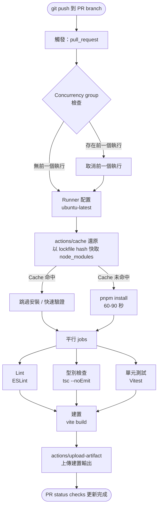

# GitHub Actions 前端應用

## 情境

GitHub Actions 是 2024 年前端專案中最主流的 CI/CD 平台。它是 GitHub 的原生功能，無需額外帳號設定，能與 pull request checks 和 branch protection 無縫整合，且對大多數開源和小型團隊的免費方案已綽綽有餘。

在 GitHub Actions 於 2019 年問世之前，前端團隊需要拼湊多個獨立服務：CI 提供商（Travis CI、CircleCI、Jenkins）、部署服務，以及通知層。每項整合都需要各自的憑證、webhook 設定，以及不同的思維模型。GitHub Actions 將這一切整合成存放在 repository 中 `.github/workflows/` 資料夾下的單一 YAML 檔案——可以版本控制、code review，並像其他程式碼一樣被部署。

**GitHub Actions 成為前端首選的原因：**

- **YAML 原生的 workflow 定義**，存放在 repository 中。Workflow 檔案就是程式碼：可以透過 pull request review，有完整的修改歷史，並可用 `git revert` 回滾。
- **龐大的 marketplace 生態系**。`actions/checkout`、`actions/setup-node`、`actions/cache`，以及來自 Vercel、Netlify、Cloudflare 的第三方 action，都由各自的作者發佈與維護。組合一條 pipeline 意味著直接引用這些 action，而不是從頭撰寫 shell scripts。
- **公開 repository 免費使用**。開源前端函式庫——React、Vue、Svelte 相關工具——在配備 2 CPU 核心和 7 GB RAM 的 GitHub 託管 runner 上免費執行 CI。
- **深度整合 GitHub**。由 pull request 觸發的 workflow 可以發布 status checks、新增 labels、留下 comments，以及建立 deployments——全都透過 GitHub API，不需要任何外部服務設定。

一個 workflow 就是一個 YAML 檔案。理解其結構是後續一切的前提。

---

## 原則

> **SHOULD** 以 lockfile hash 作為 `node_modules` 的 cache key——冷啟動安裝需要 60–90 秒；cache 命中只需 5 秒。

> **SHOULD** 在 PR workflow 中設定 `cancel-in-progress: true`——來自已被取代 commit 的過時執行會浪費 runner 時間，並使 PR 的 status check 列表變得混亂。

---

## 設計思維

### 為什麼 GitHub Actions 勝出

決定性優勢不在於任何單一功能，而在於消除了整合邊界。你的 repository、CI、部署狀態和 pull request，全都是 GitHub 中的第一等物件。一個 workflow 可以把守合併、留下評論、建立 release，以及觸發部署，而不需要任何外部服務接收 webhook 或管理 API key。對於已經使用 GitHub 進行 code review 的前端團隊來說，這種整合方式消除了整個憑證管理和服務協調的類別問題。

Marketplace 是第二個決定性因素。前端生態系透過 Actions 發佈其工具鏈：`actions/setup-node` 處理 Node.js 安裝和 PATH 設定；`pnpm/action-setup` 處理 pnpm；`actions/cache` 處理依賴套件和建置輸出的快取。組合一條生產級 pipeline 只需一個下午，因為困難的部分都已經有人寫好了。

### 為什麼正確快取 node_modules 是最有價值的優化

在一個典型中型前端專案中，在乾淨的 runner 上執行 `npm install` 或 `pnpm install` 需要 60 到 90 秒。這是純粹的等待時間：runner 從 registry 下載壓縮包、驗證校驗碼、解壓縮檔案、寫入磁碟。這些工作與你的 commit 內容完全無關。

當 `actions/cache` 恢復暖快取時，安裝步驟在 3 到 5 秒內完成。這是單一步驟 15 到 30 倍的加速，且每次 push、每個 PR、每個 matrix job 都會重複發生。對於一個每天推送數十次的團隊而言，正確的快取設定直接轉化為開發者獲得回饋的延遲縮短。

關鍵在於 cache 失效策略：以 lockfile 的 hash（`package-lock.json`、`pnpm-lock.yaml` 或 `yarn.lock`）作為 cache key。當沒有依賴套件更改時，lockfile 不變，hash 不變，cache 被重用。當依賴套件新增或升級時，lockfile 改變，hash 改變，cache 自動失效。這是從設計上保證正確性的失效機制——你不可能忘記在升級後清除 cache，因為 key 的計算方式讓它自動發生。

### 為什麼 `cancel-in-progress: true` 不可或缺

想像一位開發者推送了一個 commit 到 PR branch，發現了一個錯誤，三十秒後又推送了第二個 commit。如果沒有並行控制，兩個執行都會跑完：第一個執行會消耗 runner 三分鐘來測試早已被取代的程式碼。有意義的是第二個執行的結果。

透過 `cancel-in-progress: true` 和以 PR 編號或 branch 名稱作為 key 的 concurrency group，推送第二個 commit 會立即取消第一個執行。最終效果是：一個 branch 上永遠只有最新 commit 有活躍的執行。這消除了浪費的 runner 時間，減少了 PR status check 歷史中的噪音，並確保 PR 上的綠色勾號對應的是實際的 HEAD commit，而非已被取代的版本。

有一個細節需要注意：對於由 `main` 推送觸發的 workflow（合併後），取消通常是錯誤的。你希望每個推送到 `main` 的 commit 都被完整測試，並可能觸發部署。正確的模式是：`cancel-in-progress: true` 只應用於 PR 觸發的執行，對 `main` branch 執行省略或設為 `false`。條件式表達式 `cancel-in-progress: ${{ github.ref != 'refs/heads/main' }}` 可以在單一 workflow 檔案中處理這種情況。

### 為什麼 matrix build 有用但代價高昂

Matrix build 以不同的參數值多次執行同一個 job——通常是多個 Node.js 版本或作業系統。對於一個宣稱支援 Node 18、20、22 的函式庫，matrix build 在每次 commit 上都驗證這個宣稱。這是真實的價值：一個只在 Node 18 出現、在 Node 22 通過的回歸問題，若沒有多版本 CI，將不會被發現。

代價是線性倍增。3 個版本的 Node matrix 使每次執行消耗的 runner 時間三倍。加上 2 個作業系統的 matrix，成本變為 6 倍。對於應用程式（而非函式庫）而言，這個代價幾乎不值得：應用程式部署到固定的一個 Node 版本，因此跨多個版本的測試不會覆蓋任何真實的失敗情境。Matrix build 對函式庫作者和跨瀏覽器端到端測試套件是值得的；對應用程式 repository 通常只是浪費。

---

## 視覺

以下圖表展示由 pull request push 觸發的單次 CI 執行的生命週期：



---

## 範例

### 1. 完整的前端 CI workflow

這是一個生產就緒的 workflow，涵蓋帶快取的安裝、平行執行的 lint/type-check/test jobs，以及最終上傳 artifact 的 build 步驟。

```yaml
# .github/workflows/ci.yml

name: CI

on:
  push:
    branches: [main]
  pull_request:
    branches: [main]
  workflow_dispatch:

concurrency:
  group: ci-${{ github.ref }}
  cancel-in-progress: ${{ github.ref != 'refs/heads/main' }}

jobs:
  install:
    name: 安裝依賴套件
    runs-on: ubuntu-latest
    steps:
      - uses: actions/checkout@v4

      - uses: pnpm/action-setup@v4
        with:
          version: 9

      - uses: actions/setup-node@v4
        with:
          node-version: 20

      - name: 快取 node_modules
        uses: actions/cache@v4
        id: cache-node-modules
        with:
          path: node_modules
          key: node-modules-${{ runner.os }}-${{ hashFiles('**/pnpm-lock.yaml') }}
          restore-keys: |
            node-modules-${{ runner.os }}-

      - name: 安裝
        if: steps.cache-node-modules.outputs.cache-hit != 'true'
        run: pnpm install --frozen-lockfile

  lint:
    name: Lint
    runs-on: ubuntu-latest
    needs: install
    steps:
      - uses: actions/checkout@v4
      - uses: pnpm/action-setup@v4
        with:
          version: 9
      - uses: actions/setup-node@v4
        with:
          node-version: 20
      - name: 還原 node_modules 快取
        uses: actions/cache@v4
        with:
          path: node_modules
          key: node-modules-${{ runner.os }}-${{ hashFiles('**/pnpm-lock.yaml') }}
      - run: pnpm lint

  type-check:
    name: 型別檢查
    runs-on: ubuntu-latest
    needs: install
    steps:
      - uses: actions/checkout@v4
      - uses: pnpm/action-setup@v4
        with:
          version: 9
      - uses: actions/setup-node@v4
        with:
          node-version: 20
      - name: 還原 node_modules 快取
        uses: actions/cache@v4
        with:
          path: node_modules
          key: node-modules-${{ runner.os }}-${{ hashFiles('**/pnpm-lock.yaml') }}
      - run: pnpm type-check

  test:
    name: 單元測試
    runs-on: ubuntu-latest
    needs: install
    steps:
      - uses: actions/checkout@v4
      - uses: pnpm/action-setup@v4
        with:
          version: 9
      - uses: actions/setup-node@v4
        with:
          node-version: 20
      - name: 還原 node_modules 快取
        uses: actions/cache@v4
        with:
          path: node_modules
          key: node-modules-${{ runner.os }}-${{ hashFiles('**/pnpm-lock.yaml') }}
      - run: pnpm test --run

  build:
    name: 建置
    runs-on: ubuntu-latest
    needs: [lint, type-check, test]
    steps:
      - uses: actions/checkout@v4
      - uses: pnpm/action-setup@v4
        with:
          version: 9
      - uses: actions/setup-node@v4
        with:
          node-version: 20
      - name: 還原 node_modules 快取
        uses: actions/cache@v4
        with:
          path: node_modules
          key: node-modules-${{ runner.os }}-${{ hashFiles('**/pnpm-lock.yaml') }}
      - run: pnpm build
      - name: 上傳建置 artifact
        uses: actions/upload-artifact@v4
        with:
          name: dist-${{ github.sha }}
          path: dist/
          retention-days: 7
```

### 2. `actions/cache` 的 key 策略詳解

Cache key 是正確 cache 失效的主要機制。正確構建它可以避免兩種失敗模式：過期快取（升級後仍從 cache 提供錯誤的套件）和 cache 抖動（不必要地使 cache 失效，反而失去快取的意義）。

```yaml
- name: 快取 node_modules
  uses: actions/cache@v4
  id: nm-cache
  with:
    path: node_modules
    # Primary key：需要完全匹配才算 cache hit。
    # hashFiles 對所有匹配檔案計算 SHA-256。
    # 只要 pnpm-lock.yaml 有任何變更，hash 就會改變，
    # cache 會自動失效。
    key: node-modules-${{ runner.os }}-node20-${{ hashFiles('**/pnpm-lock.yaml') }}
    # Restore keys：允許部分匹配作為後備。
    # 部分匹配意味著 node_modules 有內容但可能過期；
    # pnpm install --frozen-lockfile 會偵測並修復差異。
    restore-keys: |
      node-modules-${{ runner.os }}-node20-
      node-modules-${{ runner.os }}-

- name: 安裝（僅在 cache miss 時）
  # cache-hit 只有在完全匹配 key 時才為 'true'。
  # 在 restore-key 部分匹配時，此步驟仍會執行以同步模組。
  if: steps.nm-cache.outputs.cache-hit != 'true'
  run: pnpm install --frozen-lockfile
```

**Key 組合規則：**

| 元件 | 用途 |
|---|---|
| `runner.os` | 防止 Linux cache 被 macOS matrix job 使用 |
| `node20` | 防止 Node 20 cache 被 Node 18 job 使用 |
| `hashFiles('**/pnpm-lock.yaml')` | 任何 lockfile 變更時自動使 cache 失效 |

### 3. Concurrency group 設定

```yaml
# 取消被取代的 PR 執行；永遠不取消 main branch 執行。
concurrency:
  group: ci-${{ github.ref }}
  cancel-in-progress: ${{ github.ref != 'refs/heads/main' }}
```

對於只在 PR 上執行的 workflow，使用 PR 編號的更簡潔形式更精確：

```yaml
concurrency:
  group: pr-${{ github.event.pull_request.number }}
  cancel-in-progress: true
```

使用 `github.event.pull_request.number` 而非 `github.ref`，確保來自不同 branch 但目標相同 base 的兩個 PR 不會互相取消。每個 PR 有自己的 concurrency 佇列。

### 4. 多 Node 版本的 Matrix build

對於發佈到 npm 且需要跨支援 Node 版本保持相容性的函式庫，使用 matrix build。應用程式 repository 則跳過這個設定。

```yaml
jobs:
  test:
    name: 測試 (Node ${{ matrix.node-version }})
    runs-on: ubuntu-latest
    strategy:
      matrix:
        node-version: [18, 20, 22]
      # 不要因為一個版本失敗就取消所有 matrix job。
      # 這樣可以看清楚哪些版本出了問題。
      fail-fast: false
    steps:
      - uses: actions/checkout@v4
      - uses: pnpm/action-setup@v4
        with:
          version: 9
      - uses: actions/setup-node@v4
        with:
          node-version: ${{ matrix.node-version }}
      - name: 快取 node_modules
        uses: actions/cache@v4
        with:
          path: node_modules
          # 在 key 中加入 node-version 以避免跨版本的 cache 污染
          key: node-modules-${{ runner.os }}-node${{ matrix.node-version }}-${{ hashFiles('**/pnpm-lock.yaml') }}
      - run: pnpm install --frozen-lockfile
      - run: pnpm test --run
```

3 個版本的 matrix 建立 3 個獨立的 runner，每個都消耗完整的 runner 時間。平行執行雖然縮短了掛鐘時間，但不減少總運算成本——3 個節點的 matrix 的成本是單節點的 3 倍。

### 5. 上傳與下載 artifacts

Artifacts 在同一 workflow 執行的不同 job 之間傳輸建置輸出（不需要重新執行建置），並讓建置結果可從 Actions UI 下載以便除錯。

```yaml
# 在 build job 中：上傳
- name: 上傳 dist
  uses: actions/upload-artifact@v4
  with:
    name: dist-${{ github.sha }}
    path: dist/
    retention-days: 7

# 在下游 job 中（例如 deploy）：下載
- name: 下載 dist
  uses: actions/download-artifact@v4
  with:
    name: dist-${{ github.sha }}
    path: dist/
```

`retention-days` 控制 GitHub 保存 artifact 的時間。7 天是 PR artifact 的合理預設值；對於可能需要部署後除錯的 release artifact，可以延長到 30 天。

### 6. 用 Composite action 共用設定

當相同的步驟序列（checkout、setup pnpm、setup node、還原 cache）出現在每個 job 中時，composite action 能消除重複。Composite actions 存放在 `.github/actions/` 中，並以路徑引用。

```yaml
# .github/actions/setup-frontend/action.yml

name: Setup Frontend
description: Checkout、設定 Node/pnpm、還原 node_modules 快取

inputs:
  node-version:
    description: 使用的 Node.js 版本
    default: '20'
  pnpm-version:
    description: 使用的 pnpm 版本
    default: '9'

runs:
  using: composite
  steps:
    - uses: actions/checkout@v4

    - uses: pnpm/action-setup@v4
      with:
        version: ${{ inputs.pnpm-version }}

    - uses: actions/setup-node@v4
      with:
        node-version: ${{ inputs.node-version }}

    - uses: actions/cache@v4
      id: cache
      with:
        path: node_modules
        key: node-modules-${{ runner.os }}-node${{ inputs.node-version }}-${{ hashFiles('**/pnpm-lock.yaml') }}
        restore-keys: |
          node-modules-${{ runner.os }}-node${{ inputs.node-version }}-

    - name: 安裝
      if: steps.cache.outputs.cache-hit != 'true'
      shell: bash
      run: pnpm install --frozen-lockfile
```

在任何 workflow job 中呼叫它：

```yaml
jobs:
  lint:
    runs-on: ubuntu-latest
    steps:
      - uses: ./.github/actions/setup-frontend
        with:
          node-version: '20'
      - run: pnpm lint
```

Composite action 將每個 job 的 5 個重複步驟簡化為 1 個。

---

## 常見錯誤

**Cache key 中未包含 `runner.os`。**
在 Linux 上建立的 cache 可能以 restore-key 匹配的形式被 macOS runner 使用。`node_modules` 的二進位內容（原生 addon、平台特定依賴套件）在 Linux 和 macOS 之間有所不同。請務必在 key 中包含 `runner.os`。

**使用 `node_modules` 快取卻未搭配 `--frozen-lockfile`。**
若 `pnpm install` 執行時未加 `--frozen-lockfile`（或 npm 的 `npm ci`），對略為過期的 cache 的 restore-key 匹配會靜默地升級或降級套件，而不更新 lockfile。CI 執行通過，但實際安裝的套件樹與已提交的 lockfile 不符。請務必將 cache 還原與 frozen install 配對使用，以確保 lockfile 的準確性。

**在 main branch workflow 中設定 `cancel-in-progress: true`。**
取消 `main` 上的執行意味著某些 commit 永遠不會被完整測試。如果被取消的執行正好能偵測到一個回歸問題，下一個綠色執行可能是誤判。請將 `cancel-in-progress` 保留給 PR workflow。

**對應用程式使用 matrix build。**
應用程式部署到恰好一個 Node 版本。在每個 PR commit 上針對 Node 18、20、22 進行測試，使 CI 成本變為三倍，卻沒有覆蓋任何真實的失敗情境。Matrix build 屬於函式庫 repository 的範疇。

**未在 artifact 上設定 `retention-days`。**
GitHub 預設的 artifact 保留期限為 90 天。對於 PR 建置 artifact 而言，這過於冗長——它們會積累並消耗 GitHub 儲存配額。PR artifact 請設定 `retention-days: 7`；release artifact 可保留更長時間。

**省略 `workflow_dispatch` 觸發器。**
沒有 `workflow_dispatch`，就無法在不推送新 commit 的情況下對一個 branch 手動重新執行 workflow。請在所有 CI workflow 中加入它。這沒有任何成本，在除錯 runner 環境問題時卻非常寶貴。

**硬式編碼 pnpm 版本為 latest。**
在 `pnpm/action-setup` 中使用 `version: latest` 意味著 pnpm 的主版本升級可能在你的程式碼沒有任何變更的情況下破壞 CI。請將 pnpm 固定到主版本或確切版本（`version: 9`）以控制升級時機。

---

## 相關 FEE

- [FEE-1500: CI/CD 與部署概覽](1500.md) — 分類概覽；涵蓋 CI/CD 是什麼以及對前端為何重要
- [FEE-1502: 建置 Pipeline — Lint、型別檢查、測試與建置](1502.md) — 深入探討每個 pipeline 步驟的功能及設定方式
- [FEE-1506: CI 中的 Secrets、環境變數與安全性](1506.md) — 如何在 Actions 中安全地使用 `secrets.TOKEN` 和環境變數
- [FEE-800: 建置工具概覽](../Build%20Tooling%20and%20Module%20Systems/800.md) — Vite、webpack，以及 build 步驟所呼叫的工具
- [FEE-1505：部署策略：金絲雀、藍綠部署與功能旗標](1505.md) — 透過 GitHub Actions 觸發金絲雀漸進和自動回滾
- [FEE-1507：發布自動化：語義化版本控制與變更日誌](1507.md) — 建構在 GitHub Actions 基礎上的發布工作流程

---

## 參考資料

- [GitHub Actions 的 Workflow 語法 — GitHub Docs](https://docs.github.com/actions/using-workflows/workflow-syntax-for-github-actions)
- [快取依賴套件以加速 workflows — GitHub Docs](https://docs.github.com/en/actions/using-workflows/caching-dependencies-to-speed-up-workflows)
- [控制 workflows 和 jobs 的並行性 — GitHub Docs](https://docs.github.com/actions/writing-workflows/choosing-what-your-workflow-does/control-the-concurrency-of-workflows-and-jobs)
- [建立 Composite action — GitHub Docs](https://docs.github.com/en/actions/tutorials/create-actions/create-a-composite-action)
- [actions/cache — GitHub Marketplace](https://github.com/actions/cache)
- [GitHub Actions Matrix 策略 — Codefresh](https://codefresh.io/learn/github-actions/github-actions-matrix/)
