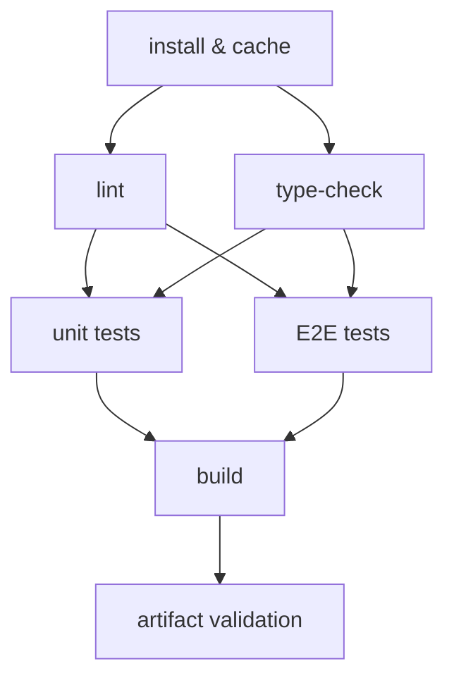

# 構建流水線：Lint、型別檢查、測試與構建

## 情境

CI pipeline 是一連串的品質關卡（quality gate）。任何一道關卡失敗都會阻止程式碼合併。但並非所有關卡的成本都相同：有些在 10 秒內完成，有些需要 3 分鐘。如果你在低成本關卡之前執行高成本關卡，每當開發者犯下微小錯誤時，你就要付出額外的等待時間。

現代前端專案的標準品質關卡順序如下：

1. **靜態分析** — ESLint、Prettier（10–30 秒）
2. **型別檢查** — `tsc --noEmit`（20–60 秒）
3. **單元測試** — Vitest、Jest（30–120 秒）
4. **整合 / E2E 測試** — Playwright、Cypress（2–10 分鐘）
5. **構建** — Vite、webpack、Turbopack（1–5 分鐘）
6. **Artifact 驗證** — bundle 大小檢查、輸出確認（5–30 秒）

這個順序並非隨意安排，而是圍繞**快速失敗（fail-fast）**原則設計的：最先暴露成本最低的訊號。一個只需 15 秒就能偵測到的 lint 錯誤，遠比在 4 分鐘後的 build 步驟才發現要好得多。

這個順序也反映了每項檢查的本質。Lint 和 type-check 純粹是靜態的——它們讀取原始碼檔案後即退出，不執行任何程式碼、不啟動 server、也不需要已構建的 artifact。單元測試會執行程式碼，但在 process 內部進行，不依賴網路或 DOM。E2E 測試在瀏覽器中針對實際運行的應用執行。Build 產出最終會被部署的 artifact。每個層次因為做了更多真實世界的模擬，成本也隨之增加。

GitHub Actions 等現代 CI 平台支援在 job 層級的平行化。Lint 和 type-check 沒有共享狀態，可以同時執行。安裝完成後，單元測試和 E2E 測試也可以並行執行。理解哪些檢查真正相互獨立，是解鎖最大 CI 加速效益的關鍵。

---

## 設計思維

### 為何 fail-fast 順序至關重要：17 倍的回饋差距

考慮同一組 pipeline 步驟的兩種排列方式。第一種先執行 lint；第二種先執行 build。

開發者推送了一個包含微小 lint 錯誤的分支——一個 `no-unused-vars` 違規。在 fail-fast 排列中，lint job 在 12 秒內完成並回報錯誤，開發者在不到一分鐘內修正並重新推送。

在相反的排列中，build job 運行了 3 分鐘後，pipeline 才到達 lint 步驟。開發者等了 3 分鐘才得知一個 12 秒就能完成的檢查的結果——這是一個 15 倍的延遲懲罰。以團隊規模計算——20 位開發者、每天 50 次推送——這每週會累積成數小時浪費的回饋周期。

標題中的 17 倍數字來自一個常見的真實場景比例：lint 需要 10 秒，build 需要 170 秒。這個比例隨專案規模增長。在大型 monorepo 中，build 可能需要 8 到 15 分鐘，而對變更的檔案集執行 lint 只需 20 秒。Fail-fast 排列不是風格偏好，而是一個延遲工程決策。

### 為何 `tsc --noEmit` 必須與 build 分開作為獨立步驟

這是現代前端 CI 中最常被誤解的部分。這種混淆源於一個合理的假設：如果專案構建成功，TypeScript 必然是正確的。但對於大量現代前端專案而言，這個假設是錯誤的。

根本原因在於型別檢查與 transpile 的分離。TypeScript 編譯器（`tsc`）做兩件截然不同的事：對程式碼進行型別檢查，以及輸出 JavaScript。這兩者可以解耦。`--noEmit` 旗標在不輸出任何檔案的情況下執行型別檢查——它是純粹的型別關卡。

現代 build 工具——esbuild、SWC、Vite 的 transform pipeline——採用不同的策略。它們在不執行型別檢查器的情況下剝離 TypeScript 標註。這使構建速度大幅提升（與 `tsc --emit` 相比快 10 倍到 50 倍），但也意味著型別錯誤對 build 是不可見的。一個專案可以有數十個型別錯誤，卻仍能產出成功的 build artifact。

實際影響：如果你的 CI pipeline 只執行 build 而省略 `tsc --noEmit`，你就沒有型別安全關卡。TypeScript 錯誤會悄悄累積，直到開發者在編輯器中看到時才被發現——或者更糟，當一個錯誤的 type cast 導致 runtime 錯誤在生產環境中出現時才被發現。

正確的 CI 設計：

- **Build job**：執行 `vite build` 或 `next build`——快速，不進行型別檢查
- **Type-check job**：執行 `tsc --noEmit`——明確的型別關卡，與 lint 並行運行

這兩個 job 可以同時執行，互不依賴對方的輸出。Build 產出 artifact；type-check 產出通過/失敗訊號。

### 為何以覆蓋率閾值作為硬性關卡有爭議

程式碼覆蓋率（code coverage）是理解哪些程式碼路徑被測試覆蓋的有用指標，但卻是強制執行品質的糟糕關卡。

核心問題在於**扭曲的激勵機制**。當團隊設定了硬性覆蓋率閾值——比如 80%——需要快速交付的開發者會編寫能觸碰到程式碼行的測試，而不是能驗證行為的測試。一個呼叫函式卻不做任何斷言的測試，在形式上執行了程式碼路徑，卻沒有增加任何實質的安全保障。覆蓋率上升了，程式碼品質卻沒有。

「100% 覆蓋率」的陷阱更加有害。某些程式碼——配置物件、type guard、簡單的 getter——不值得單獨測試。要求 100% 覆蓋率會迫使開發者為這些程式碼編寫單元測試，而對它們有意義的測試應該是整合測試或型別檢查。結果是測試套件充斥著低價值的微型測試，拖慢測試速度並增加維護負擔。

更好的做法是將覆蓋率作為**趨勢指標**而非關卡：

- **在每次 CI 執行時收集覆蓋率資料**——上傳到 Codecov 或 Coveralls 等服務
- **在 pull request 上報告覆蓋率差異**——PR 留言顯示此次變更是否增加或減少了覆蓋率
- **對急劇下降發出警示**——降低 20 個百分點的 PR 值得關注；大型 PR 中 0.3% 的下降則不需要
- **設定軟性閾值，而非硬性關卡**——配置 Vitest 或 Jest 在覆蓋率低於底線時發出警告，但不讓 build 失敗

這種方式能夠發現真正測試不足的變更，同時不會創造出催生無意義測試的激勵結構。

### 為何 monorepo 的 affected-only 測試具有變革性意義

在擁有 50 個 package 的 monorepo 中，對每次 commit 執行所有測試套件既浪費又緩慢。如果你修改了 `utils` package，你需要測試 `utils` 以及每個依賴 `utils` 的 package，但不需要測試與此次變更沒有依賴關係的那 40 個 package。

Nx 和 Turborepo 等工具透過依賴圖分析解決了這個問題。Nx 從 `package.json` 依賴關係和 import 分析中建立 workspace 的依賴圖。當你執行 `nx affected:test` 時，Nx 計算出哪些 package 受到了變更檔案的影響，並只為這些 package 執行測試。

在中型 monorepo 中，對於典型的單一 package 變更，這可以將 CI 測試時間從 15 分鐘（全部測試）縮短至 90 秒（受影響的測試）。隨著 monorepo 的成長，節省的時間會持續累積：未被改動的 package 越多，CI 執行就越快。

關鍵的實作細節是基礎參考（base reference）。`nx affected` 透過比較當前 commit 與基礎分支（通常是與 main 分支的 merge base，即 `--base=origin/main`）來計算受影響的集合。這意味著受影響的集合涵蓋了自分支分出以來所有變更的檔案，而不僅僅是最後一次 commit。

---

## 最佳實踐

**必須（MUST）在任何循序 pipeline 中，於測試之前執行 lint 和 type-check。** 靜態分析在 10–30 秒內完成；單元測試需要 30–120 秒，E2E 測試需要 2–10 分鐘。先執行昂貴的關卡意味著一個只需 15 秒就能捕捉的微小 lint 錯誤，讓開發者等待數分鐘才得到回饋。團隊必須（MUST）按從最便宜到最昂貴的順序排列關卡，讓 pipeline 盡可能早且廉價地失敗。

**必須（MUST）將 `tsc --noEmit` 作為獨立 CI job 執行，與 build job 分開。** 現代 bundler——Vite、esbuild、SWC——在 transpile TypeScript 時不執行型別檢查器，因此建置成功並不代表型別正確。團隊必須（MUST）包含一個專用的 type-check job 來執行 `tsc --noEmit`；省略它意味著 TypeScript 錯誤會靜默地累積，永遠不會被 CI 捕捉。

**應該（SHOULD）在每次 CI 安裝時使用 `--frozen-lockfile`（pnpm）或 `npm ci`。** 沒有 frozen flag，package manager 可能將依賴範圍解析到與 lockfile 不同的版本，產生非確定性的安裝。CI 環境應該（SHOULD）在 lockfile 不同步時明確失敗，而非靜默地安裝不同的套件。

**應該（SHOULD）上傳 build artifact，而非在下游 job 中重新建置。** 如果 build job 產出 `dist/` 目錄，但下游 job（size-limit、部署預覽）因為沒有上傳 artifact 而必須從原始碼重新建置，每次執行都要再次支付完整的 build 時間。團隊應該（SHOULD）將 build 輸出作為 GitHub Actions artifact 上傳，並在下游 job 中還原。

**應該（SHOULD）在執行 affected 指令的 workflow 中設定 `fetch-depth: 0`。** Nx 和 Turborepo 透過比較當前分支與 base commit 來計算 affected 集合。沒有完整的 git 歷史，repository 是淺層 clone，base commit 可能不存在，導致 affected 計算回退到執行所有測試。在任何呼叫 `nx affected` 或 `turbo run --filter='...[origin/main]'` 的 job 中設定 `fetch-depth: 0`。

**應該（SHOULD）將覆蓋率作為趨勢指標收集，而非以硬性百分比閾值作為 CI 關卡。** 硬性閾值激勵開發者撰寫能觸碰程式碼行的測試，而非能驗證正確性的測試。團隊應該（SHOULD）在每次 CI 執行時收集覆蓋率、在 PR 上報告差異，並對急劇下降發出警示，而非以固定百分比底線阻擋合併。

---

## 視覺

Pipeline DAG，顯示平行與循序的階段：



**閱讀 DAG：**
- `install` 是所有後續 job 的唯一前提
- `lint` 和 `type-check` 並行執行——兩者在 install 完成後立即啟動
- `unit tests` 和 `E2E tests` 都需要 lint 和 type-check 通過後才開始
- `build` 在所有測試通過後執行
- `artifact validation`（bundle 大小檢查、輸出驗證）是最終關卡

這個結構在保持 fail-fast 順序的同時，最小化了總的實際等待時間。Lint 失敗會在任何測試 runner 啟動之前終止執行。型別錯誤會在任何瀏覽器啟動之前終止執行。

---

## 範例

### 1. 包含 lint、type-check、test 和 build 的完整平行 pipeline

```yaml
# .github/workflows/ci.yml
name: CI

on:
  pull_request:
  push:
    branches: [main]

concurrency:
  group: ci-${{ github.ref }}
  cancel-in-progress: ${{ github.ref != 'refs/heads/main' }}

jobs:
  install:
    name: Install
    runs-on: ubuntu-latest
    steps:
      - uses: actions/checkout@v4
      - uses: pnpm/action-setup@v3
        with:
          version: 9
      - uses: actions/setup-node@v4
        with:
          node-version: 20
          cache: pnpm
      - run: pnpm install --frozen-lockfile
      - uses: actions/cache/save@v4
        with:
          path: node_modules
          key: node-modules-${{ hashFiles('pnpm-lock.yaml') }}

  lint:
    name: Lint
    needs: install
    runs-on: ubuntu-latest
    steps:
      - uses: actions/checkout@v4
      - uses: actions/cache/restore@v4
        with:
          path: node_modules
          key: node-modules-${{ hashFiles('pnpm-lock.yaml') }}
      - run: pnpm lint
      - run: pnpm format:check

  type-check:
    name: Type Check
    needs: install
    runs-on: ubuntu-latest
    steps:
      - uses: actions/checkout@v4
      - uses: actions/cache/restore@v4
        with:
          path: node_modules
          key: node-modules-${{ hashFiles('pnpm-lock.yaml') }}
      - run: pnpm tsc --noEmit

  unit-test:
    name: Unit Tests
    needs: [lint, type-check]
    runs-on: ubuntu-latest
    steps:
      - uses: actions/checkout@v4
      - uses: actions/cache/restore@v4
        with:
          path: node_modules
          key: node-modules-${{ hashFiles('pnpm-lock.yaml') }}
      - run: pnpm test:unit --coverage
      - uses: actions/upload-artifact@v4
        if: always()
        with:
          name: coverage-report
          path: coverage/

  e2e-test:
    name: E2E Tests
    needs: [lint, type-check]
    runs-on: ubuntu-latest
    steps:
      - uses: actions/checkout@v4
      - uses: actions/cache/restore@v4
        with:
          path: node_modules
          key: node-modules-${{ hashFiles('pnpm-lock.yaml') }}
      - run: pnpm playwright install --with-deps chromium
      - run: pnpm test:e2e

  build:
    name: Build
    needs: [unit-test, e2e-test]
    runs-on: ubuntu-latest
    steps:
      - uses: actions/checkout@v4
      - uses: actions/cache/restore@v4
        with:
          path: node_modules
          key: node-modules-${{ hashFiles('pnpm-lock.yaml') }}
      - run: pnpm build
      - uses: actions/upload-artifact@v4
        with:
          name: dist
          path: dist/

  size-check:
    name: Bundle Size
    needs: build
    runs-on: ubuntu-latest
    steps:
      - uses: actions/checkout@v4
      - uses: actions/cache/restore@v4
        with:
          path: node_modules
          key: node-modules-${{ hashFiles('pnpm-lock.yaml') }}
      - uses: actions/download-artifact@v4
        with:
          name: dist
          path: dist/
      - run: pnpm size-limit
```

### 2. `tsc --noEmit` 作為獨立 job，與 build 分開

build 和 type-check job 是相互獨立的。Build 使用 Vite（由 esbuild 支援），從不執行 `tsc`。Type-check job 則明確地執行 `tsc --noEmit`。兩個 job 並行執行，互不等待對方。

```yaml
type-check:
  name: Type Check
  needs: install
  runs-on: ubuntu-latest
  steps:
    - uses: actions/checkout@v4
    - uses: actions/cache/restore@v4
      with:
        path: node_modules
        key: node-modules-${{ hashFiles('pnpm-lock.yaml') }}
    # 明確的型別關卡——Vite build 不會執行這個
    - run: pnpm exec tsc --noEmit --project tsconfig.json

build:
  name: Build
  needs: [unit-test, e2e-test]
  runs-on: ubuntu-latest
  steps:
    - uses: actions/checkout@v4
    - uses: actions/cache/restore@v4
      with:
        path: node_modules
        key: node-modules-${{ hashFiles('pnpm-lock.yaml') }}
    # esbuild/Rollup 進行 transpile——不進行型別檢查
    - run: pnpm vite build
```

type-check job 使用的 `tsconfig.json` 應該是你最嚴格的配置——`strict: true`、`noUncheckedIndexedAccess: true` 以及任何專案特定的規則。Build 配置可能使用獨立的 `tsconfig.build.json` 來排除測試檔案；而 type-check job 應該包含它們。

### 3. 覆蓋率報告上傳與閾值配置（Vitest）

```typescript
// vitest.config.ts
import { defineConfig } from 'vitest/config'

export default defineConfig({
  test: {
    coverage: {
      provider: 'v8',
      reporter: ['text', 'lcov', 'html'],
      // 將閾值作為軟性指引而非硬性關卡
      // 如果它們造成扭曲的激勵問題，請移除
      thresholds: {
        lines: 70,
        functions: 70,
        branches: 60,
        statements: 70,
        // 'perFile' 對每個檔案套用閾值——能捕捉完全未測試的新增檔案
        perFile: false,
      },
      exclude: [
        'src/**/*.stories.ts',
        'src/**/*.config.ts',
        'src/types/**',
      ],
    },
  },
})
```

上傳覆蓋率到 Codecov 以追蹤趨勢：

```yaml
unit-test:
  name: Unit Tests
  needs: [lint, type-check]
  runs-on: ubuntu-latest
  steps:
    - uses: actions/checkout@v4
    - uses: actions/cache/restore@v4
      with:
        path: node_modules
        key: node-modules-${{ hashFiles('pnpm-lock.yaml') }}
    - run: pnpm vitest run --coverage
    - name: 上傳覆蓋率到 Codecov
      uses: codecov/codecov-action@v4
      with:
        token: ${{ secrets.CODECOV_TOKEN }}
        files: ./coverage/lcov.info
        fail_ci_if_error: false   # 覆蓋率上傳失敗不應阻擋 CI
        flags: unit
```

將 `fail_ci_if_error` 設為 `false` 是刻意的：Codecov 上傳是一個報告步驟，而非品質關卡。Codecov 的網路錯誤不應阻擋合併。

### 4. 使用 `size-limit` 進行 bundle 大小檢查

```json
// package.json — size-limit 配置
{
  "size-limit": [
    {
      "name": "Main bundle",
      "path": "dist/assets/index-*.js",
      "limit": "150 kB",
      "gzip": true
    },
    {
      "name": "CSS bundle",
      "path": "dist/assets/index-*.css",
      "limit": "30 kB",
      "gzip": true
    },
    {
      "name": "Vendor chunk",
      "path": "dist/assets/vendor-*.js",
      "limit": "200 kB",
      "gzip": true
    }
  ]
}
```

在 GitHub Actions 中，使用 `size-limit/action` 來獲得包含大小差異的 PR 留言：

```yaml
size-check:
  name: Bundle Size
  needs: build
  runs-on: ubuntu-latest
  steps:
    - uses: actions/checkout@v4
    - uses: pnpm/action-setup@v3
      with:
        version: 9
    - uses: actions/setup-node@v4
      with:
        node-version: 20
        cache: pnpm
    - run: pnpm install --frozen-lockfile
    - uses: andresz1/size-limit-action@v1
      with:
        github_token: ${{ secrets.GITHUB_TOKEN }}
        # 這個 action 會構建、執行 size-limit，並發布 PR 留言
        # 顯示與 base branch 相比的大小增減
```

`size-limit-action` 會比較當前 PR 與 base branch 的 bundle 大小，並發布一條顯示每個 chunk 增減的留言。這比簡單的通過/失敗更有用：一個在 vendor chunk 中增加 5 kB 的 PR 值得 review，即使它仍低於絕對限制。

### 5. CI 中的 Nx affected 指令

```yaml
# .github/workflows/ci.yml — 使用 Nx 的 monorepo
name: CI (Affected)

on:
  pull_request:
  push:
    branches: [main]

jobs:
  affected:
    name: Affected Checks
    runs-on: ubuntu-latest
    steps:
      - uses: actions/checkout@v4
        with:
          # 獲取完整歷史記錄，讓 Nx 能夠計算 affected 集合
          fetch-depth: 0

      - uses: pnpm/action-setup@v3
        with:
          version: 9

      - uses: actions/setup-node@v4
        with:
          node-version: 20
          cache: pnpm

      - run: pnpm install --frozen-lockfile

      - name: 設定 affected 計算的 base SHA
        run: |
          if [ "${{ github.event_name }}" = "pull_request" ]; then
            echo "BASE_SHA=${{ github.event.pull_request.base.sha }}" >> $GITHUB_ENV
          else
            echo "BASE_SHA=HEAD~1" >> $GITHUB_ENV
          fi

      - name: Lint affected
        run: pnpm nx affected --target=lint --base=$BASE_SHA --head=HEAD

      - name: Type-check affected
        run: pnpm nx affected --target=type-check --base=$BASE_SHA --head=HEAD

      - name: Test affected
        run: pnpm nx affected --target=test --base=$BASE_SHA --head=HEAD --coverage

      - name: Build affected
        run: pnpm nx affected --target=build --base=$BASE_SHA --head=HEAD
```

每個 Nx target（`lint`、`type-check`、`test`、`build`）都必須在專案的 `project.json` 或 `nx.json` 中定義。Nx 在計算 affected 集合時遵守依賴圖：如果 package A 依賴 package B，而你修改了 package B，Nx 會將 A 和 B 都標記為 affected。

對於 Turborepo，等效方式使用 `--filter`：

```yaml
- name: 測試變更的 packages
  run: pnpm turbo run test --filter='...[origin/main]'
```

### 6. 必要與選擇性 status checks

GitHub 的 branch protection rule 區分**必要（required）**和**選擇性（optional）** status checks：

**必要 checks** — branch protection rule 以 job 名稱列出這些 check。Pull request 在所有必要 check 通過之前無法合併。如果必要 check 未被回報（job 被跳過或從未執行），合併按鈕保持鎖定。

**選擇性 checks** — 作為 status check 回報在 commit 上，在 PR 時間軸中可見，但不阻擋合併。失敗的選擇性 check 會顯示橙色警告而非紅色阻擋。

前端專案的建議配置：

| Check | 必要？ | 理由 |
|---|---|---|
| lint | 是 | Lint 失敗始終是缺陷 |
| type-check | 是 | 型別錯誤始終是缺陷 |
| unit-test | 是 | 失敗的單元測試阻擋合併 |
| build | 是 | Build 失敗意味著 artifact 損壞 |
| e2e-test | 是（主要流程）| 核心流程必須通過 |
| coverage-upload | 否 | 報告步驟；網路失敗不應阻擋合併 |
| bundle-size | 否 | 資訊性的；硬性限制在 `size-limit` 配置中設定 |
| e2e-test（完整套件）| 否 | 緩慢的套件；按排程執行，而非每個 PR |

Branch protection 配置位於 repository 設定的 **Branches → Branch protection rules → Require status checks to pass before merging**。Status check 名稱必須與 GitHub Actions job 的 `name` 欄位完全匹配，而非 workflow 名稱。

---

## 常見錯誤

**在 monorepo 中對每次 commit 執行所有測試。** 沒有 affected-only 測試，monorepo 的 CI 執行時間會隨 package 數量線性增長。一個有 50 個 package、平均測試套件需 2 分鐘的 monorepo，如果完全串行執行需要 100 分鐘。即使有平行處理，這也是不可持續的。Nx affected 或 Turborepo filtering 不是過早的優化，而是讓 monorepo CI 能夠使用的前提。

---

## 相關 FEE

- [FEE-1500 CI/CD & 部署總覽](1500.md)
- [FEE-1501 GitHub Actions 前端應用](1501.md)
- [FEE-1100 測試策略](../Testing%20Strategies/1100.md)
- [FEE-803 tsc 與 SWC：型別檢查與 Transpilation](../Build%20Tooling%20and%20Module%20Systems/803.md)
- [FEE-805 使用 Nx 和 Turborepo 管理 Monorepo](../Build%20Tooling%20and%20Module%20Systems/805.md)

---

## 參考資料

- [GitHub Actions — 在 workflow 中使用 jobs（needs、concurrency）](https://docs.github.com/en/actions/using-workflows/workflow-syntax-for-github-actions#jobsjob_idneeds)
- [TypeScript 手冊 — tsc CLI 選項（--noEmit）](https://www.typescriptlang.org/docs/handbook/compiler-options.html)
- [Nx 文件 — Affected 指令](https://nx.dev/ci/features/affected)
- [size-limit — JavaScript 的效能預算工具](https://github.com/ai/size-limit)
- [Codecov — 覆蓋率趨勢報告與 PR 留言](https://docs.codecov.com/docs/quick-start)
- [Vitest — 覆蓋率配置參考](https://vitest.dev/config/#coverage)
