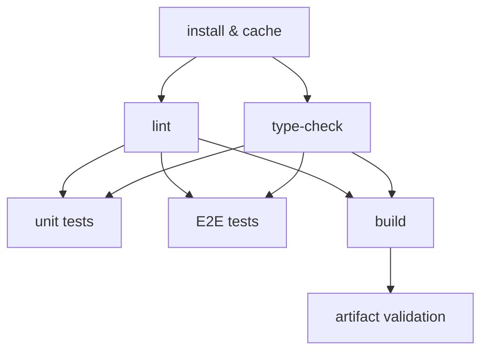

# [FEE-1502] 構建流水線：Lint、型別檢查、測試與構建

:::info
現代前端專案的 CI pipeline 會執行多種成本差異極大的檢查：lint 可能在十秒內完成，而 E2E 測試套件可能需要執行數分鐘。將這些檢查依成本由低到高排序，並將型別檢查視為與 build 分開的獨立關卡，是決定一次失敗的推送究竟是快速失敗還是緩慢失敗的兩個關鍵決策。esbuild、SWC、Vite 等現代 bundler 會剝離 TypeScript 型別而不進行檢查，因此 build 成功並不代表程式碼型別正確。本文將說明關卡順序、pipeline DAG，以及讓 CI 在程式碼庫成長過程中維持高速的 monorepo affected 測試模式。
:::

## 背景

CI pipeline 是一連串的品質關卡（quality gate）。任何一道關卡失敗都會阻止程式碼合併，但這些關卡的成本並不相同：有些十秒內就能完成，有些則需要數分鐘。如果在低成本關卡之前執行高成本關卡，開發者就必須等待高成本關卡的延遲時間，才能得知一個低成本關卡原本能立即抓到的錯誤。

現代前端專案的標準品質關卡順序如下：

1. **靜態分析**：ESLint、Prettier，或是 Biome、oxlint 等以 Rust 打造的工具鏈（10–30 秒；oxlint 自 2025 年 6 月起已推出穩定的 1.0 版本，通常能在一秒內完成，這也強化了將它排在第一順位執行的理由）
2. **型別檢查**：`tsc --noEmit`（20–60 秒）
3. **單元測試**：Vitest、Jest（30–120 秒）
4. **整合 / E2E 測試**：Playwright、Cypress（2–10 分鐘）
5. **構建**：Vite、webpack、Turbopack（1–5 分鐘）
6. **Artifact 驗證**：bundle 大小檢查、輸出確認（5–30 秒）

這份清單按典型成本排序，但實務上這些區間會重疊：大型專案的 build 可能比它的 E2E 套件更快或更慢，視程式碼庫而定。本文「視覺對比」章節中的 pipeline 反映了這一點，讓 build 與測試 job 並行執行，而非依平均耗時將每個階段串行排列。

這個順序也反映了每項檢查的本質。Lint 和 type-check 純粹是靜態的：它們讀取原始碼檔案後即退出，不執行任何程式碼、不啟動 server，也不需要已構建的 artifact。單元測試會執行程式碼，但僅在 process 內部進行，不涉及網路或 DOM。E2E 測試在瀏覽器中針對實際運行的應用程式執行。Build 產出的是最終會被部署的 artifact。每個層級因為做了更多真實世界的模擬，成本也隨之提高。

GitHub Actions 等現代 CI 平台支援在 job 層級進行平行化。Lint 和 type-check 因為不共享狀態，可以同時執行。一旦這兩道關卡通過，單元測試、E2E 測試和 build 也都可以同時並行執行。

---

## 視覺對比

Pipeline DAG，顯示平行與循序的階段：



**閱讀 DAG：**
- `install` 是所有後續 job 的唯一前提
- `lint` 和 `type-check` 並行執行，兩者都在 install 完成後立即啟動
- `unit tests`、`E2E tests` 和 `build` 各自只需等待 lint 和 type-check 通過；這兩道關卡一旦清除，三者就會彼此並行執行
- `artifact validation`（bundle 大小檢查、輸出驗證）在 `build` 產出 artifact 後執行

讓 `build` 只依賴 lint 和 type-check，而非依賴測試 job，能讓耗時較長的測試套件與 build 並行執行：失敗的 E2E 測試不會拖延 build，緩慢的 build 也不會拖延測試。這裡付出的代價是運算資源，而非實際等待時間（wall-clock time）。如果某次變更原本就會讓測試失敗，這種結構會多花費幾分鐘的 build 運算資源，這正是以測試結果閘控 build 的作法原本能省下的部分。使用計量式 CI 分鐘數、寧可犧牲運算資源也要縮短等待時間的團隊，可以改為讓 `build` 依賴測試 job，以換取每次通過的執行都變慢一些。

---

## 範例

### 1. 包含 lint、type-check、test 和 build 的完整平行 pipeline

以下每個 job 都各自執行 checkout、pnpm 設定與相依套件安裝，而非共用另一個獨立 install job 產出的 `node_modules` artifact。GitHub 託管的 runner 並未內建 pnpm，因此任何跳過 `pnpm/action-setup` 的 job，第一次呼叫 `pnpm` 時都會因為 `pnpm: command not found` 而失敗。讓每個 job 都有自己的設定步驟，並搭配 `actions/setup-node` 內建的 pnpm store cache，就能避免這個問題，同時也讓每個 job 各自釘選自己的 Node 版本，而不是繼承某個獨立 install job 恰好使用的版本。

```yaml
# .github/workflows/ci.yml
name: CI

on:
  pull_request:
  push:
    branches: [main]

concurrency:
  group: ci-${{ github.ref }}
  cancel-in-progress: ${{ github.ref != 'refs/heads/main' }}

jobs:
  lint:
    name: Lint
    runs-on: ubuntu-latest
    steps:
      - uses: actions/checkout@v4
      - uses: pnpm/action-setup@v4
        with:
          version: 10
      - uses: actions/setup-node@v4
        with:
          node-version: 22
          cache: pnpm
      - run: pnpm install --frozen-lockfile
      - run: pnpm lint
      - run: pnpm format:check

  type-check:
    name: Type Check
    runs-on: ubuntu-latest
    steps:
      - uses: actions/checkout@v4
      - uses: pnpm/action-setup@v4
        with:
          version: 10
      - uses: actions/setup-node@v4
        with:
          node-version: 22
          cache: pnpm
      - run: pnpm install --frozen-lockfile
      - run: pnpm tsc --noEmit

  unit-test:
    name: Unit Tests
    needs: [lint, type-check]
    runs-on: ubuntu-latest
    steps:
      - uses: actions/checkout@v4
      - uses: pnpm/action-setup@v4
        with:
          version: 10
      - uses: actions/setup-node@v4
        with:
          node-version: 22
          cache: pnpm
      - run: pnpm install --frozen-lockfile
      - run: pnpm test:unit --coverage
      - uses: actions/upload-artifact@v4
        if: always()
        with:
          name: coverage-report
          path: coverage/

  e2e-test:
    name: E2E Tests
    needs: [lint, type-check]
    runs-on: ubuntu-latest
    steps:
      - uses: actions/checkout@v4
      - uses: pnpm/action-setup@v4
        with:
          version: 10
      - uses: actions/setup-node@v4
        with:
          node-version: 22
          cache: pnpm
      - run: pnpm install --frozen-lockfile
      - run: pnpm exec playwright install --with-deps chromium
      - run: pnpm build
      - run: pnpm test:e2e

  build:
    name: Build
    needs: [lint, type-check]
    runs-on: ubuntu-latest
    steps:
      - uses: actions/checkout@v4
      - uses: pnpm/action-setup@v4
        with:
          version: 10
      - uses: actions/setup-node@v4
        with:
          node-version: 22
          cache: pnpm
      - run: pnpm install --frozen-lockfile
      - run: pnpm build
      - uses: actions/upload-artifact@v4
        with:
          name: dist
          path: dist/

  size-check:
    name: Bundle Size
    needs: build
    runs-on: ubuntu-latest
    steps:
      - uses: actions/checkout@v4
      - uses: pnpm/action-setup@v4
        with:
          version: 10
      - uses: actions/setup-node@v4
        with:
          node-version: 22
          cache: pnpm
      - run: pnpm install --frozen-lockfile
      - uses: actions/download-artifact@v4
        with:
          name: dist
          path: dist/
      - run: pnpm size-limit
```

`e2e-test` job 會自行執行 `pnpm build`，而非依賴 `build` job，因為 `build` 是與測試並行執行，而非在測試之前執行（見「視覺對比」）。Playwright 仍然需要一個可供測試的對象；它在 `playwright.config.ts` 中的 `webServer` 選項會針對這次新產生的 build 啟動一個 preview server：

```typescript
// playwright.config.ts
import { defineConfig } from '@playwright/test'

export default defineConfig({
  webServer: {
    command: 'pnpm vite preview --port 4173',
    port: 4173,
    reuseExistingServer: !process.env.CI,
  },
  use: {
    baseURL: 'http://localhost:4173',
  },
})
```

### 2. `tsc --noEmit` 作為獨立 job，與 build 分開

build job 和 type-check job 檢查的是不同的事情，兩者都不依賴對方的輸出：type-check job 從不接觸 `dist/`，build 流程也從不呼叫 `tsc`。兩個 job 都只需要 lint 和 type-check 通過，接著就會與測試 job 並行執行。

```yaml
type-check:
  name: Type Check
  runs-on: ubuntu-latest
  steps:
    - uses: actions/checkout@v4
    - uses: pnpm/action-setup@v4
      with:
        version: 10
    - uses: actions/setup-node@v4
      with:
        node-version: 22
        cache: pnpm
    - run: pnpm install --frozen-lockfile
    # 明確的型別關卡：下面的 Vite build 不會執行這個
    - run: pnpm exec tsc --noEmit --project tsconfig.json

build:
  name: Build
  needs: [lint, type-check]
  runs-on: ubuntu-latest
  steps:
    - uses: actions/checkout@v4
    - uses: pnpm/action-setup@v4
      with:
        version: 10
    - uses: actions/setup-node@v4
      with:
        node-version: 22
        cache: pnpm
    - run: pnpm install --frozen-lockfile
    # esbuild/Rollup 進行 transpile：不進行型別檢查
    - run: pnpm vite build
```

type-check job 使用的 `tsconfig.json` 應該是你最嚴格的配置：`strict: true`、`noUncheckedIndexedAccess: true`，以及任何專案特定的規則。Build 配置可能使用獨立的 `tsconfig.build.json` 來排除測試檔案；而 type-check job 應該包含它們。

### 3. 覆蓋率報告上傳與閾值配置（Vitest）

配置在測試 runner 本身的覆蓋率閾值（Vitest 的 `coverage.thresholds` 或 Jest 的 `coverageThreshold`）都是硬性關卡：未達閾值會以非零狀態碼結束並讓 job 失敗。兩個 runner 都沒有內建「警告但不失敗」的模式。若真的需要純粹軟性、僅供追蹤趨勢的覆蓋率，應跳過 runner 內建的閾值機制，改用 Codecov 的資訊性狀態檢查，或是在另一個非必要的獨立 job 中執行閾值檢查。

```typescript
// vitest.config.ts
import { defineConfig } from 'vitest/config'

export default defineConfig({
  test: {
    coverage: {
      provider: 'v8',
      reporter: ['text', 'lcov', 'html'],
      // 這些閾值是硬性關卡：只要未達標，CI 就會讓 job 失敗。
      // 若需要軟性、僅供趨勢追蹤的覆蓋率，請移除這個區塊，
      // 改在 codecov.yml 中使用 Codecov 的資訊性狀態檢查。
      thresholds: {
        lines: 70,
        functions: 70,
        branches: 60,
        statements: 70,
        // 'perFile' 對每個檔案套用閾值：能捕捉完全未測試的新增檔案
        perFile: false,
      },
      exclude: [
        'src/**/*.stories.ts',
        'src/**/*.config.ts',
        'src/types/**',
      ],
    },
  },
})
```

若要讓覆蓋率變成資訊性而非硬性關卡，可以直接配置 Codecov：

```yaml
# codecov.yml
coverage:
  status:
    project:
      default:
        informational: true
    patch:
      default:
        informational: true
```

上傳覆蓋率到 Codecov 以追蹤趨勢：

```yaml
unit-test:
  name: Unit Tests
  needs: [lint, type-check]
  runs-on: ubuntu-latest
  steps:
    - uses: actions/checkout@v4
    - uses: pnpm/action-setup@v4
      with:
        version: 10
    - uses: actions/setup-node@v4
      with:
        node-version: 22
        cache: pnpm
    - run: pnpm install --frozen-lockfile
    - run: pnpm vitest run --coverage
    - name: 上傳覆蓋率到 Codecov
      uses: codecov/codecov-action@v5
      with:
        token: ${{ secrets.CODECOV_TOKEN }}
        files: ./coverage/lcov.info
        fail_ci_if_error: false   # 覆蓋率上傳失敗不應阻擋 CI
        flags: unit
```

將 `fail_ci_if_error` 設為 `false` 是刻意的：Codecov 上傳是一個報告步驟，而非品質關卡，因此 Codecov 端的網路錯誤不應阻擋合併。`codecov-action@v5` 也支援針對 fork 儲存庫的 PR，以及選擇不強制要求 token 的公開 repository 組織，進行免 token 上傳；私有 repository 仍需要 `CODECOV_TOKEN`。

### 4. 使用 `size-limit` 進行 bundle 大小檢查

```json
// package.json（size-limit 配置）
{
  "size-limit": [
    {
      "name": "Main bundle",
      "path": "dist/assets/index-*.js",
      "limit": "150 kB",
      "gzip": true
    },
    {
      "name": "CSS bundle",
      "path": "dist/assets/index-*.css",
      "limit": "30 kB",
      "gzip": true
    },
    {
      "name": "Vendor chunk",
      "path": "dist/assets/vendor-*.js",
      "limit": "200 kB",
      "gzip": true
    }
  ]
}
```

在 GitHub Actions 中，使用 `size-limit/action` 來獲得包含大小差異的 PR 留言：

```yaml
size-check:
  name: Bundle Size
  needs: build
  runs-on: ubuntu-latest
  steps:
    - uses: actions/checkout@v4
    - uses: pnpm/action-setup@v4
      with:
        version: 10
    - uses: actions/setup-node@v4
      with:
        node-version: 22
        cache: pnpm
    - run: pnpm install --frozen-lockfile
    - uses: andresz1/size-limit-action@v1
      with:
        github_token: ${{ secrets.GITHUB_TOKEN }}
        # 這個 action 會構建、執行 size-limit，並發布 PR 留言
        # 顯示與 base branch 相比的大小增減
```

`size-limit-action` 會比較當前 PR 與 base branch 的 bundle 大小，並發布一條顯示每個 chunk 增減的留言。這比簡單的通過/失敗更有用：一個在 vendor chunk 中增加 5 kB 的 PR 值得 review，即使它仍低於絕對限制。

### 5. CI 中的 Nx affected 指令

```yaml
# .github/workflows/ci.yml（使用 Nx 的 monorepo）
name: CI (Affected)

on:
  pull_request:
  push:
    branches: [main]

jobs:
  affected:
    name: Affected Checks
    runs-on: ubuntu-latest
    steps:
      - uses: actions/checkout@v4
        with:
          # 獲取完整歷史記錄，讓 Nx 能夠計算 affected 集合
          fetch-depth: 0

      - uses: pnpm/action-setup@v4
        with:
          version: 10

      - uses: actions/setup-node@v4
        with:
          node-version: 22
          cache: pnpm

      - run: pnpm install --frozen-lockfile

      - name: 為 affected 指令推導 base 與 head SHA
        uses: nrwl/nx-set-shas@v5

      - name: Lint affected
        run: pnpm nx affected -t lint

      - name: Type-check affected
        run: pnpm nx affected -t type-check

      - name: Test affected
        run: pnpm nx affected -t test --coverage

      - name: Build affected
        run: pnpm nx affected -t build
```

`nrwl/nx-set-shas` 會設定 `nx affected` 自動讀取的 `NX_BASE` 和 `NX_HEAD` 環境變數，將 base 解析為 main 分支上最近一次成功的 commit。像 `HEAD~1` 這種手動設定的 base，只要一次推送包含多個 commit，或前一次 CI 執行失敗，就會出錯：它會悄悄跳過中間的所有 commit，讓那些變更永遠不會被測試到。

每個 Nx target（`lint`、`type-check`、`test`、`build`）都必須在專案的 `project.json` 或 `nx.json` 中定義。Nx 在計算 affected 集合時遵守依賴圖：如果 package A 依賴 package B，而你修改了 package B，Nx 會將 A 和 B 都標記為 affected。

對於 Turborepo，等效的方式是使用自 Turborepo 2.1 起提供的原生 `--affected` 旗標：

```yaml
- name: 測試 affected packages
  env:
    TURBO_SCM_BASE: ${{ github.event.pull_request.base.sha }}
  run: pnpm turbo run test --affected
```

### 6. 必要與選擇性 status checks

GitHub 的 branch protection rule 區分**必要（required）**和**選擇性（optional）** status checks：

**必要 checks**：branch protection rule 以 job 名稱列出這些 check。Pull request 在所有必要 check 通過之前無法合併。如果必要 check 未被回報（job 被跳過或從未執行），合併按鈕保持鎖定。

**選擇性 checks**：作為 status check 回報在 commit 上，在 PR 時間軸中可見，但不阻擋合併。失敗的選擇性 check 會顯示橙色警告而非紅色阻擋。

前端專案的建議配置：

| Check | 必要？ | 理由 |
|---|---|---|
| lint | 是 | Lint 失敗始終是缺陷 |
| type-check | 是 | 型別錯誤始終是缺陷 |
| unit-test | 是 | 失敗的單元測試阻擋合併 |
| build | 是 | Build 失敗意味著 artifact 損壞 |
| e2e-test | 是（主要流程）| 核心流程必須通過 |
| coverage-upload | 否 | 報告步驟；網路失敗不應阻擋合併 |
| bundle-size | 否 | 資訊性的；硬性限制在 `size-limit` 配置中設定 |
| e2e-test（完整套件）| 否 | 緩慢的套件；按排程執行，而非每個 PR |

Branch protection 配置位於 repository 設定的 **Branches → Branch protection rules → Require status checks to pass before merging**。Status check 名稱必須與 GitHub Actions job 的 `name` 欄位完全匹配，而非 workflow 名稱。

---

## 最佳實踐

**應該（SHOULD）在採用循序閘控的 pipeline 中，於測試 job 之前執行 lint 和 type-check。** 靜態分析在 10–30 秒內完成；單元測試需要 30–120 秒，E2E 測試需要 2–10 分鐘。讓較慢的 job 依賴 lint 和 type-check 通過，能省下這些 job 原本會花在「反正會先被廉價檢查擋下」的推送上的運算資源。代價是：同時有 lint 錯誤和測試失敗的推送，會一次只暴露一個問題，而非一次全部呈現。擁有充裕 CI 資源的團隊，例如自架 runner 或不計量的分鐘數，通常會改為讓所有關卡並行執行，以運算資源換取第一次推送就能得到完整回饋。

**必須（MUST）將 `tsc --noEmit` 作為獨立 CI job 執行，與 build job 分開。** Vite、esbuild、SWC 等現代 bundler 在 transpile TypeScript 時不會執行型別檢查器，因此 build 成功並不代表型別正確。團隊必須（MUST）包含一個專用的 type-check job；省略它意味著 TypeScript 錯誤會靜默地累積，永遠不會被 CI 捕捉。Vue 和 Svelte 專案需要分別使用 `vue-tsc --noEmit` 或 `svelte-check`，因為單純的 `tsc` 完全不會檢查單一檔案元件（single-file component）。

**應該（SHOULD）在每次 CI 安裝時使用 `--frozen-lockfile`（pnpm）或 `npm ci`。** 沒有 frozen flag，package manager 可能將依賴範圍解析到與 lockfile 不同的版本，產生非確定性的安裝。CI 環境應該（SHOULD）在 lockfile 不同步時明確失敗，而非靜默地安裝不同的套件。

**應該（SHOULD）上傳 build artifact，而非在只需要讀取它的下游 job 中重新建置。** 如果 build job 產出 `dist/` 目錄，而像 `size-check` 這樣的下游 job 因為沒有上傳 artifact 而必須從原始碼重新建置，每次執行都要再次支付完整的 build 時間。團隊應該（SHOULD）將 build 輸出作為 GitHub Actions artifact 上傳，並在只需要消費它的 job 中還原。與 `build` 並行執行、而非在其之後執行的 job（例如本文 pipeline 中的 `e2e-test`），需要自己的 build 步驟，因為它們開始執行時 artifact 還不存在。

**應該（SHOULD）在執行 affected 指令的 workflow 中設定 `fetch-depth: 0`。** Nx 和 Turborepo 透過比較目前分支與 base commit 來計算 affected 集合。沒有完整的 git 歷史，repository 就是淺層 clone，base commit 可能不存在，導致 affected 計算回退到執行所有測試。在任何呼叫 `nx affected`、`nx-set-shas` 或 `turbo run --affected` 的 job 中設定 `fetch-depth: 0`。

**應該（SHOULD）將覆蓋率作為趨勢指標收集，而非以硬性百分比閾值作為 CI 關卡。** 硬性閾值激勵開發者撰寫能觸碰程式碼行的測試，而非能驗證正確性的測試。團隊應該（SHOULD）在每次 CI 執行時收集覆蓋率、在 PR 上報告差異，並對急劇下降發出警示，而非以固定百分比底線阻擋合併。

---

## 設計思維

### 為何 fail-fast 順序至關重要

考慮同一組 pipeline 的兩種排列方式：先執行 lint，或是先執行 build。

以一個具體的假設情境來說明：假設 lint 需要 12 秒，build 需要 3 分鐘。如果 build 先執行，一個帶有微小 lint 錯誤（例如 `no-unused-vars` 違規）的開發者，必須等完整的 3 分鐘才能得知一個 12 秒檢查的結果。把 lint 調到前面執行，這段等待就縮短為 12 秒。這個差距會隨專案規模擴大：build 時間會隨著要編譯的程式碼量增加而變長，而只針對變更檔案執行的 lint，不論其餘程式碼庫有多大，耗時大致維持不變。

Fail-fast 排序把成本最低的訊號放在最前面，讓昂貴的檢查永遠不會拖延廉價的檢查。

### 為何 `tsc --noEmit` 必須與 build 分開作為獨立步驟

這是現代前端 CI 中最常被誤解的部分之一。這種混淆源於一個聽起來合理的假設：如果專案構建成功，TypeScript 必然是正確的。但對於相當大一部分的現代前端專案而言，這個假設是錯誤的。

根本原因在於型別檢查與 transpile 的分離。TypeScript 編譯器（`tsc`）做兩件截然不同的事：對程式碼進行型別檢查，以及輸出 JavaScript。這兩者可以解耦。`--noEmit` 旗標在不輸出任何檔案的情況下執行型別檢查，是純粹的型別關卡。

現代 build 工具，例如 esbuild、SWC 和 Vite 的 transform pipeline，採用不同的策略：它們在不執行型別檢查器的情況下剝離 TypeScript 型別標註。esbuild 自己的文件直接說明了這個取捨：它把 TypeScript 支援描述為語法剝除而非型別系統，並指出需要型別解讀的功能（例如 `emitDecoratorMetadata`）因此不受支援。這讓 build 保持快速，但也代表型別錯誤對 build 是不可見的。一個專案可以有數十個型別錯誤，卻仍能產出成功的 build artifact。

Next.js 是一個部分例外。`next build` 預設會執行 TypeScript 型別檢查，並在型別錯誤時讓 production build 失敗，除非設定了 `typescript.ignoreBuildErrors`。上述僅 transpile 的行為，適用於 Vite、esbuild 和 SWC 為基礎的 pipeline，也適用於為了速度而關閉 build 期型別檢查的 Next.js 專案。

實際影響是：如果 CI pipeline 只執行 build 而省略 `tsc --noEmit`，或是依賴只做 transpile 的 bundler 而沒有獨立的型別關卡，TypeScript 錯誤就會悄悄累積。第一次被發現往往是開發者在編輯器中看到時，或者更糟，是當一個錯誤的 type cast 導致 runtime 錯誤浮現時。

正確的 CI 設計：

- **Build job**：執行 `vite build` 或類似的 bundler 任務。速度快，不進行型別檢查（Next.js 是上述的例外）。
- **Type-check job**：多數專案執行 `tsc --noEmit`；Vue 專案使用 `vue-tsc --noEmit`，Svelte 專案使用 `svelte-check`，因為單純的 `tsc` 會跳過單一檔案元件。這是一個與 lint 並行執行的明確型別關卡。

Build job 和 type-check job 檢查的是不同的事情，兩者都不依賴對方的輸出：build 產出 artifact，type-check 產出通過/失敗的訊號。

### 為何以覆蓋率閾值作為硬性關卡有爭議

程式碼覆蓋率（code coverage）是理解哪些程式碼路徑被測試覆蓋的有用指標。Martin Fowler 在「TestCoverage」bliki 文章中指出，覆蓋率作為找出未測試程式碼的診斷工具效果很好，但作為目標則效果不佳：一旦它變成團隊被評判的數字，人們就會優化數字而非優化測試本身。

核心問題在於扭曲的激勵機制。當團隊設定了硬性覆蓋率閾值，例如 80%，需要快速交付的開發者會編寫能觸碰到程式碼行的測試，而非能驗證行為的測試。一個呼叫函式卻不做任何斷言的測試，形式上執行了程式碼路徑，卻沒有增加任何實質的安全保障。覆蓋率上升了，程式碼品質卻沒有。

Kent C. Dodds 在《Write tests. Not too many. Mostly integration.》中反對的「100% 覆蓋率」陷阱更具破壞性。某些程式碼，例如配置物件、type guard 和簡單的 getter，並不值得單獨測試。要求 100% 覆蓋率會迫使開發者為這些程式碼編寫單元測試，而對它們真正有意義的測試應該是整合測試或型別檢查。結果是測試套件充斥著低價值的微型測試，拖慢測試速度並增加維護負擔。

更好的做法是將覆蓋率作為趨勢指標，而非關卡：

- **在每次 CI 執行時收集覆蓋率資料**：上傳到 Codecov 或 Coveralls 等服務
- **在 pull request 上報告覆蓋率差異**：PR 留言顯示此次變更是否增加或減少了覆蓋率
- **對急劇下降發出警示**：降低 20 個百分點的 PR 值得關注；大型 PR 中 0.3% 的下降則不需要
- **使用 Codecov 的資訊性狀態模式，而非 runner 層級的硬性閾值**：在 `codecov.yml` 中設定 `informational: true`，讓覆蓋率只回報而不阻擋合併（見範例 3）

這種方式能夠發現真正測試不足的變更，同時不會創造出催生無意義測試的激勵結構。

### 為何 monorepo 需要 affected-only 測試

在擁有 50 個 package 的 monorepo 中，對每次 commit 執行所有測試套件會浪費時間。如果變更觸及了 `utils` package，CI 需要測試 `utils` 以及每個依賴它的 package，而不是另外 40 個與此次變更沒有依賴關係的 package。

Nx 和 Turborepo 等工具透過依賴圖分析解決了這個問題。Nx 從 `package.json` 依賴關係和 import 分析中建立 workspace 的依賴圖。執行 `nx affected -t test` 會計算出哪些 package 受到變更檔案的影響，並只為這些 package 執行測試。

節省的時間多寡，取決於一次變更實際觸及了 monorepo 的多大範圍：侷限在單一葉節點 package 的變更，能跳過所有不依賴它的 package 的測試套件；而觸及被廣泛依賴的 package 的變更，仍會觸發圖中大部分節點。WarpBuild 的 GitHub Actions monorepo 指南將 affected-only 執行視為現有可用手段中效益最大的一項，排在遠端快取和 matrix 平行化之前，因為只執行四個受影響的 package 而非四十五個，勝過對完全跳過的 package 做再多快取。

關鍵的實作細節是 base 參考。`nx affected` 透過比較目前 commit 與 base commit 來計算 affected 集合。在 CI 中，建議使用 `nrwl/nx-set-shas` action 來設定這個 base：它會解析為 main 分支上最近一次成功的 commit（見範例 5）。像 `HEAD~1` 這種寫死的 base，只要一次推送包含多個 commit，或前一次 CI 執行失敗，就會出錯，因為它會悄悄跳過中間的所有 commit。

---

## 常見錯誤

**在 monorepo 中對每次 commit 執行所有測試。** 沒有 affected-only 測試，monorepo 的 CI 執行時間會隨 package 數量線性增長。一個有 50 個 package、平均測試套件需 2 分鐘的 monorepo，如果完全串行執行需要 100 分鐘；即使跨 runner 平行處理，成本也高到讓團隊要不積極地分片，要不就不再信任 CI 能在下一次推送到來前跑完。透過 `nx affected` 或 Turborepo 的 `--affected` 旗標實現的 affected-only 測試，正是讓 monorepo CI 隨 package 數量成長仍保持可用的關鍵。

---

## 延伸閱讀

- [FEE-1500 CI/CD 與部署總覽](/zh-tw/CI%20CD%20and%20Deployment/1500)
- [FEE-1501 GitHub Actions 前端應用](/zh-tw/CI%20CD%20and%20Deployment/1501)
- [FEE-1100 測試策略](/zh-tw/Testing%20Strategies/1100)
- [FEE-803 tsc 與 SWC：型別檢查與 Transpilation](/zh-tw/Build%20Tooling%20and%20Module%20Systems/803)
- [FEE-805 使用 Nx 和 Turborepo 管理 Monorepo](/zh-tw/Build%20Tooling%20and%20Module%20Systems/805)

---

## 參考資料

- GitHub Docs, "Workflow syntax for GitHub Actions," GitHub (2026). https://docs.github.com/en/actions/reference/workflows-and-actions/workflow-syntax
- TypeScript Handbook, "tsc CLI Options," Microsoft (2026). https://www.typescriptlang.org/docs/handbook/compiler-options.html
- Nx Documentation, "Affected Commands," Nx (2026). https://nx.dev/ci/features/affected
- nrwl/nx-set-shas, "README," GitHub (2026). https://github.com/nrwl/nx-set-shas
- Turborepo Docs, "Constructing CI," Vercel (2026). https://turborepo.dev/docs/crafting-your-repository/constructing-ci
- size-limit, "Performance budget tool for JavaScript," GitHub (2026). https://github.com/ai/size-limit
- Codecov Docs, "Status Checks," Codecov (2026). https://docs.codecov.com/docs/commit-status
- Vitest, "Coverage configuration reference," Vitest (2026). https://vitest.dev/config/#coverage
- Vite Docs, "Features: TypeScript," VoidZero (2026). https://vite.dev/guide/features
- esbuild, "Content Types: No Type System," (2026). https://esbuild.github.io/content-types/#no-type-system
- Martin Fowler, "TestCoverage," martinfowler.com bliki (2012). https://martinfowler.com/bliki/TestCoverage.html
- Kent C. Dodds, "Write tests. Not too many. Mostly integration," kentcdodds.com (2017). https://kentcdodds.com/blog/write-tests
- WarpBuild, "The Complete Guide to GitHub Actions for Monorepos: Turborepo, Nx, and pnpm Workspaces," WarpBuild Blog (2025). https://www.warpbuild.com/blog/github-actions-monorepo-guide
