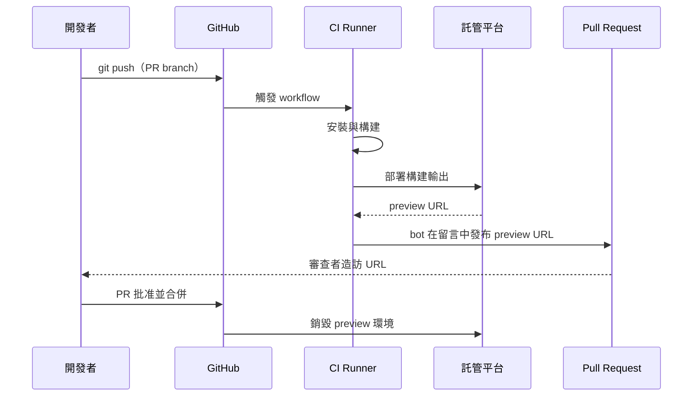

# 預覽部署與分支環境

## 情境

Preview deployment（預覽部署）是從特定 branch 或 pull request 構建的應用程式實際運行版本，可透過唯一 URL 存取。與截圖或影片導覽不同，preview deployment 是 PR 合併後實際會上線的 artifact——相同的 build、相同的 assets、相同的 JavaScript bundle、相同的 API 整合。任何持有連結的人都能與真實應用程式互動，無需在本機安裝任何東西。

流程很直接：每次推送到 PR branch 都會觸發 CI build。Build 成功後，產出的內容會部署到一個臨時環境。Bot 將 URL 發布到 PR 的留言串中。審查者點擊連結，看到應用程式實際執行，並根據第一手互動——而非從程式碼 diff 推斷——來批准或要求修改。

這個工作流程已成為使用 Vercel、Netlify 和 Cloudflare Pages 的前端團隊標準。三個平台在 repository 連接後都會自動實作——無需額外的 CI 配置。對於未使用這些平台的團隊，同樣的工作流程可以透過 GitHub Actions 搭配自訂 deploy 步驟和 PR 留言 bot 來複製。

**Preview deployment 的關鍵特性：**

- **每個 branch 或 PR 有唯一 URL** — 通常是從 branch 名稱或 PR 編號衍生的子網域或路徑，例如 `feature-checkout--myapp.vercel.app` 或 `deploy-preview-42--myapp.netlify.app`
- **推送時自動建立** — 無需手動觸發；偵測到推送時部署即開始
- **Ephemeral（短暫的）** — 環境只存在於 PR 的生命週期內；PR 合併或關閉時自動銷毀
- **隔離的** — 每個 PR 有自己獨立的部署，不與其他 PR 或 staging 環境共享

Preview deployment 與 staging 環境截然不同。Staging 是追蹤長期存活 branch（通常是 `main` 或 `develop`）的共享、持久環境，反映整合 branch 的當前狀態。Preview deployment 反映單一 PR branch 的當前狀態，獨立存在，不受其他進行中的變更影響。

---

## 設計思維

### 為何 preview deployment 改變了前端 review 文化

在 preview deployment 成為標準之前，PR 上的 UI 審查意味著三種選擇之一：審查者在本機執行 branch、作者在 PR 描述中貼上截圖，或審查者信任 code diff 來推斷視覺結果。三種方式都有重大缺陷。

在本機執行需要審查者設置好專案、正確的 Node 版本、正確的環境變數，以及足夠的脈絡來導航到應用程式的相關部分。對於審查排版的設計師或確認流程的產品經理來說，這是不合理的前提。截圖是靜態的——無法捕捉 hover 狀態、轉場效果、響應式行為或互動流程。從 code diff 推斷視覺結果需要審查者在腦中模擬渲染引擎，這對任何人都不可靠，對非工程師更是不可能。

一個 preview deployment 用一個 URL 消除了三種失敗模式。設計師打開連結。QA 工程師執行流程。產品經理確認文案。利害關係人在合併前確認行為。這一切都發生在實際會部署的 artifact 上，而非近似版本。

文化轉變意義深遠：它將審核從 code review 移向 product review。一個 PR 可以有整潔的程式碼卻有破損的 UX。Preview deployment 在開發週期中修復成本最低的時間點，將破損的 UX 呈現給能夠識別它的人。

### 為何 ephemeral 環境需要 URL 無關的配置

Preview deployment 的 URL 與 production 不同，也與 staging 不同。如果前端程式碼包含硬編碼的 API base URL——例如 `const API_BASE = 'https://api.myapp.com'`——當應用程式部署到 preview 環境時，該 URL 不會自動更新。Preview deployment 會呼叫 production API。在某些情況下這是可以接受的；但在許多情況下不行，因為正在審查的 PR 可能修改了 API 合約，而針對舊的 production API 測試將無法捕捉到退化（regression）。

正確的模型是透過環境變數進行 URL 無關的配置。前端讀取 `import.meta.env.VITE_API_URL`（Vite）或 `process.env.NEXT_PUBLIC_API_URL`（Next.js）。Vercel 和 Netlify 都支援每個部署情境（production、preview、branch-specific）的環境變數覆寫。Preview 情境獲得 preview API URL；production 獲得 production API URL。相同的程式碼部署到兩者；只有環境變數不同。

這個設計延伸到其他因環境而異的配置：分析追蹤 ID、feature flag 服務 endpoint、OAuth redirect URI、CDN 來源和第三方服務金鑰。這些都應該是環境變數，而非編譯時常數。規則很簡單：如果值在 production 和 preview 之間不同，它就必須是環境變數。

硬編碼的值不只是不便——它們會帶來安全性和正確性風險。硬編碼的 OAuth redirect URI 會拒絕 preview 網域。硬編碼的分析 ID 會用 preview 流量污染 production 分析數據。硬編碼的 API URL 可能繞過 PR 設計用來測試的 preview 專用中介軟體或 stub 回應。

### 為何 preview 與 staging 不同

Staging 是共享環境。每個開發者合併的工作都在那裡。如果兩個開發者在測試衝突的變更，staging 反映最後合併的內容。Staging 對整合測試很有用——驗證多個變更能一起運作——但對隔離的 PR 審查來說是不良場所，因為環境不受控制。

Preview deployment 是隔離的。它恰好包含一個 PR branch 的變更，建立在合併時的 base branch 之上。沒有其他進行中的 PR 污染環境。當 QA 簽核 preview deployment 時，他們是在簽核該 PR 中確切的那組變更，而非恰好在審查時出現在 staging 上的複合物。

Ephemeral 特性也是特點，而非只是節省成本的手段。每個 PR 都獲得全新環境，沒有先前審查遺留的累積狀態。如果先前的審查者留下了掩蓋 bug 的應用程式狀態，下一位審查者不會繼承那個狀態。Ephemeral 環境天生就是乾淨的。

### 為何 preview deployment 存在成本取捨

Vercel、Netlify 和 Cloudflare Pages 都在免費方案中提供 preview deployment，但對團隊和組織帳戶有重要限制。Vercel 的免費方案涵蓋個人帳戶；在私有 repository 上的團隊帳戶，並發 build 和 preview deployment 需要付費方案。Netlify 的免費方案涵蓋每月 300 分鐘的 build——一個 PR 活躍的小型團隊可能一天內就耗盡。

對於高 PR 速度的團隊，成本模型會改變。一個每天合併 20 個 PR、每次 build 需要 5 分鐘的團隊每天消耗 100 分鐘——遠超 Netlify 的免費月度配額。對這樣的團隊來說，選擇是在使用受管平台（付費）或在 GitHub Actions 上自行託管 preview deployment 工作流程（使用自己的基礎設施）之間。

GitHub Actions 方式需要更多設置：將 build 輸出部署到託管目標（S3、Cloudflare R2、自訂伺服器）的 deploy action、生成和追蹤 preview URL 的機制，以及發布 URL 的 PR 留言 bot。運維開銷是真實存在的，但對高速度團隊來說，節省的成本可以證明這是值得的。

---

## 最佳實踐

**禁止（MUST NOT）在前端原始碼中硬編碼 API base URL 或環境特定的設定值。** 若 `VITE_API_URL` 是編譯時常數而非環境變數，每個 preview deployment 都會呼叫相同的硬編碼 endpoint——通常是 production。團隊必須（MUST）對所有在 production、preview 和開發情境之間不同的值使用環境變數，包括 analytics ID、OAuth redirect URI 和 feature flag 服務 endpoint。

**應該（SHOULD）為所有影響 UI 的 PR 啟用 preview deployment。** 利害關係人、設計師和 QA 應該（SHOULD）能夠在真實 URL 上審查真實的 build，而非依賴截圖或本機設置說明。受管平台（Vercel、Netlify、Cloudflare Pages）連接後會自動實作；自行託管的設置應該（SHOULD）使用 GitHub Actions 搭配 deploy 步驟和 PR 留言 bot 複製相同的工作流程。

**應該（SHOULD）在後續推送時就地更新 PR 留言，而非建立新留言。** 每次推送都建立新留言的 bot 會使 PR 討論串充斥過時的 URL。團隊應該（SHOULD）在建立新留言前先檢查現有 bot 留言並就地更新，確保 PR 始終只顯示單一、最新的 preview URL。

**應該（SHOULD）為所有 preview deployment 加入 `X-Robots-Tag: noindex` header。** Preview URL 可公開存取，若未明確封鎖，搜尋引擎會對其建立索引。用開發版本污染搜尋結果是正確性問題，不只是美觀問題。在平台層面套用 noindex header，確保每個 preview deployment 都自動受到保護。

**應該（SHOULD）為自行託管的 preview 環境新增在 PR 關閉時觸發（`types: [closed]`）的清理 workflow。** 受管平台（Vercel、Netlify）會在 PR 關閉時自動銷毀 preview 環境。自行託管的設置應該（SHOULD）複製這個行為，避免已關閉的 PR 留下孤立部署而累積 hosting 成本和命名空間污染。

**不應（SHOULD NOT）對 fork PR 觸發的 preview workflow 授予正式環境等級的 secrets。** GitHub 預設不向來自 fork 的 pull request 觸發的 workflow 暴露 repository secrets。團隊應該（SHOULD）使用帶有所需審查者的環境層級 secrets，或帶有明確信任邊界的 `pull_request_target`，而非對任何開啟 PR 的 fork 授予不受限制的 secret 存取。

---

## 視覺

從推送到合併的 preview deployment 流程：



---

## 範例

### 1. Vercel preview deployment（`vercel.json`）

當 repository 連接到 Vercel dashboard 後，Vercel 無需任何 workflow 配置即可進行 preview deployment。每次推送到非 production branch 都會自動建立 preview。`vercel.json` 檔案控制 build 和路由行為：

```json
{
  "buildCommand": "pnpm build",
  "outputDirectory": "dist",
  "installCommand": "pnpm install --frozen-lockfile",
  "framework": "vite",
  "headers": [
    {
      "source": "/assets/(.*)",
      "headers": [
        {
          "key": "Cache-Control",
          "value": "public, max-age=31536000, immutable"
        }
      ]
    }
  ],
  "rewrites": [
    {
      "source": "/(.*)",
      "destination": "/index.html"
    }
  ]
}
```

Vercel 在每次部署中注入 `VERCEL_ENV`：production 部署為 `"production"`，所有 preview 部署為 `"preview"`，透過 Vercel CLI 的本機開發為 `"development"`。需要時可用此在 runtime 進行條件判斷。

每個部署情境的環境變數在 Vercel dashboard 的**Project Settings → Environment Variables** 中設置。每個變數可以限定到 Production、Preview 或 Development。例如：

| 變數 | Production | Preview |
|---|---|---|
| `VITE_API_URL` | `https://api.myapp.com` | `https://api-staging.myapp.com` |
| `VITE_ANALYTICS_ID` | `G-PROD-XXXX` | `G-DEV-XXXX` |
| `VITE_FEATURE_FLAGS_URL` | `https://flags.myapp.com/prod` | `https://flags.myapp.com/dev` |

### 2. Netlify deploy preview（`netlify.toml`）

Netlify 的 `vercel.json` 等效文件是 `netlify.toml`。Repository 連接後，deploy preview 預設啟用。`[context.deploy-preview]` 區塊專門為 preview deployment 覆寫設置：

```toml
[build]
  command = "pnpm build"
  publish = "dist"

[build.environment]
  NODE_VERSION = "20"
  PNPM_VERSION = "9"

# Production 情境：在 production branch（main）上執行
[context.production]
  command = "pnpm build"

  [context.production.environment]
    VITE_API_URL = "https://api.myapp.com"
    VITE_ANALYTICS_ID = "G-PROD-XXXX"

# Deploy preview 情境：在每個 pull request 上執行
[context.deploy-preview]
  command = "pnpm build"

  [context.deploy-preview.environment]
    VITE_API_URL = "https://api-staging.myapp.com"
    VITE_ANALYTICS_ID = "G-DEV-XXXX"

# Branch deploy 情境：在特定命名 branch 上執行
[context.staging]
  command = "pnpm build"

  [context.staging.environment]
    VITE_API_URL = "https://api-staging.myapp.com"

[[redirects]]
  from = "/*"
  to = "/index.html"
  status = 200
```

Netlify 在每次 build 中注入 `CONTEXT`：`"production"`、`"deploy-preview"`、`"branch-deploy"`。`DEPLOY_URL` 變數包含當前部署的唯一 URL——如果需要在 build 輸出中嵌入 preview URL（例如，在禁止 preview 網站被索引的 `robots.txt` 中）很有用。

### 3. GitHub Actions PR 留言 bot（自行託管 preview deployment）

對於不使用 Vercel 或 Netlify 的團隊，此 workflow 構建專案、部署到託管目標，並將 preview URL 作為 PR 留言發布。此範例使用 Wrangler CLI 部署到 Cloudflare Pages：

```yaml
# .github/workflows/preview.yml
name: Preview Deployment

on:
  pull_request:
    types: [opened, synchronize, reopened]

concurrency:
  group: preview-${{ github.ref }}
  cancel-in-progress: true

jobs:
  deploy-preview:
    name: Deploy Preview
    runs-on: ubuntu-latest
    permissions:
      contents: read
      pull-requests: write   # 發布 PR 留言所需

    steps:
      - uses: actions/checkout@v4

      - uses: pnpm/action-setup@v3
        with:
          version: 9

      - uses: actions/setup-node@v4
        with:
          node-version: 20
          cache: pnpm

      - run: pnpm install --frozen-lockfile

      - name: Build
        run: pnpm build
        env:
          VITE_API_URL: ${{ vars.PREVIEW_API_URL }}
          VITE_ANALYTICS_ID: ${{ vars.DEV_ANALYTICS_ID }}

      - name: Deploy to Cloudflare Pages
        id: deploy
        uses: cloudflare/wrangler-action@v3
        with:
          apiToken: ${{ secrets.CLOUDFLARE_API_TOKEN }}
          accountId: ${{ secrets.CLOUDFLARE_ACCOUNT_ID }}
          command: pages deploy dist --project-name=myapp --branch=${{ github.head_ref }}

      - name: 將 preview URL 發布到 PR
        uses: actions/github-script@v7
        with:
          script: |
            const deployUrl = '${{ steps.deploy.outputs.deployment-url }}';
            const prNumber = context.issue.number;
            const sha = context.sha.substring(0, 7);

            // 尋找現有 bot 留言以更新，而非重複建立
            const { data: comments } = await github.rest.issues.listComments({
              owner: context.repo.owner,
              repo: context.repo.repo,
              issue_number: prNumber,
            });

            const botComment = comments.find(c =>
              c.user.type === 'Bot' && c.body.includes('Preview Deployment')
            );

            const body = [
              '## Preview Deployment',
              '',
              `**URL:** ${deployUrl}`,
              `**Commit:** ${sha}`,
              `**Status:** Ready`,
              '',
              '_每次推送後此留言會自動更新。_',
            ].join('\n');

            if (botComment) {
              await github.rest.issues.updateComment({
                owner: context.repo.owner,
                repo: context.repo.repo,
                comment_id: botComment.id,
                body,
              });
            } else {
              await github.rest.issues.createComment({
                owner: context.repo.owner,
                repo: context.repo.repo,
                issue_number: prNumber,
                body,
              });
            }
```

`actions/github-script` 步驟在建立新留言前先檢查現有 bot 留言。在後續推送到同一個 PR 時，留言會就地更新，而非每次推送都建立新留言。這保持了 PR 留言串的整潔。

### 4. Preview 與 production 的環境變數設置

在 Vite 專案中，環境變數透過 `.env` 檔案依範圍分類。對於受管平台（Vercel、Netlify）上的 preview deployment，透過平台 dashboard 設置變數。對於本機開發和自行託管的 CI，使用 `.env` 檔案：

```
# .env                      — 在所有環境載入
VITE_APP_NAME=MyApp

# .env.production           — 只在 `vite build`（production）載入
VITE_API_URL=https://api.myapp.com
VITE_ANALYTICS_ID=G-PROD-XXXX

# .env.development          — 只在 `vite dev` 載入
VITE_API_URL=http://localhost:3001
VITE_ANALYTICS_ID=G-DEV-XXXX
```

對於 CI 中的 preview 專用值，將它們作為 workflow 環境變數或 repository 變數傳遞（不是 secrets，因為 API URL 不敏感）：

```yaml
- name: Build
  run: pnpm build
  env:
    # VITE_ 前綴使變數在瀏覽器程式碼中可用
    VITE_API_URL: ${{ vars.PREVIEW_API_URL }}
    VITE_ENV_NAME: preview
```

在應用程式程式碼中存取：

```typescript
// src/config.ts
export const config = {
  apiUrl: import.meta.env.VITE_API_URL,
  analyticsId: import.meta.env.VITE_ANALYTICS_ID,
  isPreview: import.meta.env.VITE_ENV_NAME === 'preview',
} as const;
```

### 5. Preview 專用的 feature flag

Feature flag 可以在 preview 環境中以不同方式切換，讓開發中的功能對審查者可見，而不在 production 中啟用它們。

```typescript
// src/features/flags.ts
const isPreviewEnvironment = (): boolean => {
  // Vercel 在 build 時注入 VITE_VERCEL_ENV
  if (import.meta.env.VITE_VERCEL_ENV === 'preview') return true;

  // Netlify 在 build 時注入 VITE_CONTEXT
  if (import.meta.env.VITE_CONTEXT === 'deploy-preview') return true;

  // 在自行託管 preview 的 CI 中手動設置的旗標
  if (import.meta.env.VITE_ENV_NAME === 'preview') return true;

  return false;
};

export const featureFlags = {
  // 在 preview 中始終啟用；production 中由 flag 服務控制
  newCheckoutFlow: isPreviewEnvironment() || getRemoteFlag('new-checkout-flow'),

  // 僅用於內部 preview — 絕不在 production 中顯示
  debugOverlay: isPreviewEnvironment(),

  // 在所有環境中由 feature flag 服務控制
  darkMode: getRemoteFlag('dark-mode'),
} as const;
```

要將 Vercel 的環境暴露給 Vite build，需在 build 命令中手動添加 `VERCEL_ENV` 前綴，或使用 Vercel 的自動注入。注意 Vercel 注入 `VERCEL_ENV` 但非 `VITE_VERCEL_ENV`——你必須在配置中映射該變數：

```toml
# 在 Project Settings → Environment Variables 中設置：
# VITE_VERCEL_ENV = preview  （限定到 Preview 情境）
# VITE_VERCEL_ENV = production  （限定到 Production 情境）
```

對於 Netlify，在 `netlify.toml` 的 environment 區塊中將 `VITE_CONTEXT` 設為 `$CONTEXT`——Netlify 會將 `$CONTEXT` 展開為當前部署情境（`production`、`deploy-preview` 等）。

---

## 常見錯誤

**混淆 preview 與 staging。** Staging 用於整合；preview 用於隔離。將所有 PR 審查路由到 staging 會破壞隔離特性——如果兩個 PR 同時被審查，staging 環境反映最後合併的那個，而非任何一個 PR 的獨立狀態。使用 preview deployment 進行 PR 審查；使用 staging 進行整合測試。

**OAuth redirect URI 不匹配。** 如果你的應用程式使用 OAuth，OAuth 供應商的允許 redirect URI 清單必須包含 preview URL 網域。Vercel preview URL 透過 branch 名稱確定——在 OAuth 供應商 dashboard 中添加 `*.vercel.app` 作為允許的 redirect 來源。Netlify preview URL 包含 deploy ID，無法透過 branch 名稱預測；使用 `*.netlify.app` 作為萬用字元。

---

## 相關 FEE

- [FEE-1500 CI/CD 與部署概覽](1500.md)
- [FEE-1501 GitHub Actions 前端應用](1501.md)
- [FEE-1504：正式部署：靜態託管與 CDN](1504.md)
- [FEE-806 環境變數與配置](../Build%20Tooling%20and%20Module%20Systems/806.md)

---

## 參考資料

- [Vercel — Preview Deployments](https://vercel.com/docs/deployments/preview-deployments)
- [Netlify — Deploy Previews](https://docs.netlify.com/site-deploys/deploy-previews/)
- [Cloudflare Pages — Branch deployments and preview aliases](https://developers.cloudflare.com/pages/configuration/branch-build-controls/)
- [GitHub Actions — Creating or updating a comment (actions/github-script)](https://github.com/actions/github-script)
- [Vite — Env Variables and Modes](https://vitejs.dev/guide/env-and-mode)
