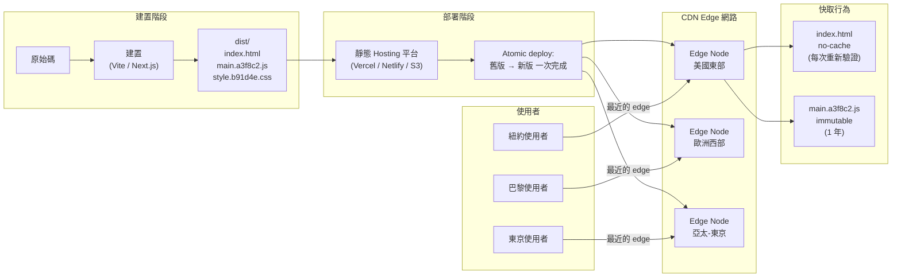

# 正式環境部署：靜態託管與 CDN

## 情境

現代前端應用程式在建置後會產生一組靜態檔案 — HTML、JavaScript bundle、CSS、圖片、字型 — 這些檔案不需要任何伺服器端的執行期運算。一旦建置完成，這些檔案就是靜態的：在下一次部署之前不會改變。這個特性讓我們能夠採用一種與傳統伺服器端部署根本不同的部署模型。

這套模型分三個步驟：執行建置、將產出上傳至 CDN、從全球 CDN edge node 提供服務。不需要佈建應用程式伺服器、不需要維持任何執行中的程序、不需要設定自動擴展群組。基礎設施的問題縮減為一個核心問題：這些檔案要如何送達 edge？

這個架構提供的效能表現，是伺服器型部署難以或根本無法達到的。CDN edge node 分散在全球各地 — 通常有數百個節點。東京的使用者會連線到東京的 edge node；聖保羅的使用者會連線到聖保羅的 edge node。從使用者到內容的來回時間（round-trip time）只有個位數毫秒。沒有伺服器冷啟動（cold start）、沒有連線池（connection pool）耗盡的問題、也沒有垂直擴展的上限。靜態 CDN 部署可以以同樣的延遲特性服務數百萬個並發使用者，如同服務單一使用者一般。

這個模型的取捨是：它只適用於不需要每個請求都進行伺服器端運算的內容。對於大多數前端應用程式 — SPA、靜態產生網站、文件網站、行銷頁面 — 這根本不算取捨。建置產出完全是靜態的，API 呼叫在客戶端對獨立的 API 伺服器發出，hosting 層不需要進行任何運算。

**部署 pipeline：**

1. 開發者將程式碼推送至 main 分支
2. CI 執行 linting、測試，以及正式環境建置
3. 建置產出 `dist/` 目錄，內含所有靜態檔案
4. CI pipeline 將 `dist/` 的內容上傳至 CDN 或靜態 hosting 平台
5. CDN 將檔案分發至全球各地的 edge node
6. 使用者請求應用程式，由最近的 edge node 回應

這套 pipeline 可重複執行、有稽核記錄且速度快。對大多數專案而言，從 merge 到上線的典型部署時間在兩分鐘以內。

**平台概覽：**

現代靜態 hosting 市場已集中在少數幾個平台，它們以零或接近零的設定量實作了這套 pipeline：

- **Vercel** — 起源於 Next.js 的部署平台；支援任何框架，具備 zero-config 偵測；邊緣網路效能強勁；內建 preview deployment 和 serverless function；免費方案慷慨
- **Netlify** — 功能與 Vercel 相近；是 preview deployment 的先驅；對 SSG 框架支援強；提供 Netlify Functions 與 Edge Functions；在 JAMstack 生態系中廣泛使用
- **Cloudflare Pages** — 由 Cloudflare 的全球網路（全球規模最大之一）支撐；可整合 Workers 執行 edge 運算；免費方案提供無限頻寬；對框架的支援持續擴充
- **AWS S3 + CloudFront** — S3 作為檔案儲存、CloudFront 作為 CDN 層；對每個設定參數擁有最大控制權；需要相當的 AWS 專業知識與大量手動設定；適合已在大規模運營 AWS 基礎設施的團隊
- **GitHub Pages** — 免費、與 GitHub 儲存庫高度整合；免費方案僅限公開儲存庫；無法自訂 cache header；最適合開源專案文件

---

## 設計思維

### 為什麼靜態 CDN 模型如此快速

CDN 託管的靜態網站效能來自三個相互增強的因素：地理上的鄰近性、消除伺服器端延遲、以及無限的水平擴展。

**地理上的鄰近性。** CDN edge node 是一個「存在點（Point of Presence，PoP）」，部署在盡可能靠近終端使用者的位置。主要 CDN 提供商 — Cloudflare、Fastly、AWS CloudFront、Vercel 的 Edge Network — 在全球運營數百個 PoP。當使用者請求 `index.html` 時，請求會送往最近的 PoP，而非中央 origin 伺服器。對於距離傳統資料中心地區（美國東岸、歐洲西部）較遠的使用者而言，這可以將 time-to-first-byte 縮短數百毫秒。

**消除伺服器端延遲。** 傳統伺服器端渲染的應用程式在每個請求上都必須執行程式碼：讀取 session 資料、查詢資料庫、渲染 HTML、序列化回應。這些步驟每一個都增加延遲。對於靜態 CDN 回應，這一切都不發生。Edge node 從本地快取讀取檔案（或向 origin 取得一次後快取給所有後續請求），並將其串流給使用者。回應時間的瓶頸是網路延遲，而非運算延遲。

**無限的水平擴展。** CDN 本質上是分散式的。使用者增加並不會增加任何單一伺服器的負載，而是將負載分散至所有 edge node。沒有自動擴展的延遲、沒有預熱期、也沒有流量突增（thundering herd）的問題。每天服務 100 個請求的網站和每天服務 1 億個請求的網站，在 hosting 層的基礎設施複雜度是相同的。

### 為什麼 atomic deployment 至關重要

一次部署是從一組檔案過渡到另一組檔案的轉換。若沒有 atomicity 保證，這個轉換並非瞬間完成 — 上傳與傳播檔案需要時間。在這段時間內，部分檔案來自舊部署，部分來自新部署。一個載入了新版 `index.html` 的使用者，可能會從 CDN edge node 取得舊版的 JavaScript chunk（因為新的 chunk 尚未到達該 edge node），結果得到一個損壞的應用程式 — 缺失的模組、不匹配的 API 合約、執行期錯誤。

Atomic deployment 通過確保轉換是全有或全無來解決這個問題。平台以一個整體單元接收新的部署，完整儲存後，再以單一步驟將路由切換至新部署。切換前，所有使用者看到舊部署；切換後，所有使用者看到新部署。不存在部分狀態。

這也讓回滾（rollback）變得簡單。回滾就是將路由切換回前一個部署單元 — 同樣是一個 atomic 操作。前一個部署的檔案仍然存在，不需要重新建置。

Vercel、Netlify 和 Cloudflare Pages 都實作了 atomic deployment。AWS S3 則否 — 檔案上傳後立即可被存取，需要額外的策略（例如部署至獨立的 S3 前綴後再切換 CloudFront origin）才能實現 atomicity。

### 為什麼 HTML 與靜態資源的 cache header 必須不同

Content hashing 是讓長期資源快取安全的機制。當 bundler（Vite、webpack、Rollup）建置應用程式時，它會產生包含檔案內容 hash 的檔名 — 例如 `main.a3f8c2.js`。若 `main.js` 的內容改變，hash 也會改變，bundler 就會輸出 `main.d91b4f.js`。舊 URL（`main.a3f8c2.js`）與新 URL（`main.d91b4f.js`）是不同的資源。無論是已快取舊檔案的瀏覽器，還是從未看過該檔案的瀏覽器，當新的 HTML 引用新檔案時，都會去取得新檔案。

由於 URL 在內容變動時會改變，快取可以被視為永久的：`Cache-Control: max-age=31536000, immutable`。`main.a3f8c2.js` 的快取回應永遠不會過期，因為若該檔案被更新，它就會有不同的 URL。

`index.html` 則不同。`index.html` 永遠有相同的 URL，它是進入點。若 `index.html` 被積極地快取，擁有快取副本的使用者即使在新版本部署後，仍然會繼續載入舊版的 JavaScript 和 CSS bundle。`Cache-Control: no-cache` 不是指「永不快取」— 它的意思是「在提供快取副本之前，先向 origin 確認」。瀏覽器會發送一個帶條件的請求（使用 `ETag` 或 `Last-Modified`）；若伺服器回應 304 Not Modified，瀏覽器就使用快取副本而不重新下載。若檔案已變更，瀏覽器就下載新版本。結果是始終保持最新的 HTML，且在沒有變更時的網路開銷極小。

這種不對稱是刻意設計的：`index.html` 是決定要載入哪些資源 URL 的來源。若 `index.html` 是最新的，其中的資源 URL 也是最新的。由於資源 URL 帶有 hash，存取它們要麼是快取命中（快速），要麼是新 URL 的快取未命中（正確）。

### 為什麼多數團隊應選擇託管平台而非純粹的 S3

AWS S3 + CloudFront 是可設定性最高的選項，但設定本身有代價。設定一個正式環境等級的 S3 + CloudFront 部署需要：建立並設定具有適當公共存取設定的 S3 bucket、建立 CloudFront distribution、設定 origin access control、在 Route 53 中設定自訂網域、申請 ACM 憑證、依路徑模式設定 cache behavior、設定部署後的 cache invalidation，以及為上述所有步驟編寫或調整 CI/CD pipeline。每個步驟都是設定錯誤的機會。

Vercel 和 Netlify 將這一切簡化為連結儲存庫後點擊部署。Cache header、HTTPS、自訂網域、preview deployment 和 atomic deployment 語義都以合理的預設值開箱即用。工程成本幾乎為零。

對大多數團隊而言，完全控制 S3/CloudFront 的邊際價值並不能抵消其營運開銷。適合使用 S3/CloudFront 的情況：團隊已在大規模運營 AWS 基礎設施並希望集中管理、合規要求規定了特定的資料落地（data residency）或稽核控制，或是應用程式有特殊的 CDN 行為需求（自訂 Lambda@Edge 邏輯、signed URL、地理限制）而託管平台無法提供。

---

## 最佳實踐

**必須（MUST）對 HTML 進入點設定 `Cache-Control: no-cache`，絕不（MUST NOT）對它們套用長期 TTL。** `index.html` 永遠有相同的 URL。積極地快取它意味著擁有快取副本的使用者，在 TTL 過期之前——最長可達一年——都不會收到新的部署。團隊必須（MUST）設定 CDN 對 `index.html` 回應 `no-cache`，讓瀏覽器每次載入時都向 origin 重新驗證，同時仍能在無任何變更時受益於 304 Not Modified 回應。

**必須（MUST）對帶有 content hash 的靜態資源設定 `Cache-Control: public, max-age=31536000, immutable`。** 帶有 content hash 檔名的 JavaScript bundle、CSS 檔案和圖片，可以永久快取，因為內容改變時 URL 也會改變。快取了 `main.a3f8c2.js` 的瀏覽器永遠不會提供過期檔案；若 bundle 改變，新 URL 是 `main.d91b4f.js`。團隊必須（MUST）確保 bundler 已啟用 content hash，且絕不（MUST NOT）停用它。

**應該（SHOULD）使用提供 atomic deployment 保證的平台。** 沒有 atomicity，在部署期間會有一段時間某些 CDN edge node 提供新版本的檔案，其他仍在提供舊版本，導致在轉換期間到訪的使用者看到損壞的應用程式。Vercel、Netlify 和 Cloudflare Pages 都實作了 atomic deployment。直接使用 AWS S3 的團隊應該（SHOULD）先上傳帶有 hash 的資源再上傳 `index.html` 以最小化不安全的時間窗口，並應該（SHOULD）考慮使用版本化的 S3 前綴搭配 CloudFront origin 切換來實現真正的 atomicity。

**必須（MUST）在部署到 S3 時以正確的順序上傳檔案。** 帶有 hash 的資源必須（MUST）在 `index.html` 之前上傳。若 `index.html` 在其引用的 JavaScript bundle 存在於 bucket 之前就上線，在部署後立即請求頁面的使用者將對新 bundle URL 收到 404 錯誤。先上傳資源，最後才上傳 `index.html`。

**必須（MUST）在每次 S3 部署後對 `index.html` 執行 CloudFront edge 快取 invalidation。** CloudFront 在 edge node 快取回應。上傳新的 `index.html` 到 S3 但未 invalidate edge 快取，意味著使用者會繼續收到快取的舊版本直到 TTL 過期。團隊必須（MUST）在每次 S3+CloudFront 部署的最後步驟執行 `aws cloudfront create-invalidation --paths "/index.html"`。

**對於沒有現有 AWS 基礎設施的團隊，應該（SHOULD）使用受管平台而非原始 S3。** 設定正式環境等級的 S3 + CloudFront 部署需要設定 S3 bucket、CloudFront distribution、origin access control、Route 53 自訂網域、ACM 憑證、cache behavior 和 CI invalidation 步驟。每個步驟都是設定錯誤的機會。受管平台（Vercel、Netlify、Cloudflare Pages）以幾乎為零的工程成本提供正確的 cache header、HTTPS、atomic deployment 和 preview 環境預設值，缺乏 AWS 專業知識的團隊應該（SHOULD）優先選擇它們。

---

## 視覺

以下圖表展示了從本地開發到使用者在 CDN edge node 取得快取資源的完整流程。



---

## 範例

### 平台比較表

| 平台 | Atomic deploy | 自訂 cache header | 免費頻寬 | 設定複雜度 | 最適合 |
|---|---|---|---|---|---|
| **Vercel** | 是 | 是（`vercel.json`） | 100 GB/月 | 極低 | Next.js、React、任何框架 |
| **Netlify** | 是 | 是（`netlify.toml`） | 100 GB/月 | 極低 | Gatsby、Nuxt、Hugo、任何框架 |
| **Cloudflare Pages** | 是 | 是（`_headers`） | 無限制 | 極低 | 高流量、Workers 整合 |
| **AWS S3 + CloudFront** | 否（需手動處理） | 是（完全控制） | 依用量計費 | 高 | AWS 原生團隊、合規需求 |
| **GitHub Pages** | 部分 | 不支援自訂 | 無限制（公開） | 低 | 開源文件、簡單網站 |

### Vercel：cache header 設定

```json
{
  "headers": [
    {
      "source": "/index.html",
      "headers": [
        {
          "key": "Cache-Control",
          "value": "no-cache"
        }
      ]
    },
    {
      "source": "/(.*)\\.js",
      "headers": [
        {
          "key": "Cache-Control",
          "value": "public, max-age=31536000, immutable"
        }
      ]
    },
    {
      "source": "/(.*)\\.css",
      "headers": [
        {
          "key": "Cache-Control",
          "value": "public, max-age=31536000, immutable"
        }
      ]
    },
    {
      "source": "/assets/(.*)",
      "headers": [
        {
          "key": "Cache-Control",
          "value": "public, max-age=31536000, immutable"
        }
      ]
    }
  ]
}
```

`index.html` 的規則使用 `no-cache`（每次必須重新驗證）。JavaScript、CSS 與 assets 的規則使用 `max-age=31536000, immutable`，因為這些檔案帶有 content hash。

### Netlify：cache header 設定

```toml
# netlify.toml

[[headers]]
  for = "/index.html"
  [headers.values]
    Cache-Control = "no-cache"

[[headers]]
  for = "/*.js"
  [headers.values]
    Cache-Control = "public, max-age=31536000, immutable"

[[headers]]
  for = "/*.css"
  [headers.values]
    Cache-Control = "public, max-age=31536000, immutable"

[[headers]]
  for = "/assets/*"
  [headers.values]
    Cache-Control = "public, max-age=31536000, immutable"
```

Netlify 依序套用 header；越具體的模式優先級越高。請將 `index.html` 的規則放在廣泛 glob 模式之前。

### Cloudflare Pages：`_headers` 檔案

將 `_headers` 檔案放在 `dist/` 輸出目錄的根目錄（或設定建置工具在建置時產生此檔案）：

```
/index.html
  Cache-Control: no-cache

/*.js
  Cache-Control: public, max-age=31536000, immutable

/*.css
  Cache-Control: public, max-age=31536000, immutable

/assets/*
  Cache-Control: public, max-age=31536000, immutable
```

Cloudflare Pages 在部署時讀取此檔案，並在 edge 套用對應的 header。不需要任何 dashboard 設定。

### AWS S3 + CloudFront：GitHub Actions 部署 workflow

以下 workflow 將 `dist/` 的內容部署至 S3，接著對 `index.html` 發出 CloudFront cache invalidation。帶有 hash 的資源不需要 invalidation，因為它們的 URL 在每次建置後都會改變。

```yaml
# .github/workflows/deploy.yml
name: Deploy to S3 + CloudFront

on:
  push:
    branches: [main]

jobs:
  deploy:
    runs-on: ubuntu-latest
    steps:
      - uses: actions/checkout@v4

      - uses: actions/setup-node@v4
        with:
          node-version: '20'

      - name: 安裝相依套件
        run: npm ci

      - name: 建置
        run: npm run build
        env:
          NODE_ENV: production

      - name: 設定 AWS 憑證
        uses: aws-actions/configure-aws-credentials@v4
        with:
          aws-access-key-id: ${{ secrets.AWS_ACCESS_KEY_ID }}
          aws-secret-access-key: ${{ secrets.AWS_SECRET_ACCESS_KEY }}
          aws-region: us-east-1

      - name: 上傳帶有 hash 的資源（長期快取）
        run: |
          aws s3 sync dist/assets/ s3://${{ secrets.S3_BUCKET }}/assets/ \
            --cache-control "public, max-age=31536000, immutable" \
            --delete

      - name: 上傳 JS 與 CSS（長期快取）
        run: |
          aws s3 sync dist/ s3://${{ secrets.S3_BUCKET }}/ \
            --exclude "index.html" \
            --exclude "assets/*" \
            --cache-control "public, max-age=31536000, immutable" \
            --delete

      - name: 上傳 index.html（no-cache）
        run: |
          aws s3 cp dist/index.html s3://${{ secrets.S3_BUCKET }}/index.html \
            --cache-control "no-cache" \
            --content-type "text/html"

      - name: 對 index.html 發出 CloudFront cache invalidation
        run: |
          aws cloudfront create-invalidation \
            --distribution-id ${{ secrets.CLOUDFRONT_DISTRIBUTION_ID }} \
            --paths "/index.html"
```

注意：上傳順序很重要。先上傳帶有 hash 的資源，最後才上傳 `index.html`。這樣一來，若使用者在 `index.html` 上線後立即發出請求，所有被引用的資源都已經存在於 S3。

### 回滾（Rollback）

**Vercel：**
```bash
# 列出最近的部署
vercel ls

# 將前一個部署提升為正式環境
vercel promote <deployment-url>
```

**Netlify：**
```bash
# 透過 Netlify CLI 列出部署
netlify deploy --site <site-id> --list

# 或透過 dashboard：Site > Deploys > 選擇前一個部署 > "Publish deploy"
# CLI 替代方案（使用 API）：
netlify api publishDeploy --data '{"deploy_id":"<deploy-id>"}'
```

**Cloudflare Pages：**
```bash
# 透過 Wrangler CLI
wrangler pages deployment list --project-name <project-name>

# 回滾至前一個部署
wrangler pages deployment rollback <deployment-id> --project-name <project-name>
```

**AWS S3 + CloudFront（手動 atomic 回滾策略）：**
```bash
# 若你維護了版本化的 S3 前綴（例如 /deploy/v42/ 與 /deploy/v43/）
# 更新 CloudFront origin path 以指向前一個前綴
aws cloudfront update-distribution \
  --id $DISTRIBUTION_ID \
  --distribution-config file://previous-config.json

# 切換 origin 後對 index.html 發出 invalidation
aws cloudfront create-invalidation \
  --distribution-id $DISTRIBUTION_ID \
  --paths "/index.html"
```

---

## 常見錯誤

**以為 S3 sync 是 atomic 的。**
`aws s3 sync` 會在處理時逐一上傳檔案。在 sync 期間，bucket 處於部分更新的狀態。若要在 S3 上實現真正的 atomicity，需維護版本化的部署目錄，並切換 CloudFront origin path 或使用 Lambda@Edge 重新導向，而非原地 sync。

**對需要自訂 cache header 的應用程式使用 GitHub Pages。**
GitHub Pages 不支援自訂 `Cache-Control` header。所有檔案都以 GitHub 的預設 header 提供服務。對於 cache 策略重要的應用程式 — 也就是大多數正式環境的 SPA — 請使用可設定 header 的平台。

**在自訂網域上略過 HTTPS。**
所有主要平台（Vercel、Netlify、Cloudflare Pages）都會為自訂網域自動申請 TLS 憑證。沒有任何理由要透過 HTTP 提供正式環境應用程式。除了安全性之外，現代瀏覽器 API（service worker、Payment Request、Geolocation）都需要安全的上下文（secure context）。請在上線前確認 HTTPS 已啟用。

---

## 相關 FEE

- [FEE-1500：CI/CD Pipeline 概覽](1500.md) — 從 commit 到正式環境的完整 pipeline；部署是最終階段
- [FEE-1503：Preview Deployment 與分支環境](1503.md) — 相同平台如何在合併至正式環境之前，為每個 PR 提供 preview deployment
- [FEE-1505：部署策略](1505.md) — blue/green、canary 以及 feature flag 策略，實現零停機的正式環境發布
- [FEE-807：建置最佳化與 Content Hashing](../Build%20Tooling%20and%20Module%20Systems/807.md) — bundler 如何產生帶有 content hash 的檔名，這是 immutable 資源快取的前提條件

---

## 參考資料

- MDN Web Docs — [Cache-Control](https://developer.mozilla.org/en-US/docs/Web/HTTP/Headers/Cache-Control)：所有 `Cache-Control` 指令的權威參考，包含 `no-cache`、`immutable` 與 `max-age`
- Vercel Documentation — [Cache Control Headers](https://vercel.com/docs/edge-network/headers)：Vercel edge 網路如何套用與遵守 cache header，以及如何透過 `vercel.json` 進行設定
- Netlify Documentation — [Headers](https://docs.netlify.com/routing/headers/)：在 `netlify.toml` 中設定自訂回應 header，包含 SPA 的 cache header 建議
- Cloudflare Pages Documentation — [Custom Headers](https://developers.cloudflare.com/pages/configuration/headers/)：`_headers` 檔案格式，以及 Cloudflare Pages 如何在 edge 套用自訂 header
- AWS Documentation — [Hosting a Static Website on Amazon S3](https://docs.aws.amazon.com/AmazonS3/latest/userguide/WebsiteHosting.html) 與 [CloudFront Cache Invalidation](https://docs.aws.amazon.com/AmazonCloudFront/latest/DeveloperGuide/Invalidation.html)：S3+CloudFront 部署模式的官方參考
- web.dev — [Love your cache](https://web.dev/articles/love-your-cache)：Google 的 web 應用程式 cache 策略指南，涵蓋 HTML 與帶有 hash 的資源分開處理的方法
