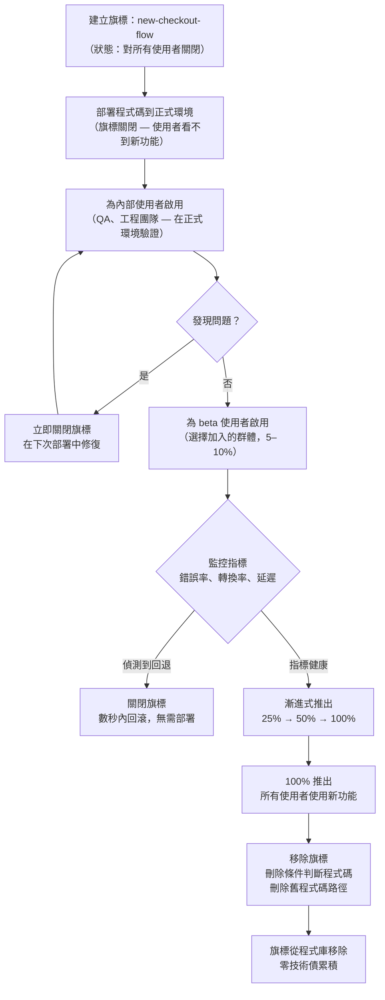

# 部署策略：金絲雀、藍綠部署與功能旗標

## 情境

部署是軟體開發生命週期中風險最高的時刻。在部署的瞬間，未經正式環境驗證的新程式碼，同時取代了所有使用者正在使用的舊程式碼。若新程式碼存在問題 — 效能回退、API 不相容、瀏覽器特定的 crash — 所有使用者都會同時受到影響。

傳統的部署策略透過縮短部署視窗來承擔這個風險：快速推送、觀察幾分鐘、若有問題就回滾。當問題能被快速偵測、快速回滾所涵蓋時，這個方法是可行的。然而，當回退是細微的、只在正式環境負載下才出現，或是回滾本身緩慢且有風險時，這個方法就會失效。

現代部署策略透過縮小「爆炸半徑（blast radius）」來降低風險。它不是從 0% 一口氣切換到 100%，而是允許有控制地逐步推進：新程式碼首先只抵達一小部分使用者，觀察指標，若指標健康才擴大覆蓋範圍。若出現問題，只有那一小部分使用者受到影響，回滾同樣只涉及那一小部分。

三種策略主導現代前端部署：

- **藍綠部署（Blue-green deployments）** — 同時維護兩套完整的正式環境；流量以單一的 atomic 操作從舊版（"blue"）切換到新版（"green"）；回滾就是切換回去
- **金絲雀部署（Canary deployments）** — 將新程式碼路由到一定比例的流量（通常從 1–5% 開始），監控回退情況，逐步將比例提高至 100%，或在發現問題時回滾
- **功能旗標（Feature flags）** — 程式碼部署給所有使用者，但在執行期被停用；功能依使用者群、地區或世代選擇性地啟用，無需任何部署

這三種策略並不互斥。成熟的部署 pipeline 會將三者結合：在基礎設施層用藍綠或金絲雀做流量分流，在已部署的程式碼內部用功能旗標做應用層的功能控制。

**核心思維轉變：已部署不等於已發布（deployed does not mean released）。**

部署是技術操作 — 將程式碼從 repository 移動到運行中的伺服器或 CDN。發布是商業操作 — 讓功能對使用者可見且可用。傳統部署將這兩件事耦合在一起。功能旗標將它們完全解耦：程式碼可以被部署（進入 repository、編譯進 bundle、運行在伺服器上），但尚未發布（藏在對所有使用者關閉的旗標後面）。這種分離讓團隊能夠持續合併程式碼而不暴露未完成的功能、依商業時機而非 CI 時機發布，以及在無需任何部署的情況下在數秒內停用某個功能。

**前端的優勢：**

前端部署在一個關鍵點上比後端簡單：前端是無狀態的。一個前端建置產出是一組靜態檔案。替換那些檔案就替換了應用程式。不需要資料庫遷移、沒有 session 狀態、沒有長連線需要 drain。這意味著 atomic swap（藍綠的核心機制）在前端本來就比後端更容易實作。Vercel 和 Netlify 等 CDN 平台預設就實作了藍綠：每次部署都是一個不可變的產出物，升級到正式環境只需切換一個路由指針。

---

## 原則

> **SHOULD** 對高風險功能使用 feature flag。旗標讓功能能在數秒內停用，無需任何部署，提供了任何回滾策略都無法在速度上匹敵的安全網。

> **SHOULD** 在建立 feature flag 時設定移除日期。超過其用途仍留在程式碼中的旗標，會成為永久性的條件分支，增加複雜度、阻礙重構，並讓人困惑哪條程式碼路徑才是正確的。

---

## 設計思維

### 為什麼藍綠是前端的自然模型

藍綠部署的原理是同時維護兩套完整且相同的正式環境。在任何時刻，一套環境（"blue"）服務 100% 的流量。新的部署在另一套環境（"green"）中被建置和驗證。當團隊準備好發布時，流量以一次 atomic 操作從 blue 切換到 green。若出現問題，切換回 blue 同樣迅速。

對前端應用程式而言，這直接對應到 CDN 平台的運作方式。Vercel、Netlify 和 Cloudflare Pages 都會無限期保留部署產出物。每次推送都會建立一個有唯一 URL 的不可變產出物。升級到正式環境是一次指針切換 — 平台更新正式環境域名指向哪個產出物。這是在平台層面實現的藍綠，無需任何額外設定。

實際含義：若你的前端部署在 Vercel 或 Netlify 上，你已經擁有藍綠部署。回滾是 `vercel promote`，或在 Netlify dashboard 點擊「Publish deploy」。前一個部署產出物仍然存在且健康；無需重新建置任何東西。

這與金絲雀部署有根本差異，金絲雀需要流量分流基礎設施。實作了 atomic deployment 的 CDN 平台，原生上並不支援在靜態網站的兩個版本之間分流流量 — 它們一次只將所有流量路由到一個版本。藍綠是預設；金絲雀需要額外工作。

### 為什麼金絲雀需要額外基礎設施

金絲雀部署將一定比例的流量路由到新版本，其餘流量路由到舊版本，兩者同時存在。對後端服務而言，這相對簡單：負載平衡器或 service mesh 按權重路由請求。對前端靜態檔案而言，情況更複雜。

載入金絲雀版本 `index.html` 的使用者，必須從同一個版本取得所有後續資源（JavaScript、CSS）。混合版本會破壞應用程式 — 新版 JavaScript 可能引用舊版部署中不存在的資源，或假設了新的 API 合約。這意味著前端的流量分流必須具備「黏性（sticky）」：一旦使用者被分配到金絲雀版本，其 session 期間的所有請求都必須前往金絲雀版本。

為前端實作黏性金絲雀需要以下之一：
- **Cloudflare Load Balancing** 搭配 session affinity — 讓同一使用者跨請求路由到同一 origin
- **Nginx upstream weights** 搭配 `ip_hash` 或 sticky cookie — 依使用者身份做一致性路由
- **Edge middleware**（Vercel Edge Config、Cloudflare Workers）— 在 edge 攔截請求，根據 cookie 或 header 套用路由邏輯

這些方案的維運複雜度不容小覷。對大多數前端團隊而言，功能旗標是更實際的替代方案，可以在不需要流量分流基礎設施的情況下，控制新功能對部分使用者的曝光。

### 為什麼 feature flag 是最強大的風險管理工具

Feature flag 是程式碼中的一個條件判斷：

```js
if (featureFlags.isEnabled('new-checkout-flow')) {
  return <NewCheckout />;
}
return <OldCheckout />;
```

這個條件判斷在執行期被評估，而非部署時。旗標的值 — true 或 false — 從外部服務（LaunchDarkly、Unleash、GrowthBook、Flagsmith）或設定儲存中取得。在 dashboard 中修改旗標的值，對新的頁面載入立即生效，無需任何部署。

這賦予了 feature flag 任何部署策略都無法匹敵的特性：

**瞬間停用。** 若在 `new-checkout-flow` 中發現 bug，在 dashboard 關閉旗標。在數秒內（最多一個頁面載入週期），所有使用者都恢復到舊版結帳流程。無需部署、無需回滾、無需 CI 執行。

**細粒度的目標對象。** 旗標可以依使用者 ID、使用者群、方案等級、地理區域、裝置類型，或評估上下文中的任何屬性來定向。這讓漸進式推出變得輕而易舉：先為內部使用者啟用，再為 beta 使用者啟用，再到 1% 的正式環境，再到 10%，最後到 100% — 每個步驟都在 dashboard 中設定，無需任何程式碼變更。

**部署與發布的分離。** 週二合併程式碼、週四部署、週五在行銷活動啟動後為 10% 使用者開啟旗標、接下來一週逐步擴大到 100%。技術時程和商業時程完全獨立。

**A/B 測試整合。** 大多數 feature flag 平台都包含實驗功能：使用者被分成對照組和實驗組，指標被追蹤，根據數據而非直覺選擇獲勝方案。

### 為什麼旗標債務是真實的工程問題

Feature flag 解決了發布新功能的即時風險，但帶來了長期問題：每個旗標都是程式碼中的一個分支。一個有 50 個活躍旗標的程式庫，有 50 個條件分支，每個都代表一個問題：哪條路徑是正確的，另一條路徑何時會被刪除？

從未被清理的旗標 — 因為功能成功上線後所有人都忘記了它的存在 — 變成了永久的複雜度。它們阻礙重構（你無法簡化有兩條路徑的程式碼）。它們造成混淆（新進工程師不知道哪條路徑在正式環境中是啟用的）。它們以技術債的形式累積。

解決之道很簡單：在建立旗標時設定移除日期，並將這個日期視為一等公民的任務。旗標移除意味著：確認功能已達到 100% 推出、從平台刪除旗標、從程式碼中移除條件判斷、刪除舊的程式碼路徑。

### 滾動部署如何融入這個架構

滾動部署（Rolling deployments）是逐步更新實例而非一次全部更新。對基於 Kubernetes 的後端而言，這是預設行為：使用 `RollingUpdate` 策略的 `Deployment` 物件一次替換一個 pod，確保一定比例的健康 pod 始終在服務流量。

對前端而言，滾動部署較不相關，因為前端部署是基於檔案而非基於實例的。沒有實例池需要 drain 和替換。等效概念是金絲雀部署中基於百分比的漸進式推出。

當應用程式有伺服器端渲染層（Vercel 上的 Next.js、Node.js 伺服器上的 Nuxt）時，滾動部署對前端變得相關 — 在這種情況下，渲染伺服器可以用 Kubernetes 風格的滾動策略更新，而靜態層（HTML shell）則透過 CDN 以 atomic 方式更新。

---

## 視覺

以下圖表展示了 feature flag 從建立到完整推出再到移除的完整生命週期。



---

## 範例

### 1. 在 React 中使用 GrowthBook 功能旗標

GrowthBook 是一個開源的 feature flag 與 A/B 測試平台。可以自行託管或使用 GrowthBook Cloud。

```tsx
// src/hooks/useFeatureFlag.ts
import { useFeatureIsOn } from '@growthbook/growthbook-react';

export function useFeatureFlag(flagKey: string): boolean {
  return useFeatureIsOn(flagKey);
}

// src/components/CheckoutPage.tsx
import { useFeatureFlag } from '../hooks/useFeatureFlag';
import { NewCheckout } from './NewCheckout';
import { OldCheckout } from './OldCheckout';

export function CheckoutPage() {
  const isNewCheckoutEnabled = useFeatureFlag('new-checkout-flow');

  return isNewCheckoutEnabled ? <NewCheckout /> : <OldCheckout />;
}

// src/main.tsx — GrowthBook provider 設定
import { GrowthBook, GrowthBookProvider } from '@growthbook/growthbook-react';

const gb = new GrowthBook({
  apiHost: 'https://cdn.growthbook.io',
  clientKey: import.meta.env.VITE_GROWTHBOOK_CLIENT_KEY,
  enableDevMode: import.meta.env.DEV,
  trackingCallback: (experiment, result) => {
    // 將實驗曝光事件送往分析工具
    analytics.track('Experiment Viewed', {
      experimentId: experiment.key,
      variationId: result.variationId,
    });
  },
});

// 從 GrowthBook CDN 載入旗標設定
await gb.loadFeatures();

// 設定使用者屬性以用於定向
gb.setAttributes({
  userId: currentUser.id,
  plan: currentUser.plan,            // 'free' | 'pro' | 'enterprise'
  country: currentUser.country,
  betaUser: currentUser.betaOptIn,
});

// 包裝應用程式
root.render(
  <GrowthBookProvider growthbook={gb}>
    <App />
  </GrowthBookProvider>
);
```

GrowthBook dashboard 旗標設定（概念示意）：
```json
{
  "key": "new-checkout-flow",
  "on": true,
  "rules": [
    {
      "condition": { "betaUser": true },
      "force": true
    },
    {
      "condition": { "plan": "enterprise" },
      "force": true
    },
    {
      "coverage": 0.10,
      "hashAttribute": "userId",
      "force": true
    }
  ]
}
```

此設定為所有 beta 使用者、所有企業方案使用者，以及其他使用者中穩定的 10% 隨機樣本啟用新結帳流程（依 `userId` 取樣，確保同一使用者始終得到相同體驗）。

### 2. OpenFeature SDK — 與供應商無關的 feature flag

OpenFeature 是 feature flag SDK 的開放標準。相同的應用程式程式碼可以與任何相容供應商（LaunchDarkly、Unleash、GrowthBook、Flagsmith、OpenFeature Cloud）搭配使用，無需修改。

```ts
// src/featureFlags.ts
import {
  OpenFeature,
  InMemoryProvider,
  EvaluationContext,
} from '@openfeature/web-sdk';

// 註冊供應商。可以換成任何 OpenFeature 相容的供應商，
// 無需修改應用程式程式碼。
//
// 正式環境：使用 LaunchDarkly、Unleash 或 Flagsmith 供應商。
// 測試環境：使用 InMemoryProvider 搭配靜態旗標值。
OpenFeature.setProvider(
  new InMemoryProvider({
    'new-checkout-flow': {
      defaultVariant: 'off',
      variants: { on: true, off: false },
      disabled: false,
    },
  })
);

// 設定使用者上下文以用於旗標評估
OpenFeature.setContext({
  targetingKey: currentUser.id,
  plan: currentUser.plan,
  betaUser: currentUser.betaOptIn,
} satisfies EvaluationContext);

// 在元件中使用
import { useFlag } from '@openfeature/react-sdk';

export function CheckoutPage() {
  // 為當前上下文評估 'new-checkout-flow' 旗標
  const { value: isNewCheckout } = useFlag('new-checkout-flow', false);

  return isNewCheckout ? <NewCheckout /> : <OldCheckout />;
}
```

在正式環境切換至 LaunchDarkly，只需修改供應商註冊：

```ts
import { init } from 'launchdarkly-js-client-sdk';
import { LaunchDarklyClientSideProvider } from '@launchdarkly/openfeature-web-provider';

const ldClient = init(import.meta.env.VITE_LD_CLIENT_KEY, {
  key: currentUser.id,
  custom: { plan: currentUser.plan, betaUser: currentUser.betaOptIn },
});
await ldClient.waitForInitialization();

OpenFeature.setProvider(new LaunchDarklyClientSideProvider(ldClient));
// 所有使用 OpenFeature hook 的應用程式程式碼無需任何變更。
```

### 3. 透過 Vercel CLI 執行藍綠切換

在 Vercel 上，每次部署都是有自己 URL 的不可變產出物。將特定部署升級到正式環境只需一個指令。

```bash
# 列出最近的部署及其 URL 與狀態
vercel ls --scope my-team

# 輸出範例：
#   deployment-abc123.vercel.app   READY   2026-04-10 14:00 （目前正式環境）
#   deployment-def456.vercel.app   READY   2026-04-10 15:30 （新版本）

# 將新版部署升級到正式環境（藍綠切換）
vercel promote deployment-def456.vercel.app --scope my-team

# 若需回滾：升級前一個部署
vercel promote deployment-abc123.vercel.app --scope my-team
```

在 Netlify 上：
```bash
# 列出部署
netlify api listSiteDeploys --data '{"site_id":"YOUR_SITE_ID"}'

# 發布（升級）特定部署
netlify api publishDeploy --data '{"deploy_id":"DEPLOY_ID"}'
```

在 Cloudflare Pages 上：
```bash
# 列出部署
wrangler pages deployment list --project-name my-frontend

# 回滾到特定部署
wrangler pages deployment rollback DEPLOYMENT_ID --project-name my-frontend
```

三種情況下切換都是 atomic 的：使用者要麼看到舊版本，要麼看到新版本，絕不會看到混合版本。這是藍綠的決定性特性。

### 4. 使用 Cloudflare Load Balancing 進行金絲雀流量分流

Cloudflare Load Balancing 允許在兩個 origin 之間進行加權路由。當使用自訂伺服器或兩個獨立的 Cloudflare Pages 部署（透過不同 hostname 公開）時，這可以為前端實作金絲雀。

```bash
# 為穩定版（blue）建立 pool
curl -X POST "https://api.cloudflare.com/client/v4/accounts/$ACCOUNT_ID/load_balancers/pools" \
  -H "Authorization: Bearer $CF_API_TOKEN" \
  -H "Content-Type: application/json" \
  -d '{
    "name": "frontend-blue",
    "origins": [{"name": "blue", "address": "blue.example.com", "weight": 1, "enabled": true}],
    "minimum_origins": 1
  }'

# 為金絲雀版（green）建立 pool
curl -X POST "https://api.cloudflare.com/client/v4/accounts/$ACCOUNT_ID/load_balancers/pools" \
  -H "Authorization: Bearer $CF_API_TOKEN" \
  -H "Content-Type: application/json" \
  -d '{
    "name": "frontend-green",
    "origins": [{"name": "green", "address": "green.example.com", "weight": 1, "enabled": true}],
    "minimum_origins": 1
  }'

# 建立 load balancer：95% 路由至 blue，5% 路由至 green
curl -X POST "https://api.cloudflare.com/client/v4/zones/$ZONE_ID/load_balancers" \
  -H "Authorization: Bearer $CF_API_TOKEN" \
  -H "Content-Type: application/json" \
  -d '{
    "name": "app.example.com",
    "fallback_pool": "BLUE_POOL_ID",
    "default_pools": ["BLUE_POOL_ID"],
    "random_steering": {
      "pool_weights": {
        "BLUE_POOL_ID": 0.95,
        "GREEN_POOL_ID": 0.05
      },
      "default_weight": 0.95
    },
    "session_affinity": "cookie",
    "session_affinity_ttl": 1800
  }'
```

`session_affinity: "cookie"` 確保路由到 green（金絲雀）版本的使用者，在整個 session 期間都保持在 green — 避免了設計思維中描述的混合版本問題。

推進金絲雀，更新 pool 權重：
```bash
# 推進至 25% 金絲雀
# 更新 random_steering.pool_weights：BLUE = 0.75，GREEN = 0.25

# 完整推出：所有流量路由至 green，退役 blue pool
# 更新 default_pools 為 ["GREEN_POOL_ID"]
```

自行託管環境的 Nginx 方案：
```nginx
upstream frontend_blue {
    server blue.internal:3000;
}

upstream frontend_green {
    server green.internal:3000;
}

# 金絲雀分流：5% 到 green，95% 到 blue
split_clients "$remote_addr$http_user_agent" $upstream_pool {
    5%   frontend_green;
    *    frontend_blue;
}

server {
    listen 443 ssl;
    server_name app.example.com;

    location / {
        proxy_pass http://$upstream_pool;
    }
}
```

### 5. 建立旗標時追蹤移除日期

每個旗標都應在建立時設定移除日期。這可以在程式碼註解、專案管理工具或旗標平台本身中追蹤。

```ts
// src/flags/index.ts
//
// Feature flag 登錄表
// 每個條目記錄：用途、負責人、建立日期，以及「移除日期」。
// 移除日期是一等公民的承諾，不是事後才加的。
//
// 當旗標達到 100% 推出時：
//   1. 在旗標平台 dashboard 確認 100% 推出
//   2. 從程式碼中移除旗標評估
//   3. 刪除舊的（停用的）程式碼路徑
//   4. 從此登錄表和平台中移除旗標
//   5. 在專案追蹤器中關閉清理任務
//
export const FLAG_REGISTRY = {
  'new-checkout-flow': {
    description: '重新設計的結帳 UX，採用單頁流程',
    owner: 'team-commerce',
    created: '2026-04-10',
    removalDate: '2026-05-31', // TODO: 完整推出後移除 — 參見 JIRA-1234
  },
  'ai-search-suggestions': {
    description: 'AI 驅動的 header 搜尋自動完成',
    owner: 'team-search',
    created: '2026-03-01',
    removalDate: '2026-04-30', // TODO: 完整推出後移除 — 參見 JIRA-1189
  },
} as const;

export type FlagKey = keyof typeof FLAG_REGISTRY;
```

在 CI 中，自訂 lint 規則或檢查腳本可以在旗標移除日期過期時發出警告：

```ts
// scripts/check-flag-debt.ts
import { FLAG_REGISTRY } from '../src/flags/index';

const today = new Date();
const overdue: string[] = [];

for (const [key, meta] of Object.entries(FLAG_REGISTRY)) {
  if (new Date(meta.removalDate) < today) {
    overdue.push(`${key} (到期日 ${meta.removalDate}，負責人：${meta.owner})`);
  }
}

if (overdue.length > 0) {
  console.error('逾期 Feature Flag — 請移除或延長移除日期：');
  overdue.forEach(flag => console.error('  ' + flag));
  process.exit(1);
}

console.log('所有 feature flag 均在預定移除日期內。');
```

加入 CI 防止旗標債務悄悄累積：
```yaml
# .github/workflows/ci.yml
- name: 檢查 feature flag 債務
  run: npx tsx scripts/check-flag-debt.ts
```

### 6. Feature flag 工具比較

| 工具 | 託管方式 | 開源 | SDK 語言數 | 定向功能 | 實驗功能 | 免費方案 |
|---|---|---|---|---|---|---|
| **LaunchDarkly** | SaaS | 否 | 30+ | 進階（規則、分群） | 完整 A/B | 否（僅付費）|
| **Unleash** | 自行託管或 Cloud | 是 | 20+ | 策略、漸進式推出 | 基本 | 是（自行託管）|
| **GrowthBook** | 自行託管或 Cloud | 是 | 15+ | 條件、命名空間 | 完整 A/B | 是 |
| **Flagsmith** | 自行託管或 Cloud | 是 | 15+ | 分群、百分比 | 基本 | 是 |
| **OpenFeature** | 標準 SDK 規範 | 是 | 10+ | 依供應商而定 | 依供應商而定 | 不適用（標準） |

OpenFeature 不是旗標平台，而是標準的 SDK 介面。使用 OpenFeature hook，不修改應用程式程式碼即可切換供應商。這防止了供應商鎖定，也讓測試更容易（在測試中使用 `InMemoryProvider` 搭配靜態旗標值）。

---

## 常見錯誤

**每次變更都同時部署和發布。**
沒有 feature flag 的情況下，每個合併的 PR 都立即對所有使用者可見。高風險的變更 — 結帳重新設計、搜尋改版、定價頁變更 — 應合併在旗標後面，獨立於部署之外進行發布。將部署和發布視為同一件事，等於放棄了控制曝光的能力。

**金絲雀部署沒有設定 session affinity。**
在同一個 session 中將使用者路由到新版本，再路由到舊版本，會破壞應用程式。JavaScript bundle、API 版本和應用程式狀態在不同部署之間不可互換。實作金絲雀分流時，務必設定黏性 session。

**永遠不移除 feature flag。**
一個在達到 100% 推出後仍留在程式庫中的旗標，是多了額外步驟的廢棄程式碼。它保護的程式碼路徑不再是條件式的 — 它始終是啟用的 — 但條件式判斷仍然存在，遮蔽了這個事實。在建立旗標時設定移除任務，而不是事後才想到。

**伺服器端和客戶端的旗標評估不一致。**
在伺服器端渲染的應用程式中，伺服器和客戶端的旗標評估必須一致。若伺服器渲染新結帳（旗標開啟），但客戶端在 mount 時重新評估旗標並渲染舊結帳（評估結果不同），應用程式會出現內容閃爍。確保旗標評估上下文從伺服器正確 hydrate 到客戶端。

**將旗標平台中斷視為硬性失敗。**
Feature flag SDK 從遠端服務取得旗標定義。若該服務不可用，SDK 應 fallback 到本地快取的值或安全的預設值，而非拋出例外並讓應用程式 crash。評估旗標時，務必定義安全的預設值。大多數 SDK 將其作為評估呼叫的第二個參數。

**藍綠部署搭配不向後相容的資料庫 migration。**
對有資料庫的應用程式而言，藍綠要求新版本和舊版本能夠同時在相同的資料庫 schema 上運作。移除舊版本正在讀取的欄位的 migration，會破壞回滾能力。務必使用 expand-contract migration 模式：先新增欄位（expand）、遷移資料、部署新版應用程式，然後只有在舊版本完全退役後才移除舊欄位（contract）。

---

## 相關 FEE

- [FEE-1500：CI/CD Pipeline 概覽](./1500.md) — 部署策略在其中運作的完整 pipeline 情境
- [FEE-1501：GitHub Actions for Frontend](./1501.md) — GitHub Actions 作為金絲雀漸進推進和回滾自動化的觸發點
- [FEE-1504：正式環境部署：靜態 Hosting 與 CDN](./1504.md) — atomic CDN 部署如何為靜態網站預設實作藍綠

---

## 參考資料

- Martin Fowler — [Feature Toggles (aka Feature Flags)](https://martinfowler.com/articles/feature-toggles.html)：feature flag 模式、類型與生命週期管理的權威參考，包含旗標債務問題的深入討論
- OpenFeature Specification — [openfeature.dev](https://openfeature.dev)：feature flag SDK 的開放標準；供應商清單、SDK 文件，以及與供應商無關的旗標評估規範
- GrowthBook Documentation — [Feature Flags](https://docs.growthbook.io/features/feature-flag-overview)：開源 feature flag 與 A/B 測試平台；涵蓋定向規則、漸進式推出和實驗設定
- Cloudflare Documentation — [Load Balancing](https://developers.cloudflare.com/load-balancing/)：加權 pool 路由、session affinity 和健康檢查，用於在 edge 實作金絲雀流量分流
- Unleash Documentation — [Activation Strategies](https://docs.getunleash.io/reference/activation-strategies)：開源 Unleash 旗標平台中的漸進式推出、使用者 ID 定向和自訂策略
- Vercel Documentation — [Deployments](https://vercel.com/docs/deployments/overview)：不可變部署產出物與 `vercel promote` 指令，用於藍綠正式環境切換
