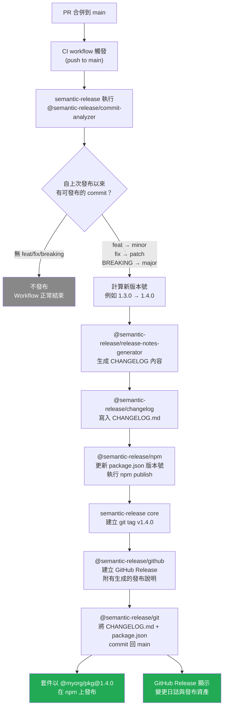

# 發布自動化：語義化版本控制與變更日誌

## 背景脈絡

發布一個函式庫或應用程式的新版本，過去需要開發者做出幾個手動決策：這是 bug 修復還是新功能？是否有破壞性變更？CHANGELOG 要寫什麼？版本號應該用什麼？這些決策往往缺乏一致性，經常在時間壓力下草草完成，而 CHANGELOG 更是事後補寫的事後諸葛，內容不完整，對需要了解變更內容的使用者毫無幫助。

Conventional Commits 從根本改變了這一切。透過在撰寫 commit 的當下，將語義意圖編碼進 commit 訊息，整個 commit 歷史就變成了機器可讀的資料。工具程式接著可以分析 commit 日誌，並確定性地計算出下一個版本號——不需要任何人為決策。CHANGELOG 從相同的資料自動生成。git tag、GitHub Release 和 npm publish 全都自動跟著 tag 進行。

這不只是為了自動化而自動化。它在整個團隊中強制執行紀律：每一個有意義的變更都被分類，分類結果驅動版本號，而版本號向使用者傳達相容性保證。整合你函式庫的下游團隊可以清楚知道 `2.0.0` 代表什麼（破壞性變更，需閱讀遷移指南），以及 `1.4.2` 代表什麼（僅 patch 修復，可安全升級）。版本號成為一份契約，而不是一個猜測。

這個領域由兩個工具主導：`semantic-release` 用於單一套件儲存庫和應用程式，`@changesets/cli` 用於 monorepo。本文涵蓋兩者，解釋各自的適用時機，並提供可直接用於生產環境的 workflow 範例。

---

## 原則

> **SHOULD** 對所有 commit 訊息使用 Conventional Commits 格式。`type(scope): description` 格式是機器可讀的輸入，讓確定性的版本計算和自動化 CHANGELOG 生成成為可能。

> **SHOULD** 自動化版本號升級和 CHANGELOG 生成，而非手動進行。單一套件儲存庫和應用程式使用 `semantic-release`；monorepo 或有多個獨立版本套件的函式庫使用 `@changesets/cli`。

> **SHOULD** 只從 CI 發布套件，絕不從開發者本地機器發布。CI 發布的套件具有可重現性、可稽核性，且不受開發者環境差異的影響。

> **MUST NOT** 在自動化工具就位後，手動編輯 `package.json` 中的版本欄位或手寫 CHANGELOG 條目。手動編輯將被工具覆蓋，並造成令人困惑的衝突。

> **SHOULD** 使用 publish-on-tag 而非 publish-on-merge。明確的 git tag 代表刻意的發布意圖。在每次合併到 `main` 時發布，會讓每個 commit 都成為潛在的發布，並消除批次處理變更的能力。

---

## 設計思維

### 為何 Conventional Commits 能解鎖自動化

像 `更新了某個東西` 這樣的 commit 訊息，對於在情境中閱讀的人類來說有意義，但對機器而言是不透明的。像 `fix(auth): handle expired token in refresh flow` 這樣的訊息則包含了結構化資訊：type 是 `fix`（向後相容的 bug 修復），scope 是 `auth`，description 是精確的。

`semantic-release` 分析這些結構化訊息的清單，並套用確定性規則集：任何 type 為 `feat` 的 commit 觸發 minor 版本升級；任何 type 為 `fix` 或 `perf` 的 commit 觸發 patch 升級（注意：`refactor` 觸發 patch 版本是上方 `.releaserc.json` 中的自訂規則，非 semantic-release 預設行為）；任何帶有 `BREAKING CHANGE:` footer 或 type 後有 `!` 的 commit 觸發 major 升級。自上次發布以來所有 commit 中，適用的最高等級升級決定新版本號。沒有任何歧義，沒有委員會決策，沒有「這應該是 1.5 還是 2.0？」的爭論。commit 訊息在變更當下就已做出決定。

這也正確地分配了責任。撰寫破壞性變更的開發者，正是標記 `feat!:` 或加入 `BREAKING CHANGE:` footer 的人。他們擁有最多的上下文。發布工具只是讀取他們的意圖。

### 為何 changesets 在 monorepo 中優於 semantic-release

在一個擁有 `@myorg/button`、`@myorg/input` 和 `@myorg/theme` 套件的 monorepo 中，像 `feat(button): add loading state` 這樣的單一 commit 影響 `@myorg/button`，但對 `@myorg/input` 或 `@myorg/theme` 沒有任何影響。`semantic-release` 針對單一發布分支分析整個 commit 日誌——它沒有內建「哪些 commit 影響哪個套件」的概念。若不進行大量客製化，這使得它並不適合 monorepo。

Changesets 以不同的方式解決這個問題。當開發者進行變更時，他們也執行 `pnpm changeset` 並以互動方式回答：「這影響哪些套件？是 major、minor 還是 patch？CHANGELOG 中應該出現什麼？」答案被寫入 `.changeset/` 中的一個小型 markdown 檔案。這個檔案與程式碼變更一起被 commit，並在 pull request 中接受審查。

changeset 檔案的權威性是 commit 訊息本身無法達到的：它是由作者撰寫的，作者明確知道哪些套件受到影響以及影響程度。monorepo 中的單一 commit 可能觸及共用工具程式，並將變更級聯到五個套件——changeset 明確捕捉了這一點，而基於 commit 的分析則需要複雜的依賴圖遍歷才能推斷出來。

當發布時機到來，`pnpm changeset version` 消耗所有待處理的 changeset 檔案，按最高宣告嚴重性升級每個套件，並用 changeset 檔案中的描述更新每個套件的 CHANGELOG。`.changeset/*.md` 檔案隨後被刪除。後續的 `pnpm changeset publish` 發布所有具有新版本的套件。Changesets GitHub Action（`changesets/action`）在 `main` 分支上維護一個開放的 PR，顯示待處理的版本升級——即「Version Packages」PR。合併這個 PR 就是發布。

### 為何 CHANGELOG 重要

你函式庫的使用者——內部團隊、開源使用者——需要評估每次升級：「這樣升級安全嗎？有什麼變更？我需要遷移任何東西嗎？」若沒有 CHANGELOG，他們只能閱讀 git commit 歷史，而那充斥著雜訊且是為進行變更的開發者而寫的，而非為評估升級的消費者而寫。有了生成的 CHANGELOG，每個發布都有一份按類型分組的使用者可見變更精選清單，並附有回到原始 commit 的連結。

自動化 CHANGELOG 生成使這一切無需額外成本。commit 訊息（或 changeset 描述）已經寫好了；工具將它們組裝成格式化文件並 commit 結果。不再有「記得更新 changelog」的步驟，不再有 changelog 偏差，不再有未附說明文件就發布的版本。

### 為何 publish-on-tag 優於 publish-on-merge

在每次合併到 `main` 時發布，意味著每次功能、修復或重構落地後都會執行發布步驟。這很少是理想的：你可能想在發布前累積幾個變更，你可能正處於尚未準備好對外公開的功能開發中途，或者你可能只是想讓人工審閱待處理的發布後再讓它上線。

git tag 代表明確、刻意的發布意圖。使用 `semantic-release` 時，版本升級和 tagging 在 commit 分析後自動發生——但仍然只發生一次，在 workflow 中的受控時間點。使用 changesets 時，tagging 發生在「Version Packages」PR 合併的時候——這是一個人為動作，表示「這批變更已準備好發布」。

Publish-on-tag 也建立了穩定的稽核軌跡：每個 npm 版本都對應一個精確的 git tag 和一個精確的 GitHub Release。「npm 套件中包含什麼」與「原始碼中有什麼」之間的關聯是明確的。

---

## 視覺化

以下圖表展示了從合併 pull request 到發布 npm 套件和 GitHub Release 的完整 `semantic-release` 流程。



---

## 範例

### 1. Conventional Commits 格式參考

```bash
# Patch 升級——向後相容的 bug 修復
fix(auth): handle expired token in refresh flow

# Minor 升級——新的向後相容功能
feat(table): add column resizing support

# Minor 升級帶 scope——scope 是選擇性的但很有用
feat: support dark mode via CSS custom properties

# Major 升級——以 '!' 表示破壞性變更
feat(api)!: replace callback API with Promise-based interface

# Major 升級——以 footer 表示破壞性變更
feat(router): add nested route support

BREAKING CHANGE: The `routes` config key is renamed to `children`.
Update all route definitions that use `routes:` to use `children:`.

# 不升級版本——維護類 commit
chore: upgrade eslint to v9
docs: update contributing guide
ci: add dependency audit step
test: add coverage for edge cases in tokenizer
refactor(utils): extract date formatting helpers
style: apply prettier formatting to all files
```

### 2. semantic-release：設定與 workflow

安裝插件：

```bash
pnpm add -D semantic-release \
  @semantic-release/commit-analyzer \
  @semantic-release/release-notes-generator \
  @semantic-release/changelog \
  @semantic-release/npm \
  @semantic-release/github \
  @semantic-release/git
```

透過儲存庫根目錄的 `.releaserc.json` 進行設定：

```json
{
  "branches": ["main"],
  "plugins": [
    [
      "@semantic-release/commit-analyzer",
      {
        "preset": "conventionalcommits",
        "releaseRules": [
          { "type": "feat", "release": "minor" },
          { "type": "fix", "release": "patch" },
          { "type": "perf", "release": "patch" },
          { "type": "refactor", "release": "patch" },
          { "type": "docs", "release": false },
          { "type": "chore", "release": false },
          { "type": "ci", "release": false },
          { "type": "test", "release": false },
          { "breaking": true, "release": "major" }
        ]
      }
    ],
    [
      "@semantic-release/release-notes-generator",
      {
        "preset": "conventionalcommits",
        "presetConfig": {
          "types": [
            { "type": "feat", "section": "Features" },
            { "type": "fix", "section": "Bug Fixes" },
            { "type": "perf", "section": "Performance Improvements" },
            { "type": "refactor", "section": "Refactoring" }
          ]
        }
      }
    ],
    [
      "@semantic-release/changelog",
      {
        "changelogFile": "CHANGELOG.md"
      }
    ],
    "@semantic-release/npm",
    "@semantic-release/github",
    [
      "@semantic-release/git",
      {
        "assets": ["CHANGELOG.md", "package.json"],
        "message": "chore(release): ${nextRelease.version} [skip ci]\n\n${nextRelease.notes}"
      }
    ]
  ]
}
```

對應的 GitHub Actions workflow：

```yaml
# .github/workflows/release.yml

name: Release

on:
  push:
    branches:
      - main

permissions:
  contents: write       # 推送 release commit 和 tag
  issues: write         # 在發布時關閉 issue（透過 @semantic-release/github）
  pull-requests: write  # 對包含在發布中的 PR 留言
  id-token: write       # 用於 npm provenance（選擇性但建議啟用）

jobs:
  release:
    name: Semantic release
    runs-on: ubuntu-latest
    steps:
      - uses: actions/checkout@v4
        with:
          # 取得完整歷史——semantic-release 需要讀取自上次 release tag
          # 以來的所有 commit，以確定下一個版本。
          fetch-depth: 0

      - uses: pnpm/action-setup@v4
        with:
          version: 9

      - uses: actions/setup-node@v4
        with:
          node-version: 20
          registry-url: 'https://registry.npmjs.org'

      - name: Install dependencies
        run: pnpm install --frozen-lockfile

      - name: Build
        run: pnpm build

      - name: Release
        run: pnpm exec semantic-release
        env:
          GITHUB_TOKEN: ${{ secrets.GITHUB_TOKEN }}
          NODE_AUTH_TOKEN: ${{ secrets.NPM_TOKEN }}
```

重點說明：
- `fetch-depth: 0` 是必要的。若不設定，`actions/checkout` 只會做淺層 clone，`semantic-release` 就無法看到用於確定 commit 範圍的前次 release tag。
- `GITHUB_TOKEN` 是自動提供的 token。`NPM_TOKEN` 必須作為儲存庫 secret 新增（在 npmjs.com → Access Tokens → Automation 類型生成）。
- release commit 訊息範本中的 `[skip ci]` 防止無限迴圈：`@semantic-release/git` 推送的 commit 會觸發 push 事件，但 `[skip ci]` 告訴 GitHub Actions 跳過該次執行。

### 3. Changesets：monorepo 設定與 workflow

在 monorepo 根目錄初始化 Changesets：

```bash
pnpm changeset init
```

這會建立 `.changeset/` 目錄和 `config.json`：

```json
// .changeset/config.json
{
  "$schema": "https://unpkg.com/@changesets/config@3.0.0/schema.json",
  "changelog": "@changesets/cli/changelog",
  "commit": false,
  "fixed": [],
  "linked": [],
  "access": "public",
  "baseBranch": "main",
  "updateInternalDependencies": "patch",
  "ignore": []
}
```

當開發者進行影響一個或多個套件的變更時，他們執行互動式提示：

```bash
pnpm changeset
```

```
? Which packages would you like to include?
  ◉ @myorg/button
  ○ @myorg/input
  ○ @myorg/theme

? Which packages should have a major bump?
  (none)

? Which packages should have a minor bump?
  ◉ @myorg/button

? Please enter a summary for this change:
  Add loading state to Button component
```

這會建立類似 `.changeset/witty-eagles-fly.md` 的檔案：

```markdown
---
"@myorg/button": minor
---

Add loading state to Button component. Pass `loading={true}` to display a spinner and disable interaction during async operations.
```

這個檔案與程式碼變更一起被 commit，並在 pull request 中接受審查。描述是為使用者而寫的，不是為實作者。

**Changesets GitHub Action——「Version Packages」PR bot：**

```yaml
# .github/workflows/release.yml

name: Release

on:
  push:
    branches:
      - main

permissions:
  contents: write
  pull-requests: write

jobs:
  release:
    name: 建立 release PR 或發布
    runs-on: ubuntu-latest
    steps:
      - uses: actions/checkout@v4

      - uses: pnpm/action-setup@v4
        with:
          version: 9

      - uses: actions/setup-node@v4
        with:
          node-version: 20
          registry-url: 'https://registry.npmjs.org'

      - name: Install dependencies
        run: pnpm install --frozen-lockfile

      - name: Build
        run: pnpm build

      - name: 建立 release PR 或發布到 npm
        uses: changesets/action@v1
        with:
          # 當 changeset 檔案存在時：開啟或更新 Version Packages PR
          # 當 Version Packages PR 被合併時：發布所有已變更的套件
          publish: pnpm changeset publish
          version: pnpm changeset version
          title: "chore: version packages"
          commit: "chore: version packages"
        env:
          GITHUB_TOKEN: ${{ secrets.GITHUB_TOKEN }}
          NODE_AUTH_TOKEN: ${{ secrets.NPM_TOKEN }}
```

`changesets/action` bot 維護一個名為「chore: version packages」的單一開放 PR，它會累積所有待處理的 changeset。PR body 顯示每個套件將升級多少版本，以及每個 CHANGELOG 中會出現什麼內容。當這個 PR 被合併後，版本控制已由合併本身完成——PR 分支已執行過 `changeset version`，產生了升級後的 `package.json` 和 CHANGELOG 條目。action 接著只執行 `pnpm changeset publish`，它會：

1. 將所有在 `package.json` 中有新版本但尚未發布到 npm 的套件發布出去
2. 為每個發布的套件建立 git tag（例如 `@myorg/button@2.1.0`）
3. 為每個 tag 建立 GitHub Release

### 4. 從 CI 使用 `NODE_AUTH_TOKEN` 執行 npm publish

當使用帶有 `registry-url` 的 `actions/setup-node` 時，action 會建立一個從 `NODE_AUTH_TOKEN` 環境變數讀取認證 token 的 `.npmrc` 檔案。這意味著你不需要手動設定 `.npmrc`——只需設定環境變數：

```yaml
- uses: actions/setup-node@v4
  with:
    node-version: 20
    registry-url: 'https://registry.npmjs.org'  # 或私有 registry URL

- name: Publish
  run: npm publish --access public
  env:
    NODE_AUTH_TOKEN: ${{ secrets.NPM_TOKEN }}
```

對於私有 registry（GitHub Packages）：

```yaml
- uses: actions/setup-node@v4
  with:
    node-version: 20
    registry-url: 'https://npm.pkg.github.com'
    scope: '@myorg'

- name: Publish
  run: npm publish
  env:
    NODE_AUTH_TOKEN: ${{ secrets.GITHUB_TOKEN }}
```

### 5. GitHub Releases——自動 vs. 手動

使用 `semantic-release` 時，GitHub Releases 由 `@semantic-release/github` 插件自動建立。每個 release 都關聯到新的 git tag，並填入生成的發布說明。

使用 changesets 時，GitHub Releases 由 `changesets/action` bot 在發布時建立。每個套件都會有自己的 GitHub Release，標記為 `@myorg/package@x.y.z`。

### 6. 選擇 semantic-release 與 changesets

| 考量標準 | semantic-release | changesets |
|---|---|---|
| 儲存庫類型 | 單一套件 | Monorepo / 多套件 |
| 版本輸入來源 | commit 訊息類型 | 明確的 changeset 檔案 |
| 作者參與程度 | 無（全自動） | 作者在 PR 時建立 changeset |
| CHANGELOG 品質 | 良好（來自 commit 訊息） | 優秀（為使用者而寫） |
| 跨套件協調 | 有限 | 內建支援 |
| 最適合 | 應用程式、單一函式庫 | 元件函式庫、設計系統、SDK |

---

## 常見錯誤

**在 CI 中未取得完整 git 歷史。**
`semantic-release` 和 changesets 都需要讀取 git tag 和 commit 歷史，以確定自上次發布以來有什麼變更。使用預設的 `actions/checkout`（`fetch-depth: 1`，淺層 clone）意味著工具無法看到前次 release tag。在執行發布工具的 workflow 中，一律設定 `fetch-depth: 0`。

**對功能用 `fix:` 而對任何重要事項用 `feat:`。**
commit type 是版本計算的輸入。無論改變感覺有多重大，`feat:` 觸發 minor 升級，`fix:` 觸發 patch 升級。鬆散地使用這些類型——「我叫它 `feat:` 因為這是個大 PR」——會產生不正確的版本號。向團隊灌輸語義：`feat:` 表示向使用者公開的新能力；`fix:` 表示糾正現有行為。

**在 commit footer 中忘記 `BREAKING CHANGE:`。**
沒有 `BREAKING CHANGE:` footer（或 `!` 後綴）的破壞性變更，將被分析為常規的 `feat:` 或 `fix:`，只觸發 minor 或 patch 升級。major 版本不會遞增，而升級的使用者將遭遇意外的中斷。在合併任何移除或重命名公開 API 的 PR 之前，請驗證 commit 包含了破壞性變更標記。

**從開發者本地機器發布。**
本地發布會繞過 CI 檢查，使用開發者的本地建置環境，不可重現，且建立的套件無法像 CI 建置的套件那樣追溯到特定的 git commit。一旦自動化發布就位，就撤銷對套件的個人 npm 發布權限，並要求所有發布都通過 CI workflow 進行。

**對 release commit 未跳過 CI。**
`@semantic-release/git` 會將一個 commit 推送回預設分支（帶有更新的 `CHANGELOG.md` 和 `package.json`）。如果 workflow 在每次推送到該分支時觸發，且 release commit 不包含 `[skip ci]`，release workflow 將再次在 release commit 上執行——發現 tag 之後沒有新的可發布 commit——並無害地退出，但浪費了 CI 時間。在 `.releaserc.json` 的 release commit 訊息範本中加入 `[skip ci]`。

**開啟「Version Packages」PR 後手動發布。**
使用 changesets 時，`changesets/action` bot 處理完整的發布週期。在合併 bot 的 PR 後在本地手動執行 `pnpm changeset publish`，可能導致重複發布或使用錯誤的認證上下文發布。讓 bot 來做發布。

**在 PR review 中忽略 changesets。**
隨 PR commit 的 changeset 檔案是變更的一部分——它描述了對使用者可見的影響。審查者應該閱讀它：版本升級合適嗎？CHANGELOG 描述對使用者來說準確且有用嗎？一個將破壞性變更標記為「minor」的 changeset，將導致 minor 版本升級而不是 major 升級。

**在 monorepo 中未使用 workspace 插件就使用 semantic-release。**
`semantic-release` 原生不理解 pnpm 或 npm workspaces。在沒有專門插件的情況下在 monorepo 中使用它，通常會導致所有套件基於整個 commit 歷史一起版本控制，這違背了獨立套件版本控制的目的。Monorepo 請使用 changesets。

---

## 相關 FEE

- [FEE-1500: CI/CD 與部署概覽](1500.md) — 類別概覽與 pipeline 思維模型
- [FEE-1501: GitHub Actions 用於前端](1501.md) — GitHub Actions workflow 結構；發布 workflow 建立於其上的基礎
- [FEE-804: 套件管理](../Build%20Tooling%20and%20Module%20Systems/804.md) — npm/pnpm 套件管理、lockfile 與 npm registry
- [FEE-805: Monorepos](../Build%20Tooling%20and%20Module%20Systems/805.md) — monorepo 工具與 workspace 設定；changesets 與 pnpm workspaces 直接整合

---

## 參考資料

- [Conventional Commits 規範](https://www.conventionalcommits.org/en/v1.0.0/)：`type(scope): description` commit 訊息格式的完整規範，包括 major/minor/patch 對應規則和破壞性變更語法
- [semantic-release 文件](https://semantic-release.gitbook.io/semantic-release/)：官方文件，涵蓋插件架構、設定、CI 環境變數和完整的發布生命週期
- [Changesets 文件 — changesets/changesets on GitHub](https://github.com/changesets/changesets/blob/main/docs/intro-to-using-changesets.md)：changesets workflow、changeset 檔案格式和 Version Packages PR 模式的權威指南
- [changesets/action — GitHub Marketplace](https://github.com/marketplace/actions/changesets-action)：Changesets bot 的官方 GitHub Action；說明 `publish`、`version`、`title` 和 `commit` 輸入及其管理的 workflow
- [語義化版本控制 2.0.0](https://semver.org/)：定義 major、minor 和 patch 版本變更構成要件的 semver 規範，以及每種變更相關的相容性保證
- [發布 Node.js 套件 — GitHub Docs](https://docs.github.com/en/actions/publishing-packages/publishing-nodejs-packages)：從 GitHub Actions 執行 npm publish 的官方 GitHub 文件，包括 `NODE_AUTH_TOKEN`、`registry-url` 和 GitHub Packages 設定
