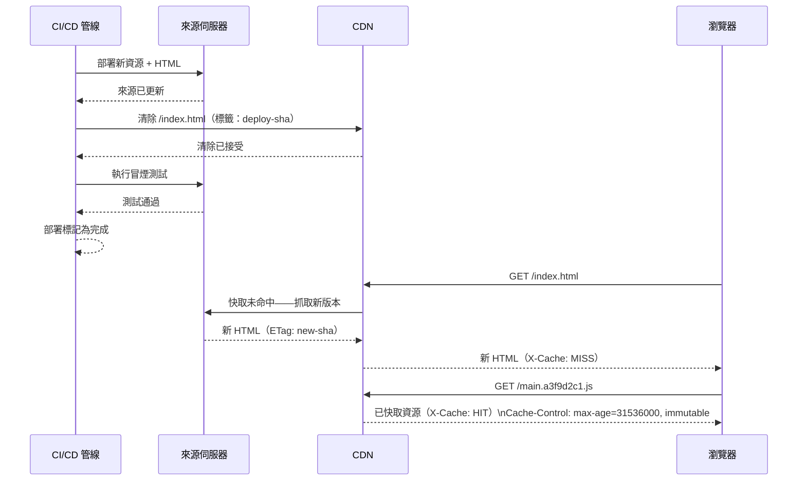

# 大規模快取失效

快取失效（Cache Invalidation）常被視為電腦科學中最難解決的兩個問題之一，
而前端部署讓這個難題具體化了。CDN 已快取了你的 JavaScript 套件。你部署了
一個修復。使用者重新整理，但 CDN 從邊緣節點提供的仍是舊檔案。你的伺服器
已更新；CDN 還沒有。這就是大規模快取失效的核心問題：分散式快取必須與中
央部署事件協調同步。

解決方案空間依據不可變性（immutability）的執行位置，分為兩種策略。第一
種將 URL 視為可變的——相同路徑會隨時間提供不同內容，失效意味著告訴快取丟
棄現有內容。第二種將 URL 視為不可變的——內容變更會產生新的 URL，快取自然
是正確的，因為舊 URL 不再被使用，新 URL 在首次請求時才被填充。現代前端部
署對靜態資源採用不可變 URL 策略，對 HTML 入口點則採用謹慎限制的可變策略。

正確處理快取失效具有連鎖效應。快取不足意味著回訪使用者每次訪問都支付網
路成本；高並發下每個靜態資源請求都會打到來源伺服器。過度快取或失效失敗，
意味著使用者在部署後仍執行過時的 JavaScript 和 CSS，在資源版本與後端 API
合約之間產生不一致的狀態。在持續部署環境中，多個版本可能同時活躍在 CDN
各邊緣節點上，混合版本狀態的窗口需要刻意的設計。

本文涵蓋內容雜湊資源命名、HTML 入口點的 CDN 清除 API 模式、
`Cache-Control: immutable` 指令、HTML 檔案快取策略，以及 CI 部署情境下的
`stale-while-revalidate`。

## 原則

帶有內容雜湊檔名的靜態資源必須（MUST）以長效的 `Cache-Control` 標頭提供
服務（`max-age=31536000, immutable`）。HTML 入口點——引用所有資源的文件——
必須（MUST）以短暫的 `max-age` 或 `no-cache` 提供服務，確保瀏覽器在每次
部署後都會抓取新的副本。CDN 清除（purge）必須（MUST）作為部署管線的一部
分，在部署被視為完成之前針對 HTML 入口點觸發。團隊禁止（MUST NOT）依賴使
用者清除瀏覽器快取作為失效失敗的變通方案。

## 設計思維

### 內容雜湊檔名與自然失效

內容雜湊檔名——也稱為「快取破壞（cache busting）」——將檔案內容的雜湊值嵌
入 URL：使用 `main.a3f9d2c1.js` 而非 `main.js`。當檔案內容改變時，雜湊值
改變，URL 也隨之改變。舊 URL 繼續從 CDN 提供舊內容——這是正確的，因為部
署前載入的任何頁面都引用了舊雜湊值。部署後提供的新頁面引用了新雜湊值 URL。
由於 URL 不同，無需明確的快取失效。

所有主要建構工具都能自動生成內容雜湊檔名。Webpack 的 `output.filename` 使
用 `[contenthash]` token、Vite 預設的 `build.rollupOptions.output.assetFileNames`
模式，以及 esbuild 的 `--asset-names` 旗標，都能產生內容雜湊的輸出。雜湊
值是根據檔案內容位元組計算的，因此相同內容產生相同雜湊值，CDN 無需往返
來源伺服器即可提供快取版本。只有變更的檔案才會產生新雜湊值，需要重新填
充快取。

內容雜湊檔名使 `Cache-Control: max-age=31536000, immutable` 既安全又正確。
瀏覽器可以將檔案快取長達一年，因為它知道 URL 永遠不會提供不同的內容。
`immutable` 指令是一個優化提示：它指示瀏覽器即使使用者明確重新整理頁面，
也不要對資源進行重新驗證。沒有 `immutable` 時，強制重新整理會對所有已快
取的資源發送條件式 `If-None-Match` 請求，即使它們尚未過期。有了 `immutable`，
瀏覽器在 `max-age` 窗口內完全跳過重新驗證。

`immutable` 指令受所有現代瀏覽器支援。較舊的瀏覽器會忽略它，回退到標準
的 `max-age` 行為。向不支援它的瀏覽器提供 `immutable` 沒有任何風險——它們
只是不套用該優化。

### HTML 入口點問題

內容雜湊檔名解決了資源失效問題，但沒有解決 HTML 入口點問題。HTML 文件——
單頁應用程式的 `index.html`，或伺服器渲染應用程式的各路由文件——是相依性
樹的根節點。它引用了所有雜湊資源 URL。部署後，新的 HTML 文件引用了新的
資源雜湊值。如果 CDN 或瀏覽器提供了舊的 HTML 文件，它將請求舊的資源
URL——這些 URL CDN 仍然有快取，因為那些舊雜湊值是不可變的。使用者執行的
仍是舊版應用程式。

HTML 入口點不得使用長效的 `max-age` 進行快取。兩種策略是正確的：
`Cache-Control: no-cache` 以及 `Cache-Control: max-age=0, must-revalidate`。
兩者都確保瀏覽器在每次導航時發送條件式請求。如果文件未變更（相同的 `ETag`
或 `Last-Modified` 值），伺服器以 `304 Not Modified` 回應，成本極低。如果
文件已變更，瀏覽器收到帶有更新資源引用的新 HTML。

在 CDN 層，每次部署後必須清除 HTML 入口點。CDN 清除 API——Cloudflare 的
API、Fastly 的 `PURGE` 方法、AWS CloudFront 的 `CreateInvalidation`——接受
URL 或路徑模式清單，並指示邊緣節點丟棄其快取副本。每個邊緣節點的下一次
請求將從來源伺服器抓取新的副本。

在清除之前部署，會產生一個窗口期：新的來源伺服器提供新的 HTML，但 CDN
邊緣仍在提供舊的 HTML。在 CDN 清除後訪問新邊緣節點的使用者收到新 HTML；
而訪問尚未清除的邊緣節點的使用者收到舊 HTML。此窗口通常持續數秒到數分
鐘，對於要求零停機的應用程式，必須測量並加以應對。

### 部署管線中的 CDN 清除

CDN 清除應是部署管線的最後一步，在確認新資源在來源伺服器上可用之後執行。
在來源伺服器更新之前清除，會導致邊緣節點從來源伺服器抓取舊內容並重新快
取。在來源伺服器更新且冒煙測試通過後再清除，確保 CDN 開始提供經驗證的內
容。

大多數 CI/CD 平台可以在管線步驟中使用經過身份驗證的 HTTP 請求呼叫 CDN
清除 API。請求是一個包含待清除路徑清單的簡單認證 POST。對於單頁應用程式，
路徑清單通常只有一個條目：根 `index.html`。對於多頁應用程式或具有許多不
同路由的伺服器渲染應用程式，清除清單可能更大——如果 CDN 支援，考慮使用基
於標籤（tag）或代理鍵（surrogate key）的清除方式，它可以通過單次 API 呼
叫清除所有帶有部署識別符標籤的資源。

基於標籤的失效需要來源伺服器或 CDN 配置的配合。來源伺服器在每個回應中附
加 `Surrogate-Key` 或 `Cache-Tag` 標頭，將相關資源分組到共享標籤下（例如
部署提交的 SHA 值）。單次 CDN API 呼叫可同時清除所有帶有該標籤的資源，
無論 URL 數量多少。這是大規模部署的首選模式，適用於 HTML 入口點數量超過
基於 URL 的清除清單實際限制的情況。

### CI 情境下的 stale-while-revalidate

`stale-while-revalidate` 是 `Cache-Control` 的擴展指令，指示快取在後台抓
取更新版本的同時立即提供過期的回應。該指令接受一個時間窗口：
`Cache-Control: max-age=60, stale-while-revalidate=86400` 表示回應在 60 秒
內是新鮮的，快取可以在後台重新驗證的同時，在長達 24 小時內繼續提供過期
回應。

對於高頻率 CI/CD 環境中的 HTML 入口點，此指令會帶來顯著風險。使用者從
過期的 HTML 入口點載入應用程式——快取立即提供服務。重新驗證請求在後台發
送。同一使用者的下一次導航可能收到更新後的 HTML，造成不同瀏覽器分頁執行
不同應用程式版本的狀態。對於具有客戶端路由的單頁應用程式，如果舊 JavaScript
套件引用的 API 端點或資源路徑在新部署中已更改，這種 Session 中版本切換
可能導致執行時錯誤。

`stale-while-revalidate` 僅適用於應用程式能夠容忍混合版本瀏覽器 Session
的 HTML 入口點情況——通常是唯讀儀表板、文件網站以及狀態不複雜的以內容為
主的頁面。對於具有 API 版本相依性的互動式應用程式，HTML 入口點應使用
`no-cache` 或 `max-age=0, must-revalidate`，而不包含 `stale-while-revalidate`。

對於帶有內容雜湊檔名的靜態資源，`stale-while-revalidate` 是無害的：每個
URL 的內容是不可變的，因此提供 `main.a3f9d2c1.js` 的過期版本始終是正確
的——它與新鮮版本的位元組完全相同。

### 監控與驗證失效

沒有明確的工具，快取失效的正確性很難觀察。如果來源伺服器提供了正確的內
容且 CI 測試通過，部署看起來就是成功的。邊緣節點的不一致性——在清除傳播
窗口期間，不同節點提供不同版本——如果沒有明確測量，在標準監控中是不可見
的。

在每次部署後立即從多個地理位置執行的合成監控，可以檢測邊緣不一致性。監
控從多個 CDN 區域請求 HTML 入口點，並比較回應中的 `ETag` 或內容雜湊值。
如果不同區域返回不同的 `ETag`，表示清除傳播尚未完成。對此狀況的告警，
可以在部署被標記為完成之前通知部署管線。

回應標頭揭示了快取行為。`X-Cache: HIT` 和 `X-Cache: MISS` 標頭（或等效
的 CDN 特定標頭，如 Cloudflare 的 `CF-Cache-Status` 或 Fastly 的
`X-Served-By`）指示回應是從快取還是來源伺服器提供的。在 RUM 或合成監控
中記錄這些標頭，提供了按 URL 劃分的快取命中率的持續視圖，使得偵測意外
從快取中缺失的 URL 或意外被快取的 URL 成為可能。

快取命中率是衡量快取配置健康度的關鍵指標。對於帶有內容雜湊檔名的靜態資
源，穩定的快取命中率應在 90% 以上；若命中率持續偏低，可能表示資源 URL
未被正確地設定為不可變，或 CDN 的快取規則設定有誤。部署後暫時性的命中
率下降是正常的——新雜湊值的 URL 在首次請求時需要從來源伺服器填充快取。

## 最佳實踐

**必須（MUST）**對所有靜態資源（JavaScript、CSS、字型、圖片）使用內容雜湊
檔名，並以 `Cache-Control: max-age=31536000, immutable` 提供服務。內容雜湊
命名是在 CDN 規模下實現自然快取失效而無需明確清除的唯一可靠機制。

**必須（MUST）**以 `Cache-Control: no-cache` 或 `max-age=0, must-revalidate`
提供 HTML 入口點服務——而非 `max-age=31536000` 或任何長效 TTL。HTML 文件是
唯一因其過期直接導致使用者執行錯誤應用程式版本的資源。

**必須（MUST）**將針對 HTML 入口點的 CDN 清除觸發器納入部署管線的一個步
驟，在來源伺服器更新後、部署標記為完成之前執行。手動清除不能替代自動化
管線整合。

**禁止（MUST NOT）**在具有 API 版本相依性或複雜客戶端狀態的應用程式的
HTML 入口點上使用 `stale-while-revalidate`。不得在互動式單頁應用程式中將
此指令套用於入口文件，因為這會在部署期間產生混合版本的瀏覽器 Session，
可能導致執行時錯誤。

**應該（SHOULD）**對具有許多 HTML 入口點的應用程式（多頁應用程式、伺服器
渲染路由）使用基於標籤或代理鍵的 CDN 清除。基於 URL 的清除清單在規模上
變得難以管理。

**應該（SHOULD）**實施在每次部署後立即跨 CDN 區域檢查快取一致性的合成監
控，以在影響真實使用者之前偵測清除傳播延遲。

## 視覺呈現



## 範例

```yaml
# .github/workflows/deploy.yml
# 生產部署工作流程，以 CDN 清除作為最後步驟。

name: Deploy

on:
  push:
    branches: [main]

jobs:
  deploy:
    runs-on: ubuntu-latest
    steps:
      - uses: actions/checkout@v4

      - name: 安裝相依套件
        run: npm ci

      - name: 建構
        run: npm run build
        # 建構輸出：dist/
        # index.html — 無雜湊，短效快取 TTL
        # assets/main.a3f9d2c1.js — 內容雜湊，不可變

      - name: 上傳資源至 CDN 來源（S3 / GCS 等）
        run: |
          # 先上傳雜湊資源，使用長效快取標頭
          aws s3 sync dist/assets s3://$BUCKET/assets \
            --cache-control "max-age=31536000, immutable" \
            --exclude "*.html"

          # 上傳 HTML，使用 no-cache 標頭
          aws s3 cp dist/index.html s3://$BUCKET/index.html \
            --cache-control "no-cache"
        env:
          AWS_ACCESS_KEY_ID: ${{ secrets.AWS_ACCESS_KEY_ID }}
          AWS_SECRET_ACCESS_KEY: ${{ secrets.AWS_SECRET_ACCESS_KEY }}

      - name: 從 CloudFront 清除 HTML
        run: |
          aws cloudfront create-invalidation \
            --distribution-id ${{ secrets.CF_DISTRIBUTION_ID }} \
            --paths "/index.html"
        env:
          AWS_ACCESS_KEY_ID: ${{ secrets.AWS_ACCESS_KEY_ID }}
          AWS_SECRET_ACCESS_KEY: ${{ secrets.AWS_SECRET_ACCESS_KEY }}

      - name: 冒煙測試
        run: |
          # 驗證 CDN 邊緣已上線新部署
          ETAG=$(curl -sI https://app.example.com/ | grep -i etag | awk '{print $2}')
          echo "線上 ETag: $ETAG"
          # 斷言 ETag 符合預期的新版本雜湊值
```

## 常見錯誤

- 以 `max-age=31536000` 提供 `index.html` 服務——使用者在部署後，直到 CDN
  TTL 到期之前都會收到舊的 HTML，執行可能具有不相容 API 合約的舊版應用
  程式
- 從部署管線中遺漏 CDN 清除——管線成功完成，但 CDN 邊緣繼續提供舊的 HTML
- 在將新資源上傳至來源伺服器之前清除 CDN——邊緣節點從來源伺服器重新抓取
  並重新快取舊內容
- 對互動式單頁應用程式的 HTML 入口點使用 `stale-while-revalidate`——在部署
  中途產生混合版本的瀏覽器 Session
- 未對字型和圖片資源進行內容雜湊——這些也是版本化的檔案，應在其 URL 上不
  可變
- 在測試期間依賴瀏覽器 DevTools 停用快取——DevTools 停用快取繞過的是瀏覽
  器快取而非 CDN；生產快取行為需要在啟用快取的情況下進行測試

## 相關 FEE

- FEE-1504: Production Deployment: Static Hosting & CDN
- FEE-1505: Deployment Strategies: Canary, Blue-Green & Feature Flags
- FEE-1509: Rollback Strategies for Frontend Deployments

## 參考資料

- [MDN：Cache-Control](https://developer.mozilla.org/zh-TW/docs/Web/HTTP/Headers/Cache-Control)
- [web.dev：善用快取](https://web.dev/love-your-cache/)
- [Cloudflare：快取清除 API](https://developers.cloudflare.com/cache/how-to/purge-cache/)
- [AWS CloudFront：CreateInvalidation](https://docs.aws.amazon.com/cloudfront/latest/APIReference/API_CreateInvalidation.html)
- [RFC 5861：stale-while-revalidate](https://datatracker.ietf.org/doc/html/rfc5861)
- [Vite：建構選項 — rollupOptions](https://vitejs.dev/config/build-options.html)
- [Fastly：即時清除](https://developer.fastly.com/reference/api/purging/)
- [Google Cloud CDN：快取失效](https://cloud.google.com/cdn/docs/cache-invalidation-overview)
