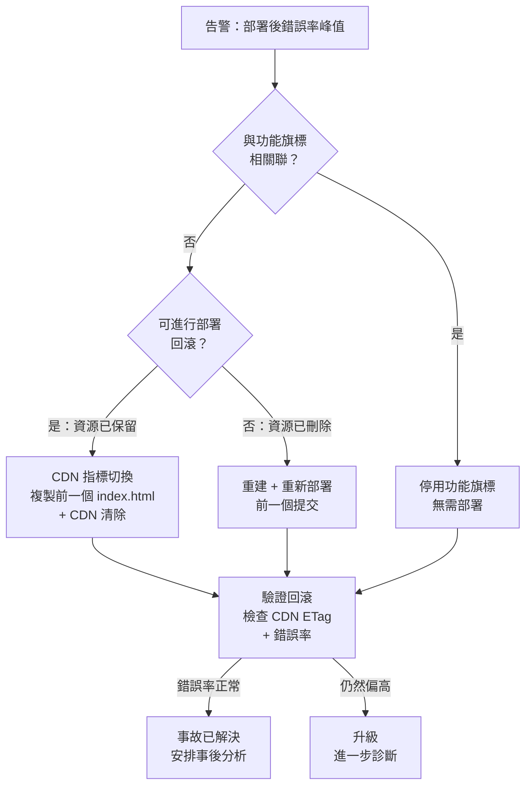

# 前端部署的回滾策略

回滾（Rollback）是在錯誤部署後將生產系統恢復至先前已知良好狀態的能力。
對於後端服務，回滾通常是容器替換或資料庫遷移撤銷——具有數十年工具積累的
成熟操作。對於前端部署，回滾在幾個重要方面有所不同：靜態資源存放在全球
分發不可變檔案的 CDN 上，HTML 入口點控制使用者載入哪個資源版本，而在瀏
覽器分頁中執行的客戶端 JavaScript 無法在不重新載入頁面的情況下被替換。

部署與回滾之間的不對稱性製造了一個實際的陷阱。一次部署需要五分鐘。團隊
假設回滾也需要五分鐘。然而實際上，需要重建舊版本、執行完整 CI 管線、重
新上傳資源並清除 CDN 的回滾，所需時間與前向部署一樣長——而且必須在事故期
間完成，此時團隊的注意力已分散。回滾速度是部署系統架構方式的函數，而非
工程師反應速度的函數。

前端回滾策略還因可即時撤銷與不可即時撤銷的邊界而更加複雜。將 HTML 入口
點重導向至先前部署的 CDN 指標切換是即時的，不需要重新建構。停用有問題功
能的功能旗標（Feature Flag）回滾可以在毫秒內生效，無需任何部署。需要重
新執行 CI 的部署回滾，則需要與 CI 本身一樣長的時間。在告警觸發時，了解
哪類回滾適用於哪類事故，是團隊需要做出的首要決策。

本文涵蓋透過 CDN 指標切換實現即時回滾、功能旗標回滾與部署回滾的比較、
基於錯誤率監控的自動化回滾觸發，以及在測試環境中進行回滾測試的實踐。

## 原則

每次生產部署必須（MUST）在不重新執行建構管線的情況下可回滾。回滾機制必
須（MUST）在需要使用之前定義並測試完畢。在部署後監控窗口內，當錯誤率指
標超過定義的閾值時，應該（SHOULD）自動觸發回滾。應該（SHOULD）使用功能
旗標將程式碼部署與功能啟用解耦，使有問題的功能可以在不回滾整個部署的情
況下被停用。在確認生產事故後五分鐘內，應該（SHOULD）做出回滾決策，而非
在長時間診斷之後。

## 設計思維

### CDN 指標切換：無需重建的即時回滾

最快速的前端回滾機制是 CDN 指標切換：更改 CDN 服務的當前部署所指向的預
建構、預上傳資源目錄。這要求即使在新部署取代舊部署之後，前次部署的資源
仍然保留在 CDN 來源並可存取。

要實現此模式，前提是每次部署的建構產物都被永久保存，而非在下一次部署時
覆寫。這與許多初始部署設置的預設行為相反——許多設置直接將 `dist/` 目錄的
內容上傳至固定的 S3 存儲桶前綴或靜態主機根目錄。為了支援指標切換，部署
流程必須重新設計：每次部署先將所有產物上傳至版本化路徑，再更新
`/current/index.html` 的指標。這一次性的架構調整，換來的是永久的即時回滾
能力。

實作模式是以部署版本命名的資源目錄。每次部署將其輸出上傳到 CDN 來源的版
本化路徑：`/deploys/{sha}/assets/main.a3f9d2c1.js`。HTML 入口點上傳到一個
獨立的固定路徑：`/current/index.html`。HTML 檔案包含指向
`/deploys/{sha}/assets/...` 的絕對資源引用。回滾是一個單一操作：用前一個
版本的 HTML 檔案覆寫 `/current/index.html`，並從 CDN 中清除它。所有邊緣節
點開始提供前一個 HTML，它引用的是前一次部署的資源——這些資源仍以其舊的版
本化路徑保存在 CDN 來源中。

此模式要求保留部署歷史。資源目錄在新部署之後不得立即刪除。保留五到十個最
近部署的保留策略提供了現實的回滾窗口；保留超過 20 個通常沒有必要，並會增
加儲存成本。舊部署目錄的清理應是一個計劃性工作，在部署上線並確認穩定的
定義期間後運行。

CDN 指標切換不需要新的建構、新的 CI 執行或新的資源上傳。回滾時間是複製
一個 HTML 檔案並發出 CDN 清除 API 呼叫的時間——通常在 60 秒以內。這是需
要部署撤銷的生產事故的目標回滾時間。

### 功能旗標回滾與部署回滾

功能旗標將功能啟用與程式碼部署解耦。功能旗標允許以禁用狀態在程式碼庫中
發布功能，為內部使用者啟用以進行測試，逐步向一定比例的使用者推出，並在
偵測到問題時立即停用——所有這些都無需任何程式碼部署。

功能旗標回滾比部署回滾更快且更有針對性。部署回滾撤銷整個部署，包括同一
提交中附帶的不相關變更。功能旗標回滾精確地停用有問題的功能，保留同一部
署中的所有其他變更完整無損。

在功能旗標回滾和部署回滾之間做選擇，取決於問題是否可歸因於特定功能或共
享基礎設施的變更。與新功能旗標開啟相關聯的錯誤峰值，最好透過關閉旗標來
解決。影響所有使用者而不論功能旗標狀態的錯誤峰值——損壞的路由配置、損壞
的 CSS 套件、不正確的 API 基礎 URL——需要部署回滾。

不為重大變更使用功能旗標的團隊失去了進行針對性回滾的能力。他們必須在回
滾整個部署（撤銷不相關的變更，可能重新引入先前已修復的錯誤）和讓損壞的
部署保持上線同時進行緊急修復之間做出選擇。將功能旗標作為重要功能的預設
實踐，在實踐中顯著縮小了部署回滾的範圍。

功能旗標還有一個常被忽視的面向：回滾後的旗標狀態管理。當執行部署回滾時，
程式碼恢復到前一個版本，但功能旗標服務中的旗標狀態不會自動恢復。如果一
個功能旗標是在本次部署中新增的，回滾後的程式碼中沒有讀取該旗標的程式碼，
旗標服務中殘留的旗標定義不會造成問題。但如果回滾後的舊版程式碼中有對某
個在新部署中被移除或重命名的旗標的引用，行為可能出現不可預期的偏差。在
每次部署的變更記錄中記錄旗標的新增、修改和移除，可以在需要回滾時快速評
估旗標狀態的影響。

### 自動化回滾觸發器

當部署後指標在監控窗口內超過定義的閾值時，自動化回滾觸發器將啟動。監控
窗口是部署後系統被認為不穩定、正在主動監控信號的時間段。典型的窗口是 10
到 30 分鐘，之後如果沒有發生閾值違反，部署就被認為是穩定的。

前端部署中用於自動化回滾觸發器的指標有：客戶端錯誤率（每個 Session 的未
處理 JavaScript 異常數）、前端發出的 API 呼叫的 HTTP 4xx/5xx 錯誤率，以及
Core Web Vitals 劣化。其中，客戶端錯誤率是前端部署問題最可靠的信號。在部
署後立即出現的未處理異常峰值，與部署事件相關聯，是部署引入程式碼缺陷的強
力證據。

閾值必須相對於部署前基準線進行校準，而非使用絕對值。0.5% 的基準錯誤率和
2% 的閾值（基準的四倍）比固定的 1% 閾值更有意義——後者對於某些應用程式可
能低於基準線。金絲雀部署（Canary Deployment）——將少量流量路由到新版本，同時大多數流量
繼續使用舊版本——允許在完整推出之前使用生產流量進行基準比較，使自動化回
滾閾值更精確。金絲雀組的錯誤率若超過對照組的兩倍，即可視為觸發回滾的可
靠信號，而無需等待閾值在全量流量上觸發。此模式將回滾所影響的使用者範圍
從全體縮減至金絲雀流量的比例。

自動化回滾必須搭配告警和人員可見性。靜默執行的自動化回滾會造成混淆：待
命工程師看到告警，開始調查，卻發現系統已回到前一個版本。自動化回滾事件
必須被記錄，且必須通知待命工程師並提供背景資訊：哪個部署被回滾、什麼指
標觸發了它、指標值是多少，以及採取了什麼回滾動作。

自動化回滾並不能取代對事故根本原因的調查。回滾是一個緩解動作，不是診斷
工具。事故解決後，應安排事後分析（post-mortem）以了解：是什麼程式碼變更
導致了錯誤率上升、為什麼問題沒有在測試環境中被捕捉到、以及如何更新測試
或監控以便更早偵測到同類型的問題。回滾的目的是縮短使用者受影響的時間，
而不是將修復推遲到無法追溯的未來。

### 在測試環境中測試回滾

僅在生產事故期間測試的回滾機制，不是回滾機制——而是一個未經驗證的理論。
回滾程序必須定期在測試環境中演練，以驗證它按設計工作，且團隊知道如何在
壓力下執行它。

在測試環境中測試回滾，包括部署一個新版本、驗證其上線，然後執行回滾程序
至前一個版本，並驗證前一個版本已上線且功能正常。此演練應以腳本方式進行，
以便能夠一致地執行並隨時間比較其結果。如果在測試環境中回滾需要五分鐘，
在生產環境中至少需要五分鐘——事故期間的額外協調開銷可能使其更長。

測試應驗證以下各項：
- 回滾程序將正確的 HTML 入口點恢復至 CDN
- CDN 清除在可接受的時間窗口內傳播
- 已恢復版本的資源仍然可以在 CDN 來源處獲取
- 在錯誤部署之前開啟的任何功能旗標，在回滾後處於正確的狀態

回滾測試還應涵蓋自動化觸發路徑：驗證監控系統是否在預期時間內正確偵測到
模擬的錯誤率峰值並觸發回滾。

建議將回滾演練納入新工程師的入職培訓。沒有親身執行過回滾的工程師，在第
一次需要在事故壓力下執行時，可能因為不熟悉腳本參數或 CDN API 的認證方式
而耽誤寶貴的時間。入職培訓中的演練同時也是發現文件不清晰或腳本假設不正
確的機會，在低風險的環境中修正，而非在事故期間發現。

每次部署管線發生重大變更後，也應重新執行回滾測試。管線的重構——更換 CI
供應商、更改 CDN 配置、重構上傳腳本——可能在不破壞前向部署的情況下破壞
回滾程序，因為兩者共用基礎設施但執行方向相反。

## 最佳實踐

**必須（MUST）**在 CDN 來源保留前一次部署的資源，保留窗口為定義的期間（5
至 10 次部署）。如果前次部署的資源已被刪除，即時 CDN 指標切換回滾就無法
實現。

**必須（MUST）**在首次生產部署之前定義並記錄回滾程序。程序必須能由任何
待命工程師執行，而不僅僅是建立部署管線的人。

**禁止（MUST NOT）**將刪除前次部署資源目錄作為部署管線的一部分。不得在
部署流程中執行資源清除，也不得依賴部署後立即刪除來控制儲存成本——刪除舊
版本目錄應是獨立的計劃性清理工作，在穩定窗口過後執行。

**應該（SHOULD）**對重要的新功能使用功能旗標，以實現針對性回滾，而不必
撤銷不相關的變更。部署回滾是一個粗糙的工具；功能旗標回滾更為精確。

**應該（SHOULD）**配置相對於部署前基準線的客戶端錯誤率自動化回滾觸發器，
並設定定義的部署後監控窗口。

**應該（SHOULD）**至少每月或在重大版本發布前在測試環境中測試回滾程序。
未經測試的回滾程序會在最糟糕的時刻失敗。

## 視覺呈現



## 範例

```typescript
// scripts/rollback.ts
// 適用於 AWS S3 + CloudFront 的 CDN 指標切換回滾。
// 從前一次部署複製 HTML 並清除 CDN。
// 執行方式：npx ts-node scripts/rollback.ts <previous-deploy-sha>

import {
  S3Client,
  CopyObjectCommand,
} from '@aws-sdk/client-s3';
import {
  CloudFrontClient,
  CreateInvalidationCommand,
} from '@aws-sdk/client-cloudfront';

const BUCKET = process.env.DEPLOY_BUCKET!;
const DISTRIBUTION_ID = process.env.CF_DISTRIBUTION_ID!;

const s3 = new S3Client({ region: 'us-east-1' });
const cf = new CloudFrontClient({ region: 'us-east-1' });

async function rollback(previousSha: string): Promise<void> {
  console.log(`正在回滾至部署：${previousSha}`);

  // 1. 將前次部署的 index.html 複製到 /current/ 前綴
  await s3.send(
    new CopyObjectCommand({
      Bucket: BUCKET,
      CopySource: `${BUCKET}/deploys/${previousSha}/index.html`,
      Key: 'current/index.html',
      CacheControl: 'no-cache',
      MetadataDirective: 'REPLACE',
    }),
  );

  console.log('HTML 入口點已從前次部署恢復');

  // 2. 從 CloudFront 邊緣節點清除 HTML
  const invalidation = await cf.send(
    new CreateInvalidationCommand({
      DistributionId: DISTRIBUTION_ID,
      InvalidationBatch: {
        Paths: { Quantity: 1, Items: ['/current/index.html'] },
        CallerReference: `rollback-${previousSha}-${Date.now()}`,
      },
    }),
  );

  console.log(`CDN 清除已啟動：${invalidation.Invalidation?.Id}`);
  console.log('回滾完成。驗證方式：curl -sI https://app.example.com/');
}

const previousSha = process.argv[2];
if (!previousSha) {
  console.error('使用方式：rollback.ts <previous-deploy-sha>');
  process.exit(1);
}
rollback(previousSha).catch((err) => {
  console.error('回滾失敗：', err);
  process.exit(1);
});
```

## 常見錯誤

- 在部署管線中刪除前次部署的資源目錄——消除了 CDN 指標切換回滾的選項；
  唯一剩餘的選項是完整重建
- 只在管線首次建立時測試回滾一次，之後再也不測試——隨著管線演進，回滾
  程序會發生漂移；未經測試的程序在事故中失敗
- 使用功能旗標進行回滾，但沒有監控在錯誤部署時哪些旗標是開啟的——回滾
  到前一個版本恢復了舊程式碼，卻沒有恢復舊的功能旗標狀態
- 自動化回滾觸發後不通知待命工程師——靜默的自動化回滾在事故回應期間製
  造混淆
- 設定絕對錯誤率閾值而非相對於部署基準線的閾值——1% 的絕對閾值對於基準
  已在 0.8% 的應用程式會頻繁觸發，而對於基準已超過 1% 的應用程式則永遠
  不會觸發
- 將回滾時間與部署時間混淆——部署需要 10 分鐘；CDN 指標切換回滾需要 60
  秒；應分別向利害關係人傳達，以便正確設定回滾 SLA

## 相關 FEE

- FEE-1504: Production Deployment: Static Hosting & CDN
- FEE-1505: Deployment Strategies: Canary, Blue-Green & Feature Flags
- FEE-1508: Cache Invalidation at Scale

## 參考資料

- [Cloudflare：Pages 回滾](https://developers.cloudflare.com/pages/configuration/rollbacks/)
- [Vercel：即時回滾](https://vercel.com/docs/deployments/instant-rollback)
- [LaunchDarkly：功能旗標回滾](https://launchdarkly.com/blog/feature-flag-rollbacks/)
- [Google SRE 書籍：發布工程](https://sre.google/sre-book/release-engineering/)
- [AWS：部署回滾](https://docs.aws.amazon.com/codedeploy/latest/userguide/deployments-rollback-and-redeploy.html)
- [Netlify：即時回滾](https://docs.netlify.com/site-deploys/manage-deploys/#rollbacks)
- [OpenFeature：功能旗標標準](https://openfeature.dev/)
- [Datadog：部署追蹤](https://docs.datadoghq.com/tracing/deployment_tracking/)
- [Grafana：自動化回滾模式](https://grafana.com/blog/2022/11/02/automated-rollbacks/)
- [Google SRE：事故後分析](https://sre.google/sre-book/postmortem-culture/)
