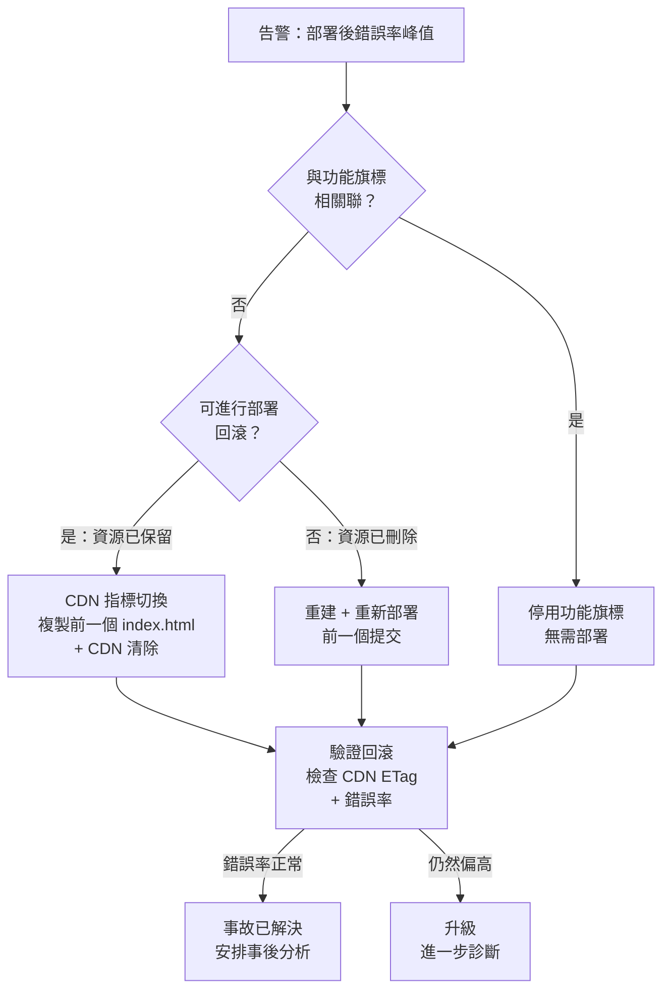

# [FEE-1509] 前端部署的回滾策略

:::info
回滾是在錯誤部署後，將生產系統恢復至先前已知良好狀態的能力。前端回滾與後端回滾在結構上不同：由於靜態資源存放在全球分發不可變檔案的 CDN 上，將 HTML 入口點重導向至先前部署的 CDN 指標切換，可以近乎即時完成，前提是前次部署的資源仍保留在來源端。這個機制有實際的限制：它改變的是新頁面載入時取得的內容，而已開啟的瀏覽器分頁與已安裝的 Service Worker，仍會繼續執行它們原本載入的版本。驗證回滾是否成功，除了確認 CDN 已更新之外，還需要觀察客戶端回報的錯誤率是否下降。本文涵蓋 CDN 指標切換模式、功能旗標回滾與部署回滾的比較、基於錯誤率監控的自動化回滾觸發，以及回滾前端並不安全的情況，例如後端 API 合約已經先行變更。
:::

## 背景

對於後端服務，回滾通常是容器替換或資料庫遷移撤銷：這是具有數十年工具積累的成熟操作。對於前端部署，回滾在幾個重要方面有結構性差異：靜態資源存放在全球分發不可變檔案的 CDN 上；HTML 入口點控制使用者載入哪個資源版本；而在瀏覽器分頁中已經執行的客戶端 JavaScript，無法在不重新載入頁面的情況下被替換。本文稍後的「回滾機制觸及不到的地方」一節，會說明這項限制在實務上代表什麼。

部署與回滾之間的不對稱性，製造了一個實際的陷阱。團隊常常認為既然部署很快，回滾也應該同樣快。但實際上，需要重建舊版本、執行完整 CI 管線、重新上傳資源並清除 CDN 的回滾，所需時間與前向部署一樣長，而且必須在事故期間完成，此時團隊的注意力已經分散。回滾速度是在設計部署管線時就已經決定的：保留舊資源的管線可以透過單一檔案複製完成回滾，而刪除舊資源的管線則必須重新執行 CI 才能重建先前的狀態。

前端回滾策略還因為「可即時撤銷」與「不可即時撤銷」之間的邊界而更加複雜。將 HTML 入口點重導向至先前部署的 CDN 指標切換近乎即時，不需要重新建構。停用有問題功能的功能旗標回滾，完全不需要任何部署即可生效。需要重新執行 CI 的部署回滾，則需要與 CI 本身一樣長的時間。在告警觸發時，判斷哪一類回滾適用於哪一類事故，是團隊需要做出的首要決策。

本文介紹的版本化目錄模式，適合自行管理 CDN 與來源儲存的團隊建構，例如自架的 S3 加 CloudFront 環境。受管理的平台已經將同樣的概念做成內建功能，但在依賴它們之前，值得先了解各自的取捨。Cloudflare Pages、Vercel 與 Netlify 都提供一鍵或一行指令回滾至先前部署的功能。在 Vercel 上，Instant Rollback 不會套用目標部署建構完成後所做的環境變數變更；回滾後的部署會維持它原本擁有的環境設定。它也會關閉新推送自動晉升為正式環境的功能，直到回滾被復原為止；自訂網域別名也只有在回滾目標部署原本就已連結該別名時才會保留（Vercel，"Performing an Instant Rollback on a Deployment"，Vercel 文件（2026））。在 Netlify 上，如果啟用了來自 Git 的自動發布，下一次推送會直接覆寫手動發布的回滾結果，且不會提示使用者（Netlify，"Manage deploys"，Netlify 文件（2026））。這兩個案例都是同一類問題的具體例子：回滾會還原程式碼，但不會自動還原與該部署相關的所有狀態。

本文涵蓋透過 CDN 指標切換實現的即時回滾、這個機制觸及不到的範圍、功能旗標回滾與部署回滾的比較、基於錯誤率監控的自動化回滾觸發、回滾不安全的情況，以及在測試環境中進行回滾測試的實踐。

## 視覺對比



## 範例

```typescript
// scripts/rollback.ts
// 適用於 AWS S3 + CloudFront 的 CDN 指標切換回滾。
// 從前一次部署複製 HTML 並清除 CDN。
// 執行方式：npx ts-node scripts/rollback.ts <previous-deploy-sha>

import { S3Client, CopyObjectCommand } from '@aws-sdk/client-s3';
import {
  CloudFrontClient,
  CreateInvalidationCommand,
} from '@aws-sdk/client-cloudfront';

const BUCKET = process.env.DEPLOY_BUCKET!;
const DISTRIBUTION_ID = process.env.CF_DISTRIBUTION_ID!;

const s3 = new S3Client({ region: 'us-east-1' });
const cf = new CloudFrontClient({ region: 'us-east-1' });

async function rollback(previousSha: string): Promise<void> {
  console.log(`正在回滾至部署：${previousSha}`);

  // 1. 將前次部署的 index.html 複製到 /current/ 前綴
  await s3.send(
    new CopyObjectCommand({
      Bucket: BUCKET,
      CopySource: `${BUCKET}/deploys/${previousSha}/index.html`,
      Key: 'current/index.html',
      CacheControl: 'no-cache',
      MetadataDirective: 'REPLACE',
    }),
  );

  console.log('HTML 入口點已從前次部署恢復');

  // 2. 從 CloudFront 邊緣節點清除 HTML
  const invalidation = await cf.send(
    new CreateInvalidationCommand({
      DistributionId: DISTRIBUTION_ID,
      InvalidationBatch: {
        Paths: { Quantity: 1, Items: ['/current/index.html'] },
        CallerReference: `rollback-${previousSha}-${Date.now()}`,
      },
    }),
  );

  console.log(`CDN 清除已啟動：${invalidation.Invalidation?.Id}`);
  console.log('回滾完成。驗證方式：curl -sI https://app.example.com/');
}

const previousSha = process.argv[2];
if (!previousSha) {
  console.error('使用方式：rollback.ts <previous-deploy-sha>');
  process.exit(1);
}
rollback(previousSha).catch((err) => {
  console.error('回滾失敗：', err);
  process.exit(1);
});
```

## 最佳實踐

**必須（MUST）**在 CDN 來源端保留前次部署的資源，保留窗口的長度應依團隊的部署頻率與回滾需求而定。如果前次部署的資源已被刪除，即時 CDN 指標切換回滾就無法實現。

**必須（MUST）**在首次生產部署之前定義並記錄回滾程序。程序必須能由任何待命工程師執行，而不僅僅是建立部署管線的人。

**禁止（MUST NOT）**將刪除前次部署資源目錄作為部署管線的一部分。刪除動作應是獨立的排程清理工作，在穩定窗口過後執行。在部署時順帶刪除，會直接消除回滾窗口。

**應該（SHOULD）**對重要的新功能使用功能旗標，以便在不撤銷不相關變更的情況下進行針對性回滾。

**應該（SHOULD）**配置相對於部署前基準線的客戶端錯誤率自動化回滾觸發器，並設定明確的部署後監控窗口。

**應該（SHOULD）**依照明確且固定的節奏，在測試環境中測試回滾程序，並在重大版本發布前，以及部署管線發生重大變更後再次執行。

**必須（MUST）**確保每次生產部署都能在不重新執行建構管線的情況下回滾。CDN 指標切換模式，也就是保留前次部署資源並替換 HTML 入口點，滿足了這項要求，並將回滾動作本身縮減為一次檔案複製與一次 CDN 清除，而不是一次完整的 CI 執行。

**應該（SHOULD）**在生產事故確認後盡快做出回滾決策，而非在長時間診斷之後才決定。當錯誤率峰值與部署事件相關聯時，恢復服務最快的路徑就是回滾；更深入的根本原因分析應留待事後分析（post-mortem）進行，而非佔用事故應對的時間。

## 設計思維

### CDN 指標切換：無需重建的即時回滾

最快速的前端回滾機制是 CDN 指標切換：更改 CDN 服務所指向的目前部署，改為指向另一個已預先建構、預先上傳的資源目錄。這要求即使在新部署取代舊部署之後，前次部署的資源仍然保留在 CDN 來源並可存取。

實作模式是以部署版本命名的資源目錄。每次部署將其輸出上傳到 CDN 來源的版本化路徑：`/deploys/{sha}/assets/main.a3f9d2c1.js`。HTML 入口點上傳到一個獨立的固定路徑：`/current/index.html`。HTML 檔案包含指向 `/deploys/{sha}/assets/...` 的絕對資源引用。回滾是一個單一操作：用前一個版本的 HTML 檔案覆寫 `/current/index.html`，並從 CDN 中清除它。所有邊緣節點開始提供前一個 HTML，它引用的是前一次部署的資源，這些資源仍以其舊的版本化路徑，保存在 CDN 來源中。

此模式要求保留部署歷史。資源目錄不得在新部署後立即被刪除。假設某團隊每天部署三次，並希望回滾窗口涵蓋過去兩天的所有版本：保留最近約十次部署的資源，就足以涵蓋這個窗口，同時讓儲存空間維持在合理範圍內；實際應保留多少，則依團隊的部署頻率，以及事故可能需要回溯多遠而定。舊部署目錄的清理應是一項排程工作，在部署上線並確認穩定一段時間後執行，而不是部署管線本身的一個步驟。

CDN 指標切換方式不需要新的建構、新的 CI 執行，也不需要新的資源上傳。回滾動作本身，就是複製一個 HTML 檔案並發出一次 CDN 清除（invalidation）呼叫的時間，僅需數秒。傳播到各邊緣節點需要一些時間，但這個過程會立即開始：根據 AWS 的說明，CloudFront 會在提交後數秒內，將清除請求轉發至所有邊緣節點，且每個邊緣節點會立刻開始處理（AWS，"Invalidate files"，AWS CloudFront 文件（2026））。至於最慢的邊緣節點需要多久才能完成，值得針對特定的發布環境實際測量，而不是憑空假設；本文稍後描述的測試環境回滾演練，正是取得這個數字的來源。

### 回滾機制觸及不到的地方

CDN 指標切換改變的是新頁面載入時所取得的內容。它觸及不到兩類已經在執行中的客戶端。

第一類是已開啟的瀏覽器分頁。已經載入問題版本的使用者，會持續在記憶體中執行有問題的 JavaScript 套件，直到重新載入頁面或重新導覽為止；回滾對這個分頁而言是不可見的。需要強制受影響的客戶端切換到目前版本的應用程式，通常會實作版本輪詢（version-polling）或推播式的檢查機制：客戶端會定期將自己的建構識別碼，與伺服器目前的識別碼進行比對，後者從一個小型、不快取的端點取得，或內嵌在 HTML 中；一旦兩者不一致，就提示使用者重新載入。

第二類是 Service Worker。如果應用程式註冊了 Service Worker，前次部署的 Worker 會持續控制已開啟的頁面，並持續提供快取的應用程式外殼（app shell），直到瀏覽器的更新週期安裝了新的 Worker，且該 Worker 完成啟用為止。預設情況下，只有在所有受舊 Worker 控制的頁面都關閉之後，新 Worker 才會啟用（MDN，"Using Service Workers"，MDN Web Docs（2025））。呼叫 `skipWaiting()` 可以讓新 Worker 立即啟用，並在不等待舊頁面關閉的情況下接管它們，但代價是可能在使用者的工作階段（session）進行到一半時，就把程式碼從使用者腳下抽換掉（MDN，"Using Service Workers"，MDN Web Docs（2025））。

由於這兩種效應，如果回滾驗證步驟只檢查 CDN 邊緣狀態，例如確認 HTML 的 ETag 已經改變，那麼它只能確認新的請求會取得舊版本，卻無法確認已受影響的使用者是否已經不再看到錯誤。真正重要的驗證步驟，是以客戶端觀察到的訊號為準：應用程式自身回報的錯誤率，是否已回落至基準線附近。

### 功能旗標回滾與部署回滾

功能旗標將功能啟用與程式碼部署解耦。功能旗標允許以停用狀態在程式碼庫中發布功能，為內部使用者啟用以進行測試，逐步向一定比例的使用者推出，並在偵測到問題時立即停用，所有這些都無需任何程式碼部署。

功能旗標回滾比部署回滾更快，也更具針對性。部署回滾會撤銷整個部署，包括同一次提交中附帶的不相關變更。功能旗標回滾只會精確地停用有問題的功能，讓同一部署中的其他變更保持不變。

選擇功能旗標回滾還是部署回滾，取決於問題是可歸因於特定功能，還是共享基礎設施的變更。與新功能旗標開啟相關聯的錯誤峰值，最好透過關閉旗標來解決。影響所有使用者、且與功能旗標狀態無關的錯誤峰值，例如損壞的路由配置、損壞的 CSS 套件，或不正確的 API 基礎 URL，則需要部署回滾。

不為重大變更使用功能旗標的團隊，會失去進行針對性回滾的能力。他們必須在回滾整個部署（撤銷不相關的變更，可能重新引入先前已修復的錯誤），或是讓損壞的部署保持上線、同時進行緊急修復之間做出選擇。將功能旗標作為重要功能的預設實踐，能在實務上顯著縮小部署回滾的範圍。

回滾後的旗標狀態，是容易被忽略的一環。當部署回滾執行時，程式碼會恢復到前一個版本，但功能旗標服務中的旗標定義並不會跟著恢復。如果某個旗標是在被回滾的那次部署中新增的，而恢復後的程式碼從未讀取它，那麼旗標服務中殘留的定義只是無害的殘留設定。但如果恢復後的程式碼仍然引用某個旗標，而該旗標在被回滾掉的部署中已經被重新命名或移除，就可能產生非預期的行為。在每次部署的變更記錄中記錄旗標的新增、修改與移除，可以在考慮回滾時，快速檢查旗標狀態可能造成的影響。

### 自動化回滾觸發器

當部署後的指標，在監控窗口內超過定義的閾值時，自動化回滾觸發器就會啟動。監控窗口是指部署後，系統被視為不穩定、並持續監控相關訊號的一段時間。窗口該多長，取決於應用程式的流量大小：它必須長到足以累積出夠大的流量樣本，才能區分出真正的異常與一般雜訊。流量較低的內部工具，需要比高流量的消費性應用程式更長的窗口，才能達到相同的統計信心水準。窗口結束後若未出現任何閾值違反，該次部署就被視為穩定。

前端部署中用於自動化回滾觸發器的指標有：客戶端錯誤率（每個 Session 的未處理 JavaScript 例外數）、前端發出的 API 呼叫的 HTTP 4xx/5xx 錯誤率，以及 Core Web Vitals 劣化。其中，客戶端錯誤率是前端部署問題最可靠的訊號。部署後立即出現、且與部署事件相關聯的未處理例外峰值，是部署引入程式碼缺陷的強力證據。

閾值必須相對於部署前的基準線來校準，而不是使用絕對值。假設某個應用程式的基準客戶端錯誤率是 0.5%：將閾值設為基準的四倍（2%），可以在真正出現異常時觸發，又不會被一般雜訊誤觸發；相對地，固定 1% 的閾值與 0.8% 的基準線太過接近，一般的正常波動就足以觸發它。金絲雀部署會將一小部分流量導向新版本，其餘流量則繼續使用舊版本，這讓團隊可以在完整推出之前，就用正式環境的流量進行這種基準比較。Google SRE Workbook 談金絲雀部署的章節，也提出了同樣的論點：應該直接比較金絲雀組與對照組，而不是比較發布前後的指標，因為時間本身就會引入與程式碼變更無關的變異（Google SRE Workbook，"Canarying Releases"（2018））。

自動化回滾必須搭配告警與人員可見性。靜默執行的自動化回滾會造成混淆：待命工程師看到告警、開始調查，卻發現系統已經回到前一個版本。自動化回滾事件必須被記錄，並且必須通知待命工程師，提供相關背景資訊：哪個部署被回滾、什麼指標觸發了它、指標值是多少，以及採取了什麼回滾動作。

### 回滾不安全的情況

回滾並不總是應對錯誤部署的正確做法。將前端還原到先前版本，是假設那個先前版本的前端，仍然能夠正確地在系統目前的其餘部分之上運作；而這項假設可能在三種情況下不成立。

後端 API 合約可能已經先行變更。如果新部署是與某個後端變更（例如欄位重新命名或請求格式變更）一起發布，且後端已經上線，那麼舊版前端可能會發出目前後端已經無法理解的請求。

新版前端可能已經寫入了舊版前端無法讀取的客戶端持久化狀態。如果某次部署改變了 `localStorage` 鍵值的結構，或是升級了 IndexedDB 的 schema 版本，這些狀態在回滾後仍會留在原地；恢復後的舊程式碼便會遇到它從未被設計來解析的資料。

身分驗證或工作階段狀態的格式也可能已經改變。如果新版前端開始以新的格式儲存驗證權杖或工作階段狀態，且使用者的瀏覽器中已經存有這些資料，回滾後的前端可能就無法讀取它們。

只要上述任一情況成立，回滾前端就無法恢復到真正已知良好的狀態。正確的做法是前進式修復（roll-forward hotfix）：在目前版本之上建構並部署一個小範圍、針對性的修補，而不是回到一個已經與系統其餘部分不再相符的版本。在回滾之前先檢查後端相容性與客戶端持久化狀態，可以避免讓一次回滾演變成第二場事故。

### 在測試環境中測試回滾

應按排程在測試環境中演練回滾程序。從未在事故之外執行過的程序，會逐漸偏離它當初被撰寫時所對應的管線；而如果團隊是在事故壓力下第一次執行它，那就真的是第一次執行。

在測試環境中測試回滾，包括部署一個新版本、驗證其已上線，然後執行回滾程序至前一個版本，並驗證前一個版本已上線且功能正常。這項演練應以腳本方式進行，以便能一致地執行，並隨時間比較結果。回滾在測試環境中所花的時間，只是生產環境所需時間的下限，而不是上限：事故期間的協調成本只會疊加上去，不會抵銷。

測試應驗證以下各項：
- 回滾程序將正確的 HTML 入口點恢復至 CDN
- CDN 清除在可接受的時間窗口內傳播
- 已恢復版本的資源仍然可以在 CDN 來源處取得
- 在錯誤部署之前開啟的任何功能旗標，在回滾後處於正確的狀態

回滾測試還應涵蓋自動化觸發路徑：驗證監控系統是否能在預期時間內，正確偵測到模擬的錯誤率峰值並觸發回滾。

每當部署管線發生重大變更後，也應該重新執行回滾測試。更換 CI 供應商、變更 CDN 設定，或重構上傳腳本，都可能在不影響前向部署的情況下破壞回滾路徑，因為兩者共用基礎設施，卻朝相反方向運作。

團隊多快做出回滾決策，與機制本身執行得多快同樣重要。誰有權授權回滾、誰負責執行、誰負責對外溝通，這樣清楚的升級路徑，應該在事故發生前就先確立，並記錄在事故應變手冊中。在事故壓力下才臨時協商授權，只會延誤回滾，並延長使用者受影響的時間。

## 常見錯誤

- 在部署管線中，將刪除前次部署的資源目錄作為其中一個步驟。這會直接消除 CDN 指標切換回滾這個選項，屆時唯一剩下的選擇就是完整重建。
- 只在管線首次建立時測試過一次回滾，之後就再也沒有測試過。回滾程序會隨著管線演進而逐漸偏離現況，而未經測試的程序，正是在事故中最有可能失敗的那一個。
- 使用功能旗標進行回滾，卻沒有追蹤錯誤部署當下哪些旗標處於啟用狀態。回滾到前一個版本能恢復舊的程式碼，但無法恢復舊的功能旗標狀態。
- 自動化了回滾觸發器，卻沒有通知待命工程師。靜默的自動化回滾會在事故應對期間造成混淆：工程師調查一個即時告警，最後才發現系統其實早就已經回滾完成。
- 設定絕對的錯誤率閾值，而不是相對於部署基準線的閾值。假設某應用程式的基準錯誤率是 0.8%：固定 1% 的閾值與正常雜訊太過接近，一般的正常波動就足以觸發它；而對於基準已經高於 1% 的應用程式，這個觸發器則會持續觸發，完全無法區分異常與正常運作。
- 在向利害關係人溝通時，把回滾時間與部署時間混為一談。完整的 CI 建構與資源上傳，和複製一個 HTML 檔案並發出一次 CDN 清除，是完全不同的操作，所需時間也不同；分別測量並分別溝通這兩者，才能讓回滾 SLA 針對的是它實際描述的那個操作。

## 延伸閱讀

- [正式環境部署：靜態託管與 CDN](/zh-tw/CI%20CD%20and%20Deployment/1504)
- [部署策略：金絲雀、藍綠部署與功能旗標](/zh-tw/CI%20CD%20and%20Deployment/1505)
- [大規模快取失效](/zh-tw/CI%20CD%20and%20Deployment/1508)

## 參考資料

- Cloudflare，"Rollbacks"，Cloudflare Pages 文件（2026）。https://developers.cloudflare.com/pages/configuration/rollbacks/
- Vercel，"Performing an Instant Rollback on a Deployment"，Vercel 文件（2026）。https://vercel.com/docs/instant-rollback
- Netlify，"Manage deploys"，Netlify 文件（2026）。https://docs.netlify.com/deploy/manage-deploys/manage-deploys-overview/#rollbacks
- LaunchDarkly，"How to instantly roll back buggy features with LaunchDarkly's JavaScript client library"，LaunchDarkly 部落格（2024）。https://launchdarkly.com/blog/how-to-instantly-roll-back-buggy-features-with-launchdarkly-kill-switch/
- Google SRE Workbook，"Canarying Releases"，第 16 章（2018）。https://sre.google/workbook/canarying-releases/
- AWS，"Invalidate files"，Amazon CloudFront 開發人員指南（2026）。https://docs.aws.amazon.com/AmazonCloudFront/latest/DeveloperGuide/Invalidation_Requests.html
- MDN，"Using Service Workers"，MDN Web Docs（2025）。https://developer.mozilla.org/en-US/docs/Web/API/Service_Worker_API/Using_Service_Workers
