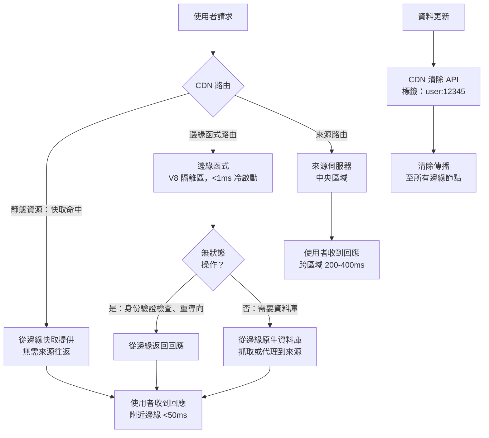

# 多區域與邊緣部署

使用者瀏覽器與提供應用程式資源的伺服器之間的延遲，是效能的基本決定因素。
對於部署在單一區域來源的大多數應用程式，與來源在同一城市的使用者體驗到
50 毫秒以下的來回傳輸時間；而位於地球另一端的使用者每次來回傳輸需要 200
至 400 毫秒——這種差異在每個未快取的請求上都會累積，並在高延遲連線上因
HTTP/2 多路復用效率低下而倍增。

多區域和邊緣部署通過將服務基礎設施在物理上移近使用者來解決這個問題。從
CDN 提供的靜態資源對可快取的內容已具備此屬性。剩餘的延遲暴露在非可快取
的內容：以 `no-cache` 提供的 HTML 文件、API 回應，以及動態伺服器渲染的頁
面。邊緣函式（Edge Functions）——在 CDN 邊緣節點而非中央來源執行的程式碼——
將低延遲服務延伸到這些動態回應。

邊緣函式引入了一種與傳統伺服器部署截然不同的部署模型。邊緣函式在受限的
JavaScript 環境（V8 隔離區）中運行，而非在可存取本地檔案系統和任意 npm
套件的 Node.js 進程中。它們被同時部署到數十或數百個地點。它們在靠近使用
者的位置運行，這也意味著它們遠離來源資料庫——任何需要往返中央資料存儲的
操作，都要在邊緣付出跨區域的完整延遲代價。

本文涵蓋使用 Cloudflare Workers 和 Vercel Edge 的邊緣函式部署模式、基於延
遲的路由策略、地理分區資料的合規要求，以及跨分散式邊緣節點的快取一致性。

## 原則

邊緣函式應該（SHOULD）用於延遲敏感且無狀態或近似無狀態的邏輯：來自 JWT
的身份驗證檢查、基於地理位置的重導向、A/B 測試分配以及 HTML 回應改寫。
邊緣函式禁止（MUST NOT）用於需要資料庫往返的操作，除非該資料庫具備邊緣
原生複製功能（Cloudflare D1、Neon、PlanetScale）。地理分區資料必須（MUST）
遵守適用司法管轄區的資料駐留要求——必須留在特定區域的資料，禁止（MUST NOT）
由在該區域之外運行的邊緣函式處理或儲存。

## 設計思維

### 邊緣執行環境

Cloudflare Workers 和 Vercel Edge Functions 都在 V8 隔離區中執行：輕量級的
JavaScript 執行上下文，啟動時間以毫秒計，沒有 Node.js 標準函式庫的存取權
限，沒有本地檔案系統，也沒有 `fetch()` API 以外的任意網路存取。可用的 API
是 Web Platform API 的子集——`Request`、`Response`、`URL`、`TextEncoder`、
`crypto.subtle` 和 `Cache`——以及平台特定的 API，用於鍵值儲存（Cloudflare KV）、
持久物件和 AI 推論。

V8 隔離區模型的效能特性與 Node.js 不同。Node.js 的冷啟動需要數百毫秒；
V8 隔離區在 1 毫秒以下啟動。沒有冷啟動使邊緣函式適合高頻率的請求處理，
其中每個請求在某段時間內可能是特定邊緣節點上的第一個請求。僅限平台許可
API 的限制意味著許多 npm 套件與邊緣執行環境不相容——依賴 `fs`、`net`、
`http`、`child_process` 或 Node.js 特定緩衝區實作的套件，將無法在邊緣環境
中運行。

Vercel Edge Middleware 在路由之前運行：它可以檢查傳入請求、重寫 URL、添加
標頭，或在請求到達來源之前返回回應。這是進行身份驗證檢查、地理位置路由
和功能旗標評估的標準位置——這些決策需要在每個請求上發生，對延遲敏感，且
不需要資料庫存取。

Cloudflare Workers 可以放置在請求流程的不同位置：作為來源伺服器（處理整
個回應）、作為中間件（轉換後代理到來源）或作為快取處理器（在命中來源之前
從 Cache API 提供服務）。位置決定了延遲特性和操作成本。

邊緣函式的除錯工作流程與 Node.js 服務不同。大多數平台提供本地模擬器——
Cloudflare 的 `wrangler dev` 和 Vercel CLI 的本地開發模式——可以在本地
重現邊緣環境，但完整的全球分發延遲只能在部署後的測試中觀察到。本地模擬
器無法重現所有 V8 隔離區限制；建議在持續整合管線中包含一個針對實際邊緣
環境的冒煙測試步驟，以捕捉只在真實邊緣執行環境中才會出現的相容性問題。
套件相容性是常見的痛點：即使套件在本地模擬器中正常運行，也可能因使用了
在真實 V8 隔離區中不可用的 API 而在生產邊緣環境中失敗。

### 基於延遲的路由

基於延遲的路由根據使用者的地理位置將請求導向最近的可用來源區域。CDN 對
靜態資源自動執行此路由，因為所有邊緣節點快取的是相同的不可變檔案。對於
必須到達來源的動態請求，必須配置 CDN 以路由到最近的來源區域。

Cloudflare 的負載均衡產品根據健康檢查結果和地理距離將流量路由到來源池。
來源按池分組；每個池對應一個部署區域。請求被路由到最近的健康池，以到健
康檢查端點的來回時間為測量標準。如果最近的池不健康，下一個最近的池接收
流量。此故障轉移行為是自動的，不需要手動干預。

Vercel 的部署模型自動將邊緣函式呼叫路由到最近的邊緣區域。部署到 Vercel
Edge 的函式在全球所有 Vercel 邊緣節點上可用；到最近邊緣節點的路由在 CDN
層透明地發生。來源函式（Node.js 伺服器函式）在部署時選擇的特定區域中運行。
對於通過邊緣函式路由某些請求、通過來源函式路由其他請求的應用程式，從邊緣
到來源的往返為來源函式路徑增加了延遲。

基於 DNS 的路由（GeoDNS）是 CDN 層路由的替代方案：DNS 根據客戶端的地理
位置為同一主機名解析不同的 IP 地址。GeoDNS 的精確度低於 CDN 層路由，因
為 DNS 解析可能被帶有不正確地理歸因的 ISP 解析器快取。基於任播（Anycast）
尋址的 CDN 層路由更準確，且不受 DNS 快取問題的影響。

選擇特定的來源區域時，需要平衡三個因素：與主要使用者群體的物理距離、與
資料存儲的網路距離，以及資料主權的法律要求。以歐洲使用者為主的 B2B SaaS
應用程式，通常選擇法蘭克福或都柏林作為主要來源區域——這兩個地點同時滿足
低延遲和 EEA 資料主權的要求。當應用程式需要服務多個洲際市場時，增加第二
個來源區域的效益取決於動態請求（需要往返來源的請求）佔總流量的比例：如
果靜態資源快取命中率已超過 95%，增加來源區域主要改善的是 HTML 文件和 API
呼叫的延遲，對整體效能的邊際效益相對有限。

### 地理分區資料合規

資料駐留法規——歐盟的 GDPR、中國的 PIPL，以及美國的各州級法規——限制了特
定司法管轄區個人資料可以在哪裡處理和儲存。在新加坡邊緣節點運行的邊緣函
式，若處理了關於歐盟公民的個人資料，可能違反 GDPR，如果歐盟要求該資料
僅在 EEA 內處理的話。

邊緣函式的合規方法是資料分類和路由隔離。受駐留要求約束的個人資料必須被
路由到適當區域的邊緣節點。Cloudflare 的管轄區限制功能允許 KV 命名空間和
持久物件限制到特定司法管轄區——寫入受限命名空間的資料只儲存在該司法管轄
區的資料中心。Vercel 不為邊緣函式資料提供等效的管轄區限制；有嚴格駐留要
求的應用程式可能需要路由到特定的來源區域，而非邊緣函式。

身份驗證令牌、Session 識別碼和衍生的使用者屬性通常不受與原始個人資料相
同的駐留限制，因為它們是假名化的表示。具體的法律分類因司法管轄區而異，
必須由應用程式的法律顧問審查。工程團隊不應獨立做出駐留合規決定；適當的
方法是識別哪些資料類別流過邊緣函式，並由法律審查確定適用的要求。

在合規架構尚未釐清的情況下，一個務實的工程保護措施是：對所有包含可辨識
個人資訊的 API 路由，在邊緣層不進行資料修改，只執行路由和標頭操作。實際
的資料讀寫操作均代理至符合合規要求的來源區域。這種「邊緣路由，來源處理」
的模式在合規性和低延遲之間取得平衡：連線建立的延遲改善來自邊緣的 TCP
握手，而資料處理的合規性由來源區域的配置保證。一旦法律審查完成並確定可
以在邊緣直接處理特定類別的資料，再逐步將邏輯移至邊緣。

### 跨邊緣節點的快取一致性

CDN 邊緣節點維護獨立的快取。在一個邊緣節點快取的資源不會自動在另一個節
點上可用。當部署資源的新版本時，清除必須傳播到所有邊緣節點，所有使用者
才能收到更新的版本。在清除傳播窗口期間，不同的邊緣節點可能提供同一資源
的不同版本。

對於帶有內容雜湊檔名的不可變資源，這不是問題：舊 URL 提供舊內容，新 URL
提供新內容。兩者對於引用它們的頁面版本都是正確的。對於可變資源——HTML
入口點、在邊緣快取的 API 回應——快取一致性需要主動管理。

對 API 回應的邊緣側快取引入了自身的一致性挑戰。當底層資料發生變化時，
快取在邊緣節點的 API 回應可能變得過期。邊緣的快取失效需要與 HTML 快取失
效相同的清除 API 機制：資料更新事件必須觸發在所有邊緣節點清除快取的 API
回應。

基於標籤的失效在多區域邊緣部署中特別有價值。當使用者更新其個人資料時，
返回個人資料資料的 API 端點——`/api/user/profile`、`/api/user/settings`、
`/api/user/avatar`——都需要被清除。這些端點可以在 CDN 層用 `user:{userId}`
標記。當個人資料更新時，單次 CDN API 呼叫就能清除全球所有邊緣節點上帶有
`user:{userId}` 標記的所有資源。

設定邊緣快取 TTL 的 `Cache-Control` 標頭必須根據資料變更頻率來選擇。API
回應的 60 秒 TTL 意味著使用者可能看到最多 60 秒前的資料。對於大多數內容，
這是可以接受的。對於即時資料——庫存水平、定價、可用性——可接受的過期時間
可能是秒或更短，使邊緣快取不適用，除非搭配積極的寫入時清除邏輯。

多區域邊緣部署中的快取一致性問題，在多租戶 SaaS 應用程式中特別複雜。租
戶 A 的管理員更新了系統設定；快取在全球邊緣節點的回應需要立即失效，否
則租戶 A 的使用者在其他地區可能看到舊設定，而同地區的使用者已看到新設定。
設計租戶級別的 CDN 快取標籤——例如 `tenant:{tenantId}`——並在每次租戶資料
更新時觸發標籤清除，可以在不影響其他租戶快取的情況下精確地清除特定租戶
的所有快取資源。這種精確性在租戶數量龐大時尤為重要——全域清除的成本隨租
戶數量線性增長，而基於標籤的清除成本是固定的。

邊緣快取的監控應包含分區域的快取命中率和延遲指標。如果某個特定地區的快
取命中率顯著低於其他地區，可能表示該地區的清除傳播延遲更長，或邊緣節點
的快取容量限制導致了更頻繁的驅逐（eviction）。監控這些區域差異，有助於
在使用者受影響之前主動發現並解決問題。

## 最佳實踐

**禁止（MUST NOT）**在邊緣函式中對沒有邊緣原生複製的中央化資料庫執行操
作。不得為了節省單一區域往返延遲而設計需要跨越半個地球回到資料庫的邊緣
架構——從邊緣節點到單一區域資料庫的往返延遲，比在來源執行該函式所節省的
延遲還要多。

**必須（MUST）**在部署之前，根據適用的資料駐留法規對流過邊緣函式的個人
資料進行分類。不得在未經法律審查的情況下假設假名化資料豁免於駐留要求。

**應該（SHOULD）**將邊緣中間件用於無狀態的高頻操作：身份驗證標頭檢查、
地理位置重導向、基於使用者 Cookie 的 A/B 測試分配，以及請求重寫。這些操
作沒有資料庫依賴性，並能最大限度地從在邊緣運行中受益。

**應該（SHOULD）**為邊緣快取的 API 回應配置基於標籤的 CDN 失效。當單一
資料更新事件需要失效多個 URL 時，基於 URL 的失效無法擴展。

**應該（SHOULD）**在承諾邊緣部署之前，測試邊緣函式與邊緣執行環境的相容
性。透過審查邊緣函式中使用的所有 npm 相依套件是否使用 Node.js 特定 API，
驗證它們與 V8 隔離區環境的相容性。

**應該（SHOULD）**按區域監控邊緣函式的錯誤率和延遲。地理位置遙遠區域的
邊緣函式，可能體驗到與主要來源區域不同的錯誤率、冷啟動頻率和延遲。建立
按地理區域分段的效能儀表板，使延遲異常可以被精確定位到特定的邊緣區域，
而非淹沒在全球平均值中。區域性的 P99 延遲監控尤為重要——平均延遲良好但
某一區域的 P99 大幅劣化，往往是邊緣節點資源壓力或網路問題的早期信號。
此外，應設置跨區域的合成監控（synthetic monitoring），定期從不同地理位置
發出測試請求，驗證全球各地的邊緣函式均正常回應，而非僅監控主要區域的
健康狀態。

## 視覺呈現



## 範例

```typescript
// edge-middleware.ts（Vercel Edge Middleware）
// 在路由之前在邊緣運行，處理身份驗證重導向和
// 基於地理位置的路由，無需來源往返。

import { NextRequest, NextResponse } from 'next/server';

export const config = {
  matcher: ['/((?!_next/static|_next/image|favicon.ico).*)'],
};

const EU_COUNTRIES = new Set([
  'AT', 'BE', 'BG', 'CY', 'CZ', 'DE', 'DK', 'EE', 'ES', 'FI',
  'FR', 'GR', 'HR', 'HU', 'IE', 'IT', 'LT', 'LU', 'LV', 'MT',
  'NL', 'PL', 'PT', 'RO', 'SE', 'SI', 'SK',
]);

export function middleware(request: NextRequest): NextResponse {
  const { pathname } = request.nextUrl;

  // 身份驗證檢查：將未驗證的使用者重導向到登入頁面
  // JWT 驗證在邊緣運行——無需資料庫往返
  const sessionToken = request.cookies.get('session')?.value;
  if (!sessionToken && !pathname.startsWith('/login')) {
    return NextResponse.redirect(new URL('/login', request.url));
  }

  // 地理路由：將歐盟使用者路由到符合 GDPR 的資料區域
  // 僅適用於資料存取 API 路由
  const country = request.geo?.country;
  if (country && EU_COUNTRIES.has(country) && pathname.startsWith('/api/data')) {
    // 重寫到歐盟來源區域——資料留在 EEA
    const euOrigin = new URL(request.url);
    euOrigin.hostname = 'eu-api.example.com';
    return NextResponse.rewrite(euOrigin);
  }

  return NextResponse.next();
}
```

## 常見錯誤

- 從邊緣函式對單一區域資料庫執行查詢——從邊緣的資料庫往返比在來源執行
  邏輯增加了更多延遲
- 將具有 Node.js 特定相依性的 npm 套件部署到邊緣執行環境——使用 `fs`、
  `http` 或 Node.js 緩衝區的套件在 V8 隔離區環境中會靜默失敗或在執行時拋出
- 假設所有邊緣節點同時接收到快取清除——清除傳播需要數秒到數分鐘；設計時
  要考慮不同節點提供不同版本的窗口期
- 未審查資料駐留要求就在邊緣函式中處理個人資料——在非 EEA 邊緣節點處理
  的歐盟個人資料可能違反 GDPR，無論資料來源在哪裡
- 在沒有寫入時清除策略的情況下在邊緣快取 API 回應——當底層資料變更而未
  觸發失效時，邊緣快取資料變得過期
- 使用基於 DNS 的 GeoDNS 作為主要路由機制——ISP 解析器的 DNS TTL 快取會
  產生不準確的地理路由；CDN Anycast 更精確

## 相關 FEE

- FEE-1504: Production Deployment: Static Hosting & CDN
- FEE-1505: Deployment Strategies: Canary, Blue-Green & Feature Flags
- FEE-1508: Cache Invalidation at Scale

## 參考資料

- [Cloudflare Workers：文件](https://developers.cloudflare.com/workers/)
- [Vercel：Edge Middleware](https://vercel.com/docs/functions/edge-middleware)
- [Cloudflare：管轄區限制](https://developers.cloudflare.com/data-localization/regional-services/)
- [Fastly：Compute@Edge 文件](https://developer.fastly.com/learning/compute/)
- [web.dev：內容傳遞網路（CDN）](https://web.dev/content-delivery-networks/)
- [GDPR：資料傳輸限制](https://gdpr-info.eu/chapter-5/)
- [Cloudflare：Workers KV 文件](https://developers.cloudflare.com/kv/)
- [Neon：無伺服器 Postgres 多區域](https://neon.tech/docs/introduction/regions)
- [AWS CloudFront：使用 Lambda@Edge](https://docs.aws.amazon.com/AmazonCloudFront/latest/DeveloperGuide/lambda-at-the-edge.html)
- [web.dev：量測真實使用者效能](https://web.dev/vitals-field-measurement-best-practices/)
- [PlanetScale：全球資料庫](https://planetscale.com/docs/concepts/regions)
- [Cloudflare：Durable Objects 文件](https://developers.cloudflare.com/durable-objects/)
- [WinterCG：Web 互通執行環境規範](https://wintercg.org/)
