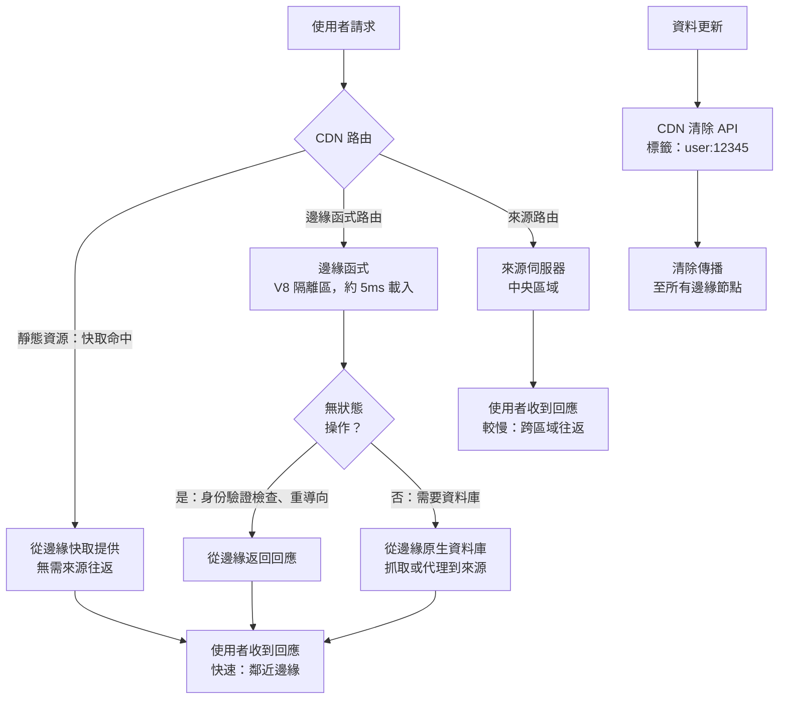

# [FEE-1510] 多區域與邊緣部署

:::info
對於遠離單一區域來源的使用者，每個未快取的請求都要付出完整的網路來回延遲。與來源同屬同一大陸的使用者，來回時間通常落在數十毫秒的量級；位於地球另一端的使用者，來回時間則可能高出一個數量級。CDN 消弭了靜態資源的這道落差，因為同一份快取檔案存在於每個邊緣節點上。剩餘的延遲來自動態、不可快取的內容，而邊緣函式正是本文用來檢視如何縮小這道落差的機制。
:::

## 背景

對可快取的內容而言，CDN 提供的靜態資源已具備這項特性：同一份不可變檔案存在於全球各邊緣節點，因此與來源的距離不再重要。剩餘的延遲暴露在不可快取的內容上：以 `no-cache` 提供的 HTML 文件、API 回應，以及動態伺服器渲染的頁面。邊緣函式縮小了這道落差。它們在 CDN 邊緣節點而非中央來源執行應用程式程式碼，將低延遲服務延伸到這些動態回應。

邊緣函式引入的部署模型，在幾個具體面向上不同於傳統伺服器部署。它們在受限的 JavaScript 環境（V8 隔離區）中執行，而非在可存取本地檔案系統與任意 npm 套件的 Node.js 進程中執行。它們會同時部署到數十或數百個地點。而且因為它們靠近使用者執行，也就代表它們遠離來源資料庫：任何需要往返中央資料存儲的操作，都要在邊緣付出完整的跨區域延遲代價。

本文涵蓋 Cloudflare Workers、Deno Deploy、Netlify Edge Functions 以及 Vercel Routing Middleware 上的邊緣函式部署模式、基於延遲的路由策略、地理分區資料的合規要求，以及跨分散式邊緣節點的快取一致性。

## 視覺對比



## 範例

以下範例展示 Vercel Routing Middleware（這是 Vercel 先前稱為 Edge Middleware 之功能的現行名稱）執行的兩項適合在邊緣進行的檢查：身份驗證重導向，以及符合 GDPR 規範的地理路由重寫。Routing Middleware 執行於 Fluid Compute 之上，預設使用 Edge runtime，並在快取與其餘路由邏輯之前執行。

較舊的教學文件會直接從 `NextRequest` 讀取 `request.geo?.country`。Next.js 15 已將 `geo` 與 `ip` 兩者從 `NextRequest` 中移除；替代方案位於 `@vercel/functions` 套件中的 `geolocation()` 與 `ipAddress()`，兩者讀取的是 Vercel 在邊緣填入的同一組請求標頭。沿用舊版 `request.geo` API 撰寫的程式碼，在任何目前版本的 Next.js 上都會靜默回傳 `undefined`，導致下方的地理路由分支永遠不會觸發，歐盟流量也就永遠不會被重寫到歐盟來源。

```typescript
// middleware.ts（Vercel Routing Middleware）
// 在路由之前於邊緣執行，處理身份驗證重導向與
// 地理路由，無需來源往返。

import { NextRequest, NextResponse } from 'next/server';
import { geolocation } from '@vercel/functions';

export const config = {
  matcher: ['/((?!_next/static|_next/image|favicon.ico).*)'],
};

const EU_COUNTRIES = new Set([
  'AT', 'BE', 'BG', 'CY', 'CZ', 'DE', 'DK', 'EE', 'ES', 'FI',
  'FR', 'GR', 'HR', 'HU', 'IE', 'IT', 'LT', 'LU', 'LV', 'MT',
  'NL', 'PL', 'PT', 'RO', 'SE', 'SI', 'SK',
]);

export function middleware(request: NextRequest): NextResponse {
  const { pathname } = request.nextUrl;

  // 身份驗證檢查：將未驗證的使用者重導向到登入頁面。
  // JWT 驗證在邊緣執行；無需資料庫往返。
  const sessionToken = request.cookies.get('session')?.value;
  if (!sessionToken && !pathname.startsWith('/login')) {
    return NextResponse.redirect(new URL('/login', request.url));
  }

  // 地理路由：將歐盟使用者路由到符合 GDPR 規範的資料區域。
  // 僅適用於資料存取 API 路由。
  const { country } = geolocation(request);
  if (country && EU_COUNTRIES.has(country) && pathname.startsWith('/api/data')) {
    // 重寫到歐盟來源區域。資料留在 EEA 內。
    const euOrigin = new URL(request.url);
    euOrigin.hostname = 'eu-api.example.com';
    return NextResponse.rewrite(euOrigin);
  }

  return NextResponse.next();
}
```

## 最佳實踐

**禁止（MUST NOT）**讓每一次邊緣函式呼叫都直接送往沒有連線池或快取層的單一區域資料庫。從邊緣節點到遙遠區域資料庫的往返延遲，比在來源執行該邏輯所省下的延遲還要多。連線池代理或具邊緣感知能力的資料庫驅動程式可以縮小這道落差，但兩者都無法完全消除它。

**必須（MUST）**在部署之前，根據適用的資料駐留法規對流過邊緣函式的個人資料進行分類，並確認所使用之儲存產品的管轄區控制實際涵蓋的範圍。Cloudflare 的管轄區限制功能適用於 Durable Objects，不適用於 Workers KV。不要假設某項產品自身文件未明載的駐留保證存在。

**應該（SHOULD）**將邊緣中間件用於無狀態、高頻率的操作：身份驗證標頭檢查、地理位置重導向、基於使用者 Cookie 的 A/B 測試分配，以及請求重寫。無論中間件實際執行在哪一種 runtime 上，這些操作都能從在邊緣運行中獲得最大效益。

**應該（SHOULD）**為邊緣快取的 API 回應配置基於標籤的 CDN 失效。當單一資料更新事件需要失效多個 URL 時，基於 URL 的失效無法擴展。

**應該（SHOULD）**在承諾邊緣部署之前，測試邊緣函式與邊緣執行環境的相容性。透過審查邊緣函式中使用的所有 npm 相依套件是否使用 Node.js 特定 API，驗證它們與 V8 隔離區環境的相容性。

**應該（SHOULD）**按區域監控邊緣函式的錯誤率和延遲。地理位置遙遠區域的邊緣函式，可能體驗到與主要來源區域不同的錯誤率、冷啟動頻率和延遲。

**禁止（MUST NOT）**在邊緣函式中處理或儲存受地理分區限制的個人資料，除非該邊緣節點位於適用司法管轄區所要求的地區內。受資料駐留要求約束的資料，不得在不符合規定的邊緣節點上進行處理或儲存，必須專門路由至適用區域內的邊緣節點，或代理至符合合規要求的來源區域；無論資料來自何處，在不符合規定的邊緣位置進行處理，均違反適用的資料駐留法規。

## 設計思維

### 邊緣執行環境

Cloudflare Workers、Deno Deploy，以及執行於 Deno Deploy 之上的 Netlify Edge Functions，都在 V8 隔離區中執行：輕量級的 JavaScript 執行環境，沒有 Node.js 標準函式庫的存取權限，沒有本地檔案系統，也沒有 `fetch()` API 以外的任意網路存取。可用的 API 是 Web Platform API 的子集（`Request`、`Response`、`URL`、`TextEncoder`、`crypto.subtle` 與 `Cache`），再加上平台特定的 API，用於鍵值儲存（Cloudflare KV）、持久物件與 AI 推論。Vercel Routing Middleware 預設使用同樣以隔離區為基礎的 Edge runtime，不過也可以設定為執行在 Node.js 或 Bun 上。

隔離區模型的效能特性，與以容器為基礎的 Node.js 部署不同。Cloudflare 表示，一個 Worker 大約需要 5 毫秒載入，而這段載入時間通常對用戶端來說是無感的，因為它與 TLS 交握的兩次來回重疊：連線協商期間，隔離區同步完成暖機。這項特性仰賴隔離區維持精簡。2020 年至 2025 年間，Cloudflare 將 Workers 的啟動 CPU 預算從 200 毫秒提高到 400 毫秒，指令碼大小上限也從壓縮後 1MB 提高到 10MB，愈趨複雜的 Worker 開始需要比交握完成更長的啟動時間。Cloudflare 在 2025 年提出的修正方案「worker sharding」，會將特定 Worker 的重複流量導向已經預熱該 Worker 的伺服器；Cloudflare 表示，此舉將實測冷啟動比率從約 0.1% 降至 0.01% 的請求。無論載入時間長短，僅限平台許可 API 的限制依然適用：許多 npm 套件依賴 `fs`、`net`、`http`、`child_process`，或 Node.js 特定的緩衝區實作，這些都無法在 V8 隔離區中執行。

Routing Middleware 在快取與路由之前執行：它可以檢查傳入的請求、重寫 URL、添加標頭，或在請求到達來源之前直接返回回應。這是進行身份驗證檢查、地理位置路由與功能旗標評估的標準位置，這些決策需要在每個請求上發生，且對延遲敏感。執行在 Fluid Compute 上的中間件現在也能開啟資料庫連線，不過連往遠離呼叫區域之資料庫的連線，仍要付出該區域的往返代價。為此落差打造的工具，包括連線池代理（例如 Cloudflare Hyperdrive），或是來自專為邊緣存取設計之資料庫的 HTTP 式無伺服器驅動程式（Neon 的無伺服器驅動程式、Turso 的 libSQL 客戶端、PlanetScale），能降低單一請求的連線開銷，但無法消除距離本身。

Cloudflare Workers 可以放置在請求流程的不同位置：作為來源伺服器（處理整個回應）、作為中間件（轉換後代理到來源），或作為快取處理器（在命中來源之前從 Cache API 提供服務）。位置決定了延遲特性與操作成本。

### 基於延遲的路由

基於延遲的路由根據使用者的地理位置將請求導向最近的可用來源區域。CDN 對靜態資源自動執行此路由，因為所有邊緣節點快取的是相同的不可變檔案。對於必須到達來源的動態請求，必須配置 CDN 以路由到最近的來源區域。

Cloudflare 的負載均衡產品根據健康檢查結果和地理距離將流量路由到來源池。來源按池分組；每個池對應一個部署區域。請求被路由到最近的健康池，以到健康檢查端點的來回時間為測量標準。如果最近的池不健康，下一個最近的池接收流量。此故障轉移行為是自動的，不需要手動干預。

Vercel 的部署模型自動將邊緣函式呼叫路由到最近的邊緣區域。部署到 Edge runtime 的函式在全球所有 Vercel 邊緣節點上可用；到最近邊緣節點的路由在 CDN 層透明地發生。執行在 Node.js runtime 上的函式，則在部署時選擇的特定區域中運行。對於通過邊緣函式路由某些請求、通過 Node.js 函式路由其他請求的應用程式，從邊緣到遙遠 Node.js 區域的往返，為該路徑增加了延遲。

基於 DNS 的路由（GeoDNS）是 CDN 層路由的替代方案：DNS 根據客戶端的地理位置為同一主機名解析不同的 IP 地址。GeoDNS 的精確度低於 CDN 層路由，因為 DNS 解析可能被帶有不正確地理歸因的 ISP 解析器快取。基於任播（Anycast）尋址的 CDN 層路由更準確，且不受 DNS 快取問題的影響。

選擇主要來源區域需要平衡三個因素：與最大使用者群體的物理距離、與來源資料庫的網路距離，以及法律上的資料主權要求。以歐洲使用者為主的 B2B SaaS 應用程式，通常選擇法蘭克福或都柏林作為主要來源區域。這兩個地點同時滿足低延遲與 EEA 資料主權的要求。當應用程式需要服務多個洲際市場時，增加第二個來源區域的效益，取決於必須抵達來源、而非由 CDN 邊緣快取提供服務的流量比例。若 CDN 靜態資源快取命中率已超過 95%，增加第二個來源區域主要改善的是 HTML 文件與 API 呼叫的延遲，其相對於運營複雜度的邊際效益，則必須明確評估。

### 地理分區資料合規

資料駐留法規限制了特定司法管轄區的個人資料可以在哪裡處理與儲存。歐盟的 GDPR、中國的 PIPL，以及美國的各州級法規，是多數邊緣部署最常遇到的規範。在新加坡邊緣節點運行的邊緣函式，若處理了歐盟公民的個人資料，且歐盟要求該資料僅能在 EEA 內處理，就可能違反 GDPR。

邊緣函式的合規方法是資料分類與路由隔離，實際採用的機制則取決於資料存放在哪一種儲存產品上。Cloudflare 的管轄區限制功能可以將 Durable Object 命名空間固定於 `eu`、`us` 或 `fedramp` 管轄區；透過該管轄區建立的命名空間所寫入的資料，只會儲存與處理在該區域的資料中心。Workers KV 沒有對等的逐命名空間控制：KV 依設計是全球複寫的，因此把歐盟個人資料寫入 KV 命名空間、並假設它會留在歐盟境內，是錯誤的認知，會造成真實的 GDPR 風險。有 KV 型資料駐留需求的團隊，應該讓這類資料完全不進入 KV，改為代理至符合合規要求的來源。也可以搭配 Cloudflare 的 Data Localization Suite 功能一併使用：Regional Services 控制 HTTPS 流量在何處解密與處理，Customer Metadata Boundary 則讓流量中繼資料保留在特定區域內。這些功能需要與正確的儲存產品搭配，不能單獨拿來取代選擇正確儲存產品這個判斷。Vercel 並未針對邊緣函式資料提供對等的管轄區限制功能；有嚴格駐留要求的應用程式，可能需要路由到特定的來源區域，而非邊緣函式。

身份驗證令牌、Session 識別碼和衍生的使用者屬性通常不受與原始個人資料相同的駐留限制，因為它們是假名化的表示。具體的法律分類因司法管轄區而異，必須由應用程式的法律顧問審查。工程團隊不應獨立做出駐留合規決定。適當的方法是識別哪些資料類別流過邊緣函式，並由法律審查確定適用的要求。

### 跨邊緣節點的快取一致性

CDN 邊緣節點維護獨立的快取。在一個邊緣節點快取的資源不會自動在另一個節點上可用。當部署資源的新版本時，清除必須傳播到所有邊緣節點，所有使用者才能收到更新的版本。在清除傳播窗口期間，不同的邊緣節點可能提供同一資源的不同版本。

對於帶有內容雜湊檔名的不可變資源，這不是問題：舊 URL 提供舊內容，新 URL 提供新內容，兩者對於引用它們的頁面版本都同樣正確。可變資源，例如 HTML 入口點與在邊緣快取的 API 回應，才是需要主動管理快取一致性的情況。

對 API 回應的邊緣側快取引入了自身的一致性挑戰。當底層資料發生變化時，快取在邊緣節點的 API 回應可能變得過期。邊緣的快取失效需要與 HTML 快取失效相同的清除 API 機制：資料更新事件必須觸發在所有邊緣節點清除快取的 API 回應。

基於標籤的失效在多區域邊緣部署中特別有價值。當使用者更新其個人資料時，返回個人資料資料的 API 端點（`/api/user/profile`、`/api/user/settings`、`/api/user/avatar`）都需要被清除。這些端點可以在 CDN 層用 `user:{userId}` 標記。當個人資料更新時，單次 CDN API 呼叫就能清除全球所有邊緣節點上帶有 `user:{userId}` 標記的所有資源。

設定邊緣快取 TTL 的 `Cache-Control` 標頭必須根據資料變更頻率來選擇。API 回應的 60 秒 TTL 意味著使用者可能看到最多 60 秒前的資料，對於大多數內容，這是可以接受的。對於即時資料，例如庫存水平、定價、可用性，可接受的過期時間可能是秒或更短，使邊緣快取不適用，除非搭配積極的寫入時清除邏輯。

## 失效模式

- 從邊緣函式對單一區域資料庫執行查詢：會觸及資料庫的請求，延遲尖峰會集中在距離該資料庫最遠的區域，而由同一批邊緣節點快取提供服務的請求則維持快速。這會在延遲指標上呈現為按區域劃分的落差，而不是全域性的變慢。
- 將具有 Node.js 特定相依性的 npm 套件部署到邊緣執行環境：部署要嘛在建置時因 `fs`、`http` 或類似的內建模組出現「找不到模組」錯誤而失敗，要嘛（若打包工具未能攔截到）在函式第一次執行到不支援的 API 時拋出執行期錯誤。
- 假設所有邊緣節點會同時收到快取清除：在清除呼叫回傳成功之後的一段時間內，不同區域的使用者對同一個 URL 會看到不同的內容。清除 API 確認請求已被接受，不代表確認傳播已在所有節點完成。
- 未審查資料駐留要求就在邊緣函式中處理個人資料：這種情況沒有任何錯誤或日誌訊號。函式會在它實際執行的任何地方運行，違規行為要到之後的稽核或主管機關詢問時才會浮現，而不是出現在應用程式日誌中。
- 在沒有寫入時清除策略的情況下於邊緣快取 API 回應：客戶端看到的資料，會在最長達 TTL 的時間內與剛寫入的資料不一致，且日誌中沒有任何跡象標示這是錯誤的。
- 使用基於 DNS 的 GeoDNS 作為主要路由機制：一部分使用者會持續被導向遙遠的區域，這與特定 ISP 解析器相關，而非特定地理位置，因為該解析器快取了過期的地理對應。

## 延伸閱讀

- [正式環境部署：靜態託管與 CDN](/zh-tw/CI%20CD%20and%20Deployment/1504)
- [部署策略：金絲雀、藍綠部署與功能旗標](/zh-tw/CI%20CD%20and%20Deployment/1505)
- [大規模快取失效](/zh-tw/CI%20CD%20and%20Deployment/1508)

## 參考資料

- [Cloudflare Workers：文件](https://developers.cloudflare.com/workers/)
- [Cloudflare：以 Cloudflare Workers 消除冷啟動](https://blog.cloudflare.com/eliminating-cold-starts-with-cloudflare-workers/)
- [Cloudflare：消除冷啟動之二：Shard 與征服](https://blog.cloudflare.com/eliminating-cold-starts-2-shard-and-conquer/)
- [Cloudflare：Durable Objects 管轄區限制](https://developers.cloudflare.com/durable-objects/reference/data-location/)
- [Cloudflare：Data Localization Suite](https://developers.cloudflare.com/data-localization/)
- [Cloudflare：Hyperdrive](https://developers.cloudflare.com/hyperdrive/)
- [Vercel：Routing Middleware](https://vercel.com/docs/routing-middleware)
- [Vercel：@vercel/functions API 參考（geolocation）](https://vercel.com/docs/functions/functions-api-reference/vercel-functions-package)
- [Deno Deploy](https://deno.com/deploy)
- [Netlify：Edge Functions 總覽](https://docs.netlify.com/build/edge-functions/overview/)
- [Fastly：Compute 文件](https://www.fastly.com/documentation/guides/compute)
- [web.dev：內容傳遞網路（CDN）](https://web.dev/content-delivery-networks/)
- [GDPR：資料傳輸限制](https://gdpr-info.eu/chapter-5/)
