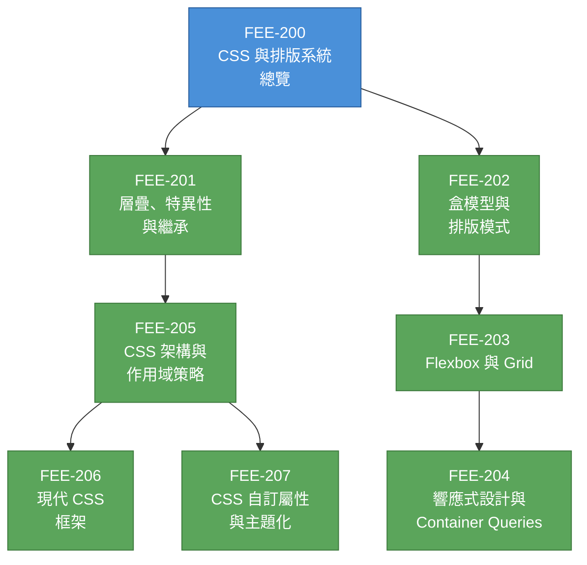

# [FEE-200] CSS 與排版系統總覽

:::info
本類別涵蓋 CSS 作為宣告式樣式語言的全貌 -- 從層疊（cascade）與盒模型（box model）基礎，到現代排版系統、響應式技術、架構策略，以及透過自訂屬性（custom properties）實現主題化。
:::

## 背景

Cascading Style Sheets（層疊樣式表）是 Web 上唯一的樣式語言。網頁上的每個視覺面向 -- 顏色、間距、字型、排版、動畫 -- 最終都以 CSS 表達。對前端工程師而言，理解 CSS 並非選修；它與理解 HTML 結構或 JavaScript 行為同樣基礎。

CSS 誕生於一個具體的需求。1994 年，早期的 Web 沒有將文件呈現與結構分離的機制。Hakon Wium Lie 在 CERN 與 Tim Berners-Lee 共事期間，於 1994 年 10 月 10 日提出了「Cascading HTML Style Sheets」提案。其關鍵創新是**層疊（cascade）**：一套讓來自不同來源的多個樣式表（瀏覽器預設、使用者偏好、作者樣式）各自貢獻規則，並以定義好的演算法解決衝突的系統。這種協商式呈現的概念 -- 而非作者的絕對控制 -- 至今仍是 CSS 的核心。

### 演進歷程

| 時代 | 年份 | 變革 |
|------|------|------|
| **CSS1** | 1996 | 首個 W3C 推薦標準。字型、顏色、文字、基礎盒模型。 |
| **CSS2** | 1998 | 定位、z-index、媒體類型、屬性選擇器。 |
| **CSS2.1** | 2004-2011 | 勘誤與修正，反映實際瀏覽器行為。 |
| **CSS3 模組化** | 2011+ | 放棄單體規範。各模組（Selectors L3、Flexbox、Grid 等）獨立推進。 |
| **現代 CSS** | 2022+ | Cascade layers、container queries、`:has()`、nesting、subgrid、view transitions。 |

CSS2.1 之後發生了關鍵轉變：W3C 不再將 CSS 作為單一規範開發。每個功能領域成為獨立的**模組（module）**，各有自己的級別編號。不存在所謂的「CSS4」-- 存在的是 CSS Color Level 4、CSS Grid Level 2、CSS Nesting Level 1 等。W3C CSS Snapshot（最近一版為 2023，2025 版正在進行中）定期將穩定模組匯集為單一參考文件。

### 為什麼前端工程師需要理解 CSS

框架抽象了標記與邏輯，但並未抽象 CSS。無論你寫的是 Tailwind 工具類別、CSS Modules 還是 styled-components，你仍然在撰寫 CSS 規則，而瀏覽器必須透過層疊來解讀、計算為盒模型、並解析為排版。當排版壞掉或樣式洩漏到其他元件時，除錯需要理解底層語言 -- 而非抽象層。

## 設計思維

### 為什麼 CSS 是獨立於 HTML/JS 的語言

Web 平台建立在刻意的**關注點分離（separation of concerns）**之上：

- **HTML** 宣告結構與語意（內容*是*什麼）
- **CSS** 宣告呈現（內容*看起來*如何）
- **JavaScript** 宣告行為（內容*如何回應*互動）

這種分離並非偶然。CSS 是一種**宣告式（declarative）**語言：你描述約束條件與期望的結果，而非逐步的繪圖指令。這種設計帶來：

1. **來自不同來源的多個樣式表。** 層疊演算法將瀏覽器預設、使用者偏好與作者樣式合併為單一計算結果。命令式繪圖 API 無法從獨立來源組合樣式。

2. **媒體適應。** 同一份 HTML 可以針對螢幕、列印、小視窗或高對比模式套用不同樣式 -- 透過替換或疊加樣式表，而非重寫邏輯。

3. **無障礙性（accessibility）。** 使用者可以覆寫作者樣式（例如強制色彩模式、自訂字型大小），因為 CSS 規則是參與優先權系統的*建議*，而非絕對命令。

4. **效能。** 瀏覽器能以命令式繪圖不可能的方式最佳化宣告式樣式系統。樣式重新計算、排版批次處理、以及合成器驅動的動畫都依賴 CSS 的宣告式本質。

### 為什麼 CSS 感覺「很難」

CSS 以不可預測聞名。這並非因為 CSS 設計不良 -- 而是因為 CSS 是一套**基於約束的排版系統（constraint-based layout system）**，而非命令式繪圖 API。

當你寫下 `display: flex; justify-content: center` 時，你並非告訴瀏覽器「把這個元素放在 x=200, y=150」。你在宣告約束條件，瀏覽器的排版引擎會同時求解滿足所有約束的位置 -- 包括你的規則、內容的固有尺寸、視窗尺寸，以及其他元素的約束。

這意味著：
- **上下文很重要。** 相同的規則在不同的父元素排版模式、兄弟元素和可用空間下會產生不同結果。
- **交互作用是組合性的。** 屬性不會獨立作用；`width`、`padding`、`border`、`box-sizing`、`flex-shrink` 和 `overflow` 都會相互影響。
- **除錯需要理解系統**，而非僅理解屬性。你無法在不理解層疊、特異性（specificity）、繼承、盒模型和當前排版演算法的情況下推理單一 CSS 規則。

本類別的文章將系統性地建構這些理解。

## 圖解

**閱讀順序：** 從層疊（201）與盒模型（202）開始 -- 這是其他所有內容的基礎。排版（203）與響應式設計（204）自然接續。架構（205）與框架（206）處理在實際專案中擴展 CSS 的問題。自訂屬性（207）可以在理解層疊之後的任何時間點閱讀。

## 相關 FEE

| FEE | 關聯 |
|-----|------|
| [FEE-100 HTML 與語意標記](../HTML%20and%20Semantic%20Markup/100.md) | CSS 為 HTML 提供的結構添加樣式。理解語意 HTML 有助於撰寫有意義且可維護的選擇器。 |
| [FEE-300 JavaScript 核心與執行環境](../JavaScript%20Core%20and%20Runtime/300.md) | JS 在執行期操作樣式（CSSOM、動畫、動態主題）。獨立理解 CSS 可避免過度依賴 JS 來處理樣式。 |
| [FEE-500 元件架構](../Component%20Architecture%20and%20Design%20Patterns/500.md) | 元件模型（Web Components、React、Vue）各有不同的 CSS 作用域策略。FEE-205 的架構決策直接影響元件設計。 |

## 參考資料

- [W3C CSS Snapshot 2023](https://www.w3.org/TR/css-2023/) -- 穩定 CSS 模組及其狀態級別的權威列表
- [MDN: CSS - Cascading Style Sheets](https://developer.mozilla.org/en-US/docs/Web/CSS) -- 所有 CSS 模組的綜合參考與學習資源
- [W3C: A Brief History of CSS](https://www.w3.org/Style/CSS20/history.html) -- CSS 從 CERN 起源到 CSS3 模組化的官方歷史
- [Hakon Wium Lie, PhD Thesis: Cascading Style Sheets](https://www.wiumlie.no/2006/phd/) -- 原始設計者對層疊概念及其設計理念的學術論述
- [W3C: CSS Process - Levels, Snapshots, Modules](https://www.w3.org/Style/2011/CSS-process.en.html) -- CSS 規範如何開發與版本管理的說明
